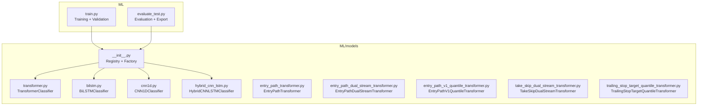
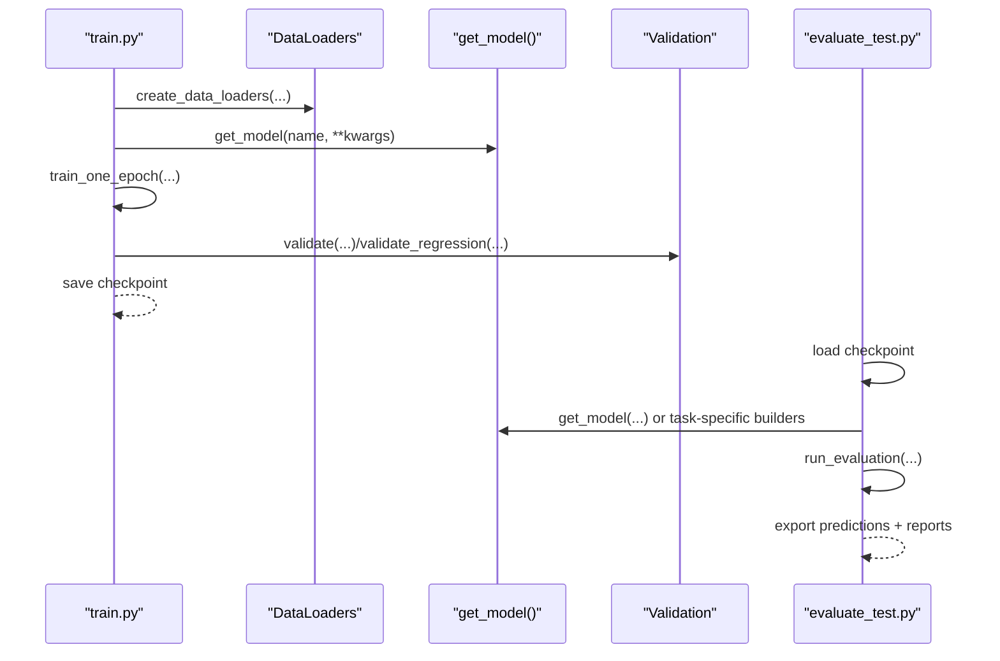
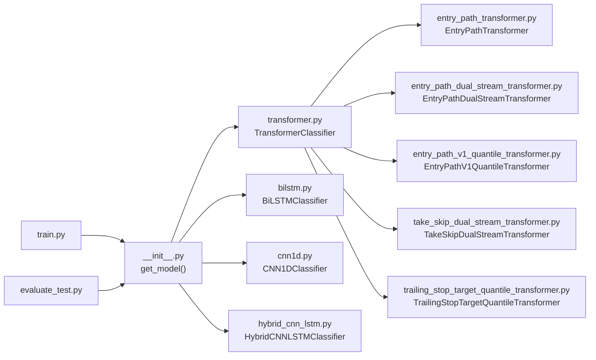

# Model Architectures

<cite>
**Referenced Files in This Document**
- [__init__.py](file://ML/models/__init__.py)
- [transformer.py](file://ML/models/transformer.py)
- [bilstm.py](file://ML/models/bilstm.py)
- [cnn1d.py](file://ML/models/cnn1d.py)
- [hybrid_cnn_lstm.py](file://ML/models/hybrid_cnn_lstm.py)
- [entry_path_dual_stream_transformer.py](file://ML/models/entry_path_dual_stream_transformer.py)
- [entry_path_transformer.py](file://ML/models/entry_path_transformer.py)
- [entry_path_v1_quantile_transformer.py](file://ML/models/entry_path_v1_quantile_transformer.py)
- [take_skip_dual_stream_transformer.py](file://ML/models/take_skip_dual_stream_transformer.py)
- [trailing_stop_target_quantile_transformer.py](file://ML/models/trailing_stop_target_quantile_transformer.py)
- [train.py](file://ML/train.py)
- [evaluate_test.py](file://ML/evaluate_test.py)
</cite>

## Table of Contents
1. [Introduction](#introduction)
2. [Project Structure](#project-structure)
3. [Core Components](#core-components)
4. [Architecture Overview](#architecture-overview)
5. [Detailed Component Analysis](#detailed-component-analysis)
6. [Dependency Analysis](#dependency-analysis)
7. [Performance Considerations](#performance-considerations)
8. [Troubleshooting Guide](#troubleshooting-guide)
9. [Conclusion](#conclusion)

## Introduction
This document describes the machine learning model architectures used in the SoSimple trading system. It covers the transformer-based encoder, bidirectional LSTM, and 1D CNN implementations, along with specialized dual-stream transformers for entry path analysis, quantile-based models for probabilistic predictions, and execution policy transformers. It explains the model registry and factory pattern, how different architectures handle sequence modeling for financial time series, and provides technical specifications, parameter configurations, and performance characteristics.

## Project Structure
The model implementations reside under ML/models and are complemented by training and evaluation scripts that demonstrate usage and inference patterns.

**Diagram sources**
- [__init__.py:17-49](file://ML/models/__init__.py#L17-L49)
- [transformer.py:78-199](file://ML/models/transformer.py#L78-L199)
- [bilstm.py:30-113](file://ML/models/bilstm.py#L30-L113)
- [cnn1d.py:30-123](file://ML/models/cnn1d.py#L30-L123)
- [hybrid_cnn_lstm.py:29-137](file://ML/models/hybrid_cnn_lstm.py#L29-L137)
- [entry_path_transformer.py:7-116](file://ML/models/entry_path_transformer.py#L7-L116)
- [entry_path_dual_stream_transformer.py:7-134](file://ML/models/entry_path_dual_stream_transformer.py#L7-L134)
- [entry_path_v1_quantile_transformer.py:13-125](file://ML/models/entry_path_v1_quantile_transformer.py#L13-L125)
- [take_skip_dual_stream_transformer.py:24-92](file://ML/models/take_skip_dual_stream_transformer.py#L24-L92)
- [trailing_stop_target_quantile_transformer.py:7-76](file://ML/models/trailing_stop_target_quantile_transformer.py#L7-L76)
- [train.py:114-129](file://ML/train.py#L114-L129)
- [evaluate_test.py:52-76](file://ML/evaluate_test.py#L52-L76)

**Section sources**
- [__init__.py:17-49](file://ML/models/__init__.py#L17-L49)
- [train.py:114-129](file://ML/train.py#L114-L129)
- [evaluate_test.py:52-76](file://ML/evaluate_test.py#L52-L76)

## Core Components
- Registry and Factory: A central registry maps model names to classes and provides a factory function to instantiate models with kwargs.
- Base Architectures:
  - Transformer Encoder with CLS token and positional encoding.
  - Bidirectional LSTM with pooling.
  - 1D CNN with block-wise convolutions and global average pooling.
  - Hybrid CNN+LSTM combining local pattern extraction with temporal aggregation.
- Specialized Multi-Task Transformers:
  - Entry path transformers with engineered features fusion and time-wise sequence pooling.
  - Entry path quantile transformer with quantile heads.
  - Execution policy transformers for dual-stream processing and multi-output heads.
- Training and Evaluation Orchestration:
  - Unified training/validation loops supporting classification, regression, multitask entry path, and quantile tasks.
  - Evaluation pipeline loads checkpoints, runs inference, and exports predictions and reports.

**Section sources**
- [__init__.py:22-49](file://ML/models/__init__.py#L22-L49)
- [transformer.py:78-199](file://ML/models/transformer.py#L78-L199)
- [bilstm.py:30-113](file://ML/models/bilstm.py#L30-L113)
- [cnn1d.py:30-123](file://ML/models/cnn1d.py#L30-L123)
- [hybrid_cnn_lstm.py:29-137](file://ML/models/hybrid_cnn_lstm.py#L29-L137)
- [entry_path_transformer.py:7-116](file://ML/models/entry_path_transformer.py#L7-L116)
- [entry_path_dual_stream_transformer.py:7-134](file://ML/models/entry_path_dual_stream_transformer.py#L7-L134)
- [entry_path_v1_quantile_transformer.py:13-125](file://ML/models/entry_path_v1_quantile_transformer.py#L13-L125)
- [take_skip_dual_stream_transformer.py:24-92](file://ML/models/take_skip_dual_stream_transformer.py#L24-L92)
- [trailing_stop_target_quantile_transformer.py:7-76](file://ML/models/trailing_stop_target_quantile_transformer.py#L7-L76)
- [train.py:176-809](file://ML/train.py#L176-L809)
- [evaluate_test.py:154-493](file://ML/evaluate_test.py#L154-L493)

## Architecture Overview
The SoSimple system employs a shared interface across models: forward(x, mask=None) returning logits. The registry/factory enables dynamic selection of architectures during training and evaluation. Specialized models add multi-task heads and fusion mechanisms tailored to entry path analysis, quantile regression, and execution policies.

```mermaid
classDiagram
class TransformerClassifier {
+forward(x, mask=None) Tensor
-input_projection
-cls_token
-pos_encoding
-transformer_encoder
-classifier
}
class BiLSTMClassifier {
+forward(x, mask=None) Tensor
-lstm
-classifier
}
class CNN1DClassifier {
+forward(x, mask=None) Tensor
-block1
-block2
-block3
-global_avg_pool
-classifier
}
class HybridCNNLSTMClassifier {
+forward(x, mask=None) Tensor
-cnn
-lstm
-classifier
}
class EntryPathTransformer {
+forward(x, engineered, mask=None) dict
-input_projection
-cls_token
-pos_encoding
-transformer_encoder
-entry_path_projection
-ret_head
-path_reg_head
-path_cls_sequence_proj
-path_cls_time_pool
-path_cls_head
}
class EntryPathDualStreamTransformer {
+forward(x, engineered, mask=None) dict
-input_projection
-cls_token
-pos_encoding
-transformer_encoder
-engineered_encoder
-fusion
-path_cls_sequence_proj
-path_cls_time_pool
-path_cls_fusion
-ret_head
-path_reg_head
-path_cls_head
}
class EntryPathV1QuantileTransformer {
+forward(x, mask=None) dict
-input_projection
-cls_token
-pos_encoding
-transformer_encoder
-ret_head
-path_reg_head
-path_cls_sequence_proj
-path_cls_time_pool
-path_cls_head
-ret_q10_head
-ret_q90_head
}
class TakeSkipDualStreamTransformer {
+forward(x, engineered, mask=None) Tensor
-input_projection
-cls_token
-pos_encoding
-transformer_encoder
-engineered_encoder
-fusion
}
class TrailingStopTargetQuantileTransformer {
+forward(x, mask=None) dict
-input_projection
-cls_token
-pos_encoding
-transformer_encoder
-q10_head
-q50_head
-q90_head
}
```

**Diagram sources**
- [transformer.py:78-199](file://ML/models/transformer.py#L78-L199)
- [bilstm.py:30-113](file://ML/models/bilstm.py#L30-L113)
- [cnn1d.py:30-123](file://ML/models/cnn1d.py#L30-L123)
- [hybrid_cnn_lstm.py:29-137](file://ML/models/hybrid_cnn_lstm.py#L29-L137)
- [entry_path_transformer.py:7-116](file://ML/models/entry_path_transformer.py#L7-L116)
- [entry_path_dual_stream_transformer.py:7-134](file://ML/models/entry_path_dual_stream_transformer.py#L7-L134)
- [entry_path_v1_quantile_transformer.py:13-125](file://ML/models/entry_path_v1_quantile_transformer.py#L13-L125)
- [take_skip_dual_stream_transformer.py:24-92](file://ML/models/take_skip_dual_stream_transformer.py#L24-L92)
- [trailing_stop_target_quantile_transformer.py:7-76](file://ML/models/trailing_stop_target_quantile_transformer.py#L7-L76)

## Detailed Component Analysis

### Transformer Encoder (Classification)
- Purpose: Sequence classification using masked self-attention with a CLS token to aggregate global context.
- Input/Output:
  - Input: (batch, seq_len, features) with optional mask for padding.
  - Output: logits of shape (batch, num_classes).
- Key Elements:
  - Linear projection from input features to d_model.
  - Learnable CLS token prepended to the sequence.
  - Sinusoidal positional encoding.
  - TransformerEncoder with configurable depth and width.
  - Classifier head with dropout and ReLU activations.
- Masking: Padding mask extended to include CLS; PyTorch expects ignored positions as True.

**Section sources**
- [transformer.py:78-199](file://ML/models/transformer.py#L78-L199)

### Bidirectional LSTM (Classification)
- Purpose: Capture temporal dependencies in both directions using bidirectional LSTM layers.
- Input/Output:
  - Input: (batch, seq_len, features).
  - Output: logits via concatenation of last hidden states from forward and backward directions.
- Key Elements:
  - Two LSTM layers with dropout between layers.
  - Pooling: concatenation of final forward and backward hidden states.
  - Dense classifier head.

**Section sources**
- [bilstm.py:30-113](file://ML/models/bilstm.py#L30-L113)

### 1D CNN (Classification)
- Purpose: Local pattern detection across neighboring time steps using convolutional filters.
- Input/Output:
  - Input: (batch, seq_len, features) transposed to (batch, features, seq_len) for Conv1d.
  - Output: logits after global average pooling and dense layers.
- Key Elements:
  - Three convolutional blocks with increasing channel widths and max pooling.
  - Global average pooling to produce fixed-size representation.
  - Dense classifier head.

**Section sources**
- [cnn1d.py:30-123](file://ML/models/cnn1d.py#L30-L123)

### Hybrid CNN+LSTM (Classification)
- Purpose: Combine local pattern extraction (CNN) with global temporal aggregation (LSTM).
- Input/Output:
  - Input: (batch, seq_len, features).
  - Output: logits via concatenation of LSTM’s bidirectional last hidden states.
- Key Elements:
  - CNN blocks extract features over time.
  - Transpose to sequence format for LSTM.
  - BiLSTM aggregates temporal dynamics; final pooling produces logits.

**Section sources**
- [hybrid_cnn_lstm.py:29-137](file://ML/models/hybrid_cnn_lstm.py#L29-L137)

### Entry Path Transformer (Single-Stream)
- Purpose: Multi-task prediction for entry path outcomes using transformer encoder with engineered features fusion.
- Inputs:
  - x: (batch, seq_len, input_features).
  - engineered: (batch, engineered_feature_dim).
  - mask: (batch, seq_len) for valid positions.
- Outputs: dict with keys 'ret', 'path_reg', 'path_cls'.
- Key Elements:
  - CLS token and positional encoding.
  - TransformerEncoder.
  - Fusion of CLS output and engineered features.
  - Separate heads for return prediction, path regression, and path classification.

**Section sources**
- [entry_path_transformer.py:7-116](file://ML/models/entry_path_transformer.py#L7-L116)

### Entry Path Dual-Stream Transformer
- Purpose: Same as above with explicit dual-stream processing and time-wise sequence pooling.
- Inputs/Outputs: Same as above, plus engineered stream processed separately.
- Key Elements:
  - Engineered stream encoded and fused with CLS output.
  - Sequence-level path classification with time-weighted pooling over valid positions.

**Section sources**
- [entry_path_dual_stream_transformer.py:7-134](file://ML/models/entry_path_dual_stream_transformer.py#L7-L134)

### Entry Path V1 Quantile Transformer
- Purpose: Probabilistic return prediction with quantile heads alongside deterministic heads.
- Inputs/Outputs: Same as above, with additional quantile outputs 'ret_q10', 'ret_q90'.
- Key Elements:
  - Deterministic heads for return, path regression, and path classification.
  - Quantile heads for lower and upper tails.

**Section sources**
- [entry_path_v1_quantile_transformer.py:13-125](file://ML/models/entry_path_v1_quantile_transformer.py#L13-L125)

### Execution Policy Transformers (Dual-Stream)
- Purpose: Predict execution policy outcomes using dual-stream processing.
- Inputs:
  - x: (batch, seq_len, input_features).
  - engineered: (batch, engineered_feature_dim).
  - mask: (batch, seq_len).
- Output: logits of shape (batch, output_dim).
- Key Elements:
  - CLS token and positional encoding.
  - TransformerEncoder.
  - Engineered stream encoding and concatenation with CLS output for fusion.

**Section sources**
- [take_skip_dual_stream_transformer.py:24-92](file://ML/models/take_skip_dual_stream_transformer.py#L24-L92)
- [trailing_stop_target_quantile_transformer.py:7-76](file://ML/models/trailing_stop_target_quantile_transformer.py#L7-L76)

### Model Registry and Factory Pattern
- Registry: A dictionary maps short names to model classes.
- Factory: get_model(name, **kwargs) instantiates the requested model with provided arguments.
- Usage: Centralized selection of architectures across training and evaluation.

**Section sources**
- [__init__.py:22-49](file://ML/models/__init__.py#L22-L49)

### Training and Evaluation Orchestration
- Training:
  - Unified training loop supports classification, regression, entry path multitask, and quantile tasks.
  - Uses appropriate loss functions and metrics; applies gradient clipping and scheduler.
- Evaluation:
  - Loads checkpoints, reconstructs models, runs inference, and exports predictions and reports.
  - Supports task-specific post-processing and scoring.

**Diagram sources**
- [train.py:176-809](file://ML/train.py#L176-L809)
- [evaluate_test.py:154-493](file://ML/evaluate_test.py#L154-L493)
- [__init__.py:31-49](file://ML/models/__init__.py#L31-L49)

## Dependency Analysis
- Internal Dependencies:
  - Specialized transformers depend on PositionalEncoding from transformer.py.
  - Entry path models depend on feature metadata and task-specific utilities.
  - Training and evaluation scripts depend on the registry and task-specific builders.
- Coupling:
  - Models share a common forward signature for compatibility.
  - Dual-stream models couple sequence and engineered streams via fusion layers.
- Cohesion:
  - Each model encapsulates its own heads and pooling strategies.

**Diagram sources**
- [__init__.py:17-49](file://ML/models/__init__.py#L17-L49)
- [transformer.py:35-76](file://ML/models/transformer.py#L35-L76)
- [entry_path_transformer.py:19-22](file://ML/models/entry_path_transformer.py#L19-L22)
- [entry_path_dual_stream_transformer.py:19-22](file://ML/models/entry_path_dual_stream_transformer.py#L19-L22)
- [entry_path_v1_quantile_transformer.py:10-10](file://ML/models/entry_path_v1_quantile_transformer.py#L10-L10)
- [take_skip_dual_stream_transformer.py:21-21](file://ML/models/take_skip_dual_stream_transformer.py#L21-L21)
- [trailing_stop_target_quantile_transformer.py:4-4](file://ML/models/trailing_stop_target_quantile_transformer.py#L4-L4)
- [train.py:114-129](file://ML/train.py#L114-L129)
- [evaluate_test.py:52-76](file://ML/evaluate_test.py#L52-L76)

**Section sources**
- [__init__.py:22-49](file://ML/models/__init__.py#L22-L49)
- [train.py:114-129](file://ML/train.py#L114-L129)
- [evaluate_test.py:52-76](file://ML/evaluate_test.py#L52-L76)

## Performance Considerations
- Sequence Length and Features:
  - Transformer and LSTM expect fixed-length sequences; ensure preprocessing aligns with model expectations.
- Masking:
  - Properly construct masks to avoid leaking padding into attention weights.
- Heads and Fusion:
  - Dual-stream models require careful normalization and fusion to prevent instability.
- Loss and Metrics:
  - Use task-appropriate losses and metrics; quantile models rely on pinball loss for tail estimation.
- Gradient Clipping:
  - Training scripts clip gradients to stabilize optimization.

[No sources needed since this section provides general guidance]

## Troubleshooting Guide
- Shape Mismatches:
  - Verify inputs match documented shapes; CNN expects (batch, features, seq_len), others (batch, seq_len, features).
- Missing Checkpoints:
  - Ensure checkpoint paths exist and contain required metadata (model_name, model_kwargs, seq_len).
- Unknown Model Names:
  - Confirm model names are registered in the factory; otherwise, a ValueError is raised.
- Quantile Coverage:
  - For quantile models, confirm that active samples exist for computing pinball loss.

**Section sources**
- [evaluate_test.py:180-226](file://ML/evaluate_test.py#L180-L226)
- [__init__.py:45-48](file://ML/models/__init__.py#L45-L48)

## Conclusion
The SoSimple system provides a cohesive set of sequence modeling architectures for financial time series, unified by a registry and factory, and extended by specialized multi-task and quantile models. The training and evaluation frameworks support robust experimentation and deployment across classification, regression, entry path analysis, and execution policy tasks.