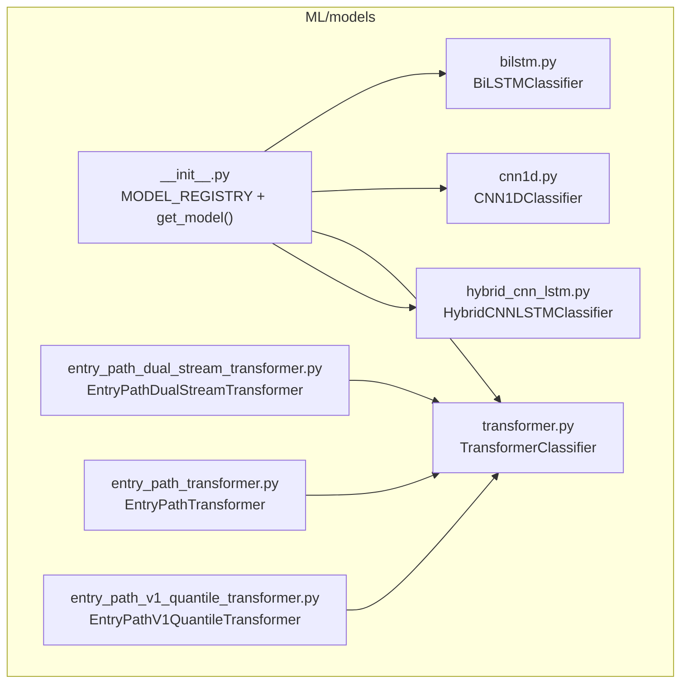
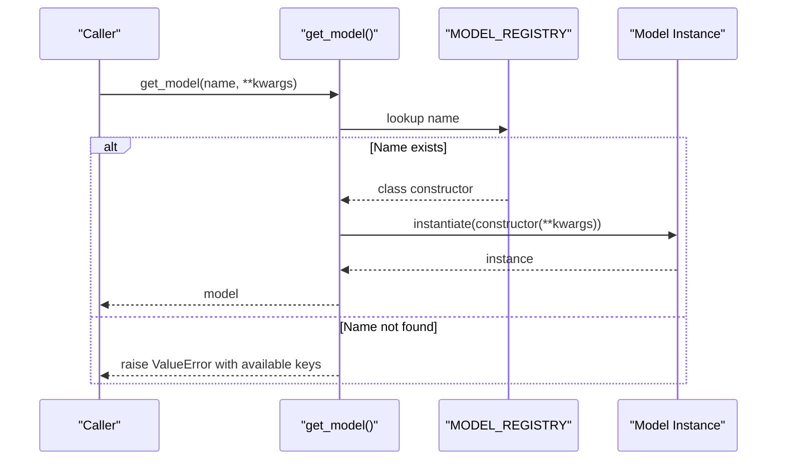
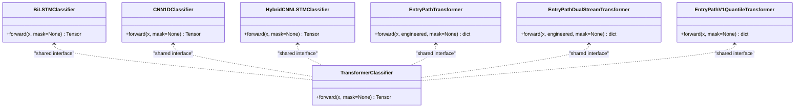
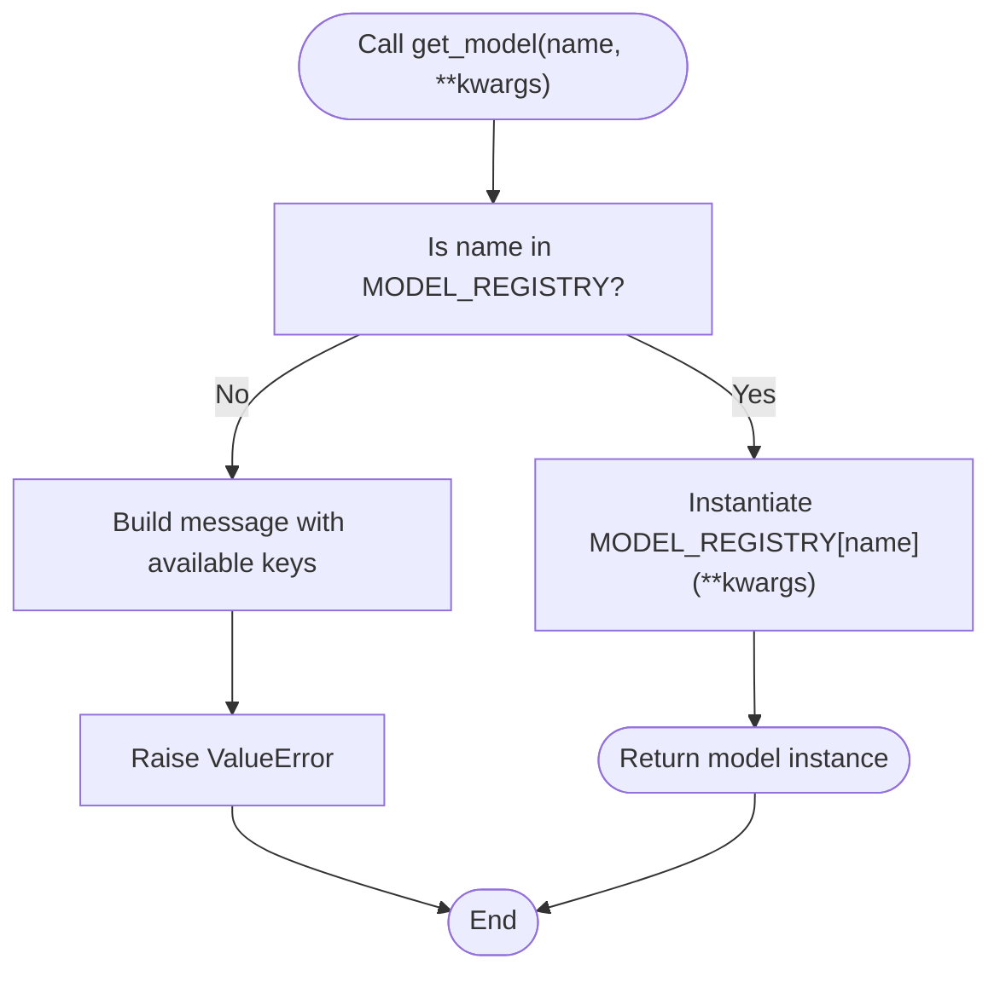
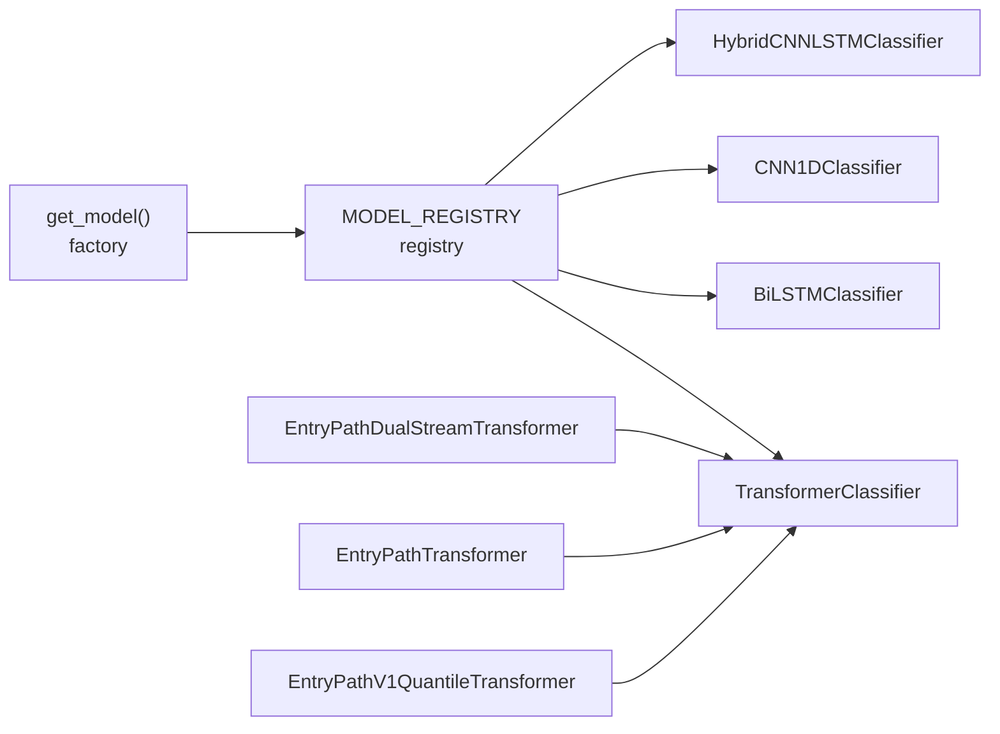

# Model Registry and Factory System

<cite>
**Referenced Files in This Document**
- [ML/models/__init__.py](file://ML/models/__init__.py)
- [ML/models/bilstm.py](file://ML/models/bilstm.py)
- [ML/models/cnn1d.py](file://ML/models/cnn1d.py)
- [ML/models/transformer.py](file://ML/models/transformer.py)
- [ML/models/hybrid_cnn_lstm.py](file://ML/models/hybrid_cnn_lstm.py)
- [ML/models/entry_path_dual_stream_transformer.py](file://ML/models/entry_path_dual_stream_transformer.py)
- [ML/models/entry_path_transformer.py](file://ML/models/entry_path_transformer.py)
- [ML/models/entry_path_v1_quantile_transformer.py](file://ML/models/entry_path_v1_quantile_transformer.py)
- [ML/train.py](file://ML/train.py)
- [API/api_server.py](file://API/api_server.py)
- [API/generate_signals.py](file://API/generate_signals.py)
- [ML/benchmark_outcome_targets.py](file://ML/benchmark_outcome_targets.py)
- [ML/conformal/calibrate.py](file://ML/conformal/calibrate.py)
- [ML/evaluate_test.py](file://ML/evaluate_test.py)
- [ML/export_updn_active_predictions.py](file://ML/export_updn_active_predictions.py)
- [ML/threshold_analysis.py](file://ML/threshold_analysis.py)
</cite>

## Table of Contents
1. [Introduction](#introduction)
2. [Project Structure](#project-structure)
3. [Core Components](#core-components)
4. [Architecture Overview](#architecture-overview)
5. [Detailed Component Analysis](#detailed-component-analysis)
6. [Dependency Analysis](#dependency-analysis)
7. [Performance Considerations](#performance-considerations)
8. [Troubleshooting Guide](#troubleshooting-guide)
9. [Conclusion](#conclusion)
10. [Appendices](#appendices)

## Introduction
This document explains the model registry and factory pattern implementation used across SoSimple’s ML module. It covers the MODEL_REGISTRY dictionary, the get_model() factory function, the unified interface that all models implement, and how this pattern enables dynamic model selection, testing different architectures, and maintaining consistent API contracts across training and inference pipelines. It also documents initialization parameters, input tensor shape requirements, output formatting standards, error handling for invalid model names, and guidelines for extending the registry with custom model implementations while preserving compatibility.

## Project Structure
The model registry and factory pattern reside in the ML models package. The registry exposes a dictionary mapping model names to constructors and a factory function that instantiates models dynamically. Several model implementations share a common interface, while specialized multitask models accept additional inputs.

**Diagram sources**
- [ML/models/__init__.py:22-48](file://ML/models/__init__.py#L22-L48)
- [ML/models/bilstm.py:30-113](file://ML/models/bilstm.py#L30-L113)
- [ML/models/cnn1d.py:30-123](file://ML/models/cnn1d.py#L30-L123)
- [ML/models/transformer.py:78-199](file://ML/models/transformer.py#L78-L199)
- [ML/models/hybrid_cnn_lstm.py:29-137](file://ML/models/hybrid_cnn_lstm.py#L29-L137)
- [ML/models/entry_path_dual_stream_transformer.py:7-134](file://ML/models/entry_path_dual_stream_transformer.py#L7-L134)
- [ML/models/entry_path_transformer.py:7-116](file://ML/models/entry_path_transformer.py#L7-L116)
- [ML/models/entry_path_v1_quantile_transformer.py:13-125](file://ML/models/entry_path_v1_quantile_transformer.py#L13-L125)

**Section sources**
- [ML/models/__init__.py:1-49](file://ML/models/__init__.py#L1-L49)

## Core Components
- MODEL_REGISTRY: A dictionary mapping string keys to model class constructors. Keys include identifiers such as "bilstm", "cnn1d", "transformer", and "hybrid".
- get_model(name, **kwargs): A factory function that validates the requested model name against the registry and constructs the model with provided keyword arguments. It raises a ValueError if the name is not found, listing available keys.

Unified interface specification:
- All models implement a forward method with the signature:
  - forward(x: Tensor, mask: Tensor | None = None) -> Tensor
- Input tensor shapes:
  - Standard sequence models expect inputs shaped as (batch, seq_len, features) with seq_len=100 and features=11.
  - 1D CNN models internally transpose inputs to (batch, features, seq_len) prior to convolution.
- Output formatting:
  - Logits tensors shaped as (batch, num_classes) for classification tasks.
  - For multitask models (entry path variants), forward returns a dict with named heads such as 'ret', 'path_reg', 'path_cls', and optionally quantile heads like 'ret_q10', 'ret_q90'.

**Section sources**
- [ML/models/__init__.py:8-15](file://ML/models/__init__.py#L8-L15)
- [ML/models/__init__.py:22-28](file://ML/models/__init__.py#L22-L28)
- [ML/models/__init__.py:31-48](file://ML/models/__init__.py#L31-L48)
- [ML/models/bilstm.py:84-112](file://ML/models/bilstm.py#L84-L112)
- [ML/models/cnn1d.py:95-122](file://ML/models/cnn1d.py#L95-L122)
- [ML/models/transformer.py:150-198](file://ML/models/transformer.py#L150-L198)
- [ML/models/hybrid_cnn_lstm.py:102-136](file://ML/models/hybrid_cnn_lstm.py#L102-L136)
- [ML/models/entry_path_dual_stream_transformer.py:90-133](file://ML/models/entry_path_dual_stream_transformer.py#L90-L133)
- [ML/models/entry_path_transformer.py:76-115](file://ML/models/entry_path_transformer.py#L76-L115)
- [ML/models/entry_path_v1_quantile_transformer.py:81-124](file://ML/models/entry_path_v1_quantile_transformer.py#L81-L124)

## Architecture Overview
The factory pattern centralizes model creation and ensures a uniform API across diverse architectures. During training and inference, the system resolves a model by name and passes task-specific parameters such as num_classes. Specialized multitask models deviate slightly by accepting additional inputs and returning structured outputs.

**Diagram sources**
- [ML/models/__init__.py:31-48](file://ML/models/__init__.py#L31-L48)

**Section sources**
- [ML/models/__init__.py:31-48](file://ML/models/__init__.py#L31-L48)

## Detailed Component Analysis

### Unified Interface and Shape Contracts
- Standard models:
  - Input: (batch, 100, 11) for sequence inputs; CNN variant internally transposes to (batch, 11, 100).
  - Output: logits (batch, num_classes).
- Multitask models:
  - Input: x (batch, seq_len, features), optional engineered features for dual-stream variants, optional mask.
  - Output: dict with keys such as 'ret', 'path_reg', 'path_cls'; quantile variants additionally include 'ret_q10', 'ret_q90'.

**Diagram sources**
- [ML/models/bilstm.py:84-112](file://ML/models/bilstm.py#L84-L112)
- [ML/models/cnn1d.py:95-122](file://ML/models/cnn1d.py#L95-L122)
- [ML/models/transformer.py:150-198](file://ML/models/transformer.py#L150-L198)
- [ML/models/hybrid_cnn_lstm.py:102-136](file://ML/models/hybrid_cnn_lstm.py#L102-L136)
- [ML/models/entry_path_transformer.py:76-115](file://ML/models/entry_path_transformer.py#L76-L115)
- [ML/models/entry_path_dual_stream_transformer.py:90-133](file://ML/models/entry_path_dual_stream_transformer.py#L90-L133)
- [ML/models/entry_path_v1_quantile_transformer.py:81-124](file://ML/models/entry_path_v1_quantile_transformer.py#L81-L124)

**Section sources**
- [ML/models/bilstm.py:84-112](file://ML/models/bilstm.py#L84-L112)
- [ML/models/cnn1d.py:95-122](file://ML/models/cnn1d.py#L95-L122)
- [ML/models/transformer.py:150-198](file://ML/models/transformer.py#L150-L198)
- [ML/models/hybrid_cnn_lstm.py:102-136](file://ML/models/hybrid_cnn_lstm.py#L102-L136)
- [ML/models/entry_path_transformer.py:76-115](file://ML/models/entry_path_transformer.py#L76-L115)
- [ML/models/entry_path_dual_stream_transformer.py:90-133](file://ML/models/entry_path_dual_stream_transformer.py#L90-L133)
- [ML/models/entry_path_v1_quantile_transformer.py:81-124](file://ML/models/entry_path_v1_quantile_transformer.py#L81-L124)

### Factory Pattern Benefits
- Dynamic model switching: Select models by name without changing client code.
- Testing different architectures: Swap models via configuration without refactoring.
- Consistent API: All models expose the same forward signature, simplifying training loops and inference pipelines.

Integration points:
- Training script uses the factory to instantiate classification/regression models and falls back to specialized multitask models when needed.
- API server and signal generation scripts instantiate models for serving and prediction.
- Benchmarking and evaluation scripts rely on the factory for reproducible experiments.

**Section sources**
- [ML/train.py:1174-1176](file://ML/train.py#L1174-L1176)
- [API/api_server.py:81-81](file://API/api_server.py#L81-L81)
- [API/generate_signals.py:244-244](file://API/generate_signals.py#L244-L244)
- [API/generate_signals.py:412-412](file://API/generate_signals.py#L412-L412)
- [ML/benchmark_outcome_targets.py:200-200](file://ML/benchmark_outcome_targets.py#L200-L200)
- [ML/conformal/calibrate.py:144-144](file://ML/conformal/calibrate.py#L144-L144)
- [ML/evaluate_test.py:221-221](file://ML/evaluate_test.py#L221-L221)
- [ML/export_updn_active_predictions.py:83-83](file://ML/export_updn_active_predictions.py#L83-L83)
- [ML/threshold_analysis.py:820-820](file://ML/threshold_analysis.py#L820-L820)
- [ML/threshold_analysis.py:942-942](file://ML/threshold_analysis.py#L942-L942)

### Error Handling for Invalid Model Names
- The factory checks membership in MODEL_REGISTRY and raises a ValueError with a message listing available keys if the requested name is missing.

**Diagram sources**
- [ML/models/__init__.py:45-47](file://ML/models/__init__.py#L45-L47)

**Section sources**
- [ML/models/__init__.py:45-47](file://ML/models/__init__.py#L45-L47)

### Initialization Parameters and Shape Requirements
- Standard models:
  - BiLSTMClassifier: input_features, hidden_size, num_layers, num_classes, dropout.
  - CNN1DClassifier: input_features, num_classes, dropout.
  - TransformerClassifier: input_features, d_model, nhead, num_layers, dim_feedforward, num_classes, dropout.
  - HybridCNNLSTMClassifier: input_features, cnn_channels, lstm_hidden, num_classes, dropout.
- Multitask models:
  - EntryPathTransformer: input_features, engineered_feature_dim, d_model, nhead, num_layers, dim_feedforward, dropout.
  - EntryPathDualStreamTransformer: similar to EntryPathTransformer with dual-stream fusion.
  - EntryPathV1QuantileTransformer: input_features, d_model, nhead, num_layers, dim_feedforward, dropout.

Input tensor shape requirements:
- Standard sequence inputs: (batch, 100, 11).
- CNN internal transposition: (batch, 11, 100) before convolution.
- Multitask models accept an additional engineered feature tensor and optional mask.

Output formatting:
- Classification logits: (batch, num_classes).
- Multitask outputs: dict with named heads.

**Section sources**
- [ML/models/bilstm.py:53-60](file://ML/models/bilstm.py#L53-L60)
- [ML/models/cnn1d.py:51-56](file://ML/models/cnn1d.py#L51-L56)
- [ML/models/transformer.py:104-113](file://ML/models/transformer.py#L104-L113)
- [ML/models/hybrid_cnn_lstm.py:53-60](file://ML/models/hybrid_cnn_lstm.py#L53-L60)
- [ML/models/entry_path_transformer.py:17-22](file://ML/models/entry_path_transformer.py#L17-L22)
- [ML/models/entry_path_dual_stream_transformer.py:17-22](file://ML/models/entry_path_dual_stream_transformer.py#L17-L22)
- [ML/models/entry_path_v1_quantile_transformer.py:22-22](file://ML/models/entry_path_v1_quantile_transformer.py#L22-L22)
- [ML/models/bilstm.py:12-14](file://ML/models/bilstm.py#L12-L14)
- [ML/models/cnn1d.py:12-14](file://ML/models/cnn1d.py#L12-L14)
- [ML/models/transformer.py:12-14](file://ML/models/transformer.py#L12-L14)

### Dynamic Instantiation Examples
- Training pipeline:
  - Uses get_model(model_name, num_classes=num_classes, **model_kwargs) to construct a standard model.
- API and signal generation:
  - Retrieve ckpt_model_name and num_classes from configuration and call get_model similarly.
- Specialized multitask models:
  - EntryPathV1QuantileTransformer and TrailingStopTargetQuantileTransformer are constructed directly when applicable.

**Section sources**
- [ML/train.py:1174-1176](file://ML/train.py#L1174-L1176)
- [API/api_server.py:81-81](file://API/api_server.py#L81-L81)
- [API/generate_signals.py:244-244](file://API/generate_signals.py#L244-L244)
- [API/generate_signals.py:412-412](file://API/generate_signals.py#L412-L412)
- [ML/benchmark_outcome_targets.py:200-200](file://ML/benchmark_outcome_targets.py#L200-L200)
- [ML/conformal/calibrate.py:144-144](file://ML/conformal/calibrate.py#L144-L144)
- [ML/evaluate_test.py:221-221](file://ML/evaluate_test.py#L221-L221)
- [ML/export_updn_active_predictions.py:83-83](file://ML/export_updn_active_predictions.py#L83-L83)
- [ML/threshold_analysis.py:820-820](file://ML/threshold_analysis.py#L820-L820)
- [ML/threshold_analysis.py:942-942](file://ML/threshold_analysis.py#L942-L942)

### Extending the Registry with Custom Models
Guidelines:
- Implement a new model class that adheres to the unified interface: forward(x, mask=None) -> Tensor for standard models or forward(...) -> dict for multitask models.
- Define appropriate initialization parameters and ensure sensible defaults for input_features, num_classes, and other hyperparameters.
- Add an entry to MODEL_REGISTRY mapping a unique name to your model class.
- Update get_model() if you want to support additional keyword arguments or special handling.
- Verify that input tensor shapes match expectations (e.g., (batch, 100, 11) for standard models).
- Test with training and inference pipelines to confirm compatibility.

Compatibility considerations:
- Keep the forward signature consistent across models.
- Maintain compatible output shapes for downstream consumers.
- For multitask models, document the returned dictionary keys and their semantics.

**Section sources**
- [ML/models/__init__.py:22-28](file://ML/models/__init__.py#L22-L28)
- [ML/models/__init__.py:31-48](file://ML/models/__init__.py#L31-L48)

## Dependency Analysis
The factory pattern decouples clients from specific model implementations, reducing coupling and enabling flexible composition. Specialized multitask models depend on the shared Transformer base components.

**Diagram sources**
- [ML/models/__init__.py:22-48](file://ML/models/__init__.py#L22-L48)
- [ML/models/entry_path_dual_stream_transformer.py:4-4](file://ML/models/entry_path_dual_stream_transformer.py#L4-L4)
- [ML/models/entry_path_transformer.py:4-4](file://ML/models/entry_path_transformer.py#L4-L4)
- [ML/models/entry_path_v1_quantile_transformer.py:10-10](file://ML/models/entry_path_v1_quantile_transformer.py#L10-L10)

**Section sources**
- [ML/models/__init__.py:22-48](file://ML/models/__init__.py#L22-L48)

## Performance Considerations
- Parameter counting: Use count_parameters to estimate trainable parameters for resource planning.
- Device selection: Prefer GPU when available to accelerate training and inference.
- Gradient clipping: Applied during training to stabilize optimization.
- Early stopping and schedulers: Managed externally in training pipelines to improve convergence and generalization.

[No sources needed since this section provides general guidance]

## Troubleshooting Guide
Common issues and resolutions:
- Invalid model name:
  - Symptom: ValueError indicating the model name is not found.
  - Resolution: Confirm the name exists in MODEL_REGISTRY and that get_model() is invoked with the correct spelling.
- Shape mismatch errors:
  - Symptom: Runtime errors when passing inputs to forward().
  - Resolution: Ensure inputs are shaped as (batch, 100, 11) for standard models; remember CNN internally transposes to (batch, features, seq_len).
- Missing num_classes:
  - Symptom: Incorrect output dimensionality.
  - Resolution: Pass num_classes to get_model() or model constructor as appropriate.
- Multitask input mismatches:
  - Symptom: Errors when calling multitask models.
  - Resolution: Provide the additional inputs (engineered features and optional mask) as documented by the specific model’s forward signature.

**Section sources**
- [ML/models/__init__.py:45-47](file://ML/models/__init__.py#L45-L47)
- [ML/models/bilstm.py:12-14](file://ML/models/bilstm.py#L12-L14)
- [ML/models/cnn1d.py:12-14](file://ML/models/cnn1d.py#L12-L14)
- [ML/models/transformer.py:150-198](file://ML/models/transformer.py#L150-L198)
- [ML/models/entry_path_transformer.py:76-115](file://ML/models/entry_path_transformer.py#L76-L115)
- [ML/models/entry_path_dual_stream_transformer.py:90-133](file://ML/models/entry_path_dual_stream_transformer.py#L90-L133)
- [ML/models/entry_path_v1_quantile_transformer.py:81-124](file://ML/models/entry_path_v1_quantile_transformer.py#L81-L124)

## Conclusion
The SoSimple ML module employs a clean, extensible factory pattern centered on MODEL_REGISTRY and get_model(). This design enforces a unified interface across diverse architectures, simplifies dynamic model selection, and streamlines integration with training and inference pipelines. By adhering to the documented shape and interface contracts, developers can confidently swap, test, and extend models while maintaining consistent API behavior.

[No sources needed since this section summarizes without analyzing specific files]

## Appendices

### Appendix A: Registry Keys and Model Classes
- "bilstm": BiLSTMClassifier
- "cnn1d": CNN1DClassifier
- "transformer": TransformerClassifier
- "hybrid": HybridCNNLSTMClassifier

**Section sources**
- [ML/models/__init__.py:22-28](file://ML/models/__init__.py#L22-L28)