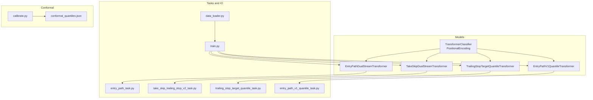
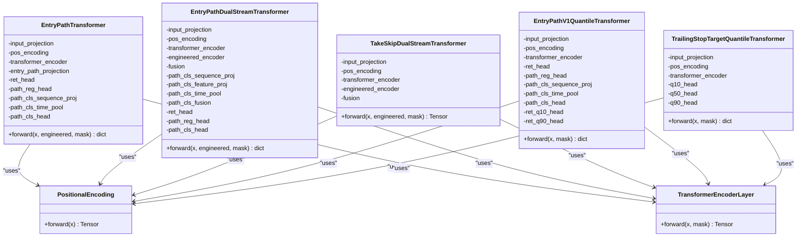
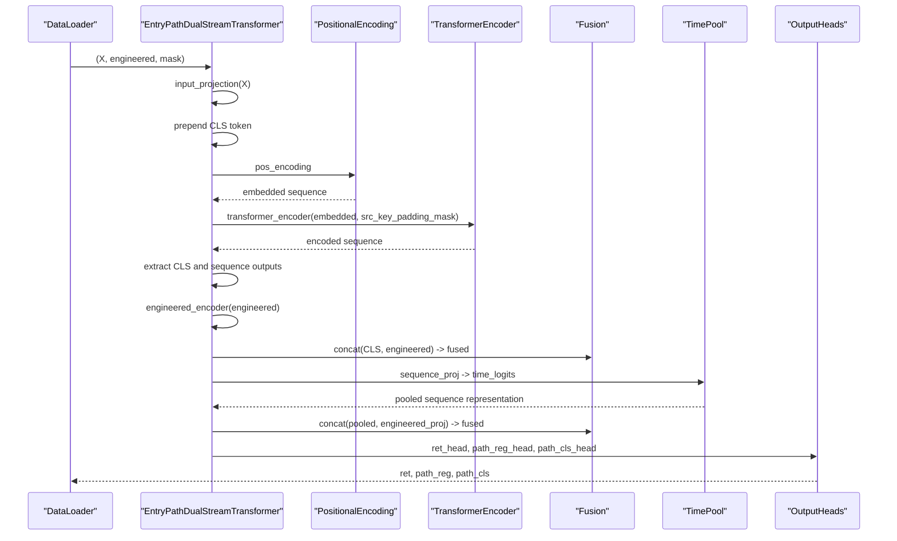
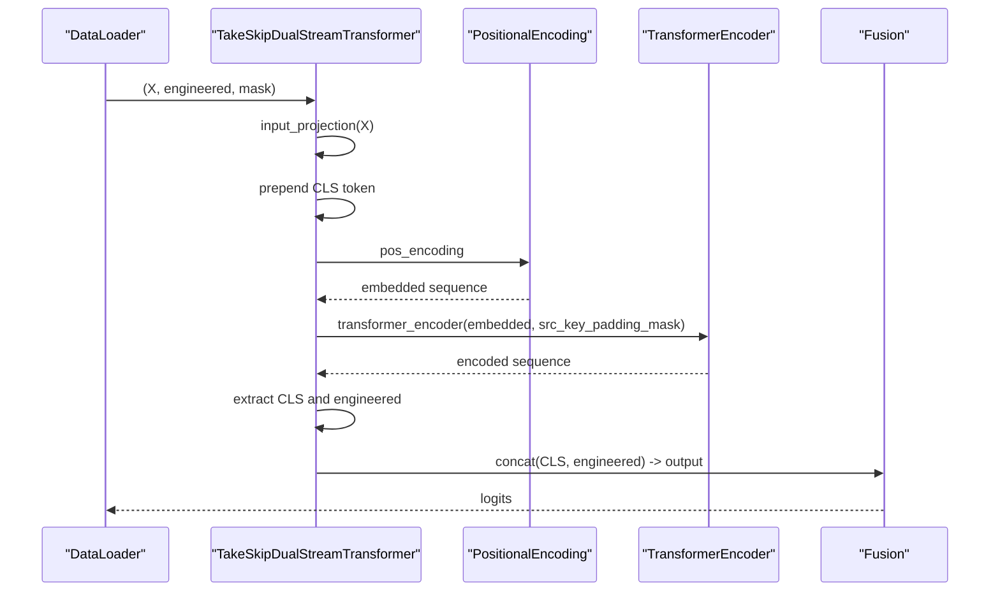
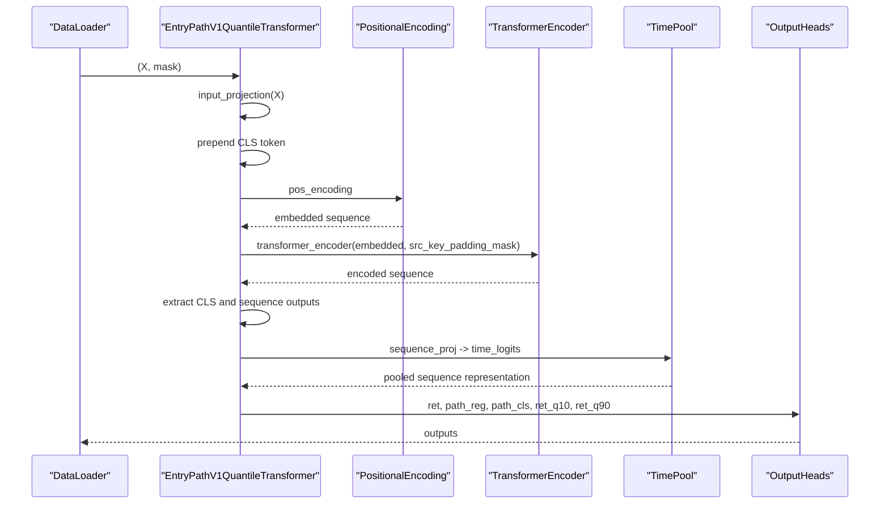
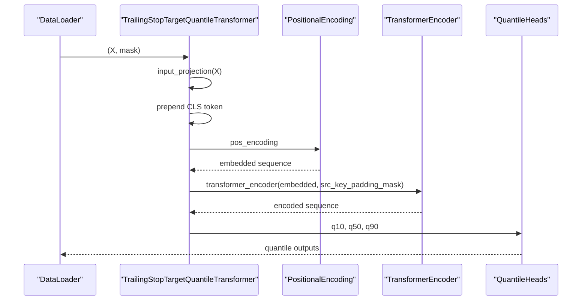
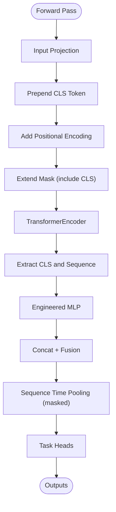
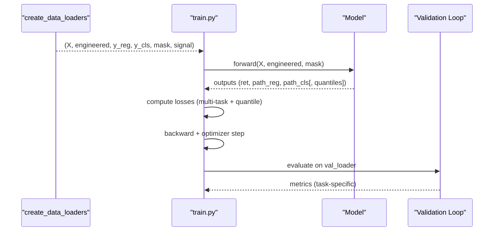
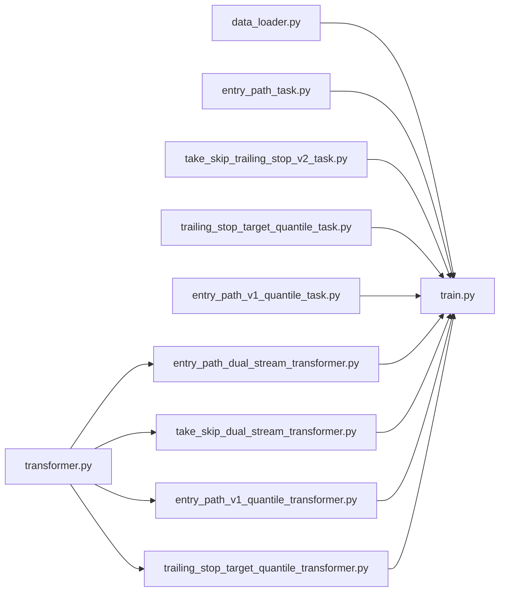

# Specialized Trading Models

<cite>
**Referenced Files in This Document**
- [entry_path_dual_stream_transformer.py](file://ML/models/entry_path_dual_stream_transformer.py)
- [take_skip_dual_stream_transformer.py](file://ML/models/take_skip_dual_stream_transformer.py)
- [entry_path_v1_quantile_transformer.py](file://ML/models/entry_path_v1_quantile_transformer.py)
- [trailing_stop_target_quantile_transformer.py](file://ML/models/trailing_stop_target_quantile_transformer.py)
- [transformer.py](file://ML/models/transformer.py)
- [entry_path_task.py](file://ML/entry_path_task.py)
- [take_skip_trailing_stop_v2_task.py](file://ML/take_skip_trailing_stop_v2_task.py)
- [trailing_stop_target_quantile_task.py](file://ML/trailing_stop_target_quantile_task.py)
- [data_loader.py](file://ML/data_loader.py)
- [train.py](file://ML/train.py)
- [entry_path_v1_quantile_task.py](file://ML/entry_path_v1_quantile_task.py)
- [conformal_quantiles.json](file://ML/conformal/conformal_quantiles.json)
- [calibrate.py](file://ML/conformal/calibrate.py)
</cite>

## Table of Contents
1. [Introduction](#introduction)
2. [Project Structure](#project-structure)
3. [Core Components](#core-components)
4. [Architecture Overview](#architecture-overview)
5. [Detailed Component Analysis](#detailed-component-analysis)
6. [Dependency Analysis](#dependency-analysis)
7. [Performance Considerations](#performance-considerations)
8. [Troubleshooting Guide](#troubleshooting-guide)
9. [Conclusion](#conclusion)
10. [Appendices](#appendices)

## Introduction
This document describes SoSimple’s specialized trading-focused model architectures for entry path analysis, take/skip decision-making, and probabilistic predictions with uncertainty quantification. It explains how dual-stream transformers process multiple input streams simultaneously, how quantile-based transformers enable confidence intervals, and how attention mechanisms are adapted for financial time series. It also covers specialized input formats, attention masking for irregular sequences, and output head configurations for regression and classification tasks. Finally, it outlines integration patterns with the trading execution system and inference/export pipelines.

## Project Structure
The models are implemented under ML/models and integrated with data loaders, training/validation loops, and evaluation/reporting utilities under ML/. The entry path and take/skip tasks define target conventions and export formats. Conformal prediction infrastructure provides post-hoc uncertainty quantification for regression targets.

**Diagram sources**
- [entry_path_dual_stream_transformer.py:7-134](file://ML/models/entry_path_dual_stream_transformer.py#L7-L134)
- [take_skip_dual_stream_transformer.py:24-92](file://ML/models/take_skip_dual_stream_transformer.py#L24-L92)
- [entry_path_v1_quantile_transformer.py:13-125](file://ML/models/entry_path_v1_quantile_transformer.py#L13-L125)
- [trailing_stop_target_quantile_transformer.py:7-76](file://ML/models/trailing_stop_target_quantile_transformer.py#L7-L76)
- [transformer.py:35-199](file://ML/models/transformer.py#L35-L199)
- [entry_path_task.py:86-107](file://ML/entry_path_task.py#L86-L107)
- [take_skip_trailing_stop_v2_task.py:7-111](file://ML/take_skip_trailing_stop_v2_task.py#L7-L111)
- [trailing_stop_target_quantile_task.py:5-107](file://ML/trailing_stop_target_quantile_task.py#L5-L107)
- [entry_path_v1_quantile_task.py:15-31](file://ML/entry_path_v1_quantile_task.py#L15-L31)
- [data_loader.py:549-800](file://ML/data_loader.py#L549-L800)
- [train.py:172-800](file://ML/train.py#L172-L800)
- [calibrate.py:93-207](file://ML/conformal/calibrate.py#L93-L207)
- [conformal_quantiles.json:1-16](file://ML/conformal/conformal_quantiles.json#L1-L16)

**Section sources**
- [data_loader.py:549-800](file://ML/data_loader.py#L549-L800)
- [train.py:172-800](file://ML/train.py#L172-L800)

## Core Components
- Dual-stream entry path transformer: Processes a time series of fractal features and engineered features (e.g., session indicators, volatility regime) concurrently, with a CLS token and time pooling for path classification.
- Dual-stream take/skip transformer: Reads fractal sequences and lib_PIC engineered features to produce multi-output logits for take/skip decisions.
- Quantile entry path transformer: Adds quantile heads (q10/q90) for return targets alongside standard regression/classification heads.
- Quantile trailing stop transformer: Predicts three quantiles for trailing stop target uncertainty.
- Base transformer utilities: Positional encoding and a reusable TransformerEncoder-based classifier backbone.

Key architectural patterns:
- CLS token aggregation for global sequence summarization.
- Learned positional encoding for temporal locality.
- Attention masking via padding masks for variable-length sequences.
- Feature fusion between sequence and engineered streams.
- Multi-head outputs for regression/classification/quantile tasks.

**Section sources**
- [entry_path_dual_stream_transformer.py:7-134](file://ML/models/entry_path_dual_stream_transformer.py#L7-L134)
- [take_skip_dual_stream_transformer.py:24-92](file://ML/models/take_skip_dual_stream_transformer.py#L24-L92)
- [entry_path_v1_quantile_transformer.py:13-125](file://ML/models/entry_path_v1_quantile_transformer.py#L13-L125)
- [trailing_stop_target_quantile_transformer.py:7-76](file://ML/models/trailing_stop_target_quantile_transformer.py#L7-L76)
- [transformer.py:35-199](file://ML/models/transformer.py#L35-L199)

## Architecture Overview
The models share a common backbone: an input projection, CLS token prepending, positional encoding, and a stack of TransformerEncoderLayers. Dual-stream variants add an engineered feature branch and a fusion layer. Quantile variants add dedicated quantile heads. Outputs are tailored per task: multi-target regression, multi-class classification, or quantile intervals.

**Diagram sources**
- [transformer.py:35-199](file://ML/models/transformer.py#L35-L199)
- [entry_path_transformer.py:7-116](file://ML/models/entry_path_transformer.py#L7-L116)
- [entry_path_dual_stream_transformer.py:7-134](file://ML/models/entry_path_dual_stream_transformer.py#L7-L134)
- [take_skip_dual_stream_transformer.py:24-92](file://ML/models/take_skip_dual_stream_transformer.py#L24-L92)
- [entry_path_v1_quantile_transformer.py:13-125](file://ML/models/entry_path_v1_quantile_transformer.py#L13-L125)
- [trailing_stop_target_quantile_transformer.py:7-76](file://ML/models/trailing_stop_target_quantile_transformer.py#L7-L76)

## Detailed Component Analysis

### Dual-Stream Entry Path Transformer
- Purpose: Predict returns, path regression targets, and path classification while incorporating engineered features (e.g., session, volatility regime).
- Inputs:
  - x: shape (batch, seq_len, input_features)
  - engineered: shape (batch, engineered_feature_dim)
  - mask: optional boolean mask (batch, seq_len) to ignore padded positions
- Processing:
  - Input projection and CLS token prepending
  - Positional encoding
  - TransformerEncoder with optional padding mask
  - Extract CLS token and sequence outputs
  - Engineered features pass through a small MLP
  - Concatenate CLS and engineered embeddings, then fuse
  - Path classification uses sequence outputs with time-wise attention pooling over masked positions
- Outputs:
  - ret: return prediction heads
  - path_reg: path regression heads
  - path_cls: path classification head

**Diagram sources**
- [entry_path_dual_stream_transformer.py:90-134](file://ML/models/entry_path_dual_stream_transformer.py#L90-L134)

**Section sources**
- [entry_path_dual_stream_transformer.py:7-134](file://ML/models/entry_path_dual_stream_transformer.py#L7-L134)
- [entry_path_task.py:86-107](file://ML/entry_path_task.py#L86-L107)

### Dual-Stream Take/Skip Transformer
- Purpose: Decision-making for take/skip with trailing stop parameters using fractal sequences and lib_PIC engineered features.
- Inputs:
  - x: shape (batch, seq_len, input_features)
  - engineered: shape (batch, 117)
  - mask: optional padding mask
- Processing:
  - Same backbone as entry path dual-stream
  - Engineered features projected and fused with CLS token embedding
- Output:
  - logits: shape (batch, output_dim) for take/skip decisions

**Diagram sources**
- [take_skip_dual_stream_transformer.py:69-92](file://ML/models/take_skip_dual_stream_transformer.py#L69-L92)

**Section sources**
- [take_skip_dual_stream_transformer.py:24-92](file://ML/models/take_skip_dual_stream_transformer.py#L24-L92)
- [take_skip_trailing_stop_v2_task.py:7-111](file://ML/take_skip_trailing_stop_v2_task.py#L7-L111)

### Quantile-Based Entry Path Transformer
- Purpose: Predict returns with uncertainty via quantile heads (q10/q90) while maintaining standard regression/classification outputs.
- Inputs:
  - x: shape (batch, seq_len, input_features)
  - mask: optional padding mask
- Processing:
  - Backbone similar to entry path transformer
  - Additional quantile heads for return prediction
- Outputs:
  - ret: central regression head
  - path_reg: path regression head
  - path_cls: path classification head
  - ret_q10, ret_q90: quantile heads

**Diagram sources**
- [entry_path_v1_quantile_transformer.py:81-125](file://ML/models/entry_path_v1_quantile_transformer.py#L81-L125)

**Section sources**
- [entry_path_v1_quantile_transformer.py:13-125](file://ML/models/entry_path_v1_quantile_transformer.py#L13-L125)
- [entry_path_v1_quantile_task.py:15-31](file://ML/entry_path_v1_quantile_task.py#L15-L31)

### Quantile-Based Trailing Stop Transformer
- Purpose: Predict quantile levels for trailing stop targets to quantify uncertainty.
- Inputs:
  - x: shape (batch, seq_len, input_features)
  - mask: optional padding mask
- Processing:
  - Backbone similar to base transformer
- Outputs:
  - q10, q50, q90: quantile predictions

**Diagram sources**
- [trailing_stop_target_quantile_transformer.py:55-76](file://ML/models/trailing_stop_target_quantile_transformer.py#L55-L76)

**Section sources**
- [trailing_stop_target_quantile_transformer.py:7-76](file://ML/models/trailing_stop_target_quantile_transformer.py#L7-L76)
- [trailing_stop_target_quantile_task.py:5-107](file://ML/trailing_stop_target_quantile_task.py#L5-L107)

### Specialized Input Formats and Attention Mechanisms
- Input tensors:
  - Fractal sequences: (batch, seq_len=20|50|100, features=20)
  - Engineered features: variable dimension depending on task (e.g., entry path v1 features or lib_PIC features)
- Attention masking:
  - Padding masks are extended to include the CLS token and inverted for PyTorch’s src_key_padding_mask semantics
  - Time pooling for path classification respects mask to avoid invalid positions
- Positional encoding:
  - Sinusoidal encoding injected before TransformerEncoder

**Diagram sources**
- [entry_path_dual_stream_transformer.py:90-134](file://ML/models/entry_path_dual_stream_transformer.py#L90-L134)
- [transformer.py:150-199](file://ML/models/transformer.py#L150-L199)

**Section sources**
- [transformer.py:35-199](file://ML/models/transformer.py#L35-L199)
- [data_loader.py:331-425](file://ML/data_loader.py#L331-L425)

### Output Head Configurations
- Entry path regression heads:
  - ret: multi-target return predictions
  - path_reg: multi-target path predictions
- Entry path classification head:
  - path_cls: multi-class path classification
- Quantile heads:
  - ret_q10, ret_q90 for entry path returns
  - q10, q50, q90 for trailing stop targets
- Take/skip dual-stream:
  - Single output head producing logits for multi-output take/skip decisions

**Section sources**
- [entry_path_transformer.py:48-74](file://ML/models/entry_path_transformer.py#L48-L74)
- [entry_path_dual_stream_transformer.py:68-88](file://ML/models/entry_path_dual_stream_transformer.py#L68-L88)
- [entry_path_v1_quantile_transformer.py:39-80](file://ML/models/entry_path_v1_quantile_transformer.py#L39-L80)
- [trailing_stop_target_quantile_transformer.py:33-53](file://ML/models/trailing_stop_target_quantile_transformer.py#L33-L53)
- [take_skip_dual_stream_transformer.py:61-67](file://ML/models/take_skip_dual_stream_transformer.py#L61-L67)

### Training and Evaluation Pipelines
- Data loading:
  - Parses fractal strings into 3D tensors and builds padding masks
  - Supports entry path feature profiles and caching
- Training:
  - Multi-task loss for entry path (weighted combination of return/path reg/path cls)
  - Quantile loss combines pinball losses for q10/q90 on active trades
  - Optimizer and scheduler configured centrally
- Validation:
  - Task-specific metrics computed per target
  - Export frames built for downstream reporting and execution

**Diagram sources**
- [data_loader.py:549-800](file://ML/data_loader.py#L549-L800)
- [train.py:483-638](file://ML/train.py#L483-L638)
- [train.py:711-751](file://ML/train.py#L711-L751)

**Section sources**
- [data_loader.py:549-800](file://ML/data_loader.py#L549-L800)
- [train.py:483-638](file://ML/train.py#L483-L638)
- [train.py:711-751](file://ML/train.py#L711-L751)

## Dependency Analysis
- Models depend on shared transformer utilities (PositionalEncoding, TransformerEncoderLayer).
- Tasks define target conventions and export frames; data loaders enforce contracts and cache intermediate artifacts.
- Training orchestrates task-specific losses and metrics.

**Diagram sources**
- [data_loader.py:549-800](file://ML/data_loader.py#L549-L800)
- [train.py:172-800](file://ML/train.py#L172-L800)
- [entry_path_task.py:86-107](file://ML/entry_path_task.py#L86-L107)
- [take_skip_trailing_stop_v2_task.py:7-111](file://ML/take_skip_trailing_stop_v2_task.py#L7-L111)
- [trailing_stop_target_quantile_task.py:5-107](file://ML/trailing_stop_target_quantile_task.py#L5-L107)
- [entry_path_v1_quantile_task.py:15-31](file://ML/entry_path_v1_quantile_task.py#L15-L31)
- [entry_path_dual_stream_transformer.py:7-134](file://ML/models/entry_path_dual_stream_transformer.py#L7-L134)
- [take_skip_dual_stream_transformer.py:24-92](file://ML/models/take_skip_dual_stream_transformer.py#L24-L92)
- [entry_path_v1_quantile_transformer.py:13-125](file://ML/models/entry_path_v1_quantile_transformer.py#L13-L125)
- [trailing_stop_target_quantile_transformer.py:7-76](file://ML/models/trailing_stop_target_quantile_transformer.py#L7-L76)
- [transformer.py:35-199](file://ML/models/transformer.py#L35-L199)

**Section sources**
- [data_loader.py:549-800](file://ML/data_loader.py#L549-L800)
- [train.py:172-800](file://ML/train.py#L172-L800)

## Performance Considerations
- Efficient masking and time pooling avoid computation on padded positions.
- CLS token-based global aggregation reduces reliance on fixed windowing assumptions.
- Quantile heads add minimal overhead compared to standard heads.
- Training uses gradient clipping and scheduled optimizers to stabilize multi-task learning.

## Troubleshooting Guide
- Shape mismatches:
  - Ensure entry path feature dimensions align with the chosen feature profile.
  - Verify sequence lengths match supported values for entry path tasks.
- Mask correctness:
  - Confirm mask shapes and semantics for TransformerEncoder padding.
- Quantile ordering:
  - q10 ≤ q50 ≤ q90 enforced during export; detect violations to catch model instability.
- Conformal coverage:
  - Use calibration utilities to compute per-target quantiles and validate empirical coverage.

**Section sources**
- [entry_path_task.py:54-84](file://ML/entry_path_task.py#L54-L84)
- [data_loader.py:153-159](file://ML/data_loader.py#L153-L159)
- [entry_path_v1_quantile_task.py:90-142](file://ML/entry_path_v1_quantile_task.py#L90-L142)
- [calibrate.py:93-207](file://ML/conformal/calibrate.py#L93-L207)
- [conformal_quantiles.json:7-14](file://ML/conformal/conformal_quantiles.json#L7-L14)

## Conclusion
SoSimple’s specialized transformers combine sequence modeling with engineered features and quantile outputs to support robust entry path analysis, take/skip decision-making, and uncertainty-aware trailing stop predictions. The modular design enables task-specific head configurations, efficient masking for financial time series, and seamless integration with training, evaluation, and export pipelines. Conformal prediction infrastructure further enhances reliability by providing calibrated intervals for regression targets.

## Appendices

### Implementation Examples and Parameter Configurations
- Entry path dual-stream:
  - input_features: 20
  - engineered_feature_dim: depends on feature profile (e.g., entry path v1 features)
  - d_model: 64, nhead: 4, num_layers: 2, dim_feedforward: 128, dropout: 0.3
- Take/skip dual-stream:
  - input_features: 20, engineered_feature_dim: 117, output_dim: 15
  - d_model: 64, nhead: 4, num_layers: 2, dim_feedforward: 128, dropout: 0.3
- Entry path quantile:
  - d_model: 64, nhead: 4, num_layers: 2, dim_feedforward: 128, dropout: 0.3
- Trailing stop quantile:
  - d_model: 64, nhead: 4, num_layers: 2, dim_feedforward: 128, dropout: 0.3

**Section sources**
- [entry_path_dual_stream_transformer.py:8-22](file://ML/models/entry_path_dual_stream_transformer.py#L8-L22)
- [take_skip_dual_stream_transformer.py:27-37](file://ML/models/take_skip_dual_stream_transformer.py#L27-L37)
- [entry_path_v1_quantile_transformer.py:14-22](file://ML/models/entry_path_v1_quantile_transformer.py#L14-L22)
- [trailing_stop_target_quantile_transformer.py:8-16](file://ML/models/trailing_stop_target_quantile_transformer.py#L8-L16)

### Integration Patterns with Trading Execution
- Export frames:
  - Entry path: build_entry_path_export_frame for return/path reg/path cls predictions.
  - Entry path quantile: build_entry_path_v1_quantile_export_frame for q10/q90 intervals.
  - Take/skip v2: build_take_skip_v2_export_frame for multi-output probabilities.
  - Trailing stop quantile: build_trailing_stop_quantile_export_frame for ordered quantiles.
- Metrics:
  - Entry path: compute named multi-target regression metrics and path classification F1.
  - Entry path quantile: compute pinball losses, coverage, interval width, and a composite validation score.
  - Take/skip v2: compute BCE and positive rates per output.
  - Trailing stop quantile: compute pinball losses, coverage, and median interval width.

**Section sources**
- [entry_path_task.py:109-168](file://ML/entry_path_task.py#L109-L168)
- [entry_path_v1_quantile_task.py:57-142](file://ML/entry_path_v1_quantile_task.py#L57-L142)
- [take_skip_trailing_stop_v2_task.py:45-111](file://ML/take_skip_trailing_stop_v2_task.py#L45-L111)
- [trailing_stop_target_quantile_task.py:32-107](file://ML/trailing_stop_target_quantile_task.py#L32-L107)