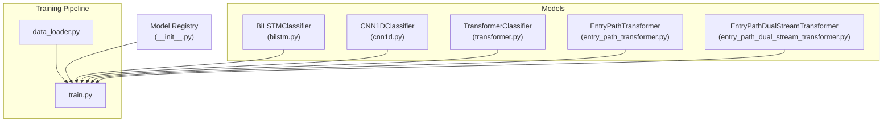
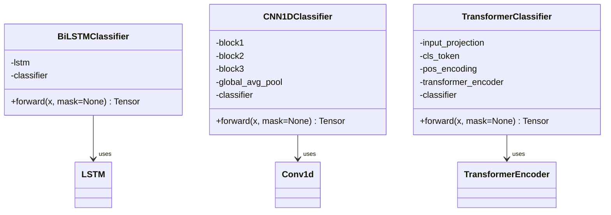
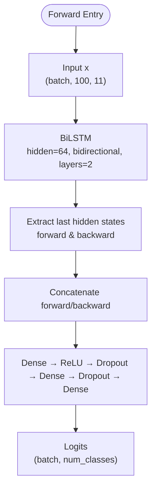
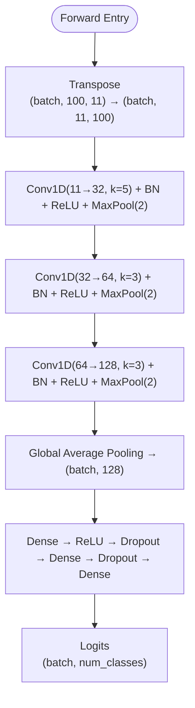
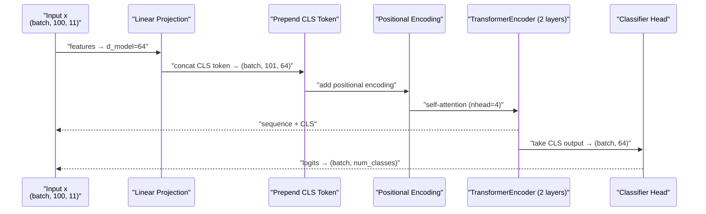
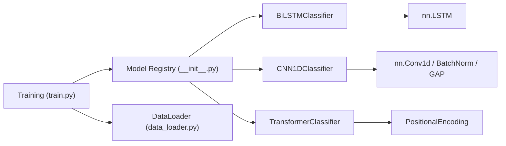

# Standard Architectures

<cite>
**Referenced Files in This Document**
- [__init__.py](file://ML/models/__init__.py)
- [bilstm.py](file://ML/models/bilstm.py)
- [cnn1d.py](file://ML/models/cnn1d.py)
- [transformer.py](file://ML/models/transformer.py)
- [entry_path_dual_stream_transformer.py](file://ML/models/entry_path_dual_stream_transformer.py)
- [entry_path_transformer.py](file://ML/models/entry_path_transformer.py)
- [train.py](file://ML/train.py)
- [data_loader.py](file://ML/data_loader.py)
- [test_entry_path_model.py](file://tests/test_entry_path_model.py)
</cite>

## Table of Contents
1. [Introduction](#introduction)
2. [Project Structure](#project-structure)
3. [Core Components](#core-components)
4. [Architecture Overview](#architecture-overview)
5. [Detailed Component Analysis](#detailed-component-analysis)
6. [Dependency Analysis](#dependency-analysis)
7. [Performance Considerations](#performance-considerations)
8. [Troubleshooting Guide](#troubleshooting-guide)
9. [Conclusion](#conclusion)
10. [Appendices](#appendices)

## Introduction
This document describes the standard neural network architectures used in SoSimple trading models: TransformerClassifier, BiLSTMClassifier, and CNN1DClassifier. It explains their architectural differences, input/output tensor shapes, sequence modeling capabilities, unified interface specifications, attention mechanisms, and practical guidance for choosing among them. It also covers technical specifications such as embedding dimensions, attention heads, hidden layers, and dropout rates, and provides code example references for model instantiation, forward pass execution, and integration with the training pipeline.

## Project Structure
The standard architectures are implemented under ML/models and integrated into the unified training pipeline under ML/train.py. The data loader (ML/data_loader.py) prepares sequences of fixed length and masks for training/validation.



**Diagram sources**
- [__init__.py:22-28](file://ML/models/__init__.py#L22-L28)
- [bilstm.py:30-113](file://ML/models/bilstm.py#L30-L113)
- [cnn1d.py:30-123](file://ML/models/cnn1d.py#L30-L123)
- [transformer.py:78-199](file://ML/models/transformer.py#L78-L199)
- [entry_path_transformer.py:7-116](file://ML/models/entry_path_transformer.py#L7-L116)
- [entry_path_dual_stream_transformer.py:7-134](file://ML/models/entry_path_dual_stream_transformer.py#L7-L134)
- [train.py:1027-1200](file://ML/train.py#L1027-L1200)
- [data_loader.py:1-200](file://ML/data_loader.py#L1-L200)

**Section sources**
- [__init__.py:17-28](file://ML/models/__init__.py#L17-L28)
- [train.py:1027-1200](file://ML/train.py#L1027-L1200)
- [data_loader.py:1-200](file://ML/data_loader.py#L1-L200)

## Core Components
- BiLSTMClassifier: Two-layer bidirectional LSTM with sequence-to-classification pooling and dense heads. Input shape: (batch, 100, 11). Output shape: (batch, num_classes).
- CNN1DClassifier: Three convolutional blocks with batch normalization, ReLU, and max pooling, followed by global average pooling and dense heads. Input shape: (batch, 100, 11) with internal transposition to (batch, 11, 100). Output shape: (batch, num_classes).
- TransformerClassifier: Two-layer Transformer encoder with CLS token, positional encoding, and dense heads. Input shape: (batch, 100, 11). Output shape: (batch, num_classes). Supports padding masks.

Unified interface:
- forward(x: Tensor, mask: Tensor | None = None) -> Tensor
- Input tensor shapes:
  - BiLSTM/CNN1D: (batch, seq_len, features)
  - Transformer: (batch, seq_len, features)
- Output tensor shape: (batch, num_classes)

**Section sources**
- [bilstm.py:30-113](file://ML/models/bilstm.py#L30-L113)
- [cnn1d.py:30-123](file://ML/models/cnn1d.py#L30-L123)
- [transformer.py:78-199](file://ML/models/transformer.py#L78-L199)
- [__init__.py:8-15](file://ML/models/__init__.py#L8-L15)

## Architecture Overview
The three standard architectures differ in how they process sequential inputs:
- BiLSTM: Recurrent, bidirectional capture of temporal dependencies; final pooling concatenates last hidden states from both directions.
- CNN1D: Convolutional filters scan local neighborhoods along the sequence dimension; global average pooling aggregates spatial features.
- Transformer: Self-attention captures long-range dependencies; CLS token aggregates global context with positional encoding.



**Diagram sources**
- [bilstm.py:30-113](file://ML/models/bilstm.py#L30-L113)
- [cnn1d.py:30-123](file://ML/models/cnn1d.py#L30-L123)
- [transformer.py:78-199](file://ML/models/transformer.py#L78-L199)

## Detailed Component Analysis

### BiLSTMClassifier
- Input: (batch, 100, 11)
- Architecture:
  - BiLSTM layers (hidden=64, bidirectional, num_layers=2)
  - Dropout between stacked LSTM layers
  - Concatenation of last hidden states from forward and backward directions
  - Dense classifier with ReLU activations and dropout
- Output: (batch, num_classes)
- Notes:
  - Mask argument is accepted for interface compatibility but unused.



**Diagram sources**
- [bilstm.py:84-113](file://ML/models/bilstm.py#L84-L113)

**Section sources**
- [bilstm.py:30-113](file://ML/models/bilstm.py#L30-L113)

### CNN1DClassifier
- Input: (batch, 100, 11)
- Architecture:
  - Transpose to (batch, 11, 100)
  - Conv1D blocks: 11→32→64→128 channels with kernel sizes 5, 3, 3 and padding; batch norm, ReLU, max pooling
  - Global average pooling to (batch, 128)
  - Dense classifier with ReLU and dropout
- Output: (batch, num_classes)
- Notes:
  - Mask argument is accepted for interface compatibility but unused.



**Diagram sources**
- [cnn1d.py:95-123](file://ML/models/cnn1d.py#L95-L123)

**Section sources**
- [cnn1d.py:30-123](file://ML/models/cnn1d.py#L30-L123)

### TransformerClassifier
- Input: (batch, 100, 11)
- Architecture:
  - Linear projection to d_model=64
  - Prepend learnable CLS token → (batch, 101, 64)
  - Positional encoding
  - Two TransformerEncoder layers with nhead=4, dim_feedforward=128
  - Extract CLS token output and pass through dense heads
- Output: (batch, num_classes)
- Attention mechanism:
  - Self-attention with multi-head attention
  - Padding mask supported via src_key_padding_mask (True positions are ignored)
- Notes:
  - Mask argument is required for proper attention masking.



**Diagram sources**
- [transformer.py:150-199](file://ML/models/transformer.py#L150-L199)

**Section sources**
- [transformer.py:78-199](file://ML/models/transformer.py#L78-L199)

### Unified Interface Specification
- Method signature: forward(x: Tensor, mask: Tensor | None = None) -> Tensor
- Input shapes:
  - BiLSTM/CNN1D: (batch, seq_len, features)
  - Transformer: (batch, seq_len, features)
- Output shape: (batch, num_classes)
- Mask semantics:
  - BiLSTM/CNN1D: mask accepted but unused
  - Transformer: mask must be provided; True indicates valid positions; internally inverted for PyTorch TransformerEncoder

**Section sources**
- [__init__.py:8-15](file://ML/models/__init__.py#L8-L15)
- [transformer.py:150-199](file://ML/models/transformer.py#L150-L199)
- [bilstm.py:84-113](file://ML/models/bilstm.py#L84-L113)
- [cnn1d.py:95-123](file://ML/models/cnn1d.py#L95-L123)

### Training Pipeline Integration
- Model creation:
  - Use get_model(name, num_classes=..., ...) from the registry
  - For entry path tasks, use specialized models (EntryPathTransformer, EntryPathDualStreamTransformer)
- Forward pass:
  - logits = model(X_batch, mask=mask_batch)
  - For regression, squeeze logits when single-target
- Loss computation:
  - Classification: CrossEntropy or Focal Loss
  - Regression: Huber or Asymmetric Loss
- Gradient clipping and scheduling handled centrally

```mermaid
sequenceDiagram
participant Loader as "DataLoader"
participant Train as "train_one_epoch()"
participant Model as "Model.forward()"
participant Loss as "Loss Function"
participant Opt as "Optimizer"
Loader->>Train : "X_batch, y_batch, mask_batch"
Train->>Model : "forward(X_batch, mask=mask_batch)"
Model-->>Train : "logits"
Train->>Loss : "compute loss(logits, y_batch)"
Loss-->>Train : "loss"
Train->>Opt : "backward() and step()"
```

**Diagram sources**
- [train.py:176-240](file://ML/train.py#L176-L240)
- [train.py:296-365](file://ML/train.py#L296-L365)

**Section sources**
- [train.py:176-240](file://ML/train.py#L176-L240)
- [train.py:296-365](file://ML/train.py#L296-L365)
- [__init__.py:31-49](file://ML/models/__init__.py#L31-L49)

## Dependency Analysis
- Model registry centralizes model selection and ensures a uniform interface across architectures.
- TransformerClassifier depends on PositionalEncoding and PyTorch TransformerEncoder.
- BiLSTMClassifier depends on nn.LSTM.
- CNN1DClassifier depends on nn.Conv1d, nn.BatchNorm1d, nn.AdaptiveAvgPool1d.
- Training pipeline depends on data loaders and loss functions to support classification and regression tasks.



**Diagram sources**
- [__init__.py:22-28](file://ML/models/__init__.py#L22-L28)
- [transformer.py:35-76](file://ML/models/transformer.py#L35-L76)
- [bilstm.py:66-82](file://ML/models/bilstm.py#L66-L82)
- [cnn1d.py:60-93](file://ML/models/cnn1d.py#L60-L93)
- [train.py:1027-1200](file://ML/train.py#L1027-L1200)
- [data_loader.py:1-200](file://ML/data_loader.py#L1-L200)

**Section sources**
- [__init__.py:22-28](file://ML/models/__init__.py#L22-L28)
- [transformer.py:35-76](file://ML/models/transformer.py#L35-L76)
- [bilstm.py:66-82](file://ML/models/bilstm.py#L66-L82)
- [cnn1d.py:60-93](file://ML/models/cnn1d.py#L60-L93)
- [train.py:1027-1200](file://ML/train.py#L1027-L1200)
- [data_loader.py:1-200](file://ML/data_loader.py#L1-L200)

## Performance Considerations
- Computational complexity:
  - BiLSTM: O(T · d · h · L) per forward pass, where T is sequence length, d is input features, h is hidden size, L is number of layers. Memory usage scales with sequence length due to LSTM states.
  - CNN1D: O(T · W · C_in · C_out) for convolutions; efficient for fixed-length sequences; global pooling reduces spatial dimensionality.
  - Transformer: O(T^2 · d · L) due to self-attention; becomes expensive for very long sequences; CLS token aggregation mitigates full sequence cost.
- Memory footprint:
  - Transformer with CLS token adds one extra token; still O(T·d) for attention matrices.
  - CNN1D typically uses less memory than Transformers for the same sequence length.
- Throughput:
  - CNN1D often fastest for fixed-length sequences due to vectorized convolutions.
  - BiLSTM benefits from GPU parallelism across batches; may be slower than CNN1D but competitive with Transformers for moderate lengths.
  - Transformer throughput depends on sequence length and hardware; attention can be a bottleneck for long sequences.

[No sources needed since this section provides general guidance]

## Troubleshooting Guide
- Shape mismatches:
  - Ensure input tensors match expected shapes: (batch, 100, 11) for BiLSTM/CNN1D and (batch, 100, 11) for Transformer.
  - For CNN1D, confirm internal transposition does not alter expectations elsewhere.
- Mask usage:
  - For Transformer, always pass a mask; True indicates valid positions. Internally inverted for PyTorch.
  - For BiLSTM/CNN1D, mask is accepted but unused; omit if not needed.
- Training instability:
  - Use gradient clipping as done in the training loop.
  - Adjust dropout and learning rate according to task difficulty.
- Entry path models:
  - Tests demonstrate expected head shapes and masked backward support; validate shapes and gradients similarly in custom usage.

**Section sources**
- [transformer.py:150-199](file://ML/models/transformer.py#L150-L199)
- [bilstm.py:84-113](file://ML/models/bilstm.py#L84-L113)
- [cnn1d.py:95-123](file://ML/models/cnn1d.py#L95-L123)
- [test_entry_path_model.py:10-121](file://tests/test_entry_path_model.py#L10-L121)

## Conclusion
The three standard architectures offer complementary strengths:
- BiLSTM: robust recurrent modeling with bidirectional context.
- CNN1D: efficient local pattern detection with strong performance on fixed-length sequences.
- Transformer: powerful long-range dependency modeling with attention and CLS token aggregation.

Choose based on sequence length, computational budget, and task characteristics. Integrate using the unified interface and training pipeline for consistent behavior across tasks.

[No sources needed since this section summarizes without analyzing specific files]

## Appendices

### Technical Specifications Summary
- BiLSTMClassifier
  - Input: (batch, 100, 11)
  - Hidden size: 64
  - Layers: 2 (bidirectional)
  - Dropout: 0.3
  - Output: (batch, num_classes)
- CNN1DClassifier
  - Input: (batch, 100, 11)
  - Channels: 32 → 64 → 128
  - Kernel sizes: 5, 3, 3
  - Dropout: 0.3
  - Output: (batch, num_classes)
- TransformerClassifier
  - Input: (batch, 100, 11)
  - d_model: 64
  - nhead: 4
  - num_layers: 2
  - dim_feedforward: 128
  - Dropout: 0.3
  - Output: (batch, num_classes)

**Section sources**
- [bilstm.py:53-60](file://ML/models/bilstm.py#L53-L60)
- [cnn1d.py:51-56](file://ML/models/cnn1d.py#L51-L56)
- [transformer.py:104-113](file://ML/models/transformer.py#L104-L113)

### Example References
- Model instantiation and forward pass:
  - [train.py:1174-1176](file://ML/train.py#L1174-L1176)
  - [train.py:214-227](file://ML/train.py#L214-L227)
- Transformer mask usage:
  - [transformer.py:180-190](file://ML/models/transformer.py#L180-L190)
- Entry path model shapes and mask support:
  - [test_entry_path_model.py:10-75](file://tests/test_entry_path_model.py#L10-L75)

**Section sources**
- [train.py:1174-1176](file://ML/train.py#L1174-L1176)
- [train.py:214-227](file://ML/train.py#L214-L227)
- [transformer.py:180-190](file://ML/models/transformer.py#L180-L190)
- [test_entry_path_model.py:10-75](file://tests/test_entry_path_model.py#L10-L75)