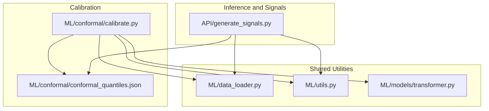
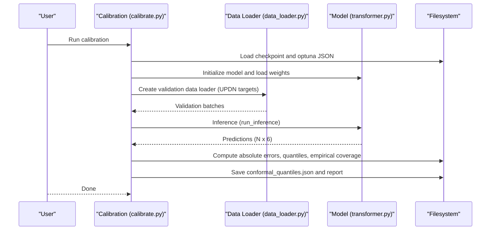
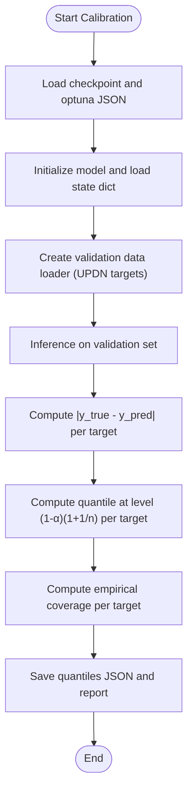
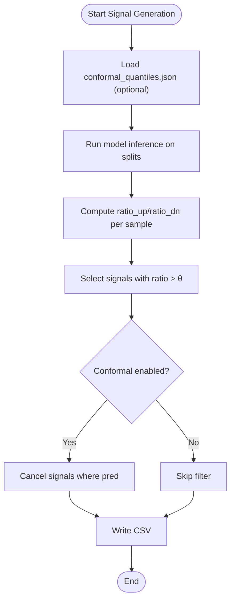
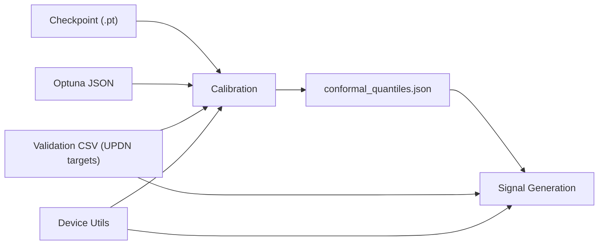

# Conformal Prediction

<cite>
**Referenced Files in This Document**
- [calibrate.py](file://ML/conformal/calibrate.py)
- [conformal_quantiles.json](file://ML/conformal/conformal_quantiles.json)
- [generate_signals.py](file://API/generate_signals.py)
- [data_loader.py](file://ML/data_loader.py)
- [utils.py](file://ML/utils.py)
- [transformer.py](file://ML/models/transformer.py)
- [conformal_prediction.md](file://docs/ML/conformal_prediction.md)
- [benchmark_entry_path_v1_quantile_filter.py](file://ML/benchmark_entry_path_v1_quantile_filter.py)
</cite>

## Table of Contents
1. [Introduction](#introduction)
2. [Project Structure](#project-structure)
3. [Core Components](#core-components)
4. [Architecture Overview](#architecture-overview)
5. [Detailed Component Analysis](#detailed-component-analysis)
6. [Dependency Analysis](#dependency-analysis)
7. [Performance Considerations](#performance-considerations)
8. [Troubleshooting Guide](#troubleshooting-guide)
9. [Conclusion](#conclusion)

## Introduction
This document explains the Conformal Prediction implementation in the SoSimple trading system. It covers the post-hoc uncertainty quantification methodology that produces valid prediction intervals without retraining, focusing on Split Conformal Prediction with absolute error nonconformity scoring and finite-sample correction. The guide details calibration on validation data, interval construction for six Up/Dn targets, empirical coverage verification, and practical usage in trading via a minimum-magnitude filter. It also describes configuration options, parameter tuning, and troubleshooting common calibration issues.

## Project Structure
The Conformal Prediction pipeline spans three primary areas:
- Calibration: computes per-target quantiles from a trained model’s validation predictions
- Inference and Signals: applies calibrated thresholds to filter trading signals
- Data and Model Utilities: shared loaders, targets, and device utilities

**Diagram sources**
- [calibrate.py:1-309](file://ML/conformal/calibrate.py#L1-L309)
- [conformal_quantiles.json:1-16](file://ML/conformal/conformal_quantiles.json#L1-L16)
- [generate_signals.py:1-745](file://API/generate_signals.py#L1-L745)
- [data_loader.py:1-800](file://ML/data_loader.py#L1-L800)
- [utils.py:1-340](file://ML/utils.py#L1-L340)
- [transformer.py:1-199](file://ML/models/transformer.py#L1-L199)

**Section sources**
- [calibrate.py:1-309](file://ML/conformal/calibrate.py#L1-L309)
- [generate_signals.py:1-745](file://API/generate_signals.py#L1-L745)
- [data_loader.py:1-800](file://ML/data_loader.py#L1-L800)
- [utils.py:1-340](file://ML/utils.py#L1-L340)
- [transformer.py:1-199](file://ML/models/transformer.py#L1-L199)

## Core Components
- Calibration module: loads a trained model, runs inference on the validation set, computes absolute error nonconformity scores per target, calculates finite-sample corrected quantiles, and saves them to disk along with a report.
- Signal generation module: optionally loads calibrated quantiles and applies a minimum-magnitude filter to reduce noise in predicted Up/Dn directions.
- Data loader: provides validation data with the six Up/Dn targets used during calibration.
- Utilities: device selection, seeding, and model registry support.

Key outputs:
- Calibrated quantiles artifact: a JSON file containing alpha, coverage target, number of calibration samples, model name, checkpoint, per-target quantiles, and timestamp.
- Markdown report: summary of quantiles, empirical coverage, and usage notes.

**Section sources**
- [calibrate.py:93-206](file://ML/conformal/calibrate.py#L93-L206)
- [conformal_quantiles.json:1-16](file://ML/conformal/conformal_quantiles.json#L1-L16)
- [generate_signals.py:360-376](file://API/generate_signals.py#L360-L376)
- [data_loader.py:105-107](file://ML/data_loader.py#L105-L107)
- [utils.py:326-340](file://ML/utils.py#L326-L340)

## Architecture Overview
The system implements Split Conformal Prediction:
- A pre-trained model generates point predictions on the validation set.
- Nonconformity scores are computed as absolute errors per target.
- Quantiles are computed at level (1−α)(1+1/n) per target to guarantee coverage on the validation split.
- The resulting per-target thresholds are applied at inference time to filter weak signals.

**Diagram sources**
- [calibrate.py:93-206](file://ML/conformal/calibrate.py#L93-L206)
- [data_loader.py:549-800](file://ML/data_loader.py#L549-L800)
- [transformer.py:78-199](file://ML/models/transformer.py#L78-L199)

## Detailed Component Analysis

### Calibration Pipeline (Split Conformal Prediction)
- Loads the trained model checkpoint and optional Optuna best parameters.
- Creates a validation data loader configured for the six Up/Dn targets.
- Runs inference to obtain predictions for all samples.
- Computes absolute error nonconformity scores per target.
- Calculates finite-sample corrected quantile level (1−α)(1+1/n) per target.
- Verifies empirical coverage and writes JSON artifact and markdown report.

**Diagram sources**
- [calibrate.py:93-206](file://ML/conformal/calibrate.py#L93-L206)

**Section sources**
- [calibrate.py:93-206](file://ML/conformal/calibrate.py#L93-L206)
- [conformal_quantiles.json:1-16](file://ML/conformal/conformal_quantiles.json#L1-L16)

### Signal Generation with Minimum-Magnitude Filter
- Optionally loads calibrated quantiles.
- Converts multi-target predictions to signals using a ratio threshold θ.
- Applies a minimum-magnitude filter: cancels signals when predicted direction is below the calibrated threshold for that horizon.

**Diagram sources**
- [generate_signals.py:360-376](file://API/generate_signals.py#L360-L376)
- [generate_signals.py:147-178](file://API/generate_signals.py#L147-L178)

**Section sources**
- [generate_signals.py:360-376](file://API/generate_signals.py#L360-L376)
- [generate_signals.py:147-178](file://API/generate_signals.py#L147-L178)

### Mathematical Foundations and Guarantees
- Split Conformal Prediction methodology constructs prediction intervals around point forecasts using a separate calibration dataset.
- Nonconformity scoring uses absolute error per target.
- Finite-sample correction ensures exact coverage on the validation split by raising the nominal level slightly: level = min((1−α)(1+1/n), 1).
- Coverage guarantees hold marginally across targets and globally under the independence assumptions of the Split procedure.

Practical implications:
- Intervals are global (same quantile for all samples) and not adaptive to individual samples.
- The minimum-magnitude filter leverages per-target thresholds to remove small-magnitude predictions that are likely noisy.

**Section sources**
- [calibrate.py:170-172](file://ML/conformal/calibrate.py#L170-L172)
- [conformal_prediction.md:18-26](file://docs/ML/conformal_prediction.md#L18-L26)

### Data Targets and Inference Inputs
- Six Up/Dn targets are used for calibration and inference: up_12, dn_12, up_24, dn_24, up_48, dn_48.
- The data loader creates validation datasets with these targets and supports sequence-length truncation and caching.

**Section sources**
- [data_loader.py:105-107](file://ML/data_loader.py#L105-L107)
- [data_loader.py:741-742](file://ML/data_loader.py#L741-L742)

### Model Registry and Device Utilities
- The model registry supports multiple architectures; the calibration script uses the registered model to load weights.
- Device selection and seeding utilities ensure deterministic and efficient execution.

**Section sources**
- [utils.py:326-340](file://ML/utils.py#L326-L340)
- [transformer.py:78-199](file://ML/models/transformer.py#L78-L199)

## Dependency Analysis
Calibration depends on:
- Model checkpoint and optional Optuna parameters
- Validation data loader with six Up/Dn targets
- Device availability and reproducible seeds

Signal generation depends on:
- Calibrated quantiles artifact
- Validation data loader for multi-target targets
- Device availability

**Diagram sources**
- [calibrate.py:125-148](file://ML/conformal/calibrate.py#L125-L148)
- [generate_signals.py:360-376](file://API/generate_signals.py#L360-L376)
- [data_loader.py:741-742](file://ML/data_loader.py#L741-L742)

**Section sources**
- [calibrate.py:125-148](file://ML/conformal/calibrate.py#L125-L148)
- [generate_signals.py:360-376](file://API/generate_signals.py#L360-L376)
- [data_loader.py:741-742](file://ML/data_loader.py#L741-L742)

## Performance Considerations
- Calibration runtime scales with validation set size and model throughput; batching is configured to balance speed and memory.
- Using GPU accelerates inference; device selection is automatic.
- The minimum-magnitude filter is O(N) and adds negligible overhead compared to inference.

[No sources needed since this section provides general guidance]

## Troubleshooting Guide
Common issues and resolutions:
- Missing checkpoint: ensure the specified model checkpoint exists for the chosen task.
- Missing validation targets: confirm the validation CSV contains the six Up/Dn columns.
- Empty or mismatched predictions/targets: verify the loader and inference shapes match.
- Empirical coverage below target: adjust α or consider model drift; note finite-sample correction is applied automatically.
- Conformal artifact not found: run calibration first, then enable the flag in signal generation.

**Section sources**
- [calibrate.py:125-165](file://ML/conformal/calibrate.py#L125-L165)
- [generate_signals.py:360-376](file://API/generate_signals.py#L360-L376)

## Conclusion
The SoSimple Conformal Prediction implementation provides a robust, post-hoc mechanism to quantify predictive uncertainty for six Up/Dn horizons without retraining. By leveraging Split Conformal Prediction with absolute error scoring and finite-sample correction, it guarantees coverage on the validation split and enables a practical minimum-magnitude filter for trading. The modular design integrates cleanly with existing ML pipelines and offers straightforward configuration and diagnostics.