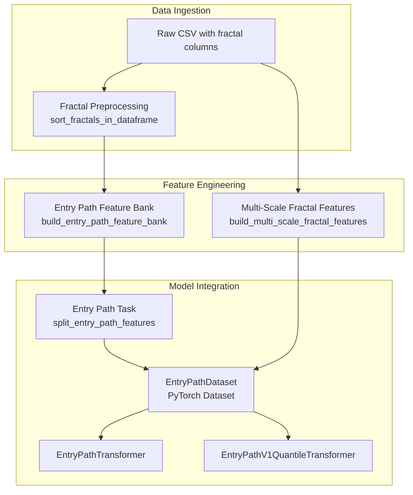
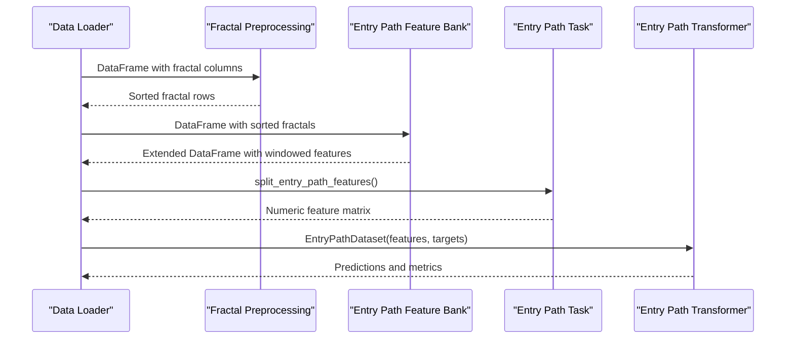
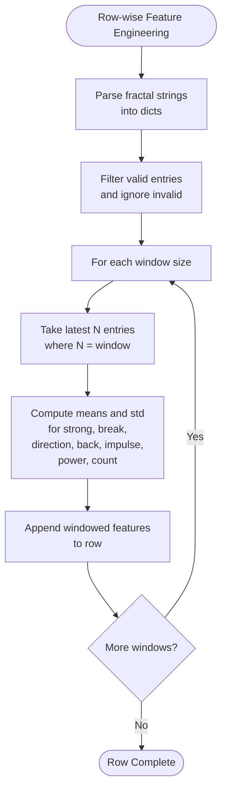
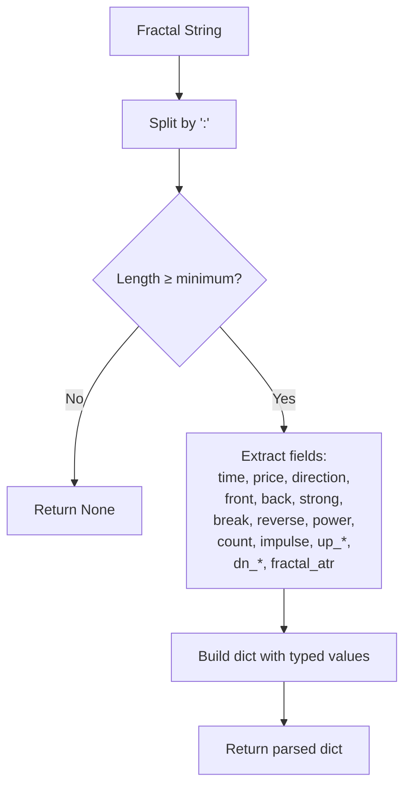
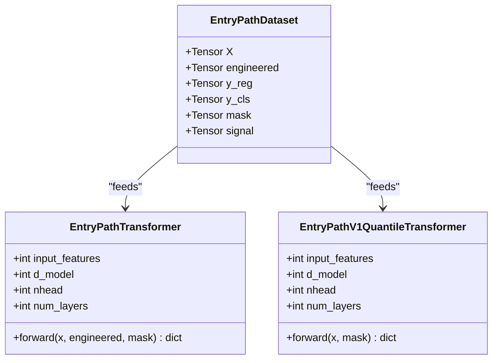
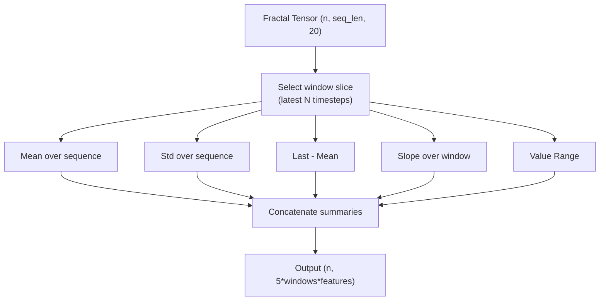
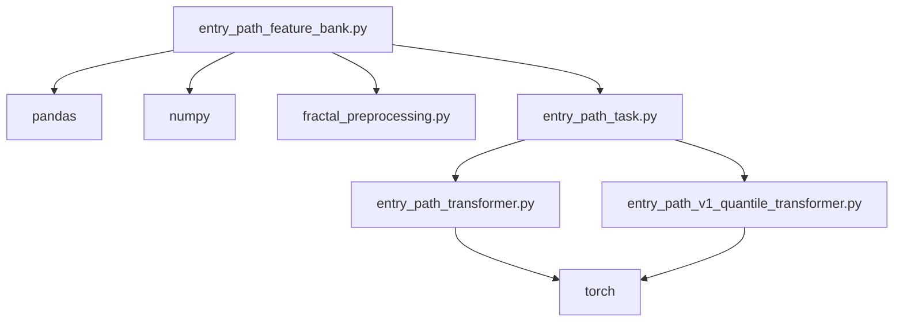

# Entry Path Features

<cite>
**Referenced Files in This Document**
- [entry_path_feature_bank.py](file://ML/entry_path_feature_bank.py)
- [fractal_preprocessing.py](file://processing/fractal_preprocessing.py)
- [multi_scale_fractal_features.py](file://ML/multi_scale_fractal_features.py)
- [entry_path_task.py](file://ML/entry_path_task.py)
- [entry_path_transformer.py](file://ML/models/entry_path_transformer.py)
- [entry_path_v1_quantile_transformer.py](file://ML/models/entry_path_v1_quantile_transformer.py)
- [data_loader.py](file://ML/data_loader.py)
- [test_entry_path_feature_bank.py](file://tests/test_entry_path_feature_bank.py)
- [test_entry_path_task.py](file://tests/test_entry_path_task.py)
- [test_multi_scale_fractal_features.py](file://tests/test_multi_scale_fractal_features.py)
- [signal_tracer.py](file://statistics/signal_tracer.py)
- [normalize.py](file://processing/normalize.py)
- [feature_catalog.json](file://statistics/feature_catalog.json)
</cite>

## Table of Contents
1. [Introduction](#introduction)
2. [Project Structure](#project-structure)
3. [Core Components](#core-components)
4. [Architecture Overview](#architecture-overview)
5. [Detailed Component Analysis](#detailed-component-analysis)
6. [Dependency Analysis](#dependency-analysis)
7. [Performance Considerations](#performance-considerations)
8. [Troubleshooting Guide](#troubleshooting-guide)
9. [Conclusion](#conclusion)

## Introduction
This document describes the entry path feature bank system designed for trend reversal prediction. It explains the row-wise feature engineering methodology that transforms fractal-based trading data into predictive indicators, the multi-window analysis approach using fixed windows of 5, 10, 20, 50, and 100 periods, and the core feature metrics computed for each window. It also covers technical specifications for fractal parsing, feature computation algorithms, integration with entry path models, and practical guidance for interpretation, parameter tuning, and optimization across market conditions and timeframes.

## Project Structure
The entry path feature bank is implemented as a row-wise feature engineering module that augments datasets containing fractal columns with windowed statistics. The system integrates with:
- Fractal preprocessing utilities for sorting and cleaning fractal entries
- Multi-scale feature builders for tensor-based sequences
- Entry path task orchestration for feature selection and model building
- PyTorch datasets and transformers for model consumption

**Diagram sources**
- [fractal_preprocessing.py:65-85](file://processing/fractal_preprocessing.py#L65-L85)
- [entry_path_feature_bank.py:84-108](file://ML/entry_path_feature_bank.py#L84-L108)
- [multi_scale_fractal_features.py:18-38](file://ML/multi_scale_fractal_features.py#L18-L38)
- [entry_path_task.py:61-83](file://ML/entry_path_task.py#L61-L83)
- [data_loader.py:549-784](file://ML/data_loader.py#L549-L784)
- [entry_path_transformer.py:7-115](file://ML/models/entry_path_transformer.py#L7-L115)
- [entry_path_v1_quantile_transformer.py:13-124](file://ML/models/entry_path_v1_quantile_transformer.py#L13-L124)

**Section sources**
- [entry_path_feature_bank.py:12-27](file://ML/entry_path_feature_bank.py#L12-L27)
- [entry_path_task.py:26-38](file://ML/entry_path_task.py#L26-L38)
- [data_loader.py:78-92](file://ML/data_loader.py#L78-L92)

## Core Components
- Entry Path Feature Bank: Computes windowed statistics over parsed fractal rows and produces standardized feature columns for each window.
- Fractal Preprocessing: Sorts fractal entries by time within each row to ensure temporal consistency.
- Multi-Scale Fractal Features: Builds windowed summaries for tensor-based sequences.
- Entry Path Task: Exposes feature column contracts, validates profiles, and prepares features for model consumption.
- PyTorch Datasets and Transformers: Integrate engineered features with sequence modeling architectures.

Key feature metrics computed per window:
- Strong share: Mean of strong indicator across the window
- Break share: Mean of break status across the window
- Direction balance: Mean of directional signal across the window
- Back statistics: Mean and standard deviation of back values
- Impulse mean: Mean of impulse values
- Power mean: Mean of power values
- Count mean: Mean of count values

Windows used: 5, 10, 20, 50, 100 periods.

**Section sources**
- [entry_path_feature_bank.py:12-27](file://ML/entry_path_feature_bank.py#L12-L27)
- [entry_path_feature_bank.py:53-81](file://ML/entry_path_feature_bank.py#L53-L81)
- [entry_path_task.py:26-38](file://ML/entry_path_task.py#L26-L38)

## Architecture Overview
The feature engineering pipeline operates row-wise on datasets containing fractal columns. Each row is parsed into a sequence of fractal dictionaries, then windowed statistics are computed for each predefined window. The resulting features are appended to the original dataframe and later consumed by entry path models.

**Diagram sources**
- [data_loader.py:733-740](file://ML/data_loader.py#L733-L740)
- [entry_path_task.py:61-83](file://ML/entry_path_task.py#L61-L83)
- [entry_path_feature_bank.py:84-108](file://ML/entry_path_feature_bank.py#L84-L108)
- [fractal_preprocessing.py:65-85](file://processing/fractal_preprocessing.py#L65-L85)

## Detailed Component Analysis

### Row-Wise Feature Engineering Pipeline
The feature bank processes each row independently, parsing fractal strings into structured dictionaries and computing windowed statistics. The pipeline handles missing or malformed entries gracefully by ignoring them and filling absent windows with zeros.

**Diagram sources**
- [entry_path_feature_bank.py:30-51](file://ML/entry_path_feature_bank.py#L30-L51)
- [entry_path_feature_bank.py:53-81](file://ML/entry_path_feature_bank.py#L53-L81)
- [entry_path_feature_bank.py:84-108](file://ML/entry_path_feature_bank.py#L84-L108)

**Section sources**
- [entry_path_feature_bank.py:30-81](file://ML/entry_path_feature_bank.py#L30-L81)
- [test_entry_path_feature_bank.py:38-88](file://tests/test_entry_path_feature_bank.py#L38-L88)

### Fractal Parsing Specifications
Fractal strings are colon-delimited sequences representing time, price, direction, front/back values, strong/break flags, reverse, power, count, impulse, and cumulative up/down measures. The parser extracts named fields and tolerates missing or malformed entries.

**Diagram sources**
- [entry_path_feature_bank.py:30-51](file://ML/entry_path_feature_bank.py#L30-L51)
- [signal_tracer.py:204-232](file://statistics/signal_tracer.py#L204-L232)
- [normalize.py:106-126](file://processing/normalize.py#L106-L126)

**Section sources**
- [entry_path_feature_bank.py:30-51](file://ML/entry_path_feature_bank.py#L30-L51)
- [signal_tracer.py:197-232](file://statistics/signal_tracer.py#L197-L232)
- [normalize.py:106-126](file://processing/normalize.py#L106-L126)

### Multi-Window Analysis Approach
The system computes statistics for fixed window sizes to capture short-, medium-, and long-term dynamics:
- Short-term: 5-period window
- Medium-term: 10-period window
- Intermediate: 20-period window
- Long-term: 50- and 100-period windows

Each window yields a set of derived features (means and variance-like quantities) that feed into downstream models.

**Section sources**
- [entry_path_feature_bank.py:12](file://ML/entry_path_feature_bank.py#L12)
- [entry_path_task.py:26-38](file://ML/entry_path_task.py#L26-L38)

### Core Feature Metrics and Computations
For each window, the following metrics are computed:
- row_strong_share_wN: Mean of strong flag
- row_break_share_wN: Mean of break status
- row_direction_balance_wN: Mean of direction
- row_back_mean_wN: Mean of back
- row_back_std_wN: Standard deviation of back
- row_impulse_mean_wN: Mean of impulse
- row_power_mean_wN: Mean of power
- row_count_mean_wN: Mean of count

These are computed over the most recent N entries in the parsed sequence.

**Section sources**
- [entry_path_feature_bank.py:13-22](file://ML/entry_path_feature_bank.py#L13-L22)
- [entry_path_feature_bank.py:53-81](file://ML/entry_path_feature_bank.py#L53-L81)

### Integration with Entry Path Models
Engineered features are integrated with sequence-based models via a dual-stream architecture:
- Sequence features: 100-period fractal tensors with 20 features per timestep
- Engineered features: windowed statistics from the feature bank
- Transformer heads: return prediction, path regression, and path classification outputs

**Diagram sources**
- [entry_path_transformer.py:7-115](file://ML/models/entry_path_transformer.py#L7-L115)
- [entry_path_v1_quantile_transformer.py:13-124](file://ML/models/entry_path_v1_quantile_transformer.py#L13-L124)
- [data_loader.py:516-544](file://ML/data_loader.py#L516-L544)

**Section sources**
- [entry_path_transformer.py:7-115](file://ML/models/entry_path_transformer.py#L7-L115)
- [entry_path_v1_quantile_transformer.py:13-124](file://ML/models/entry_path_v1_quantile_transformer.py#L13-L124)
- [data_loader.py:516-544](file://ML/data_loader.py#L516-L544)

### Multi-Scale Tensor Features
For tensor-based sequences, multi-scale summaries are computed across the same windows, producing concatenated feature vectors that include mean level, standard deviation, last-minus-mean, slope, and value range for each window.

**Diagram sources**
- [multi_scale_fractal_features.py:9-15](file://ML/multi_scale_fractal_features.py#L9-L15)
- [multi_scale_fractal_features.py:18-38](file://ML/multi_scale_fractal_features.py#L18-L38)

**Section sources**
- [multi_scale_fractal_features.py:6-38](file://ML/multi_scale_fractal_features.py#L6-L38)
- [test_multi_scale_fractal_features.py:9-40](file://tests/test_multi_scale_fractal_features.py#L9-L40)

## Dependency Analysis
The feature bank depends on:
- Pandas and NumPy for data manipulation and numerical computations
- Fractal preprocessing utilities for row-wise sorting
- Entry path task for feature column contracts and validation
- PyTorch for model integration

**Diagram sources**
- [entry_path_feature_bank.py:9-10](file://ML/entry_path_feature_bank.py#L9-L10)
- [fractal_preprocessing.py:19](file://processing/fractal_preprocessing.py#L19)
- [entry_path_task.py:5-6](file://ML/entry_path_task.py#L5-L6)
- [entry_path_transformer.py:1-2](file://ML/models/entry_path_transformer.py#L1-L2)
- [entry_path_v1_quantile_transformer.py:7-8](file://ML/models/entry_path_v1_quantile_transformer.py#L7-L8)

**Section sources**
- [entry_path_feature_bank.py:9-10](file://ML/entry_path_feature_bank.py#L9-L10)
- [entry_path_task.py:5-6](file://ML/entry_path_task.py#L5-L6)

## Performance Considerations
- Vectorized parsing: The feature bank processes rows iteratively while leveraging NumPy arrays for efficient aggregation.
- Memory footprint: Windowed features scale linearly with the number of windows and features; consider reducing windows or disabling non-essential metrics for resource-constrained environments.
- Numerical stability: Means and standard deviations are computed safely; ensure input data is cleaned and normalized upstream.
- Multi-scale features: Tensor-based summaries are memory-intensive; use appropriate window sets and sequence lengths for your hardware.

[No sources needed since this section provides general guidance]

## Troubleshooting Guide
Common issues and resolutions:
- Invalid or missing fractal entries: The parser ignores malformed strings and returns None; ensure upstream data cleaning is applied.
- Empty rows: When no valid fractals exist, the feature bank fills windowed columns with zeros.
- Column mismatch: Verify that feature column contracts align with the entry path task; use the provided validation utilities.
- Sequence length constraints: Entry path models support specific sequence lengths; ensure data loaders are configured accordingly.

**Section sources**
- [entry_path_feature_bank.py:30-51](file://ML/entry_path_feature_bank.py#L30-L51)
- [entry_path_feature_bank.py:70-81](file://ML/entry_path_feature_bank.py#L70-L81)
- [entry_path_task.py:54-58](file://ML/entry_path_task.py#L54-L58)
- [data_loader.py:153-159](file://ML/data_loader.py#L153-L159)

## Conclusion
The entry path feature bank provides a robust, row-wise framework for transforming fractal-based trading data into interpretable, multi-window features suitable for trend reversal prediction. By combining temporal sorting, structured parsing, and windowed statistics, it enables consistent feature extraction across diverse market conditions. Integration with transformer-based models allows flexible modeling of both return and path outcomes, while multi-scale tensor features offer complementary perspectives for sequence modeling.