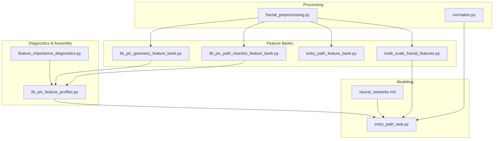
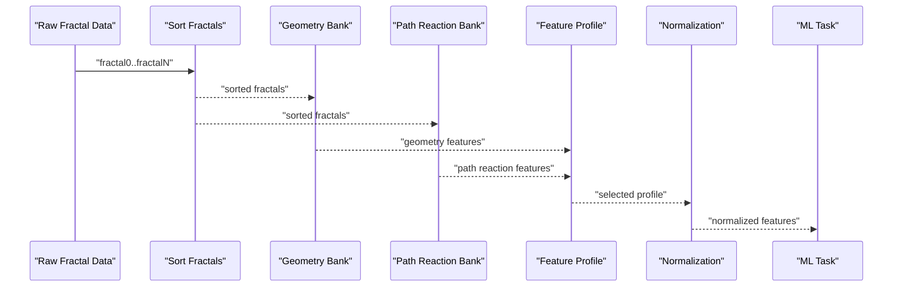
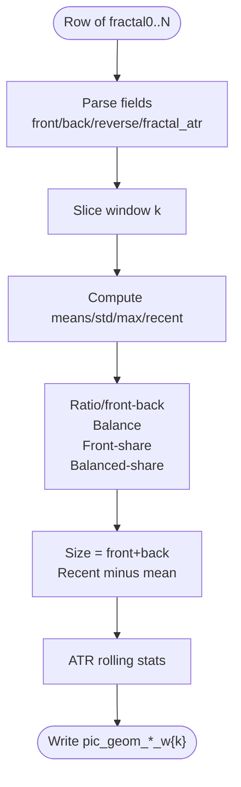
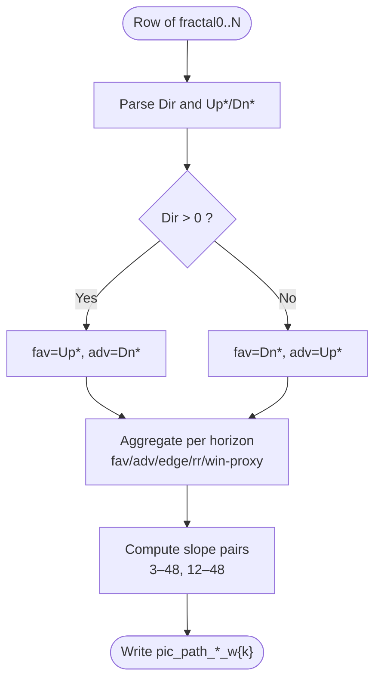
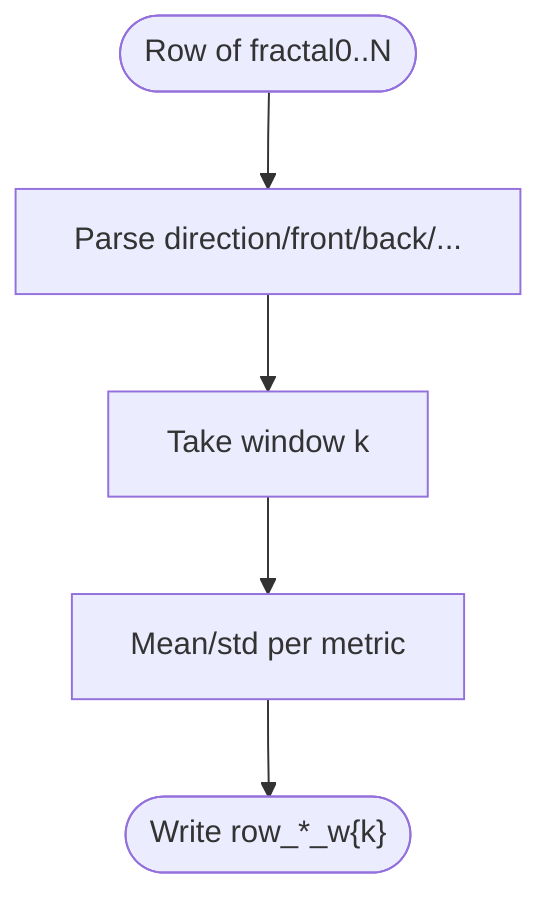
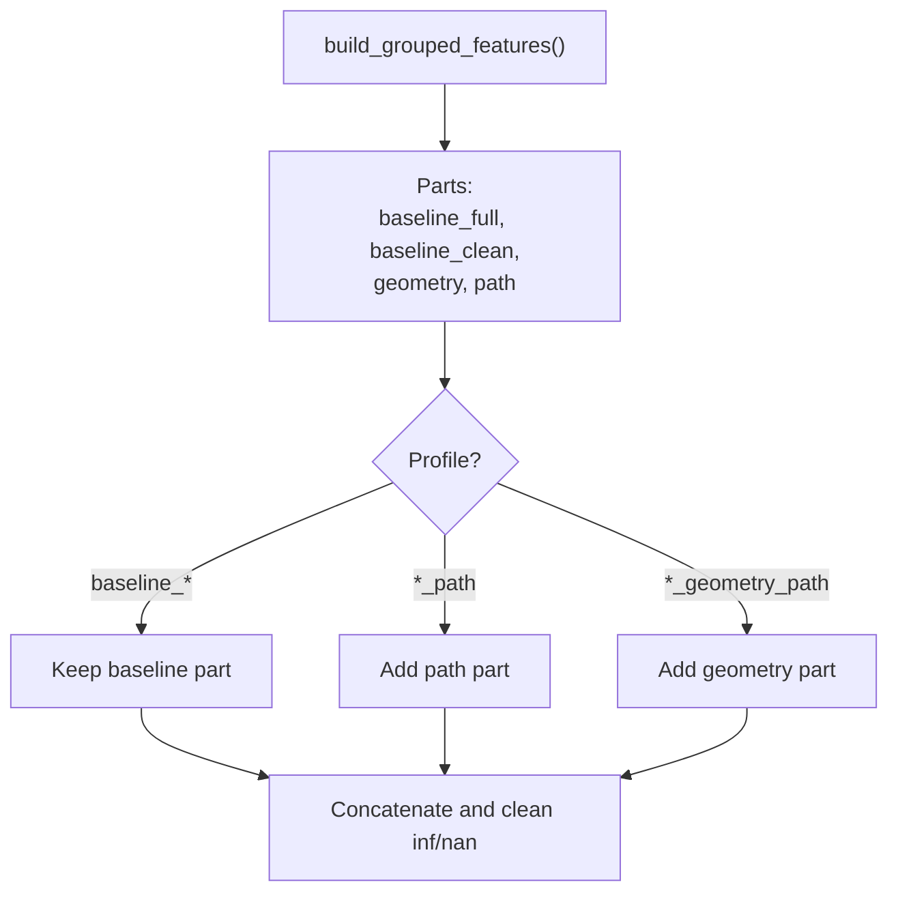
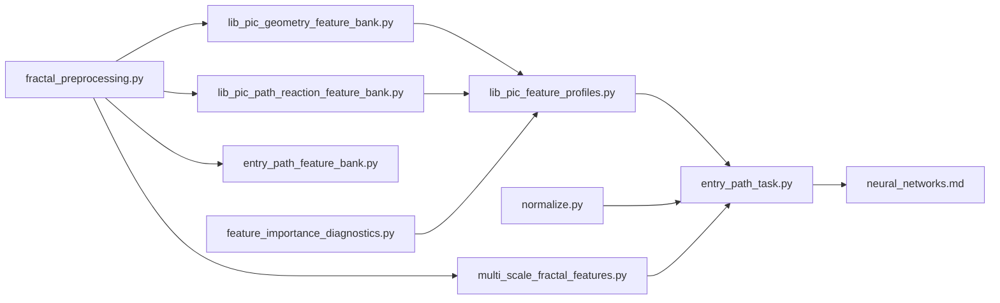

# Feature Banks

<cite>
**Referenced Files in This Document**
- [lib_pic_geometry_feature_bank.py](file://ML/lib_pic_geometry_feature_bank.py)
- [lib_pic_path_reaction_feature_bank.py](file://ML/lib_pic_path_reaction_feature_bank.py)
- [entry_path_feature_bank.py](file://ML/entry_path_feature_bank.py)
- [lib_pic_feature_profiles.py](file://ML/lib_pic_feature_profiles.py)
- [multi_scale_fractal_features.py](file://ML/multi_scale_fractal_features.py)
- [fractal_preprocessing.py](file://processing/fractal_preprocessing.py)
- [normalize.py](file://processing/normalize.py)
- [feature_importance_diagnostics.py](file://ML/feature_importance_diagnostics.py)
- [entry_path_task.py](file://ML/entry_path_task.py)
- [neural_networks.md](file://docs/ML/neural_networks.md)
- [2026-04-19-lib-pic-geometry-feature-bank.md](file://docs/reports/2026-04-19-lib-pic-geometry-feature-bank.md)
- [2026-04-19-lib-pic-path-reaction-feature-bank.md](file://docs/reports/2026-04-19-lib-pic-path-reaction-feature-bank.md)
- [test_lib_pic_geometry_feature_bank.py](file://tests/test_lib_pic_geometry_feature_bank.py)
- [test_lib_pic_path_reaction_feature_bank.py](file://tests/test_lib_pic_path_reaction_feature_bank.py)
- [test_entry_path_feature_bank.py](file://tests/test_entry_path_feature_bank.py)
</cite>

## Table of Contents
1. [Introduction](#introduction)
2. [Project Structure](#project-structure)
3. [Core Components](#core-components)
4. [Architecture Overview](#architecture-overview)
5. [Detailed Component Analysis](#detailed-component-analysis)
6. [Dependency Analysis](#dependency-analysis)
7. [Performance Considerations](#performance-considerations)
8. [Troubleshooting Guide](#troubleshooting-guide)
9. [Conclusion](#conclusion)
10. [Appendices](#appendices)

## Introduction
This document describes SoSimple’s feature bank systems that extract sophisticated technical indicators from fractal-based trading data. It focuses on the LIB-PIC (Level of Interest Based Price Impact Clustering) methodology and three feature bank families:
- LIB-PIC geometry features for spatial pattern recognition around price levels
- LIB-PIC path reaction features for dynamic price behavior after levels
- Entry path features for multi-scale pattern detection supporting trend reversal prediction

It explains how LIB-PIC geometry features are constructed from fractal fields, how path reaction features quantify historical price reactions, and how entry path features summarize row-wise fractal sequences. It also covers technical specifications for feature computation, normalization procedures, and integration with ML models, along with guidance for custom feature development, optimization, and performance tuning across market regimes.

## Project Structure
The feature bank system spans several modules:
- Fractal parsing and sorting utilities
- LIB-PIC geometry and path reaction feature banks
- Entry path feature bank
- Feature profile assembly and grouping diagnostics
- Normalization pipeline for robust feature scaling
- Multi-scale fractal feature extraction for deep learning stacks
- Task orchestration for entry path modeling

**Diagram sources**
- [fractal_preprocessing.py:1-86](file://processing/fractal_preprocessing.py#L1-L86)
- [normalize.py:1-669](file://processing/normalize.py#L1-L669)
- [lib_pic_geometry_feature_bank.py:1-206](file://ML/lib_pic_geometry_feature_bank.py#L1-L206)
- [lib_pic_path_reaction_feature_bank.py:1-225](file://ML/lib_pic_path_reaction_feature_bank.py#L1-L225)
- [entry_path_feature_bank.py:1-109](file://ML/entry_path_feature_bank.py#L1-L109)
- [multi_scale_fractal_features.py:1-39](file://ML/multi_scale_fractal_features.py#L1-L39)
- [feature_importance_diagnostics.py:1-439](file://ML/feature_importance_diagnostics.py#L1-L439)
- [lib_pic_feature_profiles.py:1-102](file://ML/lib_pic_feature_profiles.py#L1-L102)
- [entry_path_task.py:1-41](file://ML/entry_path_task.py#L1-L41)
- [neural_networks.md:82-112](file://docs/ML/neural_networks.md#L82-L112)

**Section sources**
- [fractal_preprocessing.py:1-86](file://processing/fractal_preprocessing.py#L1-L86)
- [normalize.py:1-669](file://processing/normalize.py#L1-L669)
- [lib_pic_geometry_feature_bank.py:1-206](file://ML/lib_pic_geometry_feature_bank.py#L1-L206)
- [lib_pic_path_reaction_feature_bank.py:1-225](file://ML/lib_pic_path_reaction_feature_bank.py#L1-L225)
- [entry_path_feature_bank.py:1-109](file://ML/entry_path_feature_bank.py#L1-L109)
- [multi_scale_fractal_features.py:1-39](file://ML/multi_scale_fractal_features.py#L1-L39)
- [feature_importance_diagnostics.py:1-439](file://ML/feature_importance_diagnostics.py#L1-L439)
- [lib_pic_feature_profiles.py:1-102](file://ML/lib_pic_feature_profiles.py#L1-L102)
- [entry_path_task.py:1-41](file://ML/entry_path_task.py#L1-L41)
- [neural_networks.md:82-112](file://docs/ML/neural_networks.md#L82-L112)

## Core Components
- LIB-PIC geometry feature bank: Computes rolling statistics and derived ratios from front/back/reverse/fractal_atr fields across multiple windows to capture spatial geometry around levels.
- LIB-PIC path reaction feature bank: Aggregates Up/Dn metrics across horizons to measure historical price reaction after levels, flipping favorites/advantages according to level direction.
- Entry path feature bank: Summarizes row-wise fractal sequences with directional balance, strength shares, impulse/power/count statistics, and back distribution moments.
- Feature profiles: Assembles baseline grouped features, geometry, and path reaction features into named profiles for experiments.
- Normalization: Implements row-wise piecewise linear-log transforms for heavy-tailed fields, min-max scaling for prices, and robust ATR scaling for global stability.
- Multi-scale fractal features: Builds windowed summaries from fractal tensors for deep learning pipelines.

**Section sources**
- [lib_pic_geometry_feature_bank.py:159-206](file://ML/lib_pic_geometry_feature_bank.py#L159-L206)
- [lib_pic_path_reaction_feature_bank.py:179-225](file://ML/lib_pic_path_reaction_feature_bank.py#L179-L225)
- [entry_path_feature_bank.py:84-109](file://ML/entry_path_feature_bank.py#L84-L109)
- [lib_pic_feature_profiles.py:57-102](file://ML/lib_pic_feature_profiles.py#L57-L102)
- [normalize.py:284-511](file://processing/normalize.py#L284-L511)
- [multi_scale_fractal_features.py:18-39](file://ML/multi_scale_fractal_features.py#L18-L39)

## Architecture Overview
The LIB-PIC feature bank architecture separates concerns into geometry, path reaction, and entry path domains while preserving temporal correctness and avoiding future leakage.

**Diagram sources**
- [fractal_preprocessing.py:65-86](file://processing/fractal_preprocessing.py#L65-L86)
- [lib_pic_geometry_feature_bank.py:159-206](file://ML/lib_pic_geometry_feature_bank.py#L159-L206)
- [lib_pic_path_reaction_feature_bank.py:179-225](file://ML/lib_pic_path_reaction_feature_bank.py#L179-L225)
- [lib_pic_feature_profiles.py:57-88](file://ML/lib_pic_feature_profiles.py#L57-L88)
- [normalize.py:284-511](file://processing/normalize.py#L284-L511)
- [entry_path_task.py:70-83](file://ML/entry_path_task.py#L70-L83)

## Detailed Component Analysis

### LIB-PIC Geometry Feature Bank
Purpose:
- Extract spatial geometry around price levels from front/back/reverse/fractal_atr fields.
- Build rolling window statistics and derived measures (ratios, balances, dominance shares, slopes) to represent level strength and shape.

Key computations:
- Rolling means, stds, maxima, and recent values for front/back/reverse/size.
- Derived metrics: ratio front/back, balance (front-back)/(front+back), front share, balanced share thresholds, differences from means.
- ATR rolling summaries.
- Window sizes: 5, 10, 20, 50, 100.

Temporal correctness:
- Uses fractal0 as the most recent observation; windows slice backward in time.

Edge cases:
- Handles missing/invalid entries by zero-filling per-window columns.

Validation:
- Tests confirm column presence, recent semantics, legacy support, and zero-fill behavior.

**Diagram sources**
- [lib_pic_geometry_feature_bank.py:105-157](file://ML/lib_pic_geometry_feature_bank.py#L105-L157)

**Section sources**
- [lib_pic_geometry_feature_bank.py:1-206](file://ML/lib_pic_geometry_feature_bank.py#L1-L206)
- [2026-04-19-lib-pic-geometry-feature-bank.md:1-97](file://docs/reports/2026-04-19-lib-pic-geometry-feature-bank.md#L1-L97)
- [test_lib_pic_geometry_feature_bank.py:1-94](file://tests/test_lib_pic_geometry_feature_bank.py#L1-L94)

### LIB-PIC Path Reaction Feature Bank
Purpose:
- Capture historical price reaction after levels across horizons (3/6/12/24/48 bars).
- Translate Up/Dn into favorable/advantageous outcomes relative to level direction.

Key computations:
- Favorable (fav) and adverse (adv) aggregates per horizon.
- Edge = fav - adv; RR = fav / adv; Win proxy = fav > adv.
- Slopes between pairs of horizons (e.g., 3–48, 12–48).
- Windows: 5, 10, 20, 50, 100.

Direction-aware aggregation:
- If level direction > 0, fav = Up, adv = Dn; else flip.

Temporal correctness:
- Up/Dn are incremental accumulations over past bars and exported as known-state, preventing lookahead bias.

Validation:
- Tests verify column creation, direction flipping, legacy handling, and slope calculations.

**Diagram sources**
- [lib_pic_path_reaction_feature_bank.py:136-176](file://ML/lib_pic_path_reaction_feature_bank.py#L136-L176)

**Section sources**
- [lib_pic_path_reaction_feature_bank.py:1-225](file://ML/lib_pic_path_reaction_feature_bank.py#L1-L225)
- [2026-04-19-lib-pic-path-reaction-feature-bank.md:1-85](file://docs/reports/2026-04-19-lib-pic-path-reaction-feature-bank.md#L1-L85)
- [test_lib_pic_path_reaction_feature_bank.py:1-119](file://tests/test_lib_pic_path_reaction_feature_bank.py#L1-L119)

### Entry Path Feature Bank
Purpose:
- Summarize row-wise fractal sequences to support trend reversal prediction and multi-scale pattern detection.
- Provide directional balance, strength shares, impulse/power/count moments, and back distribution statistics.

Key computations:
- Strong share, break share, direction balance.
- Back mean and std, impulse mean, power mean, count mean.
- Windows: 5, 10, 20, 50, 100.

Integration:
- Used by entry path tasks; can be combined with LIB-PIC profiles.

Validation:
- Tests confirm windowed summaries, ignores invalid entries, and zero-fills when none are valid.

**Diagram sources**
- [entry_path_feature_bank.py:53-82](file://ML/entry_path_feature_bank.py#L53-L82)

**Section sources**
- [entry_path_feature_bank.py:1-109](file://ML/entry_path_feature_bank.py#L1-L109)
- [test_entry_path_feature_bank.py:1-89](file://tests/test_entry_path_feature_bank.py#L1-L89)

### Feature Profile Assembly and Grouping
Purpose:
- Assemble LIB-PIC baseline groups, geometry, and path reaction features into named profiles for experimentation.
- Clean baseline by dropping groups identified as detrimental in diagnostics.

Mechanics:
- Build grouped baseline features from raw fractal fields.
- Apply geometry and path reaction banks.
- Concatenate parts and apply prefix filters for geometry/path columns.

Validation:
- Tests confirm profile composition and column filtering.

**Diagram sources**
- [lib_pic_feature_profiles.py:57-88](file://ML/lib_pic_feature_profiles.py#L57-L88)
- [feature_importance_diagnostics.py:160-201](file://ML/feature_importance_diagnostics.py#L160-L201)

**Section sources**
- [lib_pic_feature_profiles.py:1-102](file://ML/lib_pic_feature_profiles.py#L1-L102)
- [feature_importance_diagnostics.py:1-439](file://ML/feature_importance_diagnostics.py#L1-L439)

### Multi-Scale Fractal Features
Purpose:
- Produce windowed summaries from a 3D fractal tensor for deep learning models.
- Enable multi-scale analysis across sequence lengths.

Mechanics:
- For each window, compute mean level, std level, last-minus-mean, slope, and value range across the window slice.
- Concatenate across windows and sanitize NaN/Inf.

**Section sources**
- [multi_scale_fractal_features.py:1-39](file://ML/multi_scale_fractal_features.py#L1-L39)

## Dependency Analysis
- Fractal preprocessing ensures each row’s fractal fields are sorted by time (newest first), which is critical for temporal correctness in all feature banks.
- Normalization applies row-wise transformations to heavy-tailed fields (piecewise linear-log), min-max scaling to prices, and robust scaling to ATR, preventing data leakage and stabilizing training.
- Feature profiles depend on grouped feature diagnostics to select beneficial subsets and exclude problematic groups.
- Entry path tasks orchestrate feature bank application and model instantiation.

**Diagram sources**
- [fractal_preprocessing.py:65-86](file://processing/fractal_preprocessing.py#L65-L86)
- [lib_pic_geometry_feature_bank.py:159-206](file://ML/lib_pic_geometry_feature_bank.py#L159-L206)
- [lib_pic_path_reaction_feature_bank.py:179-225](file://ML/lib_pic_path_reaction_feature_bank.py#L179-L225)
- [entry_path_feature_bank.py:84-109](file://ML/entry_path_feature_bank.py#L84-L109)
- [multi_scale_fractal_features.py:18-39](file://ML/multi_scale_fractal_features.py#L18-L39)
- [lib_pic_feature_profiles.py:57-88](file://ML/lib_pic_feature_profiles.py#L57-L88)
- [feature_importance_diagnostics.py:160-201](file://ML/feature_importance_diagnostics.py#L160-L201)
- [entry_path_task.py:70-83](file://ML/entry_path_task.py#L70-L83)
- [normalize.py:284-511](file://processing/normalize.py#L284-L511)
- [neural_networks.md:82-112](file://docs/ML/neural_networks.md#L82-L112)

**Section sources**
- [fractal_preprocessing.py:1-86](file://processing/fractal_preprocessing.py#L1-L86)
- [normalize.py:1-669](file://processing/normalize.py#L1-L669)
- [lib_pic_feature_profiles.py:1-102](file://ML/lib_pic_feature_profiles.py#L1-L102)
- [feature_importance_diagnostics.py:1-439](file://ML/feature_importance_diagnostics.py#L1-L439)
- [entry_path_task.py:1-41](file://ML/entry_path_task.py#L1-L41)
- [neural_networks.md:82-112](file://docs/ML/neural_networks.md#L82-L112)

## Performance Considerations
- Prefer windowed computations over full-sequence passes to limit memory footprint.
- Normalize only necessary fields to reduce overhead; leverage row-wise transforms to avoid global leakage.
- Use multi-scale summaries for deep learning to capture hierarchical dynamics without exploding dimensionality.
- Validate feature banks on small chunks before full training to detect edge-case failures early.

[No sources needed since this section provides general guidance]

## Troubleshooting Guide
Common issues and resolutions:
- Missing or malformed fractal fields:
  - Symptoms: Zero-filled or NaN-like outputs.
  - Resolution: Ensure fractal0..N are properly formatted; use preprocessing to sort and validate.
- Unexpected direction flips in path reaction features:
  - Symptoms: Fav/Adv swapped.
  - Resolution: Confirm level direction interpretation and window slicing.
- Excessive Inf/NaN after normalization:
  - Symptoms: Model instability or invalid metrics.
  - Resolution: Verify normalization parameters and handle degenerate cases (constant values).
- Dimension mismatches in entry path tasks:
  - Symptoms: Shape errors during model forward pass.
  - Resolution: Confirm feature profile selection and window dimensions align with model expectations.

**Section sources**
- [fractal_preprocessing.py:36-86](file://processing/fractal_preprocessing.py#L36-L86)
- [lib_pic_path_reaction_feature_bank.py:179-225](file://ML/lib_pic_path_reaction_feature_bank.py#L179-L225)
- [normalize.py:284-511](file://processing/normalize.py#L284-L511)
- [entry_path_task.py:70-83](file://ML/entry_path_task.py#L70-L83)

## Conclusion
SoSimple’s feature bank system cleanly separates spatial geometry, post-level reaction, and row-wise entry path signals from fractal data. By maintaining temporal correctness, applying robust normalization, and assembling modular feature profiles, the system supports rigorous experimentation and scalable integration with ML models. The provided components enable customization, validation via tests, and performance tuning across market regimes.

[No sources needed since this section summarizes without analyzing specific files]

## Appendices

### Technical Specifications: Feature Computation and Normalization
- Geometry features:
  - Windows: 5, 10, 20, 50, 100
  - Fields: front, back, reverse, fractal_atr
  - Derived: ratio, balance, front_share, balanced_share, size, recent diffs, ATR stats
- Path reaction features:
  - Windows: 5, 10, 20, 50, 100
  - Horizons: 3, 6, 12, 24, 48
  - Metrics: fav/adv aggregates, edge, RR, win_proxy, slope pairs
- Entry path features:
  - Windows: 5, 10, 20, 50, 100
  - Metrics: strong_share, break_share, direction_balance, back_mean/std, impulse_mean, power_mean, count_mean
- Normalization:
  - Row-wise piecewise linear-log for heavy-tailed fields
  - Min-max for price
  - Robust ATR scaling
  - Legacy fractal support with extended field mapping

**Section sources**
- [lib_pic_geometry_feature_bank.py:21-70](file://ML/lib_pic_geometry_feature_bank.py#L21-L70)
- [lib_pic_path_reaction_feature_bank.py:21-89](file://ML/lib_pic_path_reaction_feature_bank.py#L21-L89)
- [entry_path_feature_bank.py:12-27](file://ML/entry_path_feature_bank.py#L12-L27)
- [normalize.py:284-511](file://processing/normalize.py#L284-L511)

### Integration with ML Models
- Entry path tasks:
  - Automatically builds entry path feature bank when missing
  - Supports transformer and dual-stream architectures
  - Defines feature profiles and target mappings
- Training guidance:
  - Use task-specific feature profiles
  - Configure sequence lengths and model hyperparameters
  - Validate with bounded benchmarks and frozen tests

**Section sources**
- [entry_path_task.py:1-41](file://ML/entry_path_task.py#L1-L41)
- [neural_networks.md:82-112](file://docs/ML/neural_networks.md#L82-L112)