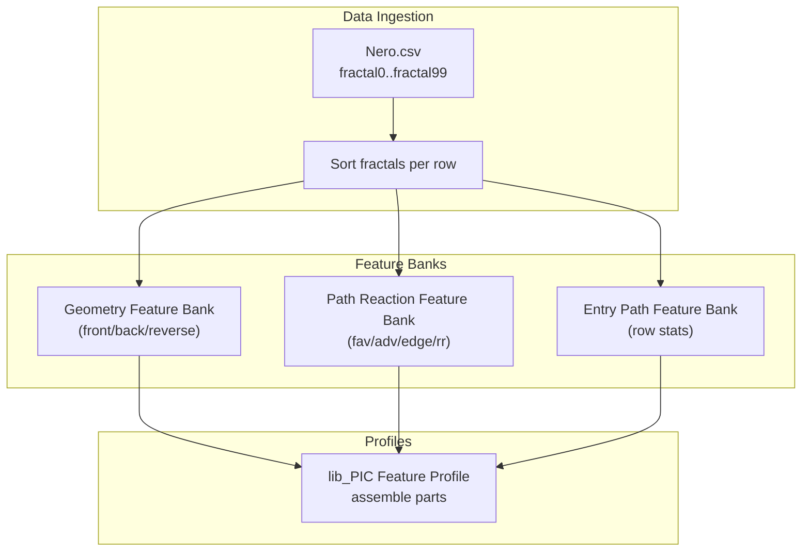
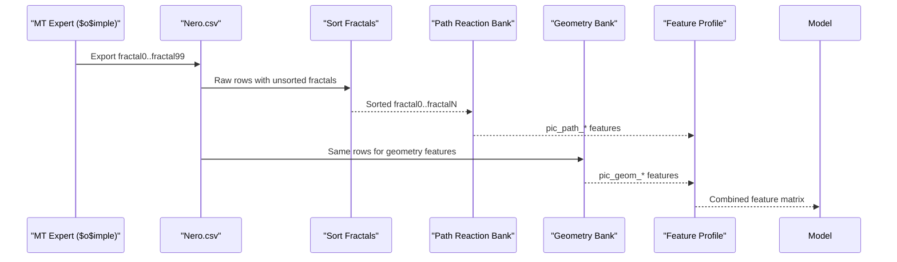
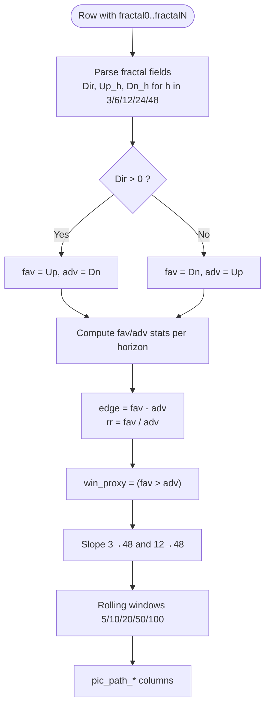
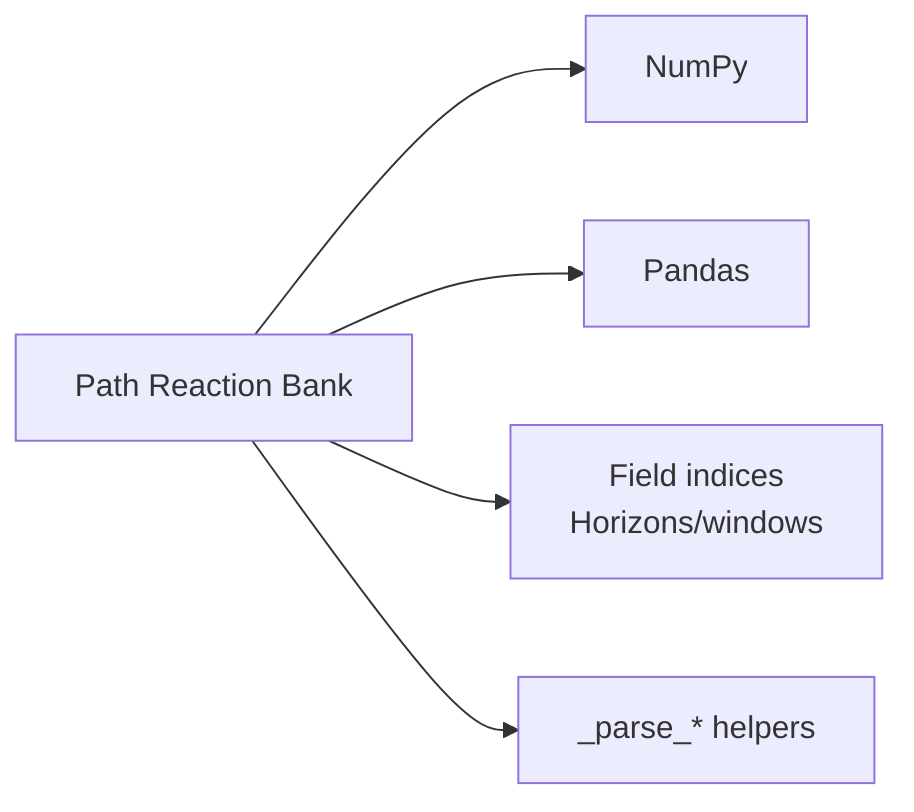

# Path Reaction Features

<cite>
**Referenced Files in This Document**
- [lib_pic_path_reaction_feature_bank.py](file://ML/lib_pic_path_reaction_feature_bank.py)
- [lib_pic_geometry_feature_bank.py](file://ML/lib_pic_geometry_feature_bank.py)
- [lib_pic_feature_profiles.py](file://ML/lib_pic_feature_profiles.py)
- [DATA_FLOW.md](file://docs/DATA_FLOW.md)
- [fractal_preprocessing.py](file://processing/fractal_preprocessing.py)
- [lib_pic_path_reaction_feature_bank.py.md](file://docs/ML/lib_pic_path_reaction_feature_bank.py.md)
- [2026-04-19-lib-pic-geometry-feature-bank.md](file://docs/reports/2026-04-19-lib-pic-geometry-feature-bank.md)
- [test_lib_pic_path_reaction_feature_bank.py](file://tests/test_lib_pic_path_reaction_feature_bank.py)
</cite>

## Table of Contents
1. [Introduction](#introduction)
2. [Project Structure](#project-structure)
3. [Core Components](#core-components)
4. [Architecture Overview](#architecture-overview)
5. [Detailed Component Analysis](#detailed-component-analysis)
6. [Dependency Analysis](#dependency-analysis)
7. [Performance Considerations](#performance-considerations)
8. [Troubleshooting Guide](#troubleshooting-guide)
9. [Conclusion](#conclusion)

## Introduction
This document explains the path reaction feature extraction system that analyzes dynamic price behavior after support/resistance levels detected by the LIB-PIC engine. It focuses on how the system extracts reaction-based features from price movement sequences, including impulse detection, momentum analysis, and trend continuation indicators. It also documents the integration with LIB-PIC clustering results, technical specifications for reaction pattern recognition, feature normalization, and real-time processing capabilities. Guidance is provided for customizing reaction feature parameters, optimizing for different market regimes, and interpreting feature significance in trading decisions.

## Project Structure
The path reaction feature extraction is implemented as a standalone feature bank module that operates on preprocessed LIB-PIC fractal records exported by the MT4/MT5 expert. The module parses fractal strings, interprets directional Up/Dn metrics, and computes windowed statistics that describe how price reacted to historical levels.

**Diagram sources**
- [DATA_FLOW.md:8-120](file://docs/DATA_FLOW.md#L8-L120)
- [lib_pic_geometry_feature_bank.py:1-206](file://ML/lib_pic_geometry_feature_bank.py#L1-L206)
- [lib_pic_path_reaction_feature_bank.py:1-225](file://ML/lib_pic_path_reaction_feature_bank.py#L1-L225)
- [lib_pic_feature_profiles.py:1-102](file://ML/lib_pic_feature_profiles.py#L1-L102)

**Section sources**
- [DATA_FLOW.md:78-144](file://docs/DATA_FLOW.md#L78-L144)
- [fractal_preprocessing.py:1-86](file://processing/fractal_preprocessing.py#L1-L86)

## Core Components
- Path Reaction Feature Bank: Parses LIB-PIC fractal strings and builds reaction-based features from directional Up/Dn metrics across multiple horizons and rolling windows.
- Geometry Feature Bank: Builds geometric features from front/back/reverse and ATR without using Up/Dn, isolating level shape from post-level reaction.
- Feature Profile Assembler: Composes baseline features with geometry and path reaction banks into selectable profiles for training and evaluation.

Key feature families produced by the path reaction bank:
- Favorable/Adverse movement means, maxima, and recent values for horizons 3/6/12/24/48.
- Edge (difference) and Ratio (favorable/adverse) features.
- Win proxy share (favorable majority).
- Slopes capturing reaction momentum between 3–48 and 12–48 bars.

**Section sources**
- [lib_pic_path_reaction_feature_bank.py:21-89](file://ML/lib_pic_path_reaction_feature_bank.py#L21-L89)
- [lib_pic_path_reaction_feature_bank.py.md:57-68](file://docs/ML/lib_pic_path_reaction_feature_bank.py.md#L57-L68)
- [lib_pic_geometry_feature_bank.py:31-70](file://ML/lib_pic_geometry_feature_bank.py#L31-L70)
- [lib_pic_feature_profiles.py:27-33](file://ML/lib_pic_feature_profiles.py#L27-L33)

## Architecture Overview
The path reaction feature extraction integrates into the broader SoSimple pipeline as follows:
- Raw LIB-PIC output (Nero.csv) contains 22-field fractal records with directional Up/Dn for horizons 3/6/12/24/48.
- Fractals are sorted per row to ensure temporal ordering with the newest first.
- The path reaction bank reads fractal0..fractalN and produces windowed reaction features.
- These features are combined with baseline and geometry features via the feature profile assembler.

**Diagram sources**
- [DATA_FLOW.md:8-120](file://docs/DATA_FLOW.md#L8-L120)
- [fractal_preprocessing.py:65-86](file://processing/fractal_preprocessing.py#L65-L86)
- [lib_pic_path_reaction_feature_bank.py:179-225](file://ML/lib_pic_path_reaction_feature_bank.py#L179-L225)
- [lib_pic_geometry_feature_bank.py:159-206](file://ML/lib_pic_geometry_feature_bank.py#L159-L206)
- [lib_pic_feature_profiles.py:57-102](file://ML/lib_pic_feature_profiles.py#L57-L102)

## Detailed Component Analysis

### Path Reaction Feature Bank
The path reaction bank transforms LIB-PIC fractal strings into reaction-based features. It:
- Parses each fractal record into a structured form containing direction and Up/Dn values for horizons 3/6/12/24/48.
- Converts Up/Dn into favorable/adverse based on direction (Dir > 0 vs Dir < 0).
- Computes windowed means, maxima, recent values, differences (edge), ratios (rr), majority proxies (win proxy), and slopes across horizons.
- Supports configurable windows (default 5/10/20/50/100) and ensures robustness against missing or malformed records.

**Diagram sources**
- [lib_pic_path_reaction_feature_bank.py:102-176](file://ML/lib_pic_path_reaction_feature_bank.py#L102-L176)

**Section sources**
- [lib_pic_path_reaction_feature_bank.py:102-176](file://ML/lib_pic_path_reaction_feature_bank.py#L102-L176)
- [lib_pic_path_reaction_feature_bank.py.md:43-67](file://docs/ML/lib_pic_path_reaction_feature_bank.py.md#L43-L67)

### Integration with LIB-PIC Clustering Results
LIB-PIC clustering organizes levels by stability and strength. The path reaction bank consumes the same fractal records that feed clustering, ensuring that reaction features reflect the actual levels present in the clustering framework. The geometry bank complements this by focusing on level shape, while the path reaction bank focuses on post-level price reaction. Together, they enable richer feature sets for downstream models.

- Geometry bank: front/back/reverse and derived measures (ratio, balance, dominant share, balanced share).
- Path reaction bank: fav/adv/edge/rr/win-proxy and slope-based momentum.

These are assembled into selectable profiles for training and validation.

**Section sources**
- [lib_pic_geometry_feature_bank.py:31-70](file://ML/lib_pic_geometry_feature_bank.py#L31-L70)
- [lib_pic_path_reaction_feature_bank.py.md:7-8](file://docs/ML/lib_pic_path_reaction_feature_bank.py.md#L7-L8)
- [lib_pic_feature_profiles.py:57-87](file://ML/lib_pic_feature_profiles.py#L57-L87)

### Technical Specifications
- Input format: Each row contains fractal0..fractalN strings with 22 fields including direction and Up/Dn horizons.
- Window sizes: Default 5/10/20/50/100; can be customized.
- Horizon set: 3/6/12/24/48.
- Output prefix: pic_path_.
- Direction handling: Fav/Adv mapping flips for negative direction.
- Robustness: Missing or malformed entries are handled gracefully; infinities and NaNs are replaced with zeros.

**Section sources**
- [lib_pic_path_reaction_feature_bank.py:21-89](file://ML/lib_pic_path_reaction_feature_bank.py#L21-L89)
- [lib_pic_path_reaction_feature_bank.py:179-225](file://ML/lib_pic_path_reaction_feature_bank.py#L179-L225)
- [DATA_FLOW.md:87-114](file://docs/DATA_FLOW.md#L87-L114)

### Methodology: Impulse Detection, Momentum Analysis, Trend Continuation
- Impulse detection: Impulse field in the fractal record can be used as a proxy for level strength; the path reaction bank aggregates row-level impulses alongside reaction features.
- Momentum analysis: Slope features compare reaction change between early (3 or 12) and late (48) horizons, capturing acceleration or deceleration of price response.
- Trend continuation indicators: Favorable/Adverse mean and recent values help identify whether price momentum aligns with the level’s direction.

**Section sources**
- [lib_pic_path_reaction_feature_bank.py:136-176](file://ML/lib_pic_path_reaction_feature_bank.py#L136-L176)
- [lib_pic_geometry_feature_bank.py:105-156](file://ML/lib_pic_geometry_feature_bank.py#L105-L156)

### Real-Time Processing Capabilities
- Row-wise processing: The feature bank operates independently on each row, preserving temporal order and avoiding leakage.
- Streaming-friendly: New rows can be appended to the DataFrame and processed incrementally; the bank only depends on the most recent fractal0..fractalN subset determined by the configured windows.
- Zero-filling: Missing or legacy fractal records are safely zero-filled to maintain consistent column shapes.

**Section sources**
- [fractal_preprocessing.py:65-86](file://processing/fractal_preprocessing.py#L65-L86)
- [lib_pic_path_reaction_feature_bank.py:179-225](file://ML/lib_pic_path_reaction_feature_bank.py#L179-L225)

### Customization and Optimization Guidelines
- Adjust window sizes: Increase/decrease windows to emphasize shorter/longer-term reactions depending on regime.
- Regime adaptation: Combine path reaction features with volatility regimes and session filters to tailor sensitivity.
- Interpretation tips:
  - Positive edge and rr indicate stronger favorable reactions.
  - Rising slopes suggest accelerating momentum.
  - High win_proxy indicates majority alignment with the level’s direction.

Validation-first experiments are recommended before incorporating into training to avoid overfitting.

**Section sources**
- [lib_pic_path_reaction_feature_bank.py.md:75-80](file://docs/ML/lib_pic_path_reaction_feature_bank.py.md#L75-L80)
- [DATA_FLOW.md:525-534](file://docs/DATA_FLOW.md#L525-L534)

## Dependency Analysis
The path reaction feature bank depends on:
- Fractal parsing utilities and constants for field indices.
- NumPy/SciPy-style aggregation functions for rolling windows and robust statistics.
- Pandas for DataFrame operations and column assembly.

**Diagram sources**
- [lib_pic_path_reaction_feature_bank.py:17-37](file://ML/lib_pic_path_reaction_feature_bank.py#L17-L37)
- [lib_pic_path_reaction_feature_bank.py:92-176](file://ML/lib_pic_path_reaction_feature_bank.py#L92-L176)

**Section sources**
- [lib_pic_path_reaction_feature_bank.py:17-37](file://ML/lib_pic_path_reaction_feature_bank.py#L17-L37)
- [lib_pic_path_reaction_feature_bank.py:92-176](file://ML/lib_pic_path_reaction_feature_bank.py#L92-L176)

## Performance Considerations
- Complexity: Per-row processing scales linearly with the number of included fractals and windows.
- Memory: Aggregations are computed in chunks per window; output is a fixed set of new columns per window/horizon.
- Numerical stability: Division by small adv values uses epsilon to avoid overflow; inf/nan are replaced with zeros.

[No sources needed since this section provides general guidance]

## Troubleshooting Guide
Common issues and resolutions:
- Empty or legacy fractal strings: Handled by zero-filling; verify that the expected number of fractal columns is present.
- Direction inversion: Confirm that Dir > 0 maps to fav=Up, adv=Dn and vice versa.
- Inf/nan propagation: The bank replaces infinities and NaNs with zeros; inspect raw Up/Dn values if unexpected spikes occur.
- Column mismatch: Ensure the DataFrame includes fractal0..fractalN and that sorting was applied before feature extraction.

Validation tests demonstrate expected behavior for long/short directions, empty/legacy inputs, and recent-value semantics.

**Section sources**
- [test_lib_pic_path_reaction_feature_bank.py:38-119](file://tests/test_lib_pic_path_reaction_feature_bank.py#L38-L119)
- [lib_pic_path_reaction_feature_bank.py:179-225](file://ML/lib_pic_path_reaction_feature_bank.py#L179-L225)

## Conclusion
The path reaction feature extraction system provides a robust, validated layer for capturing price reactions to historical levels. By separating reaction features from geometry and integrating cleanly with LIB-PIC outputs, it enables targeted experimentation and regime-aware modeling. Use the provided tests and documentation to validate configurations, and adopt a validation-first approach when adding these features to training pipelines.