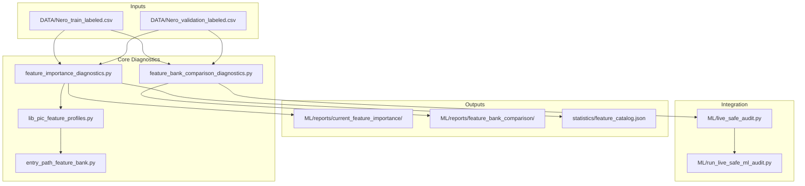
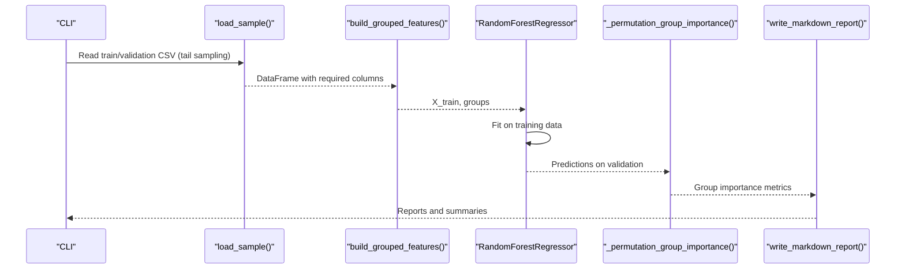
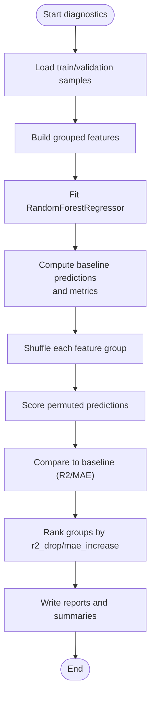
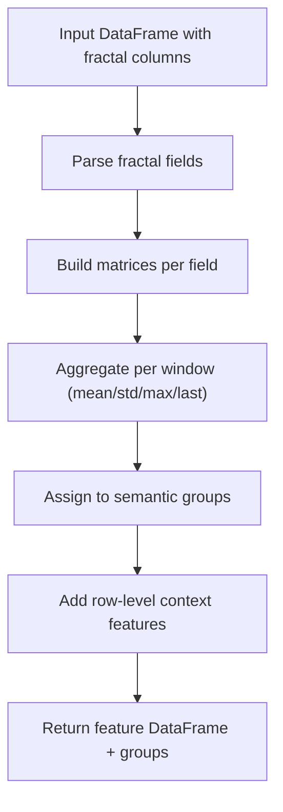
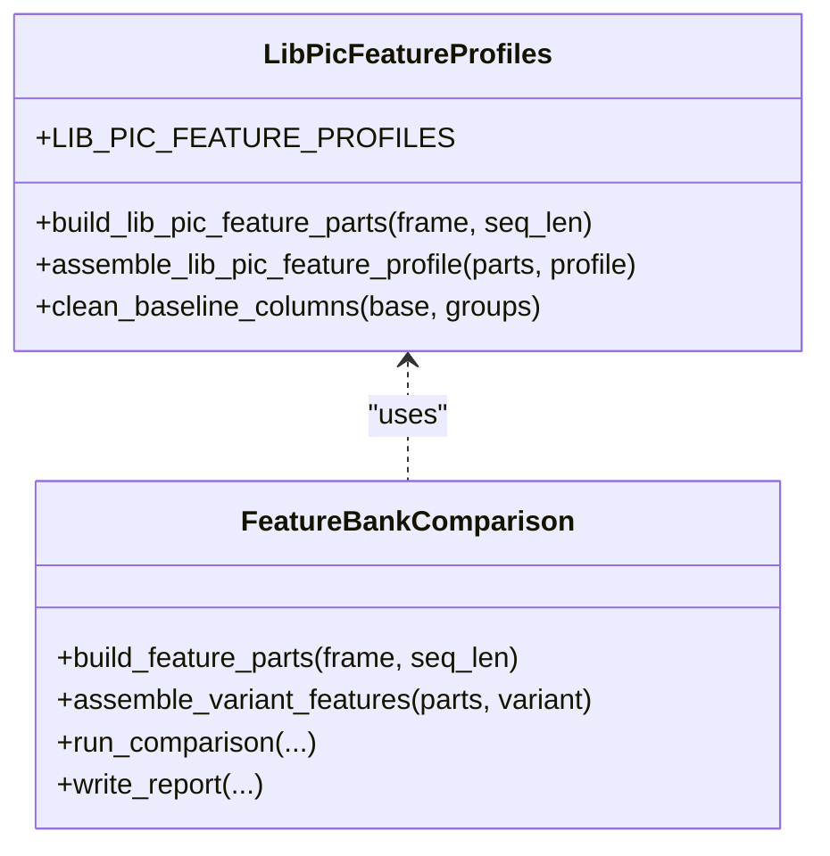
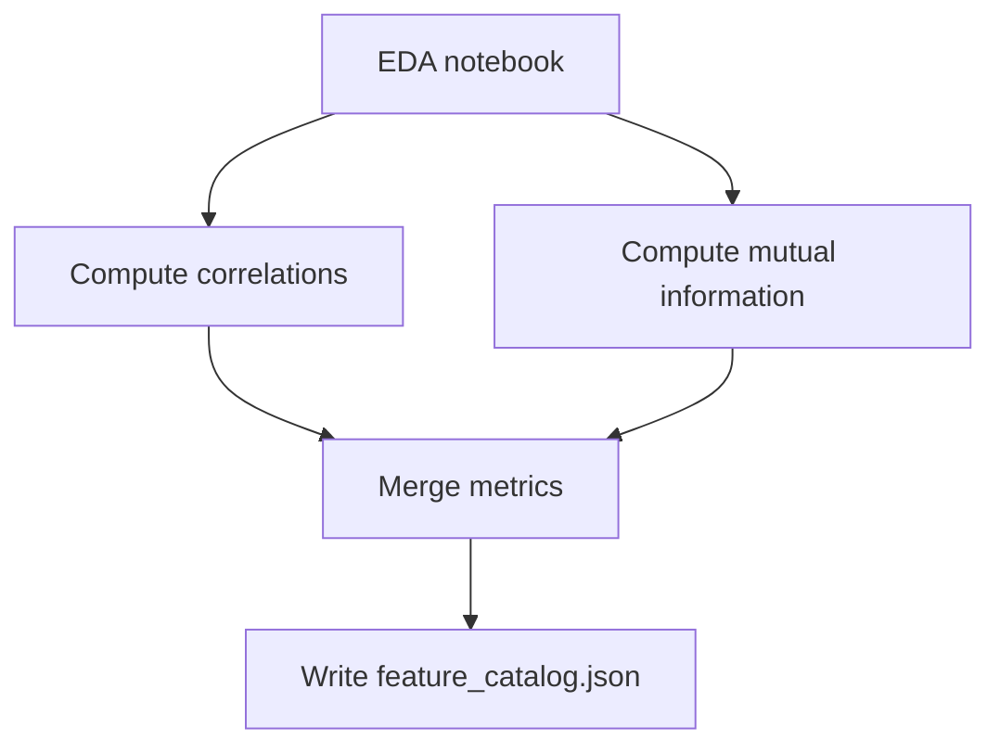
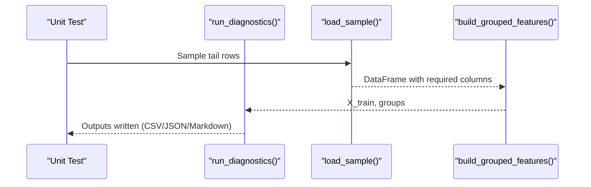
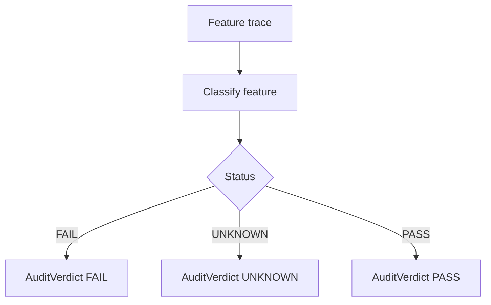
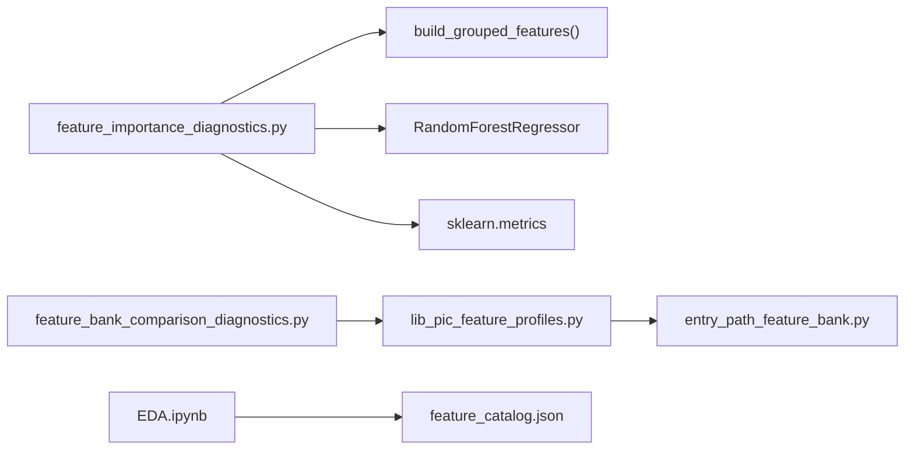

# Feature Importance Diagnostics

<cite>
**Referenced Files in This Document**
- [feature_importance_diagnostics.py](file://ML/feature_importance_diagnostics.py)
- [report.md](file://ML/reports/current_feature_importance/report.md)
- [summary.json](file://ML/reports/current_feature_importance/summary.json)
- [feature_bank_comparison_diagnostics.py](file://ML/feature_bank_comparison_diagnostics.py)
- [lib_pic_feature_profiles.py](file://ML/lib_pic_feature_profiles.py)
- [entry_path_feature_bank.py](file://ML/entry_path_feature_bank.py)
- [feature_catalog.json](file://statistics/feature_catalog.json)
- [EDA.ipynb](file://statistics/EDA.ipynb)
- [test_feature_importance_diagnostics.py](file://tests/test_feature_importance_diagnostics.py)
- [2026-04-19-current-feature-importance-diagnostics.md](file://docs/reports/2026-04-19-current-feature-importance-diagnostics.md)
- [run_live_safe_ml_audit.py](file://ML/run_live_safe_ml_audit.py)
- [live_safe_audit.py](file://ML/live_safe_audit.py)
</cite>

## Table of Contents
1. [Introduction](#introduction)
2. [Project Structure](#project-structure)
3. [Core Components](#core-components)
4. [Architecture Overview](#architecture-overview)
5. [Detailed Component Analysis](#detailed-component-analysis)
6. [Dependency Analysis](#dependency-analysis)
7. [Performance Considerations](#performance-considerations)
8. [Troubleshooting Guide](#troubleshooting-guide)
9. [Conclusion](#conclusion)
10. [Appendices](#appendices)

## Introduction
This document describes the feature importance analysis and diagnostics system used to evaluate machine learning model interpretability and feature relevance. The system focuses on:
- Statistical measurement of feature contribution via permutation importance and correlation-based analysis
- Automated reporting for group and individual feature rankings
- Integration with model evaluation pipelines and live-safe audits
- Practical guidance for feature selection, dimensionality reduction, and continuous monitoring

The diagnostics operate on labeled CSV exports and are designed as read-only, non-invasive checks that inform engineering decisions prior to model training or library changes.

## Project Structure
The feature importance diagnostics system comprises:
- Core diagnostic pipeline for permutation-based group importance
- Feature bank comparison diagnostics for baseline vs. extended feature sets
- Supporting modules for feature parsing, grouping, and assembly
- Reporting outputs and automated tests
- Integration with live-safe auditing and catalog-based feature analysis

**Diagram sources**
- [feature_importance_diagnostics.py:260-336](file://ML/feature_importance_diagnostics.py#L260-L336)
- [feature_bank_comparison_diagnostics.py:107-158](file://ML/feature_bank_comparison_diagnostics.py#L107-L158)
- [lib_pic_feature_profiles.py:57-101](file://ML/lib_pic_feature_profiles.py#L57-L101)
- [entry_path_feature_bank.py:84-108](file://ML/entry_path_feature_bank.py#L84-L108)
- [live_safe_audit.py:41-64](file://ML/live_safe_audit.py#L41-L64)
- [run_live_safe_ml_audit.py:156-173](file://ML/run_live_safe_ml_audit.py#L156-L173)

**Section sources**
- [feature_importance_diagnostics.py:1-439](file://ML/feature_importance_diagnostics.py#L1-L439)
- [feature_bank_comparison_diagnostics.py:1-245](file://ML/feature_bank_comparison_diagnostics.py#L1-L245)
- [lib_pic_feature_profiles.py:1-102](file://ML/lib_pic_feature_profiles.py#L1-L102)
- [entry_path_feature_bank.py:1-109](file://ML/entry_path_feature_bank.py#L1-L109)
- [report.md:1-71](file://ML/reports/current_feature_importance/report.md#L1-L71)
- [summary.json:1-16](file://ML/reports/current_feature_importance/summary.json#L1-L16)
- [feature_catalog.json:1-800](file://statistics/feature_catalog.json#L1-L800)
- [EDA.ipynb:3683-3719](file://statistics/EDA.ipynb#L3683-L3719)
- [test_feature_importance_diagnostics.py:1-94](file://tests/test_feature_importance_diagnostics.py#L1-L94)
- [2026-04-19-current-feature-importance-diagnostics.md:1-105](file://docs/reports/2026-04-19-current-feature-importance-diagnostics.md#L1-L105)
- [live_safe_audit.py:41-64](file://ML/live_safe_audit.py#L41-L64)
- [run_live_safe_ml_audit.py:156-173](file://ML/run_live_safe_ml_audit.py#L156-L173)

## Core Components
- Permutation-based group importance: Measures how much validation performance drops when entire feature groups are shuffled, using R2 and MAE as metrics.
- Grouped feature builder: Parses fractal sequences, aggregates rolling statistics across windows, and constructs semantic groups (geometry, strength, path, etc.).
- Feature bank comparison: Compares baseline and extended feature profiles (geometry/path banks) using a lightweight regressor.
- Reporting and catalogs: Produces structured reports, JSON summaries, and a feature catalog with correlation and mutual information scores.
- Live-safe audit integration: Ensures inputs remain valid and future-free for deployment readiness.

Key outputs:
- Group importance CSV and Markdown report
- Feature importance CSV and Markdown report
- Summary JSON with diagnostics metadata
- Feature bank comparison CSV/JSON/Markdown
- Feature catalog JSON for downstream analysis

**Section sources**
- [feature_importance_diagnostics.py:225-336](file://ML/feature_importance_diagnostics.py#L225-L336)
- [lib_pic_feature_profiles.py:57-101](file://ML/lib_pic_feature_profiles.py#L57-L101)
- [feature_bank_comparison_diagnostics.py:107-158](file://ML/feature_bank_comparison_diagnostics.py#L107-L158)
- [report.md:1-71](file://ML/reports/current_feature_importance/report.md#L1-L71)
- [summary.json:1-16](file://ML/reports/current_feature_importance/summary.json#L1-L16)
- [feature_catalog.json:1-800](file://statistics/feature_catalog.json#L1-L800)

## Architecture Overview
The diagnostics pipeline follows a deterministic flow:
- Load labeled CSV chunks and tail samples
- Parse fractal sequences and build grouped features
- Train a lightweight regressor and compute baseline metrics
- Evaluate group importance via permutation on validation
- Aggregate and export reports and summaries
- Optionally compare feature bank variants and integrate with live-safe checks

**Diagram sources**
- [feature_importance_diagnostics.py:106-336](file://ML/feature_importance_diagnostics.py#L106-L336)

**Section sources**
- [feature_importance_diagnostics.py:106-336](file://ML/feature_importance_diagnostics.py#L106-L336)

## Detailed Component Analysis

### Permutation-Based Group Importance
- Purpose: Estimate group-level feature contribution by shuffling entire groups on validation and measuring performance change.
- Metrics: Baseline R2/MAE and directional accuracy; per-group r2_drop and mae_increase.
- Workflow:
  - Fit a fast regressor on training features
  - Compute baseline predictions and metrics on validation
  - For each group, shuffle only that group’s columns and measure performance drop
  - Sort groups by combined r2_drop and mae_increase

**Diagram sources**
- [feature_importance_diagnostics.py:225-300](file://ML/feature_importance_diagnostics.py#L225-L300)

**Section sources**
- [feature_importance_diagnostics.py:225-300](file://ML/feature_importance_diagnostics.py#L225-L300)

### Grouped Feature Builder
- Parses 22-field fractal format and builds rolling aggregates across windows 5/10/20/50/100.
- Groups features by semantics: geometry, strength, path, direction, price position, ATR, row context.
- Adds row-level context features (e.g., time-of-day encodings) when available.

**Diagram sources**
- [feature_importance_diagnostics.py:160-200](file://ML/feature_importance_diagnostics.py#L160-L200)

**Section sources**
- [feature_importance_diagnostics.py:160-200](file://ML/feature_importance_diagnostics.py#L160-L200)

### Feature Bank Comparison Diagnostics
- Assembles baseline and extended feature profiles (geometry/path banks) from precomputed parts.
- Scores each variant with R2/MAE/directional accuracy and ranks them.
- Provides actionable interpretation of which extensions improve performance.

**Diagram sources**
- [lib_pic_feature_profiles.py:57-101](file://ML/lib_pic_feature_profiles.py#L57-L101)
- [feature_bank_comparison_diagnostics.py:57-158](file://ML/feature_bank_comparison_diagnostics.py#L57-L158)

**Section sources**
- [lib_pic_feature_profiles.py:57-101](file://ML/lib_pic_feature_profiles.py#L57-L101)
- [feature_bank_comparison_diagnostics.py:107-158](file://ML/feature_bank_comparison_diagnostics.py#L107-L158)

### Correlation-Based Analysis and Catalog
- Correlation analysis and mutual information ranking are computed in EDA notebooks and exported to a feature catalog.
- The catalog includes importance rank, correlation with target, mutual information, and composite importance score.
- Useful for cross-checking permutation results and guiding feature selection.

**Diagram sources**
- [EDA.ipynb:3353-3394](file://statistics/EDA.ipynb#L3353-L3394)
- [feature_catalog.json:1-800](file://statistics/feature_catalog.json#L1-L800)

**Section sources**
- [EDA.ipynb:3353-3394](file://statistics/EDA.ipynb#L3353-L3394)
- [feature_catalog.json:1-800](file://statistics/feature_catalog.json#L1-L800)

### Automated Reporting and Tests
- Reports include scope, configuration, baseline metrics, group importance, top features, and interpretation rules.
- Tests validate feature construction, tail sampling, and end-to-end outputs.

**Diagram sources**
- [test_feature_importance_diagnostics.py:70-94](file://tests/test_feature_importance_diagnostics.py#L70-L94)
- [feature_importance_diagnostics.py:106-336](file://ML/feature_importance_diagnostics.py#L106-L336)

**Section sources**
- [test_feature_importance_diagnostics.py:1-94](file://tests/test_feature_importance_diagnostics.py#L1-L94)
- [report.md:1-71](file://ML/reports/current_feature_importance/report.md#L1-L71)
- [summary.json:1-16](file://ML/reports/current_feature_importance/summary.json#L1-L16)

### Live-Safe Audit Integration
- Live-safe audit classifies features by source, transformation, availability time, and evidence.
- The audit ensures no future-derived or invalid inputs are included in production pipelines.
- Audit results feed into system-level verdicts.

**Diagram sources**
- [live_safe_audit.py:41-64](file://ML/live_safe_audit.py#L41-L64)
- [run_live_safe_ml_audit.py:156-173](file://ML/run_live_safe_ml_audit.py#L156-L173)

**Section sources**
- [live_safe_audit.py:41-64](file://ML/live_safe_audit.py#L41-L64)
- [run_live_safe_ml_audit.py:156-173](file://ML/run_live_safe_ml_audit.py#L156-L173)

## Dependency Analysis
- Core diagnostics depend on grouped feature building and optional geometry/path banks.
- Feature bank comparison reuses the same parts assembly mechanism.
- Reporting depends on pandas/numpy/scikit-learn for data manipulation and modeling.
- Tests validate end-to-end behavior and output correctness.

**Diagram sources**
- [feature_importance_diagnostics.py:284-291](file://ML/feature_importance_diagnostics.py#L284-L291)
- [feature_bank_comparison_diagnostics.py:57-85](file://ML/feature_bank_comparison_diagnostics.py#L57-L85)
- [lib_pic_feature_profiles.py:57-87](file://ML/lib_pic_feature_profiles.py#L57-L87)
- [entry_path_feature_bank.py:84-108](file://ML/entry_path_feature_bank.py#L84-L108)
- [EDA.ipynb:3353-3394](file://statistics/EDA.ipynb#L3353-L3394)

**Section sources**
- [feature_importance_diagnostics.py:284-291](file://ML/feature_importance_diagnostics.py#L284-L291)
- [feature_bank_comparison_diagnostics.py:57-85](file://ML/feature_bank_comparison_diagnostics.py#L57-L85)
- [lib_pic_feature_profiles.py:57-87](file://ML/lib_pic_feature_profiles.py#L57-L87)
- [entry_path_feature_bank.py:84-108](file://ML/entry_path_feature_bank.py#L84-L108)
- [EDA.ipynb:3353-3394](file://statistics/EDA.ipynb#L3353-L3394)

## Performance Considerations
- Chunked CSV loading prevents memory spikes during ingestion.
- Tail sampling ensures recent data coverage without full-file reads.
- Lightweight regressor enables quick diagnostics without heavy training.
- Aggregation windows and feature counts are bounded to maintain tractability.

[No sources needed since this section provides general guidance]

## Troubleshooting Guide
Common issues and resolutions:
- Missing required columns in CSV: The loader raises explicit errors when targets or fractal columns are absent.
- Empty samples after filtering: Ensure targets are non-null and chunk sizes are appropriate.
- Unexpected zero or infinite values: The builder replaces infinities and NaNs with zeros.
- Group permutation yields negative effects: Indicates potential leakage or overfitting; review feature construction and target alignment.

**Section sources**
- [feature_importance_diagnostics.py:106-125](file://ML/feature_importance_diagnostics.py#L106-L125)
- [feature_importance_diagnostics.py:199-200](file://ML/feature_importance_diagnostics.py#L199-L200)

## Conclusion
The feature importance diagnostics system provides a robust, read-only framework for interpreting model inputs, validating feature relevance, and guiding feature engineering. By combining permutation-based group importance with correlation/MI analysis and live-safe audits, teams can make informed decisions about feature selection, dimensionality reduction, and continuous monitoring without altering training pipelines or production code.

[No sources needed since this section summarizes without analyzing specific files]

## Appendices

### Statistical Methods Overview
- Permutation importance: Shuffle entire groups on validation and measure performance degradation.
- Correlation-based analysis: Pearson correlation and mutual information for nonlinear dependence.
- Directional accuracy: Sign agreement between true and predicted targets.

**Section sources**
- [feature_importance_diagnostics.py:225-300](file://ML/feature_importance_diagnostics.py#L225-L300)
- [EDA.ipynb:3353-3394](file://statistics/EDA.ipynb#L3353-L3394)

### Diagnostic Workflows and Interpretation Guidelines
- Use group importance to prioritize meaningful input families (e.g., geometry).
- Cross-check with correlation/MI rankings and feature catalogs.
- Treat diagnostics as input insights, not trading verdicts.
- Apply clean-up rules to remove weak or redundant groups.

**Section sources**
- [2026-04-19-current-feature-importance-diagnostics.md:83-94](file://docs/reports/2026-04-19-current-feature-importance-diagnostics.md#L83-L94)
- [report.md:66-70](file://ML/reports/current_feature_importance/report.md#L66-L70)

### Practical Examples and Scenarios
- Instruments: EURUSD, GBPUSD, USDCHF, XAUUSD, XAGUSD
- Timeframes: H1, H4, Daily (adapt seq_len and windows accordingly)
- Market regimes: Range-bound, trending, high-volatility periods (monitor drift via catalogs and reports)

[No sources needed since this section provides general guidance]

### Feature Selection and Dimensionality Reduction
- Strategy: Start with geometry/path banks; prune weak groups; retain robust interactions.
- Techniques: Remove near-zero-variance features; apply correlation-based redundancy checks; leverage mutual information for nonlinear signals.
- Continuous monitoring: Track feature catalog importance ranks and report trends over time.

**Section sources**
- [lib_pic_feature_profiles.py:48-54](file://ML/lib_pic_feature_profiles.py#L48-L54)
- [feature_bank_comparison_diagnostics.py:196-207](file://ML/feature_bank_comparison_diagnostics.py#L196-L207)
- [feature_catalog.json:1-800](file://statistics/feature_catalog.json#L1-L800)