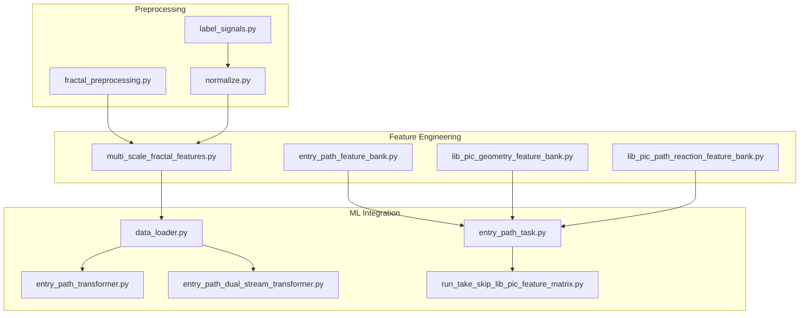
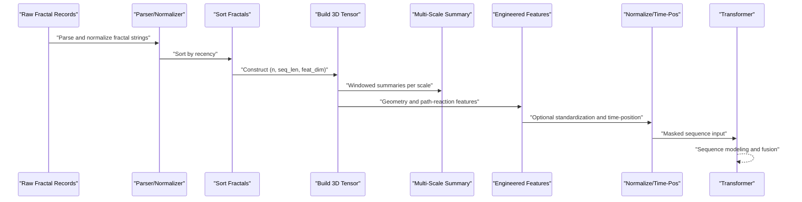
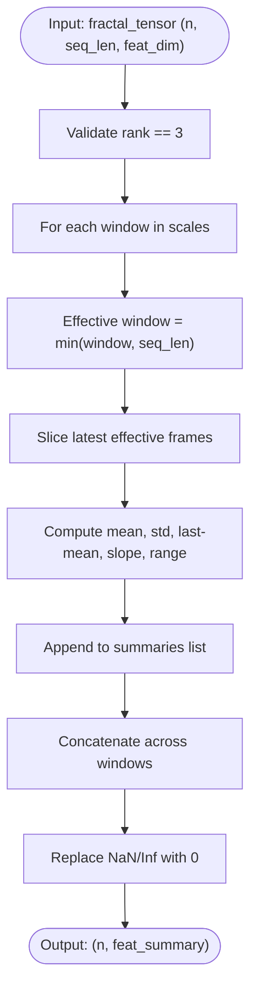
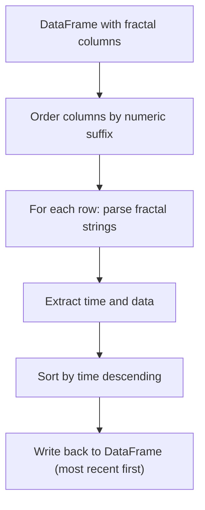
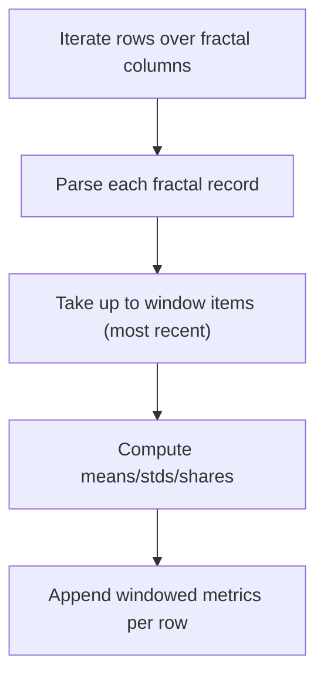
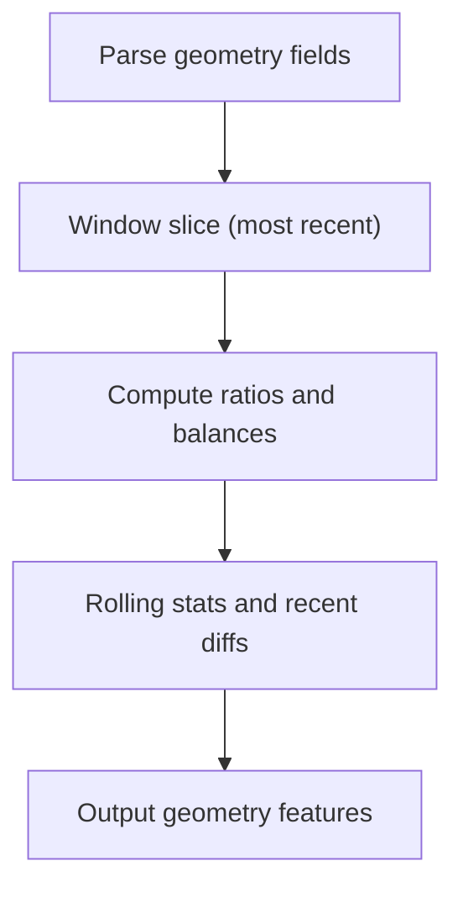
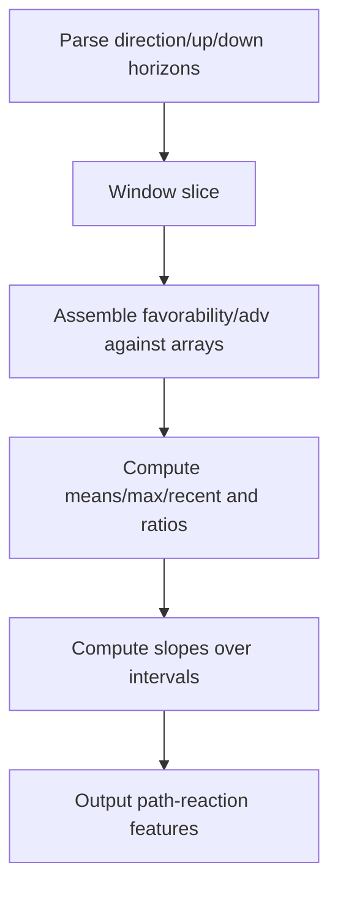
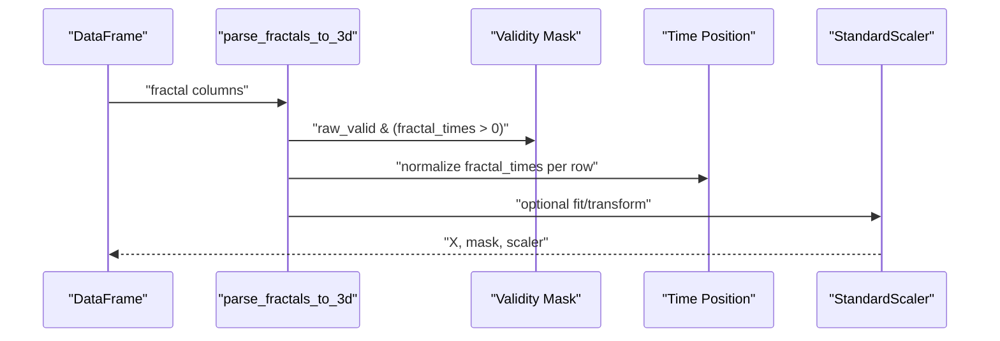
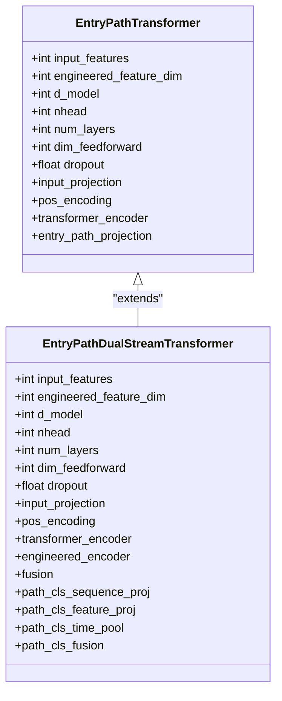
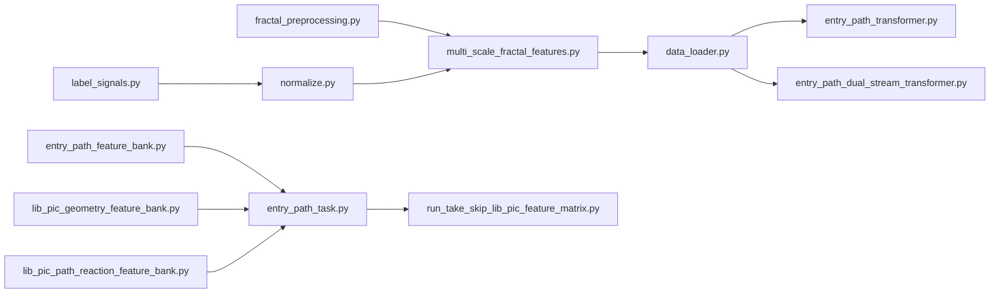

# Multi-Scale Fractal Features

<cite>
**Referenced Files in This Document**
- [multi_scale_fractal_features.py](file://ML/multi_scale_fractal_features.py)
- [test_multi_scale_fractal_features.py](file://tests/test_multi_scale_fractal_features.py)
- [fractal_preprocessing.py](file://processing/fractal_preprocessing.py)
- [entry_path_feature_bank.py](file://ML/entry_path_feature_bank.py)
- [lib_pic_geometry_feature_bank.py](file://ML/lib_pic_geometry_feature_bank.py)
- [lib_pic_path_reaction_feature_bank.py](file://ML/lib_pic_path_reaction_feature_bank.py)
- [label_signals.py](file://processing/label_signals.py)
- [normalize.py](file://processing/normalize.py)
- [data_loader.py](file://ML/data_loader.py)
- [entry_path_task.py](file://ML/entry_path_task.py)
- [entry_path_transformer.py](file://ML/models/entry_path_transformer.py)
- [entry_path_dual_stream_transformer.py](file://ML/models/entry_path_dual_stream_transformer.py)
- [run_take_skip_lib_pic_feature_matrix.py](file://ML/run_take_skip_lib_pic_feature_matrix.py)
- [signal_research.py](file://API/signal_research.py)
- [BillWilliams.mqh](file://MT/MQL5/Include/Indicators/BillWilliams.mqh)
- [README.md](file://README.md)
- [docs/README.md](file://docs/README.md)
</cite>

## Table of Contents
1. [Introduction](#introduction)
2. [Project Structure](#project-structure)
3. [Core Components](#core-components)
4. [Architecture Overview](#architecture-overview)
5. [Detailed Component Analysis](#detailed-component-analysis)
6. [Dependency Analysis](#dependency-analysis)
7. [Performance Considerations](#performance-considerations)
8. [Troubleshooting Guide](#troubleshooting-guide)
9. [Conclusion](#conclusion)
10. [Appendices](#appendices)

## Introduction
This document describes the multi-scale fractal feature extraction system used in SoSimple’s technical analysis pipeline. It explains how fractal geometry is applied to identify price action patterns across multiple timeframes and scales, and how these patterns are transformed into robust machine learning features. The system integrates:
- Fractal parsing and sorting across multiple columns
- Multi-scale window summarization of fractal tensors
- Geometry and path-reaction feature banks derived from fractal records
- Temporal alignment and normalization for ML models
- Integration with transformer-based architectures for entry path modeling

The goal is to enable reliable detection of support/resistance levels, trend reversals, and volatility regimes at different temporal resolutions while maintaining causal integrity and enabling downstream ML tasks.

## Project Structure
The multi-scale fractal features pipeline spans preprocessing, feature engineering, and ML integration modules:
- Preprocessing: parses and sorts fractal columns, normalizes raw records
- Feature Engineering: builds windowed summaries, geometry, and path-reaction features
- ML Integration: converts fractal tensors into sequences, aligns timestamps, and feeds transformers

**Diagram sources**
- [fractal_preprocessing.py:65-85](file://processing/fractal_preprocessing.py#L65-L85)
- [label_signals.py:43-117](file://processing/label_signals.py#L43-L117)
- [normalize.py:106-134](file://processing/normalize.py#L106-L134)
- [multi_scale_fractal_features.py:18-38](file://ML/multi_scale_fractal_features.py#L18-L38)
- [entry_path_feature_bank.py:84-108](file://ML/entry_path_feature_bank.py#L84-L108)
- [lib_pic_geometry_feature_bank.py:159-205](file://ML/lib_pic_geometry_feature_bank.py#L159-L205)
- [lib_pic_path_reaction_feature_bank.py:179-224](file://ML/lib_pic_path_reaction_feature_bank.py#L179-L224)
- [data_loader.py:406-424](file://ML/data_loader.py#L406-L424)
- [entry_path_task.py:61-83](file://ML/entry_path_task.py#L61-L83)
- [entry_path_transformer.py:7-46](file://ML/models/entry_path_transformer.py#L7-L46)
- [entry_path_dual_stream_transformer.py:7-36](file://ML/models/entry_path_dual_stream_transformer.py#L7-L36)
- [run_take_skip_lib_pic_feature_matrix.py:259-283](file://ML/run_take_skip_lib_pic_feature_matrix.py#L259-L283)

**Section sources**
- [README.md:1-25](file://README.md#L1-L25)
- [docs/README.md:1-24](file://docs/README.md#L1-L24)

## Core Components
- Multi-scale fractal tensor summarizer: transforms a 3D tensor of fractal features into per-window summaries across multiple scales.
- Fractal parsing and sorting: ensures fractal columns are consistently ordered and sorted by recency.
- Row-wise feature bank: aggregates rolling statistics across recent fractals.
- Geometry and path-reaction feature banks: extract geometric ratios, balances, and historical reaction metrics.
- Data loader and normalization: constructs time-position features, masks, and optional standardization.
- Transformer integration: projects and fuses engineered features with sequence modeling.

Key implementation references:
- Multi-scale summarization: [build_multi_scale_fractal_features:18-38](file://ML/multi_scale_fractal_features.py#L18-L38)
- Sorting fractals in DataFrame: [sort_fractals_in_dataframe:65-85](file://processing/fractal_preprocessing.py#L65-L85)
- Row-wise feature bank: [build_entry_path_feature_bank:84-108](file://ML/entry_path_feature_bank.py#L84-L108)
- Geometry features: [build_lib_pic_geometry_feature_bank:159-205](file://ML/lib_pic_geometry_feature_bank.py#L159-L205)
- Path reaction features: [build_lib_pic_path_reaction_feature_bank:179-224](file://ML/lib_pic_path_reaction_feature_bank.py#L179-L224)
- Data loader and time position: [parse_fractals_to_3d:406-424](file://ML/data_loader.py#L406-L424)
- Normalization: [normalize_features:427-468](file://ML/data_loader.py#L427-L468)
- Model integration: [EntryPathTransformer:7-46](file://ML/models/entry_path_transformer.py#L7-L46), [EntryPathDualStreamTransformer:7-36](file://ML/models/entry_path_dual_stream_transformer.py#L7-L36)

**Section sources**
- [multi_scale_fractal_features.py:1-39](file://ML/multi_scale_fractal_features.py#L1-L39)
- [fractal_preprocessing.py:1-86](file://processing/fractal_preprocessing.py#L1-L86)
- [entry_path_feature_bank.py:1-109](file://ML/entry_path_feature_bank.py#L1-L109)
- [lib_pic_geometry_feature_bank.py:1-206](file://ML/lib_pic_geometry_feature_bank.py#L1-L206)
- [lib_pic_path_reaction_feature_bank.py:1-225](file://ML/lib_pic_path_reaction_feature_bank.py#L1-L225)
- [data_loader.py:406-468](file://ML/data_loader.py#L406-L468)
- [entry_path_transformer.py:1-46](file://ML/models/entry_path_transformer.py#L1-L46)
- [entry_path_dual_stream_transformer.py:1-36](file://ML/models/entry_path_dual_stream_transformer.py#L1-L36)

## Architecture Overview
The multi-scale fractal feature extraction pipeline follows a causal, sequence-aware flow:
1. Raw fractal records are parsed and normalized.
2. Fractals are sorted by recency to preserve temporal order.
3. A 3D tensor is constructed from fractal features with a validity mask.
4. Multi-scale window summaries are computed from the tensor.
5. Additional engineered features (geometry, path reactions) are appended.
6. Optional normalization and time-position encoding are applied.
7. Transformers consume the sequence with mask-aware attention.

**Diagram sources**
- [label_signals.py:43-117](file://processing/label_signals.py#L43-L117)
- [normalize.py:106-134](file://processing/normalize.py#L106-L134)
- [fractal_preprocessing.py:65-85](file://processing/fractal_preprocessing.py#L65-L85)
- [data_loader.py:406-424](file://ML/data_loader.py#L406-L424)
- [multi_scale_fractal_features.py:18-38](file://ML/multi_scale_fractal_features.py#L18-L38)
- [lib_pic_geometry_feature_bank.py:159-205](file://ML/lib_pic_geometry_feature_bank.py#L159-L205)
- [lib_pic_path_reaction_feature_bank.py:179-224](file://ML/lib_pic_path_reaction_feature_bank.py#L179-L224)
- [entry_path_transformer.py:7-46](file://ML/models/entry_path_transformer.py#L7-L46)
- [entry_path_dual_stream_transformer.py:7-36](file://ML/models/entry_path_dual_stream_transformer.py#L7-L36)

## Detailed Component Analysis

### Multi-Scale Fractal Tensor Summarizer
This component computes windowed statistics across multiple temporal scales from a 3D fractal tensor. It supports variable window sizes and ensures numerical stability by replacing NaN/infs with zeros.

**Diagram sources**
- [multi_scale_fractal_features.py:9-38](file://ML/multi_scale_fractal_features.py#L9-L38)

**Section sources**
- [multi_scale_fractal_features.py:1-39](file://ML/multi_scale_fractal_features.py#L1-L39)
- [test_multi_scale_fractal_features.py:1-40](file://tests/test_multi_scale_fractal_features.py#L1-L40)

### Fractal Parsing and Sorting
Fractal records are parsed from colon-delimited strings into structured dictionaries. Columns are identified by numeric suffix and sorted accordingly. Sorting is performed per row to ensure the most recent fractals appear first.

**Diagram sources**
- [fractal_preprocessing.py:22-33](file://processing/fractal_preprocessing.py#L22-L33)
- [fractal_preprocessing.py:36-62](file://processing/fractal_preprocessing.py#L36-L62)
- [fractal_preprocessing.py:65-85](file://processing/fractal_preprocessing.py#L65-L85)

**Section sources**
- [fractal_preprocessing.py:1-86](file://processing/fractal_preprocessing.py#L1-L86)
- [label_signals.py:43-117](file://processing/label_signals.py#L43-L117)
- [normalize.py:106-134](file://processing/normalize.py#L106-L134)

### Row-Wise Feature Bank (Entry Path)
Aggregates rolling statistics across recent fractals for each row, including strong/break shares, direction balance, back measures, and impulse/power/count metrics.

**Diagram sources**
- [entry_path_feature_bank.py:30-51](file://ML/entry_path_feature_bank.py#L30-L51)
- [entry_path_feature_bank.py:53-81](file://ML/entry_path_feature_bank.py#L53-L81)
- [entry_path_feature_bank.py:84-108](file://ML/entry_path_feature_bank.py#L84-L108)

**Section sources**
- [entry_path_feature_bank.py:1-109](file://ML/entry_path_feature_bank.py#L1-L109)

### Geometry Feature Bank (PIC)
Derives geometric ratios, balances, and distributions from front/back/reverse/fractal-atr fields. Computes rolling means, stds, recent values, and derived quantities like ratio, balance, and front share.

**Diagram sources**
- [lib_pic_geometry_feature_bank.py:83-96](file://ML/lib_pic_geometry_feature_bank.py#L83-L96)
- [lib_pic_geometry_feature_bank.py:105-156](file://ML/lib_pic_geometry_feature_bank.py#L105-L156)
- [lib_pic_geometry_feature_bank.py:159-205](file://ML/lib_pic_geometry_feature_bank.py#L159-L205)

**Section sources**
- [lib_pic_geometry_feature_bank.py:1-206](file://ML/lib_pic_geometry_feature_bank.py#L1-L206)

### Path Reaction Feature Bank (Up/Dn)
Captures historical reaction metrics (Up/Dn horizons) after levels, computing favorability, adversity, edge, and reward-to-risk ratios across multiple horizons, plus slopes over intervals.

**Diagram sources**
- [lib_pic_path_reaction_feature_bank.py:102-116](file://ML/lib_pic_path_reaction_feature_bank.py#L102-L116)
- [lib_pic_path_reaction_feature_bank.py:136-176](file://ML/lib_pic_path_reaction_feature_bank.py#L136-L176)
- [lib_pic_path_reaction_feature_bank.py:179-224](file://ML/lib_pic_path_reaction_feature_bank.py#L179-L224)

**Section sources**
- [lib_pic_path_reaction_feature_bank.py:1-225](file://ML/lib_pic_path_reaction_feature_bank.py#L1-L225)

### Data Loader and Temporal Alignment
Builds a 3D feature array from parsed fractal records, computes a time-position feature normalized to [0,1] within each row, and produces a validity mask. Supports optional standardization.

**Diagram sources**
- [data_loader.py:406-424](file://ML/data_loader.py#L406-L424)
- [data_loader.py:427-468](file://ML/data_loader.py#L427-L468)

**Section sources**
- [data_loader.py:406-468](file://ML/data_loader.py#L406-L468)

### Transformer Integration
Two transformer variants fuse raw and engineered features:
- EntryPathTransformer: concatenates sequence embeddings with engineered features via a projection head.
- EntryPathDualStreamTransformer: encodes engineered features separately and fuses with sequence embeddings.

**Diagram sources**
- [entry_path_transformer.py:7-46](file://ML/models/entry_path_transformer.py#L7-L46)
- [entry_path_dual_stream_transformer.py:7-36](file://ML/models/entry_path_dual_stream_transformer.py#L7-L36)

**Section sources**
- [entry_path_transformer.py:1-46](file://ML/models/entry_path_transformer.py#L1-L46)
- [entry_path_dual_stream_transformer.py:1-36](file://ML/models/entry_path_dual_stream_transformer.py#L1-L36)
- [entry_path_task.py:86-106](file://ML/entry_path_task.py#L86-L106)

### Practical Examples and Parameter Tuning
- Multi-scale windows: tune window sizes (e.g., 5, 10, 20, 50, 100) to emphasize short-term vs long-term persistence.
- Horizon selection: align prediction horizons with trading intent (e.g., 3, 6, 12, 24, 48 bars) and incorporate regime filters (e.g., ATR buckets).
- Normalization: apply standardization when features span disparate scales; disable when preserving absolute magnitudes is desired.
- Market regime splits: segment by session/time-of-day and volatility regimes to improve signal stability.

[No sources needed since this section provides general guidance]

### Extending the Framework
- Custom pattern detection: add new parsing fields to the fractal record and extend feature banks similarly to geometry/path-reaction modules.
- Integrating other indicators: append indicator series alongside fractal features; ensure causal alignment and mask propagation.
- Scale normalization: introduce scale-specific normalization per window or globally across engineered features.

[No sources needed since this section provides general guidance]

## Dependency Analysis
The pipeline exhibits clear module boundaries:
- Preprocessing depends on pandas/numpy and standard ML utilities.
- Feature engineering is independent and can be reused across tasks.
- ML integration depends on transformer models and sequence masking.

**Diagram sources**
- [fractal_preprocessing.py:65-85](file://processing/fractal_preprocessing.py#L65-L85)
- [label_signals.py:43-117](file://processing/label_signals.py#L43-L117)
- [normalize.py:106-134](file://processing/normalize.py#L106-L134)
- [multi_scale_fractal_features.py:18-38](file://ML/multi_scale_fractal_features.py#L18-L38)
- [entry_path_feature_bank.py:84-108](file://ML/entry_path_feature_bank.py#L84-L108)
- [lib_pic_geometry_feature_bank.py:159-205](file://ML/lib_pic_geometry_feature_bank.py#L159-L205)
- [lib_pic_path_reaction_feature_bank.py:179-224](file://ML/lib_pic_path_reaction_feature_bank.py#L179-L224)
- [data_loader.py:406-424](file://ML/data_loader.py#L406-L424)
- [entry_path_task.py:61-83](file://ML/entry_path_task.py#L61-L83)
- [entry_path_transformer.py:7-46](file://ML/models/entry_path_transformer.py#L7-L46)
- [entry_path_dual_stream_transformer.py:7-36](file://ML/models/entry_path_dual_stream_transformer.py#L7-L36)
- [run_take_skip_lib_pic_feature_matrix.py:259-283](file://ML/run_take_skip_lib_pic_feature_matrix.py#L259-L283)

**Section sources**
- [entry_path_task.py:1-200](file://ML/entry_path_task.py#L1-L200)

## Performance Considerations
- Vectorization: all window computations operate on NumPy arrays; ensure inputs are contiguous and pre-allocated where possible.
- Memory footprint: multi-scale concatenation increases feature dimensionality; consider selective windows for resource-constrained environments.
- Numerical stability: replace NaN/Inf with zeros during summarization; clip extreme values when needed.
- Parallelism: feature banks are row-wise and can be parallelized across partitions; ensure thread safety for shared resources.

[No sources needed since this section provides general guidance]

## Troubleshooting Guide
Common issues and remedies:
- Shape mismatch: ensure input tensors are 3D with shape (n, seq_len, feat_dim); otherwise a ValueError is raised.
- Empty windows: effective window size is capped by available sequence length; verify window sizes relative to data length.
- Parsing failures: malformed fractal strings yield None; confirm delimiter and field counts match expected formats.
- Causal ordering: verify fractal times are monotonically decreasing per row; detect violations early to prevent leakage.

**Section sources**
- [multi_scale_fractal_features.py:22-33](file://ML/multi_scale_fractal_features.py#L22-L33)
- [label_signals.py:43-117](file://processing/label_signals.py#L43-L117)
- [normalize.py:106-134](file://processing/normalize.py#L106-L134)
- [EDA.ipynb:2418-2439](file://statistics/EDA.ipynb#L2418-L2439)

## Conclusion
The multi-scale fractal feature extraction system in SoSimple provides a robust, causal framework for transforming raw fractal records into temporally aligned, scale-normalized features suitable for machine learning. By combining temporal sorting, windowed summarization, geometric ratios, and historical reaction metrics, the pipeline captures multi-resolution price action patterns essential for support/resistance detection, reversal identification, and volatility regime classification. Integration with transformer models enables powerful sequence modeling while preserving temporal integrity and enabling practical deployment.

[No sources needed since this section summarizes without analyzing specific files]

## Appendices

### Mathematical Foundations and Self-Similarity
Fractal geometry in financial markets leverages self-similarity across scales and timeframes. Patterns repeat across different temporal resolutions, enabling:
- Scale invariance: recurring price structures at H1, D1, and higher aggregations.
- Persistence and anti-persistence: trends and mean-reversion tendencies captured via multi-scale statistics.
- Geometric ratios: front/back and size/balance ratios reflect structural strength and symmetry.

[No sources needed since this section provides general guidance]

### Indicator Integration Notes
- Bill Williams’ Fractals indicator is available in the MT codebase and can be used to generate base fractal signals for downstream feature extraction.
- When integrating additional indicators, maintain strict causality by avoiding future-looking values and aligning indicator series with fractal timestamps.

**Section sources**
- [BillWilliams.mqh:383-481](file://MT/MQL5/Include/Indicators/BillWilliams.mqh#L383-L481)