# Specialized Components

<cite>
**Referenced Files in This Document**
- [calibrate.py](file://ML/conformal/calibrate.py)
- [entry_path_feature_bank.py](file://ML/entry_path_feature_bank.py)
- [lib_pic_geometry_feature_bank.py](file://ML/lib_pic_geometry_feature_bank.py)
- [lib_pic_path_reaction_feature_bank.py](file://ML/lib_pic_path_reaction_feature_bank.py)
- [multi_scale_fractal_features.py](file://ML/multi_scale_fractal_features.py)
- [feature_importance_diagnostics.py](file://ML/feature_importance_diagnostics.py)
- [tb_probability_calibration.py](file://ML/tb_probability_calibration.py)
- [lib_pic_feature_profiles.py](file://ML/lib_pic_feature_profiles.py)
- [entry_path_v1_quantile_transformer.py](file://ML/models/entry_path_v1_quantile_transformer.py)
- [entry_path_transformer.py](file://ML/models/entry_path_transformer.py)
- [run_take_skip_lib_pic_feature_matrix.py](file://ML/run_take_skip_lib_pic_feature_matrix.py)
- [feature_bank_comparison_diagnostics.py](file://ML/feature_bank_comparison_diagnostics.py)
- [data_loader.py](file://ML/data_loader.py)
- [utils.py](file://ML/utils.py)
- [transformer.py](file://ML/models/transformer.py)
- [take_skip_dual_stream_transformer.py](file://ML/models/take_skip_dual_stream_transformer.py)
- [entry_path_task.py](file://ML/entry_path_task.py)
- [take_skip_trailing_stop_v2_task.py](file://ML/take_skip_trailing_stop_v2_task.py)
</cite>

## Table of Contents
1. [Introduction](#introduction)
2. [Project Structure](#project-structure)
3. [Core Components](#core-components)
4. [Architecture Overview](#architecture-overview)
5. [Detailed Component Analysis](#detailed-component-analysis)
6. [Dependency Analysis](#dependency-analysis)
7. [Performance Considerations](#performance-considerations)
8. [Troubleshooting Guide](#troubleshooting-guide)
9. [Conclusion](#conclusion)
10. [Appendices](#appendices)

## Introduction
This document describes specialized machine learning components unique to the SoSimple trading system. It focuses on:
- Conformal prediction for uncertainty quantification and valid prediction sets
- Feature bank systems: LIB-PIC features, geometry features, and path reaction features
- Multi-scale fractal feature extraction and feature importance diagnostics
- Entry path feature banks, quantile calibration, and statistical feature profiling
- Technical specifications, usage patterns, and integration with main model architectures
- Guidance for customizing feature extraction, implementing new feature types, and optimizing feature bank performance

## Project Structure
The specialized components are organized under the ML module:
- Conformal prediction: ML/conformal/calibrate.py
- Feature engineering: ML/entry_path_feature_bank.py, ML/lib_pic_geometry_feature_bank.py, ML/lib_pic_path_reaction_feature_bank.py, ML/multi_scale_fractal_features.py
- Feature diagnostics: ML/feature_importance_diagnostics.py, ML/feature_bank_comparison_diagnostics.py
- Quantile calibration: ML/tb_probability_calibration.py
- Feature profiles: ML/lib_pic_feature_profiles.py
- Model integrations: ML/models/*, ML/entry_path_task.py, ML/take_skip_trailing_stop_v2_task.py
- Data loading and utilities: ML/data_loader.py, ML/utils.py

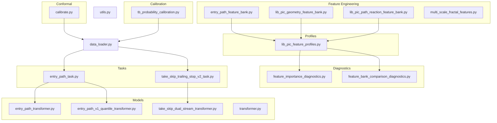

**Diagram sources**
- [calibrate.py:1-309](file://ML/conformal/calibrate.py#L1-L309)
- [entry_path_feature_bank.py:1-109](file://ML/entry_path_feature_bank.py#L1-L109)
- [lib_pic_geometry_feature_bank.py:1-206](file://ML/lib_pic_geometry_feature_bank.py#L1-L206)
- [lib_pic_path_reaction_feature_bank.py:1-225](file://ML/lib_pic_path_reaction_feature_bank.py#L1-L225)
- [multi_scale_fractal_features.py:1-39](file://ML/multi_scale_fractal_features.py#L1-L39)
- [feature_importance_diagnostics.py:1-439](file://ML/feature_importance_diagnostics.py#L1-L439)
- [feature_bank_comparison_diagnostics.py:1-245](file://ML/feature_bank_comparison_diagnostics.py#L1-L245)
- [tb_probability_calibration.py:1-80](file://ML/tb_probability_calibration.py#L1-L80)
- [lib_pic_feature_profiles.py:1-102](file://ML/lib_pic_feature_profiles.py#L1-L102)
- [entry_path_transformer.py:1-116](file://ML/models/entry_path_transformer.py#L1-L116)
- [entry_path_v1_quantile_transformer.py:1-125](file://ML/models/entry_path_v1_quantile_transformer.py#L1-L125)
- [take_skip_dual_stream_transformer.py:1-92](file://ML/models/take_skip_dual_stream_transformer.py#L1-L92)
- [entry_path_task.py:1-467](file://ML/entry_path_task.py#L1-L467)
- [take_skip_trailing_stop_v2_task.py:1-111](file://ML/take_skip_trailing_stop_v2_task.py#L1-L111)
- [data_loader.py:1-800](file://ML/data_loader.py#L1-L800)
- [utils.py:1-340](file://ML/utils.py#L1-L340)

**Section sources**
- [data_loader.py:1-800](file://ML/data_loader.py#L1-L800)
- [utils.py:1-340](file://ML/utils.py#L1-L340)

## Core Components
- Conformal Prediction: Post-hoc uncertainty quantification via Split Conformal Prediction on a trained regression model. Computes nonconformity scores and produces prediction intervals with guaranteed coverage.
- Feature Banks:
  - LIB-PIC geometry features: derived from fractal front/back/reverse ratios and sizes
  - LIB-PIC path reaction features: historical reaction measures (Up/Dn) across horizons
  - Entry path feature bank: rolling-window statistics over fractal-derived fields
  - Multi-scale fractal features: concatenated window summaries across multiple scales
- Feature Profiling and Diagnostics: Assemble feature profiles, compare variants, and compute feature importance using permutation-based diagnostics.
- Quantile Calibration: Probability calibration for multi-target triple barrier outcomes using isotonic regression per target.
- Model Integrations: Transformer-based architectures supporting sequence-only and dual-stream (sequence + engineered features) inputs.

**Section sources**
- [calibrate.py:93-206](file://ML/conformal/calibrate.py#L93-L206)
- [lib_pic_geometry_feature_bank.py:159-206](file://ML/lib_pic_geometry_feature_bank.py#L159-L206)
- [lib_pic_path_reaction_feature_bank.py:179-225](file://ML/lib_pic_path_reaction_feature_bank.py#L179-L225)
- [entry_path_feature_bank.py:84-109](file://ML/entry_path_feature_bank.py#L84-L109)
- [multi_scale_fractal_features.py:18-39](file://ML/multi_scale_fractal_features.py#L18-L39)
- [feature_importance_diagnostics.py:260-336](file://ML/feature_importance_diagnostics.py#L260-L336)
- [feature_bank_comparison_diagnostics.py:107-158](file://ML/feature_bank_comparison_diagnostics.py#L107-L158)
- [tb_probability_calibration.py:8-80](file://ML/tb_probability_calibration.py#L8-L80)
- [lib_pic_feature_profiles.py:78-102](file://ML/lib_pic_feature_profiles.py#L78-L102)

## Architecture Overview
The specialized components integrate with the broader ML stack as follows:
- Data ingestion and caching: data_loader parses fractal CSVs into 3D tensors and caches arrays for fast reuse
- Feature engineering: feature banks transform raw fractal fields into engineered features
- Model training/inference: transformer-based models consume either sequence-only or dual-stream inputs
- Conformal prediction: post-processes model outputs to produce valid prediction intervals
- Calibration: adjusts predicted probabilities for better reliability

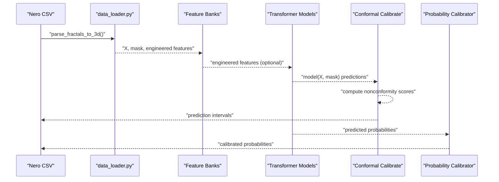

**Diagram sources**
- [data_loader.py:331-425](file://ML/data_loader.py#L331-L425)
- [lib_pic_feature_profiles.py:57-76](file://ML/lib_pic_feature_profiles.py#L57-L76)
- [entry_path_task.py:61-84](file://ML/entry_path_task.py#L61-L84)
- [calibrate.py:70-206](file://ML/conformal/calibrate.py#L70-L206)
- [tb_probability_calibration.py:8-80](file://ML/tb_probability_calibration.py#L8-L80)

## Detailed Component Analysis

### Conformal Prediction Implementation
- Purpose: Provide valid prediction intervals with guaranteed coverage for regression outputs
- Method: Split Conformal Prediction using a validation set; nonconformity score is absolute error per target; finite-sample correction applied
- Inputs: Trained model checkpoint, validation CSV, optional Optuna hyperparameters
- Outputs: JSON quantiles and markdown report with empirical coverage
- Usage pattern: Run calibration script with desired model and alpha level

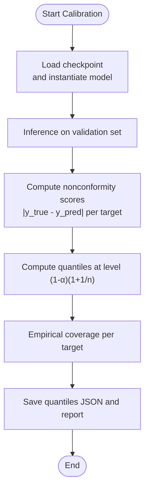

**Diagram sources**
- [calibrate.py:93-206](file://ML/conformal/calibrate.py#L93-L206)

**Section sources**
- [calibrate.py:93-206](file://ML/conformal/calibrate.py#L93-L206)

### LIB-PIC Geometry Feature Bank
- Purpose: Extract geometric characteristics from fractal fields (front/back/reverse) and derived ratios/sizes
- Windows: Supports multiple time windows (e.g., 5, 10, 20, 50, 100)
- Features: Means, stds, recent values, ratios, balances, size deviations
- Safety: Handles missing/invalid entries and infinities by replacing with zeros

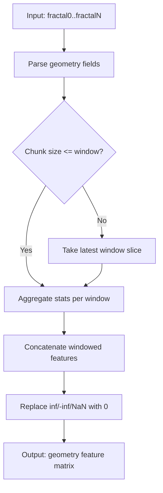

**Diagram sources**
- [lib_pic_geometry_feature_bank.py:105-157](file://ML/lib_pic_geometry_feature_bank.py#L105-L157)

**Section sources**
- [lib_pic_geometry_feature_bank.py:159-206](file://ML/lib_pic_geometry_feature_bank.py#L159-L206)

### LIB-PIC Path Reaction Feature Bank
- Purpose: Capture historical reaction of price after levels (Up/Dn) across horizons
- Horizons: 3, 6, 12, 24, 48
- Features: Favorability (fav), Adversity (adv), Edge (fav-adv), Risk-reward (fav/adv), and slopes across horizon pairs
- Aggregation: Computes means, maxima, recent values, and slopes per horizon window

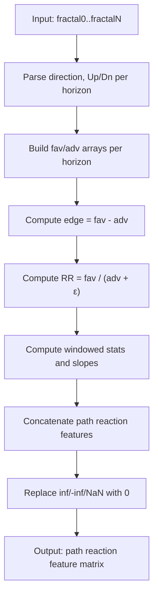

**Diagram sources**
- [lib_pic_path_reaction_feature_bank.py:136-176](file://ML/lib_pic_path_reaction_feature_bank.py#L136-L176)

**Section sources**
- [lib_pic_path_reaction_feature_bank.py:179-225](file://ML/lib_pic_path_reaction_feature_bank.py#L179-L225)

### Entry Path Feature Bank
- Purpose: Row-wise engineered features for entry_path_v1 tasks
- Fields: Strong share, break share, direction balance, back statistics, impulse/power/count means
- Windows: Same window set as LIB-PIC geometry/path banks

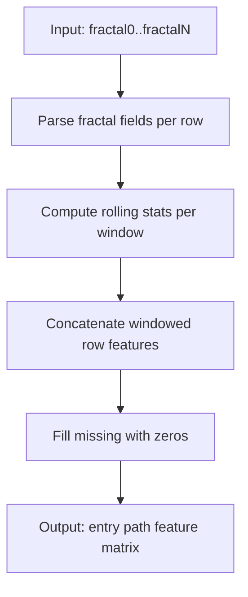

**Diagram sources**
- [entry_path_feature_bank.py:53-82](file://ML/entry_path_feature_bank.py#L53-L82)

**Section sources**
- [entry_path_feature_bank.py:84-109](file://ML/entry_path_feature_bank.py#L84-L109)

### Multi-Scale Fractal Features
- Purpose: Extract compact multi-scale summaries from 3D fractal tensors
- Operations: Mean, std, last-minus-mean, slope, and value-range per window
- Windows: Configurable window sizes

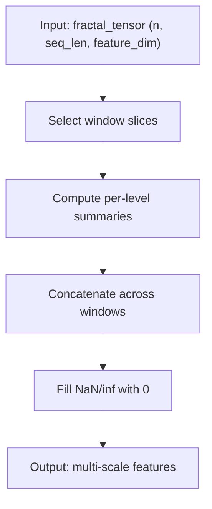

**Diagram sources**
- [multi_scale_fractal_features.py:18-39](file://ML/multi_scale_fractal_features.py#L18-L39)

**Section sources**
- [multi_scale_fractal_features.py:18-39](file://ML/multi_scale_fractal_features.py#L18-L39)

### Feature Importance Diagnostics
- Purpose: Read-only diagnostics of current feature importance for regression targets
- Method: Builds grouped features (price position, geometry, strength, path reactions, etc.), fits a RandomForest, and computes permutation-based importance
- Output: Group importance CSV, individual feature importance CSV, and markdown report

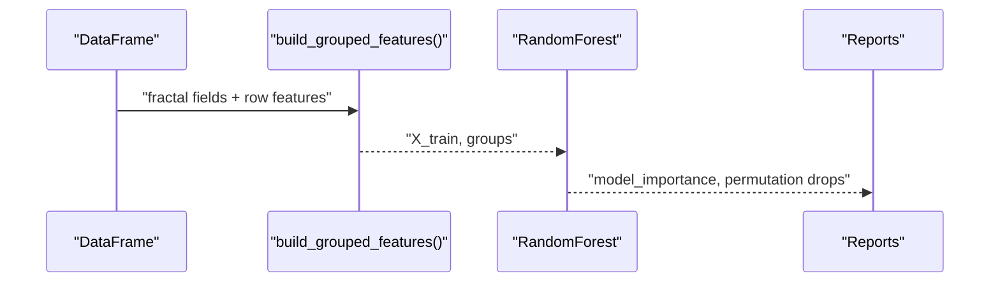

**Diagram sources**
- [feature_importance_diagnostics.py:160-201](file://ML/feature_importance_diagnostics.py#L160-L201)
- [feature_importance_diagnostics.py:260-336](file://ML/feature_importance_diagnostics.py#L260-L336)

**Section sources**
- [feature_importance_diagnostics.py:260-336](file://ML/feature_importance_diagnostics.py#L260-L336)

### Feature Bank Comparison Diagnostics
- Purpose: Compare baseline vs. geometry/path banks using a fixed target and evaluation metric
- Method: Pre-build feature parts once, assemble variants, fit a single RandomForest per variant, and rank by validation R2 and directional accuracy

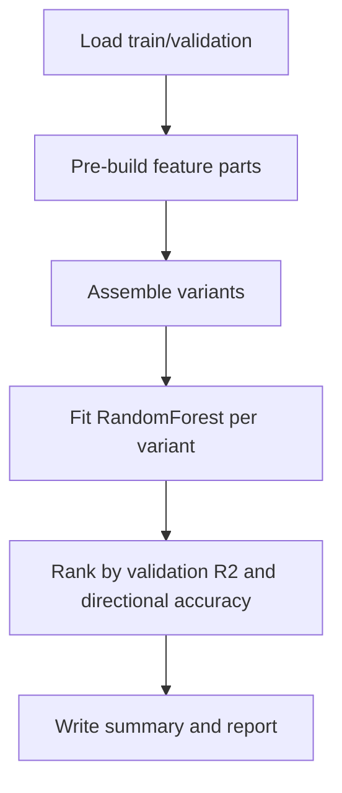

**Diagram sources**
- [feature_bank_comparison_diagnostics.py:107-158](file://ML/feature_bank_comparison_diagnostics.py#L107-L158)

**Section sources**
- [feature_bank_comparison_diagnostics.py:107-158](file://ML/feature_bank_comparison_diagnostics.py#L107-L158)

### Quantile Calibration (Triple Barrier)
- Purpose: Calibrate predicted probabilities for multi-target triple barrier classification
- Method: Per-target isotonic regression with clipping to [0,1]; handles degenerate cases gracefully
- Usage: Fit on validation probabilities and labels; apply to test probabilities

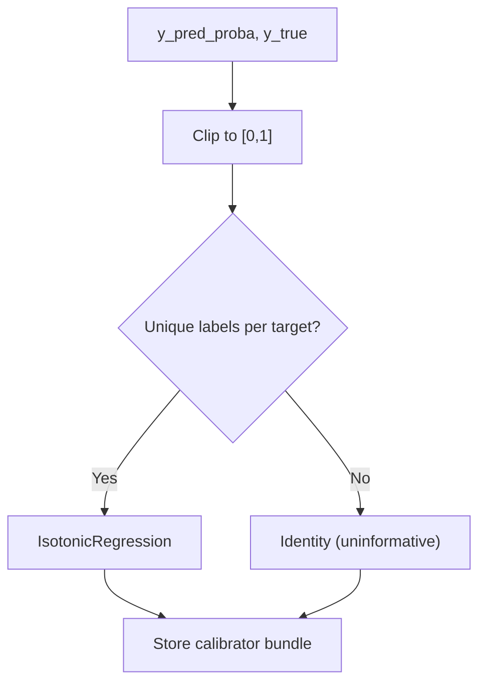

**Diagram sources**
- [tb_probability_calibration.py:8-48](file://ML/tb_probability_calibration.py#L8-L48)

**Section sources**
- [tb_probability_calibration.py:8-80](file://ML/tb_probability_calibration.py#L8-L80)

### Statistical Feature Profiling
- Purpose: Assemble reusable feature profiles (baseline, baseline+path, baseline+geometry+path, etc.) and clean baseline columns
- Method: Build baseline grouped features, geometry, and path reaction banks once, then concatenate per profile

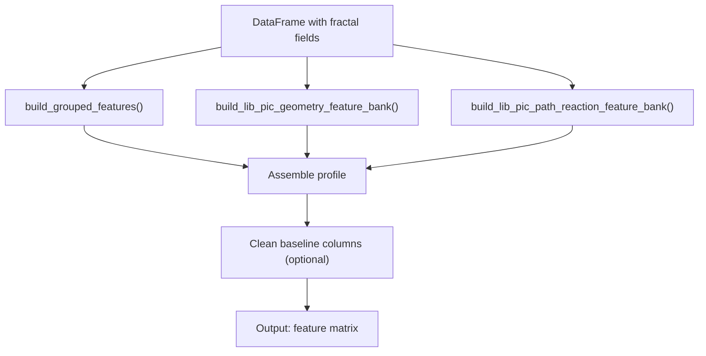

**Diagram sources**
- [lib_pic_feature_profiles.py:57-88](file://ML/lib_pic_feature_profiles.py#L57-L88)

**Section sources**
- [lib_pic_feature_profiles.py:78-102](file://ML/lib_pic_feature_profiles.py#L78-L102)

### Integration with Main Model Architectures
- Entry Path Transformer: Sequence-only transformer with CLS token pooling and heads for returns, path regression/classification
- Entry Path Quantile Transformer: Adds quantile heads (ret_q10, ret_q90) alongside standard heads
- Dual Stream Transformers: Combine sequence features with engineered features via separate encoders and fusion

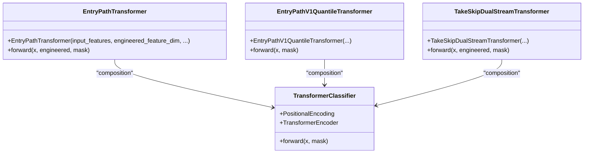

**Diagram sources**
- [transformer.py:78-199](file://ML/models/transformer.py#L78-L199)
- [entry_path_transformer.py:7-116](file://ML/models/entry_path_transformer.py#L7-L116)
- [entry_path_v1_quantile_transformer.py:13-125](file://ML/models/entry_path_v1_quantile_transformer.py#L13-L125)
- [take_skip_dual_stream_transformer.py:24-92](file://ML/models/take_skip_dual_stream_transformer.py#L24-L92)

**Section sources**
- [entry_path_transformer.py:7-116](file://ML/models/entry_path_transformer.py#L7-L116)
- [entry_path_v1_quantile_transformer.py:13-125](file://ML/models/entry_path_v1_quantile_transformer.py#L13-L125)
- [take_skip_dual_stream_transformer.py:24-92](file://ML/models/take_skip_dual_stream_transformer.py#L24-L92)

### Data Loading and Utilities
- Parsing: Converts fractal CSVs to 3D tensors, computes time features, and applies log-transformed ATR ratio
- Caching: Saves parsed arrays to .npy for fast reload
- Utilities: Seed setting, metrics computation, device selection

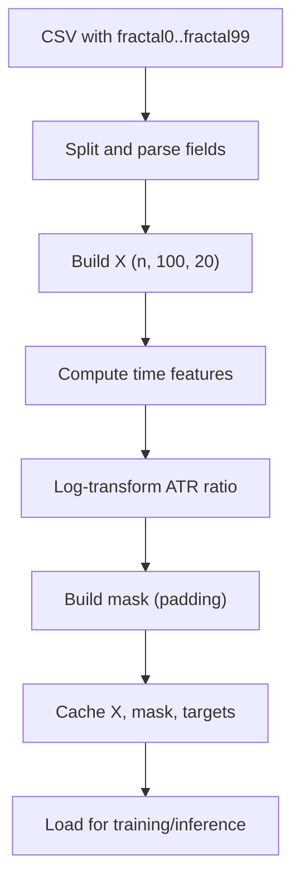

**Diagram sources**
- [data_loader.py:331-425](file://ML/data_loader.py#L331-L425)

**Section sources**
- [data_loader.py:549-800](file://ML/data_loader.py#L549-L800)
- [utils.py:42-340](file://ML/utils.py#L42-L340)

### Usage Patterns and Integration
- Conformal Prediction: Run calibration script; use saved quantiles to construct prediction intervals during inference
- Feature Banks: Use lib_pic_feature_profiles to assemble feature matrices for training or diagnostics
- Model Training: Use data_loader to create datasets; feed sequence-only or dual-stream models depending on task
- Quantile Calibration: Apply per-target calibration to predicted probabilities for triple barrier tasks

**Section sources**
- [calibrate.py:301-309](file://ML/conformal/calibrate.py#L301-L309)
- [lib_pic_feature_profiles.py:90-102](file://ML/lib_pic_feature_profiles.py#L90-L102)
- [data_loader.py:549-800](file://ML/data_loader.py#L549-L800)
- [tb_probability_calibration.py:51-80](file://ML/tb_probability_calibration.py#L51-L80)

## Dependency Analysis
Key dependencies and relationships:
- data_loader depends on entry_path_task and take_skip_trailing_stop_v2_task for target parsing and splits
- Feature banks depend on lib_pic_feature_profiles for assembling variants
- Conformal prediction depends on trained model checkpoints and validation data
- Quantile calibration depends on predicted probabilities and labels

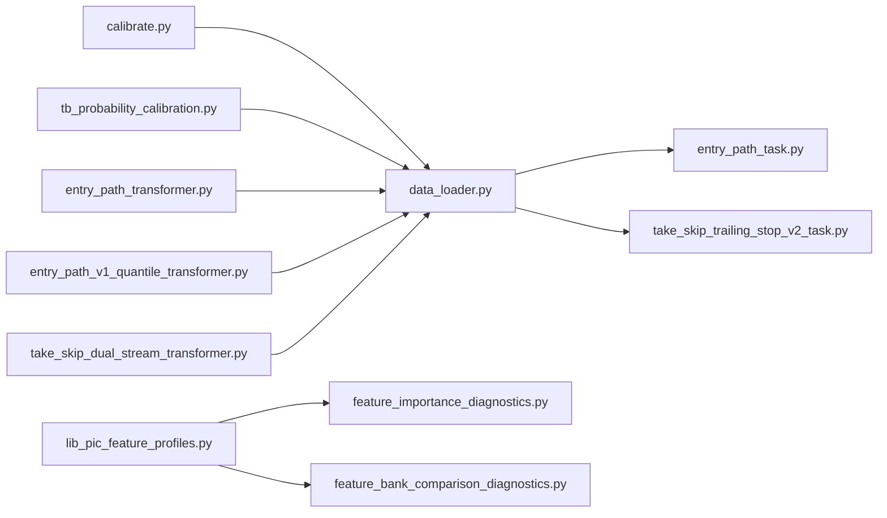

**Diagram sources**
- [data_loader.py:1-800](file://ML/data_loader.py#L1-L800)
- [entry_path_task.py:1-467](file://ML/entry_path_task.py#L1-L467)
- [take_skip_trailing_stop_v2_task.py:1-111](file://ML/take_skip_trailing_stop_v2_task.py#L1-L111)
- [lib_pic_feature_profiles.py:1-102](file://ML/lib_pic_feature_profiles.py#L1-L102)
- [feature_importance_diagnostics.py:1-439](file://ML/feature_importance_diagnostics.py#L1-L439)
- [feature_bank_comparison_diagnostics.py:1-245](file://ML/feature_bank_comparison_diagnostics.py#L1-L245)
- [calibrate.py:1-309](file://ML/conformal/calibrate.py#L1-L309)
- [tb_probability_calibration.py:1-80](file://ML/tb_probability_calibration.py#L1-L80)
- [entry_path_transformer.py:1-116](file://ML/models/entry_path_transformer.py#L1-L116)
- [entry_path_v1_quantile_transformer.py:1-125](file://ML/models/entry_path_v1_quantile_transformer.py#L1-L125)
- [take_skip_dual_stream_transformer.py:1-92](file://ML/models/take_skip_dual_stream_transformer.py#L1-L92)

**Section sources**
- [data_loader.py:1-800](file://ML/data_loader.py#L1-L800)
- [lib_pic_feature_profiles.py:1-102](file://ML/lib_pic_feature_profiles.py#L1-L102)

## Performance Considerations
- Feature engineering:
  - Vectorized parsing and aggregation minimize Python loops
  - Window slicing and concatenation operate on NumPy arrays
- Data loading:
  - Caching reduces repeated CSV parsing and tensor construction
  - Masking avoids unnecessary computations on padded positions
- Model inference:
  - Transformer encoders leverage attention across arbitrary positions
  - Dual-stream fusion reduces redundant computations by sharing sequence processing
- Calibration:
  - Per-target isotonic regression is lightweight and efficient
  - Conformal prediction adds minimal overhead post-inference

[No sources needed since this section provides general guidance]

## Troubleshooting Guide
- Conformal Prediction
  - Ensure validation set covers the model’s distribution; otherwise coverage may be poor
  - Verify alpha level and finite-sample correction are appropriate for small samples
- Feature Banks
  - Missing or malformed fractal fields lead to zero-filled outputs; validate input format
  - Large infinities/NaN are replaced with zeros; inspect raw inputs if unexpected zeros appear
- Data Loader
  - Validate CSV columns and fractal format; mismatches trigger warnings or errors
  - Sequence truncation affects downstream features; confirm seq_len alignment
- Calibration
  - If a target has insufficient label diversity, isotonic regression falls back to identity
  - Clip probabilities to [0,1] before applying calibration

**Section sources**
- [calibrate.py:167-206](file://ML/conformal/calibrate.py#L167-L206)
- [lib_pic_geometry_feature_bank.py:204-206](file://ML/lib_pic_geometry_feature_bank.py#L204-L206)
- [lib_pic_path_reaction_feature_bank.py:223-225](file://ML/lib_pic_path_reaction_feature_bank.py#L223-L225)
- [data_loader.py:248-285](file://ML/data_loader.py#L248-L285)
- [tb_probability_calibration.py:23-48](file://ML/tb_probability_calibration.py#L23-L48)

## Conclusion
The SoSimple system integrates robust uncertainty quantification, comprehensive feature engineering, and reliable calibration mechanisms. The modular design enables flexible feature profiling, multi-scale analysis, and seamless integration with transformer-based architectures for both sequence-only and dual-stream tasks.

[No sources needed since this section summarizes without analyzing specific files]

## Appendices

### Technical Specifications
- Conformal Prediction
  - Nonconformity score: absolute error per target
  - Coverage level: (1-α)(1+1/n)
  - Outputs: quantiles JSON and markdown report
- Feature Banks
  - Windows: 5, 10, 20, 50, 100
  - Geometry: front/back/reverse ratios, balances, sizes, deviations
  - Path reaction: favorability/adversity/edge/risk-reward and slopes
  - Entry path: rolling-window statistics over fractal-derived fields
  - Multi-scale: mean, std, last-minus-mean, slope, value-range per window
- Diagnostics
  - RandomForest-based importance with permutation drops
  - Group-wise aggregation and ranking
- Calibration
  - Isotonic regression per target with clipping
  - Identity fallback for degenerate cases

**Section sources**
- [calibrate.py:93-206](file://ML/conformal/calibrate.py#L93-L206)
- [lib_pic_geometry_feature_bank.py:159-206](file://ML/lib_pic_geometry_feature_bank.py#L159-L206)
- [lib_pic_path_reaction_feature_bank.py:179-225](file://ML/lib_pic_path_reaction_feature_bank.py#L179-L225)
- [entry_path_feature_bank.py:84-109](file://ML/entry_path_feature_bank.py#L84-L109)
- [multi_scale_fractal_features.py:18-39](file://ML/multi_scale_fractal_features.py#L18-L39)
- [feature_importance_diagnostics.py:260-336](file://ML/feature_importance_diagnostics.py#L260-L336)
- [tb_probability_calibration.py:8-80](file://ML/tb_probability_calibration.py#L8-L80)

### Usage Patterns
- Conformal Prediction
  - Run calibration with desired model and alpha
  - Apply saved quantiles to construct intervals during inference
- Feature Engineering
  - Use lib_pic_feature_profiles to assemble feature matrices
  - Compare variants with feature_bank_comparison_diagnostics
- Model Training
  - Use data_loader to prepare datasets
  - Choose sequence-only or dual-stream models per task
- Calibration
  - Fit tb_probability_calibration on validation predictions and labels
  - Apply to test predictions for improved reliability

**Section sources**
- [calibrate.py:301-309](file://ML/conformal/calibrate.py#L301-L309)
- [lib_pic_feature_profiles.py:90-102](file://ML/lib_pic_feature_profiles.py#L90-L102)
- [feature_bank_comparison_diagnostics.py:107-158](file://ML/feature_bank_comparison_diagnostics.py#L107-L158)
- [data_loader.py:549-800](file://ML/data_loader.py#L549-L800)
- [tb_probability_calibration.py:51-80](file://ML/tb_probability_calibration.py#L51-L80)

### Integration with Main Model Architectures
- Entry Path Transformer: supports engineered feature fusion
- Entry Path Quantile Transformer: adds quantile heads for uncertainty-aware returns
- Dual Stream Transformers: combine sequence and engineered features efficiently

**Section sources**
- [entry_path_transformer.py:7-116](file://ML/models/entry_path_transformer.py#L7-L116)
- [entry_path_v1_quantile_transformer.py:13-125](file://ML/models/entry_path_v1_quantile_transformer.py#L13-L125)
- [take_skip_dual_stream_transformer.py:24-92](file://ML/models/take_skip_dual_stream_transformer.py#L24-L92)