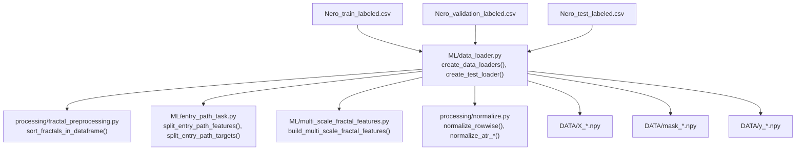
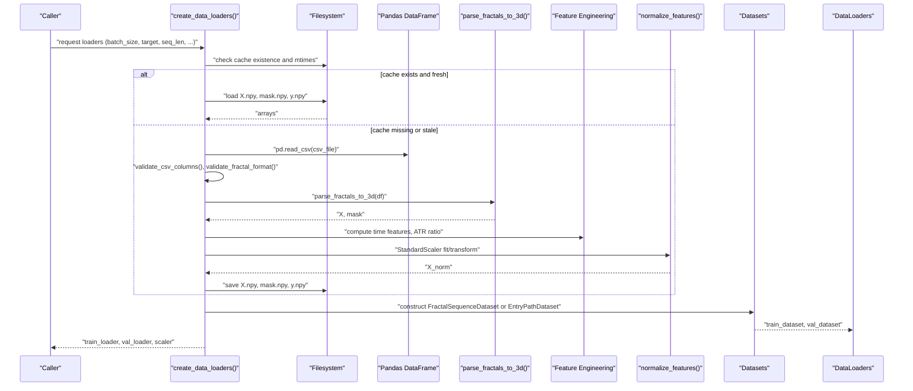
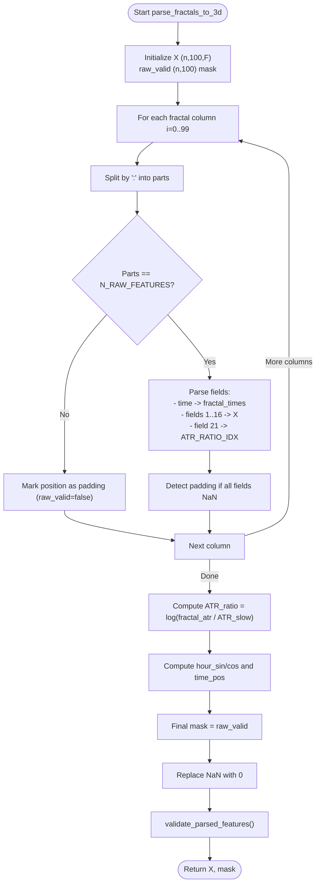
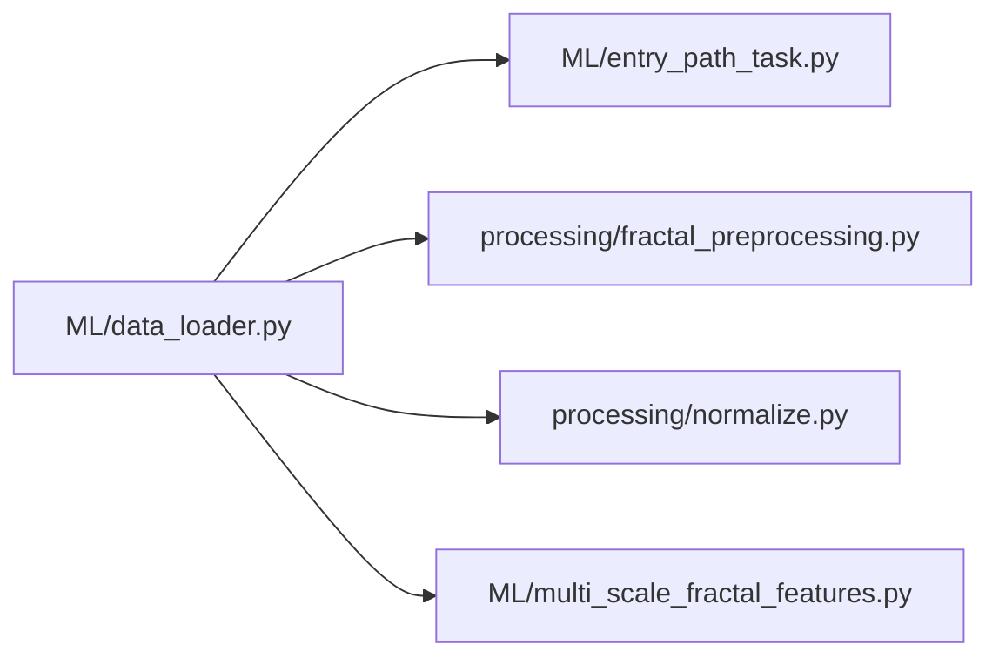

# Data Loading and Preprocessing

<cite>
**Referenced Files in This Document**
- [data_loader.py](file://ML/data_loader.py)
- [fractal_preprocessing.py](file://processing/fractal_preprocessing.py)
- [normalize.py](file://processing/normalize.py)
- [entry_path_task.py](file://ML/entry_path_task.py)
- [multi_scale_fractal_features.py](file://ML/multi_scale_fractal_features.py)
</cite>

## Table of Contents
1. [Introduction](#introduction)
2. [Project Structure](#project-structure)
3. [Core Components](#core-components)
4. [Architecture Overview](#architecture-overview)
5. [Detailed Component Analysis](#detailed-component-analysis)
6. [Dependency Analysis](#dependency-analysis)
7. [Performance Considerations](#performance-considerations)
8. [Troubleshooting Guide](#troubleshooting-guide)
9. [Conclusion](#conclusion)
10. [Appendices](#appendices)

## Introduction
This document explains the end-to-end data loading and preprocessing pipeline used to ingest labeled market snapshots from CSV, parse 3D fractal sequences, engineer time-based and ratio features, normalize inputs, and expose datasets optimized for training and evaluation. It covers:
- 3D sequence parsing from CSV with robust validation
- Vectorized parsing for efficiency
- Feature engineering: time-based features, ATR ratio, and optional normalization
- Caching strategy (.npy) with automatic invalidation
- Dataset classes for sequence modeling and entry path tasks
- Validation procedures for integrity, sequence length constraints, and feature consistency

## Project Structure
The pipeline spans three primary areas:
- ML/data_loader.py: orchestration of CSV ingestion, parsing, feature engineering, normalization, caching, and dataset creation
- processing/fractal_preprocessing.py: sorting of fractal columns per row (supporting both offline and online pipelines)
- processing/normalize.py: row-wise normalization routines and ATR scaling (used in other pipelines)
- ML/entry_path_task.py: entry path feature engineering and target splitting for dual-stream tasks
- ML/multi_scale_fractal_features.py: multi-scale window summaries for fractal tensors

**Diagram sources**
- [data_loader.py:549-925](file://ML/data_loader.py#L549-L925)
- [fractal_preprocessing.py:65-85](file://processing/fractal_preprocessing.py#L65-L85)
- [normalize.py:284-510](file://processing/normalize.py#L284-L510)
- [entry_path_task.py:61-83](file://ML/entry_path_task.py#L61-L83)
- [multi_scale_fractal_features.py:18-39](file://ML/multi_scale_fractal_features.py#L18-L39)

**Section sources**
- [data_loader.py:1-1210](file://ML/data_loader.py#L1-L1210)
- [fractal_preprocessing.py:1-86](file://processing/fractal_preprocessing.py#L1-L86)
- [normalize.py:1-669](file://processing/normalize.py#L1-L669)
- [entry_path_task.py:1-467](file://ML/entry_path_task.py#L1-L467)
- [multi_scale_fractal_features.py:1-39](file://ML/multi_scale_fractal_features.py#L1-L39)

## Core Components
- Vectorized 3D parsing: transforms CSV columns fractal0..fractal99 into tensors of shape (n, 100, F) while building a boolean mask for padding positions.
- Time-based features: computes hour_sin, hour_cos, and time_pos from timestamps embedded in each fractal.
- ATR ratio: replaces a raw ATR field with a log-scaled ratio normalized against a global ATR measure.
- Normalization: optional StandardScaler applied per-feature across flattened sequences; separate ATR normalization via robust scaling elsewhere.
- Caching: saves parsed arrays and targets to .npy files with automatic invalidation when CSV or cache schema changes.
- Datasets: FractalSequenceDataset for sequence modeling and EntryPathDataset for dual-target entry path tasks.

**Section sources**
- [data_loader.py:331-424](file://ML/data_loader.py#L331-L424)
- [data_loader.py:427-468](file://ML/data_loader.py#L427-L468)
- [data_loader.py:549-925](file://ML/data_loader.py#L549-L925)

## Architecture Overview
The pipeline follows a staged workflow: CSV ingestion → validation → parsing → feature engineering → normalization → caching → dataset construction → dataloader creation.

**Diagram sources**
- [data_loader.py:549-925](file://ML/data_loader.py#L549-L925)

## Detailed Component Analysis

### 3D Sequence Parsing from CSV
- Parses 100 fractal columns per row into a 3D tensor with shape (n, 100, F).
- Excludes raw time field from features but uses it to derive cyclic time features.
- Builds a boolean mask marking valid (non-padding) positions.
- Validates raw fractal format and column contract before parsing.

Key behaviors:
- Vectorized string splitting and numeric conversion across all fractal columns.
- Selective feature inclusion/exclusion (e.g., skip certain up/down fields).
- Padding detection by checking whether all parsed fields are NaN after coercion.
- Final NaN-to-zero conversion and post-parse validation.

**Section sources**
- [data_loader.py:331-424](file://ML/data_loader.py#L331-L424)
- [data_loader.py:248-298](file://ML/data_loader.py#L248-L298)

**Diagram sources**
- [data_loader.py:331-424](file://ML/data_loader.py#L331-L424)

### Vectorized Parsing and Field Validation
- Uses pandas string operations to split and coerce values in bulk for speed.
- Applies domain-specific checks for expected field counts and types.
- Enforces strict contracts for fractal fields and CSV columns.

Validation highlights:
- Sample-based validation of fractal format to catch schema mismatches early.
- Column presence checks against an expected contract.
- Post-parse sanity checks ensuring sufficient valid data and non-degenerate distributions.

**Section sources**
- [data_loader.py:248-298](file://ML/data_loader.py#L248-L298)
- [data_loader.py:300-327](file://ML/data_loader.py#L300-L327)

### Feature Engineering: Time Features and ATR Ratio
- Time features:
  - hour_sin and hour_cos computed from timestamps to encode cyclicity.
  - time_pos encodes temporal position within each row’s timeline.
- ATR ratio:
  - Replaces a raw ATR field with a log-transformed ratio relative to a slow ATR measure.
  - Clips extreme ratios to avoid log(0) and stabilize tails.

These features are appended as additional channels in the feature matrix.

**Section sources**
- [data_loader.py:392-414](file://ML/data_loader.py#L392-L414)

### Normalization Strategies
- Optional StandardScaler:
  - Flattens sequences to fit per-feature means and variances on training data, then transforms validation data.
  - Applied per-feature across all positions and samples.
- ATR normalization (separate module):
  - RobustScaler fit on training, transform on validation, saved to disk for reuse.
- Row-wise normalization (other pipeline):
  - Piecewise linear-log and min-max normalization for specific feature groups; used in alternate preprocessing paths.

**Section sources**
- [data_loader.py:427-468](file://ML/data_loader.py#L427-L468)
- [normalize.py:596-662](file://processing/normalize.py#L596-L662)

### Caching Mechanism and Automatic Invalidation
- Stores parsed arrays and targets as .npy files under DATA/.
- Cache keys include target type and, for entry path tasks, feature profile suffixes.
- Automatic invalidation:
  - If any cached file is older than the CSV, cache is invalidated.
  - If the number of features in the cache differs from the expected feature count, cache is invalidated.
- Clear-cache option forces deletion of all related cache files.

**Section sources**
- [data_loader.py:604-784](file://ML/data_loader.py#L604-L784)
- [data_loader.py:928-1209](file://ML/data_loader.py#L928-L1209)

### Dataset Classes
- FractalSequenceDataset:
  - Returns triplets (X, y, mask) where X has shape (seq_len, features), y is either scalar or multi-target, and mask marks valid positions.
  - Supports both classification and regression modes.
- EntryPathDataset:
  - Returns (X, engineered, y_reg, y_cls, mask, signal) for dual-target entry path tasks.
  - Engineered features are optional and depend on the feature profile.

Both datasets wrap NumPy arrays into PyTorch tensors for downstream training.

**Section sources**
- [data_loader.py:473-545](file://ML/data_loader.py#L473-L545)
- [entry_path_task.py:44-51](file://ML/entry_path_task.py#L44-L51)

### Entry Path Feature Engineering
- Entry path tasks support multiple built-in and library-based feature profiles.
- Features include base time/volume regime features and window-based bank features.
- Targets include return and path-regression components plus a categorical path class.

**Section sources**
- [entry_path_task.py:26-83](file://ML/entry_path_task.py#L26-L83)

### Multi-Scale Fractal Features
- Computes window summaries across multiple horizons (mean, std, slope, range) from the 3D fractal tensor.
- Useful for augmenting input features with scale-invariant summaries.

**Section sources**
- [multi_scale_fractal_features.py:18-39](file://ML/multi_scale_fractal_features.py#L18-L39)

## Dependency Analysis
The pipeline exhibits clear separation of concerns:
- data_loader.py orchestrates the end-to-end flow and depends on:
  - entry_path_task.py for entry path feature/target handling
  - fractal_preprocessing.py for optional row-wise sorting
  - normalize.py for alternative normalization strategies
  - multi_scale_fractal_features.py for additional feature generation

**Diagram sources**
- [data_loader.py:47-66](file://ML/data_loader.py#L47-L66)

**Section sources**
- [data_loader.py:47-66](file://ML/data_loader.py#L47-L66)

## Performance Considerations
- Vectorized parsing minimizes Python loops by leveraging pandas string operations and NumPy broadcasting.
- Caching avoids repeated parsing and reduces I/O overhead across runs.
- Optional StandardScaler adds minimal overhead; it is disabled during inference/test loading.
- Sequence truncation allows focusing on recent events, reducing memory footprint.

[No sources needed since this section provides general guidance]

## Troubleshooting Guide
Common issues and remedies:
- Schema mismatch in CSV:
  - Verify fractal field counts and types using the built-in validator.
  - Confirm CSV column contract matches expectations.
- Empty or all-NaN sequences:
  - Post-parse validation raises explicit errors if too few valid positions remain.
- Feature dimension mismatch:
  - Automatic cache invalidation triggers when feature counts change.
- Inconsistent entry path features:
  - Ensure the chosen feature profile is supported and produces the expected number of engineered features.

**Section sources**
- [data_loader.py:248-298](file://ML/data_loader.py#L248-L298)
- [data_loader.py:300-327](file://ML/data_loader.py#L300-L327)
- [data_loader.py:636-651](file://ML/data_loader.py#L636-L651)
- [entry_path_task.py:54-58](file://ML/entry_path_task.py#L54-L58)

## Conclusion
The pipeline provides a robust, vectorized, and cache-aware path from labeled CSV to ready-to-train datasets. It validates inputs rigorously, engineers meaningful time-based and ratio features, and exposes flexible dataset classes tailored to sequence modeling and entry path tasks. The caching and automatic invalidation mechanisms significantly improve iteration speed while maintaining correctness.

[No sources needed since this section summarizes without analyzing specific files]

## Appendices

### Sequence Length Constraints and Validation
- seq_len must be within [1, 100]; for entry path tasks, only specific allowed lengths are accepted.
- When seq_len < 100, the pipeline truncates sequences to retain most recent positions.

**Section sources**
- [data_loader.py:153-159](file://ML/data_loader.py#L153-L159)
- [data_loader.py:796-803](file://ML/data_loader.py#L796-L803)

### Sorting Fractals Per Row (Online/Offline Support)
- Utility sorts fractal columns within each row by descending timestamp to ensure consistent ordering regardless of input order.

**Section sources**
- [fractal_preprocessing.py:65-85](file://processing/fractal_preprocessing.py#L65-L85)