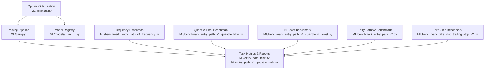
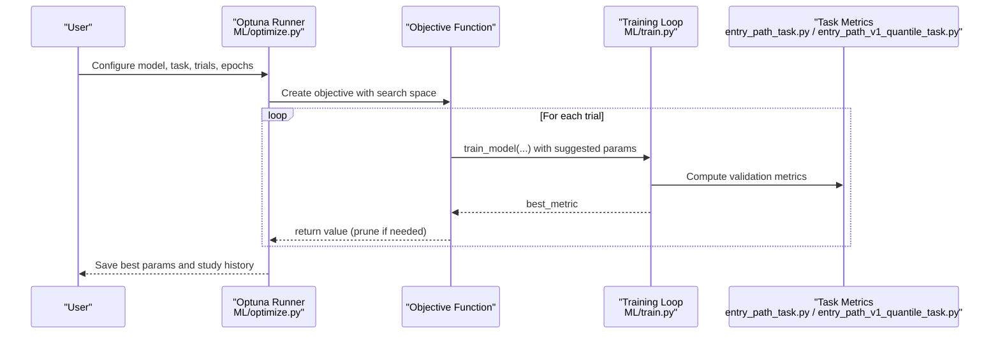
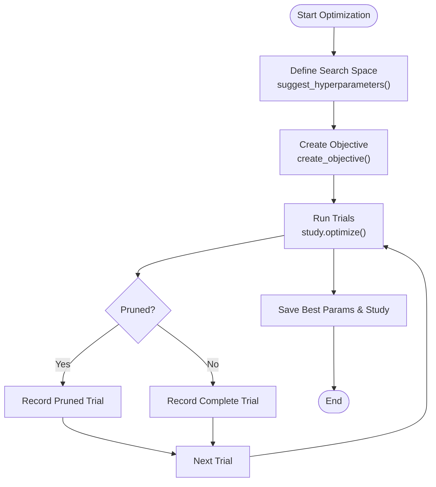
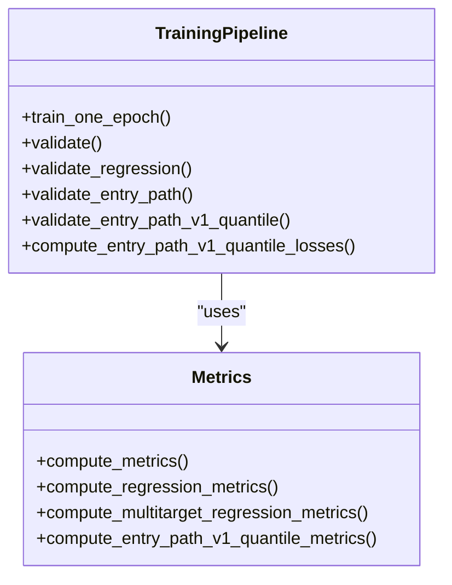
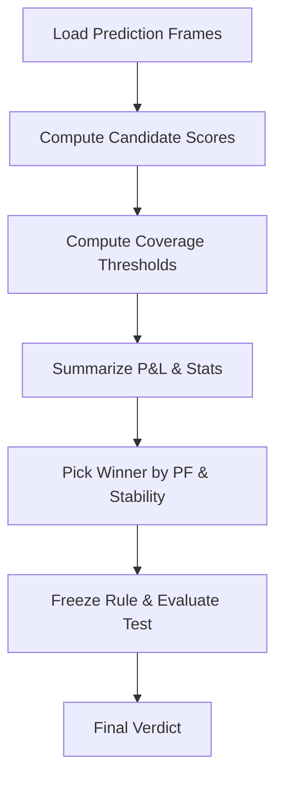
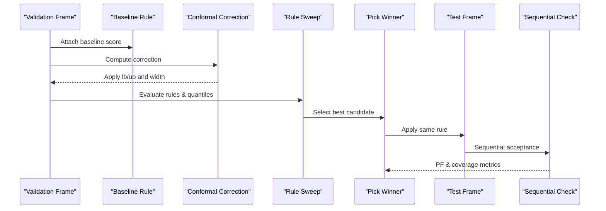
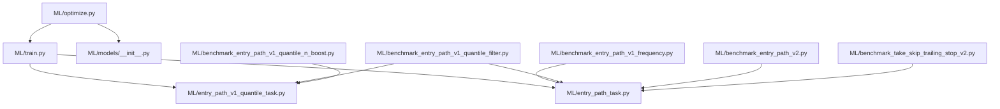

# Hyperparameter Optimization

<cite>
**Referenced Files in This Document**
- [optimize.py](file://ML/optimize.py)
- [train.py](file://ML/train.py)
- [models/__init__.py](file://ML/models/__init__.py)
- [entry_path_task.py](file://ML/entry_path_task.py)
- [entry_path_v1_quantile_task.py](file://ML/entry_path_v1_quantile_task.py)
- [entry_path_trade_filter.py](file://ML/entry_path_trade_filter.py)
- [benchmark_entry_path_v1_frequency.py](file://ML/benchmark_entry_path_v1_frequency.py)
- [benchmark_entry_path_v1_quantile_filter.py](file://ML/benchmark_entry_path_v1_quantile_filter.py)
- [benchmark_entry_path_v1_quantile_n_boost.py](file://ML/benchmark_entry_path_v1_quantile_n_boost.py)
- [benchmark_entry_path_v2.py](file://ML/benchmark_entry_path_v2.py)
- [benchmark_take_skip_trailing_stop_v2.py](file://ML/benchmark_take_skip_trailing_stop_v2.py)
- [entry_path_v1_quantile_ensemble.py](file://ML/entry_path_v1_quantile_ensemble.py)
- [optuna_best_params_transformer_regression_updn.json](file://ML/reports/optuna_best_params_transformer_regression_updn.json)
- [optuna_study_transformer_regression_updn_20260319_172657.json](file://ML/reports/optuna_study_transformer_regression_updn_20260319_172657.json)
- [entry_path_v1_frequency/final_verdict.json](file://ML/reports/entry_path_v1_frequency/final_verdict.json)
- [entry_path_v1_quantile_filter_selected_rule.json](file://ML/reports/entry_path_v1_quantile_filter_selected_rule.json)
</cite>

## Table of Contents
1. [Introduction](#introduction)
2. [Project Structure](#project-structure)
3. [Core Components](#core-components)
4. [Architecture Overview](#architecture-overview)
5. [Detailed Component Analysis](#detailed-component-analysis)
6. [Dependency Analysis](#dependency-analysis)
7. [Performance Considerations](#performance-considerations)
8. [Troubleshooting Guide](#troubleshooting-guide)
9. [Conclusion](#conclusion)

## Introduction
This document provides comprehensive guidance for hyperparameter optimization and benchmarking within the SoSimple trading ML system. It explains how Optuna is integrated for automated hyperparameter search across classification, regression, and multitask entry path models, and how benchmarking frameworks are structured to compare model configurations and trading setups. It covers optimization objectives, performance metrics, experimental designs for entry path frequency and quantile filter optimizations, and practical advice for resource management and distributed computing.

## Project Structure
The optimization and benchmarking capabilities are centered around:
- Hyperparameter optimization: ML/optimize.py orchestrates Optuna studies, defines search spaces, and saves results.
- Training pipeline: ML/train.py implements unified training loops, early stopping, schedulers, and metrics for various tasks.
- Model registry: ML/models/__init__.py exposes supported architectures for selection during optimization.
- Task-specific metrics and reporting: ML/entry_path_task.py and ML/entry_path_v1_quantile_task.py define evaluation metrics and report generation.
- Benchmarking suites: Dedicated scripts under ML/ benchmark different rule sets, filters, and selection strategies.

**Diagram sources**
- [optimize.py:1-461](file://ML/optimize.py#L1-461)
- [train.py:1-800](file://ML/train.py#L1-800)
- [models/__init__.py:1-49](file://ML/models/__init__.py#L1-49)
- [entry_path_task.py:1-467](file://ML/entry_path_task.py#L1-467)
- [entry_path_v1_quantile_task.py:1-241](file://ML/entry_path_v1_quantile_task.py#L1-241)
- [benchmark_entry_path_v1_frequency.py:1-187](file://ML/benchmark_entry_path_v1_frequency.py#L1-187)
- [benchmark_entry_path_v1_quantile_filter.py:1-338](file://ML/benchmark_entry_path_v1_quantile_filter.py#L1-338)
- [benchmark_entry_path_v1_quantile_n_boost.py:1-366](file://ML/benchmark_entry_path_v1_quantile_n_boost.py#L1-366)
- [benchmark_entry_path_v2.py:1-305](file://ML/benchmark_entry_path_v2.py#L1-305)
- [benchmark_take_skip_trailing_stop_v2.py:1-144](file://ML/benchmark_take_skip_trailing_stop_v2.py#L1-144)

**Section sources**
- [optimize.py:1-461](file://ML/optimize.py#L1-461)
- [train.py:1-800](file://ML/train.py#L1-800)
- [models/__init__.py:1-49](file://ML/models/__init__.py#L1-49)

## Core Components
- Optuna integration: Defines search spaces, objective function, pruning, and saving of study results.
- Training loop: Implements early stopping, schedulers, loss functions, and metrics tailored to task types.
- Model registry: Centralizes model selection for optimization runs.
- Benchmarking: Provides rule-based selection, quantile filtering, and ensemble strategies with validation-first testing.

Key outcomes:
- Automated hyperparameter search with pruning and TPE sampling.
- Unified training with configurable loss functions and metrics.
- Reproducible benchmarking with frozen rules and sequential checks.

**Section sources**
- [optimize.py:63-200](file://ML/optimize.py#L63-200)
- [train.py:153-167](file://ML/train.py#L153-167)
- [models/__init__.py:23-49](file://ML/models/__init__.py#L23-49)

## Architecture Overview
The optimization and benchmarking architecture integrates Optuna-driven hyperparameter search with a robust training pipeline and task-specific evaluation.

**Diagram sources**
- [optimize.py:132-200](file://ML/optimize.py#L132-200)
- [train.py:176-240](file://ML/train.py#L176-240)
- [entry_path_task.py:182-467](file://ML/entry_path_task.py#L182-467)
- [entry_path_v1_quantile_task.py:98-142](file://ML/entry_path_v1_quantile_task.py#L98-142)

## Detailed Component Analysis

### Optuna Hyperparameter Optimization
- Search space definition: Includes learning rate, batch size, patience, weight decay, scheduler parameters, and model-specific kwargs (e.g., hidden size, number of layers, dropout, transformer dimensions).
- Objective function: Executes training for a trial, captures best validation metric, and supports pruning via Optuna’s TrialPruned.
- Pruning and sampler: Uses MedianPruner with startup and warmup steps, and TPESampler for efficient sampling.
- Reporting: Saves best parameters and full study history to JSON for reproducibility.

**Diagram sources**
- [optimize.py:63-200](file://ML/optimize.py#L63-200)
- [optimize.py:207-282](file://ML/optimize.py#L207-282)

**Section sources**
- [optimize.py:63-200](file://ML/optimize.py#L63-200)
- [optimize.py:207-282](file://ML/optimize.py#L207-282)

### Training Pipeline and Early Stopping
- Early stopping: Configurable patience and scheduler factor; ReduceLROnPlateau on the primary metric.
- Loss functions: Focal Loss for classification, Huber or Asymmetric Loss for regression, multitask losses for entry path and quantile tasks.
- Metrics: Macro F1, Pearson correlation, path regression metrics, and path classification metrics; quantile coverage and pinball loss for entry path quantile task.

**Diagram sources**
- [train.py:176-240](file://ML/train.py#L176-240)
- [train.py:296-365](file://ML/train.py#L296-365)
- [train.py:529-637](file://ML/train.py#L529-637)
- [train.py:753-809](file://ML/train.py#L753-809)
- [entry_path_v1_quantile_task.py:98-142](file://ML/entry_path_v1_quantile_task.py#L98-142)

**Section sources**
- [train.py:153-167](file://ML/train.py#L153-167)
- [train.py:296-365](file://ML/train.py#L296-365)
- [entry_path_v1_quantile_task.py:98-142](file://ML/entry_path_v1_quantile_task.py#L98-142)

### Model Registry and Selection
- Centralized model registry enables selecting among BiLSTM, CNN1D, Transformer, and Hybrid architectures.
- Optimization selects a model by name and injects architecture-specific kwargs into the search space.

**Section sources**
- [models/__init__.py:23-49](file://ML/models/__init__.py#L23-49)
- [optimize.py:105-125](file://ML/optimize.py#L105-125)

### Benchmarking Frameworks

#### Entry Path Frequency Optimization
- Goal: Increase trade frequency while maintaining profitability and stability.
- Method: Grid search over candidate scores (return prediction, edge measures, path probability) at target coverages; pick best using PF, negative year slices, and trades per year.
- Output: Final verdict, selected candidate, and summaries for validation and test sets.

**Diagram sources**
- [benchmark_entry_path_v1_frequency.py:55-118](file://ML/benchmark_entry_path_v1_frequency.py#L55-118)
- [benchmark_entry_path_v1_frequency.py:101-159](file://ML/benchmark_entry_path_v1_frequency.py#L101-159)

**Section sources**
- [benchmark_entry_path_v1_frequency.py:101-159](file://ML/benchmark_entry_path_v1_frequency.py#L101-159)
- [entry_path_trade_filter.py:86-95](file://ML/entry_path_trade_filter.py#L86-95)

#### Quantile Filter Optimization
- Goal: Improve entry path rule selection using conformal quantile intervals and rule variants (lb > 0, lb > m, lb > m & width ≤ w).
- Method: Compute conformal correction, apply corrections, sweep rules and quantile thresholds, and pick best on validation; freeze on test with sequential check.
- Output: Selected rule, frozen test metrics, and sequential acceptance results.

**Diagram sources**
- [benchmark_entry_path_v1_quantile_filter.py:190-309](file://ML/benchmark_entry_path_v1_quantile_filter.py#L190-309)
- [entry_path_v1_quantile_task.py:90-96](file://ML/entry_path_v1_quantile_task.py#L90-96)

**Section sources**
- [benchmark_entry_path_v1_quantile_filter.py:190-309](file://ML/benchmark_entry_path_v1_quantile_filter.py#L190-309)
- [entry_path_v1_quantile_task.py:90-96](file://ML/entry_path_v1_quantile_task.py#L90-96)

#### N-Boost Quantile Strategy
- Goal: Increase trade frequency via relaxed thresholds and ensemble predictions across multiple seeds.
- Method: Sweep quantile thresholds on validation, aggregate quantile predictions across seeds, and evaluate majority vote ensembles; gate results by trade counts and stability.
- Output: Best candidate, frozen test metrics, sequential results, and gate verdict.

**Section sources**
- [benchmark_entry_path_v1_quantile_n_boost.py:225-336](file://ML/benchmark_entry_path_v1_quantile_n_boost.py#L225-336)
- [entry_path_v1_quantile_ensemble.py:21-32](file://ML/entry_path_v1_quantile_ensemble.py#L21-32)

#### Entry Path v2 Benchmark
- Goal: Compare diverse candidate formulations (weighted sums, ratios, edge combinations) for selection.
- Method: Build candidate families, compute thresholds per coverage, rank by PF and stability, and evaluate test with diagnostics.

**Section sources**
- [benchmark_entry_path_v2.py:141-277](file://ML/benchmark_entry_path_v2.py#L141-277)

#### Take-Skip Trailing Stop v2 Benchmark
- Goal: Evaluate probabilistic and top-K selection strategies for trailing stop targets.
- Method: Summarize PF, drawdown, and trade metrics across thresholds and top-K fractions; pick winners by PF and trades per year.

**Section sources**
- [benchmark_take_skip_trailing_stop_v2.py:100-144](file://ML/benchmark_take_skip_trailing_stop_v2.py#L100-144)

## Dependency Analysis
The optimization and benchmarking modules depend on shared training and task infrastructure.

**Diagram sources**
- [optimize.py:48-49](file://ML/optimize.py#L48-49)
- [train.py:91-117](file://ML/train.py#L91-117)
- [entry_path_task.py:1-42](file://ML/entry_path_task.py#L1-42)
- [entry_path_v1_quantile_task.py:1-18](file://ML/entry_path_v1_quantile_task.py#L1-18)
- [benchmark_entry_path_v1_frequency.py:10-11](file://ML/benchmark_entry_path_v1_frequency.py#L10-11)
- [benchmark_entry_path_v1_quantile_filter.py:8-11](file://ML/benchmark_entry_path_v1_quantile_filter.py#L8-11)
- [benchmark_entry_path_v1_quantile_n_boost.py:17-33](file://ML/benchmark_entry_path_v1_quantile_n_boost.py#L17-33)
- [benchmark_entry_path_v2.py](file://ML/benchmark_entry_path_v2.py#L10)
- [benchmark_take_skip_trailing_stop_v2.py:8-21](file://ML/benchmark_take_skip_trailing_stop_v2.py#L8-21)

**Section sources**
- [optimize.py:48-49](file://ML/optimize.py#L48-49)
- [train.py:91-117](file://ML/train.py#L91-117)

## Performance Considerations
- Parallelization: Optuna’s study.optimize can run trials concurrently; configure n_jobs appropriately for your hardware.
- Early stopping and pruning: Use patience and MedianPruner to reduce wasted computation on poor trials.
- Mixed precision and device utilization: Ensure GPU/CPU allocation aligns with batch sizes and model complexity.
- Memory footprint: Large batch sizes and long sequences increase memory usage; tune batch_size and sequence lengths accordingly.
- Distributed computing: For large-scale studies, consider Optuna’s database storage backend and distributed execution environments.

[No sources needed since this section provides general guidance]

## Troubleshooting Guide
Common issues and resolutions:
- Optuna not installed: The optimization script checks for optuna and exits with a clear message if missing.
- Trial failures: Objective catches exceptions and returns a minimal value; review logs and adjust search bounds.
- Empty or misaligned prediction frames: Benchmark scripts validate presence of required columns and raise descriptive errors.
- Unstable or negative year slices: Use gate criteria and sequential checks to filter unstable candidates.

**Section sources**
- [optimize.py:431-437](file://ML/optimize.py#L431-437)
- [optimize.py:195-199](file://ML/optimize.py#L195-199)
- [benchmark_entry_path_v1_frequency.py:13-16](file://ML/benchmark_entry_path_v1_frequency.py#L13-16)
- [benchmark_entry_path_v1_quantile_filter.py:201-203](file://ML/benchmark_entry_path_v1_quantile_filter.py#L201-203)

## Conclusion
The SoSimple system combines automated hyperparameter optimization with rigorous benchmarking to improve model configurations and trading rule selection. Optuna-driven studies with pruning and TPE sampling efficiently explore search spaces, while task-specific metrics and validation-first testing ensure robust, reproducible results. The benchmarking suite supports iterative improvements across entry path frequency, quantile filters, and trailing stop strategies, with outputs suitable for production freezing and sequential checks.