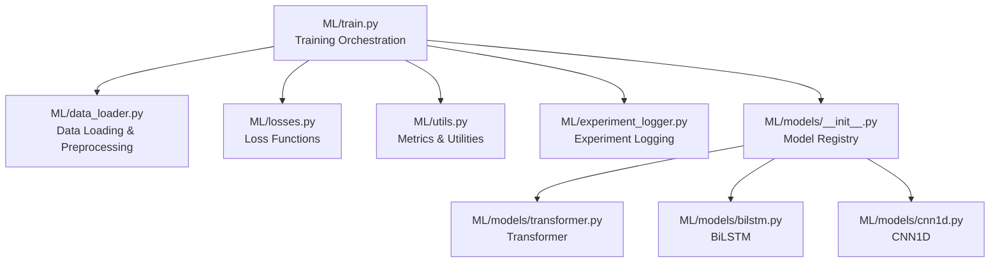
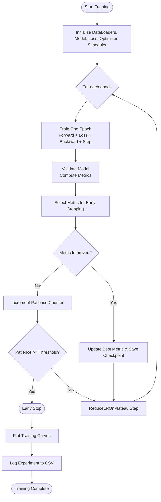
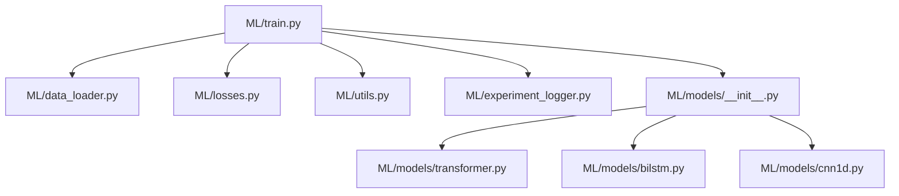

# Model Training Orchestration

<cite>
**Referenced Files in This Document**
- [train.py](file://ML/train.py)
- [losses.py](file://ML/losses.py)
- [data_loader.py](file://ML/data_loader.py)
- [utils.py](file://ML/utils.py)
- [experiment_logger.py](file://ML/experiment_logger.py)
- [models/__init__.py](file://ML/models/__init__.py)
- [models/transformer.py](file://ML/models/transformer.py)
- [models/bilstm.py](file://ML/models/bilstm.py)
- [models/cnn1d.py](file://ML/models/cnn1d.py)
</cite>

## Table of Contents
1. [Introduction](#introduction)
2. [Project Structure](#project-structure)
3. [Core Components](#core-components)
4. [Architecture Overview](#architecture-overview)
5. [Detailed Component Analysis](#detailed-component-analysis)
6. [Dependency Analysis](#dependency-analysis)
7. [Performance Considerations](#performance-considerations)
8. [Troubleshooting Guide](#troubleshooting-guide)
9. [Conclusion](#conclusion)

## Introduction
This document provides comprehensive documentation for the model training orchestration system used across multiple machine learning tasks in the SoSimple project. It covers the training loop implementation, epoch management, gradient updates, and validation cycles. It also explains loss function definitions and their application across different task types (classification, regression, multi-target), optimizer configuration, learning rate scheduling, and regularization techniques. Additionally, it details checkpoint management, model state saving, and resume training capabilities, along with training configuration options, batch size optimization, memory management strategies, early stopping criteria, patience settings, convergence monitoring, training visualization, metrics tracking, and performance analysis.

## Project Structure
The training orchestration system is centered around a unified training script that supports multiple model architectures and task types. Supporting modules handle data loading, loss computation, metrics calculation, and experiment logging.



**Diagram sources**
- [train.py:1027-1764](file://ML/train.py#L1027-L1764)
- [data_loader.py:549-800](file://ML/data_loader.py#L549-L800)
- [losses.py:33-233](file://ML/losses.py#L33-L233)
- [utils.py:42-340](file://ML/utils.py#L42-L340)
- [experiment_logger.py:107-352](file://ML/experiment_logger.py#L107-L352)
- [models/__init__.py:31-49](file://ML/models/__init__.py#L31-L49)
- [models/transformer.py:78-199](file://ML/models/transformer.py#L78-L199)
- [models/bilstm.py:30-113](file://ML/models/bilstm.py#L30-L113)
- [models/cnn1d.py:30-123](file://ML/models/cnn1d.py#L30-L123)

**Section sources**
- [train.py:1027-1764](file://ML/train.py#L1027-L1764)
- [data_loader.py:549-800](file://ML/data_loader.py#L549-L800)
- [models/__init__.py:31-49](file://ML/models/__init__.py#L31-L49)

## Core Components
This section outlines the primary components of the training orchestration system and their roles in the end-to-end pipeline.

- Training Orchestration (train.py): Implements the complete training loop, including epoch management, gradient updates, validation cycles, early stopping, learning rate scheduling, checkpointing, and visualization.
- Loss Functions (losses.py): Provides Focal Loss for imbalanced classification, Huber Loss for robust regression, Asymmetric Loss for directional penalties, and Directional Asymmetric Loss for multi-output regression with direction awareness.
- Data Loader (data_loader.py): Handles dataset creation, caching, normalization, sequence truncation, and task-specific target extraction for various ML tasks.
- Utilities (utils.py): Offers metric computation for classification, regression, and multi-target regression, parameter counting, and device selection.
- Experiment Logger (experiment_logger.py): Logs experiment configurations and results to a centralized CSV for reproducibility and comparison.
- Model Registry (models/__init__.py): Registers available model architectures and provides factory-style instantiation.
- Model Implementations: Transformer, BiLSTM, and CNN1D classifiers with consistent forward signatures.

**Section sources**
- [train.py:176-898](file://ML/train.py#L176-L898)
- [losses.py:33-233](file://ML/losses.py#L33-L233)
- [data_loader.py:549-800](file://ML/data_loader.py#L549-L800)
- [utils.py:60-340](file://ML/utils.py#L60-L340)
- [experiment_logger.py:107-352](file://ML/experiment_logger.py#L107-L352)
- [models/__init__.py:31-49](file://ML/models/__init__.py#L31-L49)

## Architecture Overview
The training system follows a modular architecture where the orchestration script coordinates data loading, model instantiation, loss computation, optimizer updates, and validation. It supports multiple task types and model architectures while maintaining consistent logging and visualization.

```mermaid
sequenceDiagram
participant CLI as "CLI"
participant Train as "train_model()"
participant Loader as "create_data_loaders()"
participant Model as "Model Instance"
participant Loss as "Loss Function"
participant Opt as "Optimizer"
participant Sch as "Scheduler"
participant Val as "Validation Loop"
CLI->>Train : Parse arguments and call train_model()
Train->>Loader : Build train/val loaders
Loader-->>Train : DataLoader instances
Train->>Model : Instantiate model
Train->>Loss : Configure loss based on task
Train->>Opt : Initialize optimizer
Train->>Sch : Initialize scheduler
loop For each epoch
Train->>Model : Forward pass (train)
Train->>Loss : Compute loss
Train->>Opt : Backward and step
Train->>Val : Validate model
Val-->>Train : Validation metrics
Train->>Sch : Step scheduler with metric
alt Early stopping condition
Train->>Train : Stop training
end
Train->>Train : Save best checkpoint
end
Train->>Train : Plot training curves
Train->>Train : Log experiment to CSV
```

**Diagram sources**
- [train.py:1027-1764](file://ML/train.py#L1027-L1764)
- [data_loader.py:549-800](file://ML/data_loader.py#L549-L800)
- [losses.py:33-233](file://ML/losses.py#L33-L233)

## Detailed Component Analysis

### Training Loop Implementation
The training loop manages epochs, gradient updates, and validation. It supports multiple task types with task-specific validation and metrics computation.

Key aspects:
- Epoch Management: Iterates from 1 to the configured number of epochs.
- Gradient Updates: Computes loss, performs backward pass, applies gradient clipping, and steps the optimizer.
- Validation Cycles: Executes validation after each epoch, computes task-specific metrics, and tracks best performance.
- Early Stopping: Monitors validation metric and stops training when no improvement occurs within the patience window.
- Learning Rate Scheduling: Uses ReduceLROnPlateau with configurable patience and factor.



**Diagram sources**
- [train.py:1350-1599](file://ML/train.py#L1350-L1599)

**Section sources**
- [train.py:1350-1599](file://ML/train.py#L1350-L1599)

### Loss Function Definitions and Application
The system defines several loss functions tailored to different tasks:

- Focal Loss: Designed for imbalanced classification, emphasizing minority classes through a modulating factor.
- Huber Loss: Robust regression loss that combines MSE and MAE behavior based on error magnitude.
- Asymmetric Loss: Allows different penalties for over-prediction and under-prediction, useful for trading applications.
- Directional Asymmetric Loss: Applies direction-aware penalties for multi-output regression tasks.

Task-specific application:
- Classification: Focal Loss with configurable alpha and gamma.
- Regression: Huber Loss by default; Asymmetric or Directional variants selectable via flags.
- Multi-target Regression: Aggregates per-target metrics for monitoring.
- Binary Classification: CrossEntropy with optional class weights.
- Triple Barrier: BCEWithLogitsLoss with positive class weights computed from training data.

**Section sources**
- [losses.py:33-233](file://ML/losses.py#L33-L233)
- [train.py:1200-1262](file://ML/train.py#L1200-L1262)

### Optimizer Configuration, Learning Rate Scheduling, and Regularization
- Optimizer: AdamW with configurable learning rate and weight decay.
- Regularization: Dropout in model architectures, optional StandardScaler for feature normalization, and gradient norm clipping.
- Learning Rate Scheduling: ReduceLROnPlateau scheduler that reduces learning rate when validation metric plateaus.

Hyperparameters:
- Learning rate (lr), weight decay, scheduler patience, scheduler factor, gradient clipping norm.

**Section sources**
- [train.py:1250-1262](file://ML/train.py#L1250-L1262)
- [models/transformer.py:142-148](file://ML/models/transformer.py#L142-L148)
- [models/bilstm.py:76-82](file://ML/models/bilstm.py#L76-L82)
- [models/cnn1d.py:86-93](file://ML/models/cnn1d.py#L86-L93)

### Checkpoint Management, Model State Saving, and Resume Training
Checkpointing:
- Saves best model state based on validation metric.
- Stores optimizer state, model hyperparameters, and training metadata.
- Generates artifact suffixes based on task and feature profiles.

Resume training:
- Supports loading checkpoints for fine-tuning or continuation.
- Transfer learning option allows loading encoder weights from another checkpoint.

Logging:
- Centralized CSV logging of experiment configurations and results for reproducibility and comparison.

**Section sources**
- [train.py:1574-1592](file://ML/train.py#L1574-L1592)
- [experiment_logger.py:107-352](file://ML/experiment_logger.py#L107-L352)

### Training Configuration Options, Batch Size Optimization, and Memory Management
Configuration options:
- Model selection, task type, epochs, batch size, learning rate, weight decay, patience, scheduler parameters, loss selection, scaling options, weighted sampling, sequence length, model kwargs, encoder transfer learning, and cache clearing.

Batch size optimization:
- Larger batches improve throughput but require more memory; smaller batches increase noise and may improve generalization.
- Gradient accumulation can be used to simulate larger effective batch sizes.

Memory management:
- Gradient clipping prevents exploding gradients.
- Efficient data loading with caching reduces I/O overhead.
- Device selection automatically uses GPU when available.

**Section sources**
- [train.py:2151-2253](file://ML/train.py#L2151-L2253)
- [data_loader.py:549-800](file://ML/data_loader.py#L549-L800)
- [utils.py:326-340](file://ML/utils.py#L326-L340)

### Early Stopping Criteria, Patience Settings, and Convergence Monitoring
Early stopping:
- Monitors validation metric (task-dependent) and stops training when no improvement occurs within the patience window.
- Scheduler reduces learning rate on plateau to aid convergence.

Convergence monitoring:
- Tracks training and validation loss, task-specific metrics, and learning rate changes.
- Plots training curves for visual inspection.

**Section sources**
- [train.py:1567-1599](file://ML/train.py#L1567-L1599)
- [train.py:1930-2042](file://ML/train.py#L1930-L2042)

### Training Visualization, Metrics Tracking, and Performance Analysis
Visualization:
- Training curves (loss and metrics) saved as PNG files.
- Confusion matrices for classification tasks.
- Regression plots (scatter and residuals) for regression tasks.

Metrics tracking:
- Comprehensive metrics computed per task type (F1, precision, recall, Pearson correlation, MAE, RMSE, R²).
- Per-target metrics for multi-target regression.

Performance analysis:
- CSV logs enable comparative analysis across experiments.
- Best epoch and training time recorded for each run.

**Section sources**
- [train.py:1660-1687](file://ML/train.py#L1660-L1687)
- [train.py:1930-2145](file://ML/train.py#L1930-L2145)
- [utils.py:60-311](file://ML/utils.py#L60-L311)
- [experiment_logger.py:247-352](file://ML/experiment_logger.py#L247-L352)

## Dependency Analysis
The training orchestration system exhibits clear separation of concerns with well-defined dependencies among modules.



**Diagram sources**
- [train.py:75-129](file://ML/train.py#L75-L129)
- [models/__init__.py:31-49](file://ML/models/__init__.py#L31-L49)

**Section sources**
- [train.py:75-129](file://ML/train.py#L75-L129)
- [models/__init__.py:31-49](file://ML/models/__init__.py#L31-L49)

## Performance Considerations
- Use appropriate batch sizes for available hardware; consider gradient accumulation for larger effective batch sizes.
- Enable gradient clipping to stabilize training and prevent exploding gradients.
- Choose loss functions suited to the task (Focal Loss for imbalanced classification, Huber for robust regression).
- Monitor validation metrics and adjust patience and scheduler parameters to balance convergence speed and stability.
- Utilize GPU acceleration when available for improved training throughput.

## Troubleshooting Guide
Common issues and resolutions:
- Poor validation performance: Adjust learning rate, increase patience, or switch to a different loss function.
- Overfitting: Increase dropout, use gradient clipping, or reduce model capacity.
- Memory issues: Decrease batch size, disable unnecessary feature scaling, or use gradient accumulation.
- Convergence stalls: Reduce learning rate using the scheduler or adjust scheduler patience/factor.
- Data loading problems: Clear cached files using the clear_cache flag and re-run training.

**Section sources**
- [train.py:1567-1599](file://ML/train.py#L1567-L1599)
- [data_loader.py:630-652](file://ML/data_loader.py#L630-L652)

## Conclusion
The model training orchestration system provides a robust, modular framework for training neural networks across diverse tasks. It integrates efficient data loading, flexible loss functions, comprehensive metrics tracking, and reliable checkpointing with visualization and logging. By leveraging early stopping, learning rate scheduling, and regularization techniques, it enables stable and effective training with strong reproducibility and performance analysis capabilities.