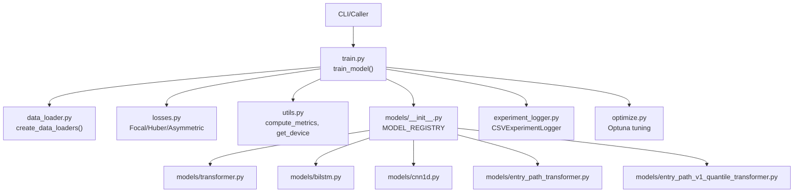
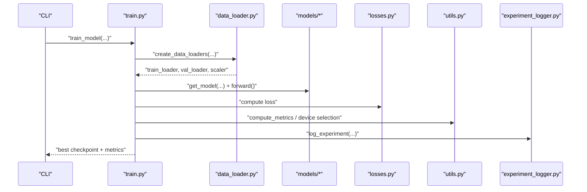
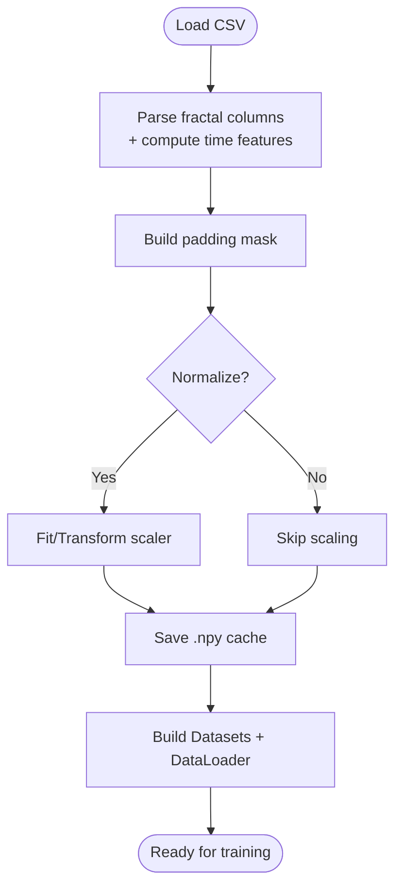
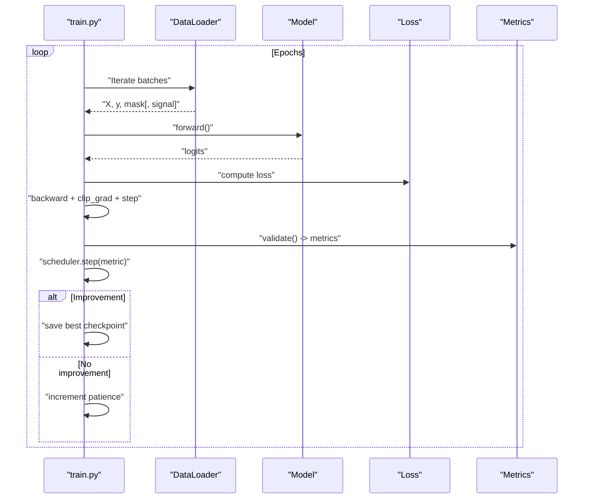
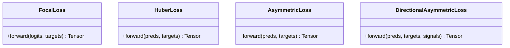
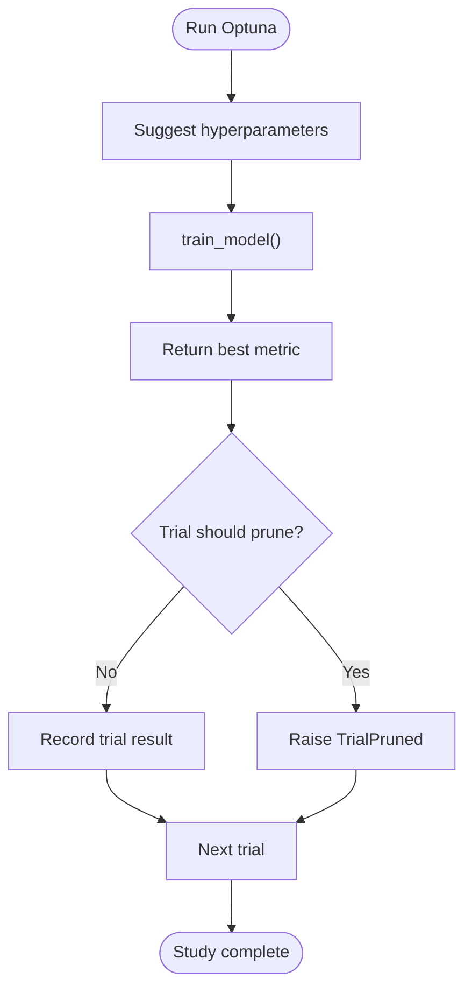
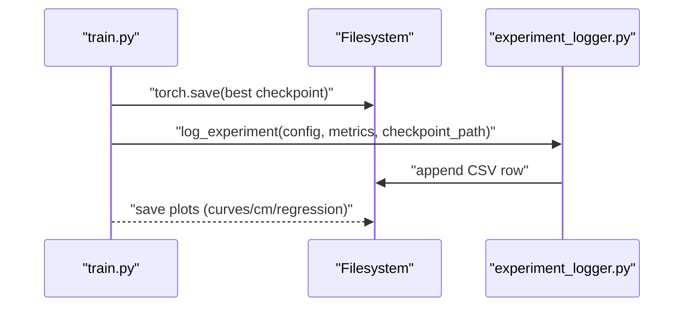
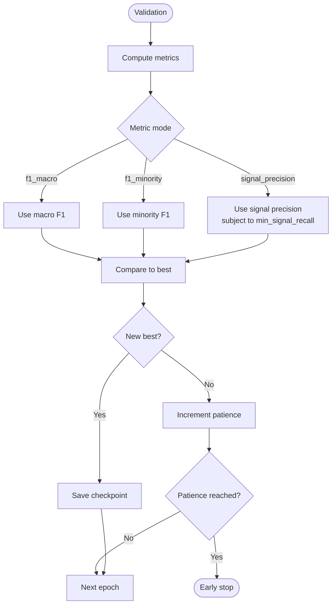
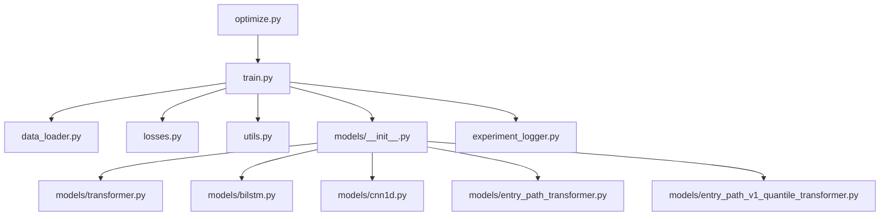

# Training Pipeline

<cite>
**Referenced Files in This Document**
- [train.py](file://ML/train.py)
- [data_loader.py](file://ML/data_loader.py)
- [losses.py](file://ML/losses.py)
- [utils.py](file://ML/utils.py)
- [optimize.py](file://ML/optimize.py)
- [experiment_logger.py](file://ML/experiment_logger.py)
- [models/__init__.py](file://ML/models/__init__.py)
- [models/transformer.py](file://ML/models/transformer.py)
- [models/bilstm.py](file://ML/models/bilstm.py)
- [models/cnn1d.py](file://ML/models/cnn1d.py)
- [models/entry_path_transformer.py](file://ML/models/entry_path_transformer.py)
- [models/entry_path_v1_quantile_transformer.py](file://ML/models/entry_path_v1_quantile_transformer.py)
</cite>

## Table of Contents
1. [Introduction](#introduction)
2. [Project Structure](#project-structure)
3. [Core Components](#core-components)
4. [Architecture Overview](#architecture-overview)
5. [Detailed Component Analysis](#detailed-component-analysis)
6. [Dependency Analysis](#dependency-analysis)
7. [Performance Considerations](#performance-considerations)
8. [Troubleshooting Guide](#troubleshooting-guide)
9. [Conclusion](#conclusion)
10. [Appendices](#appendices)

## Introduction
This document explains the machine learning training pipeline used for financial time series modeling. It covers data loading strategies for 3D sequence data, batch processing, memory optimization, training orchestration, loss functions, optimizers, schedulers, hyperparameter management, checkpointing, model state handling, validation, early stopping, and performance monitoring. Guidance is also provided for training configuration, batch size optimization, and GPU utilization, along with common training issues, debugging techniques, and best practices tailored for financial markets.

## Project Structure
The training pipeline centers around a unified training orchestrator that supports multiple tasks and model architectures:
- Training orchestration and loop: [train.py](file://ML/train.py)
- Data loading and caching: [data_loader.py](file://ML/data_loader.py)
- Loss functions: [losses.py](file://ML/losses.py)
- Utilities (metrics, device selection, parameter counting): [utils.py](file://ML/utils.py)
- Hyperparameter optimization: [optimize.py](file://ML/optimize.py)
- Experiment logging: [experiment_logger.py](file://ML/experiment_logger.py)
- Model registry and architectures: [models/__init__.py](file://ML/models/__init__.py), [models/transformer.py](file://ML/models/transformer.py), [models/bilstm.py](file://ML/models/bilstm.py), [models/cnn1d.py](file://ML/models/cnn1d.py), [models/entry_path_transformer.py](file://ML/models/entry_path_transformer.py), [models/entry_path_v1_quantile_transformer.py](file://ML/models/entry_path_v1_quantile_transformer.py)

**Diagram sources**
- [train.py:1027-1764](file://ML/train.py#L1027-L1764)
- [data_loader.py:549-800](file://ML/data_loader.py#L549-L800)
- [losses.py:33-233](file://ML/losses.py#L33-L233)
- [utils.py:42-340](file://ML/utils.py#L42-L340)
- [models/__init__.py:23-49](file://ML/models/__init__.py#L23-L49)
- [models/transformer.py:78-199](file://ML/models/transformer.py#L78-L199)
- [models/bilstm.py:30-113](file://ML/models/bilstm.py#L30-L113)
- [models/cnn1d.py:30-123](file://ML/models/cnn1d.py#L30-L123)
- [models/entry_path_transformer.py:7-116](file://ML/models/entry_path_transformer.py#L7-L116)
- [models/entry_path_v1_quantile_transformer.py:13-125](file://ML/models/entry_path_v1_quantile_transformer.py#L13-L125)
- [experiment_logger.py:107-352](file://ML/experiment_logger.py#L107-L352)
- [optimize.py:132-283](file://ML/optimize.py#L132-L283)

**Section sources**
- [train.py:1027-1764](file://ML/train.py#L1027-L1764)
- [data_loader.py:549-800](file://ML/data_loader.py#L549-L800)
- [models/__init__.py:23-49](file://ML/models/__init__.py#L23-L49)

## Core Components
- Unified training loop with early stopping and LR scheduling
- Task-specific validation and metrics computation
- Multi-target regression support and per-target evaluation
- Entry path and quantile multi-task heads
- Optuna-based hyperparameter optimization
- CSV experiment logging and checkpoint management

Key responsibilities:
- Data ingestion and caching: [data_loader.py:549-800](file://ML/data_loader.py#L549-L800)
- Training orchestration: [train.py:1027-1764](file://ML/train.py#L1027-L1764)
- Loss definitions: [losses.py:33-233](file://ML/losses.py#L33-L233)
- Metrics and device utilities: [utils.py:42-340](file://ML/utils.py#L42-L340)
- Model registry and architectures: [models/__init__.py:23-49](file://ML/models/__init__.py#L23-L49)
- Logging and optimization: [experiment_logger.py:107-352](file://ML/experiment_logger.py#L107-L352), [optimize.py:132-283](file://ML/optimize.py#L132-L283)

**Section sources**
- [train.py:1027-1764](file://ML/train.py#L1027-L1764)
- [data_loader.py:549-800](file://ML/data_loader.py#L549-L800)
- [losses.py:33-233](file://ML/losses.py#L33-L233)
- [utils.py:42-340](file://ML/utils.py#L42-L340)
- [models/__init__.py:23-49](file://ML/models/__init__.py#L23-L49)
- [experiment_logger.py:107-352](file://ML/experiment_logger.py#L107-L352)
- [optimize.py:132-283](file://ML/optimize.py#L132-L283)

## Architecture Overview
The training pipeline follows a modular design:
- Input: CSV files containing 3D fractal sequences and labels
- Processing: Parsing, normalization, padding masks, and optional feature engineering
- Modeling: Transformer, BiLSTM, CNN1D, or specialized entry-path/quantile architectures
- Training: Single-loop training/validation with configurable losses and schedulers
- Evaluation: Task-specific metrics and per-target scoring
- Persistence: Checkpoints, plots, and CSV logs

**Diagram sources**
- [train.py:1027-1764](file://ML/train.py#L1027-L1764)
- [data_loader.py:549-800](file://ML/data_loader.py#L549-L800)
- [losses.py:33-233](file://ML/losses.py#L33-L233)
- [utils.py:42-340](file://ML/utils.py#L42-L340)
- [experiment_logger.py:247-352](file://ML/experiment_logger.py#L247-L352)

## Detailed Component Analysis

### Data Loading and Memory Optimization
- 3D sequence parsing: Converts CSV fractal columns into tensors of shape (n, 100, F) with time features and ATR ratio
- Padding mask: True for valid positions, False for padding to support masked attention
- Caching: First-time load saves .npy arrays for fast reuse; cache invalidated on CSV changes or feature dimension mismatch
- Normalization: Optional StandardScaler applied per-feature across flattened sequences
- Signal-only filtering: Some tasks restrict training to non-zero signal rows
- Sequence truncation: Supports shorter subsequences for entry path tasks

**Diagram sources**
- [data_loader.py:331-425](file://ML/data_loader.py#L331-L425)
- [data_loader.py:427-469](file://ML/data_loader.py#L427-L469)
- [data_loader.py:549-800](file://ML/data_loader.py#L549-L800)

**Section sources**
- [data_loader.py:331-469](file://ML/data_loader.py#L331-L469)
- [data_loader.py:549-800](file://ML/data_loader.py#L549-L800)

### Training Orchestration and Loops
- Single training loop with gradient clipping and optimizer steps
- Task routing:
  - Classification: Focal Loss, macro F1 early stopping
  - Regression: Huber Loss, Pearson r early stopping
  - Entry path: Multi-head regression/classification with weighted active rows
  - Entry path quantile: Return quantile heads with pinball loss
  - Triple barrier: Binary classification with AUC
- Validation computes task-appropriate metrics and updates history
- Early stopping: Patience-based stop on monitored metric
- LR scheduling: ReduceLROnPlateau on the primary metric

**Diagram sources**
- [train.py:176-240](file://ML/train.py#L176-L240)
- [train.py:1350-1599](file://ML/train.py#L1350-L1599)

**Section sources**
- [train.py:176-240](file://ML/train.py#L176-L240)
- [train.py:1350-1599](file://ML/train.py#L1350-L1599)

### Loss Functions and Optimizer Configuration
- Focal Loss: Handles class imbalance with alpha weights and gamma focusing parameter
- Huber Loss: Robust regression loss with delta threshold
- Asymmetric Loss: Penalizes under/over prediction differently for regression
- Directional Asymmetric Loss: Adverse-direction penalties for multi-target Up/Dn
- Optimizer: AdamW with configurable weight decay
- Scheduler: ReduceLROnPlateau on the primary metric

**Diagram sources**
- [losses.py:33-112](file://ML/losses.py#L33-L112)
- [losses.py:114-149](file://ML/losses.py#L114-L149)
- [losses.py:152-197](file://ML/losses.py#L152-L197)
- [losses.py:199-233](file://ML/losses.py#L199-L233)

**Section sources**
- [losses.py:33-233](file://ML/losses.py#L33-L233)
- [train.py:114-128](file://ML/train.py#L114-L128)

### Hyperparameter Management and Optimization
- Optuna integration: Automated search over LR, batch size, patience, alpha/gamma, delta/penalties, and model kwargs
- Pruning: Median pruner stops unpromising trials early
- Objective: Maximizes task-specific metric (F1 or Pearson r)
- Results: Best params and study saved to JSON reports

**Diagram sources**
- [optimize.py:132-201](file://ML/optimize.py#L132-L201)
- [optimize.py:207-283](file://ML/optimize.py#L207-L283)

**Section sources**
- [optimize.py:132-283](file://ML/optimize.py#L132-L283)

### Checkpointing, Model State, and Experiment Logging
- Checkpoints: Saved on best metric with model state, optimizer state, and metadata
- Artifact suffixes: Task-specific suffixes and entry path feature profiles
- CSV logging: Centralized experiment log with parameters, metrics, and runtime
- Plots: Training curves, confusion matrices, regression plots

**Diagram sources**
- [train.py:1574-1599](file://ML/train.py#L1574-L1599)
- [train.py:1690-1724](file://ML/train.py#L1690-L1724)
- [experiment_logger.py:247-352](file://ML/experiment_logger.py#L247-L352)

**Section sources**
- [train.py:1574-1599](file://ML/train.py#L1574-L1599)
- [train.py:1690-1724](file://ML/train.py#L1690-L1724)
- [experiment_logger.py:247-352](file://ML/experiment_logger.py#L247-L352)

### Validation Procedures, Early Stopping, and Monitoring
- Early stopping: On monitored metric with configurable patience
- Metrics:
  - Classification: Macro F1, per-class F1, precision/recall for signal classes
  - Regression: MAE, RMSE, R², Pearson r (and per-target)
  - Entry path: Return Pearson r, path regression Pearson r, path classification F1
  - Quantile: Interval coverage, median width, pinball losses, val score
- Monitoring: History tracking, LR scheduling, optional Optuna pruning

**Diagram sources**
- [train.py:1522-1599](file://ML/train.py#L1522-L1599)

**Section sources**
- [train.py:1522-1599](file://ML/train.py#L1522-L1599)

### Financial Time Series Training Guidance
- Use directional asymmetric losses for adverse-direction penalties in Up/Dn targets
- Prefer Pearson r for correlation-based regression targets
- Apply signal-only filtering for outcome-oriented tasks
- Use entry path quantile heads for distributional forecasts with pinball loss
- Tune batch size and LR via Optuna; monitor GPU utilization and throughput

[No sources needed since this section provides general guidance]

## Dependency Analysis
The training pipeline exhibits clear module boundaries and minimal coupling:
- train.py depends on data_loader, losses, utils, models registry, and experiment_logger
- data_loader depends on pandas/numpy/scikit-learn for parsing and normalization
- models are loosely coupled via a shared interface (forward with optional mask)
- optimize.py integrates with train.py and Optuna

**Diagram sources**
- [train.py:75-129](file://ML/train.py#L75-L129)
- [data_loader.py:39-67](file://ML/data_loader.py#L39-L67)
- [models/__init__.py:23-49](file://ML/models/__init__.py#L23-L49)
- [optimize.py:48-49](file://ML/optimize.py#L48-L49)

**Section sources**
- [train.py:75-129](file://ML/train.py#L75-L129)
- [data_loader.py:39-67](file://ML/data_loader.py#L39-L67)
- [models/__init__.py:23-49](file://ML/models/__init__.py#L23-L49)
- [optimize.py:48-49](file://ML/optimize.py#L48-L49)

## Performance Considerations
- Batch size and sequence length: Larger batch sizes improve GPU utilization; longer sequences increase memory footprint
- Gradient clipping: Prevents exploding gradients during unstable phases
- Mixed precision: Not enabled in current code; consider autocast for speedups on supported GPUs
- Data loading: num_workers and cache usage impact throughput; ensure sufficient workers for CPU-bound preprocessing
- Model choice: Transformers leverage long-range dependencies; BiLSTM captures temporal dynamics; CNN1D excels at local patterns
- Early stopping patience: Balances overfitting risk and training duration

[No sources needed since this section provides general guidance]

## Troubleshooting Guide
Common issues and remedies:
- Empty or invalid cache: Clear cache flag forces reparse; verify CSV columns and fractal format
- Device allocation failures: Check GPU availability; fallback to CPU is automatic
- Metric instability: Adjust LR, use gradient clipping, or switch to robust losses
- Overfitting: Increase patience, reduce LR, or apply stronger regularization
- Class imbalance: Use Focal Loss with tuned alpha/gamma; consider weighted sampling
- Slow training: Profile with torch.cuda.amp or reduce batch size; ensure efficient dataloader configuration

**Section sources**
- [data_loader.py:629-722](file://ML/data_loader.py#L629-L722)
- [utils.py:326-340](file://ML/utils.py#L326-L340)
- [train.py:232-233](file://ML/train.py#L232-L233)

## Conclusion
The training pipeline offers a robust, modular framework for financial time series modeling with strong support for multi-task and quantile forecasting. Its unified orchestration, comprehensive validation, and integrated optimization enable efficient experimentation and reliable deployment. By leveraging the provided data loaders, loss functions, and logging utilities, practitioners can tailor training to specific tasks while maintaining reproducibility and performance.

## Appendices

### Training Configuration Checklist
- Data: Confirm CSV format and feature counts; enable cache for repeated runs
- Task: Choose appropriate loss and metric (Focal/Huber/Asymmetric)
- Model: Select architecture and tune hyperparameters via Optuna
- Training: Set LR, batch size, patience; monitor early stopping and LR schedule
- Logging: Enable CSV logging and plots for post-hoc analysis

[No sources needed since this section provides general guidance]