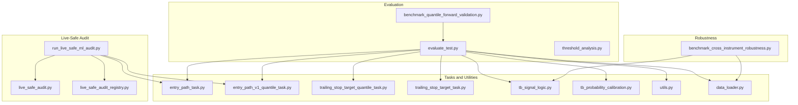
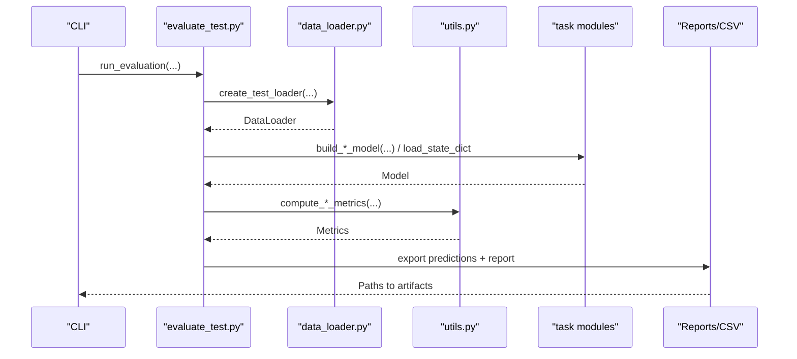
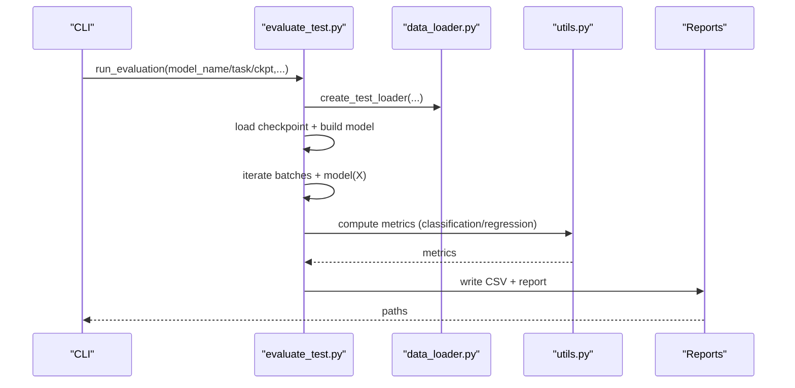
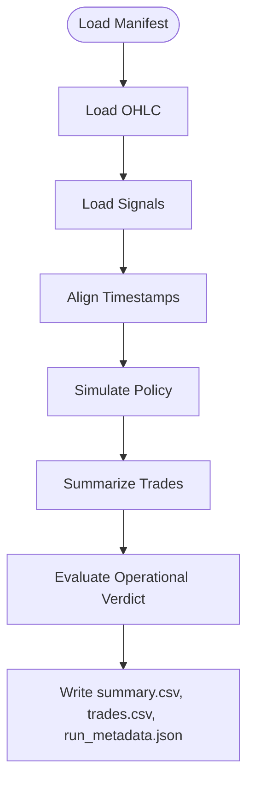
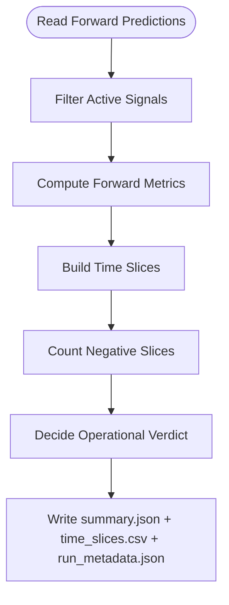
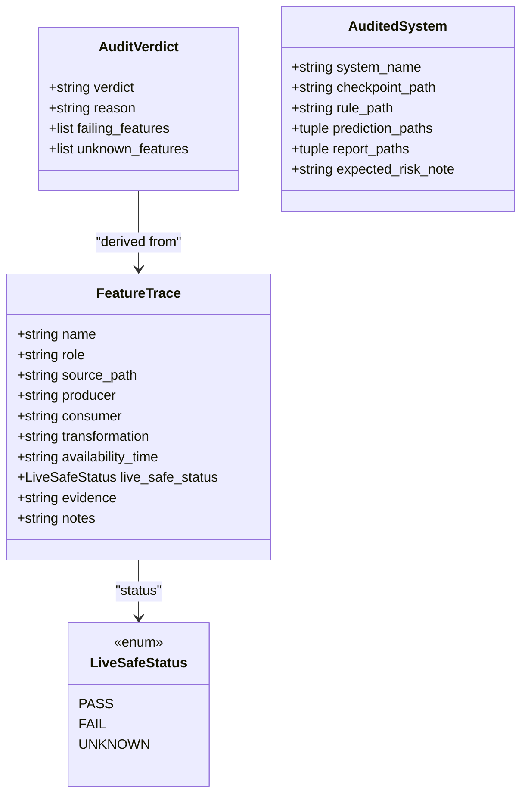
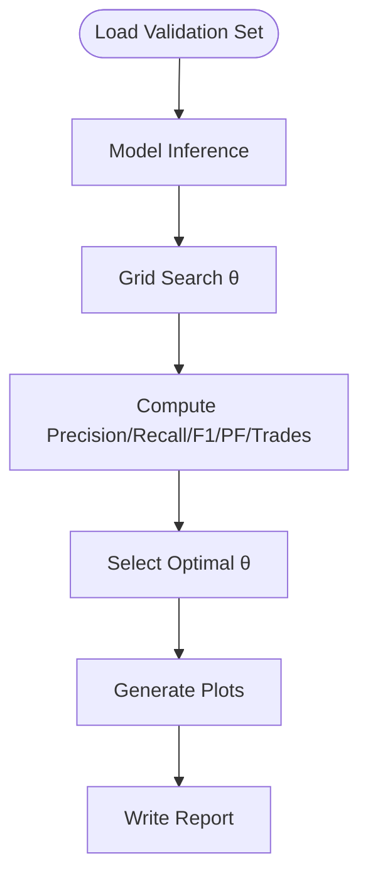
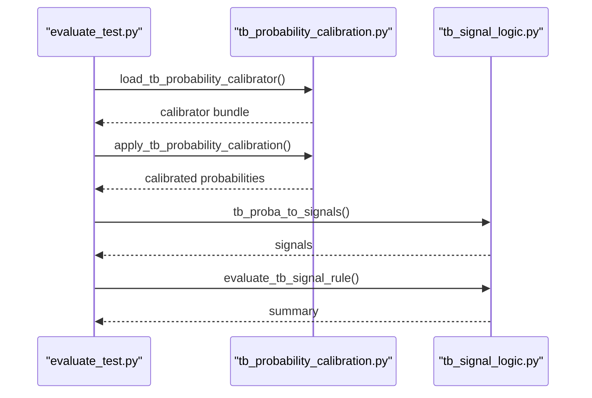
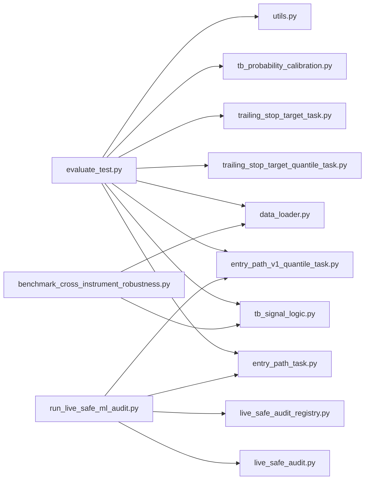

# Validation and Evaluation

<cite>
**Referenced Files in This Document**
- [benchmark_cross_instrument_robustness.py](file://ML/benchmark_cross_instrument_robustness.py)
- [benchmark_quantile_forward_validation.py](file://ML/benchmark_quantile_forward_validation.py)
- [evaluate_test.py](file://ML/evaluate_test.py)
- [threshold_analysis.py](file://ML/threshold_analysis.py)
- [live_safe_audit.py](file://ML/live_safe_audit.py)
- [live_safe_audit_registry.py](file://ML/live_safe_audit_registry.py)
- [run_live_safe_ml_audit.py](file://ML/run_live_safe_ml_audit.py)
- [entry_path_task.py](file://ML/entry_path_task.py)
- [entry_path_v1_quantile_task.py](file://ML/entry_path_v1_quantile_task.py)
- [trailing_stop_target_quantile_task.py](file://ML/trailing_stop_target_quantile_task.py)
- [trailing_stop_target_task.py](file://ML/trailing_stop_target_task.py)
- [tb_signal_logic.py](file://ML/tb_signal_logic.py)
- [tb_probability_calibration.py](file://ML/tb_probability_calibration.py)
- [utils.py](file://ML/utils.py)
- [data_loader.py](file://ML/data_loader.py)
- [README.md](file://ML/README.md)
</cite>

## Table of Contents
1. [Introduction](#introduction)
2. [Project Structure](#project-structure)
3. [Core Components](#core-components)
4. [Architecture Overview](#architecture-overview)
5. [Detailed Component Analysis](#detailed-component-analysis)
6. [Dependency Analysis](#dependency-analysis)
7. [Performance Considerations](#performance-considerations)
8. [Troubleshooting Guide](#troubleshooting-guide)
9. [Conclusion](#conclusion)
10. [Appendices](#appendices)

## Introduction
This document describes the validation and evaluation procedures implemented in the repository. It covers out-of-sample evaluation, cross-instrument robustness testing, time-series-aware forward validation, live-safe audits, and operational decision-making. It also outlines performance metrics for classification, regression, and quantile tasks, and provides guidance for statistical significance and confidence estimation.

## Project Structure
The validation and evaluation ecosystem centers around:
- Out-of-sample evaluation scripts for multiple tasks
- Cross-instrument robustness benchmarking
- Forward validation for quantile models
- Live-safe ML audit for production readiness
- Threshold analysis for converting predictions to signals
- Supporting utilities for metrics, data loading, and task-specific logic

**Diagram sources**
- [evaluate_test.py:154-800](file://ML/evaluate_test.py#L154-L800)
- [threshold_analysis.py:747-800](file://ML/threshold_analysis.py#L747-L800)
- [benchmark_quantile_forward_validation.py:104-160](file://ML/benchmark_quantile_forward_validation.py#L104-L160)
- [benchmark_cross_instrument_robustness.py:249-314](file://ML/benchmark_cross_instrument_robustness.py#L249-L314)
- [live_safe_audit.py:36-132](file://ML/live_safe_audit.py#L36-L132)
- [live_safe_audit_registry.py:16-82](file://ML/live_safe_audit_registry.py#L16-L82)
- [run_live_safe_ml_audit.py:138-209](file://ML/run_live_safe_ml_audit.py#L138-L209)
- [entry_path_task.py:1-200](file://ML/entry_path_task.py#L1-L200)
- [entry_path_v1_quantile_task.py:1-200](file://ML/entry_path_v1_quantile_task.py#L1-L200)
- [trailing_stop_target_quantile_task.py:1-200](file://ML/trailing_stop_target_quantile_task.py#L1-L200)
- [trailing_stop_target_task.py:1-200](file://ML/trailing_stop_target_task.py#L1-L200)
- [tb_signal_logic.py:1-200](file://ML/tb_signal_logic.py#L1-L200)
- [tb_probability_calibration.py:1-200](file://ML/tb_probability_calibration.py#L1-L200)
- [utils.py:1-200](file://ML/utils.py#L1-L200)
- [data_loader.py:1-200](file://ML/data_loader.py#L1-L200)

**Section sources**
- [README.md:1-200](file://ML/README.md#L1-L200)

## Core Components
- Out-of-sample evaluation pipeline: Loads checkpoints, runs inference, computes task-appropriate metrics, and generates reports and prediction CSVs for entry path, quantile, trailing stop targets, and outcome-aligned tasks.
- Cross-instrument robustness benchmark: Validates provider drift and cross-instrument transfer using frozen rules and OHLC alignment checks.
- Quantile forward validation: Computes forward performance metrics and time-sliced profitability to inform operational decisions.
- Live-safe ML audit: Classifies features by availability and timeliness, produces feature contracts, and derives operational verdicts for production readiness.
- Threshold analysis: Searches optimal thresholds for converting regression outputs into trading signals and visualizes trade-offs.

**Section sources**
- [evaluate_test.py:154-800](file://ML/evaluate_test.py#L154-L800)
- [benchmark_cross_instrument_robustness.py:249-314](file://ML/benchmark_cross_instrument_robustness.py#L249-L314)
- [benchmark_quantile_forward_validation.py:104-160](file://ML/benchmark_quantile_forward_validation.py#L104-L160)
- [live_safe_audit.py:36-132](file://ML/live_safe_audit.py#L36-L132)
- [run_live_safe_ml_audit.py:138-209](file://ML/run_live_safe_ml_audit.py#L138-L209)
- [threshold_analysis.py:747-800](file://ML/threshold_analysis.py#L747-L800)

## Architecture Overview
The evaluation stack integrates modular components:
- Task-specific loaders and exporters
- Metrics computation utilities
- Execution policy simulation for robustness
- Signal conversion and calibration for triple barrier tasks
- Audit registry and feature classification for production safety

**Diagram sources**
- [evaluate_test.py:154-800](file://ML/evaluate_test.py#L154-L800)
- [data_loader.py:1-200](file://ML/data_loader.py#L1-L200)
- [utils.py:1-200](file://ML/utils.py#L1-L200)

## Detailed Component Analysis

### Out-of-Sample Evaluation Pipeline
- Supports entry path, entry path quantile, trailing stop target quantile, trailing stop target, triple barrier, and outcome-aligned tasks.
- Loads checkpoints, constructs models, runs inference, computes metrics, and writes CSVs and Markdown reports.
- Uses frozen outcomes and thresholds where applicable to maintain consistency with prior winners.

**Diagram sources**
- [evaluate_test.py:154-800](file://ML/evaluate_test.py#L154-L800)
- [utils.py:1-200](file://ML/utils.py#L1-L200)
- [data_loader.py:1-200](file://ML/data_loader.py#L1-L200)

**Section sources**
- [evaluate_test.py:154-800](file://ML/evaluate_test.py#L154-L800)

### Cross-Instrument Robustness Benchmark
- Validates provider drift baselines and cross-instrument transfers using manifests that specify OHLC and signal CSV paths.
- Aligns timestamps between signals and OHLC, simulates execution policies, and computes performance metrics with operational verdicts.

**Diagram sources**
- [benchmark_cross_instrument_robustness.py:249-314](file://ML/benchmark_cross_instrument_robustness.py#L249-L314)

**Section sources**
- [benchmark_cross_instrument_robustness.py:71-314](file://ML/benchmark_cross_instrument_robustness.py#L71-L314)

### Quantile Forward Validation
- Computes forward metrics (trades, wins/losses, PF, win rate, mean PnL) and time-sliced performance.
- Applies operational verdicts based on historical PF, number of trades, and negative time slices.

**Diagram sources**
- [benchmark_quantile_forward_validation.py:104-160](file://ML/benchmark_quantile_forward_validation.py#L104-L160)

**Section sources**
- [benchmark_quantile_forward_validation.py:25-160](file://ML/benchmark_quantile_forward_validation.py#L25-L160)

### Live-Safe ML Audit
- Classifies features by availability and timeliness, aggregates into a feature contract, and derives PASS/FAIL/UNKNOWN verdicts.
- Produces artifact inventories, feature contracts, and operational guidance per audited system.

**Diagram sources**
- [live_safe_audit.py:14-132](file://ML/live_safe_audit.py#L14-L132)
- [live_safe_audit_registry.py:6-82](file://ML/live_safe_audit_registry.py#L6-L82)

**Section sources**
- [live_safe_audit.py:36-132](file://ML/live_safe_audit.py#L36-L132)
- [live_safe_audit_registry.py:16-82](file://ML/live_safe_audit_registry.py#L16-L82)
- [run_live_safe_ml_audit.py:138-209](file://ML/run_live_safe_ml_audit.py#L138-L209)

### Threshold Analysis for Signal Conversion
- Performs grid search over thresholds to maximize profit factor while meeting minimum precision/recall and trade counts.
- Generates visualizations and a comprehensive report for regression-to-signal conversion.

**Diagram sources**
- [threshold_analysis.py:747-800](file://ML/threshold_analysis.py#L747-L800)

**Section sources**
- [threshold_analysis.py:138-282](file://ML/threshold_analysis.py#L138-L282)

### Triple Barrier Evaluation and Calibration
- Calibrates predicted probabilities and evaluates per-target performance and signal rule outcomes.
- Integrates with frozen rule storage and probability calibrator artifacts.

**Diagram sources**
- [evaluate_test.py:560-646](file://ML/evaluate_test.py#L560-L646)
- [tb_probability_calibration.py:1-200](file://ML/tb_probability_calibration.py#L1-L200)
- [tb_signal_logic.py:1-200](file://ML/tb_signal_logic.py#L1-L200)

**Section sources**
- [evaluate_test.py:560-646](file://ML/evaluate_test.py#L560-L646)

## Dependency Analysis
Key dependencies and relationships:
- Evaluation pipeline depends on task modules for model construction and export frames, and on utilities for metrics.
- Robustness benchmark depends on execution policy simulation and OHLC alignment utilities.
- Live-safe audit depends on audited system registry and feature classification logic.
- Threshold analysis depends on model inference and signal logic utilities.

**Diagram sources**
- [evaluate_test.py:1-200](file://ML/evaluate_test.py#L1-L200)
- [entry_path_task.py:1-200](file://ML/entry_path_task.py#L1-L200)
- [entry_path_v1_quantile_task.py:1-200](file://ML/entry_path_v1_quantile_task.py#L1-L200)
- [trailing_stop_target_quantile_task.py:1-200](file://ML/trailing_stop_target_quantile_task.py#L1-L200)
- [trailing_stop_target_task.py:1-200](file://ML/trailing_stop_target_task.py#L1-L200)
- [tb_signal_logic.py:1-200](file://ML/tb_signal_logic.py#L1-L200)
- [tb_probability_calibration.py:1-200](file://ML/tb_probability_calibration.py#L1-L200)
- [utils.py:1-200](file://ML/utils.py#L1-L200)
- [data_loader.py:1-200](file://ML/data_loader.py#L1-L200)
- [benchmark_cross_instrument_robustness.py:1-200](file://ML/benchmark_cross_instrument_robustness.py#L1-L200)
- [run_live_safe_ml_audit.py:1-200](file://ML/run_live_safe_ml_audit.py#L1-L200)
- [live_safe_audit.py:1-200](file://ML/live_safe_audit.py#L1-L200)
- [live_safe_audit_registry.py:1-200](file://ML/live_safe_audit_registry.py#L1-L200)

**Section sources**
- [evaluate_test.py:1-200](file://ML/evaluate_test.py#L1-L200)
- [benchmark_cross_instrument_robustness.py:1-200](file://ML/benchmark_cross_instrument_robustness.py#L1-L200)
- [run_live_safe_ml_audit.py:1-200](file://ML/run_live_safe_ml_audit.py#L1-L200)

## Performance Considerations
- Prefer time-series-aware splits and forward validation for financial tasks to avoid leakage.
- Use quantile forward validation to detect regime shifts and time-dependent degradation.
- Apply live-safe feature classification to prevent future-derived inputs from entering production.
- Employ frozen rules and baseline references to ensure consistent, reproducible evaluation across instruments and providers.

## Troubleshooting Guide
Common issues and resolutions:
- Missing checkpoints or incorrect task names in evaluation: ensure checkpoint paths and task identifiers match expected suffixes and targets.
- Signal alignment failures in robustness benchmark: verify that signal timestamps exist in OHLC time domain.
- Low trade counts or unstable metrics: increase minimum trades thresholds or revisit feature engineering.
- Live-safe audit FAIL verdicts: remediate by replacing future-derived features or adding source/timing evidence; consult the preflight checklist referenced by the audit.

**Section sources**
- [evaluate_test.py:180-200](file://ML/evaluate_test.py#L180-L200)
- [benchmark_cross_instrument_robustness.py:244-247](file://ML/benchmark_cross_instrument_robustness.py#L244-L247)
- [live_safe_audit.py:36-54](file://ML/live_safe_audit.py#L36-L54)

## Conclusion
The repository provides a comprehensive validation toolkit tailored for trading applications: out-of-sample evaluation across multiple tasks, cross-instrument robustness, time-series forward validation, and live-safe audits. Together, these procedures enable reliable model deployment and ongoing monitoring in production.

## Appendices

### Performance Metrics by Task Type
- Binary classification (outcome-aligned tasks): AUC, precision, recall, F1, profit factor, win rate, coverage.
- Regression (return magnitude): MAE, RMSE, R2, Pearson r.
- Quantile regression (trailing stop target quantile): q50 Pearson r, MAE, interval coverage, median interval width, val_score.
- Triple barrier: per-target AUC, precision, recall, win rate, PF, dominant target.

**Section sources**
- [evaluate_test.py:508-766](file://ML/evaluate_test.py#L508-L766)
- [trailing_stop_target_quantile_task.py:1-200](file://ML/trailing_stop_target_quantile_task.py#L1-L200)
- [utils.py:1-200](file://ML/utils.py#L1-L200)

### Cross-Validation Strategies and Time-Series Validation
- Use time-sliced forward validation to assess stability across quarters and flag negative slices.
- For robustness, separate provider drift and cross-instrument transfer scenarios with frozen rules and OHLC alignment checks.

**Section sources**
- [benchmark_quantile_forward_validation.py:57-86](file://ML/benchmark_quantile_forward_validation.py#L57-L86)
- [benchmark_cross_instrument_robustness.py:224-247](file://ML/benchmark_cross_instrument_robustness.py#L224-L247)

### Statistical Significance and Confidence Intervals
- The repository emphasizes operational verdicts and time-sliced performance rather than parametric confidence intervals. For formal significance testing, extend evaluation to bootstrap-based estimates of key metrics and construct confidence intervals externally.

[No sources needed since this section provides general guidance]