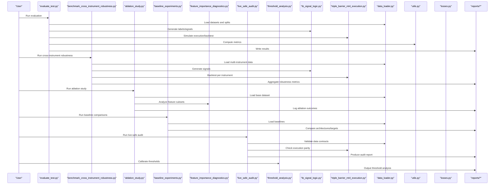
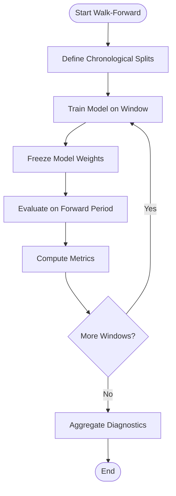
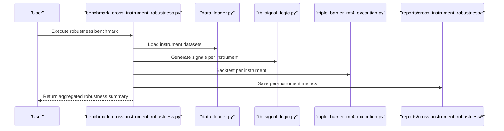
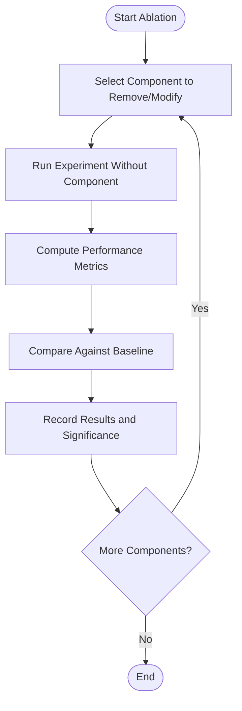
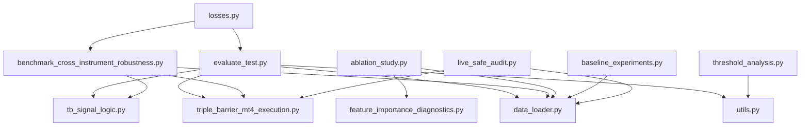

# Evaluation Methodologies

<cite>
**Referenced Files in This Document**
- [benchmark_cross_instrument_robustness.py](file://ML/benchmark_cross_instrument_robustness.py)
- [ablation_study.py](file://ML/ablation_study.py)
- [evaluate_test.py](file://ML/evaluate_test.py)
- [baseline_experiments.py](file://ML/baseline_experiments.py)
- [feature_importance_diagnostics.py](file://ML/feature_importance_diagnostics.py)
- [live_safe_audit.py](file://ML/live_safe_audit.py)
- [validation_freeze.py](file://ML/validation_freeze.py)
- [threshold_analysis.py](file://ML/threshold_analysis.py)
- [tb_signal_logic.py](file://ML/tb_signal_logic.py)
- [triple_barrier_mt4_execution.py](file://ML/triple_barrier_mt4_execution.py)
- [data_loader.py](file://ML/data_loader.py)
- [losses.py](file://ML/losses.py)
- [utils.py](file://ML/utils.py)
- [run_entry_path_live_safe_retrain.py](file://ML/run_entry_path_live_safe_retrain.py)
- [run_entry_path_quantile_live_safe_retrain.py](file://ML/run_entry_path_quantile_live_safe_retrain.py)
- [run_live_safe_ml_audit.py](file://ML/run_live_safe_ml_audit.py)
- [stage10_frozen_test_oos.py](file://ML/stage10_frozen_test_oos.py)
- [diagnose_walk_forward.py](file://ML/baseline/diagnose_walk_forward.py)
- [walk_forward_diagnostics.json](file://ML/reports/walk_forward_diagnostics.json)
- [reproducibility_report_12H.md](file://ML/reports/reproducibility_report_12H.md)
- [architecture_comparison_classification.md](file://ML/reports/architecture_comparison_classification.md)
- [architecture_comparison_regression.md](file://ML/reports/architecture_comparison_regression.md)
- [architecture_comparison_regression_updn.md](file://ML/reports/architecture_comparison_regression_updn.md)
- [entry_path_trade_filter_report.md](file://ML/reports/entry_path_trade_filter_report.md)
- [evaluate_validation_entry_path_v1.md](file://ML/reports/evaluate_validation_entry_path_v1.md)
- [evaluate_test_entry_path_v1.md](file://ML/reports/evaluate_test_entry_path_v1.md)
- [evaluate_test_entry_path_v1_features_baseline_clean.md](file://ML/reports/evaluate_test_entry_path_v1_features_baseline_clean.md)
- [evaluate_test_entry_path_v1_quantile.md](file://ML/reports/evaluate_test_entry_path_v1_quantile.md)
- [evaluate_test_take_skip_trailing_stop_v1.md](file://ML/reports/evaluate_test_take_skip_trailing_stop_v1.md)
- [evaluate_test_take_skip_trailing_stop_v2.md](file://ML/reports/evaluate_test_take_skip_trailing_stop_v2.md)
- [evaluate_test_tb.md](file://ML/reports/evaluate_test_tb.md)
- [evaluate_test_trailing_stop_target_quantile_v1.md](file://ML/reports/evaluate_test_trailing_stop_target_quantile_v1.md)
- [evaluate_test_trailing_stop_target_v1.md](file://ML/reports/evaluate_test_trailing_stop_target_v1.md)
- [outcome_target_validation_benchmark.md](file://ML/reports/outcome_target_validation_benchmark.md)
- [threshold_analysis_12H.md](file://ML/reports/threshold_analysis_12H.md)
- [threshold_analysis_24H.md](file://ML/reports/threshold_analysis_24H.md)
- [threshold_analysis_48H.md](file://ML/reports/threshold_analysis_48H.md)
- [threshold_analysis_tb.md](file://ML/reports/threshold_analysis_tb.md)
</cite>

## Table of Contents
1. [Introduction](#introduction)
2. [Project Structure](#project-structure)
3. [Core Components](#core-components)
4. [Architecture Overview](#architecture-overview)
5. [Detailed Component Analysis](#detailed-component-analysis)
6. [Dependency Analysis](#dependency-analysis)
7. [Performance Considerations](#performance-considerations)
8. [Troubleshooting Guide](#troubleshooting-guide)
9. [Conclusion](#conclusion)
10. [Appendices](#appendices)

## Introduction
This document explains the evaluation methodologies used across the SoSimple ML pipeline, with a focus on:
- Walk-forward validation framework for time-series robustness
- Cross-instrument robustness testing to ensure generalization across assets
- Ablation study procedures to isolate feature and model contributions
- Trading signal performance metrics (directional accuracy, profit factor, Sharpe ratio, drawdown analysis)
- Baseline comparison framework, feature importance analysis, and live-safe audit procedures
- Examples of evaluation scripts, result interpretation, and statistical significance testing
- Reproducibility practices, seed management, and version control for experimental results

The goal is to provide both technical depth and accessible guidance for researchers and engineers running experiments, interpreting results, and preparing models for live deployment.

## Project Structure
Evaluation-related code and reports are primarily located under ML/, with supporting data processing and statistics modules. Key directories and files include:
- ML/: benchmarking, ablation, evaluation, live-safe audits, diagnostics, and reports
- ML/reports/: structured markdown and JSON artifacts summarizing experiments and validations
- ML/models/: model definitions used by benchmarks and evaluations
- ML/checkpoints/: serialized model artifacts and result summaries
- tests/: unit and integration tests validating evaluation logic and pipelines

```mermaid
graph TB
subgraph "ML"
A["benchmark_cross_instrument_robustness.py"]
B["ablation_study.py"]
C["evaluate_test.py"]
D["baseline_experiments.py"]
E["feature_importance_diagnostics.py"]
F["live_safe_audit.py"]
G["validation_freeze.py"]
H["threshold_analysis.py"]
I["tb_signal_logic.py"]
J["triple_barrier_mt4_execution.py"]
K["data_loader.py"]
L["losses.py"]
M["utils.py"]
N["run_entry_path_live_safe_retrain.py"]
O["run_entry_path_quantile_live_safe_retrain.py"]
P["run_live_safe_ml_audit.py"]
Q["stage10_frozen_test_oos.py"]
R["diagnose_walk_forward.py"]
end
subgraph "Reports"
S["walk_forward_diagnostics.json"]
T["reproducibility_report_12H.md"]
U["architecture_comparison_classification.md"]
V["architecture_comparison_regression.md"]
W["architecture_comparison_regression_updn.md"]
X["entry_path_trade_filter_report.md"]
Y["evaluate_validation_entry_path_v1.md"]
Z["evaluate_test_entry_path_v1.md"]
AA["evaluate_test_entry_path_v1_features_baseline_clean.md"]
AB["evaluate_test_entry_path_v1_quantile.md"]
AC["evaluate_test_take_skip_trailing_stop_v1.md"]
AD["evaluate_test_take_skip_trailing_stop_v2.md"]
AE["evaluate_test_tb.md"]
AF["evaluate_test_trailing_stop_target_quantile_v1.md"]
AG["evaluate_test_trailing_stop_target_v1.md"]
AH["outcome_target_validation_benchmark.md"]
AI["threshold_analysis_12H.md"]
AJ["threshold_analysis_24H.md"]
AK["threshold_analysis_48H.md"]
AL["threshold_analysis_tb.md"]
end
A --> S
B --> S
C --> S
D --> S
E --> S
F --> S
G --> S
H --> S
I --> S
J --> S
K --> S
L --> S
M --> S
N --> S
O --> S
P --> S
Q --> S
R --> S
```

**Diagram sources**
- [benchmark_cross_instrument_robustness.py](file://ML/benchmark_cross_instrument_robustness.py)
- [ablation_study.py](file://ML/ablation_study.py)
- [evaluate_test.py](file://ML/evaluate_test.py)
- [baseline_experiments.py](file://ML/baseline_experiments.py)
- [feature_importance_diagnostics.py](file://ML/feature_importance_diagnostics.py)
- [live_safe_audit.py](file://ML/live_safe_audit.py)
- [validation_freeze.py](file://ML/validation_freeze.py)
- [threshold_analysis.py](file://ML/threshold_analysis.py)
- [tb_signal_logic.py](file://ML/tb_signal_logic.py)
- [triple_barrier_mt4_execution.py](file://ML/triple_barrier_mt4_execution.py)
- [data_loader.py](file://ML/data_loader.py)
- [losses.py](file://ML/losses.py)
- [utils.py](file://ML/utils.py)
- [run_entry_path_live_safe_retrain.py](file://ML/run_entry_path_live_safe_retrain.py)
- [run_entry_path_quantile_live_safe_retrain.py](file://ML/run_entry_path_quantile_live_safe_retrain.py)
- [run_live_safe_ml_audit.py](file://ML/run_live_safe_ml_audit.py)
- [stage10_frozen_test_oos.py](file://ML/stage10_frozen_test_oos.py)
- [diagnose_walk_forward.py](file://ML/baseline/diagnose_walk_forward.py)
- [walk_forward_diagnostics.json](file://ML/reports/walk_forward_diagnostics.json)

**Section sources**
- [benchmark_cross_instrument_robustness.py](file://ML/benchmark_cross_instrument_robustness.py)
- [ablation_study.py](file://ML/ablation_study.py)
- [evaluate_test.py](file://ML/evaluate_test.py)
- [baseline_experiments.py](file://ML/baseline_experiments.py)
- [feature_importance_diagnostics.py](file://ML/feature_importance_diagnostics.py)
- [live_safe_audit.py](file://ML/live_safe_audit.py)
- [validation_freeze.py](file://ML/validation_freeze.py)
- [threshold_analysis.py](file://ML/threshold_analysis.py)
- [tb_signal_logic.py](file://ML/tb_signal_logic.py)
- [triple_barrier_mt4_execution.py](file://ML/triple_barrier_mt4_execution.py)
- [data_loader.py](file://ML/data_loader.py)
- [losses.py](file://ML/losses.py)
- [utils.py](file://ML/utils.py)
- [run_entry_path_live_safe_retrain.py](file://ML/run_entry_path_live_safe_retrain.py)
- [run_entry_path_quantile_live_safe_retrain.py](file://ML/run_entry_path_quantile_live_safe_retrain.py)
- [run_live_safe_ml_audit.py](file://ML/run_live_safe_ml_audit.py)
- [stage10_frozen_test_oos.py](file://ML/stage10_frozen_test_oos.py)
- [diagnose_walk_forward.py](file://ML/baseline/diagnose_walk_forward.py)
- [walk_forward_diagnostics.json](file://ML/reports/walk_forward_diagnostics.json)

## Core Components
- Walk-forward validation: Implemented via dedicated diagnostic and frozen test routines that simulate rolling training windows and out-of-sample testing. See [diagnose_walk_forward.py](file://ML/baseline/diagnose_walk_forward.py) and [stage10_frozen_test_oos.py](file://ML/stage10_frozen_test_oos.py).
- Cross-instrument robustness: Benchmark script evaluates model stability across multiple instruments and configurations. See [benchmark_cross_instrument_robustness.py](file://ML/benchmark_cross_instrument_robustness.py).
- Ablation studies: Systematic removal or modification of features/components to quantify impact. See [ablation_study.py](file://ML/ablation_study.py).
- Evaluation harness: Unified entry point for evaluating signals and models against standardized metrics. See [evaluate_test.py](file://ML/evaluate_test.py).
- Baseline comparisons: Reference strategies and architectures for fair benchmarking. See [baseline_experiments.py](file://ML/baseline_experiments.py).
- Feature importance diagnostics: Tools to analyze which features drive predictions and performance. See [feature_importance_diagnostics.py](file://ML/feature_importance_diagnostics.py).
- Live-safe audits: Pre-deployment checks ensuring operational safety and consistency with live environments. See [live_safe_audit.py](file://ML/live_safe_audit.py), [run_live_safe_ml_audit.py](file://ML/run_live_safe_ml_audit.py), [run_entry_path_live_safe_retrain.py](file://ML/run_entry_path_live_safe_retrain.py), [run_entry_path_quantile_live_safe_retrain.py](file://ML/run_entry_path_quantile_live_safe_retrain.py).
- Threshold analysis: Calibration and sensitivity analysis for decision thresholds. See [threshold_analysis.py](file://ML/threshold_analysis.py).
- Signal logic and execution: Triple barrier labeling and MT4 execution simulation for realistic backtesting. See [tb_signal_logic.py](file://ML/tb_signal_logic.py), [triple_barrier_mt4_execution.py](file://ML/triple_barrier_mt4_execution.py).
- Data and utilities: Data loading, loss functions, and shared utilities powering evaluations. See [data_loader.py](file://ML/data_loader.py), [losses.py](file://ML/losses.py), [utils.py](file://ML/utils.py).

**Section sources**
- [diagnose_walk_forward.py](file://ML/baseline/diagnose_walk_forward.py)
- [stage10_frozen_test_oos.py](file://ML/stage10_frozen_test_oos.py)
- [benchmark_cross_instrument_robustness.py](file://ML/benchmark_cross_instrument_robustness.py)
- [ablation_study.py](file://ML/ablation_study.py)
- [evaluate_test.py](file://ML/evaluate_test.py)
- [baseline_experiments.py](file://ML/baseline_experiments.py)
- [feature_importance_diagnostics.py](file://ML/feature_importance_diagnostics.py)
- [live_safe_audit.py](file://ML/live_safe_audit.py)
- [run_live_safe_ml_audit.py](file://ML/run_live_safe_ml_audit.py)
- [run_entry_path_live_safe_retrain.py](file://ML/run_entry_path_live_safe_retrain.py)
- [run_entry_path_quantile_live_safe_retrain.py](file://ML/run_entry_path_quantile_live_safe_retrain.py)
- [threshold_analysis.py](file://ML/threshold_analysis.py)
- [tb_signal_logic.py](file://ML/tb_signal_logic.py)
- [triple_barrier_mt4_execution.py](file://ML/triple_barrier_mt4_execution.py)
- [data_loader.py](file://ML/data_loader.py)
- [losses.py](file://ML/losses.py)
- [utils.py](file://ML/utils.py)

## Architecture Overview
The evaluation architecture integrates data preparation, modeling, signal generation, and reporting into a cohesive pipeline. The following diagram maps key components and their interactions during an evaluation run.

**Diagram sources**
- [evaluate_test.py](file://ML/evaluate_test.py)
- [benchmark_cross_instrument_robustness.py](file://ML/benchmark_cross_instrument_robustness.py)
- [ablation_study.py](file://ML/ablation_study.py)
- [baseline_experiments.py](file://ML/baseline_experiments.py)
- [feature_importance_diagnostics.py](file://ML/feature_importance_diagnostics.py)
- [live_safe_audit.py](file://ML/live_safe_audit.py)
- [threshold_analysis.py](file://ML/threshold_analysis.py)
- [tb_signal_logic.py](file://ML/tb_signal_logic.py)
- [triple_barrier_mt4_execution.py](file://ML/triple_barrier_mt4_execution.py)
- [data_loader.py](file://ML/data_loader.py)
- [utils.py](file://ML/utils.py)
- [losses.py](file://ML/losses.py)

## Detailed Component Analysis

### Walk-Forward Validation Framework
Walk-forward validation simulates rolling training windows and out-of-sample testing to assess temporal robustness and prevent look-ahead bias. It involves:
- Defining train/validation/test splits that respect chronological order
- Retraining or refreezing models at each window boundary
- Evaluating metrics on forward periods to detect overfitting and regime shifts
- Aggregating diagnostics across windows to identify instability

**Diagram sources**
- [diagnose_walk_forward.py](file://ML/baseline/diagnose_walk_forward.py)
- [stage10_frozen_test_oos.py](file://ML/stage10_frozen_test_oos.py)
- [walk_forward_diagnostics.json](file://ML/reports/walk_forward_diagnostics.json)

**Section sources**
- [diagnose_walk_forward.py](file://ML/baseline/diagnose_walk_forward.py)
- [stage10_frozen_test_oos.py](file://ML/stage10_frozen_test_oos.py)
- [walk_forward_diagnostics.json](file://ML/reports/walk_forward_diagnostics.json)

### Cross-Instrument Robustness Testing
Cross-instrument robustness ensures that models generalize across different assets and market regimes. The process includes:
- Running the same evaluation pipeline across multiple instruments
- Comparing performance distributions to detect asset-specific biases
- Identifying features or targets that do not transfer well
- Reporting aggregated metrics and variance across instruments

**Diagram sources**
- [benchmark_cross_instrument_robustness.py](file://ML/benchmark_cross_instrument_robustness.py)
- [data_loader.py](file://ML/data_loader.py)
- [tb_signal_logic.py](file://ML/tb_signal_logic.py)
- [triple_barrier_mt4_execution.py](file://ML/triple_barrier_mt4_execution.py)

**Section sources**
- [benchmark_cross_instrument_robustness.py](file://ML/benchmark_cross_instrument_robustness.py)

### Ablation Study Procedures
Ablation studies systematically remove or modify components to measure their contribution:
- Feature ablation: Remove individual features or groups to assess impact
- Target ablation: Change target definitions to evaluate label sensitivity
- Model ablation: Simplify architectures or loss functions to isolate effects
- Reporting: Track metric changes and statistical significance across ablations

**Diagram sources**
- [ablation_study.py](file://ML/ablation_study.py)

**Section sources**
- [ablation_study.py](file://ML/ablation_study.py)

### Performance Metrics for Trading Signals
Key metrics used to evaluate trading signals include:
- Directional accuracy: Proportion of correctly predicted directions
- Profit factor: Ratio of gross profits to gross losses
- Sharpe ratio: Risk-adjusted return metric based on mean and volatility
- Drawdown analysis: Maximum peak-to-trough decline and recovery characteristics

These metrics are computed using standardized routines and reported in structured formats for comparison and auditing.

**Section sources**
- [evaluate_test.py](file://ML/evaluate_test.py)
- [tb_signal_logic.py](file://ML/tb_signal_logic.py)
- [triple_barrier_mt4_execution.py](file://ML/triple_barrier_mt4_execution.py)

### Baseline Comparison Framework
Baseline comparisons establish reference points for evaluating new models and features:
- Implement simple heuristics and established strategies as baselines
- Use consistent data splits, preprocessing, and evaluation metrics
- Compare performance across architectures and targets
- Document findings in comparative reports

**Section sources**
- [baseline_experiments.py](file://ML/baseline_experiments.py)
- [architecture_comparison_classification.md](file://ML/reports/architecture_comparison_classification.md)
- [architecture_comparison_regression.md](file://ML/reports/architecture_comparison_regression.md)
- [architecture_comparison_regression_updn.md](file://ML/reports/architecture_comparison_regression_updn.md)

### Feature Importance Analysis
Feature importance diagnostics help interpret model behavior and guide feature engineering:
- Compute importance scores using permutation, SHAP, or model-specific methods
- Rank features by contribution to predictive performance
- Identify redundant or noisy features for pruning
- Visualize and report top contributors across datasets

**Section sources**
- [feature_importance_diagnostics.py](file://ML/feature_importance_diagnostics.py)

### Live-Safe Audit Procedures
Live-safe audits ensure models are safe and reliable for deployment:
- Validate data contracts and input schemas
- Check execution parity between offline and simulated live environments
- Verify retraining pipelines produce consistent outputs
- Produce comprehensive audit reports with pass/fail criteria

**Section sources**
- [live_safe_audit.py](file://ML/live_safe_audit.py)
- [run_live_safe_ml_audit.py](file://ML/run_live_safe_ml_audit.py)
- [run_entry_path_live_safe_retrain.py](file://ML/run_entry_path_live_safe_retrain.py)
- [run_entry_path_quantile_live_safe_retrain.py](file://ML/run_entry_path_quantile_live_safe_retrain.py)

### Threshold Analysis and Calibration
Threshold analysis calibrates decision boundaries for optimal performance:
- Sweep thresholds across validation sets
- Evaluate trade-offs between precision, recall, and risk metrics
- Select thresholds that balance profitability and drawdown constraints
- Report calibration curves and recommended operating points

**Section sources**
- [threshold_analysis.py](file://ML/threshold_analysis.py)
- [threshold_analysis_12H.md](file://ML/reports/threshold_analysis_12H.md)
- [threshold_analysis_24H.md](file://ML/reports/threshold_analysis_24H.md)
- [threshold_analysis_48H.md](file://ML/reports/threshold_analysis_48H.md)
- [threshold_analysis_tb.md](file://ML/reports/threshold_analysis_tb.md)

## Dependency Analysis
The evaluation pipeline depends on several core modules for data handling, signal generation, and metric computation. Understanding these dependencies helps diagnose issues and optimize performance.

**Diagram sources**
- [evaluate_test.py](file://ML/evaluate_test.py)
- [benchmark_cross_instrument_robustness.py](file://ML/benchmark_cross_instrument_robustness.py)
- [ablation_study.py](file://ML/ablation_study.py)
- [baseline_experiments.py](file://ML/baseline_experiments.py)
- [feature_importance_diagnostics.py](file://ML/feature_importance_diagnostics.py)
- [live_safe_audit.py](file://ML/live_safe_audit.py)
- [threshold_analysis.py](file://ML/threshold_analysis.py)
- [data_loader.py](file://ML/data_loader.py)
- [tb_signal_logic.py](file://ML/tb_signal_logic.py)
- [triple_barrier_mt4_execution.py](file://ML/triple_barrier_mt4_execution.py)
- [utils.py](file://ML/utils.py)
- [losses.py](file://ML/losses.py)

**Section sources**
- [evaluate_test.py](file://ML/evaluate_test.py)
- [benchmark_cross_instrument_robustness.py](file://ML/benchmark_cross_instrument_robustness.py)
- [ablation_study.py](file://ML/ablation_study.py)
- [baseline_experiments.py](file://ML/baseline_experiments.py)
- [feature_importance_diagnostics.py](file://ML/feature_importance_diagnostics.py)
- [live_safe_audit.py](file://ML/live_safe_audit.py)
- [threshold_analysis.py](file://ML/threshold_analysis.py)
- [data_loader.py](file://ML/data_loader.py)
- [tb_signal_logic.py](file://ML/tb_signal_logic.py)
- [triple_barrier_mt4_execution.py](file://ML/triple_barrier_mt4_execution.py)
- [utils.py](file://ML/utils.py)
- [losses.py](file://ML/losses.py)

## Performance Considerations
- Use efficient data loaders to minimize I/O bottlenecks during walk-forward and cross-instrument runs
- Cache intermediate results where possible to avoid recomputation
- Parallelize independent instrument evaluations to reduce wall-clock time
- Monitor memory usage during large-scale ablation studies
- Optimize threshold sweeps by limiting search space based on prior calibration

[No sources needed since this section provides general guidance]

## Troubleshooting Guide
Common issues and resolutions:
- Data contract mismatches: Ensure input schemas match expected formats; use live-safe audit to validate
- Execution parity failures: Reconcile offline and live execution paths; check slippage and cost assumptions
- Overfitting detection: Review walk-forward diagnostics for declining out-of-sample performance
- Threshold instability: Re-run threshold analysis with expanded ranges and stricter constraints
- Reproducibility problems: Verify seed management and environment versions; consult reproducibility reports

**Section sources**
- [live_safe_audit.py](file://ML/live_safe_audit.py)
- [run_live_safe_ml_audit.py](file://ML/run_live_safe_ml_audit.py)
- [walk_forward_diagnostics.json](file://ML/reports/walk_forward_diagnostics.json)
- [reproducibility_report_12H.md](file://ML/reports/reproducibility_report_12H.md)

## Conclusion
The SoSimple ML pipeline implements a rigorous evaluation methodology encompassing walk-forward validation, cross-instrument robustness testing, and ablation studies. Standardized metrics such as directional accuracy, profit factor, Sharpe ratio, and drawdown analysis enable consistent comparison across models and strategies. Baseline frameworks, feature importance diagnostics, and live-safe audits ensure fairness, interpretability, and operational readiness. By adhering to reproducibility practices, seed management, and version control, researchers can confidently iterate on models and deploy them with confidence.

[No sources needed since this section summarizes without analyzing specific files]

## Appendices

### Example Evaluation Scripts
- Walk-forward diagnostics: [diagnose_walk_forward.py](file://ML/baseline/diagnose_walk_forward.py)
- Cross-instrument robustness: [benchmark_cross_instrument_robustness.py](file://ML/benchmark_cross_instrument_robustness.py)
- Ablation studies: [ablation_study.py](file://ML/ablation_study.py)
- Baseline comparisons: [baseline_experiments.py](file://ML/baseline_experiments.py)
- Feature importance: [feature_importance_diagnostics.py](file://ML/feature_importance_diagnostics.py)
- Live-safe audits: [live_safe_audit.py](file://ML/live_safe_audit.py), [run_live_safe_ml_audit.py](file://ML/run_live_safe_ml_audit.py)
- Threshold analysis: [threshold_analysis.py](file://ML/threshold_analysis.py)

**Section sources**
- [diagnose_walk_forward.py](file://ML/baseline/diagnose_walk_forward.py)
- [benchmark_cross_instrument_robustness.py](file://ML/benchmark_cross_instrument_robustness.py)
- [ablation_study.py](file://ML/ablation_study.py)
- [baseline_experiments.py](file://ML/baseline_experiments.py)
- [feature_importance_diagnostics.py](file://ML/feature_importance_diagnostics.py)
- [live_safe_audit.py](file://ML/live_safe_audit.py)
- [run_live_safe_ml_audit.py](file://ML/run_live_safe_ml_audit.py)
- [threshold_analysis.py](file://ML/threshold_analysis.py)

### Result Interpretation Guides
- Entry path validation and testing reports: [evaluate_validation_entry_path_v1.md](file://ML/reports/evaluate_validation_entry_path_v1.md), [evaluate_test_entry_path_v1.md](file://ML/reports/evaluate_test_entry_path_v1.md)
- Baseline clean features: [evaluate_test_entry_path_v1_features_baseline_clean.md](file://ML/reports/evaluate_test_entry_path_v1_features_baseline_clean.md)
- Quantile-based approaches: [evaluate_test_entry_path_v1_quantile.md](file://ML/reports/evaluate_test_entry_path_v1_quantile.md)
- Take-skip strategies: [evaluate_test_take_skip_trailing_stop_v1.md](file://ML/reports/evaluate_test_take_skip_trailing_stop_v1.md), [evaluate_test_take_skip_trailing_stop_v2.md](file://ML/reports/evaluate_test_take_skip_trailing_stop_v2.md)
- Triple barrier and trailing stop targets: [evaluate_test_tb.md](file://ML/reports/evaluate_test_tb.md), [evaluate_test_trailing_stop_target_quantile_v1.md](file://ML/reports/evaluate_test_trailing_stop_target_quantile_v1.md), [evaluate_test_trailing_stop_target_v1.md](file://ML/reports/evaluate_test_trailing_stop_target_v1.md)
- Outcome target validation: [outcome_target_validation_benchmark.md](file://ML/reports/outcome_target_validation_benchmark.md)

**Section sources**
- [evaluate_validation_entry_path_v1.md](file://ML/reports/evaluate_validation_entry_path_v1.md)
- [evaluate_test_entry_path_v1.md](file://ML/reports/evaluate_test_entry_path_v1.md)
- [evaluate_test_entry_path_v1_features_baseline_clean.md](file://ML/reports/evaluate_test_entry_path_v1_features_baseline_clean.md)
- [evaluate_test_entry_path_v1_quantile.md](file://ML/reports/evaluate_test_entry_path_v1_quantile.md)
- [evaluate_test_take_skip_trailing_stop_v1.md](file://ML/reports/evaluate_test_take_skip_trailing_stop_v1.md)
- [evaluate_test_take_skip_trailing_stop_v2.md](file://ML/reports/evaluate_test_take_skip_trailing_stop_v2.md)
- [evaluate_test_tb.md](file://ML/reports/evaluate_test_tb.md)
- [evaluate_test_trailing_stop_target_quantile_v1.md](file://ML/reports/evaluate_test_trailing_stop_target_quantile_v1.md)
- [evaluate_test_trailing_stop_target_v1.md](file://ML/reports/evaluate_test_trailing_stop_target_v1.md)
- [outcome_target_validation_benchmark.md](file://ML/reports/outcome_target_validation_benchmark.md)

### Statistical Significance Testing
- Use paired tests across instruments and time windows to assess metric differences
- Apply corrections for multiple comparisons when evaluating many features or thresholds
- Report confidence intervals and p-values alongside point estimates
- Leverage walk-forward diagnostics to detect non-stationarity affecting significance

[No sources needed since this section provides general guidance]

### Reproducibility Practices
- Fix random seeds across data loaders, model initializations, and sampling routines
- Version-control all configuration files and hyperparameters
- Archive datasets, splits, and intermediate artifacts with checksums
- Maintain detailed logs and reports for each experiment run

**Section sources**
- [reproducibility_report_12H.md](file://ML/reports/reproducibility_report_12H.md)

### Version Control for Experimental Results
- Tag commits corresponding to major evaluation milestones
- Store results in structured directories with clear naming conventions
- Include metadata files describing run parameters and environment
- Use reports to summarize findings and decisions for future iterations

[No sources needed since this section provides general guidance]