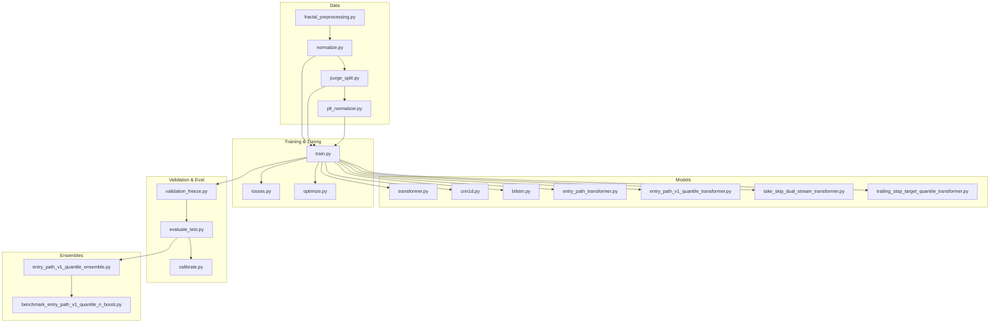
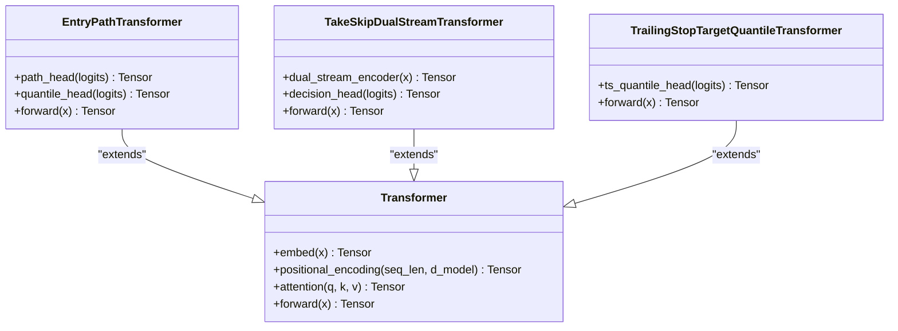
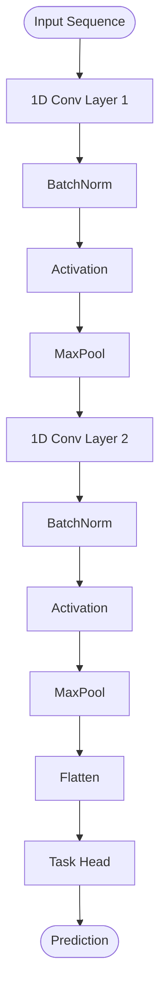
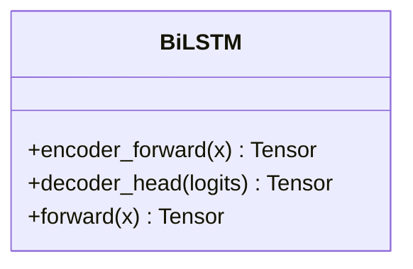
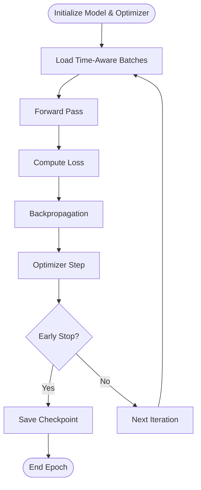
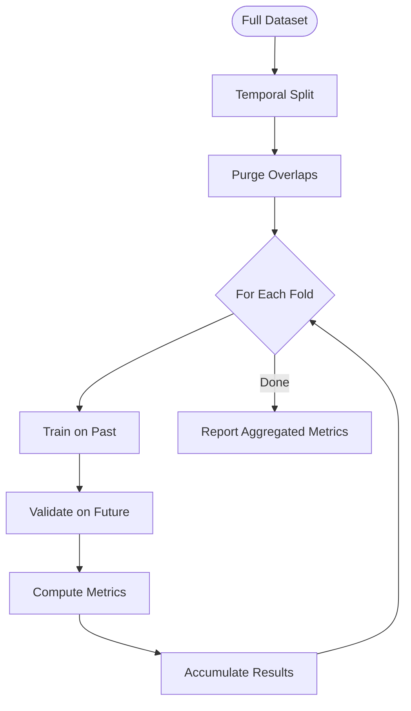
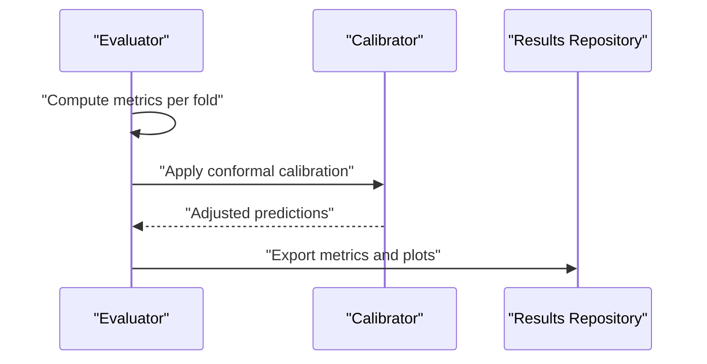
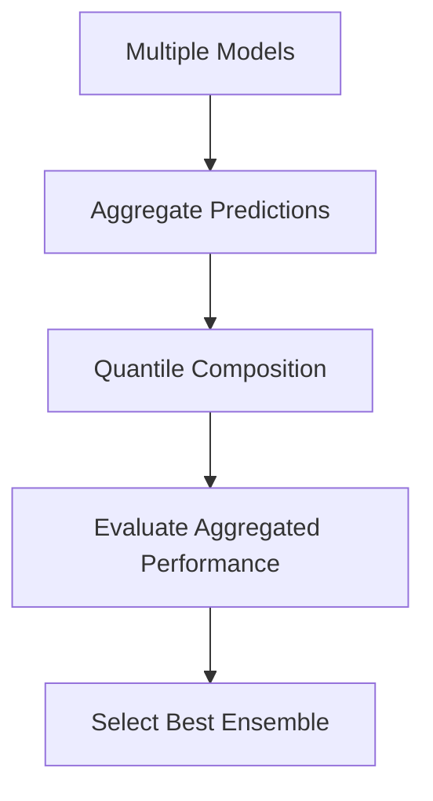
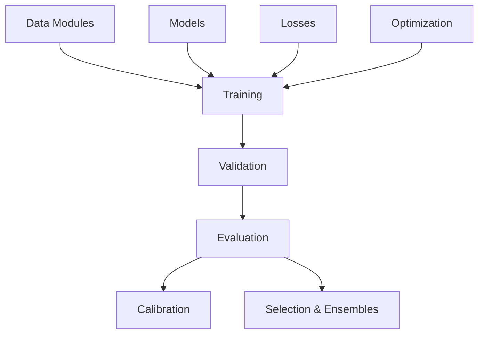

# Machine Learning Pipeline

<cite>
**Referenced Files in This Document**
- [ML/train.py](file://ML/train.py)
- [ML/losses.py](file://ML/losses.py)
- [ML/optimize.py](file://ML/optimize.py)
- [ML/data_loader.py](file://ML/data_loader.py)
- [ML/utils.py](file://ML/utils.py)
- [ML/models/__init__.py](file://ML/models/__init__.py)
- [ML/models/transformer.py](file://ML/models/transformer.py)
- [ML/models/cnn1d.py](file://ML/models/cnn1d.py)
- [ML/models/bilstm.py](file://ML/models/bilstm.py)
- [ML/models/entry_path_transformer.py](file://ML/models/entry_path_transformer.py)
- [ML/models/entry_path_v1_quantile_transformer.py](file://ML/models/entry_path_v1_quantile_transformer.py)
- [ML/models/take_skip_dual_stream_transformer.py](file://ML/models/take_skip_dual_stream_transformer.py)
- [ML/models/trailing_stop_target_quantile_transformer.py](file://ML/models/trailing_stop_target_quantile_transformer.py)
- [ML/benchmark_entry_path_v1_quantile_n_boost.py](file://ML/benchmark_entry_path_v1_quantile_n_boost.py)
- [ML/entry_path_v1_quantile_ensemble.py](file://ML/entry_path_v1_quantile_ensemble.py)
- [ML/validation_freeze.py](file://ML/validation_freeze.py)
- [ML/evaluate_test.py](file://ML/evaluate_test.py)
- [ML/conformal/calibrate.py](file://ML/conformal/calibrate.py)
- [processing/purge_split.py](file://processing/purge_split.py)
- [processing/normalize.py](file://processing/normalize.py)
- [processing/fractal_preprocessing.py](file://processing/fractal_preprocessing.py)
- [ML/pll_normalizer.py](file://ML/pll_normalizer.py)
</cite>

## Table of Contents
1. [Introduction](#introduction)
2. [Project Structure](#project-structure)
3. [Core Components](#core-components)
4. [Architecture Overview](#architecture-overview)
5. [Detailed Component Analysis](#detailed-component-analysis)
6. [Dependency Analysis](#dependency-analysis)
7. [Performance Considerations](#performance-considerations)
8. [Troubleshooting Guide](#troubleshooting-guide)
9. [Conclusion](#conclusion)
10. [Appendices](#appendices)

## Introduction
This document provides a comprehensive guide to the SoSimple machine learning pipeline, focusing on model architectures (Transformer, CNN1D, BiLSTM), training procedures, hyperparameter tuning with Optuna, walk-forward validation, evaluation metrics, ensemble strategies, and reproducibility practices. It is designed for both technical and non-technical readers, offering progressive explanations, diagrams, and practical references to source files.

## Project Structure
The ML pipeline resides primarily under the ML directory, with supporting modules for data processing, normalization, and conformal calibration. Key areas include:
- Models: Transformer-based variants, CNN1D, and BiLSTM implementations tailored for financial time series.
- Training and Optimization: Centralized training loop, loss definitions, and Optuna-driven hyperparameter search.
- Data Pipeline: Causal preprocessing, normalization, and temporal splitting to prevent leakage.
- Evaluation and Validation: Walk-forward validation, performance monitoring, and result export.
- Ensembles: Quantile ensembling and multi-model aggregation strategies.



**Diagram sources**
- [processing/fractal_preprocessing.py](file://processing/fractal_preprocessing.py)
- [processing/normalize.py](file://processing/normalize.py)
- [processing/purge_split.py](file://processing/purge_split.py)
- [ML/pll_normalizer.py](file://ML/pll_normalizer.py)
- [ML/models/transformer.py](file://ML/models/transformer.py)
- [ML/models/cnn1d.py](file://ML/models/cnn1d.py)
- [ML/models/bilstm.py](file://ML/models/bilstm.py)
- [ML/models/entry_path_transformer.py](file://ML/models/entry_path_transformer.py)
- [ML/models/entry_path_v1_quantile_transformer.py](file://ML/models/entry_path_v1_quantile_transformer.py)
- [ML/models/take_skip_dual_stream_transformer.py](file://ML/models/take_skip_dual_stream_transformer.py)
- [ML/models/trailing_stop_target_quantile_transformer.py](file://ML/models/trailing_stop_target_quantile_transformer.py)
- [ML/train.py](file://ML/train.py)
- [ML/losses.py](file://ML/losses.py)
- [ML/optimize.py](file://ML/optimize.py)
- [ML/validation_freeze.py](file://ML/validation_freeze.py)
- [ML/evaluate_test.py](file://ML/evaluate_test.py)
- [ML/conformal/calibrate.py](file://ML/conformal/calibrate.py)
- [ML/entry_path_v1_quantile_ensemble.py](file://ML/entry_path_v1_quantile_ensemble.py)
- [ML/benchmark_entry_path_v1_quantile_n_boost.py](file://ML/benchmark_entry_path_v1_quantile_n_boost.py)

**Section sources**
- [ML/train.py](file://ML/train.py)
- [ML/losses.py](file://ML/losses.py)
- [ML/optimize.py](file://ML/optimize.py)
- [ML/data_loader.py](file://ML/data_loader.py)
- [ML/utils.py](file://ML/utils.py)
- [ML/models/__init__.py](file://ML/models/__init__.py)
- [processing/fractal_preprocessing.py](file://processing/fractal_preprocessing.py)
- [processing/normalize.py](file://processing/normalize.py)
- [processing/purge_split.py](file://processing/purge_split.py)
- [ML/pll_normalizer.py](file://ML/pll_normalizer.py)
- [ML/validation_freeze.py](file://ML/validation_freeze.py)
- [ML/evaluate_test.py](file://ML/evaluate_test.py)
- [ML/conformal/calibrate.py](file://ML/conformal/calibrate.py)
- [ML/entry_path_v1_quantile_ensemble.py](file://ML/entry_path_v1_quantile_ensemble.py)
- [ML/benchmark_entry_path_v1_quantile_n_boost.py](file://ML/benchmark_entry_path_v1_quantile_n_boost.py)

## Core Components
- Data Loader: Provides causal, time-aware batching and feature pipelines for sequence modeling.
- Model Zoo: Implements Transformer variants, CNN1D, and BiLSTM with adaptations for financial sequences.
- Loss Functions: Task-specific losses including regression, classification, quantile, and custom penalties.
- Training Loop: Centralized training with checkpointing, logging, and early stopping hooks.
- Hyperparameter Optimization: Optuna integration for automated search across architectures and tasks.
- Validation and Freezing: Walk-forward validation and strict temporal splits to avoid leakage.
- Evaluation: Metrics computation, calibration, and reporting for robust performance assessment.
- Ensembles: Multi-model aggregation and quantile composition for improved stability.

**Section sources**
- [ML/data_loader.py](file://ML/data_loader.py)
- [ML/models/__init__.py](file://ML/models/__init__.py)
- [ML/losses.py](file://ML/losses.py)
- [ML/train.py](file://ML/train.py)
- [ML/optimize.py](file://ML/optimize.py)
- [ML/validation_freeze.py](file://ML/validation_freeze.py)
- [ML/evaluate_test.py](file://ML/evaluate_test.py)
- [ML/entry_path_v1_quantile_ensemble.py](file://ML/entry_path_v1_quantile_ensemble.py)

## Architecture Overview
The SoSimple pipeline follows a modular architecture:
- Data Preprocessing: Fractal features are extracted, normalized causally, and split temporally.
- Model Inference: Sequence models process windows of features to predict targets (direction, path, quantiles).
- Training: Optimizers update parameters using task-specific losses; Optuna tunes hyperparameters.
- Validation: Walk-forward ensures no future information leaks into training.
- Evaluation: Metrics and calibration quantify predictive quality and uncertainty.
- Ensembling: Aggregates multiple models to improve robustness and reduce variance.

```mermaid
sequenceDiagram
participant Prep as "Preprocessing"
participant Loader as "DataLoader"
participant Train as "Training Loop"
participant Model as "Model"
participant Loss as "Loss Function"
participant Opt as "Optuna"
participant Val as "Walk-Forward Validator"
participant Eval as "Evaluator"
participant Cal as "Calibration"
participant Ens as "Ensemble"
Prep->>Loader : "Causal features + normalization"
Loader-->>Train : "Time-aware batches"
Train->>Model : "Forward pass"
Model-->>Train : "Predictions"
Train->>Loss : "Compute loss"
Loss-->>Train : "Gradient signal"
Train->>Opt : "Hyperparameter trials"
Opt-->>Train : "Best params"
Train->>Val : "Validate via walk-forward"
Val-->>Eval : "Metrics per fold"
Eval->>Cal : "Conformal calibration"
Cal-->>Ens : "Quantile composition"
Ens-->>Eval : "Aggregated results"
```

**Diagram sources**
- [processing/fractal_preprocessing.py](file://processing/fractal_preprocessing.py)
- [processing/normalize.py](file://processing/normalize.py)
- [processing/purge_split.py](file://processing/purge_split.py)
- [ML/data_loader.py](file://ML/data_loader.py)
- [ML/train.py](file://ML/train.py)
- [ML/models/transformer.py](file://ML/models/transformer.py)
- [ML/models/cnn1d.py](file://ML/models/cnn1d.py)
- [ML/models/bilstm.py](file://ML/models/bilstm.py)
- [ML/losses.py](file://ML/losses.py)
- [ML/optimize.py](file://ML/optimize.py)
- [ML/validation_freeze.py](file://ML/validation_freeze.py)
- [ML/evaluate_test.py](file://ML/evaluate_test.py)
- [ML/conformal/calibrate.py](file://ML/conformal/calibrate.py)
- [ML/entry_path_v1_quantile_ensemble.py](file://ML/entry_path_v1_quantile_ensemble.py)

## Detailed Component Analysis

### Transformer Models
Transformer variants capture long-range dependencies in financial sequences through attention mechanisms. Adaptations include positional encodings suited for irregularly spaced bars, multi-head attention tuned for volatility regimes, and task-specific heads for direction, path, or quantile outputs.



**Diagram sources**
- [ML/models/transformer.py](file://ML/models/transformer.py)
- [ML/models/entry_path_transformer.py](file://ML/models/entry_path_transformer.py)
- [ML/models/take_skip_dual_stream_transformer.py](file://ML/models/take_skip_dual_stream_transformer.py)
- [ML/models/trailing_stop_target_quantile_transformer.py](file://ML/models/trailing_stop_target_quantile_transformer.py)

**Section sources**
- [ML/models/transformer.py](file://ML/models/transformer.py)
- [ML/models/entry_path_transformer.py](file://ML/models/entry_path_transformer.py)
- [ML/models/take_skip_dual_stream_transformer.py](file://ML/models/take_skip_dual_stream_transformer.py)
- [ML/models/trailing_stop_target_quantile_transformer.py](file://ML/models/trailing_stop_target_quantile_transformer.py)

### CNN1D
CNN1D uses 1D convolutions to extract local patterns such as short-term price movements and microstructure signals. It is efficient for high-frequency data and complements Transformers by capturing localized dependencies.



**Diagram sources**
- [ML/models/cnn1d.py](file://ML/models/cnn1d.py)

**Section sources**
- [ML/models/cnn1d.py](file://ML/models/cnn1d.py)

### BiLSTM
BiLSTM captures bidirectional temporal dynamics, useful for modeling regime shifts and delayed effects in financial series. It integrates well with attention layers and can be combined with CNN1D for hybrid architectures.



**Diagram sources**
- [ML/models/bilstm.py](file://ML/models/bilstm.py)

**Section sources**
- [ML/models/bilstm.py](file://ML/models/bilstm.py)

### Training Procedures
- Loss Functions: Regression MSE/MAE, classification cross-entropy, quantile Huber-like losses, and custom penalties for directional accuracy.
- Optimization: Adam/AdamW with learning rate scheduling, gradient clipping, and weight decay.
- Hyperparameter Tuning: Optuna explores learning rates, sequence lengths, hidden sizes, dropout, and loss weights.



**Diagram sources**
- [ML/train.py](file://ML/train.py)
- [ML/losses.py](file://ML/losses.py)
- [ML/optimize.py](file://ML/optimize.py)

**Section sources**
- [ML/train.py](file://ML/train.py)
- [ML/losses.py](file://ML/losses.py)
- [ML/optimize.py](file://ML/optimize.py)

### Cross-Validation Framework
Walk-forward validation ensures temporal integrity by training on past data and evaluating on future segments. Purge splits remove overlapping samples near boundaries to prevent leakage.



**Diagram sources**
- [processing/purge_split.py](file://processing/purge_split.py)
- [ML/validation_freeze.py](file://ML/validation_freeze.py)

**Section sources**
- [processing/purge_split.py](file://processing/purge_split.py)
- [ML/validation_freeze.py](file://ML/validation_freeze.py)

### Model Evaluation and Monitoring
- Metrics: Directional accuracy, AUC, RMSE, MAE, quantile coverage, and economic indicators like Sharpe ratio.
- Calibration: Conformal prediction methods ensure reliable uncertainty estimates.
- Reporting: Consistent JSON reports and plots for tracking performance over time.



**Diagram sources**
- [ML/evaluate_test.py](file://ML/evaluate_test.py)
- [ML/conformal/calibrate.py](file://ML/conformal/calibrate.py)

**Section sources**
- [ML/evaluate_test.py](file://ML/evaluate_test.py)
- [ML/conformal/calibrate.py](file://ML/conformal/calibrate.py)

### Ensemble Approaches and Model Selection
- Ensembles: Quantile ensembling combines multiple models’ predictions to improve stability and reduce variance.
- Selection Criteria: Out-of-sample performance, calibration quality, and economic viability guide model selection.
- Benchmarking: Systematic comparisons across architectures and tasks.



**Diagram sources**
- [ML/entry_path_v1_quantile_ensemble.py](file://ML/entry_path_v1_quantile_ensemble.py)
- [ML/benchmark_entry_path_v1_quantile_n_boost.py](file://ML/benchmark_entry_path_v1_quantile_n_boost.py)

**Section sources**
- [ML/entry_path_v1_quantile_ensemble.py](file://ML/entry_path_v1_quantile_ensemble.py)
- [ML/benchmark_entry_path_v1_quantile_n_boost.py](file://ML/benchmark_entry_path_v1_quantile_n_boost.py)

### Reproducibility Practices
- Seed Management: Fixed random seeds for NumPy, PyTorch, and Optuna to ensure deterministic runs.
- Version Control: Git tags and artifact manifests track model versions and configurations.
- Logging: Comprehensive logs for hyperparameters, data splits, and metrics.

**Section sources**
- [ML/utils.py](file://ML/utils.py)
- [ML/optimize.py](file://ML/optimize.py)

## Dependency Analysis
The pipeline exhibits clear separation of concerns:
- Data modules depend only on raw inputs and preprocessing utilities.
- Models are independent of data loading specifics, relying on tensor interfaces.
- Training orchestrates data, models, losses, and optimization without tight coupling.
- Validation and evaluation are decoupled from training, enabling standalone analysis.



**Diagram sources**
- [ML/data_loader.py](file://ML/data_loader.py)
- [ML/models/__init__.py](file://ML/models/__init__.py)
- [ML/losses.py](file://ML/losses.py)
- [ML/train.py](file://ML/train.py)
- [ML/optimize.py](file://ML/optimize.py)
- [ML/validation_freeze.py](file://ML/validation_freeze.py)
- [ML/evaluate_test.py](file://ML/evaluate_test.py)
- [ML/conformal/calibrate.py](file://ML/conformal/calibrate.py)
- [ML/entry_path_v1_quantile_ensemble.py](file://ML/entry_path_v1_quantile_ensemble.py)

**Section sources**
- [ML/data_loader.py](file://ML/data_loader.py)
- [ML/models/__init__.py](file://ML/models/__init__.py)
- [ML/losses.py](file://ML/losses.py)
- [ML/train.py](file://ML/train.py)
- [ML/optimize.py](file://ML/optimize.py)
- [ML/validation_freeze.py](file://ML/validation_freeze.py)
- [ML/evaluate_test.py](file://ML/evaluate_test.py)
- [ML/conformal/calibrate.py](file://ML/conformal/calibrate.py)
- [ML/entry_path_v1_quantile_ensemble.py](file://ML/entry_path_v1_quantile_ensemble.py)

## Performance Considerations
- Sequence Length: Longer sequences increase memory usage but may capture more context; balance with hardware constraints.
- Batch Size: Larger batches stabilize gradients but require more memory; use gradient accumulation if needed.
- Normalization: Causal normalization prevents leakage; consider adaptive scaling for non-stationary series.
- Early Stopping: Prevents overfitting by halting training when validation metrics plateau.
- Parallelism: Use DataLoader workers and GPU acceleration for faster iterations.

[No sources needed since this section provides general guidance]

## Troubleshooting Guide
- Data Leakage: Ensure purged splits and causal normalization; verify no future information in features.
- Non-Convergence: Check learning rate schedules, gradient clipping, and loss scaling.
- Poor Calibration: Adjust conformal prediction intervals and validate coverage on holdout sets.
- Memory Issues: Reduce sequence length, batch size, or enable mixed precision training.

**Section sources**
- [processing/purge_split.py](file://processing/purge_split.py)
- [processing/normalize.py](file://processing/normalize.py)
- [ML/pll_normalizer.py](file://ML/pll_normalizer.py)
- [ML/train.py](file://ML/train.py)
- [ML/conformal/calibrate.py](file://ML/conformal/calibrate.py)

## Conclusion
The SoSimple ML pipeline integrates advanced sequence models with rigorous validation and evaluation practices. By leveraging Transformers, CNN1D, and BiLSTM alongside walk-forward validation and conformal calibration, it delivers robust, reproducible predictions for financial time series. Ensembling further enhances stability, while systematic benchmarking guides model selection. Adhering to these practices ensures reliable deployment and continuous improvement.

[No sources needed since this section summarizes without analyzing specific files]

## Appendices
- Example Configuration: See Optuna study files for best parameters across tasks.
- Training Scripts: Refer to benchmark scripts for end-to-end workflows.
- Result Interpretation: Consult report directories for detailed metrics and plots.

[No sources needed since this section provides general guidance]