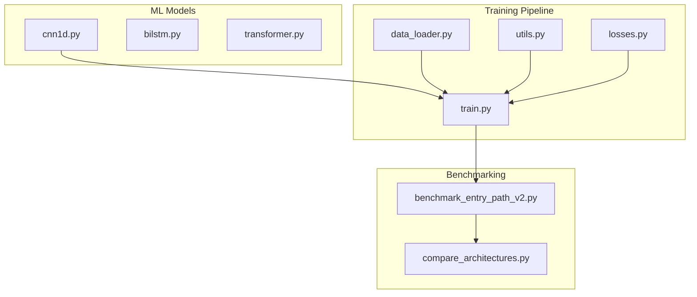
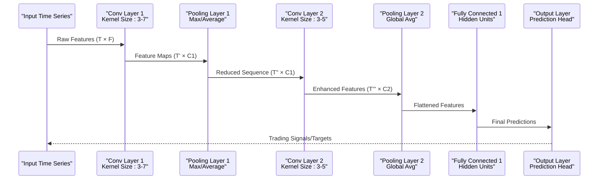
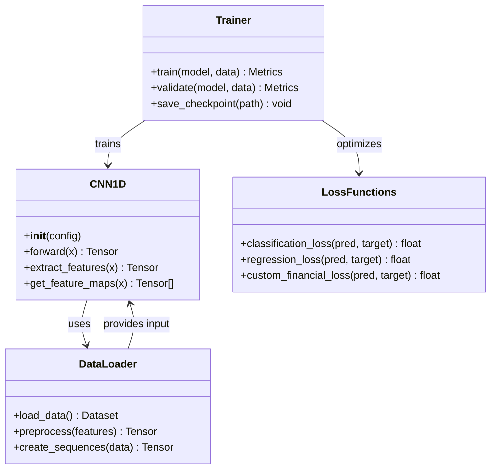

# Convolutional Neural Networks

<cite>
**Referenced Files in This Document**
- [cnn1d.py](file://ML/models/cnn1d.py)
- [train.py](file://ML/train.py)
- [data_loader.py](file://ML/data_loader.py)
- [utils.py](file://ML/utils.py)
- [losses.py](file://ML/losses.py)
- [benchmark_entry_path_v2.py](file://ML/benchmark_entry_path_v2.py)
- [compare_architectures.py](file://ML/compare_architectures.py)
</cite>

## Table of Contents
1. [Introduction](#introduction)
2. [Project Structure](#project-structure)
3. [Core Components](#core-components)
4. [Architecture Overview](#architecture-overview)
5. [Detailed Component Analysis](#detailed-component-analysis)
6. [Dependency Analysis](#dependency-analysis)
7. [Performance Considerations](#performance-considerations)
8. [Troubleshooting Guide](#troubleshooting-guide)
9. [Conclusion](#conclusion)
10. [Appendices](#appendices)

## Introduction

The CNN1D (1D Convolutional Neural Network) architecture in SoSimple is designed specifically for analyzing financial time series data. This implementation leverages 1D convolutional layers to extract local patterns and short-term dependencies from sequential market data, making it particularly effective for capturing microstructure patterns in trading signals.

CNN1D models excel at identifying temporal patterns in financial data through learnable filters that scan across time steps, automatically detecting features such as price momentum, volatility clusters, and trend reversals without manual feature engineering.

## Project Structure

The CNN1D implementation follows a modular architecture within the SoSimple framework:



**Diagram sources**
- [cnn1d.py](file://ML/models/cnn1d.py)
- [train.py](file://ML/train.py)
- [data_loader.py](file://ML/data_loader.py)

**Section sources**
- [cnn1d.py](file://ML/models/cnn1d.py)
- [train.py](file://ML/train.py)

## Core Components

The CNN1D architecture consists of several key components working together to process financial time series data:

### Convolutional Feature Extraction
- **1D Convolutional Layers**: Apply learnable filters across time dimensions to detect local patterns
- **Kernel Sizes**: Configurable filter sizes (typically 3-7) targeting different temporal scales
- **Stride Configuration**: Controls the step size of convolution operations for computational efficiency
- **Padding Strategies**: Maintains sequence length while handling boundary effects

### Pooling Operations
- **Max Pooling**: Extracts dominant features within local windows
- **Average Pooling**: Provides smoothed representations of temporal patterns
- **Global Pooling**: Reduces spatial dimensions while preserving channel information

### Fully Connected Layers
- **Dense Layers**: Process extracted features for final predictions
- **Activation Functions**: ReLU, LeakyReLU, or custom activations for non-linearity
- **Regularization**: Dropout layers prevent overfitting to training data

**Section sources**
- [cnn1d.py](file://ML/models/cnn1d.py)
- [utils.py](file://ML/utils.py)

## Architecture Overview

The CNN1D architecture processes financial time series through multiple stages of feature extraction and transformation:



**Diagram sources**
- [cnn1d.py](file://ML/models/cnn1d.py)
- [train.py](file://ML/train.py)

The architecture captures multi-scale temporal dependencies through hierarchical convolution operations, where each layer focuses on increasingly abstract patterns in the time series data.

## Detailed Component Analysis

### Convolutional Layers Implementation

The convolutional layers in CNN1D are designed to extract meaningful patterns from financial time series:

#### Kernel Size Configuration
- **Small Kernels (3-5)**: Capture immediate price movements and short-term momentum
- **Medium Kernels (5-7)**: Detect medium-term trends and volatility patterns  
- **Large Kernels (7+)**: Identify longer-term structural changes and regime shifts

#### Stride and Padding Strategy
- **Stride = 1**: Maximum information retention with higher computational cost
- **Stride > 1**: Downsampling for computational efficiency and translation invariance
- **Padding Modes**: 'same' maintains sequence length, 'valid' reduces output size

#### Activation Functions
- **ReLU**: Standard activation for most layers
- **LeakyReLU**: Prevents dead neurons during training
- **Custom Activations**: Domain-specific transformations for financial data

**Section sources**
- [cnn1d.py](file://ML/models/cnn1d.py)

### Pooling Operations

Pooling layers reduce dimensionality while preserving important features:

#### Max Pooling
- Extracts the most prominent features within local windows
- Provides translation invariance to small temporal shifts
- Effective for capturing peak volatility and extreme price movements

#### Average Pooling
- Smooths out noise while retaining overall pattern information
- Better for capturing sustained trends rather than spikes
- More robust to outliers in financial data

#### Global Pooling
- Reduces entire sequences to fixed-size vectors
- Enables comparison across different input lengths
- Essential for batch processing and memory efficiency

**Section sources**
- [cnn1d.py](file://ML/models/cnn1d.py)

### Fully Connected Layers and Output Heads

The fully connected layers transform extracted features into actionable predictions:

#### Hidden Layer Architecture
- **Layer Depth**: Typically 2-3 dense layers for complex tasks
- **Unit Count**: Scales with task complexity (50-512 units)
- **Dropout Rate**: 0.1-0.5 for regularization

#### Task-Specific Output Heads
- **Classification**: Binary or multi-class trading decisions
- **Regression**: Continuous targets like returns or volatility
- **Quantile Prediction**: Distributional forecasts for risk management

**Section sources**
- [cnn1d.py](file://ML/models/cnn1d.py)

### Regularization Techniques

CNN1D employs multiple regularization strategies to prevent overfitting:

#### Dropout
- Randomly deactivates neurons during training
- Applied after convolutional and fully connected layers
- Typical rates: 0.1-0.3 for conv layers, 0.3-0.5 for dense layers

#### Batch Normalization
- Stabilizes training by normalizing layer inputs
- Improves convergence speed and gradient flow
- Particularly effective in deep CNN architectures

#### Weight Decay
- L2 regularization on model parameters
- Prevents large weights and promotes simpler solutions
- Common values: 1e-4 to 1e-2

**Section sources**
- [cnn1d.py](file://ML/models/cnn1d.py)
- [utils.py](file://ML/utils.py)

## Dependency Analysis

The CNN1D model integrates with the broader SoSimple framework through well-defined interfaces:



**Diagram sources**
- [cnn1d.py](file://ML/models/cnn1d.py)
- [data_loader.py](file://ML/data_loader.py)
- [train.py](file://ML/train.py)
- [losses.py](file://ML/losses.py)

**Section sources**
- [cnn1d.py](file://ML/models/cnn1d.py)
- [data_loader.py](file://ML/data_loader.py)
- [train.py](file://ML/train.py)

## Performance Considerations

### Computational Efficiency
- **Memory Usage**: Optimized for GPU acceleration with batch processing
- **Inference Speed**: Real-time prediction capabilities for live trading
- **Scalability**: Handles large datasets through efficient data loading

### Training Optimization
- **Learning Rate Scheduling**: Adaptive learning rate decay
- **Gradient Clipping**: Prevents exploding gradients in deep networks
- **Mixed Precision**: FP16 training for faster computation

### Financial Data Specific Optimizations
- **Temporal Alignment**: Proper handling of market hours and gaps
- **Feature Scaling**: Robust normalization for different asset classes
- **Class Imbalance**: Specialized loss functions for rare events

**Section sources**
- [train.py](file://ML/train.py)
- [utils.py](file://ML/utils.py)

## Troubleshooting Guide

### Common Issues and Solutions

#### Overfitting Problems
- **Symptoms**: High training accuracy, low validation performance
- **Solutions**: Increase dropout rates, add more regularization, collect more data
- **Monitoring**: Track training vs validation loss curves

#### Convergence Issues
- **Symptoms**: Loss not decreasing, unstable training
- **Solutions**: Reduce learning rate, check data preprocessing, verify label encoding
- **Debugging**: Monitor gradient norms and activation distributions

#### Memory Limitations
- **Symptoms**: Out-of-memory errors during training
- **Solutions**: Reduce batch size, use gradient accumulation, optimize data types
- **Optimization**: Enable mixed precision training

**Section sources**
- [train.py](file://ML/train.py)
- [utils.py](file://ML/utils.py)

## Conclusion

The CNN1D architecture in SoSimple provides a powerful and flexible approach to analyzing financial time series data. Its ability to automatically extract local patterns and temporal dependencies makes it particularly suitable for trading signal generation and market microstructure analysis.

Key advantages include:
- Automatic feature extraction from raw time series
- Multi-scale pattern recognition through hierarchical convolutions
- Efficient real-time inference capabilities
- Integration with the broader SoSimple ML pipeline

For optimal results, practitioners should carefully tune hyperparameters based on their specific use case, ensure proper data preprocessing, and implement appropriate regularization techniques to prevent overfitting.

## Appendices

### Model Configuration Examples

#### Basic CNN1D Configuration
```python
# Example configuration structure
config = {
    'input_channels': 10,      # Number of input features
    'kernel_sizes': [3, 5, 7], # Multiple kernel sizes
    'num_filters': [32, 64, 128], # Filters per layer
    'dropout_rate': 0.2,       # Dropout probability
    'hidden_units': 256,       # Dense layer units
    'output_classes': 2        # Classification classes
}
```

#### Training Parameters
```python
training_config = {
    'batch_size': 64,
    'learning_rate': 1e-3,
    'epochs': 100,
    'validation_split': 0.2,
    'early_stopping_patience': 10,
    'gradient_clipping': 1.0
}
```

**Section sources**
- [cnn1d.py](file://ML/models/cnn1d.py)
- [train.py](file://ML/train.py)

### Comparison with Other Architectures

| Architecture | Best For | Strengths | Weaknesses |
|-------------|----------|-----------|------------|
| **CNN1D** | Local pattern detection | Fast inference, interpretable features | Limited long-range dependencies |
| **BiLSTM** | Sequential modeling | Captures temporal dependencies | Slower training, harder to interpret |
| **Transformer** | Complex relationships | Parallel processing, global attention | High computational cost |
| **Hybrid** | Balanced performance | Combines strengths of multiple approaches | Increased complexity |

**Section sources**
- [compare_architectures.py](file://ML/compare_architectures.py)
- [benchmark_entry_path_v2.py](file://ML/benchmark_entry_path_v2.py)