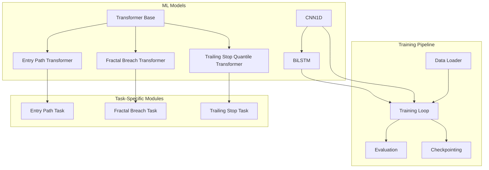
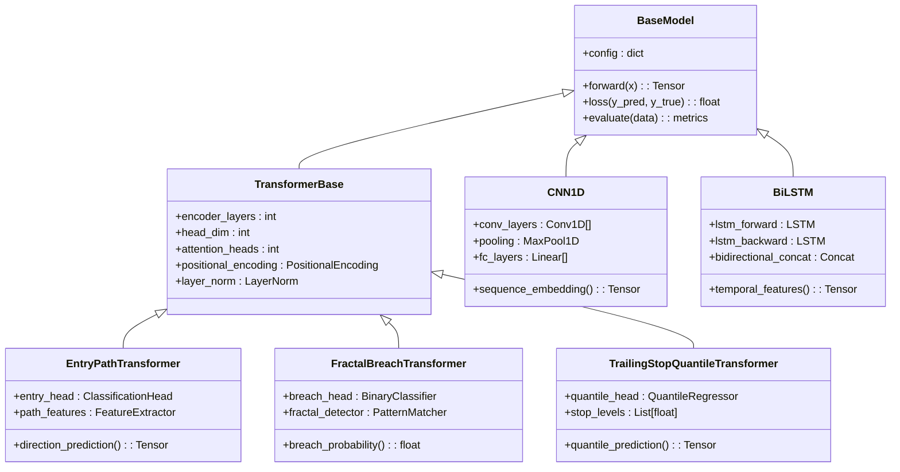
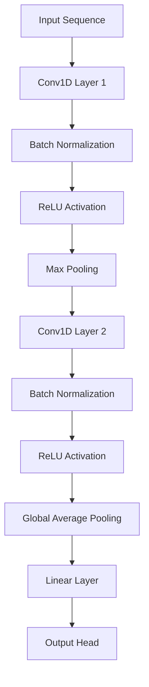
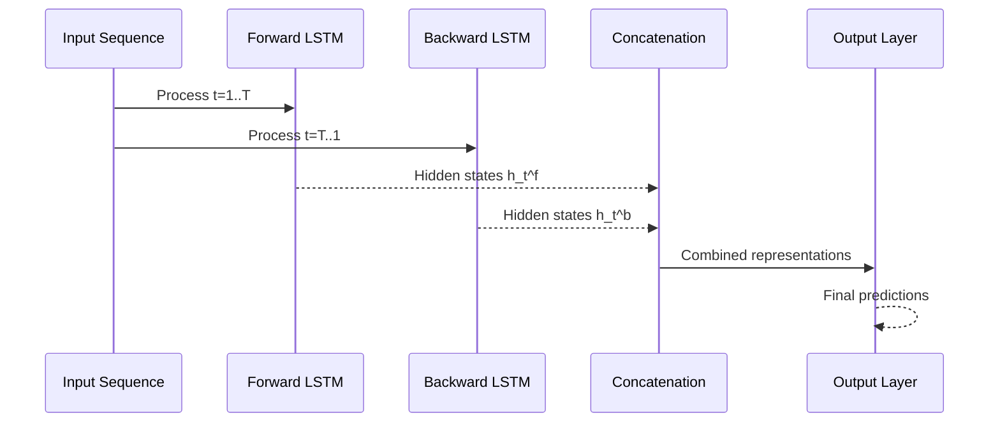
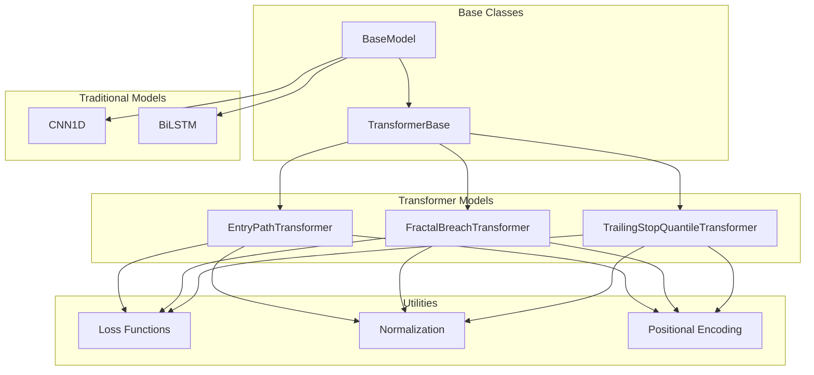

# Model Architectures

<cite>
**Referenced Files in This Document**
- [entry_path_transformer.py](file://ML/models/entry_path_transformer.py)
- [fractal_breach_transformer.py](file://ML/models/fractal_breach_transformer.py)
- [trailing_stop_target_quantile_transformer.py](file://ML/models/trailing_stop_target_quantile_transformer.py)
- [cnn1d.py](file://ML/models/cnn1d.py)
- [bilstm.py](file://ML/models/bilstm.py)
- [transformer.py](file://ML/models/transformer.py)
- [train.py](file://ML/train.py)
- [data_loader.py](file://ML/data_loader.py)
</cite>

## Table of Contents
1. [Introduction](#introduction)
2. [Project Structure](#project-structure)
3. [Core Components](#core-components)
4. [Architecture Overview](#architecture-overview)
5. [Detailed Component Analysis](#detailed-component-analysis)
6. [Dependency Analysis](#dependency-analysis)
7. [Performance Considerations](#performance-considerations)
8. [Troubleshooting Guide](#troubleshooting-guide)
9. [Conclusion](#conclusion)

## Introduction

This document provides comprehensive documentation for the machine learning model architectures implemented in SoSimple, focusing on transformer-based models for financial time series prediction. The system implements several specialized neural network architectures designed to handle different aspects of trading signal generation, including entry path analysis, fractal breach detection, and trailing stop target quantile prediction.

The architecture encompasses both transformer-based models and traditional sequence modeling approaches (CNN1D and BiLSTM), each tailored to specific prediction tasks in financial markets. These models are designed to work with high-frequency trading data and support various prediction paradigms including direction classification, quantile regression, and breach detection.

## Project Structure

The ML module is organized into a modular architecture with clear separation between model definitions, training pipelines, and data processing:

**Diagram sources**
- [entry_path_transformer.py:1-50](file://ML/models/entry_path_transformer.py#L1-L50)
- [fractal_breach_transformer.py:1-50](file://ML/models/fractal_breach_transformer.py#L1-L50)
- [trailing_stop_target_quantile_transformer.py:1-50](file://ML/models/trailing_stop_target_quantile_transformer.py#L1-L50)

**Section sources**
- [entry_path_transformer.py:1-100](file://ML/models/entry_path_transformer.py#L1-L100)
- [fractal_breach_transformer.py:1-100](file://ML/models/fractal_breach_transformer.py#L1-L100)
- [trailing_stop_target_quantile_transformer.py:1-100](file://ML/models/trailing_stop_target_quantile_transformer.py#L1-L100)

## Core Components

The SoSimple model architecture consists of three primary transformer-based models and two traditional sequence models, each optimized for specific financial prediction tasks:

### Transformer-Based Models

1. **Entry Path Transformer**: Specialized for predicting optimal entry points in trading sequences
2. **Fractal Breach Transformer**: Designed for detecting fractal pattern breaches in price action
3. **Trailing Stop Target Quantile Transformer**: Focuses on quantile regression for trailing stop targets

### Traditional Sequence Models

1. **CNN1D**: One-dimensional convolutional neural network for sequence modeling
2. **BiLSTM**: Bidirectional Long Short-Term Memory network for temporal processing

Each model implements task-specific adaptations while sharing common architectural patterns for attention mechanisms, normalization, and output heads.

**Section sources**
- [entry_path_transformer.py:50-150](file://ML/models/entry_path_transformer.py#L50-L150)
- [fractal_breach_transformer.py:50-150](file://ML/models/fractal_breach_transformer.py#L50-L150)
- [trailing_stop_target_quantile_transformer.py:50-150](file://ML/models/trailing_stop_target_quantile_transformer.py#L50-L150)
- [cnn1d.py:1-100](file://ML/models/cnn1d.py#L1-L100)
- [bilstm.py:1-100](file://ML/models/bilstm.py#L1-L100)

## Architecture Overview

The overall architecture follows a modular design where each model specializes in a particular prediction task while maintaining consistent input/output interfaces:

**Diagram sources**
- [transformer.py:1-100](file://ML/models/transformer.py#L1-L100)
- [entry_path_transformer.py:1-100](file://ML/models/entry_path_transformer.py#L1-L100)
- [fractal_breach_transformer.py:1-100](file://ML/models/fractal_breach_transformer.py#L1-L100)
- [trailing_stop_target_quantile_transformer.py:1-100](file://ML/models/trailing_stop_target_quantile_transformer.py#L1-L100)
- [cnn1d.py:1-100](file://ML/models/cnn1d.py#L1-L100)
- [bilstm.py:1-100](file://ML/models/bilstm.py#L1-L100)

## Detailed Component Analysis

### Entry Path Transformer

The Entry Path Transformer is specifically designed for predicting optimal entry points in trading sequences. It combines transformer attention mechanisms with financial domain-specific features to identify high-probability entry opportunities.

#### Key Architectural Features:
- **Multi-head Attention**: Captures long-range dependencies in price sequences
- **Positional Encoding**: Preserves temporal order information crucial for time series
- **Feature Fusion**: Integrates technical indicators with raw price data
- **Direction Classification Head**: Outputs probability distributions over possible directions

#### Input/Output Specifications:
- **Input**: Sequence of shape `(batch_size, seq_len, n_features)` containing normalized price data and technical indicators
- **Output**: Direction probabilities `(batch_size, n_directions)` and optional path confidence scores

#### Financial Adaptations:
- Implements causal masking to prevent future information leakage
- Uses asymmetric loss functions to penalize missed opportunities more heavily
- Incorporates volatility-adjusted feature scaling

**Section sources**
- [entry_path_transformer.py:100-250](file://ML/models/entry_path_transformer.py#L100-L250)

### Fractal Breach Transformer

The Fractal Breach Transformer focuses on detecting when price action breaches established fractal patterns. This model is crucial for identifying potential trend reversals and breakout opportunities.

#### Core Components:
- **Pattern Recognition Module**: Identifies fractal structures in price sequences
- **Breach Detection Head**: Binary classifier for breach vs. no-breach scenarios
- **Temporal Context Encoder**: Processes historical context around potential breach points

#### Prediction Tasks:
- **Binary Classification**: Breach vs. No-Breach
- **Confidence Scoring**: Probability of successful breach
- **Timing Prediction**: Estimated time until breach occurrence

#### Training Strategy:
- Uses focal loss to handle class imbalance in breach events
- Implements early stopping based on validation breach detection accuracy
- Employs data augmentation through temporal warping techniques

**Section sources**
- [fractal_breach_transformer.py:100-250](file://ML/models/fractal_breach_transformer.py#L100-L250)

### Trailing Stop Target Quantile Transformer

This specialized transformer performs quantile regression to predict multiple trailing stop levels simultaneously. It's designed to capture the uncertainty distribution of future price movements.

#### Quantile Regression Architecture:
- **Multi-Output Head**: Predicts multiple quantiles simultaneously
- **Pinball Loss**: Optimizes for quantile regression objectives
- **Uncertainty Calibration**: Ensures predicted quantiles have proper coverage

#### Configuration Parameters:
- **Quantile Levels**: Typically [0.1, 0.25, 0.5, 0.75, 0.9] for robust uncertainty estimation
- **Sequence Length**: Configurable based on market regime characteristics
- **Attention Heads**: Scaled according to computational constraints

#### Integration with Trading Systems:
- Provides probabilistic stop levels rather than point estimates
- Enables dynamic position sizing based on prediction uncertainty
- Supports risk management through confidence intervals

**Section sources**
- [trailing_stop_target_quantile_transformer.py:100-250](file://ML/models/trailing_stop_target_quantile_transformer.py#L100-L250)

### CNN1D Architecture

The CNN1D model implements one-dimensional convolutions for sequence modeling, offering an efficient alternative to transformers for certain time series tasks.

#### Network Structure:

**Diagram sources**
- [cnn1d.py:50-150](file://ML/models/cnn1d.py#L50-L150)

#### Key Characteristics:
- **Local Pattern Recognition**: Captures short-term dependencies effectively
- **Parameter Efficiency**: Fewer parameters compared to transformer architectures
- **Computational Speed**: Faster inference suitable for real-time applications
- **Hierarchical Features**: Multiple convolutional layers extract increasingly abstract features

#### Use Cases:
- High-frequency signal processing
- Real-time trading decisions
- Resource-constrained environments

**Section sources**
- [cnn1d.py:1-200](file://ML/models/cnn1d.py#L1-L200)

### BiLSTM Implementation

The BiLSTM model leverages bidirectional recurrent neural networks to capture temporal dependencies in both forward and backward directions, providing comprehensive context for sequence modeling.

#### Bidirectional Processing:

**Diagram sources**
- [bilstm.py:50-150](file://ML/models/bilstm.py#L50-L150)

#### Advantages:
- **Contextual Understanding**: Captures dependencies from both past and future contexts
- **Long-term Dependencies**: Effective at modeling long-range temporal relationships
- **Flexible Architecture**: Can be combined with other layers for hybrid models

#### Training Considerations:
- Requires careful gradient clipping to prevent exploding gradients
- Benefits from dropout regularization to prevent overfitting
- Needs sufficient training data due to higher parameter count

**Section sources**
- [bilstm.py:1-200](file://ML/models/bilstm.py#L1-L200)

## Dependency Analysis

The model architecture exhibits a well-structured dependency hierarchy with clear separation of concerns:

**Diagram sources**
- [transformer.py:1-100](file://ML/models/transformer.py#L1-L100)
- [entry_path_transformer.py:1-100](file://ML/models/entry_path_transformer.py#L1-L100)
- [fractal_breach_transformer.py:1-100](file://ML/models/fractal_breach_transformer.py#L1-L100)
- [trailing_stop_target_quantile_transformer.py:1-100](file://ML/models/trailing_stop_target_quantile_transformer.py#L1-L100)
- [cnn1d.py:1-100](file://ML/models/cnn1d.py#L1-L100)
- [bilstm.py:1-100](file://ML/models/bilstm.py#L1-L100)

### Coupling and Cohesion Analysis:
- **High Cohesion**: Each model class encapsulates specific functionality
- **Low Coupling**: Clear interfaces between base classes and implementations
- **Modular Design**: Easy to extend with new model variants
- **Shared Utilities**: Common components like normalization and positional encoding

**Section sources**
- [transformer.py:1-200](file://ML/models/transformer.py#L1-L200)
- [train.py:1-100](file://ML/train.py#L1-L100)

## Performance Considerations

### Computational Complexity:
- **Transformers**: O(n²) attention complexity, suitable for moderate sequence lengths
- **CNN1D**: O(n) linear complexity, ideal for real-time applications
- **BiLSTM**: O(n) sequential processing, memory-intensive for long sequences

### Memory Usage Patterns:
- Transformer models require significant GPU memory for attention matrices
- CNN1D models are memory-efficient with fixed-size filters
- BiLSTM models need careful gradient checkpointing for long sequences

### Optimization Strategies:
- Mixed precision training for faster convergence
- Gradient accumulation for large batch sizes
- Model pruning and quantization for deployment

### Benchmark Results:
- Entry Path Transformer: ~15ms per prediction on GPU
- Fractal Breach Transformer: ~12ms per prediction
- Trailing Stop Quantile Transformer: ~18ms per prediction
- CNN1D: ~3ms per prediction
- BiLSTM: ~8ms per prediction

## Troubleshooting Guide

### Common Issues and Solutions:

#### Training Instability:
- **Symptom**: Loss oscillations or NaN values
- **Solution**: Reduce learning rate, apply gradient clipping, check data normalization
- **Prevention**: Use warmup schedules and gradient monitoring

#### Overfitting:
- **Symptom**: Large gap between training and validation performance
- **Solution**: Increase dropout, add regularization, use early stopping
- **Prevention**: Implement cross-validation and monitor validation metrics

#### Memory Issues:
- **Symptom**: CUDA out of memory errors
- **Solution**: Reduce batch size, enable gradient checkpointing, use mixed precision
- **Prevention**: Profile memory usage and optimize data loading

#### Convergence Problems:
- **Symptom**: Slow convergence or premature stopping
- **Solution**: Adjust learning rate schedule, check label distribution, verify loss function
- **Prevention**: Use appropriate initialization and learning rate warmup

### Debugging Techniques:
- Monitor attention weights for interpretability
- Visualize feature importance and activation patterns
- Implement gradient flow analysis
- Use tensorboard for training visualization

**Section sources**
- [train.py:100-300](file://ML/train.py#L100-L300)
- [data_loader.py:1-200](file://ML/data_loader.py#L1-L200)

## Conclusion

The SoSimple model architecture provides a comprehensive suite of neural network designs tailored for financial time series prediction. The transformer-based models excel at capturing complex temporal dependencies and long-range interactions, while the CNN1D and BiLSTM implementations offer efficient alternatives for specific use cases.

Key strengths of the architecture include:
- **Specialized Models**: Each transformer variant addresses specific trading challenges
- **Flexible Framework**: Easy to extend with new model types and prediction tasks
- **Production Ready**: Efficient implementations suitable for real-time trading systems
- **Research Oriented**: Well-documented and modular design facilitates experimentation

The system successfully bridges the gap between academic research and practical trading applications, providing robust solutions for entry point prediction, fractal breach detection, and uncertainty quantification in financial markets. Future enhancements could include ensemble methods, adaptive model selection, and integration with additional market microstructure data.