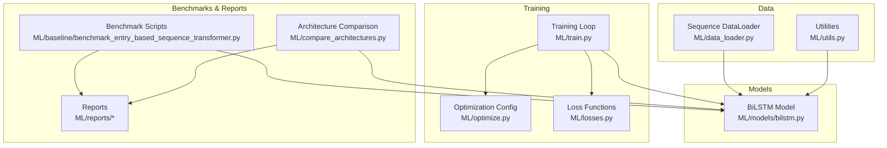
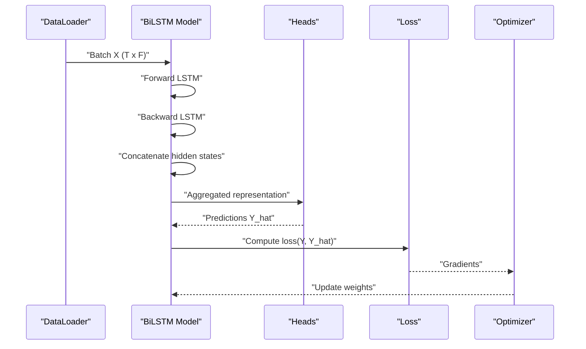
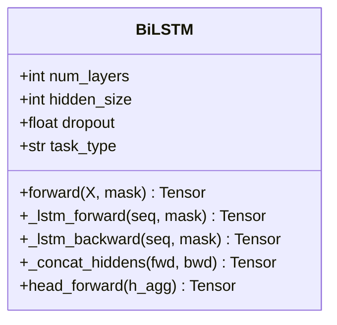
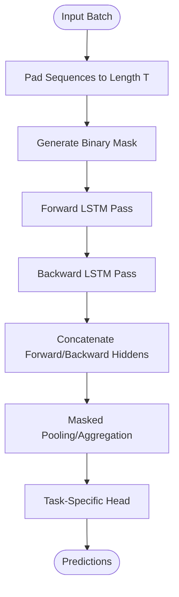
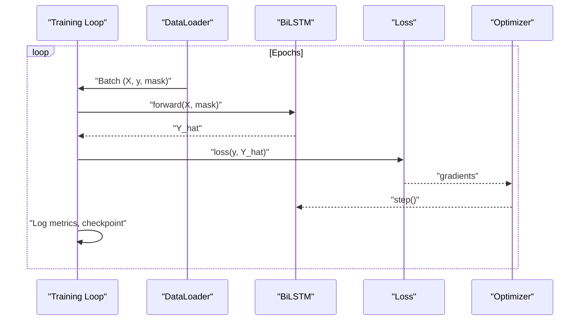
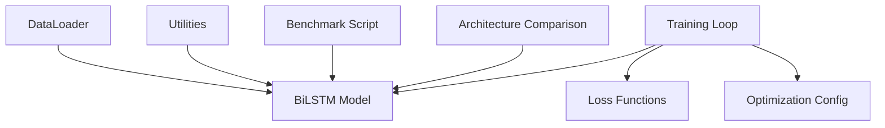

# Recurrent Neural Networks

<cite>
**Referenced Files in This Document**
- [bilstm.py](file://ML/models/bilstm.py)
- [train.py](file://ML/train.py)
- [data_loader.py](file://ML/data_loader.py)
- [utils.py](file://ML/utils.py)
- [losses.py](file://ML/losses.py)
- [optimize.py](file://ML/optimize.py)
- [benchmark_entry_based_sequence_transformer.py](file://ML/baseline/benchmark_entry_based_sequence_transformer.py)
- [compare_architectures.py](file://ML/compare_architectures.py)
- [architecture_comparison_classification.md](file://ML/reports/architecture_comparison_classification.md)
- [architecture_comparison_regression.md](file://ML/reports/architecture_comparison_regression.md)
</cite>

## Table of Contents
1. [Introduction](#introduction)
2. [Project Structure](#project-structure)
3. [Core Components](#core-components)
4. [Architecture Overview](#architecture-overview)
5. [Detailed Component Analysis](#detailed-component-analysis)
6. [Dependency Analysis](#dependency-analysis)
7. [Performance Considerations](#performance-considerations)
8. [Troubleshooting Guide](#troubleshooting-guide)
9. [Conclusion](#conclusion)
10. [Appendices](#appendices)

## Introduction
This document explains the BiLSTM (Bidirectional Long Short-Term Memory) model architecture implemented in SoSimple for financial time series modeling. It focuses on how bidirectional processing captures temporal dependencies in both forward and backward directions, details LSTM cell configuration, hidden dimensions, dropout, sequence handling, and integration with the feature engineering pipeline. It also covers initialization parameters, training configurations, performance characteristics relative to transformer models, usage examples, data preprocessing requirements, and integration with the training framework.

## Project Structure
The BiLSTM implementation resides under ML/models and is used by the training and benchmarking pipelines in ML/. Data loading and utilities are provided by ML/data_loader.py and ML/utils.py. Loss functions and optimization routines are defined in ML/losses.py and ML/optimize.py. Comparative analyses and reports are stored under ML/reports and referenced via benchmark scripts.

**Diagram sources**
- [bilstm.py](file://ML/models/bilstm.py)
- [train.py](file://ML/train.py)
- [data_loader.py](file://ML/data_loader.py)
- [utils.py](file://ML/utils.py)
- [losses.py](file://ML/losses.py)
- [optimize.py](file://ML/optimize.py)
- [benchmark_entry_based_sequence_transformer.py](file://ML/baseline/benchmark_entry_based_sequence_transformer.py)
- [compare_architectures.py](file://ML/compare_architectures.py)
- [architecture_comparison_classification.md](file://ML/reports/architecture_comparison_classification.md)
- [architecture_comparison_regression.md](file://ML/reports/architecture_comparison_regression.md)

**Section sources**
- [bilstm.py](file://ML/models/bilstm.py)
- [train.py](file://ML/train.py)
- [data_loader.py](file://ML/data_loader.py)
- [utils.py](file://ML/utils.py)
- [losses.py](file://ML/losses.py)
- [optimize.py](file://ML/optimize.py)
- [benchmark_entry_based_sequence_transformer.py](file://ML/baseline/benchmark_entry_based_sequence_transformer.py)
- [compare_architectures.py](file://ML/compare_architectures.py)
- [architecture_comparison_classification.md](file://ML/reports/architecture_comparison_classification.md)
- [architecture_comparison_regression.md](file://ML/reports/architecture_comparison_regression.md)

## Core Components
- BiLSTM Model: Implements a bidirectional LSTM encoder with configurable layers, hidden sizes, dropout, and output heads for classification or regression tasks.
- Sequence DataLoader: Handles variable-length sequences, padding/masking, batching, and shuffling for efficient training.
- Training Loop: Orchestrates forward passes, loss computation, backpropagation, and checkpointing.
- Loss Functions: Provides task-specific losses (e.g., cross-entropy for classification, MSE/quantile losses for regression).
- Optimization Configuration: Defines learning rate schedules, weight decay, and optimizer settings.
- Utilities: Includes masking helpers, normalization utilities, and device management.

Key responsibilities:
- Bidirectional encoding captures past and future context within the lookback window.
- Dropout regularizes hidden states to reduce overfitting.
- Variable-length sequence support ensures robustness across uneven histories.
- Integration with feature engineering pipeline provides normalized inputs and consistent masks.

**Section sources**
- [bilstm.py](file://ML/models/bilstm.py)
- [data_loader.py](file://ML/data_loader.py)
- [train.py](file://ML/train.py)
- [losses.py](file://ML/losses.py)
- [optimize.py](file://ML/optimize.py)
- [utils.py](file://ML/utils.py)

## Architecture Overview
The BiLSTM processes sequences of financial features through stacked LSTM cells in both forward and backward directions. Hidden states from both directions are concatenated at each timestep to form a richer representation. The final representation is passed through task-specific heads (classification or regression), optionally followed by dropout and activation functions.

**Diagram sources**
- [bilstm.py](file://ML/models/bilstm.py)
- [data_loader.py](file://ML/data_loader.py)
- [train.py](file://ML/train.py)
- [losses.py](file://ML/losses.py)
- [optimize.py](file://ML/optimize.py)

## Detailed Component Analysis

### BiLSTM Model
- Bidirectional Processing: Two LSTM stacks process the sequence in forward and backward directions; outputs are concatenated per timestep.
- LSTM Cell Configuration: Number of layers, hidden size, dropout applied to recurrent connections and between layers.
- Output Heads: Separate heads for classification (softmax/sigmoid) and regression (linear or quantile heads).
- Mask Handling: Ignores padded timesteps during aggregation and loss computation.

**Diagram sources**
- [bilstm.py](file://ML/models/bilstm.py)

**Section sources**
- [bilstm.py](file://ML/models/bilstm.py)

### Sequence Handling and Variable-Length Sequences
- Padding Strategy: Sequences are padded to a fixed length T; a binary mask indicates valid timesteps.
- Masked Aggregation: When pooling representations (e.g., last valid timestep or mean over valid timesteps), masked positions are excluded.
- Batching and Shuffling: DataLoader batches sequences, applies shuffling, and yields tensors on the correct device.

**Diagram sources**
- [data_loader.py](file://ML/data_loader.py)
- [bilstm.py](file://ML/models/bilstm.py)

**Section sources**
- [data_loader.py](file://ML/data_loader.py)
- [bilstm.py](file://ML/models/bilstm.py)

### Training Loop and Optimization
- Forward Pass: Model receives batched sequences and masks; produces predictions.
- Loss Computation: Task-specific loss function computes scalar loss; supports weighted or multi-task variants.
- Backpropagation and Update: Optimizer updates parameters using gradients; optional gradient clipping and learning rate scheduling.

**Diagram sources**
- [train.py](file://ML/train.py)
- [losses.py](file://ML/losses.py)
- [optimize.py](file://ML/optimize.py)

**Section sources**
- [train.py](file://ML/train.py)
- [losses.py](file://ML/losses.py)
- [optimize.py](file://ML/optimize.py)

### Integration with Feature Engineering Pipeline
- Input Features: Normalized financial features (price action, volume, microstructure indicators) produced by upstream preprocessing.
- Contract Consistency: Ensures feature ordering and scaling match training-time expectations.
- Mask Alignment: Masks align with padded sequences generated by the DataLoader.

**Diagram sources**
- [data_loader.py](file://ML/data_loader.py)
- [utils.py](file://ML/utils.py)
- [bilstm.py](file://ML/models/bilstm.py)

**Section sources**
- [data_loader.py](file://ML/data_loader.py)
- [utils.py](file://ML/utils.py)
- [bilstm.py](file://ML/models/bilstm.py)

### Model Initialization Parameters
- num_layers: Number of stacked LSTM layers.
- hidden_size: Dimensionality of hidden states per direction.
- dropout: Dropout probability applied to recurrent connections and inter-layer transitions.
- task_type: Determines head configuration (classification vs regression).
- input_dim: Expected feature dimensionality aligned with preprocessing.

These parameters control model capacity, regularization strength, and compatibility with the feature contract.

**Section sources**
- [bilstm.py](file://ML/models/bilstm.py)

### Usage Examples and Data Preprocessing Requirements
- Data Preprocessing: Ensure features are normalized and sequences are constructed with consistent lookback windows; generate masks for padded positions.
- Model Instantiation: Configure BiLSTM with appropriate hidden size, layers, and dropout based on dataset complexity.
- Training: Use the training loop with DataLoader, loss, and optimizer configured for the task.
- Inference: Provide sequences and masks; obtain predictions directly from the model’s forward method.

For concrete usage patterns, refer to benchmark scripts that instantiate and train BiLSTM alongside transformers.

**Section sources**
- [benchmark_entry_based_sequence_transformer.py](file://ML/baseline/benchmark_entry_based_sequence_transformer.py)
- [data_loader.py](file://ML/data_loader.py)
- [bilstm.py](file://ML/models/bilstm.py)

## Dependency Analysis
The BiLSTM model depends on data loaders for sequence batching and masking, utilities for device and tensor operations, and training components for optimization and loss computation. Benchmark scripts orchestrate experiments comparing BiLSTM with transformer architectures.

**Diagram sources**
- [bilstm.py](file://ML/models/bilstm.py)
- [data_loader.py](file://ML/data_loader.py)
- [utils.py](file://ML/utils.py)
- [train.py](file://ML/train.py)
- [losses.py](file://ML/losses.py)
- [optimize.py](file://ML/optimize.py)
- [benchmark_entry_based_sequence_transformer.py](file://ML/baseline/benchmark_entry_based_sequence_transformer.py)
- [compare_architectures.py](file://ML/compare_architectures.py)

**Section sources**
- [bilstm.py](file://ML/models/bilstm.py)
- [data_loader.py](file://ML/data_loader.py)
- [utils.py](file://ML/utils.py)
- [train.py](file://ML/train.py)
- [losses.py](file://ML/losses.py)
- [optimize.py](file://ML/optimize.py)
- [benchmark_entry_based_sequence_transformer.py](file://ML/baseline/benchmark_entry_based_sequence_transformer.py)
- [compare_architectures.py](file://ML/compare_architectures.py)

## Performance Considerations
- Computational Efficiency: BiLSTM scales linearly with sequence length and is generally more memory-efficient than transformers for long sequences.
- Temporal Modeling: Captures local temporal dependencies effectively; may struggle with very long-range dependencies compared to attention-based models.
- Regularization: Dropout and proper hidden sizing help mitigate overfitting on noisy financial data.
- Throughput: Batching and GPU acceleration improve training speed; ensure masks are handled efficiently to avoid unnecessary computations.

[No sources needed since this section provides general guidance]

## Troubleshooting Guide
- Shape Mismatches: Verify input dimensions match expected feature size; ensure masks align with sequence lengths.
- NaN Gradients: Check for unstable normalization or extreme values; consider gradient clipping and learning rate tuning.
- Overfitting: Increase dropout, reduce hidden size, or add regularization; validate with hold-out sets.
- Mask Errors: Confirm padding indices are correctly masked in both forward/backward passes and aggregation steps.

**Section sources**
- [train.py](file://ML/train.py)
- [data_loader.py](file://ML/data_loader.py)
- [bilstm.py](file://ML/models/bilstm.py)

## Conclusion
The BiLSTM in SoSimple provides a robust baseline for modeling financial time series with bidirectional temporal dependencies. Its configurable architecture integrates seamlessly with the feature engineering pipeline and training framework. Compared to transformers, BiLSTM offers efficiency and strong local dependency capture, while transformers excel at long-range modeling. Proper configuration of hidden sizes, dropout, and sequence handling is critical for performance and stability.

[No sources needed since this section summarizes without analyzing specific files]

## Appendices

### Comparative Performance Notes
- Classification and regression comparisons are documented in reports under ML/reports, including architecture comparison summaries and benchmark results.
- Benchmark scripts demonstrate side-by-side evaluation of BiLSTM and transformer models.

**Section sources**
- [architecture_comparison_classification.md](file://ML/reports/architecture_comparison_classification.md)
- [architecture_comparison_regression.md](file://ML/reports/architecture_comparison_regression.md)
- [benchmark_entry_based_sequence_transformer.py](file://ML/baseline/benchmark_entry_based_sequence_transformer.py)
- [compare_architectures.py](file://ML/compare_architectures.py)