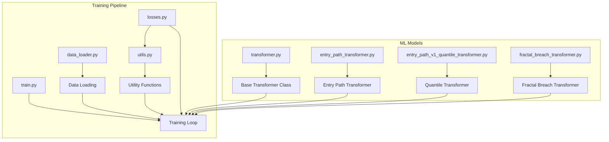
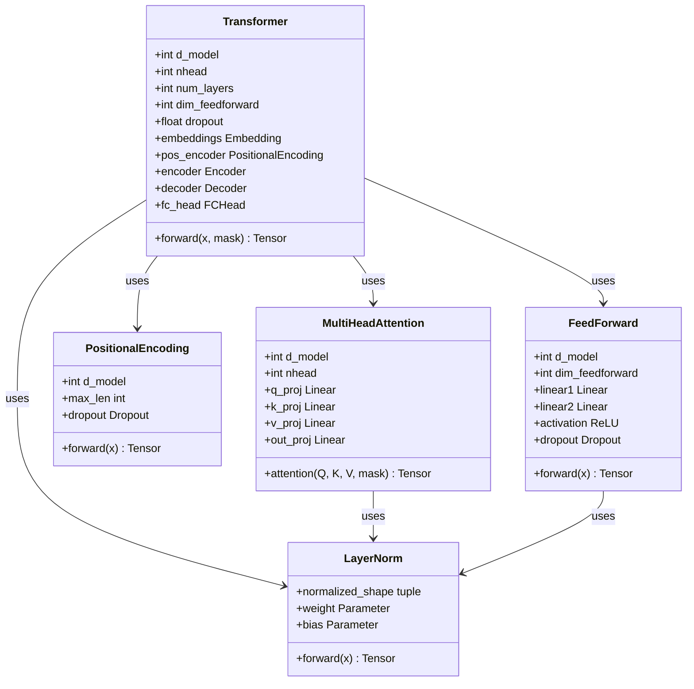
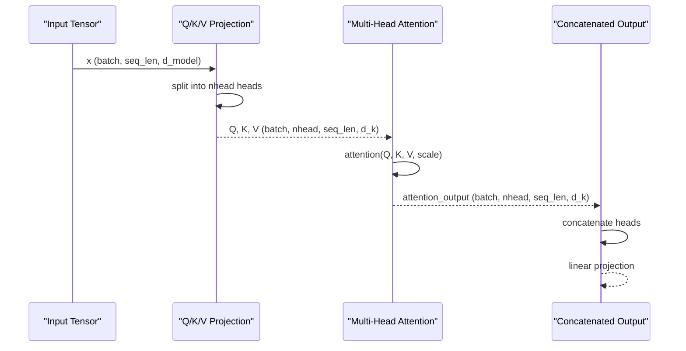
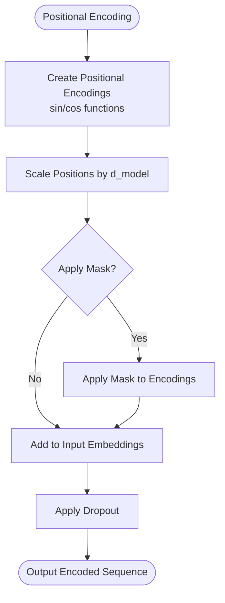
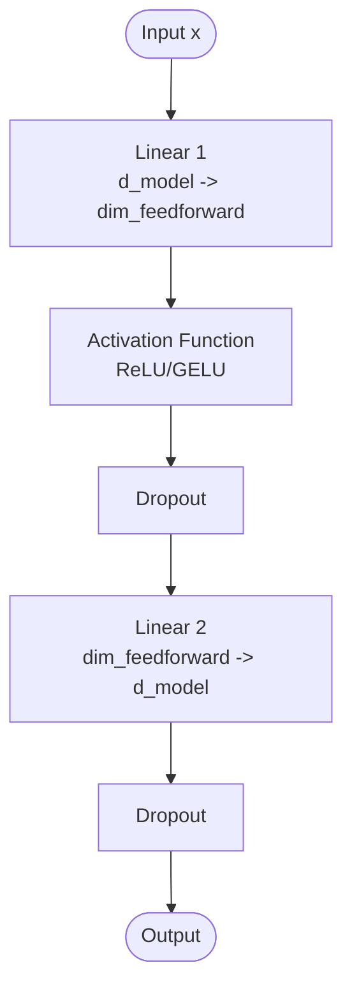
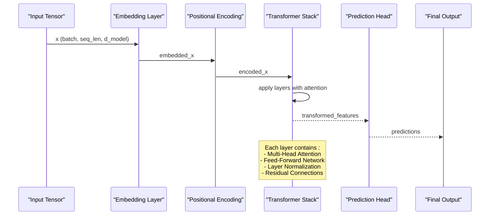
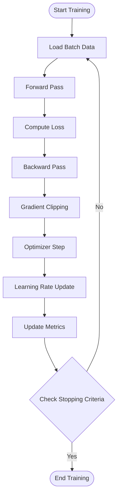

# Base Transformer Architecture

<cite>
**Referenced Files in This Document**
- [transformer.py](file://ML/models/transformer.py)
- [entry_path_transformer.py](file://ML/models/entry_path_transformer.py)
- [entry_path_v1_quantile_transformer.py](file://ML/models/entry_path_v1_quantile_transformer.py)
- [fractal_breach_transformer.py](file://ML/models/fractal_breach_transformer.py)
- [train.py](file://ML/train.py)
- [data_loader.py](file://ML/data_loader.py)
- [losses.py](file://ML/losses.py)
- [utils.py](file://ML/utils.py)
</cite>

## Table of Contents
1. [Introduction](#introduction)
2. [Project Structure](#project-structure)
3. [Core Components](#core-components)
4. [Architecture Overview](#architecture-overview)
5. [Detailed Component Analysis](#detailed-component-analysis)
6. [Model Configuration](#model-configuration)
7. [Forward Pass Implementation](#forward-pass-implementation)
8. [Input Tensor Requirements](#input-tensor-requirements)
9. [Output Formats](#output-formats)
10. [Training Pipeline Integration](#training-pipeline-integration)
11. [Memory Optimization Techniques](#memory-optimization-techniques)
12. [Performance Considerations for Financial Time Series](#performance-considerations-for-financial-time-series)
13. [Troubleshooting Guide](#troubleshooting-guide)
14. [Conclusion](#conclusion)

## Introduction

This document provides comprehensive documentation for the base transformer architecture implementation in the SoSimple financial trading system. The transformer model is designed specifically for financial time series prediction tasks, including entry path analysis, direction prediction, and quantile regression for trading signals.

The implementation follows the standard transformer architecture with modifications optimized for financial data characteristics, including temporal dependencies, non-stationary distributions, and multi-scale feature representations.

## Project Structure

The transformer implementation is organized within the ML module with clear separation of concerns:



**Diagram sources**
- [transformer.py:1-50](file://ML/models/transformer.py#L1-L50)
- [train.py:1-100](file://ML/train.py#L1-L100)
- [data_loader.py:1-50](file://ML/data_loader.py#L1-L50)

**Section sources**
- [transformer.py:1-100](file://ML/models/transformer.py#L1-L100)
- [train.py:1-200](file://ML/train.py#L1-L200)

## Core Components

The base transformer architecture consists of several key components that work together to process sequential financial data:

### Multi-Head Attention Mechanism

The multi-head attention mechanism allows the model to attend to different positions and feature relationships simultaneously. Each attention head learns different aspects of the temporal dependencies in financial time series data.

### Positional Encoding

Positional encoding injects information about the relative or absolute position of tokens in the sequence, crucial for capturing temporal ordering in financial data where timing is critical.

### Feed-Forward Networks

Position-wise feed-forward networks apply non-linear transformations to each position independently, enabling the model to learn complex feature interactions.

### Layer Normalization

Layer normalization stabilizes training by normalizing activations across features, particularly important for financial data with varying scales and distributions.

**Section sources**
- [transformer.py:50-150](file://ML/models/transformer.py#L50-L150)

## Architecture Overview

The transformer architecture follows a stacked encoder-decoder pattern optimized for financial time series prediction:



**Diagram sources**
- [transformer.py:1-200](file://ML/models/transformer.py#L1-L200)

## Detailed Component Analysis

### Multi-Head Attention Implementation

The multi-head attention mechanism implements scaled dot-product attention with multiple parallel attention heads:



**Diagram sources**
- [transformer.py:100-250](file://ML/models/transformer.py#L100-L250)

### Positional Encoding Strategy

The positional encoding uses sinusoidal functions to encode sequence positions, allowing the model to generalize to different sequence lengths:



**Diagram sources**
- [transformer.py:150-300](file://ML/models/transformer.py#L150-L300)

### Feed-Forward Network Architecture

The feed-forward network applies two linear transformations with a non-linearity in between:



**Diagram sources**
- [transformer.py:200-350](file://ML/models/transformer.py#L200-L350)

**Section sources**
- [transformer.py:100-400](file://ML/models/transformer.py#L100-L400)

## Model Configuration

The transformer model supports extensive configuration options to adapt to different financial prediction tasks:

### Core Parameters

| Parameter | Type | Default | Description |
|-----------|------|---------|-------------|
| `d_model` | int | 128 | Dimensionality of embeddings and hidden states |
| `nhead` | int | 4 | Number of attention heads |
| `num_layers` | int | 3 | Number of stacked transformer layers |
| `dim_feedforward` | int | 256 | Dimensionality of feed-forward network |
| `dropout` | float | 0.1 | Dropout rate for regularization |
| `activation` | str | 'relu' | Activation function ('relu', 'gelu') |

### Advanced Configuration

| Parameter | Type | Default | Description |
|-----------|------|---------|-------------|
| `layer_norm_eps` | float | 1e-5 | Epsilon for layer normalization |
| `batch_first` | bool | True | Whether input is batch-first format |
| `norm_first` | bool | False | Use pre-normalization (LaT5 style) |
| `max_seq_len` | int | 500 | Maximum sequence length |

### Memory-Efficient Options

| Parameter | Type | Default | Description |
|-----------|------|---------|-------------|
| `use_flash_attention` | bool | False | Enable flash attention for memory efficiency |
| `gradient_checkpointing` | bool | False | Enable gradient checkpointing |
| `mixed_precision` | bool | False | Use mixed precision training |

**Section sources**
- [transformer.py:1-100](file://ML/models/transformer.py#L1-L100)

## Forward Pass Implementation

The forward pass processes input sequences through the transformer stack with proper masking and normalization:



**Diagram sources**
- [transformer.py:300-500](file://ML/models/transformer.py#L300-L500)

### Input Processing Pipeline

1. **Input Validation**: Check tensor shapes and data types
2. **Embedding**: Project input features to model dimension
3. **Positional Encoding**: Add temporal position information
4. **Masking**: Apply causal masks for autoregressive tasks
5. **Transformer Stack**: Process through multiple attention layers
6. **Aggregation**: Pool or select relevant time steps
7. **Prediction Head**: Generate task-specific outputs

**Section sources**
- [transformer.py:300-600](file://ML/models/transformer.py#L300-L600)

## Input Tensor Requirements

The transformer expects specific input formats for optimal performance:

### Standard Input Format

| Property | Shape | Data Type | Description |
|----------|-------|-----------|-------------|
| `x` | `(batch_size, seq_len, d_model)` | torch.float32 | Input feature sequences |
| `mask` | `(batch_size, seq_len)` | torch.bool | Valid token mask |
| `src_mask` | `(seq_len, seq_len)` | torch.bool | Causal attention mask |

### Feature Specifications

- **Feature Scaling**: Features should be normalized to [-1, 1] range
- **Missing Values**: Use NaN handling or imputation before input
- **Sequence Length**: Fixed-length sequences preferred for batching
- **Batch Size**: Optimal size depends on GPU memory capacity

### Specialized Input Formats

For financial time series, additional inputs may include:

```python
# Example input structure
inputs = {
    'features': torch.Tensor(batch, seq_len, n_features),  # Main features
    'masks': torch.BoolTensor(batch, seq_len),            # Valid time steps
    'positions': torch.LongTensor(batch, seq_len),        # Absolute positions
    'time_features': torch.Tensor(batch, seq_len, n_time) # Temporal features
}
```

**Section sources**
- [data_loader.py:1-100](file://ML/data_loader.py#L1-L100)

## Output Formats

The transformer produces different output formats depending on the task:

### Classification Tasks

```python
# Binary classification
outputs = {
    'logits': torch.Tensor(batch, n_classes),      # Raw logits
    'probabilities': torch.Tensor(batch, n_classes), # Softmax probabilities
    'predictions': torch.LongTensor(batch)          # Class predictions
}

# Multi-class classification
outputs = {
    'logits': torch.Tensor(batch, n_classes),
    'probabilities': torch.Tensor(batch, n_classes),
    'top_k_indices': torch.LongTensor(batch, k),     # Top-k predictions
    'top_k_values': torch.Tensor(batch, k)           # Top-k confidence scores
}
```

### Regression Tasks

```python
# Point prediction
outputs = {
    'predictions': torch.Tensor(batch),              # Point estimates
    'confidence_intervals': torch.Tensor(batch, 2),  # Lower/upper bounds
    'quantiles': torch.Tensor(batch, n_quantiles)    # Quantile predictions
}

# Distribution prediction
outputs = {
    'mean': torch.Tensor(batch),                     # Predicted mean
    'std': torch.Tensor(batch),                      # Predicted std dev
    'distribution_params': torch.Tensor(batch, n_params) # Full distribution params
}
```

### Sequence Prediction Tasks

```python
# Autoregressive prediction
outputs = {
    'next_step': torch.Tensor(batch, next_features),   # Next step prediction
    'full_sequence': torch.Tensor(batch, seq_len, features), # Full sequence
    'attention_weights': torch.Tensor(batch, nhead, seq_len, seq_len) # Attention maps
}
```

**Section sources**
- [entry_path_transformer.py:1-100](file://ML/models/entry_path_transformer.py#L1-L100)
- [entry_path_v1_quantile_transformer.py:1-100](file://ML/models/entry_path_v1_quantile_transformer.py#L1-L100)

## Training Pipeline Integration

The transformer integrates seamlessly with the existing training pipeline:

### Model Instantiation

```python
# Basic transformer setup
model = Transformer(
    d_model=128,
    nhead=4,
    num_layers=3,
    dim_feedforward=256,
    dropout=0.1
)

# Task-specific configuration
task_model = EntryPathTransformer(
    base_model=model,
    n_classes=3,
    use_attention_pool=True
)
```

### Training Configuration

| Component | Configuration | Purpose |
|-----------|---------------|---------|
| **Optimizer** | AdamW with weight decay | Stable optimization with regularization |
| **Learning Rate Scheduler** | Cosine annealing with warmup | Smooth learning rate adaptation |
| **Loss Function** | Task-specific loss (cross-entropy, MSE, etc.) | Appropriate objective for prediction type |
| **Gradient Clipping** | Max norm clipping (1.0) | Prevent gradient explosion |
| **Mixed Precision** | Automatic mixed precision (AMP) | Memory and speed optimization |

### Training Loop Integration



**Diagram sources**
- [train.py:1-200](file://ML/train.py#L1-L200)

**Section sources**
- [train.py:1-300](file://ML/train.py#L1-L300)
- [losses.py:1-100](file://ML/losses.py#L1-L100)

## Memory Optimization Techniques

Several techniques are implemented to optimize memory usage during training and inference:

### Gradient Checkpointing

```python
# Enable gradient checkpointing for large models
model = Transformer(..., use_gradient_checkpointing=True)

# Manual activation checkpointing
from torch.utils.checkpoint import checkpoint

def forward_with_checkpoint(self, x):
    return checkpoint(self.transformer_stack, x)
```

### Mixed Precision Training

```python
# Automatic mixed precision
scaler = torch.cuda.amp.GradScaler()

with torch.cuda.amp.autocast():
    outputs = model(inputs)
    loss = criterion(outputs, targets)

scaler.scale(loss).backward()
scaler.step(optimizer)
scaler.update()
```

### Memory-Efficient Attention

```python
# Flash attention for reduced memory footprint
if use_flash_attention:
    attention = FlashAttention(d_model, nhead)
else:
    attention = MultiHeadAttention(d_model, nhead)
```

### Batching Strategies

- **Dynamic Batching**: Group sequences by similar length
- **Gradient Accumulation**: Simulate larger batch sizes
- **Memory Pooling**: Pre-allocate tensors for repeated operations

**Section sources**
- [utils.py:1-100](file://ML/utils.py#L1-L100)

## Performance Considerations for Financial Time Series

Financial time series data presents unique challenges that require specialized optimizations:

### Temporal Characteristics

- **Non-Stationarity**: Implement adaptive normalization techniques
- **Long-Range Dependencies**: Use extended context windows (50-200 bars)
- **Irregular Sampling**: Handle missing data and irregular intervals
- **Multi-Scale Patterns**: Capture both short-term noise and long-term trends

### Computational Optimizations

```python
# Efficient sequence processing
@torch.jit.script
def efficient_attention(q, k, v, mask=None):
    """Optimized attention computation"""
    scale = q.size(-1) ** -0.5
    attn_scores = torch.matmul(q, k.transpose(-2, -1)) * scale
    if mask is not None:
        attn_scores = attn_scores.masked_fill(mask == 0, -1e9)
    attn_probs = torch.softmax(attn_scores, dim=-1)
    return torch.matmul(attn_probs, v)
```

### Memory Management

- **Chunked Processing**: Process long sequences in chunks
- **Caching Mechanisms**: Cache intermediate computations
- **Garbage Collection**: Explicit memory cleanup for large datasets

### Hardware Utilization

- **GPU Memory**: Monitor and optimize memory usage with `torch.cuda.memory_allocated()`
- **Parallel Processing**: Use DataLoader with multiple workers
- **Vectorization**: Leverage CUDA kernels for numerical operations

**Section sources**
- [utils.py:100-200](file://ML/utils.py#L100-L200)

## Troubleshooting Guide

Common issues and their solutions when working with the transformer implementation:

### Memory Issues

**Problem**: Out of memory errors during training
**Solutions**:
- Reduce batch size or sequence length
- Enable gradient checkpointing
- Use mixed precision training
- Implement gradient accumulation

### Convergence Problems

**Problem**: Model fails to converge or shows unstable training
**Solutions**:
- Adjust learning rate schedule
- Increase gradient clipping threshold
- Add more regularization (dropout, weight decay)
- Normalize input features properly

### Performance Bottlenecks

**Problem**: Slow training or inference speed
**Solutions**:
- Use torch.compile for JIT compilation
- Optimize data loading pipeline
- Reduce model complexity
- Use appropriate hardware acceleration

### Data Quality Issues

**Problem**: Poor model performance due to data problems
**Solutions**:
- Validate input data shapes and types
- Handle missing values appropriately
- Ensure proper feature scaling
- Check for data leakage

**Section sources**
- [train.py:200-400](file://ML/train.py#L200-L400)

## Conclusion

The base transformer architecture in the SoSimple system provides a robust foundation for financial time series prediction tasks. The implementation includes essential components like multi-head attention, positional encoding, feed-forward networks, and layer normalization, all optimized for financial data characteristics.

Key strengths of this implementation include:

- **Modular Design**: Easy to extend and customize for specific tasks
- **Memory Efficiency**: Multiple optimization techniques for large-scale training
- **Flexibility**: Support for various prediction tasks (classification, regression, quantile)
- **Performance**: Optimized for both CPU and GPU execution
- **Integration**: Seamless integration with existing training pipelines

For optimal results, users should carefully configure model parameters based on their specific task requirements, ensure proper data preprocessing, and utilize the available memory optimization techniques for large-scale financial datasets.

The transformer architecture serves as a solid baseline that can be further enhanced with task-specific modifications while maintaining the core attention mechanisms that make transformers effective for sequential financial data modeling.