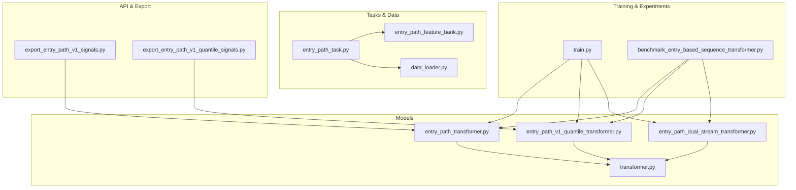
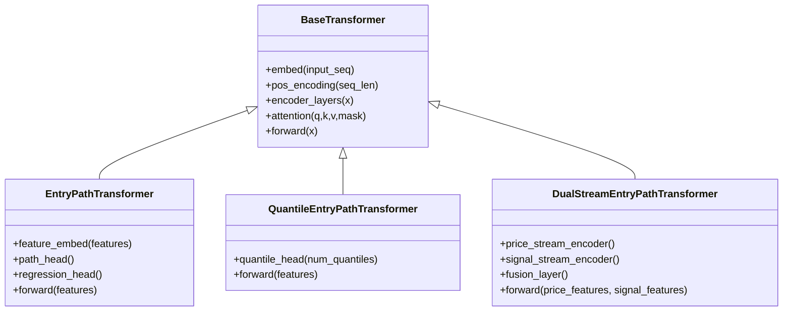
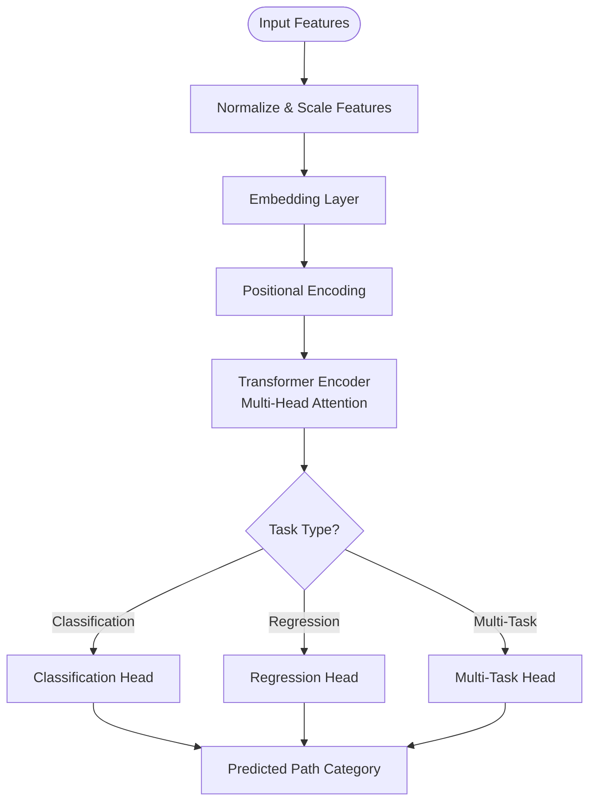
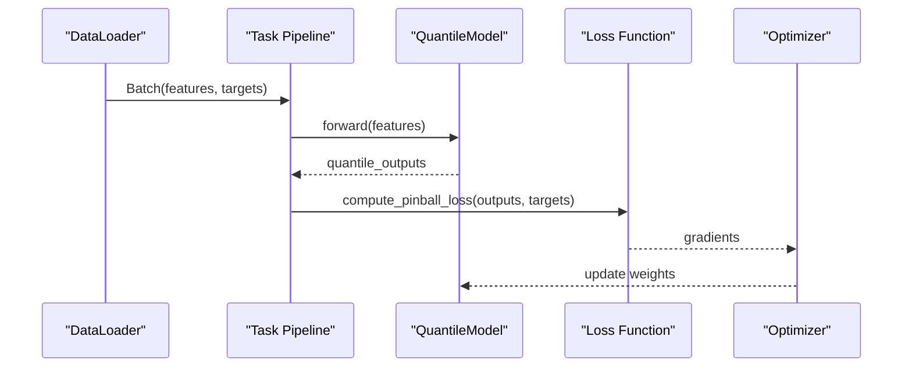
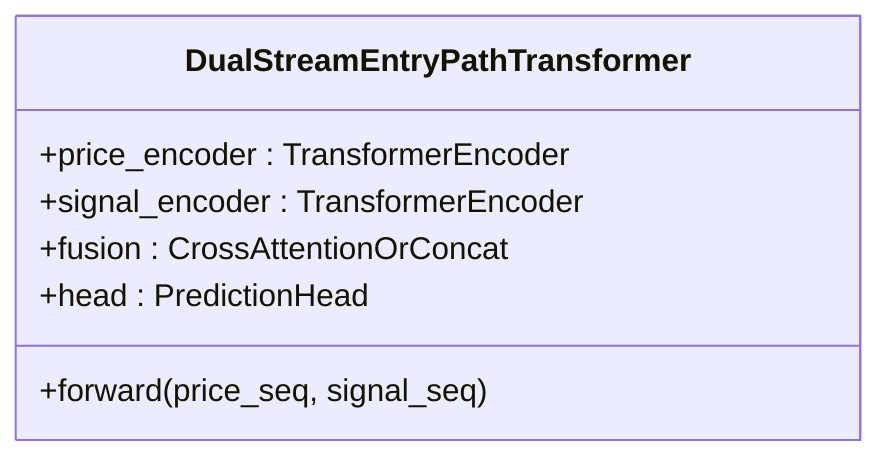
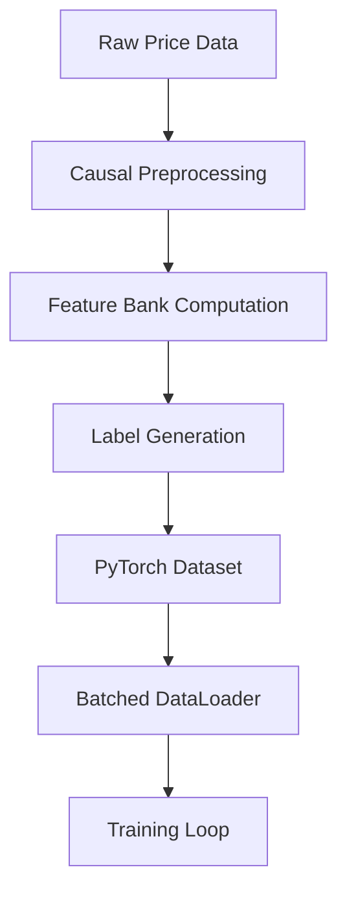
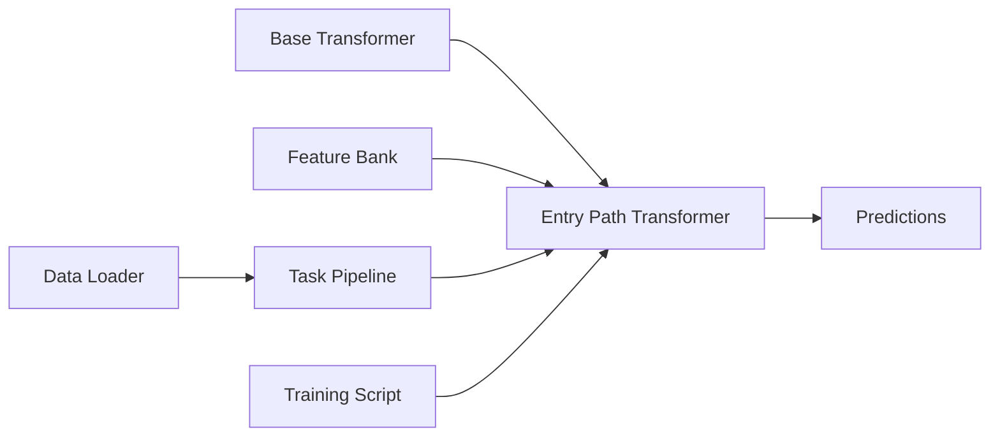

# Entry Path Transformer

<cite>
**Referenced Files in This Document**
- [entry_path_transformer.py](file://ML/models/entry_path_transformer.py)
- [transformer.py](file://ML/models/transformer.py)
- [entry_path_v1_quantile_transformer.py](file://ML/models/entry_path_v1_quantile_transformer.py)
- [entry_path_dual_stream_transformer.py](file://ML/models/entry_path_dual_stream_transformer.py)
- [entry_path_task.py](file://ML/entry_path_task.py)
- [entry_path_feature_bank.py](file://ML/entry_path_feature_bank.py)
- [data_loader.py](file://ML/data_loader.py)
- [train.py](file://ML/train.py)
- [benchmark_entry_based_sequence_transformer.py](file://ML/baseline/benchmark_entry_based_sequence_transformer.py)
- [export_entry_path_v1_signals.py](file://API/export_entry_path_v1_signals.py)
- [export_entry_path_v1_quantile_signals.py](file://API/export_entry_path_v1_quantile_signals.py)
</cite>

## Table of Contents
1. [Introduction](#introduction)
2. [Project Structure](#project-structure)
3. [Core Components](#core-components)
4. [Architecture Overview](#architecture-overview)
5. [Detailed Component Analysis](#detailed-component-analysis)
6. [Dependency Analysis](#dependency-analysis)
7. [Performance Considerations](#performance-considerations)
8. [Troubleshooting Guide](#troubleshooting-guide)
9. [Conclusion](#conclusion)
10. [Appendices](#appendices)

## Introduction
This document explains the entry path transformer model designed for price path prediction tasks. It focuses on how the base transformer is adapted to predict entry paths, including feature engineering tailored to price sequences, sequence modeling strategies, and target variable handling. The document also covers architectural modifications for capturing temporal dependencies in price movements, attention mechanisms optimized for financial time series, and output layers for path prediction. Configuration options, training procedures, and integration with the entry path pipeline are provided, along with usage examples, customization guidance, and performance tuning recommendations.

## Project Structure
The entry path transformer implementation resides primarily under ML/models and ML/tasks, with supporting data pipelines and API exports. Key files include:
- Model definitions: entry_path_transformer.py, transformer.py, entry_path_v1_quantile_transformer.py, entry_path_dual_stream_transformer.py
- Task and data preparation: entry_path_task.py, entry_path_feature_bank.py, data_loader.py
- Training orchestration: train.py
- Benchmarks and experiments: benchmark_entry_based_sequence_transformer.py
- Signal export and integration: export_entry_path_v1_signals.py, export_entry_path_v1_quantile_signals.py

**Diagram sources**
- [entry_path_transformer.py](file://ML/models/entry_path_transformer.py)
- [transformer.py](file://ML/models/transformer.py)
- [entry_path_v1_quantile_transformer.py](file://ML/models/entry_path_v1_quantile_transformer.py)
- [entry_path_dual_stream_transformer.py](file://ML/models/entry_path_dual_stream_transformer.py)
- [entry_path_task.py](file://ML/entry_path_task.py)
- [entry_path_feature_bank.py](file://ML/entry_path_feature_bank.py)
- [data_loader.py](file://ML/data_loader.py)
- [train.py](file://ML/train.py)
- [benchmark_entry_based_sequence_transformer.py](file://ML/baseline/benchmark_entry_based_sequence_transformer.py)
- [export_entry_path_v1_signals.py](file://API/export_entry_path_v1_signals.py)
- [export_entry_path_v1_quantile_signals.py](file://API/export_entry_path_v1_quantile_signals.py)

**Section sources**
- [entry_path_transformer.py](file://ML/models/entry_path_transformer.py)
- [transformer.py](file://ML/models/transformer.py)
- [entry_path_v1_quantile_transformer.py](file://ML/models/entry_path_v1_quantile_transformer.py)
- [entry_path_dual_stream_transformer.py](file://ML/models/entry_path_dual_stream_transformer.py)
- [entry_path_task.py](file://ML/entry_path_task.py)
- [entry_path_feature_bank.py](file://ML/entry_path_feature_bank.py)
- [data_loader.py](file://ML/data_loader.py)
- [train.py](file://ML/train.py)
- [benchmark_entry_based_sequence_transformer.py](file://ML/baseline/benchmark_entry_based_sequence_transformer.py)
- [export_entry_path_v1_signals.py](file://API/export_entry_path_v1_signals.py)
- [export_entry_path_v1_quantile_signals.py](file://API/export_entry_path_v1_quantile_signals.py)

## Core Components
- Base Transformer: Provides the foundational encoder-decoder or encoder-only architecture used across models.
- Entry Path Transformer: Adapts the base transformer for entry path prediction by integrating price-path features and specialized heads.
- Quantile Variant: Extends the entry path transformer to output quantiles for probabilistic path predictions.
- Dual Stream Variant: Processes two streams (e.g., price action and auxiliary signals) to capture richer context.
- Task Layer: Encapsulates dataset construction, labeling, and batching for entry path tasks.
- Feature Bank: Defines and computes features specific to price paths and entry contexts.
- Data Loader: Handles loading, preprocessing, and batching of sequences for training and inference.
- Training Orchestration: Coordinates model instantiation, loss selection, optimization, and evaluation loops.

Key responsibilities:
- Sequence modeling over price bars and derived features
- Attention mechanisms tuned for financial time series characteristics
- Output heads for classification/regression/quantiles depending on variant
- Integration with task-specific labels and metrics

**Section sources**
- [entry_path_transformer.py](file://ML/models/entry_path_transformer.py)
- [transformer.py](file://ML/models/transformer.py)
- [entry_path_v1_quantile_transformer.py](file://ML/models/entry_path_v1_quantile_transformer.py)
- [entry_path_dual_stream_transformer.py](file://ML/models/entry_path_dual_stream_transformer.py)
- [entry_path_task.py](file://ML/entry_path_task.py)
- [entry_path_feature_bank.py](file://ML/entry_path_feature_bank.py)
- [data_loader.py](file://ML/data_loader.py)
- [train.py](file://ML/train.py)

## Architecture Overview
The entry path transformer builds upon a base transformer encoder to model temporal dependencies in price sequences. Modifications include:
- Input embedding layer that concatenates normalized price-derived features and auxiliary signals
- Positional encoding adapted for irregular sampling and market microstructure
- Multi-head self-attention with masked attention where appropriate to respect causal ordering
- Specialized heads:
  - Classification head for discrete path categories
  - Regression head for continuous path metrics
  - Quantile head for distributional predictions
- Optional dual-stream fusion for combining price action with external signals

**Diagram sources**
- [transformer.py](file://ML/models/transformer.py)
- [entry_path_transformer.py](file://ML/models/entry_path_transformer.py)
- [entry_path_v1_quantile_transformer.py](file://ML/models/entry_path_v1_quantile_transformer.py)
- [entry_path_dual_stream_transformer.py](file://ML/models/entry_path_dual_stream_transformer.py)

## Detailed Component Analysis

### Entry Path Transformer
Adapts the base transformer to focus on entry point analysis:
- Feature Engineering: Normalizes price returns, volatility proxies, and microstructure indicators; constructs rolling statistics and regime flags.
- Sequence Modeling: Uses causal masking to ensure predictions only depend on past information; supports variable-length sequences via padding masks.
- Target Handling: Supports classification (path category), regression (path amplitude/duration), and multi-task objectives.
- Attention Optimization: Employs scaled dot-product attention with learned positional encodings; optional sparse attention for long sequences.
- Output Layers: Configurable heads for classification, regression, or combined losses.

**Diagram sources**
- [entry_path_transformer.py](file://ML/models/entry_path_transformer.py)
- [entry_path_feature_bank.py](file://ML/entry_path_feature_bank.py)

**Section sources**
- [entry_path_transformer.py](file://ML/models/entry_path_transformer.py)
- [entry_path_feature_bank.py](file://ML/entry_path_feature_bank.py)

### Quantile Entry Path Transformer
Extends the base model to output quantiles:
- Quantile Heads: Separate linear layers per quantile level; trained with pinball loss for robust distributional estimation.
- Calibration: Optional conformal calibration post-training for reliable uncertainty bounds.
- Usage: Suitable when path variability is high and risk-aware decisions are needed.

**Diagram sources**
- [entry_path_v1_quantile_transformer.py](file://ML/models/entry_path_v1_quantile_transformer.py)
- [data_loader.py](file://ML/data_loader.py)
- [train.py](file://ML/train.py)

**Section sources**
- [entry_path_v1_quantile_transformer.py](file://ML/models/entry_path_v1_quantile_transformer.py)
- [data_loader.py](file://ML/data_loader.py)
- [train.py](file://ML/train.py)

### Dual Stream Entry Path Transformer
Processes two input streams:
- Price Stream: Raw OHLCV-derived features and technical indicators.
- Signal Stream: External signals such as order flow imbalances or sentiment proxies.
- Fusion Mechanism: Cross-attention or concatenation-based fusion before final prediction heads.

**Diagram sources**
- [entry_path_dual_stream_transformer.py](file://ML/models/entry_path_dual_stream_transformer.py)

**Section sources**
- [entry_path_dual_stream_transformer.py](file://ML/models/entry_path_dual_stream_transformer.py)

### Task and Data Pipeline
- Entry Path Task: Constructs sequences from raw price data, applies labeling schemes (e.g., triple barrier or fractal-based), and manages batch creation.
- Feature Bank: Centralizes feature computation functions, ensuring consistency across training and inference.
- Data Loader: Handles caching, shuffling, and efficient iteration over large datasets.

**Diagram sources**
- [entry_path_task.py](file://ML/entry_path_task.py)
- [entry_path_feature_bank.py](file://ML/entry_path_feature_bank.py)
- [data_loader.py](file://ML/data_loader.py)

**Section sources**
- [entry_path_task.py](file://ML/entry_path_task.py)
- [entry_path_feature_bank.py](file://ML/entry_path_feature_bank.py)
- [data_loader.py](file://ML/data_loader.py)

## Dependency Analysis
The entry path transformer depends on:
- Base transformer for core attention mechanisms
- Feature bank for consistent feature computation
- Task layer for data preparation and labeling
- Training script for optimization and evaluation

**Diagram sources**
- [transformer.py](file://ML/models/transformer.py)
- [entry_path_transformer.py](file://ML/models/entry_path_transformer.py)
- [entry_path_feature_bank.py](file://ML/entry_path_feature_bank.py)
- [entry_path_task.py](file://ML/entry_path_task.py)
- [data_loader.py](file://ML/data_loader.py)
- [train.py](file://ML/train.py)

**Section sources**
- [transformer.py](file://ML/models/transformer.py)
- [entry_path_transformer.py](file://ML/models/entry_path_transformer.py)
- [entry_path_feature_bank.py](file://ML/entry_path_feature_bank.py)
- [entry_path_task.py](file://ML/entry_path_task.py)
- [data_loader.py](file://ML/data_loader.py)
- [train.py](file://ML/train.py)

## Performance Considerations
- Sequence Length: Use sliding windows with overlap to balance context and computational cost.
- Attention Complexity: For long sequences, consider sparse attention or hierarchical pooling.
- Feature Scaling: Ensure stable normalization to prevent gradient explosion.
- Batch Size: Tune based on memory constraints and convergence behavior.
- Mixed Precision: Enable FP16/BF16 training for faster throughput on compatible hardware.
- Early Stopping: Monitor validation metrics to avoid overfitting on noisy financial data.

[No sources needed since this section provides general guidance]

## Troubleshooting Guide
Common issues and resolutions:
- NaN Losses: Check for invalid features or improper scaling; add clipping and validation checks.
- Poor Convergence: Reduce learning rate, increase batch size, or use gradient accumulation.
- Overfitting: Apply dropout, weight decay, or early stopping; simplify model architecture.
- Memory Errors: Reduce sequence length, batch size, or enable gradient checkpointing.
- Label Leakage: Verify causal preprocessing ensures no future information leaks into features.

**Section sources**
- [train.py](file://ML/train.py)
- [data_loader.py](file://ML/data_loader.py)

## Conclusion
The entry path transformer adapts the base transformer for price path prediction through specialized feature engineering, sequence modeling, and output heads. Variants like quantile and dual stream models extend capabilities for uncertainty estimation and multi-modal inputs. Proper configuration, training procedures, and integration with the task pipeline are critical for robust performance in financial applications.

[No sources needed since this section summarizes without analyzing specific files]

## Appendices

### Configuration Options
- Model Parameters:
  - hidden_dim: Dimension of transformer embeddings
  - num_heads: Number of attention heads
  - num_layers: Depth of transformer encoder
  - seq_len: Input sequence length
  - dropout: Dropout rate for regularization
- Training Hyperparameters:
  - learning_rate: Optimizer step size
  - batch_size: Samples per batch
  - epochs: Total training iterations
  - optimizer: AdamW or SGD with momentum
- Task-Specific Settings:
  - task_type: classification, regression, or quantile
  - loss_function: cross_entropy, mse, or pinball_loss
  - label_scheme: triple_barrier, fractal, or custom

**Section sources**
- [entry_path_transformer.py](file://ML/models/entry_path_transformer.py)
- [entry_path_v1_quantile_transformer.py](file://ML/models/entry_path_v1_quantile_transformer.py)
- [train.py](file://ML/train.py)

### Usage Examples
- Basic Training:
  - Instantiate model with desired parameters
  - Prepare dataset using task pipeline
  - Run training loop with specified optimizer and loss
- Inference:
  - Load trained checkpoint
  - Feed new sequences through model
  - Extract predictions or quantiles
- Custom Modifications:
  - Add new features to feature bank
  - Modify attention mechanism for domain-specific needs
  - Implement custom loss functions for specialized tasks

**Section sources**
- [benchmark_entry_based_sequence_transformer.py](file://ML/baseline/benchmark_entry_based_sequence_transformer.py)
- [export_entry_path_v1_signals.py](file://API/export_entry_path_v1_signals.py)
- [export_entry_path_v1_quantile_signals.py](file://API/export_entry_path_v1_quantile_signals.py)

### Integration with Entry Path Pipeline
- Data Flow: Raw data → preprocessing → feature computation → labeling → dataset creation → training
- Model Hooks: Integrate custom layers or attention mechanisms at defined extension points
- Export: Generate signals or predictions for downstream trading systems

**Section sources**
- [entry_path_task.py](file://ML/entry_path_task.py)
- [entry_path_feature_bank.py](file://ML/entry_path_feature_bank.py)
- [data_loader.py](file://ML/data_loader.py)
- [train.py](file://ML/train.py)
- [export_entry_path_v1_signals.py](file://API/export_entry_path_v1_signals.py)
- [export_entry_path_v1_quantile_signals.py](file://API/export_entry_path_v1_quantile_signals.py)