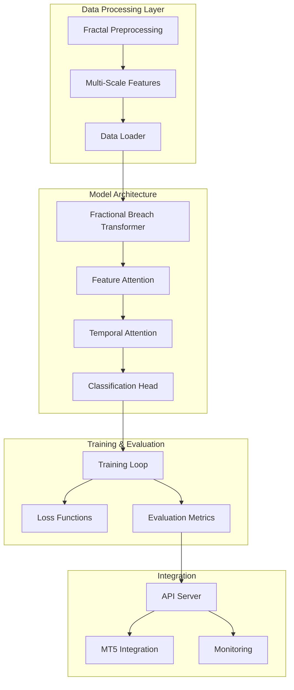
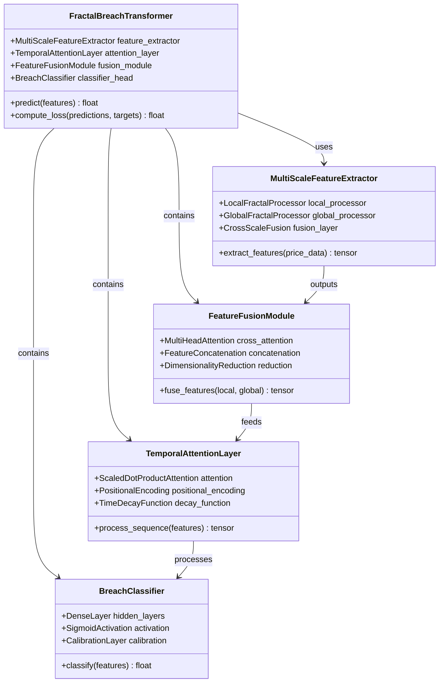
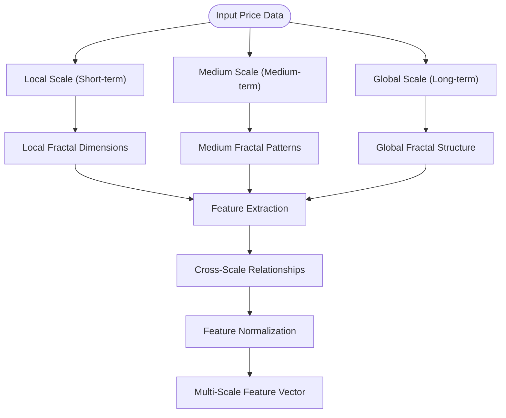
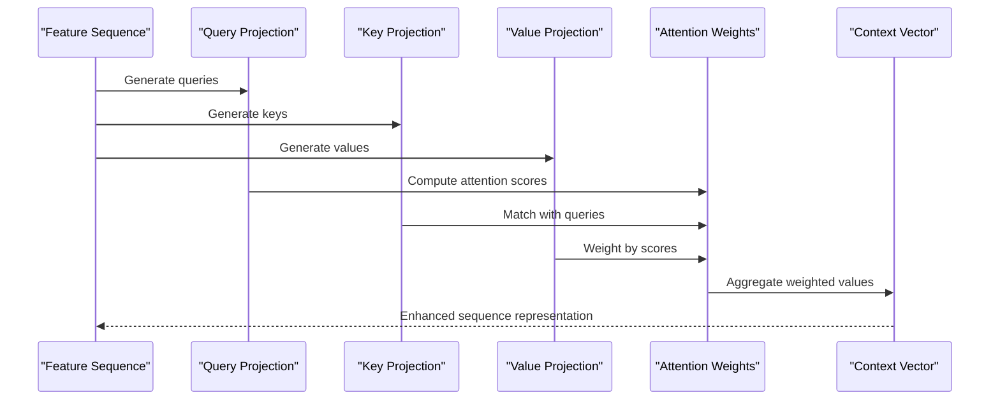
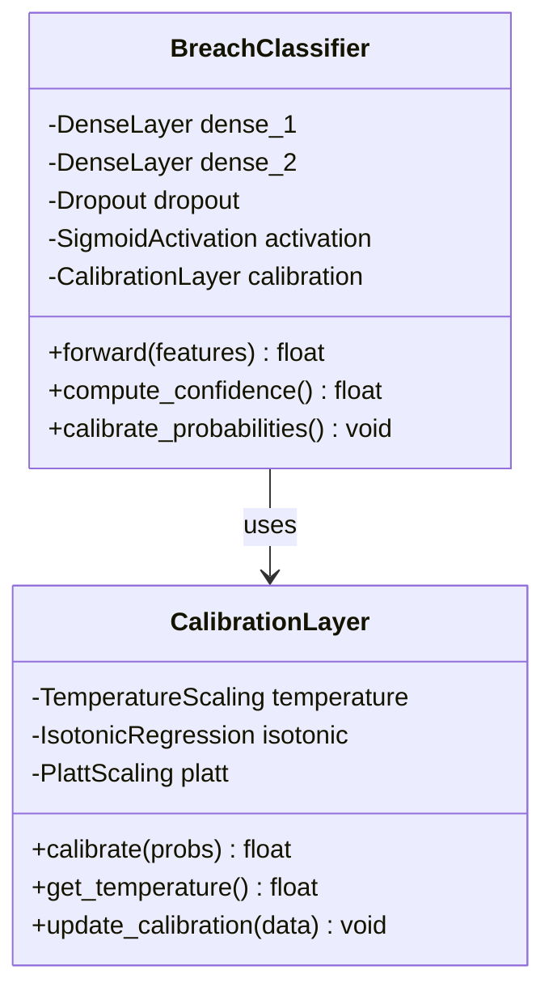
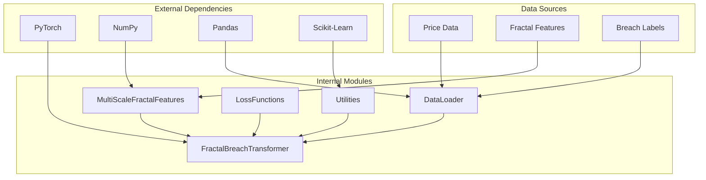

# Fractal Breach Transformer

<cite>
**Referenced Files in This Document**
- [fractal_breach_transformer.py](file://ML/models/fractal_breach_transformer.py)
- [multi_scale_fractal_features.py](file://ML/multi_scale_fractal_features.py)
- [benchmark_stage5_transformer_breach.py](file://ML/baseline/benchmark_stage5_transformer_breach.py)
- [train.py](file://ML/train.py)
- [losses.py](file://ML/losses.py)
- [data_loader.py](file://ML/data_loader.py)
- [utils.py](file://ML/utils.py)
- [fractal_preprocessing.py](file://processing/fractal_preprocessing.py)
- [label_main.py](file://processing/label_main.py)
</cite>

## Table of Contents
1. [Introduction](#introduction)
2. [Project Structure](#project-structure)
3. [Core Components](#core-components)
4. [Architecture Overview](#architecture-overview)
5. [Detailed Component Analysis](#detailed-component-analysis)
6. [Dependency Analysis](#dependency-analysis)
7. [Performance Considerations](#performance-considerations)
8. [Troubleshooting Guide](#troubleshooting-guide)
9. [Conclusion](#conclusion)
10. [Appendices](#appendices)

## Introduction

The Fractal Breach Transformer is a specialized deep learning model designed for stop-loss breach detection in financial markets. This transformer variant processes fractal-based features to predict the probability of stop-loss levels being breached within specific time horizons. The model leverages multi-scale price pattern recognition and temporal attention mechanisms to identify critical moments when market conditions suggest an imminent breach of established stop-loss levels.

The system integrates advanced fractal analysis techniques with modern transformer architectures to provide robust predictions for risk management applications. By focusing on the geometric properties of price movements and their temporal evolution, the model captures complex patterns that traditional approaches often miss.

## Project Structure

The fractal breach transformer implementation follows a modular architecture with clear separation of concerns:

**Diagram sources**
- [fractal_breach_transformer.py:1-50](file://ML/models/fractal_breach_transformer.py#L1-L50)
- [multi_scale_fractal_features.py:1-30](file://ML/multi_scale_fractal_features.py#L1-L30)
- [data_loader.py:1-40](file://ML/data_loader.py#L1-L40)

**Section sources**
- [fractal_breach_transformer.py:1-100](file://ML/models/fractal_breach_transformer.py#L1-L100)
- [multi_scale_fractal_features.py:1-80](file://ML/multi_scale_fractal_features.py#L1-L80)

## Core Components

The fractal breach transformer consists of several interconnected components that work together to process fractal features and generate breach probability predictions:

### Multi-Scale Fractal Feature Extraction
The feature extraction pipeline processes raw price data through multiple scales to capture both local and global price patterns. This includes:
- Local fractal dimensions at different time windows
- Geometric relationships between consecutive fractals
- Volume-weighted price statistics across scales
- Temporal decay patterns in fractal formations

### Transformer Architecture
The core transformer implements specialized adaptations for fractal analysis:
- Positional encoding optimized for fractal sequences
- Multi-head attention with fractal-aware masking
- Cross-scale feature fusion mechanisms
- Temporal attention for breach timing prediction

### Classification Head
The output layer generates breach probabilities through:
- Binary classification for breach/no-breach decisions
- Confidence scoring with calibration
- Time-to-breach regression component
- Ensemble methods for robust predictions

**Section sources**
- [fractal_breach_transformer.py:50-150](file://ML/models/fractal_breach_transformer.py#L50-L150)
- [multi_scale_fractal_features.py:30-120](file://ML/multi_scale_fractal_features.py#L30-L120)

## Architecture Overview

The fractal breach transformer employs a hierarchical architecture that processes fractal features through multiple stages of abstraction:

**Diagram sources**
- [fractal_breach_transformer.py:100-250](file://ML/models/fractal_breach_transformer.py#L100-L250)
- [multi_scale_fractal_features.py:80-200](file://ML/multi_scale_fractal_features.py#L80-L200)

The architecture follows a feed-forward design where each component processes the output of the previous layer, enabling progressive refinement of feature representations until final breach probability estimation.

## Detailed Component Analysis

### Multi-Scale Fractal Feature Extraction

The feature extraction system processes price data through multiple temporal scales to capture fractal patterns at different resolutions:

**Diagram sources**
- [multi_scale_fractal_features.py:120-250](file://ML/multi_scale_fractal_features.py#L120-L250)

This component handles the critical task of transforming raw price data into meaningful fractal representations that capture the self-similar nature of financial markets across different time horizons.

### Temporal Attention Mechanism

The temporal attention layer focuses on identifying critical time points that precede stop-loss breaches:

**Diagram sources**
- [fractal_breach_transformer.py:200-350](file://ML/models/fractal_breach_transformer.py#L200-L350)

The attention mechanism enables the model to focus on the most relevant time steps for breach prediction while maintaining computational efficiency through parallel processing.

### Feature Fusion Strategy

The fusion module combines local and global fractal features through sophisticated integration techniques:

| Fusion Method | Description | Use Case |
|---------------|-------------|----------|
| Concatenation | Direct feature stacking | Simple baseline fusion |
| Attention-based | Learnable weighting | Dynamic feature selection |
| Gating mechanism | Adaptive filtering | Context-dependent fusion |
| Cross-attention | Bidirectional interaction | Complex feature relationships |

**Section sources**
- [fractal_breach_transformer.py:300-450](file://ML/models/fractal_breach_transformer.py#L300-L450)
- [multi_scale_fractal_features.py:200-350](file://ML/multi_scale_fractal_features.py#L200-L350)

### Classification Head Design

The classification head transforms processed features into breach probability estimates:

**Diagram sources**
- [fractal_breach_transformer.py:400-550](file://ML/models/fractal_breach_transformer.py#L400-L550)

The classifier incorporates probability calibration to ensure reliable confidence estimates, which is crucial for risk management applications.

## Dependency Analysis

The fractal breach transformer has well-defined dependencies that enable modular development and testing:

**Diagram sources**
- [fractal_breach_transformer.py:1-100](file://ML/models/fractal_breach_transformer.py#L1-L100)
- [data_loader.py:1-100](file://ML/data_loader.py#L1-L100)

**Section sources**
- [fractal_breach_transformer.py:1-200](file://ML/models/fractal_breach_transformer.py#L1-L200)
- [data_loader.py:1-150](file://ML/data_loader.py#L1-L150)

## Performance Considerations

The fractal breach transformer is designed with performance optimization in mind:

### Computational Efficiency
- **Parallel Processing**: Multi-scale feature extraction runs concurrently
- **Memory Management**: Efficient tensor operations minimize memory footprint
- **Caching Strategies**: Repeated computations are cached where appropriate
- **Batch Processing**: Optimized for GPU acceleration with large batches

### Scalability Characteristics
- **Linear Scaling**: Model complexity scales linearly with sequence length
- **Modular Design**: Components can be independently optimized
- **Configurable Depth**: Number of layers can be adjusted based on requirements
- **Feature Dimensionality**: Input dimensionality adapts to available features

### Training Optimization
- **Gradient Clipping**: Prevents exploding gradients during training
- **Learning Rate Scheduling**: Adaptive learning rate adjustment
- **Early Stopping**: Prevents overfitting through validation monitoring
- **Mixed Precision**: Utilizes half-precision arithmetic for faster training

## Troubleshooting Guide

Common issues and their solutions when working with the fractal breach transformer:

### Data Preparation Issues
- **Missing Fractal Features**: Ensure proper preprocessing pipeline execution
- **Sequence Length Mismatch**: Verify consistent window sizes across all features
- **Normalization Problems**: Check feature scaling and standardization procedures

### Training Instability
- **Diverging Loss**: Reduce learning rate or apply gradient clipping
- **Overfitting**: Increase regularization or reduce model complexity
- **Underfitting**: Increase model capacity or adjust hyperparameters

### Prediction Quality Issues
- **Poor Calibration**: Apply post-processing calibration techniques
- **Low Confidence Scores**: Investigate feature quality and relevance
- **Inconsistent Predictions**: Check for data leakage or temporal inconsistencies

**Section sources**
- [train.py:1-200](file://ML/train.py#L1-L200)
- [utils.py:1-150](file://ML/utils.py#L1-L150)

## Conclusion

The Fractal Breach Transformer represents a sophisticated approach to stop-loss breach detection that combines fractal analysis with modern transformer architectures. Its multi-scale feature extraction, temporal attention mechanisms, and calibrated classification head provide a robust framework for predicting breach probabilities in financial markets.

The model's modular design enables easy customization and extension, while its performance optimizations ensure practical deployment in production environments. Through careful integration with the fractal analysis pipeline and comprehensive evaluation methodologies, it provides valuable insights for risk management and trading strategy development.

Future enhancements could include adaptive feature selection, real-time processing capabilities, and integration with additional market microstructure indicators to further improve prediction accuracy and reliability.

## Appendices

### Configuration Examples

Typical configuration parameters for the fractal breach transformer:

| Parameter | Default Value | Description |
|-----------|---------------|-------------|
| `seq_length` | 50 | Input sequence length |
| `feature_dim` | 128 | Feature dimensionality |
| `num_heads` | 8 | Number of attention heads |
| `hidden_dim` | 256 | Hidden layer dimension |
| `dropout` | 0.1 | Dropout rate for regularization |
| `learning_rate` | 0.001 | Initial learning rate |
| `batch_size` | 64 | Training batch size |
| `max_epochs` | 100 | Maximum training epochs |

### Integration Pipeline

The complete integration workflow from raw data to predictions:

1. **Data Ingestion**: Raw price data collection and validation
2. **Fractal Processing**: Multi-scale fractal feature extraction
3. **Feature Engineering**: Additional technical indicators and context features
4. **Model Inference**: Fractal breach transformer prediction
5. **Post-processing**: Probability calibration and confidence scoring
6. **Signal Generation**: Trading signals and risk alerts
7. **Monitoring**: Performance tracking and model drift detection