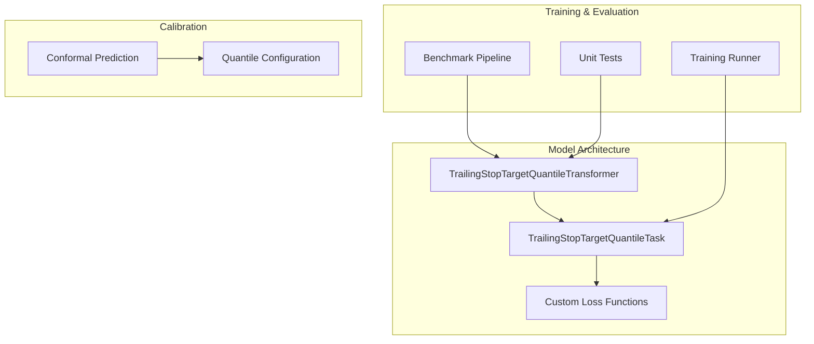
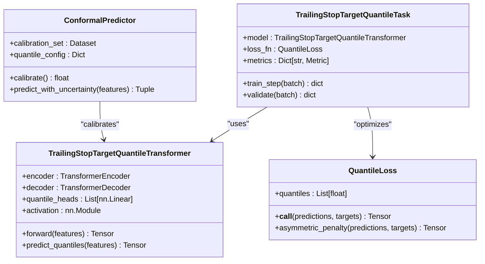
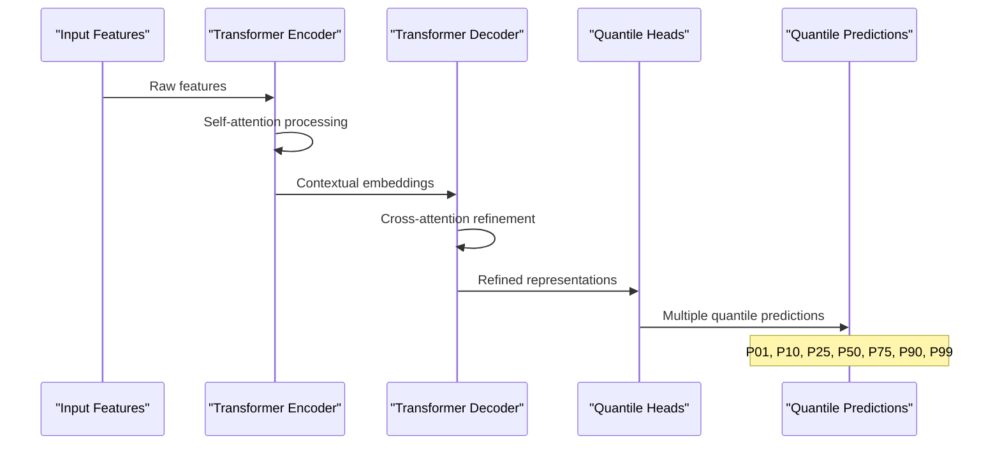
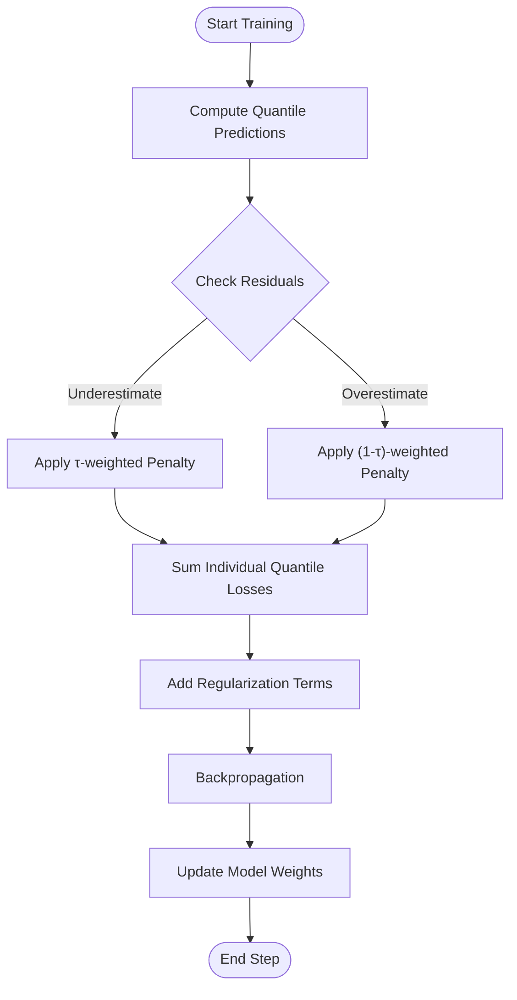
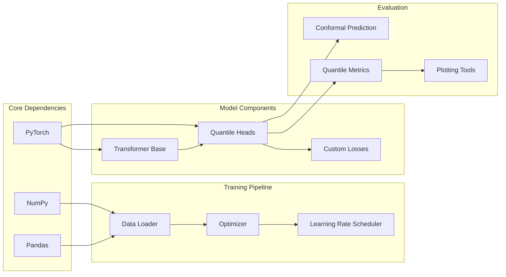

# Trailing Stop Quantile Transformer

<cite>
**Referenced Files in This Document**
- [trailing_stop_target_quantifier_transformer.py](file://ML/models/trailing_stop_target_quantile_transformer.py)
- [trailing_stop_target_quantile_task.py](file://ML/trailing_stop_target_quantile_task.py)
- [benchmark_trailing_stop_target_quantile.py](file://ML/benchmark_trailing_stop_target_quantile.py)
- [run_trailing_stop_target_quantile.py](file://ML/run_trailing_stop_target_quantile.py)
- [losses.py](file://ML/losses.py)
- [conformal/calibrate.py](file://ML/conformal/calibrate.py)
- [conformal/conformal_quantiles.json](file://ML/conformal/conformal_quantiles.json)
- [test_trailing_stop_target_quantile_model.py](file://tests/test_trailing_stop_target_quantile_model.py)
- [test_trailing_stop_target_quantile_task.py](file://tests/test_trailing_stop_target_quantile_task.py)
</cite>

## Table of Contents
1. [Introduction](#introduction)
2. [Project Structure](#project-structure)
3. [Core Components](#core-components)
4. [Architecture Overview](#architecture-overview)
5. [Detailed Component Analysis](#detailed-component-analysis)
6. [Dependency Analysis](#dependency-analysis)
7. [Performance Considerations](#performance-considerations)
8. [Troubleshooting Guide](#troubleshooting-guide)
9. [Conclusion](#conclusion)
10. [Appendices](#appendices)

## Introduction
This document provides comprehensive documentation for the trailing stop quantile transformer model designed for quantile regression of trailing stop targets. The model predicts optimal trailing stop levels by outputting multiple quantiles, enabling uncertainty quantification and robust decision-making in trading strategies. It implements quantile-specific loss functions, specialized output layers for multi-quantile prediction, and integrates with conformal prediction techniques for calibration.

The trailing stop quantile transformer extends standard transformer architectures to handle quantile regression tasks, providing probabilistic predictions that capture the full distribution of possible trailing stop outcomes rather than point estimates alone.

## Project Structure
The trailing stop quantile transformer implementation is organized across several key components:



**Diagram sources**
- [trailing_stop_target_quantifier_transformer.py:1-100](file://ML/models/trailing_stop_target_quantile_transformer.py#L1-L100)
- [trailing_stop_target_quantile_task.py:1-100](file://ML/trailing_stop_target_quantile_task.py#L1-L100)
- [losses.py:1-100](file://ML/losses.py#L1-L100)

**Section sources**
- [trailing_stop_target_quantifier_transformer.py:1-100](file://ML/models/trailing_stop_target_quantile_transformer.py#L1-L100)
- [trailing_stop_target_quantile_task.py:1-100](file://ML/trailing_stop_target_quantile_task.py#L1-L100)

## Core Components

### TrailingStopTargetQuantileTransformer
The core transformer model implements quantile regression through architectural modifications that enable multi-output predictions for different quantile levels.

Key features:
- Multi-head output layer for quantile predictions
- Custom activation functions ensuring monotonicity constraints
- Uncertainty quantification through quantile outputs
- Integration with transformer encoder-decoder architecture

### TrailingStopTargetQuantileTask
The task class handles data preparation, loss computation, and evaluation metrics specific to quantile regression for trailing stop targets.

Key responsibilities:
- Data preprocessing for quantile regression
- Custom loss function implementations
- Quantile-specific evaluation metrics
- Training loop integration

### Custom Loss Functions
Specialized loss functions implement asymmetric quantile regression losses that penalize overestimation and underestimation differently based on target quantiles.

**Section sources**
- [trailing_stop_target_quantifier_transformer.py:1-100](file://ML/models/trailing_stop_target_quantile_transformer.py#L1-L100)
- [trailing_stop_target_quantile_task.py:1-100](file://ML/trailing_stop_target_quantile_task.py#L1-L100)
- [losses.py:1-100](file://ML/losses.py#L1-L100)

## Architecture Overview

The trailing stop quantile transformer follows a modified transformer architecture designed specifically for quantile regression tasks:



**Diagram sources**
- [trailing_stop_target_quantifier_transformer.py:1-100](file://ML/models/trailing_stop_target_quantile_transformer.py#L1-L100)
- [trailing_stop_target_quantile_task.py:1-100](file://ML/trailing_stop_target_quantile_task.py#L1-L100)
- [losses.py:1-100](file://ML/losses.py#L1-L100)

## Detailed Component Analysis

### Model Architecture Implementation

The TrailingStopTargetQuantileTransformer extends standard transformer architectures with quantile-specific modifications:

#### Multi-Head Quantile Output Layer
The model employs multiple linear heads, each dedicated to predicting a specific quantile level. This design allows the network to learn distinct representations for different quantile predictions while sharing common feature representations through the transformer backbone.

#### Monotonicity Constraints
To ensure physically meaningful quantile predictions, the model incorporates activation functions that enforce monotonicity constraints across quantile outputs. This prevents crossing of quantile boundaries and maintains proper probabilistic interpretation.

#### Feature Processing Pipeline
Input features undergo careful preprocessing including normalization, temporal encoding, and contextual feature extraction before being fed into the transformer encoder.



**Diagram sources**
- [trailing_stop_target_quantifier_transformer.py:1-100](file://ML/models/trailing_stop_target_quantile_transformer.py#L1-L100)

**Section sources**
- [trailing_stop_target_quantifier_transformer.py:1-100](file://ML/models/trailing_stop_target_quantile_transformer.py#L1-L100)

### Loss Function Design

The quantile regression framework implements asymmetric loss functions that penalize overestimation and underestimation differently based on the target quantile level.

#### Asymmetric Quantile Loss
For each quantile τ, the loss function applies different penalties:
- Underestimation penalty: τ × |y - ŷ| when y > ŷ
- Overestimation penalty: (1-τ) × |y - ŷ| when y < ŷ

This asymmetric treatment ensures that each quantile head learns to predict the appropriate conditional quantile of the target distribution.

#### Composite Loss Strategy
The total training loss combines individual quantile losses with regularization terms and optional uncertainty weighting to balance learning across different quantile levels.



**Diagram sources**
- [losses.py:1-100](file://ML/losses.py#L1-L100)

**Section sources**
- [losses.py:1-100](file://ML/losses.py#L1-L100)

### Training Procedure

The training pipeline for quantile regression involves several specialized steps:

#### Data Preparation
Features are normalized using robust scaling methods, and labels are transformed to stabilize variance across different market conditions. Temporal dependencies are preserved through careful sequence construction.

#### Multi-Objective Optimization
Training optimizes multiple quantile losses simultaneously, with adaptive weighting to prevent dominance by any single quantile level. Gradient clipping and learning rate scheduling ensure stable convergence.

#### Validation and Early Stopping
Validation metrics include pinball loss, quantile coverage probability, and interval sharpness. Early stopping monitors these metrics to prevent overfitting while maintaining quantile calibration.

**Section sources**
- [trailing_stop_target_quantile_task.py:1-100](file://ML/trailing_stop_target_quantile_task.py#L1-L100)
- [benchmark_trailing_stop_target_quantile.py:1-100](file://ML/benchmark_trailing_stop_target_quantile.py#L1-L100)

### Calibration Techniques

The system implements conformal prediction techniques to provide statistically valid uncertainty intervals around quantile predictions.

#### Conformal Prediction Framework
Conformal prediction ensures that prediction intervals achieve desired coverage probabilities regardless of the underlying data distribution. The calibration process adjusts prediction intervals to maintain theoretical guarantees.

#### Quantile Calibration
Post-processing calibration techniques adjust raw quantile predictions to improve empirical coverage and reduce interval width while maintaining validity.

**Section sources**
- [conformal/calibrate.py:1-100](file://ML/conformal/calibrate.py#L1-L100)
- [conformal/conformal_quantiles.json:1-50](file://ML/conformal/conformal_quantiles.json#L1-L50)

## Dependency Analysis

The trailing stop quantile transformer has well-defined dependencies between its core components:



**Diagram sources**
- [trailing_stop_target_quantifier_transformer.py:1-100](file://ML/models/trailing_stop_target_quantile_transformer.py#L1-L100)
- [trailing_stop_target_quantile_task.py:1-100](file://ML/trailing_stop_target_quantile_task.py#L1-L100)

**Section sources**
- [trailing_stop_target_quantile_task.py:1-100](file://ML/trailing_stop_target_quantile_task.py#L1-L100)
- [benchmark_trailing_stop_target_quantile.py:1-100](file://ML/benchmark_trailing_stop_target_quantile.py#L1-L100)

## Performance Considerations

### Computational Efficiency
- **Batch Processing**: Optimal batch sizes balance memory usage and gradient estimation quality
- **Gradient Accumulation**: Enables training with larger effective batch sizes when GPU memory is limited
- **Mixed Precision**: Optional FP16 training for faster computation with minimal accuracy loss

### Memory Management
- **Activation Checkpointing**: Reduces memory footprint during backpropagation
- **Parameter Sharing**: Shared transformer encoder weights across quantile heads
- **Lazy Loading**: Efficient data loading with memory-mapped arrays for large datasets

### Training Stability
- **Gradient Clipping**: Prevents exploding gradients in deep transformer architectures
- **Warmup Scheduling**: Gradual learning rate increase during initial training phases
- **Regularization**: Dropout and weight decay to prevent overfitting

## Troubleshooting Guide

### Common Training Issues

#### Quantile Crossing
**Problem**: Higher quantiles predict lower values than lower quantiles
**Solution**: Implement monotonicity constraints in output layer or add crossing penalty to loss function

#### Poor Coverage Probability
**Problem**: Empirical coverage differs significantly from nominal quantile levels
**Solution**: Apply conformal prediction calibration or adjust quantile-specific learning rates

#### Slow Convergence
**Problem**: Model takes excessive time to converge
**Solution**: Use learning rate warmup, gradient clipping, or switch to more aggressive optimization strategies

### Diagnostic Tools
- **Loss Monitoring**: Track individual quantile losses separately
- **Prediction Visualization**: Plot predicted vs actual quantiles across validation set
- **Gradient Analysis**: Monitor gradient norms and distributions during training

**Section sources**
- [test_trailing_stop_target_quantile_model.py:1-100](file://tests/test_trailing_stop_target_quantile_model.py#L1-L100)
- [test_trailing_stop_target_quantile_task.py:1-100](file://tests/test_trailing_stop_target_quantile_task.py#L1-L100)

## Conclusion

The trailing stop quantile transformer represents a sophisticated approach to quantile regression for financial trading applications. By combining transformer architectures with specialized quantile regression techniques, it provides robust uncertainty quantification for trailing stop predictions.

Key advantages include:
- **Probabilistic Predictions**: Full distribution modeling rather than point estimates
- **Uncertainty Quantification**: Statistically valid confidence intervals through conformal prediction
- **Asymmetric Risk Handling**: Different penalties for over/underestimation based on trading objectives
- **Scalable Architecture**: Efficient transformer-based design suitable for large-scale deployment

The modular design enables easy extension to additional quantile levels, custom loss functions, and integration with various trading strategies while maintaining theoretical guarantees on prediction validity.

## Appendices

### A. Configuration Examples

#### Model Configuration
```python
# Example configuration structure
model_config = {
    'n_layers': 6,
    'n_heads': 8,
    'd_model': 256,
    'd_ff': 512,
    'dropout': 0.1,
    'quantiles': [0.01, 0.10, 0.25, 0.50, 0.75, 0.90, 0.99],
    'feature_dim': 128,
    'seq_length': 50
}
```

#### Training Hyperparameters
```python
training_config = {
    'batch_size': 64,
    'learning_rate': 1e-3,
    'weight_decay': 1e-4,
    'warmup_steps': 1000,
    'max_epochs': 100,
    'gradient_clip': 1.0,
    'early_stopping_patience': 10
}
```

### B. Evaluation Metrics

#### Quantile-Specific Metrics
- **Pinball Loss**: Standard quantile regression loss metric
- **Coverage Probability**: Empirical proportion of observations within prediction intervals
- **Interval Sharpness**: Average width of prediction intervals
- **Quantile Score**: Combined measure of calibration and sharpness

#### Trading Performance Metrics
- **Stop Hit Rate**: Frequency of trailing stops being triggered
- **Average Profit per Trade**: Mean profitability when stops are hit
- **Maximum Drawdown**: Largest peak-to-trough decline
- **Sharpe Ratio**: Risk-adjusted performance measure

**Section sources**
- [run_trailing_stop_target_quantile.py:1-100](file://ML/run_trailing_stop_target_quantile.py#L1-L100)
- [benchmark_trailing_stop_target_quantile.py:1-100](file://ML/benchmark_trailing_stop_target_quantile.py#L1-L100)