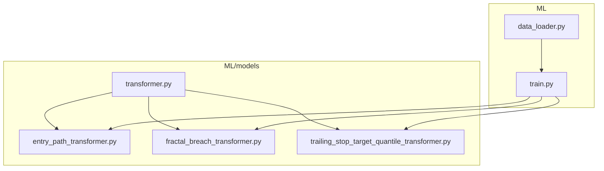
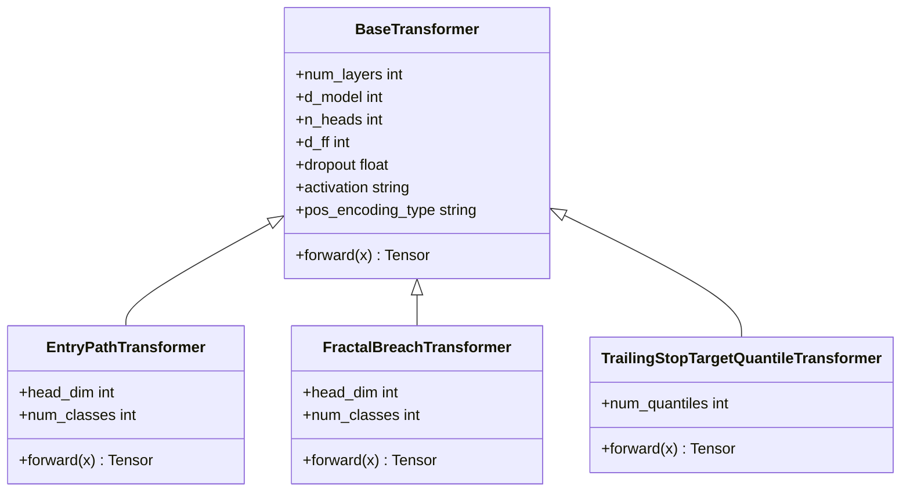
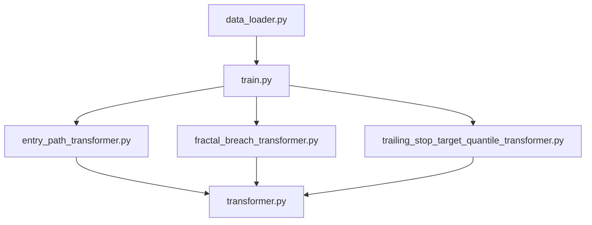

# Transformer Models

<cite>
**Referenced Files in This Document**
- [transformer.py](file://ML/models/transformer.py)
- [entry_path_transformer.py](file://ML/models/entry_path_transformer.py)
- [fractal_breach_transformer.py](file://ML/models/fractal_breach_transformer.py)
- [trailing_stop_target_quantile_transformer.py](file://ML/models/trailing_stop_target_quantile_transformer.py)
- [train.py](file://ML/train.py)
- [data_loader.py](file://ML/data_loader.py)
</cite>

## Table of Contents
1. [Introduction](#introduction)
2. [Project Structure](#project-structure)
3. [Core Components](#core-components)
4. [Architecture Overview](#architecture-overview)
5. [Detailed Component Analysis](#detailed-component-analysis)
6. [Dependency Analysis](#dependency-analysis)
7. [Performance Considerations](#performance-considerations)
8. [Troubleshooting Guide](#troubleshooting-guide)
9. [Conclusion](#conclusion)
10. [Appendices](#appendices)

## Introduction
This document explains the transformer-based model architectures used in SoSimple for financial prediction tasks. It covers the base transformer implementation and three specialized variants:
- entry_path_transformer for price path prediction
- fractal_breach_transformer for stop-loss breach detection
- trailing_stop_target_quantile_transformer for quantile regression of trailing stops

The focus is on attention mechanisms, positional encodings, task-specific adaptations, configuration parameters, layer specifications, input/output tensor shapes, and integration with the training pipeline. Where applicable, code examples are provided as references to source files rather than inline code blocks.

## Project Structure
Transformer models are implemented under ML/models. The base transformer provides a reusable encoder stack with multi-head self-attention and feed-forward layers. Specialized transformers extend this base to implement different heads and loss functions tailored to specific trading tasks. Training orchestration and data loading are handled by modules under ML/train.py and ML/data_loader.py.

**Diagram sources**
- [transformer.py](file://ML/models/transformer.py)
- [entry_path_transformer.py](file://ML/models/entry_path_transformer.py)
- [fractal_breach_transformer.py](file://ML/models/fractal_breach_transformer.py)
- [trailing_stop_target_quantile_transformer.py](file://ML/models/trailing_stop_target_quantile_transformer.py)
- [train.py](file://ML/train.py)
- [data_loader.py](file://ML/data_loader.py)

**Section sources**
- [transformer.py](file://ML/models/transformer.py)
- [entry_path_transformer.py](file://ML/models/entry_path_transformer.py)
- [fractal_breach_transformer.py](file://ML/models/fractal_breach_transformer.py)
- [trailing_stop_target_quantile_transformer.py](file://ML/models/trailing_stop_target_quantile_transformer.py)
- [train.py](file://ML/train.py)
- [data_loader.py](file://ML/data_loader.py)

## Core Components
- Base Transformer Encoder: Implements multi-head self-attention, residual connections, layer normalization, and position-wise feed-forward networks. Supports configurable depth, hidden dimensionality, number of attention heads, dropout, and activation functions.
- Positional Encoding: Adds learnable or fixed positional signals to token embeddings so the model can capture temporal order in sequences.
- Task Heads: Each specialized transformer adds a head appropriate to its target (e.g., classification, regression, quantile outputs).

Key responsibilities:
- Attention mechanism computes context-aware representations across time steps.
- Positional encoding injects sequence order information.
- Heads map encoder outputs to task-specific predictions.

Configuration parameters typically include:
- num_layers: number of transformer blocks
- d_model: embedding and hidden dimension
- n_heads: number of attention heads
- d_ff: feed-forward dimension
- dropout: dropout rate
- activation: activation function name
- pos_encoding_type: type of positional encoding

Input/output shapes:
- Input: batch_size x seq_len x feature_dim
- Encoder output: batch_size x seq_len x d_model
- Head outputs vary by task (see specialized sections)

**Section sources**
- [transformer.py](file://ML/models/transformer.py)

## Architecture Overview
The base transformer serves as a shared backbone. Specialized transformers inherit from it and customize the forward pass and head layers to produce task-specific outputs.

**Diagram sources**
- [transformer.py](file://ML/models/transformer.py)
- [entry_path_transformer.py](file://ML/models/entry_path_transformer.py)
- [fractal_breach_transformer.py](file://ML/models/fractal_breach_transformer.py)
- [trailing_stop_target_quantile_transformer.py](file://ML/models/trailing_stop_target_quantile_transformer.py)

## Detailed Component Analysis

### Base Transformer Implementation
- Multi-head self-attention: Computes scaled dot-product attention across tokens; supports masking if needed.
- Feed-forward network: Two linear layers with activation and dropout.
- Residual connections and layer normalization after attention and FFN.
- Positional encoding: Fixed sinusoidal or learned embeddings added to token embeddings.
- Forward pass: Embedding -> positional encoding -> stacked transformer blocks -> optional pooling or token selection -> head.

Typical configuration keys:
- num_layers, d_model, n_heads, d_ff, dropout, activation, pos_encoding_type

Input/output:
- Input shape: [batch_size, seq_len, feature_dim]
- Output shape: [batch_size, seq_len, d_model] before head mapping

Integration points:
- Data loader supplies batches of sequences aligned to task labels.
- Training loop uses task-specific loss and optimizer settings.

**Section sources**
- [transformer.py](file://ML/models/transformer.py)

### Entry Path Transformer (Price Path Prediction)
Purpose: Predict future price path characteristics given historical features up to an entry point.

Adaptations:
- Head design: Classification or regression head depending on target formulation (e.g., direction classes or continuous path metrics).
- Sequence handling: May use last-token representation or mean-pooling over relevant segment.
- Loss: Cross-entropy for classification or MSE/Huber for regression targets.

Configuration highlights:
- num_classes or target_dim
- head_dropout
- pooling_strategy (last_token, mean_pool, attention_pool)

Input/output:
- Input: [batch_size, seq_len, feature_dim]
- Output: [batch_size, num_classes] for classification or [batch_size, target_dim] for regression

Training integration:
- Uses label tensors produced by entry path labeling routines.
- Optimizer and scheduler configured in training script.

Example references:
- Model instantiation and forward pass patterns are defined in the module file.

**Section sources**
- [entry_path_transformer.py](file://ML/models/entry_path_transformer.py)

### Fractal Breach Transformer (Stop-Loss Breach Detection)
Purpose: Detect whether price will breach a stop-loss level within a horizon based on fractal geometry and price action features.

Adaptations:
- Head design: Binary or multi-class classifier indicating breach probability or severity.
- Temporal focus: Emphasizes recent bars where breach risk increases; may incorporate attention masks to ignore post-entry noise.
- Loss: Binary cross-entropy or focal loss to handle imbalance.

Configuration highlights:
- num_classes (often 2)
- class_weight or focal_loss_gamma
- attention_mask usage

Input/output:
- Input: [batch_size, seq_len, feature_dim]
- Output: [batch_size, num_classes] probabilities

Training integration:
- Labels derived from triple-bar or fractal stop logic.
- Balanced sampling or weighting applied during training.

Example references:
- See module for head construction and forward method.

**Section sources**
- [fractal_breach_transformer.py](file://ML/models/fractal_breach_transformer.py)

### Trailing Stop Target Quantile Transformer (Quantile Regression)
Purpose: Predict quantiles of trailing stop outcomes to provide uncertainty estimates and robust decision-making.

Adaptations:
- Head design: Outputs multiple quantile values per sample (e.g., 0.1, 0.5, 0.9).
- Loss: Pinball loss across quantiles to train distributional forecasts.
- Calibration: Optional conformal calibration step outside the model.

Configuration highlights:
- num_quantiles
- quantile_levels list
- pinball_loss_alpha scaling

Input/output:
- Input: [batch_size, seq_len, feature_dim]
- Output: [batch_size, num_quantiles] predicted quantiles

Training integration:
- Targets computed from trailing stop mechanics.
- Training loop aggregates pinball loss across quantiles.

Example references:
- Module defines quantile head and loss aggregation.

**Section sources**
- [trailing_stop_target_quantile_transformer.py](file://ML/models/trailing_stop_target_quantile_transformer.py)

### Attention Mechanisms and Positional Encodings
- Attention: Scaled dot-product with multiple heads; allows each token to attend to all others, capturing long-range dependencies across price sequences.
- Positional encoding: Injects order information via fixed sinusoidal or learned vectors; essential for temporal modeling without recurrence.
- Masking: Optional causal masking for autoregressive scenarios (not required for standard supervised forecasting here).

These components are implemented in the base transformer and inherited by specialized variants.

**Section sources**
- [transformer.py](file://ML/models/transformer.py)

## Dependency Analysis
Specialized transformers depend on the base transformer for core functionality. Training scripts import these models and configure them according to task requirements. Data loaders supply sequences and labels aligned to each task’s contract.

**Diagram sources**
- [data_loader.py](file://ML/data_loader.py)
- [train.py](file://ML/train.py)
- [entry_path_transformer.py](file://ML/models/entry_path_transformer.py)
- [fractal_breach_transformer.py](file://ML/models/fractal_breach_transformer.py)
- [trailing_stop_target_quantile_transformer.py](file://ML/models/trailing_stop_target_quantile_transformer.py)
- [transformer.py](file://ML/models/transformer.py)

**Section sources**
- [data_loader.py](file://ML/data_loader.py)
- [train.py](file://ML/train.py)
- [transformer.py](file://ML/models/transformer.py)
- [entry_path_transformer.py](file://ML/models/entry_path_transformer.py)
- [fractal_breach_transformer.py](file://ML/models/fractal_breach_transformer.py)
- [trailing_stop_target_quantile_transformer.py](file://ML/models/trailing_stop_target_quantile_transformer.py)

## Performance Considerations
- Sequence length: Longer sequences increase memory and compute; consider truncation or chunking strategies.
- Batch size: Larger batches improve throughput but require more memory; tune based on GPU capacity.
- Attention complexity: O(seq_len^2); reduce seq_len or use efficient attention variants if needed.
- Dropout and regularization: Prevent overfitting; tune dropout rates per task.
- Mixed precision: Enable FP16/BF16 training for speedups when supported.
- Gradient accumulation: Simulate larger effective batch sizes when memory is constrained.

[No sources needed since this section provides general guidance]

## Troubleshooting Guide
Common issues and resolutions:
- Shape mismatches: Ensure input tensors match expected [batch_size, seq_len, feature_dim]; verify feature_dim equals model’s input projection size.
- NaN losses: Check label ranges, normalize inputs, and verify loss implementations (especially pinball loss for quantiles).
- Overfitting: Increase dropout, add weight decay, or reduce model capacity (d_model, num_layers).
- Imbalanced classes: Use class weights or focal loss for breach detection tasks.
- Calibration drift: Apply conformal calibration post-training for quantile outputs.

**Section sources**
- [train.py](file://ML/train.py)
- [data_loader.py](file://ML/data_loader.py)

## Conclusion
SoSimple’s transformer suite provides a flexible foundation for financial prediction tasks. The base encoder captures temporal dependencies through attention and positional encodings, while specialized heads adapt the architecture to price path prediction, stop-loss breach detection, and quantile regression of trailing stops. Proper configuration, careful data preparation, and robust training practices are key to achieving reliable performance.

[No sources needed since this section summarizes without analyzing specific files]

## Appendices

### Model Instantiation Examples
- Instantiate base transformer with desired hyperparameters.
- Instantiate specialized transformers by passing task-specific configs (e.g., num_classes, num_quantiles).
- Reference instantiation patterns in respective module files.

**Section sources**
- [transformer.py](file://ML/models/transformer.py)
- [entry_path_transformer.py](file://ML/models/entry_path_transformer.py)
- [fractal_breach_transformer.py](file://ML/models/fractal_breach_transformer.py)
- [trailing_stop_target_quantile_transformer.py](file://ML/models/trailing_stop_target_quantile_transformer.py)

### Forward Pass Patterns
- Prepare input tensor [batch_size, seq_len, feature_dim].
- Call model.forward(x) to obtain task-specific outputs.
- For quantile models, interpret outputs as predicted quantiles at specified levels.

**Section sources**
- [entry_path_transformer.py](file://ML/models/entry_path_transformer.py)
- [fractal_breach_transformer.py](file://ML/models/fractal_breach_transformer.py)
- [trailing_stop_target_quantile_transformer.py](file://ML/models/trailing_stop_target_quantile_transformer.py)

### Custom Modifications
- Add new attention heads by extending the base transformer and overriding forward.
- Introduce custom positional encodings by modifying the encoder initialization.
- Implement alternative pooling strategies for sequence aggregation.

**Section sources**
- [transformer.py](file://ML/models/transformer.py)