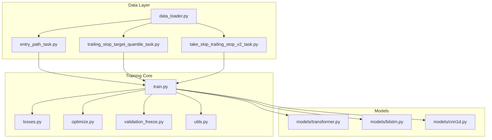
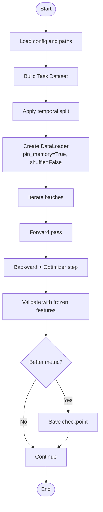
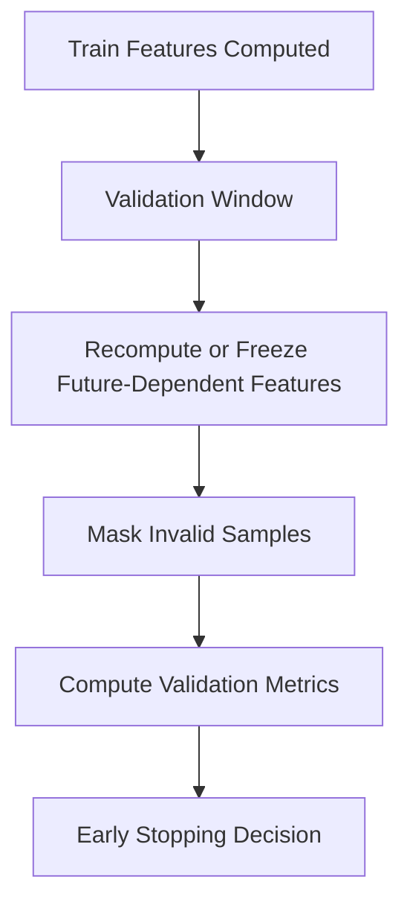
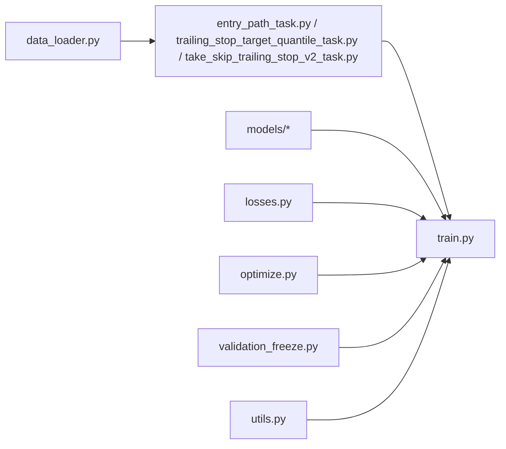

# Training Framework

<cite>
**Referenced Files in This Document**
- [train.py](file://ML/train.py)
- [data_loader.py](file://ML/data_loader.py)
- [losses.py](file://ML/losses.py)
- [optimize.py](file://ML/optimize.py)
- [validation_freeze.py](file://ML/validation_freeze.py)
- [entry_path_task.py](file://ML/entry_path_task.py)
- [trailing_stop_target_quantile_task.py](file://ML/trailing_stop_target_quantile_task.py)
- [take_skip_trailing_stop_v2_task.py](file://ML/take_skip_trailing_stop_v2_task.py)
- [models/transformer.py](file://ML/models/transformer.py)
- [models/bilstm.py](file://ML/models/bilstm.py)
- [models/cnn1d.py](file://ML/models/cnn1d.py)
- [utils.py](file://ML/utils.py)
</cite>

## Table of Contents
1. [Introduction](#introduction)
2. [Project Structure](#project-structure)
3. [Core Components](#core-components)
4. [Architecture Overview](#architecture-overview)
5. [Detailed Component Analysis](#detailed-component-analysis)
6. [Dependency Analysis](#dependency-analysis)
7. [Performance Considerations](#performance-considerations)
8. [Troubleshooting Guide](#troubleshooting-guide)
9. [Conclusion](#conclusion)
10. [Appendices](#appendices)

## Introduction
This document explains the ML training framework used in SoSimple for financial time series modeling. It covers the training loop, loss design across prediction tasks, PyTorch optimization strategies, data loading and batching, memory management for large datasets, validation freeze to prevent leakage, hyperparameter tuning with Optuna, early stopping, checkpointing, and practical examples for configuration, custom losses, and debugging.

## Project Structure
The ML training system is organized around a few core modules:
- Data pipeline and task definitions
- Model implementations (Transformers, BiLSTM, CNN1D)
- Loss functions tailored to classification, regression, quantiles, and multi-task outputs
- Training orchestration (loop, optimizer, scheduler, early stopping, checkpoints)
- Validation freeze utilities ensuring temporal integrity
- Hyperparameter search via Optuna



**Diagram sources**
- [data_loader.py](file://ML/data_loader.py)
- [entry_path_task.py](file://ML/entry_path_task.py)
- [trailing_stop_target_quantile_task.py](file://ML/trailing_stop_target_quantile_task.py)
- [take_skip_trailing_stop_v2_task.py](file://ML/take_skip_trailing_stop_v2_task.py)
- [models/transformer.py](file://ML/models/transformer.py)
- [models/bilstm.py](file://ML/models/bilstm.py)
- [models/cnn1d.py](file://ML/models/cnn1d.py)
- [train.py](file://ML/train.py)
- [losses.py](file://ML/losses.py)
- [optimize.py](file://ML/optimize.py)
- [validation_freeze.py](file://ML/validation_freeze.py)
- [utils.py](file://ML/utils.py)

**Section sources**
- [train.py](file://ML/train.py)
- [data_loader.py](file://ML/data_loader.py)
- [losses.py](file://ML/losses.py)
- [optimize.py](file://ML/optimize.py)
- [validation_freeze.py](file://ML/validation_freeze.py)
- [entry_path_task.py](file://ML/entry_path_task.py)
- [trailing_stop_target_quantile_task.py](file://ML/trailing_stop_target_quantile_task.py)
- [take_skip_trailing_stop_v2_task.py](file://ML/take_skip_trailing_stop_v2_task.py)
- [models/transformer.py](file://ML/models/transformer.py)
- [models/bilstm.py](file://ML/models/bilstm.py)
- [models/cnn1d.py](file://ML/models/cnn1d.py)
- [utils.py](file://ML/utils.py)

## Core Components
- Training loop: orchestrates epochs, batches, forward/backward passes, logging, validation, early stopping, and checkpointing.
- Data pipeline: constructs PyTorch datasets and dataloaders per task, supports streaming or memory-mapped I/O for large financial datasets, and enforces temporal splits.
- Loss functions: classification cross-entropy, regression MSE/Huber, quantile loss, and multi-task combinations.
- Optimization: AdamW, learning rate schedulers, gradient clipping, mixed precision support.
- Validation freeze: ensures no leakage by freezing features/targets computed from future windows during validation.
- Hyperparameter search: Optuna study with objective wrapping the training loop; supports pruning and best model selection.
- Checkpointing: saves best models based on validation metrics and metadata.

**Section sources**
- [train.py](file://ML/train.py)
- [data_loader.py](file://ML/data_loader.py)
- [losses.py](file://ML/losses.py)
- [optimize.py](file://ML/optimize.py)
- [validation_freeze.py](file://ML/validation_freeze.py)
- [entry_path_task.py](file://ML/entry_path_task.py)
- [trailing_stop_target_quantile_task.py](file://ML/trailing_stop_target_quantile_task.py)
- [take_skip_trailing_stop_v2_task.py](file://ML/take_skip_trailing_stop_v2_task.py)
- [utils.py](file://ML/utils.py)

## Architecture Overview
The training architecture follows a modular design where tasks define dataset and label schemas, models implement forward logic, and the training loop coordinates everything.

```mermaid
sequenceDiagram
participant CLI as "CLI/Runner"
participant Task as "Task Dataset"
participant Loader as "DataLoader"
participant Model as "Model"
participant Loss as "Loss Function"
participant Opt as "Optimizer/Scheduler"
participant Val as "Validation Freeze"
participant CKPT as "Checkpoint Manager"
CLI->>Task : Build dataset (train/val/test)
Task-->>CLI : Datasets with temporal split
CLI->>Loader : Create DataLoader (batching, shuffling disabled)
loop Epochs
CLI->>Model : Forward(batch)
Model-->>CLI : Predictions
CLI->>Loss : Compute loss(predictions, targets)
Loss-->>CLI : Scalar loss
CLI->>Opt : backward() + step()
Opt-->>CLI : Updated weights
CLI->>Val : Validate with frozen features
Val-->>CLI : Metrics
CLI->>CKPT : Save if best metric
end
CLI-->>CLI : Finalize and report
```

**Diagram sources**
- [train.py](file://ML/train.py)
- [data_loader.py](file://ML/data_loader.py)
- [losses.py](file://ML/losses.py)
- [optimize.py](file://ML/optimize.py)
- [validation_freeze.py](file://ML/validation_freeze.py)
- [entry_path_task.py](file://ML/entry_path_task.py)
- [trailing_stop_target_quantile_task.py](file://ML/trailing_stop_target_quantile_task.py)
- [take_skip_trailing_stop_v2_task.py](file://ML/take_skip_trailing_stop_v2_task.py)

## Detailed Component Analysis

### Training Loop Implementation
- Orchestrates epoch iteration, batch processing, and device placement.
- Supports gradient accumulation, mixed precision, and gradient clipping.
- Integrates validation with early stopping and checkpoint saving.
- Logs metrics and can resume from checkpoints.

Key responsibilities:
- Construct optimizers and schedulers.
- Manage training state (best metrics, patience).
- Handle exceptions and ensure deterministic behavior.

**Section sources**
- [train.py](file://ML/train.py)
- [optimize.py](file://ML/optimize.py)
- [utils.py](file://ML/utils.py)

### Data Loading Pipeline and Batch Processing
- Task-specific datasets encapsulate feature/target construction and slicing.
- DataLoader disables shuffling to preserve temporal order; uses pin_memory and num_workers for throughput.
- Memory management includes chunked reading, lazy loading, and optional memory mapping for large files.
- Temporal splitting ensures train/val/test boundaries without overlap.



**Diagram sources**
- [data_loader.py](file://ML/data_loader.py)
- [entry_path_task.py](file://ML/entry_path_task.py)
- [trailing_stop_target_quantile_task.py](file://ML/trailing_stop_target_quantile_task.py)
- [take_skip_trailing_stop_v2_task.py](file://ML/take_skip_trailing_stop_v2_task.py)
- [train.py](file://ML/train.py)

**Section sources**
- [data_loader.py](file://ML/data_loader.py)
- [entry_path_task.py](file://ML/entry_path_task.py)
- [trailing_stop_target_quantile_task.py](file://ML/trailing_stop_target_quantile_task.py)
- [take_skip_trailing_stop_v2_task.py](file://ML/take_skip_trailing_stop_v2_task.py)

### Loss Functions Design
- Classification: Cross-entropy with optional class weighting.
- Regression: MSE or Huber for robustness to outliers.
- Quantile: Pinball loss for probabilistic predictions.
- Multi-task: Weighted sum of task-specific losses.

Usage patterns:
- Select loss based on task type.
- Normalize targets when needed.
- Apply masking for invalid samples.

**Section sources**
- [losses.py](file://ML/losses.py)
- [entry_path_task.py](file://ML/entry_path_task.py)
- [trailing_stop_target_quantile_task.py](file://ML/trailing_stop_target_quantile_task.py)
- [take_skip_trailing_stop_v2_task.py](file://ML/take_skip_trailing_stop_v2_task.py)

### Optimization Strategies with PyTorch
- Optimizer: AdamW with weight decay.
- Scheduler: Cosine annealing or ReduceLROnPlateau.
- Gradient clipping to stabilize training.
- Mixed precision via torch.autocast for speed/memory efficiency.

Configuration:
- Learning rate ranges tuned via Optuna.
- Batch size and sequence length trade-offs.
- Early stopping criteria tied to validation metric.

**Section sources**
- [optimize.py](file://ML/optimize.py)
- [train.py](file://ML/train.py)

### Validation Freeze Mechanism
- Ensures no leakage by recomputing or freezing features that depend on future information during validation.
- Applies strict temporal splits and masks out any post-entry signals.
- Validates only on pre-defined windows aligned with trading logic.



**Diagram sources**
- [validation_freeze.py](file://ML/validation_freeze.py)
- [data_loader.py](file://ML/data_loader.py)

**Section sources**
- [validation_freeze.py](file://ML/validation_freeze.py)
- [data_loader.py](file://ML/data_loader.py)

### Hyperparameter Optimization with Optuna
- Objective function wraps training loop and returns validation metric.
- Pruning integrates with Optuna to terminate unpromising trials.
- Search space includes learning rate, batch size, model depth, dropout, and loss weights.

Best practices:
- Use median pruner for stability.
- Log trial parameters and metrics.
- Resume studies when interrupted.

**Section sources**
- [optimize.py](file://ML/optimize.py)
- [train.py](file://ML/train.py)

### Checkpoint Management
- Saves best model based on validation metric and metadata.
- Supports resuming training from last or best checkpoint.
- Stores training configuration and random seeds for reproducibility.

**Section sources**
- [train.py](file://ML/train.py)
- [utils.py](file://ML/utils.py)

### Models
- Transformer: Attention-based sequence modeling with positional encodings.
- BiLSTM: Bidirectional recurrent layers for sequential dependencies.
- CNN1D: 1D convolutions for local pattern extraction.

Each model implements a forward method returning task-specific outputs compatible with the loss functions.

**Section sources**
- [models/transformer.py](file://ML/models/transformer.py)
- [models/bilstm.py](file://ML/models/bilstm.py)
- [models/cnn1d.py](file://ML/models/cnn1d.py)

## Dependency Analysis
The training system has clear separation between data, models, losses, and training orchestration. Dependencies are one-directional: tasks feed into the training loop; models consume inputs and produce outputs consumed by losses; optimization utilities manage parameter updates.



**Diagram sources**
- [data_loader.py](file://ML/data_loader.py)
- [entry_path_task.py](file://ML/entry_path_task.py)
- [trailing_stop_target_quantile_task.py](file://ML/trailing_stop_target_quantile_task.py)
- [take_skip_trailing_stop_v2_task.py](file://ML/take_skip_trailing_stop_v2_task.py)
- [train.py](file://ML/train.py)
- [models/transformer.py](file://ML/models/transformer.py)
- [models/bilstm.py](file://ML/models/bilstm.py)
- [models/cnn1d.py](file://ML/models/cnn1d.py)
- [losses.py](file://ML/losses.py)
- [optimize.py](file://ML/optimize.py)
- [validation_freeze.py](file://ML/validation_freeze.py)
- [utils.py](file://ML/utils.py)

**Section sources**
- [train.py](file://ML/train.py)
- [data_loader.py](file://ML/data_loader.py)
- [losses.py](file://ML/losses.py)
- [optimize.py](file://ML/optimize.py)
- [validation_freeze.py](file://ML/validation_freeze.py)
- [entry_path_task.py](file://ML/entry_path_task.py)
- [trailing_stop_target_quantile_task.py](file://ML/trailing_stop_target_quantile_task.py)
- [take_skip_trailing_stop_v2_task.py](file://ML/take_skip_trailing_stop_v2_task.py)
- [models/transformer.py](file://ML/models/transformer.py)
- [models/bilstm.py](file://ML/models/bilstm.py)
- [models/cnn1d.py](file://ML/models/cnn1d.py)
- [utils.py](file://ML/utils.py)

## Performance Considerations
- Use pin_memory and appropriate num_workers for faster data loading.
- Enable mixed precision to reduce memory footprint and increase throughput.
- Avoid shuffling to maintain temporal order; use deterministic samplers if needed.
- Monitor GPU memory usage and adjust batch sizes accordingly.
- Employ gradient accumulation for effective larger batch sizes.

[No sources needed since this section provides general guidance]

## Troubleshooting Guide
Common issues and resolutions:
- Data leakage: Ensure validation freeze is applied and temporal splits are correct.
- NaN losses: Check target normalization, loss masking, and gradient clipping.
- Slow training: Tune DataLoader workers, enable mixed precision, and verify device placement.
- Overfitting: Increase regularization, reduce model capacity, or augment data.
- Non-reproducible results: Fix random seeds and disable non-deterministic operations.

**Section sources**
- [validation_freeze.py](file://ML/validation_freeze.py)
- [losses.py](file://ML/losses.py)
- [train.py](file://ML/train.py)
- [utils.py](file://ML/utils.py)

## Conclusion
The SoSimple ML training framework provides a robust, modular foundation for financial time series modeling. It emphasizes temporal integrity through validation freeze, flexible loss design for diverse tasks, efficient data pipelines, and comprehensive hyperparameter optimization. The architecture supports multiple model types and scales to large datasets while maintaining reproducibility and performance.

[No sources needed since this section summarizes without analyzing specific files]

## Appendices
- Example configurations: Define task, model, optimizer, and scheduler parameters in a structured config file.
- Custom loss functions: Implement new losses following the interface expected by the training loop.
- Debugging techniques: Use logging hooks, tensor inspection, and small-batch sanity checks.

[No sources needed since this section provides general guidance]