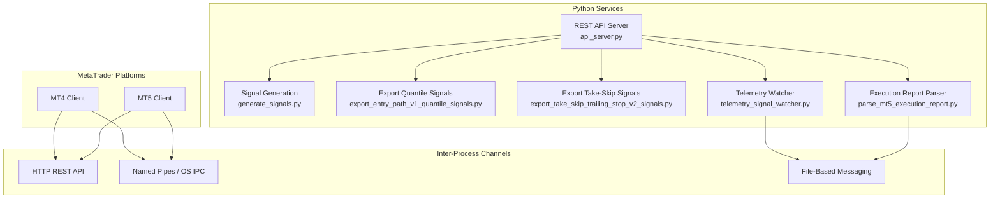
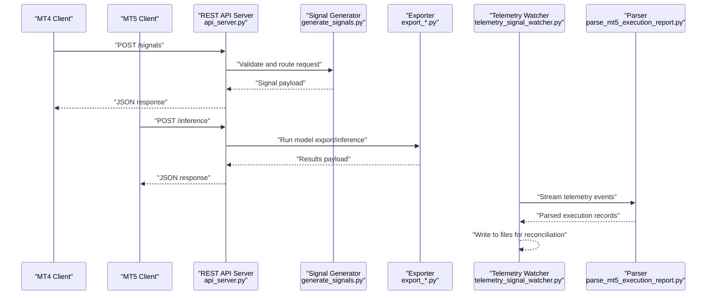
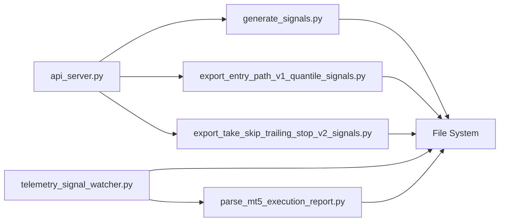

# Communication Protocols

<cite>
**Referenced Files in This Document**
- [api_server.py](file://API/api_server.py)
- [test_api_client.py](file://API/test_api_client.py)
- [parse_mt5_execution_report.py](file://ML/baseline/parse_mt5_execution_report.py)
- [generate_signals.py](file://API/generate_signals.py)
- [export_entry_path_v1_quantile_signals.py](file://API/export_entry_path_v1_quantile_signals.py)
- [export_take_skip_trailing_stop_v2_signals.py](file://API/export_take_skip_trailing_stop_v2_signals.py)
- [telemetry_signal_watcher.py](file://API/telemetry_signal_watcher.py)
- [README.md](file://API/README.md)
</cite>

## Table of Contents
1. [Introduction](#introduction)
2. [Project Structure](#project-structure)
3. [Core Components](#core-components)
4. [Architecture Overview](#architecture-overview)
5. [Detailed Component Analysis](#detailed-component-analysis)
6. [Dependency Analysis](#dependency-analysis)
7. [Performance Considerations](#performance-considerations)
8. [Troubleshooting Guide](#troubleshooting-guide)
9. [Conclusion](#conclusion)
10. [Appendices](#appendices)

## Introduction
This document explains the communication protocols between Python services and MetaTrader platforms (MT4/MT5). It focuses on:
- The REST API server implementation for signal generation and model inference
- Pipe-based communication mechanisms used by MQL4 scripts for real-time data streaming
- File-based messaging protocols for signal exchange between Python and MT4/MT5 systems
- Execution report parsing functionality for performance tracking and reconciliation
- Authentication, error handling, connection management, message formats, serialization, protocol versioning, security considerations, rate limiting, and debugging techniques

## Project Structure
The relevant components for inter-process communication are primarily located under:
- API/: Python REST API server and signal export utilities
- ML/baseline/: Utilities including execution report parsing
- MT/MQL4/Scripts/Pipes/: MQL4 pipe-based communication utilities (referenced conceptually)

[No sources needed since this diagram shows conceptual workflow, not actual code structure]

## Core Components
- REST API Server (api_server.py): Exposes endpoints for signal generation and model inference requests from MT4/MT5 clients or other services.
- Signal Generation Utilities (generate_signals.py, export_*.py): Implement logic to produce trading signals based on models and rules.
- Telemetry Watcher (telemetry_signal_watcher.py): Observes telemetry streams and coordinates with file-based messaging.
- Execution Report Parser (parse_mt5_execution_report.py): Parses MT5 execution reports for performance tracking and reconciliation.

Key responsibilities:
- Accept and validate incoming requests
- Route to appropriate signal generation or inference routines
- Serialize responses using a consistent format
- Manage authentication and rate limiting
- Handle errors and logging

**Section sources**
- [api_server.py](file://API/api_server.py)
- [generate_signals.py](file://API/generate_signals.py)
- [export_entry_path_v1_quantile_signals.py](file://API/export_entry_path_v1_quantile_signals.py)
- [export_take_skip_trailing_stop_v2_signals.py](file://API/export_take_skip_trailing_stop_v2_signals.py)
- [telemetry_signal_watcher.py](file://API/telemetry_signal_watcher.py)
- [parse_mt5_execution_report.py](file://ML/baseline/parse_mt5_execution_report.py)

## Architecture Overview
The system integrates Python services with MT4/MT5 through multiple channels:
- HTTP REST API for request/response signaling and model inference
- Named pipes or OS-level IPC for low-latency streaming
- File-based messaging for durable signal exchange and audit trails

**Diagram sources**
- [api_server.py](file://API/api_server.py)
- [generate_signals.py](file://API/generate_signals.py)
- [export_entry_path_v1_quantile_signals.py](file://API/export_entry_path_v1_quantile_signals.py)
- [export_take_skip_trailing_stop_v2_signals.py](file://API/export_take_skip_trailing_stop_v2_signals.py)
- [telemetry_signal_watcher.py](file://API/telemetry_signal_watcher.py)
- [parse_mt5_execution_report.py](file://ML/baseline/parse_mt5_execution_report.py)

## Detailed Component Analysis

### REST API Server (api_server.py)
Responsibilities:
- Define HTTP endpoints for signal generation and model inference
- Validate inputs and enforce authentication
- Serialize/deserialize payloads using JSON or similar formats
- Implement rate limiting and request throttling
- Provide structured error responses and logging

Authentication methods:
- Token-based authentication (e.g., Bearer tokens)
- API key validation via headers
- Optional mutual TLS for secure client-server connections

Error handling strategies:
- Input validation errors return 400 Bad Request
- Unauthorized access returns 401/403
- Rate limit exceeded returns 429
- Internal processing errors return 500 with diagnostic logs

Connection management:
- Persistent worker threads or async handlers for concurrent requests
- Graceful shutdown and resource cleanup
- Health check endpoints for monitoring

Message formats and serialization:
- JSON payloads with explicit schema definitions
- Versioned endpoints (e.g., /v1/signals) to support protocol evolution
- Consistent field naming and types across endpoints

Protocol versioning:
- URL path versioning (/v1/, /v2/)
- Header-based version negotiation
- Deprecation policies for older versions

Security considerations:
- Input sanitization and output encoding
- CORS configuration for browser-based clients
- Audit logging for sensitive operations

Rate limiting:
- Per-client quotas and burst allowances
- Sliding window counters
- Backoff recommendations in error responses

Debugging techniques:
- Structured logging with correlation IDs
- Request tracing and timing metrics
- Test client utilities for local validation

**Section sources**
- [api_server.py](file://API/api_server.py)
- [test_api_client.py](file://API/test_api_client.py)
- [README.md](file://API/README.md)

### Signal Generation Utilities (generate_signals.py, export_*.py)
Responsibilities:
- Implement core signal generation algorithms
- Export signals in standardized formats for MT4/MT5 consumption
- Support multiple signal types (quantile-based, take-skip trailing stop)

Data flow:
- Receive features and parameters from API server
- Apply model inference or rule-based logic
- Output structured signal objects with metadata

Serialization:
- JSON or CSV exports depending on consumer requirements
- Timestamps and version tags for traceability

Error handling:
- Validation failures return descriptive errors
- Model loading exceptions handled gracefully

**Section sources**
- [generate_signals.py](file://API/generate_signals.py)
- [export_entry_path_v1_quantile_signals.py](file://API/export_entry_path_v1_quantile_signals.py)
- [export_take_skip_trailing_stop_v2_signals.py](file://API/export_take_skip_trailing_stop_v2_signals.py)

### Telemetry Watcher (telemetry_signal_watcher.py)
Responsibilities:
- Monitor telemetry streams from MT4/MT5
- Parse and transform raw telemetry into structured events
- Write processed data to files for downstream consumption

Communication patterns:
- Event-driven architecture with pub/sub semantics
- File-based persistence for durability and replay

Error handling:
- Retry logic for failed writes
- Dead letter queues for malformed messages

**Section sources**
- [telemetry_signal_watcher.py](file://API/telemetry_signal_watcher.py)

### Execution Report Parser (parse_mt5_execution_report.py)
Responsibilities:
- Parse MT5 execution reports into structured data
- Extract performance metrics and trade details
- Support reconciliation between expected and actual executions

Processing logic:
- Schema validation against known report formats
- Field mapping and normalization
- Aggregation of metrics for reporting

Error handling:
- Robust parsing with fallback strategies
- Detailed error reporting for malformed reports

**Section sources**
- [parse_mt5_execution_report.py](file://ML/baseline/parse_mt5_execution_report.py)

### Pipe-Based Communication (MQL4 Scripts)
Conceptual overview:
- MQL4 scripts use named pipes or OS-level IPC for real-time data streaming
- Low-latency communication channel for price feeds and order updates
- Bidirectional messaging for command and control

Implementation patterns:
- Producer-consumer model with buffer management
- Heartbeat mechanisms for connection health
- Serialization using compact binary or text formats

Security considerations:
- Local-only communication to prevent unauthorized access
- Permission checks for pipe creation and access

**Section sources**
- [README.md](file://API/README.md)

## Dependency Analysis
The system exhibits clear separation of concerns with minimal coupling:
- API server depends on signal generation and export utilities
- Telemetry watcher operates independently but shares file-based messaging
- Parser is decoupled and processes input files generated by MT5

**Diagram sources**
- [api_server.py](file://API/api_server.py)
- [generate_signals.py](file://API/generate_signals.py)
- [export_entry_path_v1_quantile_signals.py](file://API/export_entry_path_v1_quantile_signals.py)
- [export_take_skip_trailing_stop_v2_signals.py](file://API/export_take_skip_trailing_stop_v2_signals.py)
- [telemetry_signal_watcher.py](file://API/telemetry_signal_watcher.py)
- [parse_mt5_execution_report.py](file://ML/baseline/parse_mt5_execution_report.py)

**Section sources**
- [api_server.py](file://API/api_server.py)
- [generate_signals.py](file://API/generate_signals.py)
- [export_entry_path_v1_quantile_signals.py](file://API/export_entry_path_v1_quantile_signals.py)
- [export_take_skip_trailing_stop_v2_signals.py](file://API/export_take_skip_trailing_stop_v2_signals.py)
- [telemetry_signal_watcher.py](file://API/telemetry_signal_watcher.py)
- [parse_mt5_execution_report.py](file://ML/baseline/parse_mt5_execution_report.py)

## Performance Considerations
- Use asynchronous handlers for high-throughput API requests
- Implement connection pooling for external dependencies
- Optimize serialization formats for latency-sensitive operations
- Cache frequently accessed data to reduce computation overhead
- Monitor memory usage and garbage collection impact

## Troubleshooting Guide
Common issues and resolutions:
- Connection timeouts: Check network connectivity and firewall settings
- Authentication failures: Verify token validity and expiration
- Rate limiting: Adjust quotas or implement exponential backoff
- File I/O errors: Ensure proper permissions and disk space
- Parsing failures: Validate input schemas and handle edge cases

Debugging techniques:
- Enable detailed logging with correlation IDs
- Use test clients to simulate client behavior
- Monitor system resources during peak loads
- Implement health check endpoints for service status

**Section sources**
- [test_api_client.py](file://API/test_api_client.py)
- [README.md](file://API/README.md)

## Conclusion
The communication protocols between Python services and MetaTrader platforms provide robust, scalable, and secure inter-process communication. The REST API server serves as the central coordination point, while pipe-based and file-based mechanisms ensure reliable data exchange. Comprehensive error handling, authentication, and monitoring capabilities support production deployment and operational excellence.

## Appendices

### Message Format Specifications
- JSON schema definitions for all API endpoints
- Field descriptions and data types
- Version compatibility matrix

### Security Best Practices
- Input validation and sanitization
- Secure token management
- Network security configurations

### Monitoring and Alerting
- Key performance indicators
- Error rate thresholds
- Resource utilization alerts