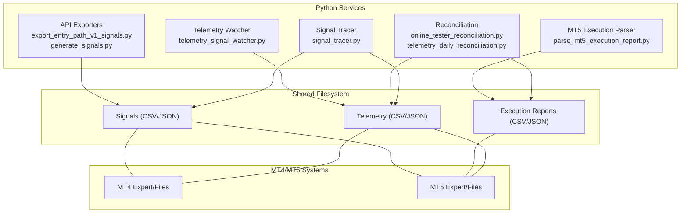
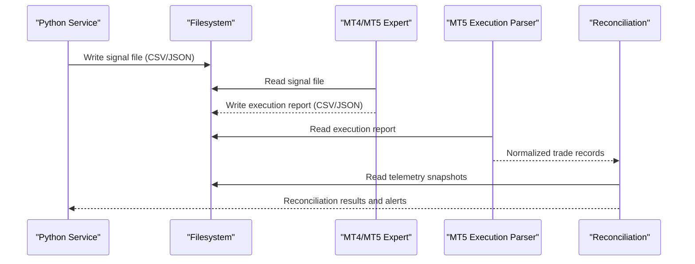
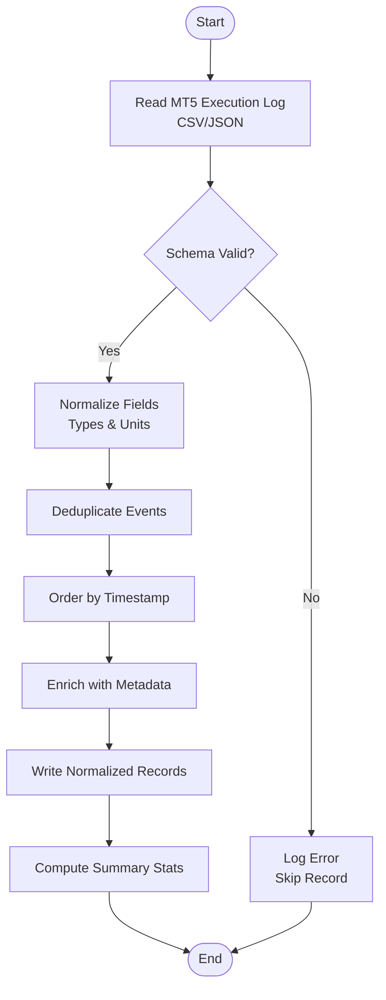
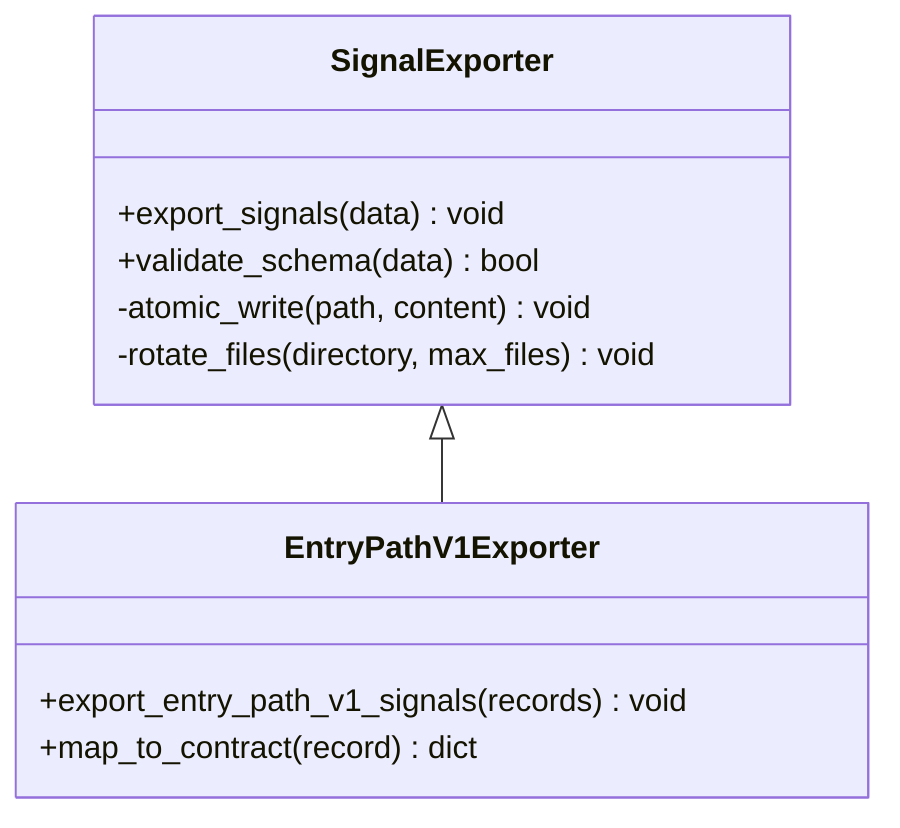
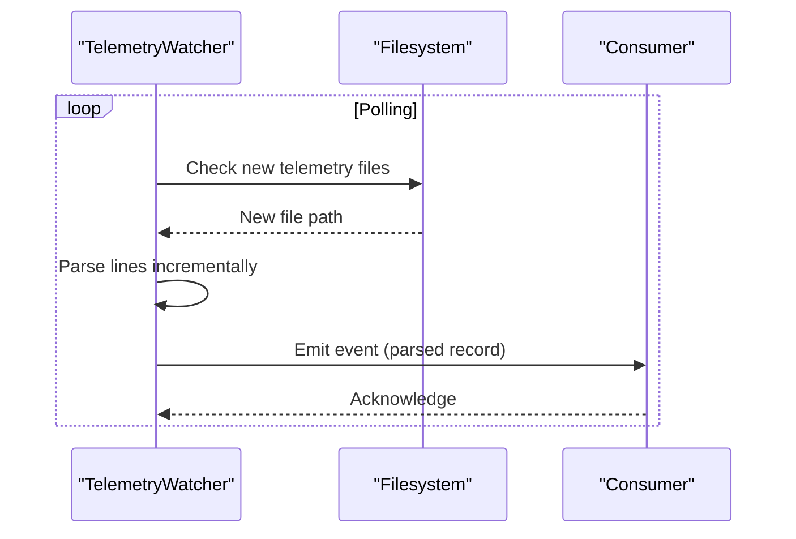
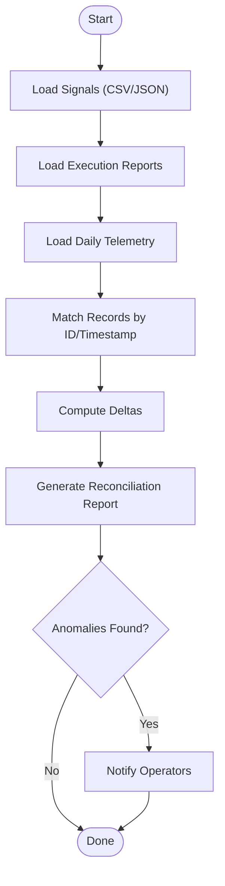
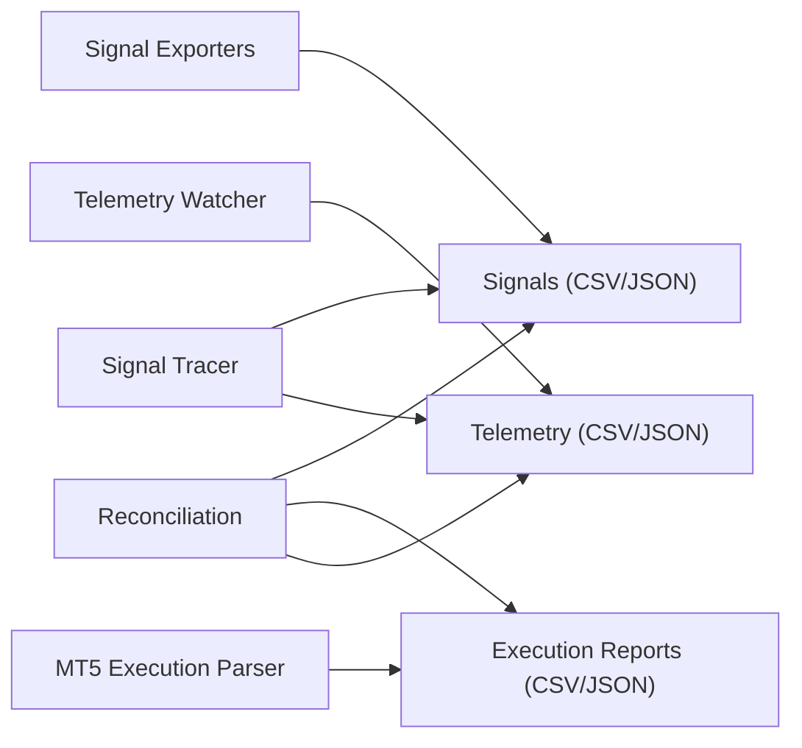

# File-Based Messaging

<cite>
**Referenced Files in This Document**
- [parse_mt5_execution_report.py](file://ML/baseline/parse_mt5_execution_report.py)
- [test_parse_mt5_execution_report.py](file://tests/test_parse_mt5_execution_report.py)
- [telemetry_signal_watcher.py](file://API/telemetry_signal_watcher.py)
- [export_entry_path_v1_signals.py](file://API/export_entry_path_v1_signals.py)
- [generate_signals.py](file://API/generate_signals.py)
- [mt5_signal_schema.py](file://ML/baseline/mt5_signal_schema.py)
- [prepare_mt5_entry_source.py](file://ML/baseline/prepare_mt5_entry_source.py)
- [triple_barrier_mt4_execution.py](file://ML/triple_barrier_mt4_execution.py)
- [online_tester_reconciliation.py](file://ML/online_tester_reconciliation.py)
- [telemetry_daily_reconciliation.py](file://ML/telemetry_daily_reconciliation.py)
- [signal_tracer.py](file://statistics/signal_tracer.py)
- [README.md](file://MT/README.md)
</cite>

## Table of Contents
1. [Introduction](#introduction)
2. [Project Structure](#project-structure)
3. [Core Components](#core-components)
4. [Architecture Overview](#architecture-overview)
5. [Detailed Component Analysis](#detailed-component-analysis)
6. [Dependency Analysis](#dependency-analysis)
7. [Performance Considerations](#performance-considerations)
8. [Troubleshooting Guide](#troubleshooting-guide)
9. [Conclusion](#conclusion)
10. [Appendices](#appendices)

## Introduction
This document describes the file-based messaging protocols used to exchange signals, execution reports, and telemetry between Python services and MT4/MT5 systems. It covers CSV and JSON file formats for signal transmission and reporting, the parsing and reconciliation logic for MT5 execution logs, directory structures, naming conventions, synchronization strategies, and robust I/O practices including validation, error handling, and retries.

## Project Structure
The project organizes file-based communication across several areas:
- API layer exports signals and telemetry watchers
- ML baseline scripts parse MT5 execution logs and prepare entry sources
- Statistics utilities trace signals and reconcile daily telemetry
- MQL documentation outlines MT-side behavior and file usage

**Diagram sources**
- [export_entry_path_v1_signals.py](file://API/export_entry_path_v1_signals.py)
- [generate_signals.py](file://API/generate_signals.py)
- [telemetry_signal_watcher.py](file://API/telemetry_signal_watcher.py)
- [parse_mt5_execution_report.py](file://ML/baseline/parse_mt5_execution_report.py)
- [online_tester_reconciliation.py](file://ML/online_tester_reconciliation.py)
- [telemetry_daily_reconciliation.py](file://ML/telemetry_daily_reconciliation.py)
- [signal_tracer.py](file://statistics/signal_tracer.py)
- [README.md](file://MT/README.md)

**Section sources**
- [README.md](file://MT/README.md)

## Core Components
- Signal exporters produce CSV/JSON files consumed by MT4/MT5 experts. They enforce schema contracts and atomic writes.
- The MT5 execution report parser ingests MT5 log-derived CSV/JSON files, normalizes fields, and outputs reconciled trade records.
- Telemetry watcher monitors incoming telemetry files and forwards events or persists them for downstream analysis.
- Reconciliation modules align Python-generated signals with MT execution outcomes and daily telemetry snapshots.
- Signal tracer provides diagnostic traces linking signals to executions and telemetry entries.

**Section sources**
- [export_entry_path_v1_signals.py](file://API/export_entry_path_v1_signals.py)
- [generate_signals.py](file://API/generate_signals.py)
- [parse_mt5_execution_report.py](file://ML/baseline/parse_mt5_execution_report.py)
- [telemetry_signal_watcher.py](file://API/telemetry_signal_watcher.py)
- [online_tester_reconciliation.py](file://ML/online_tester_reconciliation.py)
- [telemetry_daily_reconciliation.py](file://ML/telemetry_daily_reconciliation.py)
- [signal_tracer.py](file://statistics/signal_tracer.py)

## Architecture Overview
The system uses a shared filesystem as the integration bus:
- Python services write signals and telemetry; MT4/MT5 read these files and write execution reports back.
- Parsing and reconciliation run periodically to ensure consistency and detect drifts.

**Diagram sources**
- [export_entry_path_v1_signals.py](file://API/export_entry_path_v1_signals.py)
- [parse_mt5_execution_report.py](file://ML/baseline/parse_mt5_execution_report.py)
- [telemetry_daily_reconciliation.py](file://ML/telemetry_daily_reconciliation.py)

## Detailed Component Analysis

### MT5 Execution Report Parser
Purpose: Parse MT5 execution logs exported as CSV/JSON, normalize fields, validate data integrity, and output reconciled trade records suitable for downstream analytics and parity checks.

Key responsibilities:
- Input ingestion from MT5 export directories
- Field mapping and type coercion
- Validation rules for required fields and value ranges
- Deduplication and ordering of execution events
- Output of normalized records and summary statistics

**Diagram sources**
- [parse_mt5_execution_report.py](file://ML/baseline/parse_mt5_execution_report.py)
- [test_parse_mt5_execution_report.py](file://tests/test_parse_mt5_execution_report.py)

**Section sources**
- [parse_mt5_execution_report.py](file://ML/baseline/parse_mt5_execution_report.py)
- [test_parse_mt5_execution_report.py](file://tests/test_parse_mt5_execution_report.py)

### Signal Exporters (CSV/JSON)
Purpose: Generate signal files following a defined schema for consumption by MT4/MT5. They ensure consistent field names, types, and atomic writes to avoid partial reads.

Key responsibilities:
- Schema enforcement via contract definitions
- Atomic file writing (write to temp then rename)
- Optional compression and rotation
- Logging and metrics on export volume and latency

**Diagram sources**
- [export_entry_path_v1_signals.py](file://API/export_entry_path_v1_signals.py)
- [generate_signals.py](file://API/generate_signals.py)
- [mt5_signal_schema.py](file://ML/baseline/mt5_signal_schema.py)

**Section sources**
- [export_entry_path_v1_signals.py](file://API/export_entry_path_v1_signals.py)
- [generate_signals.py](file://API/generate_signals.py)
- [mt5_signal_schema.py](file://ML/baseline/mt5_signal_schema.py)

### Telemetry Signal Watcher
Purpose: Monitor incoming telemetry files produced by MT4/MT5, parse them, and forward events or persist them for analysis. Implements retry and backoff for robustness.

Key responsibilities:
- Directory watching and incremental reads
- Parsing telemetry CSV/JSON lines
- Event forwarding to consumers or persistence
- Retry mechanisms with exponential backoff

**Diagram sources**
- [telemetry_signal_watcher.py](file://API/telemetry_signal_watcher.py)

**Section sources**
- [telemetry_signal_watcher.py](file://API/telemetry_signal_watcher.py)

### Reconciliation Modules
Purpose: Align Python-generated signals with MT execution outcomes and daily telemetry snapshots to detect discrepancies and ensure parity.

Key responsibilities:
- Load signals and execution reports
- Match by symbol, timestamp, and order identifiers
- Compute deltas and generate reconciliation reports
- Persist audit trails and alert on anomalies

**Diagram sources**
- [online_tester_reconciliation.py](file://ML/online_tester_reconciliation.py)
- [telemetry_daily_reconciliation.py](file://ML/telemetry_daily_reconciliation.py)

**Section sources**
- [online_tester_reconciliation.py](file://ML/online_tester_reconciliation.py)
- [telemetry_daily_reconciliation.py](file://ML/telemetry_daily_reconciliation.py)

### Signal Tracer
Purpose: Provide diagnostic traces linking signals to executions and telemetry entries, aiding debugging and verification.

Key responsibilities:
- Trace signal lifecycle through file I/O
- Correlate with execution logs and telemetry
- Output human-readable summaries

**Section sources**
- [signal_tracer.py](file://statistics/signal_tracer.py)

### MT4 Execution Bridge
Purpose: Bridge Python signals to MT4 execution environment, ensuring compatibility and parity with MT5 flows.

**Section sources**
- [triple_barrier_mt4_execution.py](file://ML/triple_barrier_mt4_execution.py)

## Dependency Analysis
The components interact primarily through shared filesystem artifacts and well-defined schemas. Dependencies are minimized by strict contracts and modular parsers.

**Diagram sources**
- [export_entry_path_v1_signals.py](file://API/export_entry_path_v1_signals.py)
- [telemetry_signal_watcher.py](file://API/telemetry_signal_watcher.py)
- [parse_mt5_execution_report.py](file://ML/baseline/parse_mt5_execution_report.py)
- [online_tester_reconciliation.py](file://ML/online_tester_reconciliation.py)
- [telemetry_daily_reconciliation.py](file://ML/telemetry_daily_reconciliation.py)
- [signal_tracer.py](file://statistics/signal_tracer.py)

**Section sources**
- [export_entry_path_v1_signals.py](file://API/export_entry_path_v1_signals.py)
- [telemetry_signal_watcher.py](file://API/telemetry_signal_watcher.py)
- [parse_mt5_execution_report.py](file://ML/baseline/parse_mt5_execution_report.py)
- [online_tester_reconciliation.py](file://ML/online_tester_reconciliation.py)
- [telemetry_daily_reconciliation.py](file://ML/telemetry_daily_reconciliation.py)
- [signal_tracer.py](file://statistics/signal_tracer.py)

## Performance Considerations
- Use chunked reading/writing for large CSV/JSON files to reduce memory pressure.
- Prefer append-only patterns for telemetry streams to avoid rewriting entire files.
- Implement file locking or atomic renames to prevent concurrent access corruption.
- Batch processing for reconciliation jobs to minimize I/O overhead.
- Compress archived reports and telemetry to save disk space while maintaining fast access to recent data.

[No sources needed since this section provides general guidance]

## Troubleshooting Guide
Common issues and resolutions:
- Schema mismatches: Validate input against contract definitions before processing.
- Partial writes: Ensure atomic writes and verify file completeness post-write.
- Duplicate records: Implement deduplication keys based on timestamps and IDs.
- Missing telemetry: Monitor watcher health and implement retries with backoff.
- Reconciliation drifts: Inspect matched pairs and compute detailed deltas to locate discrepancies.

**Section sources**
- [parse_mt5_execution_report.py](file://ML/baseline/parse_mt5_execution_report.py)
- [telemetry_signal_watcher.py](file://API/telemetry_signal_watcher.py)
- [online_tester_reconciliation.py](file://ML/online_tester_reconciliation.py)
- [telemetry_daily_reconciliation.py](file://ML/telemetry_daily_reconciliation.py)

## Conclusion
The file-based messaging protocol leverages CSV and JSON artifacts to decouple Python services from MT4/MT5 systems. Strict schemas, robust parsing, and reconciliation ensure reliable signal exchange and execution parity. Adhering to the recommended I/O practices and monitoring strategies will maintain system stability and performance at scale.

[No sources needed since this section summarizes without analyzing specific files]

## Appendices

### File Naming Conventions
- Signals: prefix with strategy name and version, include timestamp or batch ID, use .csv or .json extensions.
- Execution Reports: prefix with MT platform and session, include instrument and timeframe, use standardized field names.
- Telemetry: prefix with component name and date, append sequence numbers for roll-over.

[No sources needed since this section provides general guidance]

### Data Synchronization Strategies
- Polling intervals tuned to market activity levels.
- Backpressure handling when producers outpace consumers.
- Dead letter queues for failed messages persisted to disk for later replay.

[No sources needed since this section provides general guidance]

### Examples of Reading/Writing Signal Files
- Writing: Serialize validated records to temporary file, then atomically rename to target path.
- Reading: Open file with appropriate encoding, iterate rows or JSON objects, apply schema validation per record.

[No sources needed since this section provides general guidance]

### Handling File I/O Operations
- Use context managers for safe resource handling.
- Catch and log IO exceptions with retry policies.
- Validate file permissions and disk space before bulk operations.

[No sources needed since this section provides general guidance]