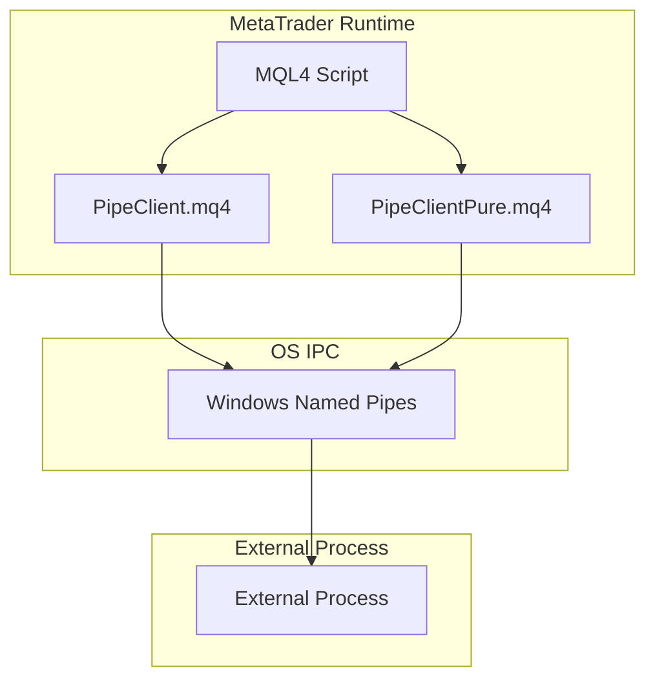
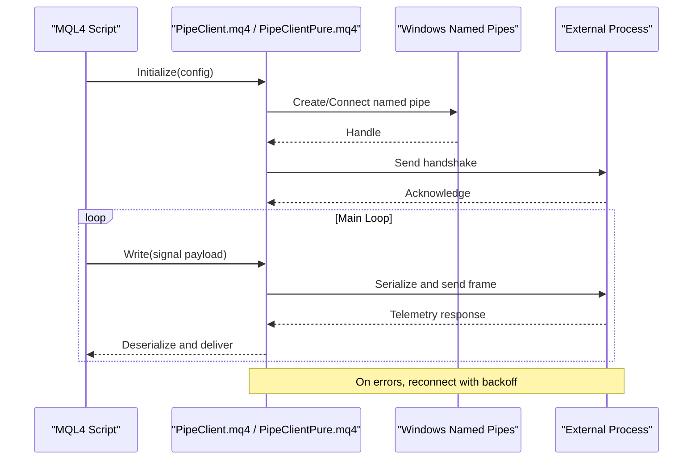
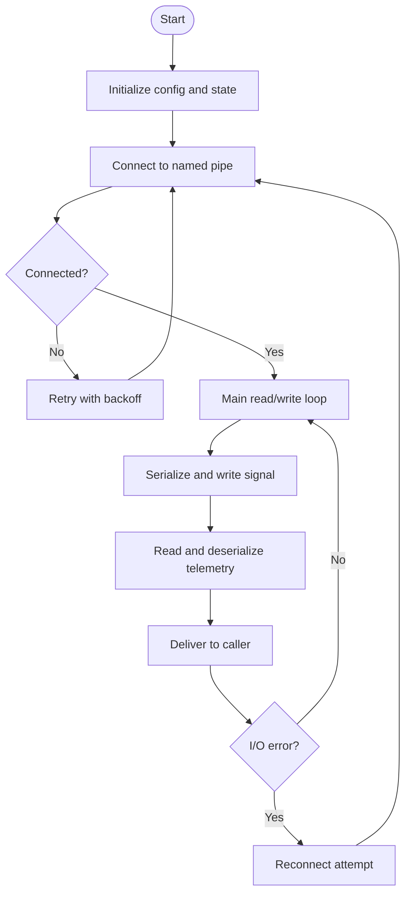
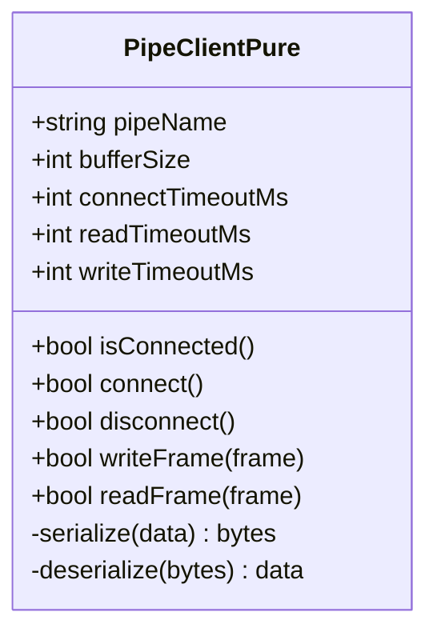
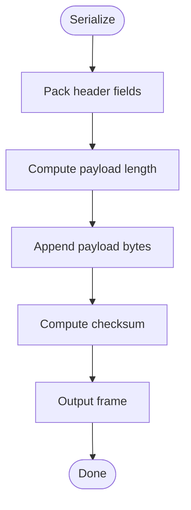
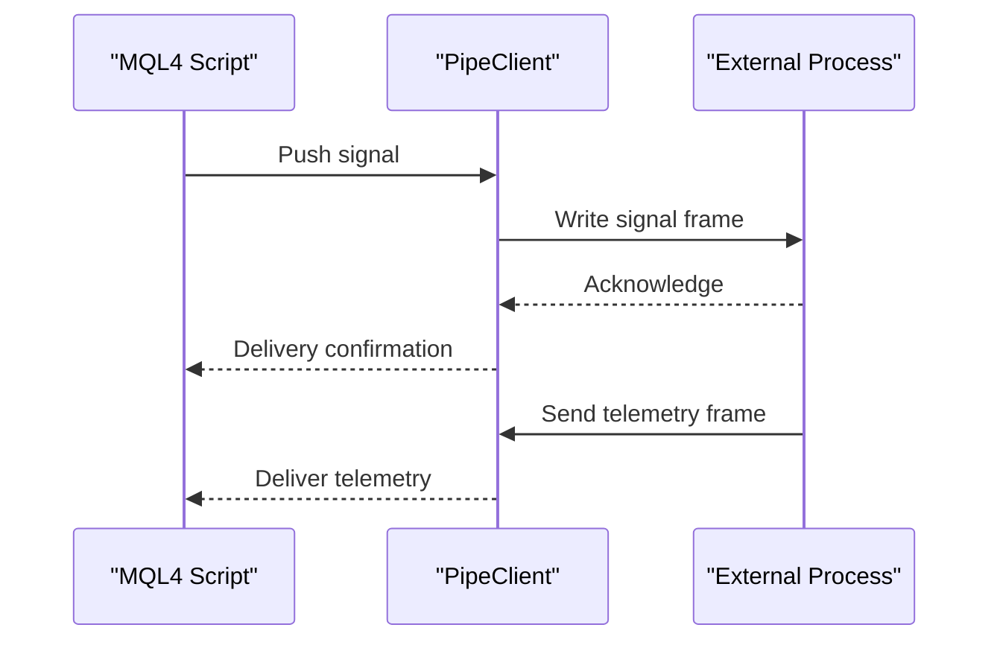
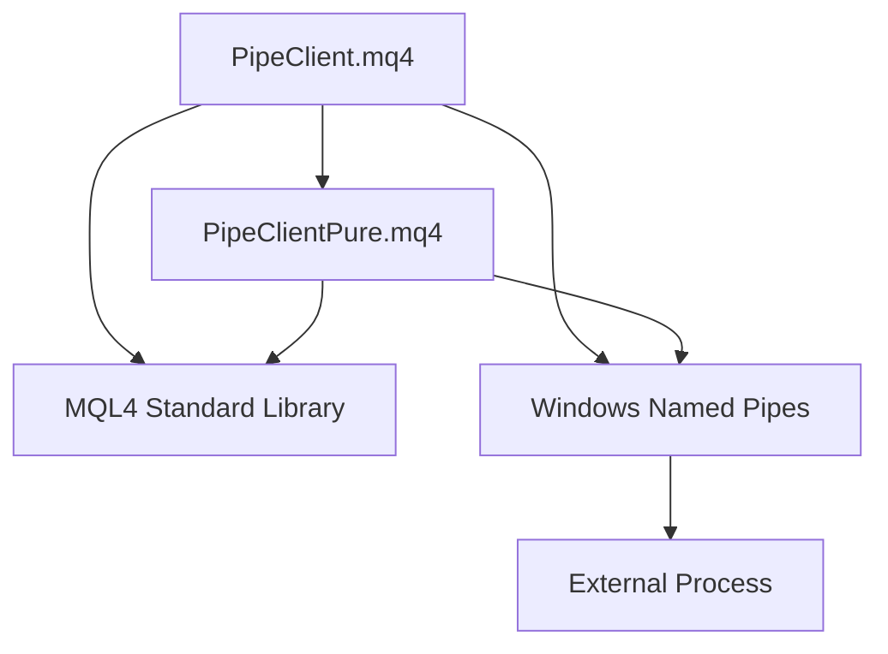

# Pipe Communication

<cite>
**Referenced Files in This Document**
- [PipeClient.mq4](file://MT/MQL4/Scripts/Pipes/PipeClient.mq4)
- [PipeClientPure.mq4](file://MT/MQL4/Scripts/Pipes/PipeClientPure.mq4)
</cite>

## Table of Contents
1. [Introduction](#introduction)
2. [Project Structure](#project-structure)
3. [Core Components](#core-components)
4. [Architecture Overview](#architecture-overview)
5. [Detailed Component Analysis](#detailed-component-analysis)
6. [Dependency Analysis](#dependency-analysis)
7. [Performance Considerations](#performance-considerations)
8. [Troubleshooting Guide](#troubleshooting-guide)
9. [Conclusion](#conclusion)
10. [Appendices](#appendices)

## Introduction
This document explains the pipe-based communication mechanisms used by MQL4 scripts to stream real-time data between MetaTrader and external processes. It focuses on the implementations in Scripts/Pipes/PipeClient.mq4 and Scripts/Pipes/PipeClientPure.mq4, covering named pipe creation, connection management, message serialization protocols, bidirectional communication patterns for signal transmission and telemetry exchange, configuration options, error recovery, and performance considerations for high-frequency trading scenarios.

## Project Structure
The relevant code resides under the MQL4 Scripts directory:
- MT/MQL4/Scripts/Pipes/PipeClient.mq4
- MT/MQL4/Scripts/Pipes/PipeClientPure.mq4

These two files implement a client-side bridge that connects MetaTrader’s runtime to an external process via Windows named pipes. The “Pure” variant typically avoids additional dependencies or wrappers, providing a minimal implementation focused on core I/O operations.

[No sources needed since this diagram shows conceptual workflow, not actual code structure]

## Core Components
- PipeClient.mq4: Implements the primary named pipe client with higher-level helpers for connection lifecycle, message framing, and retry logic.
- PipeClientPure.mq4: Provides a leaner implementation focusing strictly on low-level pipe I/O and serialization primitives.

Key responsibilities shared across both components:
- Named pipe endpoint resolution and creation
- Connection establishment and keep-alive
- Message serialization/deserialization (binary or text frames)
- Bidirectional read/write loops
- Error detection and recovery (reconnect/backoff)
- Configuration exposure for timeouts, buffer sizes, and retry policies

**Section sources**
- [PipeClient.mq4](file://MT/MQL4/Scripts/Pipes/PipeClient.mq4)
- [PipeClientPure.mq4](file://MT/MQL4/Scripts/Pipes/PipeClientPure.mq4)

## Architecture Overview
The architecture centers on a persistent named pipe channel between MetaTrader and an external process. Messages are framed to support both control signals and telemetry payloads. The client maintains a connection loop that handles reconnection attempts and buffers messages during transient failures.

**Diagram sources**
- [PipeClient.mq4](file://MT/MQL4/Scripts/Pipes/PipeClient.mq4)
- [PipeClientPure.mq4](file://MT/MQL4/Scripts/Pipes/PipeClientPure.mq4)

## Detailed Component Analysis

### PipeClient.mq4
Responsibilities:
- Manages named pipe handle lifecycle (open/close/retry)
- Frames messages with length prefixes or delimiters
- Encapsulates read/write operations with timeout handling
- Exposes configuration parameters (pipe name, timeouts, retries, buffer size)
- Coordinates bidirectional streaming (signals outbound, telemetry inbound)

Typical flow:
- Initialization sets up configuration and attempts initial connection
- A background loop writes outgoing signals and reads incoming telemetry
- On I/O errors, it logs diagnostics and triggers reconnection with exponential backoff
- Graceful shutdown closes the pipe and releases resources

**Diagram sources**
- [PipeClient.mq4](file://MT/MQL4/Scripts/Pipes/PipeClient.mq4)

**Section sources**
- [PipeClient.mq4](file://MT/MQL4/Scripts/Pipes/PipeClient.mq4)

### PipeClientPure.mq4
Responsibilities:
- Minimal wrapper around Windows named pipe APIs
- Direct serialization/deserialization routines
- Explicit control over buffer management and memory usage
- Suitable for environments where overhead must be minimized

Differences from PipeClient.mq4:
- Fewer abstractions; more explicit calls to underlying I/O functions
- Tighter control over timing and buffering
- Potentially lower latency but requires careful error handling by the caller

**Diagram sources**
- [PipeClientPure.mq4](file://MT/MQL4/Scripts/Pipes/PipeClientPure.mq4)

**Section sources**
- [PipeClientPure.mq4](file://MT/MQL4/Scripts/Pipes/PipeClientPure.mq4)

### Message Serialization Protocol
Both clients implement a framing protocol suitable for binary or text payloads:
- Length-prefixed frames: 4-byte length followed by payload
- Optional header fields: version, type, checksum
- Delimiter-based frames for text mode (newline or custom separator)

Recommendations:
- Use binary framing for high-frequency telemetry to reduce parsing overhead
- Include sequence numbers to detect dropped or out-of-order messages
- Validate checksums to ensure integrity

**Diagram sources**
- [PipeClient.mq4](file://MT/MQL4/Scripts/Pipes/PipeClient.mq4)
- [PipeClientPure.mq4](file://MT/MQL4/Scripts/Pipes/PipeClientPure.mq4)

**Section sources**
- [PipeClient.mq4](file://MT/MQL4/Scripts/Pipes/PipeClient.mq4)
- [PipeClientPure.mq4](file://MT/MQL4/Scripts/Pipes/PipeClientPure.mq4)

### Bidirectional Communication Patterns
- Signal transmission (MQL4 → External):
  - Outbound frames carry trading signals, order updates, or control commands
  - Non-blocking writes with queueing to avoid blocking the MQL4 event loop
- Telemetry exchange (External → MQL4):
  - Inbound frames carry metrics, acknowledgments, or model outputs
  - Asynchronous reads with timely delivery to prevent backlog

**Diagram sources**
- [PipeClient.mq4](file://MT/MQL4/Scripts/Pipes/PipeClient.mq4)
- [PipeClientPure.mq4](file://MT/MQL4/Scripts/Pipes/PipeClientPure.mq4)

**Section sources**
- [PipeClient.mq4](file://MT/MQL4/Scripts/Pipes/PipeClient.mq4)
- [PipeClientPure.mq4](file://MT/MQL4/Scripts/Pipes/PipeClientPure.mq4)

## Dependency Analysis
- Internal dependencies:
  - Both clients rely on MQL4 standard library functions for file and string manipulation
  - PipeClient.mq4 may wrap PipeClientPure.mq4 functionality with higher-level features
- External dependencies:
  - Windows named pipe subsystem for IPC
  - External process implementing the server side of the protocol

**Diagram sources**
- [PipeClient.mq4](file://MT/MQL4/Scripts/Pipes/PipeClient.mq4)
- [PipeClientPure.mq4](file://MT/MQL4/Scripts/Pipes/PipeClientPure.mq4)

**Section sources**
- [PipeClient.mq4](file://MT/MQL4/Scripts/Pipes/PipeClient.mq4)
- [PipeClientPure.mq4](file://MT/MQL4/Scripts/Pipes/PipeClientPure.mq4)

## Performance Considerations
- Buffer sizing:
  - Tune buffer sizes to match typical payload sizes and peak throughput
  - Avoid excessive allocations; reuse buffers where possible
- Timeouts and backoff:
  - Set appropriate connect/read/write timeouts to prevent stalls
  - Implement exponential backoff with jitter for reconnection
- Serialization efficiency:
  - Prefer binary frames for high-frequency data
  - Minimize object churn and string conversions
- Concurrency:
  - Keep write paths non-blocking to avoid freezing the MQL4 event loop
  - Batch small messages when feasible to reduce overhead
- Memory optimization:
  - Preallocate buffers and clear them efficiently
  - Monitor memory growth and release unused resources promptly

[No sources needed since this section provides general guidance]

## Troubleshooting Guide
Common issues and resolutions:
- Connection failures:
  - Verify pipe name matches between client and server
  - Check permissions and ensure the external process is running
- Timeouts:
  - Increase timeouts if the external process is slow to respond
  - Investigate network-like delays within the same machine (CPU contention)
- Data corruption:
  - Validate checksums and frame boundaries
  - Ensure consistent serialization formats on both sides
- Backpressure:
  - Monitor queue lengths and adjust buffer sizes
  - Implement flow control to drop or throttle low-priority telemetry

**Section sources**
- [PipeClient.mq4](file://MT/MQL4/Scripts/Pipes/PipeClient.mq4)
- [PipeClientPure.mq4](file://MT/MQL4/Scripts/Pipes/PipeClientPure.mq4)

## Conclusion
The PipeClient.mq4 and PipeClientPure.mq4 implementations provide robust, configurable, and efficient mechanisms for real-time communication between MetaTrader and external processes using Windows named pipes. By carefully managing connections, serializing messages effectively, and handling errors gracefully, these components enable reliable bidirectional streaming suitable for high-frequency trading scenarios.

[No sources needed since this section summarizes without analyzing specific files]

## Appendices

### Configuration Options
- Pipe name: Unique identifier for the named pipe endpoint
- Connect timeout: Maximum time to establish a connection
- Read/write timeouts: Limits for I/O operations
- Buffer size: Size of internal buffers for read/write operations
- Retry policy: Number of retries and backoff strategy
- Serialization mode: Binary or text framing

**Section sources**
- [PipeClient.mq4](file://MT/MQL4/Scripts/Pipes/PipeClient.mq4)
- [PipeClientPure.mq4](file://MT/MQL4/Scripts/Pipes/PipeClientPure.mq4)

### Example Implementation Patterns
- Custom pipe client:
  - Extend PipeClientPure.mq4 to add specialized serialization or logging
  - Wrap PipeClient.mq4 to integrate with existing MQL4 modules
- Handling connection failures:
  - Implement retry with exponential backoff
  - Log detailed diagnostics for each failure stage

**Section sources**
- [PipeClient.mq4](file://MT/MQL4/Scripts/Pipes/PipeClient.mq4)
- [PipeClientPure.mq4](file://MT/MQL4/Scripts/Pipes/PipeClientPure.mq4)