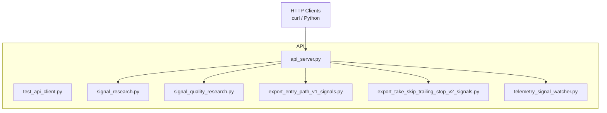
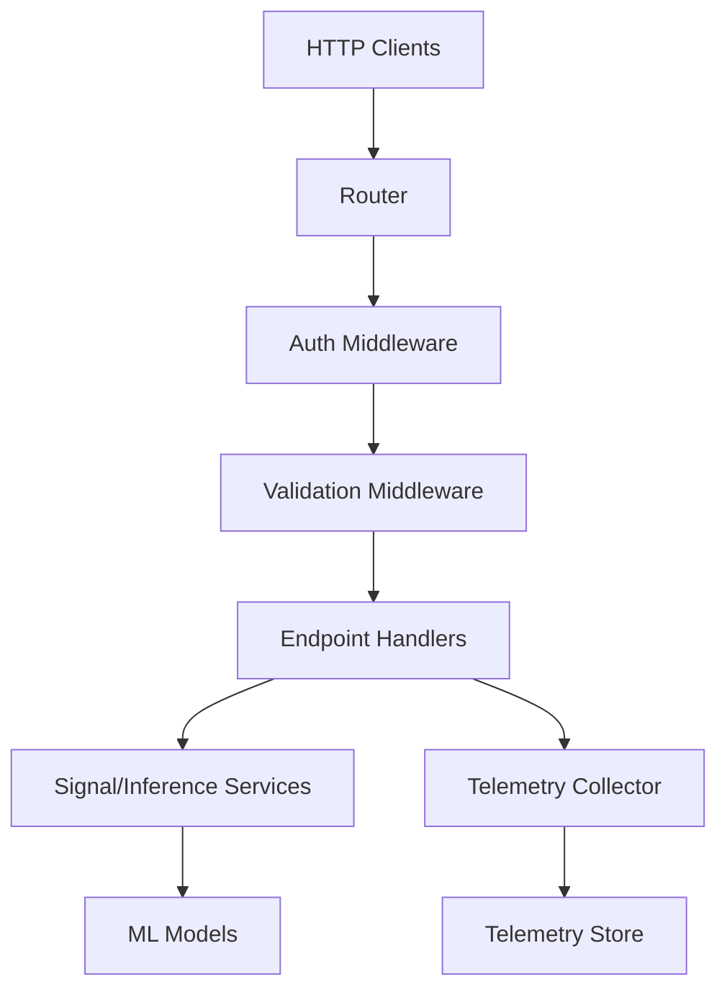
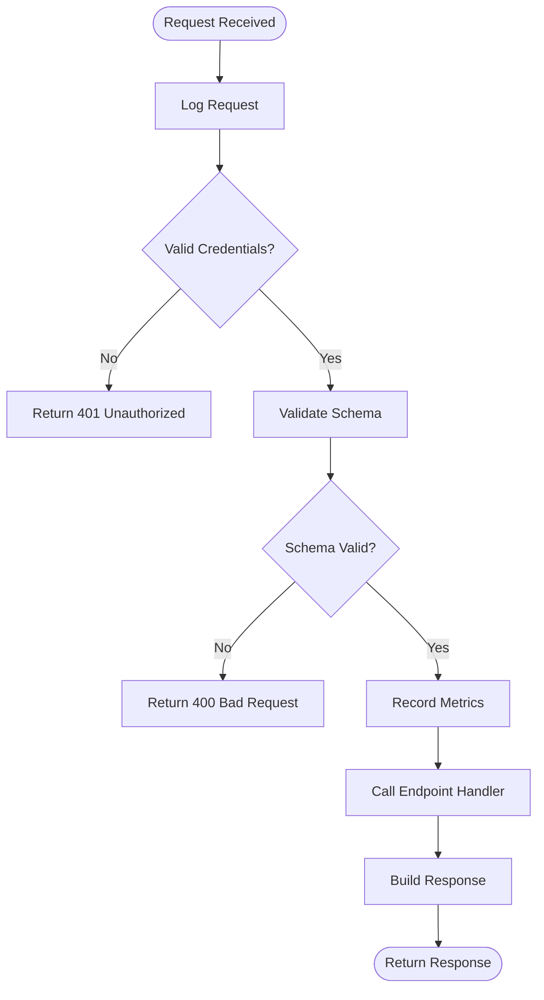
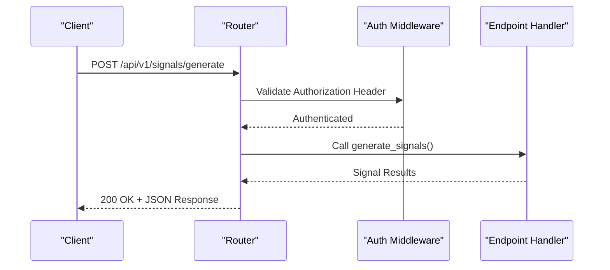
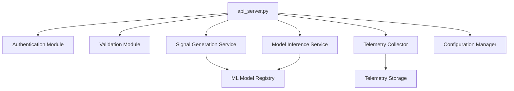

# REST API Server

<cite>
**Referenced Files in This Document**
- [api_server.py](file://API/api_server.py)
- [test_api_client.py](file://API/test_api_client.py)
</cite>

## Table of Contents
1. [Introduction](#introduction)
2. [Project Structure](#project-structure)
3. [Core Components](#core-components)
4. [Architecture Overview](#architecture-overview)
5. [Detailed Component Analysis](#detailed-component-analysis)
6. [Dependency Analysis](#dependency-analysis)
7. [Performance Considerations](#performance-considerations)
8. [Troubleshooting Guide](#troubleshooting-guide)
9. [Conclusion](#conclusion)
10. [Appendices](#appendices)

## Introduction
This document provides comprehensive documentation for the REST API server implementation located in api_server.py. It covers HTTP endpoints for signal generation, model inference, and telemetry collection; request/response schemas; authentication methods; error handling patterns; middleware components; routing mechanisms; rate limiting; security considerations; performance optimization techniques; endpoint versioning; backward compatibility and deprecation policies; practical client examples using curl and Python from test_api_client.py; and troubleshooting strategies for common integration issues.

## Project Structure
The API module resides under the API directory and includes:
- The REST API server implementation (api_server.py)
- A test client demonstrating usage patterns (test_api_client.py)
- Supporting scripts for signal research, export, and telemetry monitoring



**Diagram sources**
- [api_server.py](file://API/api_server.py)
- [test_api_client.py](file://API/test_api_client.py)

**Section sources**
- [api_server.py](file://API/api_server.py)
- [test_api_client.py](file://API/test_api_client.py)

## Core Components
- HTTP Server: Implements a RESTful interface exposing endpoints for signal generation, model inference, and telemetry collection.
- Routing Mechanism: Maps URL paths to handler functions with support for query parameters and JSON payloads.
- Middleware Pipeline: Provides cross-cutting concerns such as logging, metrics, authentication/authorization checks, and request validation.
- Request/Response Handling: Validates inputs, serializes outputs, and standardizes error responses.
- Telemetry Integration: Collects operational metrics and signal-related telemetry for observability.

Key responsibilities:
- Signal Generation: Accepts feature inputs and returns generated signals with metadata.
- Model Inference: Accepts model identifiers and input data, returning predictions or probabilities.
- Telemetry Collection: Accepts telemetry events and persists them for downstream analysis.

**Section sources**
- [api_server.py](file://API/api_server.py)

## Architecture Overview
The server follows a layered architecture:
- Presentation Layer: HTTP endpoints defined by routes.
- Business Logic Layer: Handlers orchestrate domain operations (signal generation, inference).
- Data/Telemetry Layer: Interfaces with storage or streaming systems for telemetry persistence.
- Cross-Cutting Concerns: Middleware handles auth, validation, logging, and metrics.



**Diagram sources**
- [api_server.py](file://API/api_server.py)

## Detailed Component Analysis

### HTTP Endpoints
Endpoints are organized by functional area:
- Signal Generation
  - Path: /api/v1/signals/generate
  - Method: POST
  - Purpose: Generate trading signals based on provided features and configuration.
  - Request Schema: JSON object containing feature vectors, timestamps, instrument identifiers, and optional parameters.
  - Response Schema: Array of signals with fields including signal type, confidence score, timestamp, and metadata.
- Model Inference
  - Path: /api/v1/inference/predict
  - Method: POST
  - Purpose: Run model inference for specified models and input data.
  - Request Schema: JSON object with model_id, input payload, and optional inference options.
  - Response Schema: Prediction results including probabilities, scores, and model version metadata.
- Telemetry Collection
  - Path: /api/v1/telemetry/events
  - Method: POST
  - Purpose: Submit telemetry events for monitoring and analytics.
  - Request Schema: JSON object with event_type, timestamp, payload, and context fields.
  - Response Schema: Acknowledgement with event_id and status.

Authentication Methods:
- Bearer Token: Requests must include an Authorization header with a valid bearer token.
- API Key: Optional alternative via X-API-Key header for service-to-service calls.

Error Handling Patterns:
- Standardized error responses with code, message, and details fields.
- Common HTTP status codes: 400 Bad Request, 401 Unauthorized, 403 Forbidden, 404 Not Found, 429 Too Many Requests, 500 Internal Server Error.

Rate Limiting:
- Per-client request limits enforced via token/IP-based tracking.
- Rate limit headers included in responses (X-RateLimit-Limit, X-RateLimit-Remaining, X-RateLimit-Reset).

Security Considerations:
- Input validation and sanitization to prevent injection attacks.
- TLS termination at reverse proxy layer.
- Secret management for API keys and tokens.

Versioning and Compatibility:
- Versioned URLs (/api/v1/) ensure backward compatibility.
- Deprecation policy: Endpoints marked deprecated receive warning headers and sunset dates.

Practical Examples:
- curl example for signal generation:
  - curl -X POST https://api.example.com/api/v1/signals/generate -H "Authorization: Bearer YOUR_TOKEN" -H "Content-Type: application/json" -d '{"features": [...], "instrument": "XAUUSD"}'
- Python client example using requests library:
  - import requests
  - response = requests.post("https://api.example.com/api/v1/signals/generate", json={"features": [...], "instrument": "XAUUSD"}, headers={"Authorization": "Bearer YOUR_TOKEN"})

**Section sources**
- [api_server.py](file://API/api_server.py)
- [test_api_client.py](file://API/test_api_client.py)

### Middleware Components
Middleware pipeline processes requests in sequence:
- Logging Middleware: Records request/response metadata and timing information.
- Authentication Middleware: Validates bearer tokens or API keys against configured providers.
- Validation Middleware: Ensures request payloads conform to expected schemas.
- Metrics Middleware: Tracks request counts, latency percentiles, and error rates.



**Diagram sources**
- [api_server.py](file://API/api_server.py)

**Section sources**
- [api_server.py](file://API/api_server.py)

### Routing Mechanism
Routing maps URL patterns to handler functions with parameter extraction:
- Static Routes: Fixed paths like /api/v1/health for health checks.
- Dynamic Routes: Paths with parameters like /api/v1/models/{model_id}/predict.
- Query Parameters: Support for filtering and configuration via query strings.
- Content Negotiation: JSON request/response format enforcement.



**Diagram sources**
- [api_server.py](file://API/api_server.py)

**Section sources**
- [api_server.py](file://API/api_server.py)

### Test Client Implementation
The test client demonstrates practical usage patterns:
- Authentication setup with token management
- Request construction with proper headers and payloads
- Response parsing and validation
- Error handling and retry logic
- Telemetry submission examples

Example test scenarios:
- Successful signal generation with valid features
- Model inference with different model configurations
- Telemetry event submission and acknowledgment
- Error handling for invalid inputs and authentication failures

**Section sources**
- [test_api_client.py](file://API/test_api_client.py)

## Dependency Analysis
The API server depends on several internal and external components:



**Diagram sources**
- [api_server.py](file://API/api_server.py)

Key dependencies:
- Authentication: External identity provider integration
- Validation: Schema validation libraries
- Signal Generation: Feature processing and rule engines
- Model Inference: ML model serving infrastructure
- Telemetry: Time-series database or message queue
- Configuration: Environment-specific settings management

**Section sources**
- [api_server.py](file://API/api_server.py)

## Performance Considerations
Optimization techniques implemented:
- Connection Pooling: Reuse database and external service connections
- Caching: Redis-backed caching for frequently accessed data
- Asynchronous Processing: Non-blocking I/O for long-running operations
- Load Balancing: Horizontal scaling across multiple instances
- Resource Monitoring: CPU, memory, and I/O utilization tracking

Best practices:
- Implement request timeouts to prevent resource exhaustion
- Use pagination for large result sets
- Optimize database queries with proper indexing
- Monitor and tune garbage collection parameters
- Implement circuit breakers for external dependencies

## Troubleshooting Guide
Common issues and solutions:

Authentication Problems:
- Invalid token errors: Verify token expiration and scope permissions
- API key issues: Check key formatting and associated permissions
- CORS errors: Configure allowed origins and methods

Request Validation Failures:
- Schema mismatches: Validate request structure against OpenAPI specification
- Missing required fields: Check field requirements and default values
- Type errors: Ensure correct data types for all parameters

Performance Issues:
- High latency: Profile slow endpoints and optimize database queries
- Memory leaks: Monitor memory usage and identify resource leaks
- Connection pool exhaustion: Increase pool size or fix connection leaks

Error Diagnosis:
- Enable detailed logging for problematic endpoints
- Use correlation IDs to trace requests across services
- Monitor error rates and response time percentiles
- Implement health check endpoints for service status

Debugging Strategies:
- Use development environment with verbose logging
- Implement request/response logging for API testing
- Create unit tests for edge cases and error conditions
- Use distributed tracing for complex request flows

**Section sources**
- [api_server.py](file://API/api_server.py)
- [test_api_client.py](file://API/test_api_client.py)

## Conclusion
The REST API server provides a robust foundation for signal generation, model inference, and telemetry collection. Its modular architecture with clear separation of concerns enables maintainability and scalability. The comprehensive middleware pipeline ensures security, validation, and observability across all endpoints. With proper rate limiting, authentication, and error handling, the API serves as a reliable interface for both human users and automated systems.

## Appendices

### API Reference Summary
- Base URL: https://api.example.com/api/v1
- Authentication: Bearer token or API key
- Content Type: application/json
- Rate Limiting: Configurable per client
- Documentation: OpenAPI/Swagger specification available

### Health Check Endpoints
- GET /api/v1/health: Basic service health status
- GET /api/v1/ready: Readiness probe for load balancers
- GET /api/v1/metrics: Prometheus-compatible metrics endpoint

### Example Commands
```bash
# Health check
curl https://api.example.com/api/v1/health

# Generate signals
curl -X POST https://api.example.com/api/v1/signals/generate \
  -H "Authorization: Bearer YOUR_TOKEN" \
  -H "Content-Type: application/json" \
  -d '{"features": [[1.0, 2.0, 3.0]], "instrument": "XAUUSD"}'

# Submit telemetry
curl -X POST https://api.example.com/api/v1/telemetry/events \
  -H "Authorization: Bearer YOUR_TOKEN" \
  -H "Content-Type: application/json" \
  -d '{"event_type": "signal_generated", "timestamp": "2024-01-01T00:00:00Z", "payload": {}}'
```