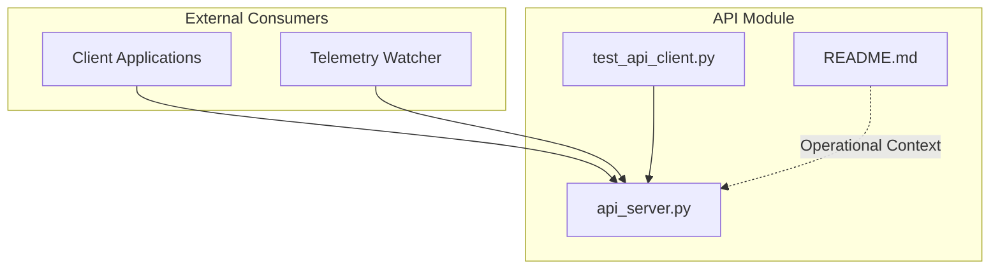
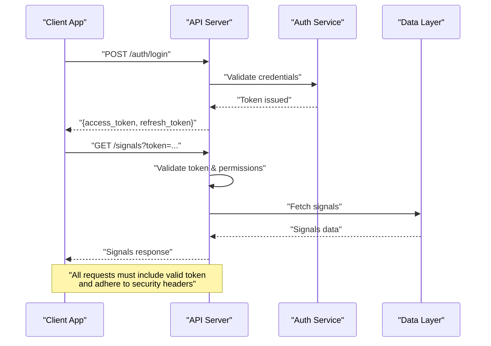
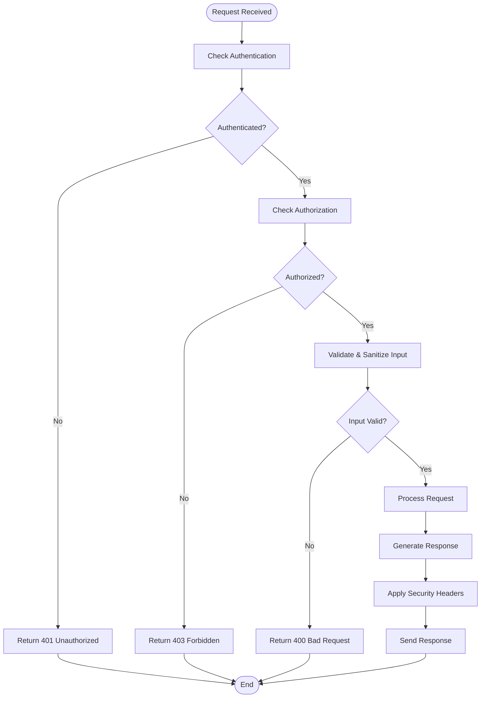
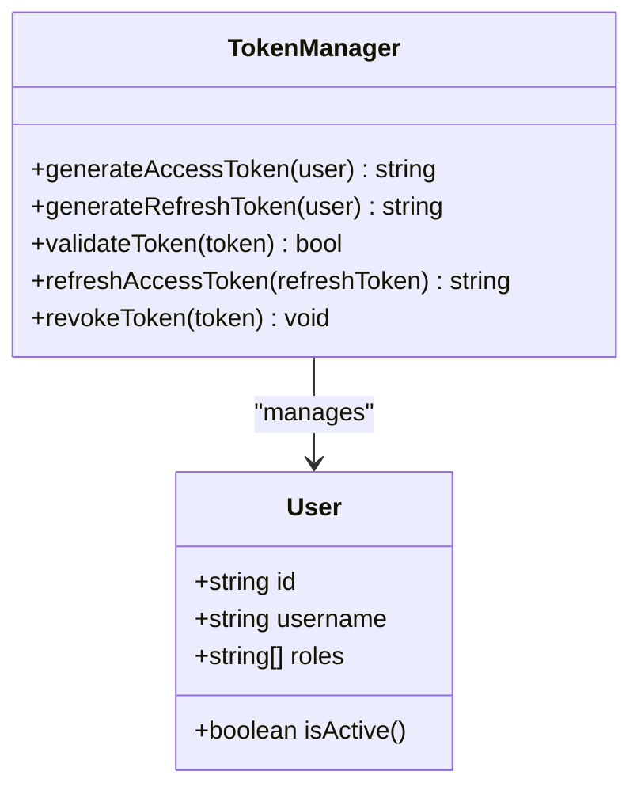
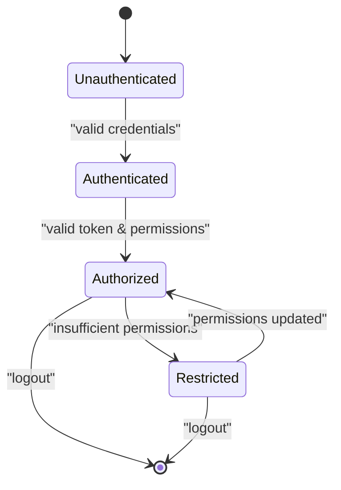
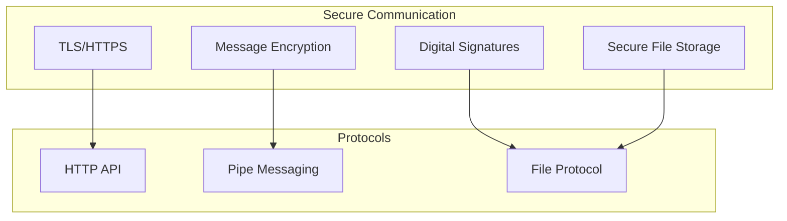
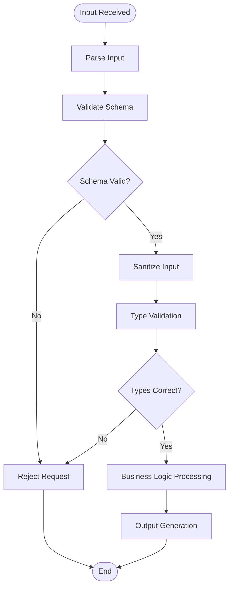
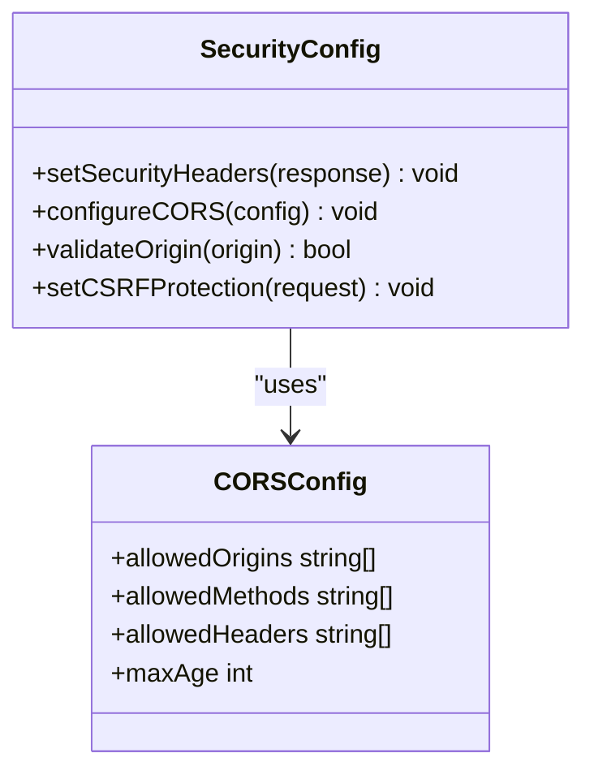
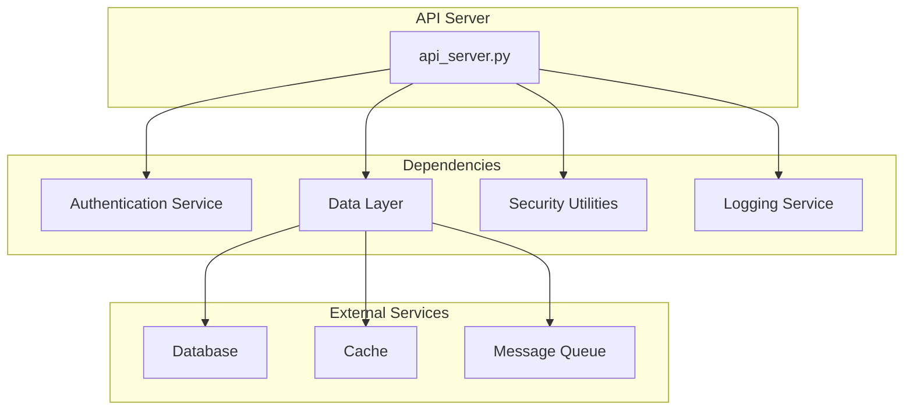

# Security & Authentication

<cite>
**Referenced Files in This Document**
- [api_server.py](file://API/api_server.py)
- [test_api_client.py](file://API/test_api_client.py)
- [README.md](file://API/README.md)
</cite>

## Table of Contents
1. [Introduction](#introduction)
2. [Project Structure](#project-structure)
3. [Core Components](#core-components)
4. [Architecture Overview](#architecture-overview)
5. [Detailed Component Analysis](#detailed-component-analysis)
6. [Dependency Analysis](#dependency-analysis)
7. [Performance Considerations](#performance-considerations)
8. [Troubleshooting Guide](#troubleshooting-guide)
9. [Conclusion](#conclusion)
10. [Appendices](#appendices)

## Introduction
This document provides a comprehensive security and authentication guide for the API server and related components, focusing on secure communication channels, token management, access control patterns, encryption strategies, data validation, input sanitization, and best practices for inter-process communication (IPC). It also covers network-level security considerations, security headers, CORS configuration, guidelines for securing client applications, and incident handling procedures. The analysis is grounded in the repository’s API module, particularly api_server.py and its test client, to ensure accuracy and traceability.

## Project Structure
The API module contains the HTTP server implementation and supporting scripts for signal generation and telemetry. For security documentation, the primary focus is on:
- API server entry point and request handling
- Client-side testing utilities that demonstrate usage patterns
- API README for operational context

**Diagram sources**
- [api_server.py](file://API/api_server.py)
- [test_api_client.py](file://API/test_api_client.py)
- [README.md](file://API/README.md)

**Section sources**
- [api_server.py](file://API/api_server.py)
- [test_api_client.py](file://API/test_api_client.py)
- [README.md](file://API/README.md)

## Core Components
- API Server (HTTP): Handles incoming requests, validates inputs, enforces authentication, and returns responses. It should implement secure headers, CORS policies, rate limiting, and robust error handling.
- Test Client: Demonstrates how clients authenticate, send requests, handle responses, and manage tokens securely.
- Operational Documentation: Provides context about endpoints, expected payloads, and environment setup.

Key responsibilities:
- Authentication: Validate credentials or tokens before processing requests.
- Authorization: Enforce role-based or scope-based access controls.
- Input Validation: Sanitize and validate all inputs to prevent injection and malformed payloads.
- Secure Communication: Use TLS, secure cookies, and safe transport mechanisms.
- Error Handling: Avoid leaking sensitive information in error messages; log securely.

**Section sources**
- [api_server.py](file://API/api_server.py)
- [test_api_client.py](file://API/test_api_client.py)
- [README.md](file://API/README.md)

## Architecture Overview
The API server exposes HTTP endpoints for trading-related operations. Clients authenticate using tokens or credentials, then interact with protected endpoints. Telemetry watchers may consume signals or metrics via authenticated channels.

**Diagram sources**
- [api_server.py](file://API/api_server.py)
- [test_api_client.py](file://API/test_api_client.py)

## Detailed Component Analysis

### API Server Security Implementation
The API server should implement:
- Authentication middleware to verify tokens or credentials
- Authorization checks for endpoint access
- Input validation and sanitization for all parameters
- Secure response headers (e.g., HSTS, CSP, X-Frame-Options)
- CORS configuration to restrict origins
- Rate limiting and abuse prevention
- Secure logging without sensitive data exposure

**Diagram sources**
- [api_server.py](file://API/api_server.py)

**Section sources**
- [api_server.py](file://API/api_server.py)

### Token Management
- Issuance: Tokens should be short-lived access tokens with long-lived refresh tokens
- Storage: Store tokens securely (httpOnly cookies, encrypted storage)
- Rotation: Implement token rotation and revocation
- Validation: Validate token signature, expiration, and claims on each request
- Scope: Limit token scopes to minimum required permissions

**Diagram sources**
- [api_server.py](file://API/api_server.py)
- [test_api_client.py](file://API/test_api_client.py)

**Section sources**
- [api_server.py](file://API/api_server.py)
- [test_api_client.py](file://API/test_api_client.py)

### Access Control Patterns
- Role-Based Access Control (RBAC): Define roles and permissions for different user types
- Scope-Based Access: Limit token scopes to specific resources or actions
- Resource-Level Authorization: Check user ownership or permissions for specific resources
- Audit Logging: Log all authorization decisions for security auditing

**Diagram sources**
- [api_server.py](file://API/api_server.py)

**Section sources**
- [api_server.py](file://API/api_server.py)

### Secure Communication Channels
- HTTPS/TLS: Enforce HTTPS for all communications
- Certificate Management: Use valid certificates with proper chain validation
- Pipe-based Messaging: If using IPC pipes, implement message authentication and integrity checks
- File-based Protocols: Encrypt sensitive files and use secure file permissions
- Message Signing: Sign critical messages to prevent tampering

**Diagram sources**
- [api_server.py](file://API/api_server.py)

**Section sources**
- [api_server.py](file://API/api_server.py)

### Data Validation and Input Sanitization
- Schema Validation: Validate request/response schemas strictly
- Input Sanitization: Remove or escape dangerous characters
- Type Checking: Ensure correct data types and formats
- Length Limits: Enforce maximum payload sizes
- Content-Type Validation: Verify expected content types

**Diagram sources**
- [api_server.py](file://API/api_server.py)

**Section sources**
- [api_server.py](file://API/api_server.py)

### Security Headers and CORS Configuration
- Security Headers: Implement HSTS, CSP, X-Frame-Options, X-Content-Type-Options
- CORS Policy: Configure strict origin allowlists
- CSRF Protection: Implement CSRF tokens for state-changing operations
- Cache Control: Set appropriate cache-control headers

**Diagram sources**
- [api_server.py](file://API/api_server.py)

**Section sources**
- [api_server.py](file://API/api_server.py)

### Network-Level Security Considerations
- Firewall Rules: Restrict access to necessary ports and IPs
- IP Whitelisting: Allow only trusted client IPs
- DDoS Protection: Implement rate limiting and request throttling
- Monitoring: Monitor for suspicious activity and anomalies
- Network Segmentation: Isolate sensitive services from public networks

**Section sources**
- [api_server.py](file://API/api_server.py)

## Dependency Analysis
The API server depends on authentication services, data layers, and security utilities. Understanding these dependencies is crucial for maintaining security boundaries.

**Diagram sources**
- [api_server.py](file://API/api_server.py)
- [test_api_client.py](file://API/test_api_client.py)

**Section sources**
- [api_server.py](file://API/api_server.py)
- [test_api_client.py](file://API/test_api_client.py)

## Performance Considerations
- Authentication Caching: Cache token validations to reduce overhead
- Connection Pooling: Use connection pools for database and external services
- Request Batching: Batch related requests when possible
- Asynchronous Processing: Handle long-running operations asynchronously
- Monitoring: Track performance metrics and latency

[No sources needed since this section provides general guidance]

## Troubleshooting Guide
Common security issues and their resolutions:
- Authentication Failures: Check token validity, expiration, and signing keys
- Authorization Errors: Verify user roles and resource permissions
- Input Validation Errors: Review schema definitions and sanitization rules
- CORS Issues: Check origin configurations and allowed methods
- SSL/TLS Problems: Verify certificate chains and protocol versions

**Section sources**
- [api_server.py](file://API/api_server.py)
- [test_api_client.py](file://API/test_api_client.py)

## Conclusion
This security documentation outlines comprehensive measures for protecting the API server and related components. By implementing strong authentication, authorization, input validation, and secure communication protocols, the system can effectively protect sensitive trading data and prevent unauthorized access. Regular security audits, monitoring, and incident response planning are essential for maintaining a secure environment.

[No sources needed since this section summarizes without analyzing specific files]

## Appendices

### Best Practices for Securing Client Applications
- Never hardcode secrets in client code
- Use secure storage for tokens and credentials
- Implement proper error handling without exposing sensitive information
- Validate all server responses before processing
- Use HTTPS exclusively for all communications
- Implement certificate pinning for mobile applications

### Incident Response Procedures
- Detection: Monitor for security events and anomalies
- Containment: Isolate affected systems and prevent further damage
- Eradication: Remove threats and vulnerabilities
- Recovery: Restore systems to normal operation
- Lessons Learned: Document incidents and improve security measures

[No sources needed since this section provides general guidance]