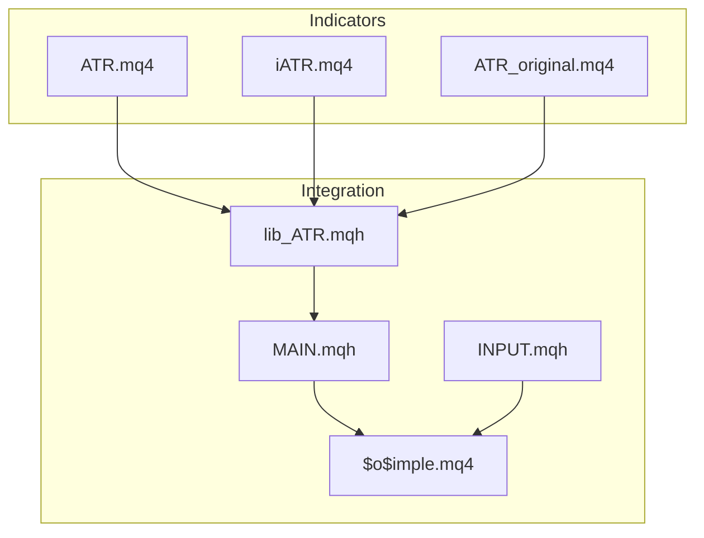
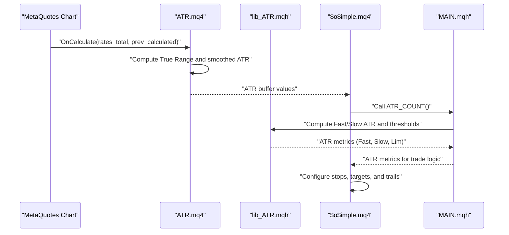
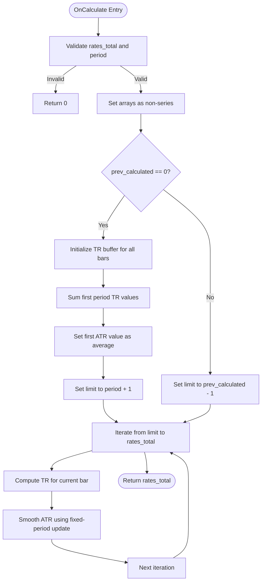
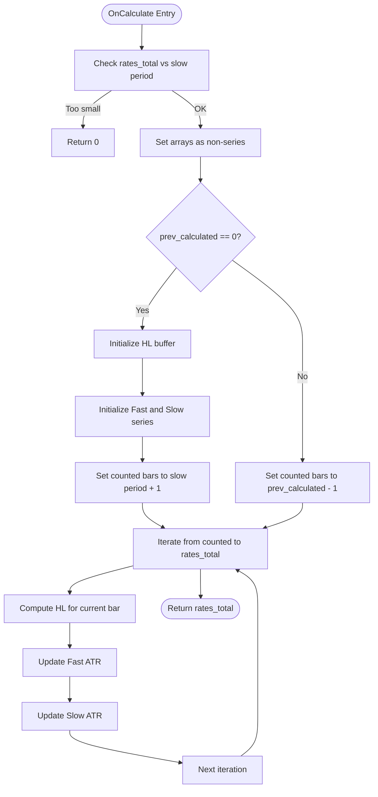
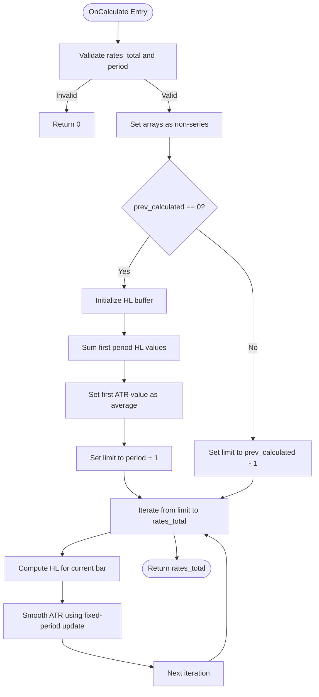
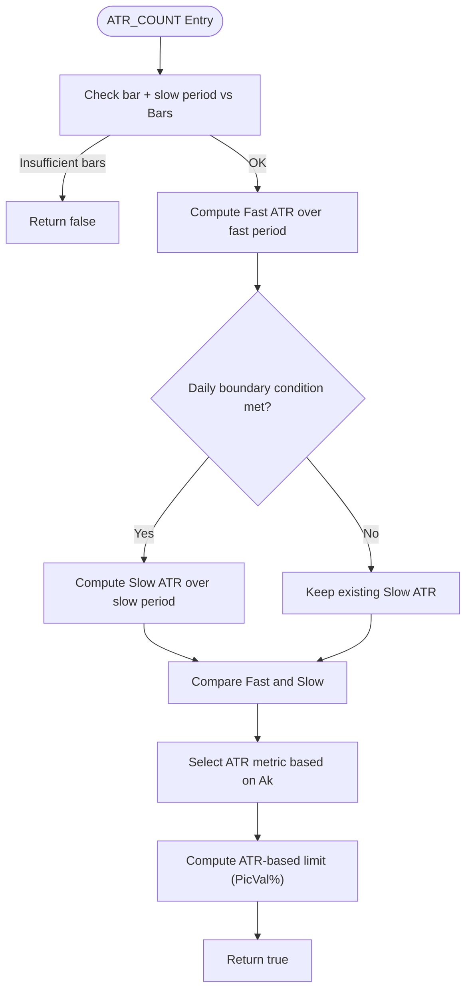
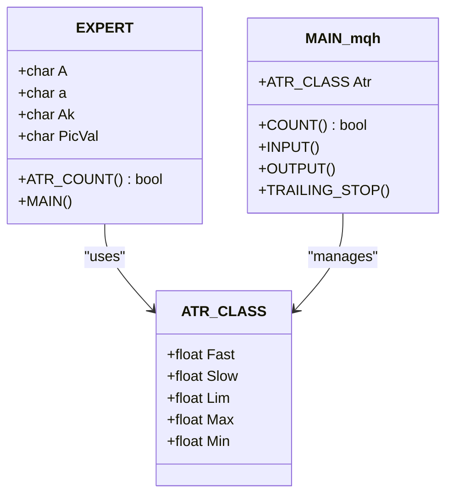
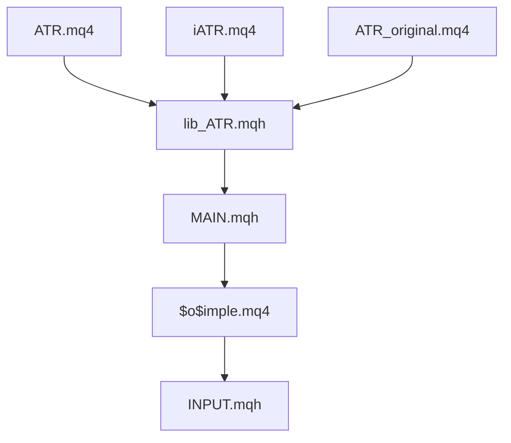

# Average True Range (ATR) Indicator

<cite>
**Referenced Files in This Document**
- [ATR.mq4](file://MT/MQL4/Indicators/ATR.mq4)
- [iATR.mq4](file://MT/MQL4/Indicators/iATR.mq4)
- [ATR_original.mq4](file://MT/MQL4/Indicators/ATR_original.mq4)
- [lib_ATR.mqh](file://MT/MQL4/Include/lib_ATR.mqh)
- [$o$imple.mq4](file://MT/MQL4/Experts/$o$imple.mq4)
- [MAIN.mqh](file://MT/MQL4/Include/MAIN.mqh)
- [INPUT.mqh](file://MT/MQL4/Include/INPUT.mqh)
</cite>

## Table of Contents
1. [Introduction](#introduction)
2. [Project Structure](#project-structure)
3. [Core Components](#core-components)
4. [Architecture Overview](#architecture-overview)
5. [Detailed Component Analysis](#detailed-component-analysis)
6. [Dependency Analysis](#dependency-analysis)
7. [Performance Considerations](#performance-considerations)
8. [Troubleshooting Guide](#troubleshooting-guide)
9. [Conclusion](#conclusion)

## Introduction
This document provides comprehensive documentation for the Average True Range (ATR) indicator implementations within the SoSimple trading system. It explains the ATR calculation methodology, including True Range determination, smoothing techniques, and period handling. It documents the MQL4 implementations across multiple indicator variants, buffer management, and performance optimization strategies. The guide also covers parameter configuration, visualization settings, integration with the SoSimple expert advisor, practical usage examples, and troubleshooting common ATR calculation issues. Finally, it addresses ATR interpretation in trading contexts and its role in volatility measurement.

## Project Structure
The ATR-related code spans indicator implementations and integration libraries within the SoSimple repository under the MT/MQL4 directory. Key locations include:
- Indicator implementations: MT/MQL4/Indicators/ATR.mq4, MT/MQL4/Indicators/iATR.mq4, MT/MQL4/Indicators/ATR_original.mq4
- Integration library: MT/MQL4/Include/lib_ATR.mqh
- Expert advisor and integration: MT/MQL4/Experts/$o$imple.mq4, MT/MQL4/Include/MAIN.mqh, MT/MQL4/Include/INPUT.mqh

**Diagram sources**
- [ATR.mq4](file://MT/MQL4/Indicators/ATR.mq4)
- [iATR.mq4](file://MT/MQL4/Indicators/iATR.mq4)
- [ATR_original.mq4](file://MT/MQL4/Indicators/ATR_original.mq4)
- [lib_ATR.mqh](file://MT/MQL4/Include/lib_ATR.mqh)
- [MAIN.mqh](file://MT/MQL4/Include/MAIN.mqh)
- [INPUT.mqh](file://MT/MQL4/Include/INPUT.mqh)
- [$o$imple.mq4](file://MT/MQL4/Experts/$o$imple.mq4)

**Section sources**
- [ATR.mq4](file://MT/MQL4/Indicators/ATR.mq4)
- [iATR.mq4](file://MT/MQL4/Indicators/iATR.mq4)
- [ATR_original.mq4](file://MT/MQL4/Indicators/ATR_original.mq4)
- [lib_ATR.mqh](file://MT/MQL4/Include/lib_ATR.mqh)
- [$o$imple.mq4](file://MT/MQL4/Experts/$o$imple.mq4)
- [MAIN.mqh](file://MT/MQL4/Include/MAIN.mqh)
- [INPUT.mqh](file://MT/MQL4/Include/INPUT.mqh)

## Core Components
This section outlines the primary ATR implementations and their roles within SoSimple.

- Single-period ATR (ATR.mq4): Implements a standard ATR with a single smoothing period, computing True Range from high, low, and previous close, and applying a simple moving average smoothing technique.
- Dual-period ATR (iATR.mq4): Computes both fast and slow ATR series using separate periods, enabling trend-following comparisons and dynamic stop placement.
- Original-style ATR (ATR_original.mq4): A variant that uses high minus low as the True Range measure and applies the same smoothing method.

Key characteristics:
- Buffer management: Each indicator declares and manages its own buffers for ATR values and intermediate True Range computations.
- Parameter configuration: Period inputs are exposed via input parameters, validated during initialization, and used to set draw begin positions.
- Visualization: Indicators define line styles, colors, and labels for chart display.

**Section sources**
- [ATR.mq4](file://MT/MQL4/Indicators/ATR.mq4)
- [iATR.mq4](file://MT/MQL4/Indicators/iATR.mq4)
- [ATR_original.mq4](file://MT/MQL4/Indicators/ATR_original.mq4)

## Architecture Overview
The ATR indicator implementations integrate with the SoSimple expert advisor through a shared library that computes ATR-based metrics for position sizing, stops, and trailing logic. The expert advisor exposes ATR-related parameters and consumes ATR values to configure trade entries and exits.

**Diagram sources**
- [ATR.mq4](file://MT/MQL4/Indicators/ATR.mq4)
- [lib_ATR.mqh](file://MT/MQL4/Include/lib_ATR.mqh)
- [$o$imple.mq4](file://MT/MQL4/Experts/$o$imple.mq4)
- [MAIN.mqh](file://MT/MQL4/Include/MAIN.mqh)

## Detailed Component Analysis

### Single-Period ATR Implementation (ATR.mq4)
This indicator implements a standard ATR calculation with:
- True Range computed from high, low, and previous close.
- Preliminary fill of True Range values for the first period.
- First ATR value initialized as the average of the initial True Range window.
- Subsequent ATR values smoothed using a fixed-period update rule.

Processing logic highlights:
- Initialization validates the input period and sets draw begin to avoid rendering uninitialized values.
- OnCalculate handles both first-run and incremental recalculation modes using prev_calculated.
- Buffers are marked as non-series to process from index 0 to rates_total.

**Diagram sources**
- [ATR.mq4](file://MT/MQL4/Indicators/ATR.mq4)

**Section sources**
- [ATR.mq4](file://MT/MQL4/Indicators/ATR.mq4)

### Dual-Period ATR Implementation (iATR.mq4)
This indicator computes both fast and slow ATR series:
- True Range simplified to high minus low for both series.
- Separate initialization for fast and slow series with distinct periods.
- Smoothed updates applied independently for each series.

Key behaviors:
- Initialization ensures both series are zeroed and populated with initial sums.
- The main loop updates both series using their respective periods.
- Draw begin is set to the slow period to align visual representation.

**Diagram sources**
- [iATR.mq4](file://MT/MQL4/Indicators/iATR.mq4)

**Section sources**
- [iATR.mq4](file://MT/MQL4/Indicators/iATR.mq4)

### Original-Style ATR (ATR_original.mq4)
This variant uses high minus low as the True Range measure and applies the same smoothing technique:
- Initialization mirrors the single-period approach but with a different TR definition.
- The first ATR value is computed as the average of the initial HL window.
- Subsequent updates apply the fixed-period smoothing rule.

**Diagram sources**
- [ATR_original.mq4](file://MT/MQL4/Indicators/ATR_original.mq4)

**Section sources**
- [ATR_original.mq4](file://MT/MQL4/Indicators/ATR_original.mq4)

### Integration Library (lib_ATR.mqh)
The shared library integrates ATR metrics into the SoSimple expert advisor:
- Computes Fast and Slow ATR over specified periods.
- Applies daily recalculation logic for the slow series.
- Selects the appropriate ATR metric for stops and thresholds based on configuration.
- Calculates ATR-based limits used for price level tolerances.

**Diagram sources**
- [lib_ATR.mqh](file://MT/MQL4/Include/lib_ATR.mqh)

**Section sources**
- [lib_ATR.mqh](file://MT/MQL4/Include/lib_ATR.mqh)

### Expert Advisor Integration ($o$imple.mq4 and MAIN.mqh)
The expert advisor defines ATR-related parameters and integrates ATR metrics for trade configuration:
- Parameters include fast and slow ATR periods, selection mode (Ak), and tolerance percentage (PicVal).
- The expert advisor exposes ATR parameters in its external inputs and uses them to configure stops, targets, and trailing logic.
- The MAIN.mqh class encapsulates ATR metrics and provides the ATR_COUNT method consumed by the expert advisor.

**Diagram sources**
- [$o$imple.mq4](file://MT/MQL4/Experts/$o$imple.mq4)
- [MAIN.mqh](file://MT/MQL4/Include/MAIN.mqh)

**Section sources**
- [$o$imple.mq4](file://MT/MQL4/Experts/$o$imple.mq4)
- [MAIN.mqh](file://MT/MQL4/Include/MAIN.mqh)

## Dependency Analysis
The ATR implementations depend on shared libraries and the expert advisor for configuration and usage. The indicators compute raw ATR values, while the integration library transforms these into actionable metrics for trading logic.

**Diagram sources**
- [ATR.mq4](file://MT/MQL4/Indicators/ATR.mq4)
- [iATR.mq4](file://MT/MQL4/Indicators/iATR.mq4)
- [ATR_original.mq4](file://MT/MQL4/Indicators/ATR_original.mq4)
- [lib_ATR.mqh](file://MT/MQL4/Include/lib_ATR.mqh)
- [MAIN.mqh](file://MT/MQL4/Include/MAIN.mqh)
- [INPUT.mqh](file://MT/MQL4/Include/INPUT.mqh)
- [$o$imple.mq4](file://MT/MQL4/Experts/$o$imple.mq4)

**Section sources**
- [ATR.mq4](file://MT/MQL4/Indicators/ATR.mq4)
- [iATR.mq4](file://MT/MQL4/Indicators/iATR.mq4)
- [ATR_original.mq4](file://MT/MQL4/Indicators/ATR_original.mq4)
- [lib_ATR.mqh](file://MT/MQL4/Include/lib_ATR.mqh)
- [MAIN.mqh](file://MT/MQL4/Include/MAIN.mqh)
- [INPUT.mqh](file://MT/MQL4/Include/INPUT.mqh)
- [$o$imple.mq4](file://MT/MQL4/Experts/$o$imple.mq4)

## Performance Considerations
- Buffer management: All indicators set arrays as non-series and manage two buffers (one for ATR, one for intermediate True Range values). This ensures deterministic indexing and efficient memory usage.
- Smoothing technique: Fixed-period smoothing avoids expensive recursive operations and leverages simple arithmetic updates per bar.
- Initialization optimization: First-run initialization precomputes initial sums and sets the first ATR value, minimizing redundant calculations during subsequent runs.
- Incremental recalculation: Using prev_calculated allows the indicator to resume computation from the last known index, reducing overhead on chart updates.
- Parameter validation: Early validation of input periods prevents invalid configurations and avoids unnecessary computation.

[No sources needed since this section provides general guidance]

## Troubleshooting Guide
Common ATR calculation issues and resolutions:

- Wrong input parameter: If the ATR period is zero or negative, the indicator prints an error and fails initialization. Ensure the input parameter is greater than zero.
  - Reference: [ATR.mq4](file://MT/MQL4/Indicators/ATR.mq4), [iATR.mq4](file://MT/MQL4/Indicators/iATR.mq4), [ATR_original.mq4](file://MT/MQL4/Indicators/ATR_original.mq4)

- Insufficient historical data: If rates_total is less than or equal to the ATR period, the indicator returns early without updating values. Ensure sufficient historical bars are available.
  - Reference: [ATR.mq4](file://MT/MQL4/Indicators/ATR.mq4), [iATR.mq4](file://MT/MQL4/Indicators/iATR.mq4), [ATR_original.mq4](file://MT/MQL4/Indicators/ATR_original.mq4)

- Discontinuities in history: The integration library notes potential discrepancies in testing environments due to missing bars. Align data coverage and ensure continuous history for accurate ATR values.
  - Reference: [lib_ATR.mqh](file://MT/MQL4/Include/lib_ATR.mqh)

- Incorrect ATR selection: Verify the Ak parameter selection (slow, fast, min, max) matches the intended stop configuration.
  - Reference: [lib_ATR.mqh](file://MT/MQL4/Include/lib_ATR.mqh), [$o$imple.mq4](file://MT/MQL4/Experts/$o$imple.mq4)

**Section sources**
- [ATR.mq4](file://MT/MQL4/Indicators/ATR.mq4)
- [iATR.mq4](file://MT/MQL4/Indicators/iATR.mq4)
- [ATR_original.mq4](file://MT/MQL4/Indicators/ATR_original.mq4)
- [lib_ATR.mqh](file://MT/MQL4/Include/lib_ATR.mqh)
- [$o$imple.mq4](file://MT/MQL4/Experts/$o$imple.mq4)

## Conclusion
The SoSimple repository provides robust ATR implementations across multiple indicator variants and integrates them into the expert advisor for practical trading applications. The implementations follow sound methodologies for True Range computation and smoothing, with careful buffer management and performance optimizations. By configuring ATR parameters appropriately and understanding the integration logic, traders can leverage ATR effectively for volatility measurement, stop placement, and trailing strategies within the SoSimple framework.