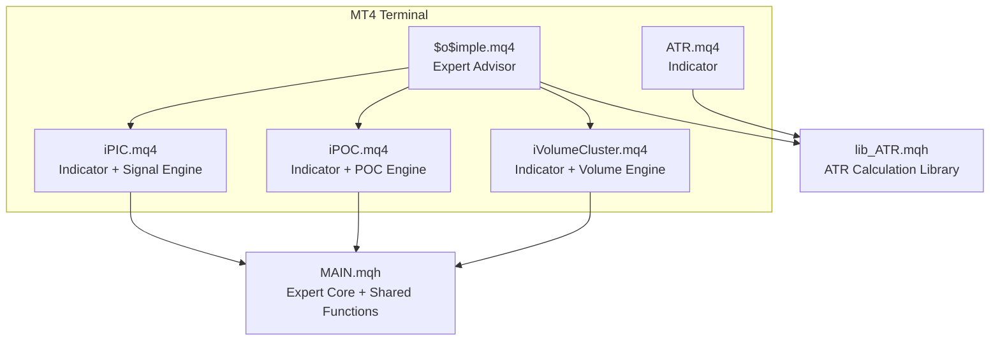
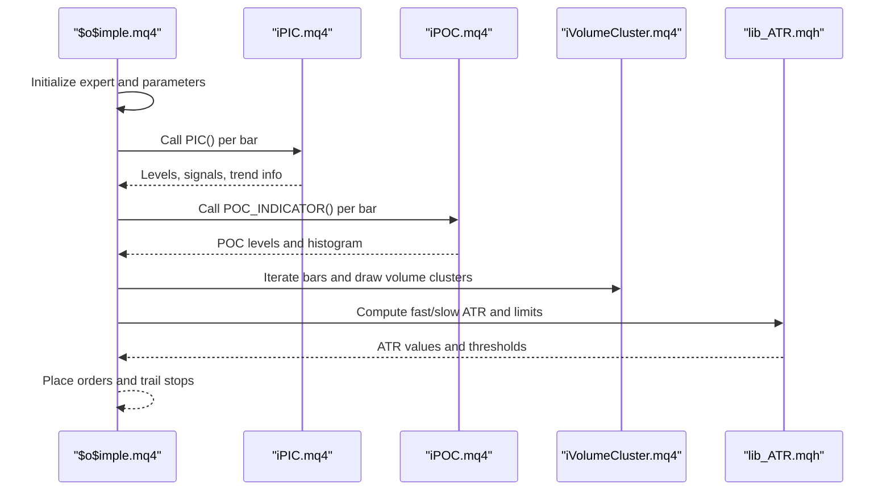
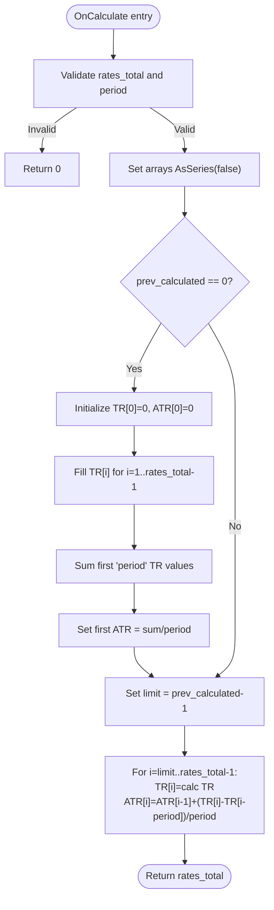
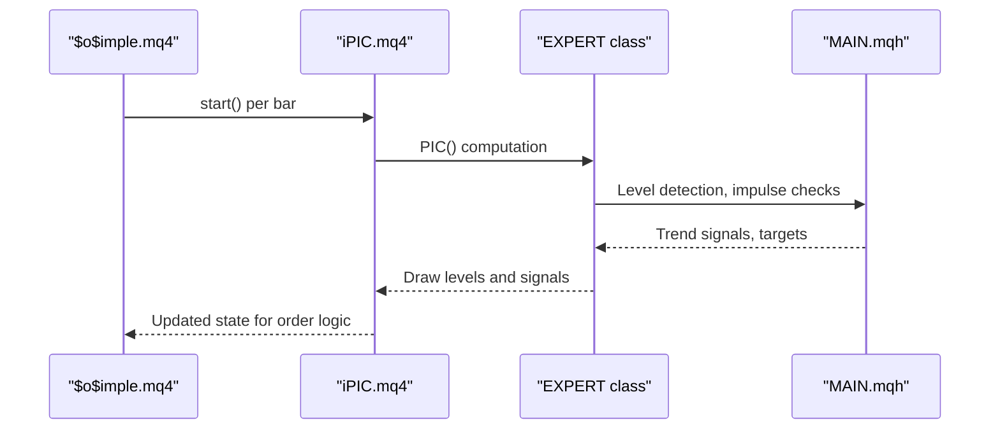
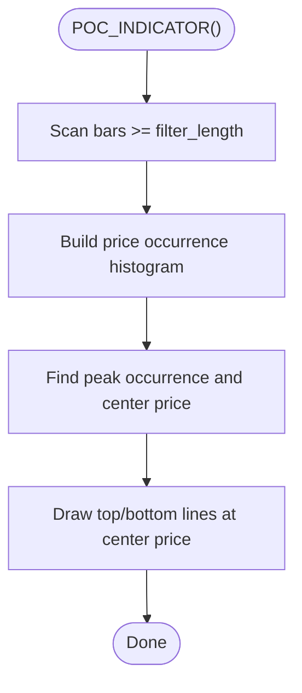
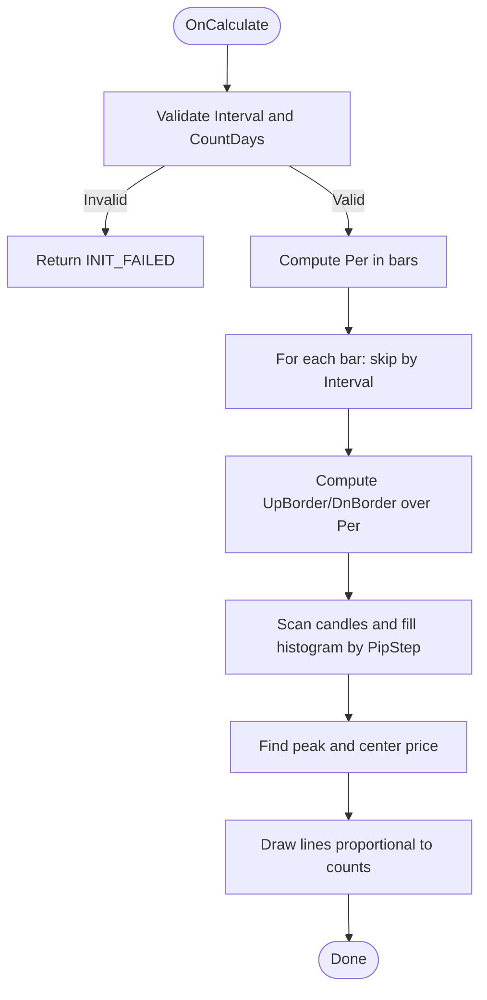
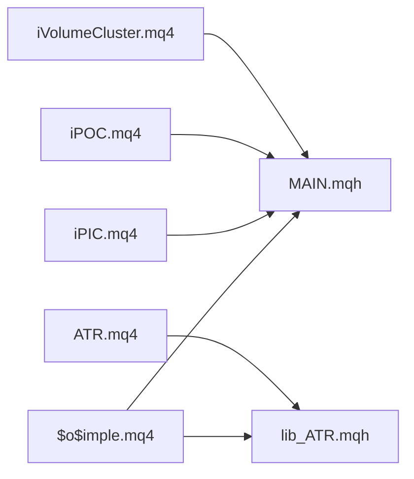

# Custom Technical Indicators

<cite>
**Referenced Files in This Document**
- [ATR.mq4](file://MT/MQL4/Indicators/ATR.mq4)
- [iPIC.mq4](file://MT/MQL4/Indicators/iPIC.mq4)
- [iPOC.mq4](file://MT/MQL4/Indicators/iPOC.mq4)
- [iVolumeCluster.mq4](file://MT/MQL4/Indicators/iVolumeCluster.mq4)
- [lib_ATR.mqh](file://MT/MQL4/Include/lib_ATR.mqh)
- [$o$imple.mq4](file://MT/MQL4/Experts/$o$imple.mq4)
- [MAIN.mqh](file://MT/MQL4/Include/MAIN.mqh)
</cite>

## Table of Contents
1. [Introduction](#introduction)
2. [Project Structure](#project-structure)
3. [Core Components](#core-components)
4. [Architecture Overview](#architecture-overview)
5. [Detailed Component Analysis](#detailed-component-analysis)
6. [Dependency Analysis](#dependency-analysis)
7. [Performance Considerations](#performance-considerations)
8. [Troubleshooting Guide](#troubleshooting-guide)
9. [Conclusion](#conclusion)

## Introduction
This document explains the custom technical indicators used in the SoSimple trading system: ATR, PIC, POC, and Volume Cluster. It covers calculation methods, parameters, visualization techniques, indicator data structures, buffer management, performance optimization, integration with the expert advisor, and practical guidance for development, tuning, and troubleshooting.

## Project Structure
The indicators are implemented as MQL4 custom indicators and integrated via shared libraries and the expert advisor:
- ATR: standalone indicator for volatility measurement
- PIC: chart-integrated indicator that also acts as a signal generator
- POC: chart-integrated indicator for price cluster detection
- Volume Cluster: chart-integrated indicator for volume distribution visualization

**Diagram sources**
- [ATR.mq4:11-47](file://MT/MQL4/Indicators/ATR.mq4#L11-L47)
- [iPIC.mq4:88-112](file://MT/MQL4/Indicators/iPIC.mq4#L88-L112)
- [iPOC.mq4:35-48](file://MT/MQL4/Indicators/iPOC.mq4#L35-L48)
- [iVolumeCluster.mq4:30-42](file://MT/MQL4/Indicators/iVolumeCluster.mq4#L30-L42)
- [lib_ATR.mqh:2-47](file://MT/MQL4/Include/lib_ATR.mqh#L2-L47)
- [$o$imple.mq4:100-122](file://MT/MQL4/Experts/$o$imple.mq4#L100-L122)

**Section sources**
- [ATR.mq4:11-47](file://MT/MQL4/Indicators/ATR.mq4#L11-L47)
- [iPIC.mq4:88-112](file://MT/MQL4/Indicators/iPIC.mq4#L88-L112)
- [iPOC.mq4:35-48](file://MT/MQL4/Indicators/iPOC.mq4#L35-L48)
- [iVolumeCluster.mq4:30-42](file://MT/MQL4/Indicators/iVolumeCluster.mq4#L30-L42)
- [lib_ATR.mqh:2-47](file://MT/MQL4/Include/lib_ATR.mqh#L2-L47)
- [$o$imple.mq4:100-122](file://MT/MQL4/Experts/$o$imple.mq4#L100-L122)

## Core Components
- ATR.mq4: Computes Average True Range with a configurable period, draws a separate window line, and manages two buffers (True Range and ATR).
- iPIC.mq4: A chart-integrated indicator that exposes extensive input parameters and integrates with the SoSimple expert advisor’s signal engine.
- iPOC.mq4: A chart-integrated indicator that detects price clusters and draws support/resistance lines.
- iVolumeCluster.mq4: A chart-integrated indicator that visualizes volume distribution across price ranges with configurable interval and days.

Key integration points:
- The expert advisor includes shared libraries and invokes indicator engines for PIC and POC.
- ATR is computed via a dedicated library used by both indicators and the expert advisor.

**Section sources**
- [ATR.mq4:11-47](file://MT/MQL4/Indicators/ATR.mq4#L11-L47)
- [iPIC.mq4:13-66](file://MT/MQL4/Indicators/iPIC.mq4#L13-L66)
- [iPOC.mq4:16-36](file://MT/MQL4/Indicators/iPOC.mq4#L16-L36)
- [iVolumeCluster.mq4:16-26](file://MT/MQL4/Indicators/iVolumeCluster.mq4#L16-L26)
- [lib_ATR.mqh:2-47](file://MT/MQL4/Include/lib_ATR.mqh#L2-L47)
- [$o$imple.mq4:100-122](file://MT/MQL4/Experts/$o$imple.mq4#L100-L122)

## Architecture Overview
The SoSimple system composes indicators and the expert advisor through shared libraries. The expert advisor orchestrates signal generation and order management, while indicators provide visual context and computed levels.

**Diagram sources**
- [iPIC.mq4:116-126](file://MT/MQL4/Indicators/iPIC.mq4#L116-L126)
- [iPOC.mq4:51-58](file://MT/MQL4/Indicators/iPOC.mq4#L51-L58)
- [iVolumeCluster.mq4:43-55](file://MT/MQL4/Indicators/iVolumeCluster.mq4#L43-L55)
- [lib_ATR.mqh:2-47](file://MT/MQL4/Include/lib_ATR.mqh#L2-L47)
- [$o$imple.mq4:117-142](file://MT/MQL4/Experts/$o$imple.mq4#L117-L142)

## Detailed Component Analysis

### ATR Indicator
- Purpose: Volatility measure used by other indicators and the expert advisor for stop/limit sizing and thresholds.
- Calculation method:
  - True Range per bar is the maximum of:
    - High minus Low
    - Absolute high minus previous close
    - Absolute low minus previous close
  - ATR is a smoothed moving average of True Range over the configured period.
- Parameters:
  - Period: integer ATR period
- Buffers:
  - One plotted buffer for ATR values
  - Additional internal buffer for True Range
- Visualization:
  - Separate window indicator with a single colored line
- Initialization and recalculation:
  - Sets buffer styles and labels
  - Draws from the first valid index after the smoothing period
- Integration:
  - Used by the expert advisor and other indicators for stop/limit thresholds

**Diagram sources**
- [ATR.mq4:51-103](file://MT/MQL4/Indicators/ATR.mq4#L51-L103)

**Section sources**
- [ATR.mq4:11-47](file://MT/MQL4/Indicators/ATR.mq4#L11-L47)
- [ATR.mq4:51-103](file://MT/MQL4/Indicators/ATR.mq4#L51-L103)

### PIC Indicator
- Purpose: Detects price action levels (peaks/flats) and generates trend signals based on level breaks and impulse criteria.
- Inputs and parameters:
  - Fractal period, filter length, power thresholds, impulse detection, trend filters, ATR parameters, ML optimization controls, and output/exit parameters
- Visualization:
  - Draws chart lines representing detected levels and signals
- Data structures:
  - Uses shared expert class with arrays for levels, impulses, targets, and trend signals
- Integration:
  - Called by the expert advisor per bar to compute levels and signals
  - Exposes external variables to the chart for monitoring

**Diagram sources**
- [iPIC.mq4:116-126](file://MT/MQL4/Indicators/iPIC.mq4#L116-L126)
- [MAIN.mqh:117-143](file://MT/MQL4/Include/MAIN.mqh#L117-L143)

**Section sources**
- [iPIC.mq4:13-66](file://MT/MQL4/Indicators/iPIC.mq4#L13-L66)
- [iPIC.mq4:100-112](file://MT/MQL4/Indicators/iPIC.mq4#L100-L112)
- [iPIC.mq4:116-126](file://MT/MQL4/Indicators/iPIC.mq4#L116-L126)
- [MAIN.mqh:117-143](file://MT/MQL4/Include/MAIN.mqh#L117-L143)

### POC Indicator
- Purpose: Identifies price consolidation clusters and highlights the most frequently visited price area.
- Calculation method:
  - Scans recent candles within a configurable filter length
  - Builds a histogram of price occurrences at discrete intervals
  - Marks the peak cluster area and surrounding support/resistance bands
- Parameters:
  - Filter length, POC scale, ATR parameters for stop/limit increments
- Visualization:
  - Draws top and bottom lines around the cluster area
  - Optional histogram overlay with configurable colors

**Diagram sources**
- [iPOC.mq4:51-58](file://MT/MQL4/Indicators/iPOC.mq4#L51-L58)

**Section sources**
- [iPOC.mq4:16-36](file://MT/MQL4/Indicators/iPOC.mq4#L16-L36)
- [iPOC.mq4:39-48](file://MT/MQL4/Indicators/iPOC.mq4#L39-L48)
- [iPOC.mq4:51-58](file://MT/MQL4/Indicators/iPOC.mq4#L51-L58)

### Volume Cluster Indicator
- Purpose: Visualizes volume distribution across price ranges for a given interval and number of days.
- Calculation method:
  - Defines a scanning range based on high/low over a window
  - Steps through price levels by a configurable pip step
  - Counts candle intrusions per price level to build a distribution
  - Draws horizontal lines proportional to volume counts
- Parameters:
  - Interval (daily or weekly), CountDays, PipStep, colors for histogram and peak zone
- Visualization:
  - Draws vertical lines at bar positions weighted by volume counts
  - Highlights the peak volume zone

**Diagram sources**
- [iVolumeCluster.mq4:30-55](file://MT/MQL4/Indicators/iVolumeCluster.mq4#L30-L55)
- [iVolumeCluster.mq4:57-93](file://MT/MQL4/Indicators/iVolumeCluster.mq4#L57-L93)

**Section sources**
- [iVolumeCluster.mq4:16-26](file://MT/MQL4/Indicators/iVolumeCluster.mq4#L16-L26)
- [iVolumeCluster.mq4:30-42](file://MT/MQL4/Indicators/iVolumeCluster.mq4#L30-L42)
- [iVolumeCluster.mq4:43-55](file://MT/MQL4/Indicators/iVolumeCluster.mq4#L43-L55)
- [iVolumeCluster.mq4:57-93](file://MT/MQL4/Indicators/iVolumeCluster.mq4#L57-L93)

## Dependency Analysis
- Expert Advisor ($o$imple.mq4) includes shared libraries and delegates indicator computations to the expert class.
- PIC and POC indicators rely on the shared expert class and drawing utilities.
- ATR library provides standardized ATR computation used by the expert advisor and other indicators.

**Diagram sources**
- [$o$imple.mq4:100-122](file://MT/MQL4/Experts/$o$imple.mq4#L100-L122)
- [MAIN.mqh:1-109](file://MT/MQL4/Include/MAIN.mqh#L1-L109)
- [lib_ATR.mqh:2-47](file://MT/MQL4/Include/lib_ATR.mqh#L2-L47)
- [ATR.mq4:11-18](file://MT/MQL4/Indicators/ATR.mq4#L11-L18)

**Section sources**
- [$o$imple.mq4:100-122](file://MT/MQL4/Experts/$o$imple.mq4#L100-L122)
- [MAIN.mqh:1-109](file://MT/MQL4/Include/MAIN.mqh#L1-L109)
- [lib_ATR.mqh:2-47](file://MT/MQL4/Include/lib_ATR.mqh#L2-L47)
- [ATR.mq4:11-18](file://MT/MQL4/Indicators/ATR.mq4#L11-L18)

## Performance Considerations
- Efficient loops:
  - Use prev_calculated to avoid recalculating all historical bars on each tick.
  - Limit scanning windows (e.g., POC and Volume Cluster) to recent bars and configurable periods.
- Buffer management:
  - Ensure arrays are marked AsSeries(false) for proper indexing.
  - Pre-size arrays only when necessary and reuse buffers across calculations.
- Drawing overhead:
  - Minimize chart object creation; reuse identifiers and clear old objects when parameters change.
- Parameter bounds:
  - Validate inputs early to prevent invalid states and costly fallbacks.

[No sources needed since this section provides general guidance]

## Troubleshooting Guide
Common issues and remedies:
- Wrong input parameters:
  - ATR: Period must be positive; otherwise initialization fails.
  - Volume Cluster: Interval and CountDays must be within allowed ranges.
- Missing minute history:
  - POC depends on minute timeframe data; ensure it is present for accurate cluster detection.
- Chart object conflicts:
  - Clear existing objects before drawing new ones to avoid overlaps.
- ATR computation anomalies:
  - ATR library computes fast/slow ATR and daily resets; ensure sufficient history and handle edge cases when Bars < period.

**Section sources**
- [ATR.mq4:38-42](file://MT/MQL4/Indicators/ATR.mq4#L38-L42)
- [iVolumeCluster.mq4:32-33](file://MT/MQL4/Indicators/iVolumeCluster.mq4#L32-L33)
- [iPOC.mq4:46-47](file://MT/MQL4/Indicators/iPOC.mq4#L46-L47)
- [lib_ATR.mqh:18-21](file://MT/MQL4/Include/lib_ATR.mqh#L18-L21)

## Conclusion
The SoSimple system integrates four custom indicators—ATR, PIC, POC, and Volume Cluster—into a cohesive trading framework. ATR provides volatility anchors, PIC and POC deliver actionable levels and clusters, and Volume Cluster enhances context with volume-weighted support/resistance. Proper parameter tuning, buffer management, and integration with the expert advisor enable robust and efficient trading logic.