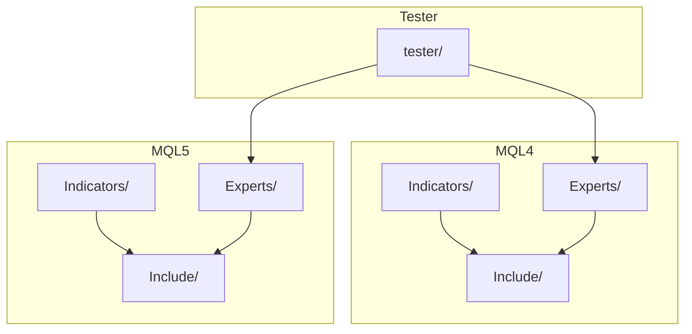
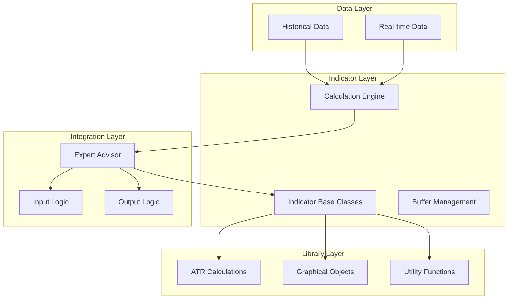
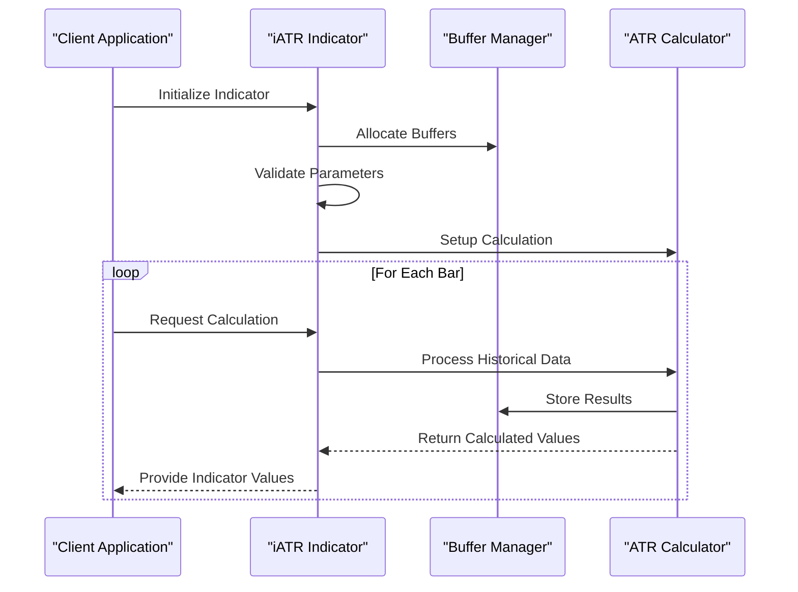
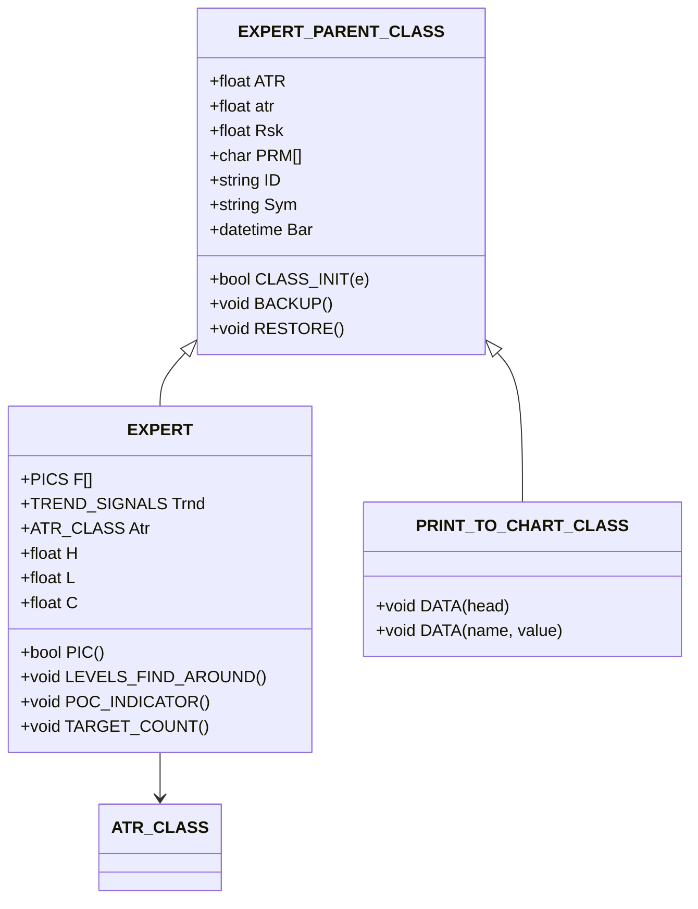
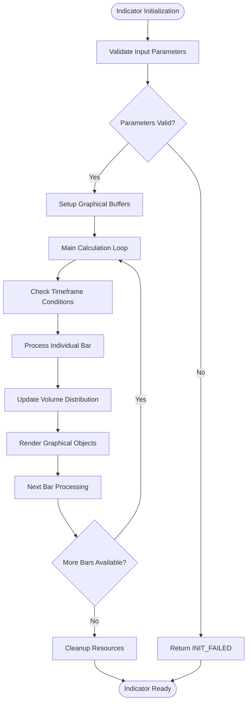
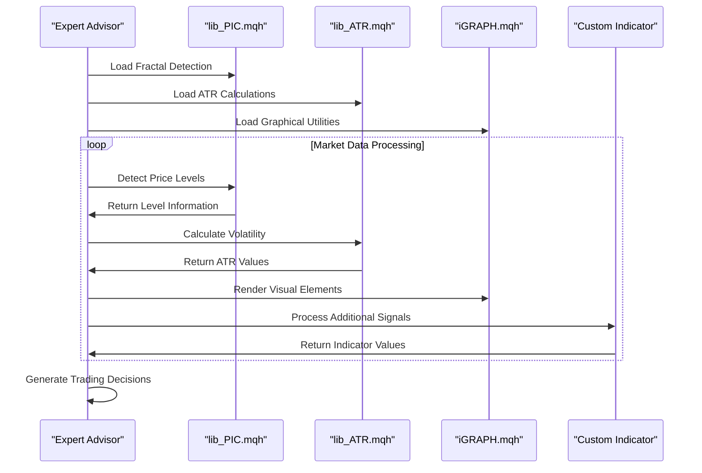
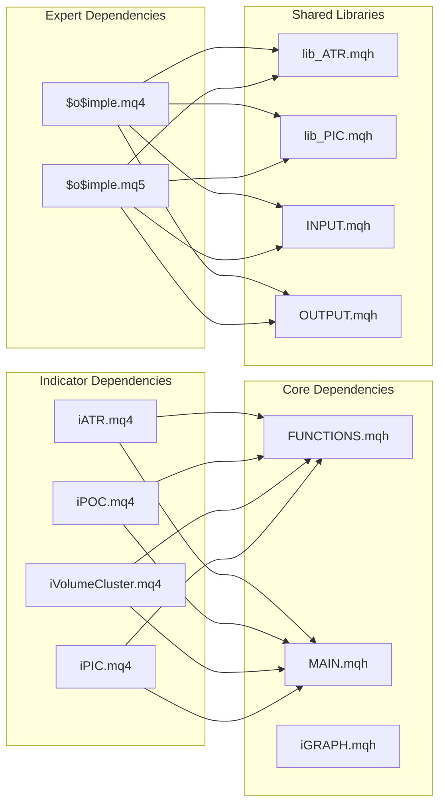

# Indicator Development Guide

<cite>
**Referenced Files in This Document**
- [iATR.mq4](file://MT/MQL4/Indicators/iATR.mq4)
- [iPIC.mq4](file://MT/MQL4/Indicators/iPIC.mq4)
- [iPOC.mq4](file://MT/MQL4/Indicators/iPOC.mq4)
- [iVolumeCluster.mq4](file://MT/MQL4/Indicators/iVolumeCluster.mq4)
- [FUNCTIONS.mqh](file://MT/MQL4/Include/FUNCTIONS.mqh)
- [MAIN.mqh](file://MT/MQL4/Include/MAIN.mqh)
- [INPUT.mqh](file://MT/MQL4/Include/INPUT.mqh)
- [OUTPUT.mqh](file://MT/MQL4/Include/OUTPUT.mqh)
- [iGRAPH.mqh](file://MT/MQL4/Include/iGRAPH.mqh)
- [lib_ATR.mqh](file://MT/MQL4/Include/lib_ATR.mqh)
- [$o$imple.mq4](file://MT/MQL4/Experts/$o$imple.mq4)
- [MAIN.mqh](file://MT/MQL5/Include/MAIN.mqh)
- [FUNCTIONS.mqh](file://MT/MQL5/Include/FUNCTIONS.mqh)
- [$o$imple.mq5](file://MT/MQL5/Experts/$o$imple.mq5)
</cite>

## Table of Contents
1. [Introduction](#introduction)
2. [Project Structure](#project-structure)
3. [Core Components](#core-components)
4. [Architecture Overview](#architecture-overview)
5. [Detailed Component Analysis](#detailed-component-analysis)
6. [Dependency Analysis](#dependency-analysis)
7. [Performance Considerations](#performance-considerations)
8. [Troubleshooting Guide](#troubleshooting-guide)
9. [Conclusion](#conclusion)

## Introduction
This guide provides comprehensive documentation for developing custom indicators within the SoSimple trading system. It covers MQL4/MQL5 indicator development patterns, buffer management strategies, performance optimization techniques, parameter handling, data validation, indicator registration, visualization options, integration with the expert advisor system, and testing methodologies. The content is derived from the actual implementation patterns present in the SoSimple codebase.

## Project Structure
The indicator development ecosystem in SoSimple consists of:
- Indicator implementations under MT/MQL4/Indicators and MT/MQL5/Indicators
- Reusable libraries and include files under MT/MQL4/Include and MT/MQL5/Include
- Expert advisors that integrate indicators and manage trading logic
- Testing infrastructure under MT/tester



**Diagram sources**
- [iATR.mq4](file://MT/MQL4/Indicators/iATR.mq4)
- [iPIC.mq4](file://MT/MQL4/Indicators/iPIC.mq4)
- [FUNCTIONS.mqh](file://MT/MQL4/Include/FUNCTIONS.mqh)
- [MAIN.mqh](file://MT/MQL4/Include/MAIN.mqh)
- [$o$imple.mq4](file://MT/MQL4/Experts/$o$imple.mq4)
- [MAIN.mqh](file://MT/MQL5/Include/MAIN.mqh)
- [FUNCTIONS.mqh](file://MT/MQL5/Include/FUNCTIONS.mqh)
- [$o$imple.mq5](file://MT/MQL5/Experts/$o$imple.mq5)

**Section sources**
- [iATR.mq4](file://MT/MQL4/Indicators/iATR.mq4)
- [iPIC.mq4](file://MT/MQL4/Indicators/iPIC.mq4)
- [FUNCTIONS.mqh](file://MT/MQL4/Include/FUNCTIONS.mqh)
- [MAIN.mqh](file://MT/MQL4/Include/MAIN.mqh)
- [$o$imple.mq4](file://MT/MQL4/Experts/$o$imple.mq4)
- [MAIN.mqh](file://MT/MQL5/Include/MAIN.mqh)
- [FUNCTIONS.mqh](file://MT/MQL5/Include/FUNCTIONS.mqh)
- [$o$imple.mq5](file://MT/MQL5/Experts/$o$imple.mq5)

## Core Components
The core components for indicator development in SoSimple include:

### Indicator Base Patterns
- **Buffer Management**: All indicators define buffer arrays and use `IndicatorBuffers()` for allocation
- **Parameter Handling**: Input parameters are declared with `input` (MQL5) or `extern` (MQL4) keywords
- **Initialization**: `OnInit()` handles parameter validation and buffer setup
- **Calculation Loop**: `OnCalculate()` processes historical data with proper boundary checks

### Library Integration
- **ATR Calculation**: Centralized ATR computation via `lib_ATR.mqh`
- **Visualization Utilities**: Graphical object creation and management through `iGRAPH.mqh`
- **Expert Integration**: Indicators can be included in expert advisors for combined functionality

### Data Validation Strategies
- **Parameter Bounds Checking**: Early validation of input parameters
- **Array Boundary Protection**: Safe iteration with `rates_total` comparisons
- **Historical Data Verification**: Ensuring sufficient data availability before calculations

**Section sources**
- [iATR.mq4](file://MT/MQL4/Indicators/iATR.mq4)
- [iPOC.mq4](file://MT/MQL4/Indicators/iPOC.mq4)
- [iVolumeCluster.mq4](file://MT/MQL4/Indicators/iVolumeCluster.mq4)
- [lib_ATR.mqh](file://MT/MQL4/Include/lib_ATR.mqh)
- [iGRAPH.mqh](file://MT/MQL4/Include/iGRAPH.mqh)

## Architecture Overview
The SoSimple indicator architecture follows a layered pattern with clear separation of concerns:



**Diagram sources**
- [MAIN.mqh](file://MT/MQL4/Include/MAIN.mqh)
- [INPUT.mqh](file://MT/MQL4/Include/INPUT.mqh)
- [OUTPUT.mqh](file://MT/MQL4/Include/OUTPUT.mqh)
- [FUNCTIONS.mqh](file://MT/MQL4/Include/FUNCTIONS.mqh)
- [iGRAPH.mqh](file://MT/MQL4/Include/iGRAPH.mqh)
- [lib_ATR.mqh](file://MT/MQL4/Include/lib_ATR.mqh)

## Detailed Component Analysis

### ATR Indicator Implementation
The ATR indicator demonstrates robust buffer management and calculation patterns:



**Diagram sources**
- [iATR.mq4](file://MT/MQL4/Indicators/iATR.mq4)

**Section sources**
- [iATR.mq4](file://MT/MQL4/Indicators/iATR.mq4)

### PIC Indicator Architecture
The PIC indicator showcases advanced parameter handling and visualization:



**Diagram sources**
- [MAIN.mqh](file://MT/MQL4/Include/MAIN.mqh)
- [FUNCTIONS.mqh](file://MT/MQL4/Include/FUNCTIONS.mqh)

**Section sources**
- [iPIC.mq4](file://MT/MQL4/Indicators/iPIC.mq4)
- [MAIN.mqh](file://MT/MQL4/Include/MAIN.mqh)
- [FUNCTIONS.mqh](file://MT/MQL4/Include/FUNCTIONS.mqh)

### Volume Cluster Indicator Pattern
The Volume Cluster indicator demonstrates advanced buffer management and graphical rendering:



**Diagram sources**
- [iVolumeCluster.mq4](file://MT/MQL4/Indicators/iVolumeCluster.mq4)

**Section sources**
- [iVolumeCluster.mq4](file://MT/MQL4/Indicators/iVolumeCluster.mq4)

### Expert Advisor Integration
The expert advisor system integrates indicators through shared libraries:



**Diagram sources**
- [$o$imple.mq4](file://MT/MQL4/Experts/$o$imple.mq4)
- [MAIN.mqh](file://MT/MQL4/Include/MAIN.mqh)
- [INPUT.mqh](file://MT/MQL4/Include/INPUT.mqh)
- [OUTPUT.mqh](file://MT/MQL4/Include/OUTPUT.mqh)
- [iGRAPH.mqh](file://MT/MQL4/Include/iGRAPH.mqh)
- [lib_ATR.mqh](file://MT/MQL4/Include/lib_ATR.mqh)

**Section sources**
- [$o$imple.mq4](file://MT/MQL4/Experts/$o$imple.mq4)
- [MAIN.mqh](file://MT/MQL4/Include/MAIN.mqh)
- [INPUT.mqh](file://MT/MQL4/Include/INPUT.mqh)
- [OUTPUT.mqh](file://MT/MQL4/Include/OUTPUT.mqh)
- [iGRAPH.mqh](file://MT/MQL4/Include/iGRAPH.mqh)
- [lib_ATR.mqh](file://MT/MQL4/Include/lib_ATR.mqh)

## Dependency Analysis
The indicator development system exhibits well-structured dependencies:



**Diagram sources**
- [FUNCTIONS.mqh](file://MT/MQL4/Include/FUNCTIONS.mqh)
- [MAIN.mqh](file://MT/MQL4/Include/MAIN.mqh)
- [iGRAPH.mqh](file://MT/MQL4/Include/iGRAPH.mqh)
- [iATR.mq4](file://MT/MQL4/Indicators/iATR.mq4)
- [iPOC.mq4](file://MT/MQL4/Indicators/iPOC.mq4)
- [iVolumeCluster.mq4](file://MT/MQL4/Indicators/iVolumeCluster.mq4)
- [iPIC.mq4](file://MT/MQL4/Indicators/iPIC.mq4)
- [$o$imple.mq4](file://MT/MQL4/Experts/$o$imple.mq4)
- [$o$imple.mq5](file://MT/MQL5/Experts/$o$imple.mq5)
- [lib_ATR.mqh](file://MT/MQL4/Include/lib_ATR.mqh)
- [INPUT.mqh](file://MT/MQL4/Include/INPUT.mqh)
- [OUTPUT.mqh](file://MT/MQL4/Include/OUTPUT.mqh)

**Section sources**
- [FUNCTIONS.mqh](file://MT/MQL4/Include/FUNCTIONS.mqh)
- [MAIN.mqh](file://MT/MQL4/Include/MAIN.mqh)
- [iGRAPH.mqh](file://MT/MQL4/Include/iGRAPH.mqh)
- [iATR.mq4](file://MT/MQL4/Indicators/iATR.mq4)
- [iPOC.mq4](file://MT/MQL4/Indicators/iPOC.mq4)
- [iVolumeCluster.mq4](file://MT/MQL4/Indicators/iVolumeCluster.mq4)
- [iPIC.mq4](file://MT/MQL4/Indicators/iPIC.mq4)
- [$o$imple.mq4](file://MT/MQL4/Experts/$o$imple.mq4)
- [$o$imple.mq5](file://MT/MQL5/Experts/$o$imple.mq5)
- [lib_ATR.mqh](file://MT/MQL4/Include/lib_ATR.mqh)
- [INPUT.mqh](file://MT/MQL4/Include/INPUT.mqh)
- [OUTPUT.mqh](file://MT/MQL4/Include/OUTPUT.mqh)

## Performance Considerations
Key performance optimization strategies demonstrated in the SoSimple codebase:

### Memory Management
- **Buffer Pre-allocation**: All indicators pre-allocate required buffers in `OnInit()`
- **Array Resizing**: Dynamic array resizing only when necessary
- **Memory Cleanup**: Proper cleanup in `OnDeinit()` handlers

### Calculation Efficiency
- **Boundary Checking**: Early termination when insufficient data is available
- **Loop Optimization**: Single-pass calculations with minimal redundant operations
- **Historical Data Access**: Efficient use of built-in MQL functions for data retrieval

### Visualization Performance
- **Object Management**: Efficient creation and deletion of graphical objects
- **Conditional Rendering**: Only render objects when in testing mode or specific conditions
- **Batch Operations**: Group similar operations to minimize API calls

## Troubleshooting Guide
Common issues and their solutions in SoSimple indicator development:

### Parameter Validation
```mql
// Example pattern for parameter validation
if (parameter <= 0 || parameter >= threshold) {
    Print("Invalid parameter value: ", parameter);
    return(INIT_FAILED);
}
```

### Error Handling Patterns
- **ATR Calculation Errors**: Check for zero or negative ATR values
- **Buffer Allocation Failures**: Verify buffer allocation success
- **Graphical Object Creation**: Handle object creation failures gracefully

### Debugging Techniques
- **Logging**: Use `Print()` statements for debugging during development
- **Conditional Compilation**: Enable debug output only in testing mode
- **Data Validation**: Verify data boundaries before processing

**Section sources**
- [iATR.mq4](file://MT/MQL4/Indicators/iATR.mq4)
- [iVolumeCluster.mq4](file://MT/MQL4/Indicators/iVolumeCluster.mq4)
- [iGRAPH.mqh](file://MT/MQL4/Include/iGRAPH.mqh)

## Conclusion
The SoSimple trading system provides a robust foundation for custom indicator development through its well-structured architecture, comprehensive library system, and integrated expert advisor framework. The patterns demonstrated in the codebase offer proven approaches for buffer management, parameter handling, data validation, and performance optimization. By following these established patterns and leveraging the shared libraries, developers can create reliable, efficient indicators that seamlessly integrate with the SoSimple trading ecosystem.

The key takeaways for indicator development in SoSimple include:
- Follow the established initialization and calculation patterns
- Utilize the shared library system for common functionality
- Implement comprehensive parameter validation and error handling
- Optimize for performance through efficient buffer management and calculation loops
- Integrate properly with the expert advisor system for combined functionality