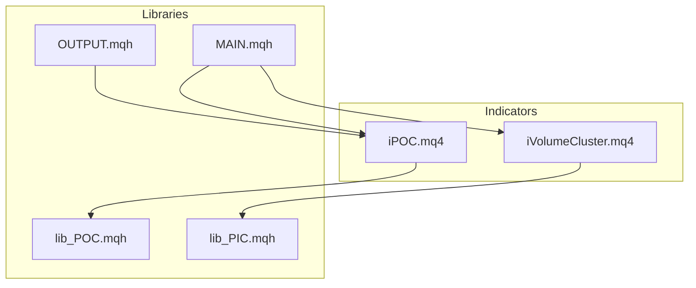
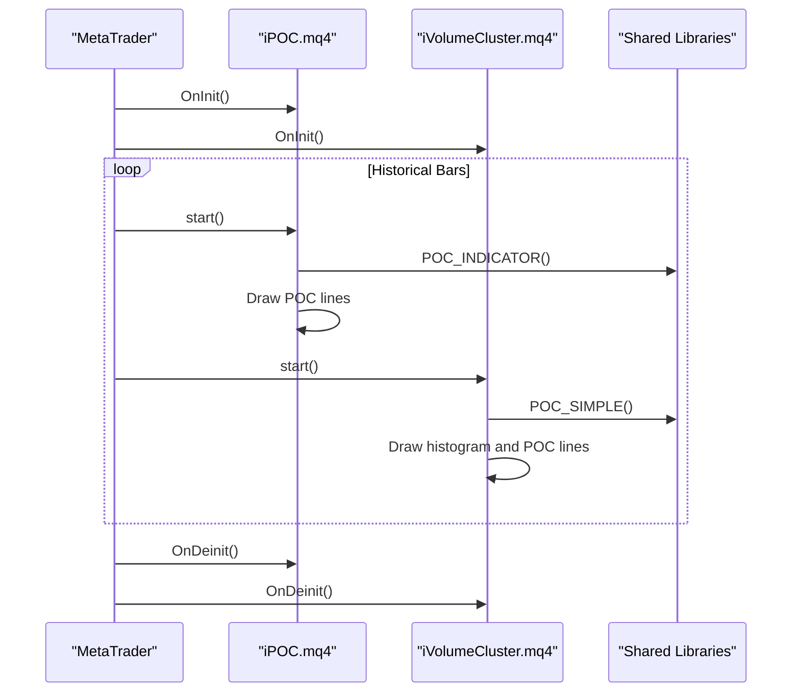
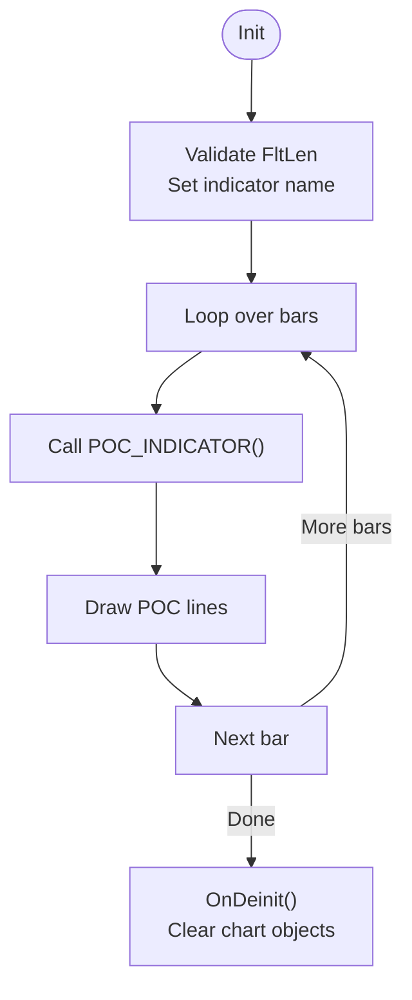
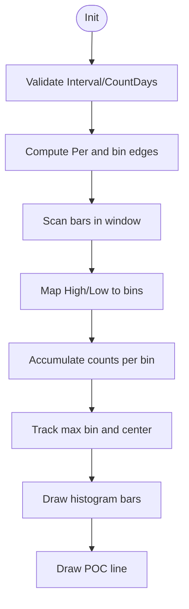
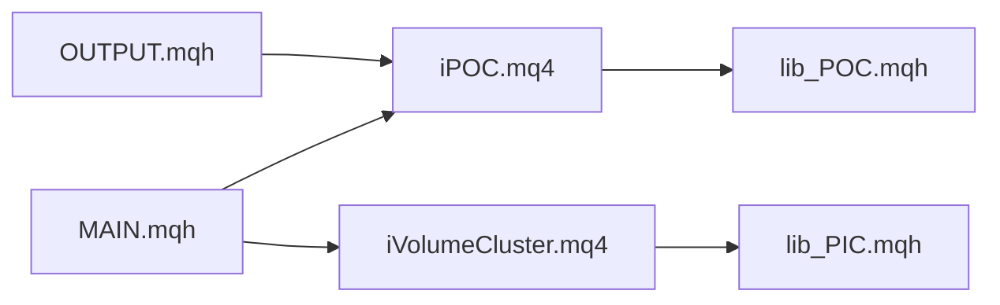

# Point of Control (POC) Indicator

<cite>
**Referenced Files in This Document**
- [iPOC.mq4](file://MT/MQL4/Indicators/iPOC.mq4)
- [iVolumeCluster.mq4](file://MT/MQL4/Indicators/iVolumeCluster.mq4)
- [lib_POC.mqh](file://MT/MQL4/Trash/lib_POC.mqh)
- [lib_PIC.mqh](file://MT/MQL4/Include/lib_PIC.mqh)
- [OUTPUT.mqh](file://MT/MQL4/Include/OUTPUT.mqh)
- [MAIN.mqh](file://MT/MQL4/Include/MAIN.mqh)
</cite>

## Table of Contents
1. [Introduction](#introduction)
2. [Project Structure](#project-structure)
3. [Core Components](#core-components)
4. [Architecture Overview](#architecture-overview)
5. [Detailed Component Analysis](#detailed-component-analysis)
6. [Dependency Analysis](#dependency-analysis)
7. [Performance Considerations](#performance-considerations)
8. [Troubleshooting Guide](#troubleshooting-guide)
9. [Conclusion](#conclusion)

## Introduction
This document explains the Point of Control (POC) indicator implementation in the SoSimple repository. The POC identifies the price level with the highest trading volume during a specified period. It aggregates volume or bar presence across price bins and detects the peak bin as the POC level. The implementation includes:
- A histogram-style visualization of volume distribution across price bins
- Peak detection logic that selects the bin with maximum counts
- Optional center refinement to locate the precise price level within the peak bin
- Parameterized configuration for bin size, color, and filtering thresholds
- Integration hooks for trading logic and visualization

## Project Structure
The POC functionality spans indicator implementations and shared libraries:
- Indicator implementations:
  - iPOC.mq4: A consolidation-based POC indicator that draws POC lines and histograms
  - iVolumeCluster.mq4: A volume-based POC indicator that computes and visualizes volume distribution
- Shared libraries:
  - lib_POC.mqh: Defines POC computation constants and outlines alternative calculation modes
  - lib_PIC.mqh: Contains POC_SIMPLE implementation for flat/consolidation detection
  - OUTPUT.mqh and MAIN.mqh: Provide integration points for POC usage in trading logic

**Diagram sources**
- [iPOC.mq4:34-36](file://MT/MQL4/Indicators/iPOC.mq4#L34-L36)
- [iVolumeCluster.mq4:57-93](file://MT/MQL4/Indicators/iVolumeCluster.mq4#L57-L93)
- [lib_POC.mqh:1-16](file://MT/MQL4/Trash/lib_POC.mqh#L1-L16)
- [lib_PIC.mqh:579-590](file://MT/MQL4/Include/lib_PIC.mqh#L579-L590)
- [OUTPUT.mqh:91-128](file://MT/MQL4/Include/OUTPUT.mqh#L91-L128)
- [MAIN.mqh:90-98](file://MT/MQL4/Include/MAIN.mqh#L90-L98)

**Section sources**
- [iPOC.mq4:16-36](file://MT/MQL4/Indicators/iPOC.mq4#L16-L36)
- [iVolumeCluster.mq4:16-26](file://MT/MQL4/Indicators/iVolumeCluster.mq4#L16-L26)
- [lib_POC.mqh:5-16](file://MT/MQL4/Trash/lib_POC.mqh#L5-L16)
- [lib_PIC.mqh:579-590](file://MT/MQL4/Include/lib_PIC.mqh#L579-L590)
- [OUTPUT.mqh:91-128](file://MT/MQL4/Include/OUTPUT.mqh#L91-L128)
- [MAIN.mqh:90-98](file://MT/MQL4/Include/MAIN.mqh#L90-L98)

## Core Components
- iPOC.mq4: Consolidation-based POC indicator that:
  - Initializes indicator buffers and parameters
  - Computes POC via POC_INDICATOR() per historical bar
  - Draws POC lines and optional histogram bars
  - Uses ATR-based parameters for filtering and scaling
- iVolumeCluster.mq4: Volume-based POC indicator that:
  - Aggregates volume across price bins defined by PipStep
  - Identifies the bin with maximum counts as POC
  - Refines the POC price to the center of the peak bin
  - Visualizes POC lines and histogram bars
- lib_POC.mqh: Provides POC calculation modes and constants for alternative approaches
- lib_PIC.mqh: Implements POC_SIMPLE for flat/consolidation detection
- OUTPUT.mqh and MAIN.mqh: Integrate POC signals into trading decisions and visualization

Key parameters and behaviors:
- iPOC.mq4: FltLen (minimum bars for consolidation), PocColor, MaxPocColor, PocScale, ATR window sizes and scaling
- iVolumeCluster.mq4: Interval, CountDays, PipStep, PocColor, MaxPocColor

**Section sources**
- [iPOC.mq4:16-36](file://MT/MQL4/Indicators/iPOC.mq4#L16-L36)
- [iPOC.mq4:51-64](file://MT/MQL4/Indicators/iPOC.mq4#L51-L64)
- [iVolumeCluster.mq4:16-26](file://MT/MQL4/Indicators/iVolumeCluster.mq4#L16-L26)
- [iVolumeCluster.mq4:57-93](file://MT/MQL4/Indicators/iVolumeCluster.mq4#L57-L93)
- [lib_POC.mqh:5-16](file://MT/MQL4/Trash/lib_POC.mqh#L5-L16)
- [lib_PIC.mqh:579-590](file://MT/MQL4/Include/lib_PIC.mqh#L579-L590)
- [OUTPUT.mqh:91-128](file://MT/MQL4/Include/OUTPUT.mqh#L91-L128)
- [MAIN.mqh:90-98](file://MT/MQL4/Include/MAIN.mqh#L90-L98)

## Architecture Overview
The POC indicator architecture comprises:
- Indicator entry points (OnInit/start/deinit) that orchestrate computation and drawing
- Volume aggregation routines that scan price bins and accumulate counts
- Peak detection logic that identifies the maximum bin and refines the price level
- Visualization utilities that draw POC lines and histogram bars
- Integration points that leverage POC for trade decisions

**Diagram sources**
- [iPOC.mq4:39-64](file://MT/MQL4/Indicators/iPOC.mq4#L39-L64)
- [iVolumeCluster.mq4:30-55](file://MT/MQL4/Indicators/iVolumeCluster.mq4#L30-L55)
- [lib_POC.mqh:43-57](file://MT/MQL4/Trash/lib_POC.mqh#L43-L57)
- [lib_PIC.mqh:579-590](file://MT/MQL4/Include/lib_PIC.mqh#L579-L590)

## Detailed Component Analysis

### iPOC.mq4: Consolidation-Based POC
- Initialization:
  - Sets indicator buffers, labels, and parameter names
  - Validates FltLen and initializes indicator name with parameter suffix
- Computation loop:
  - Iterates over historical bars and invokes POC_INDICATOR() per bar
- Visualization:
  - Draws POC lines with configurable colors and scale
  - Uses ATR parameters for filtering and scaling thresholds
- Cleanup:
  - Clears chart objects on deinitialization

**Diagram sources**
- [iPOC.mq4:39-64](file://MT/MQL4/Indicators/iPOC.mq4#L39-L64)

**Section sources**
- [iPOC.mq4:39-64](file://MT/MQL4/Indicators/iPOC.mq4#L39-L64)
- [iPOC.mq4:16-36](file://MT/MQL4/Indicators/iPOC.mq4#L16-L36)

### iVolumeCluster.mq4: Volume-Based POC
- Initialization:
  - Validates interval and day count parameters
  - Computes Per based on CountDays and current timeframe
- Computation routine (POC_SIMPLE):
  - Defines bin width via PipStep and calculates bin edges
  - Scans bars within the aggregation window and increments counts for overlapping bins
  - Tracks the maximum count and updates the peak bin index
  - Refines the POC price to the center of the peak bin
- Visualization:
  - Draws histogram bars proportional to counts
  - Highlights the maximum POC with a distinct color and line

**Diagram sources**
- [iVolumeCluster.mq4:30-55](file://MT/MQL4/Indicators/iVolumeCluster.mq4#L30-L55)
- [iVolumeCluster.mq4:57-93](file://MT/MQL4/Indicators/iVolumeCluster.mq4#L57-L93)

**Section sources**
- [iVolumeCluster.mq4:30-55](file://MT/MQL4/Indicators/iVolumeCluster.mq4#L30-L55)
- [iVolumeCluster.mq4:57-93](file://MT/MQL4/Indicators/iVolumeCluster.mq4#L57-L93)

### lib_POC.mqh: Calculation Modes and Constants
- Defines alternative POC calculation modes:
  - MAX_FRONT, FRONT_X_PICS, PICS, PWR_SUM, PICS_PWR_KICK, BARS_KICK
- Provides default colors for POC histogram and maximum POC highlighting

These modes outline different strategies for peak detection and can guide extensions or alternative implementations.

**Section sources**
- [lib_POC.mqh:5-16](file://MT/MQL4/Trash/lib_POC.mqh#L5-L16)

### lib_PIC.mqh: POC_SIMPLE Implementation
- Implements POC_SIMPLE for flat/consolidation detection:
  - Updates zone boundaries as bars form
  - Counts consecutive bars within the zone
  - Computes POC center as the midpoint of the formed zone

This routine demonstrates a simpler consolidation-based approach to POC identification.

**Section sources**
- [lib_PIC.mqh:579-590](file://MT/MQL4/Include/lib_PIC.mqh#L579-L590)

### Integration Hooks: OUTPUT.mqh and MAIN.mqh
- OUTPUT.mqh:
  - Provides POC_CLOSE_TO_BUY() and POC_CLOSE_TO_SEL() checks
  - Uses PocCnt and PocCenter to detect proximity to POC for trade setup
- MAIN.mqh:
  - Declares POC_SIMPLE() and POC_INDICATOR() for integration
  - Exposes external variables for POC-related parameters

These hooks enable POC signals to influence trading logic and visualization.

**Section sources**
- [OUTPUT.mqh:91-128](file://MT/MQL4/Include/OUTPUT.mqh#L91-L128)
- [MAIN.mqh:90-98](file://MT/MQL4/Include/MAIN.mqh#L90-L98)

## Dependency Analysis
The POC implementation depends on shared libraries and indicator entry points. The following diagram shows key dependencies:

**Diagram sources**
- [iPOC.mq4:34-36](file://MT/MQL4/Indicators/iPOC.mq4#L34-L36)
- [iVolumeCluster.mq4:57-93](file://MT/MQL4/Indicators/iVolumeCluster.mq4#L57-L93)
- [lib_POC.mqh:1-16](file://MT/MQL4/Trash/lib_POC.mqh#L1-L16)
- [lib_PIC.mqh:579-590](file://MT/MQL4/Include/lib_PIC.mqh#L579-L590)
- [OUTPUT.mqh:91-128](file://MT/MQL4/Include/OUTPUT.mqh#L91-L128)
- [MAIN.mqh:90-98](file://MT/MQL4/Include/MAIN.mqh#L90-L98)

**Section sources**
- [iPOC.mq4:34-36](file://MT/MQL4/Indicators/iPOC.mq4#L34-L36)
- [iVolumeCluster.mq4:57-93](file://MT/MQL4/Indicators/iVolumeCluster.mq4#L57-L93)
- [lib_POC.mqh:1-16](file://MT/MQL4/Trash/lib_POC.mqh#L1-L16)
- [lib_PIC.mqh:579-590](file://MT/MQL4/Include/lib_PIC.mqh#L579-L590)
- [OUTPUT.mqh:91-128](file://MT/MQL4/Include/OUTPUT.mqh#L91-L128)
- [MAIN.mqh:90-98](file://MT/MQL4/Include/MAIN.mqh#L90-L98)

## Performance Considerations
- iVolumeCluster.mq4:
  - PipStep controls bin granularity; larger steps reduce computation time but decrease precision
  - Aggregation window (CountDays and Per) affects performance linearly with the number of bars scanned
- iPOC.mq4:
  - FltLen influences consolidation detection sensitivity and computational overhead
  - ATR parameters (A, a, dAtr, Ak, PicVal) impact filtering and scaling logic
- General:
  - Minimize redraws by limiting visualization updates to new bars
  - Use efficient binning strategies and avoid unnecessary array resizes

[No sources needed since this section provides general guidance]

## Troubleshooting Guide
- Parameter validation:
  - iPOC.mq4 prints an error if FltLen is invalid during initialization
  - iVolumeCluster.mq4 validates Interval and CountDays and alerts on invalid values
- Error handling:
  - Both indicators use ERROR_CHECK to capture and report trade/server errors
- Cleanup:
  - OnDeinit clears chart objects to prevent residual drawings

**Section sources**
- [iPOC.mq4:46](file://MT/MQL4/Indicators/iPOC.mq4#L46)
- [iVolumeCluster.mq4:32-33](file://MT/MQL4/Indicators/iVolumeCluster.mq4#L32-L33)
- [iVolumeCluster.mq4:96-110](file://MT/MQL4/Indicators/iVolumeCluster.mq4#L96-L110)

## Conclusion
The SoSimple repository implements POC through two complementary approaches:
- iPOC.mq4: Consolidation-based POC with ATR-driven filtering and histogram visualization
- iVolumeCluster.mq4: Volume-based POC with configurable binning and peak refinement

The shared libraries and integration hooks enable flexible deployment and trading logic integration. Proper parameter tuning and performance awareness ensure accurate and responsive POC detection suitable for support/resistance analysis and trading strategy development.