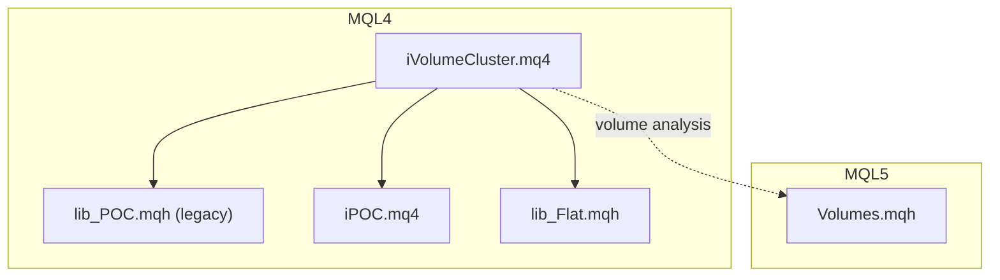
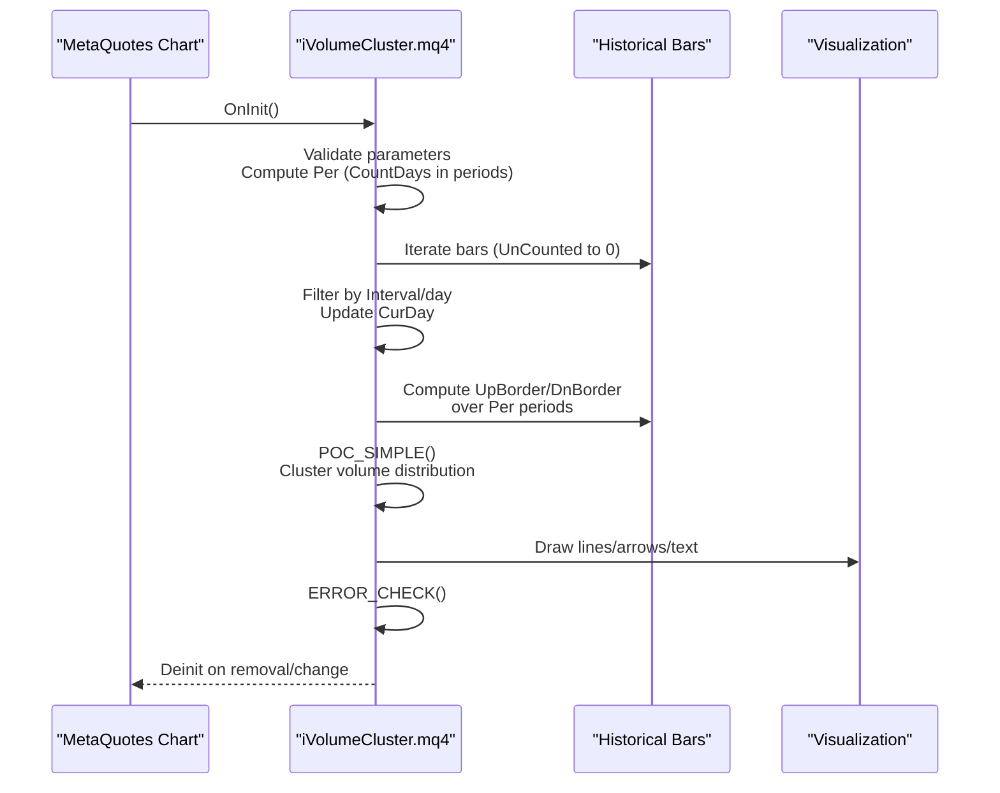
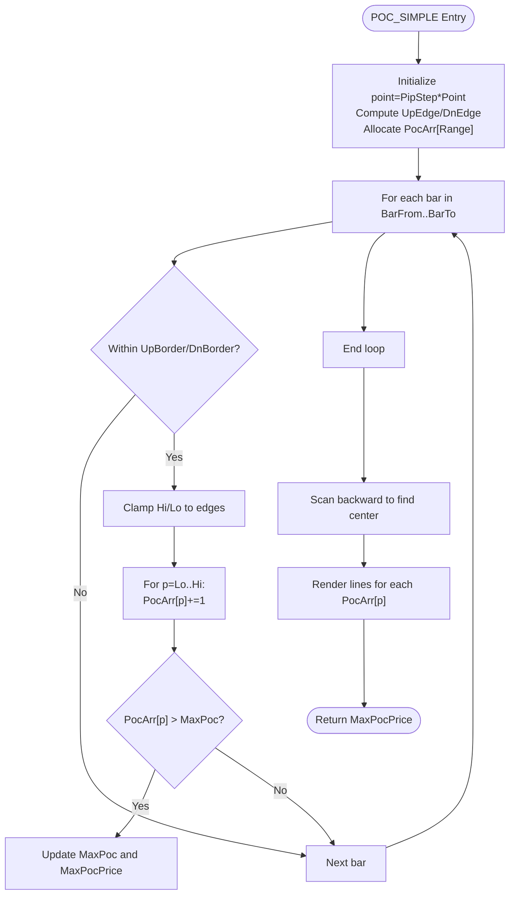
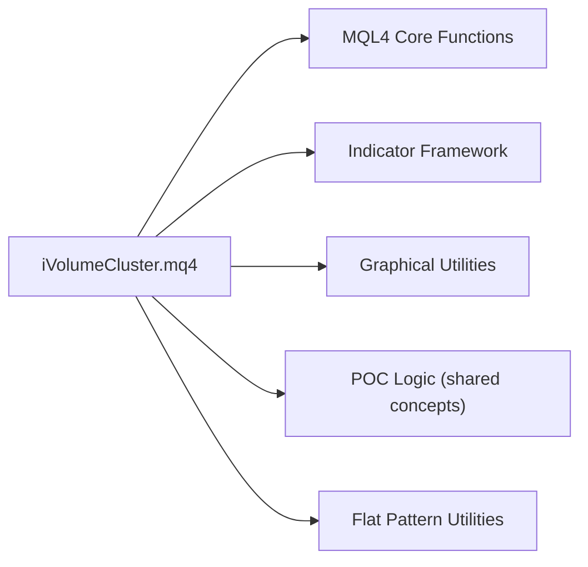

# Volume Cluster Indicator

<cite>
**Referenced Files in This Document**
- [iVolumeCluster.mq4](file://MT/MQL4/Indicators/iVolumeCluster.mq4)
- [iPOC.mq4](file://MT/MQL4/Indicators/iPOC.mq4)
- [lib_POC.mqh](file://MT/MQL4/Trash/lib_POC.mqh)
- [lib_Flat.mqh](file://MT/MQL4/Include/lib_Flat.mqh)
- [Volumes.mqh](file://MT/MQL5/Include/Indicators/Volumes.mqh)
</cite>

## Table of Contents
1. [Introduction](#introduction)
2. [Project Structure](#project-structure)
3. [Core Components](#core-components)
4. [Architecture Overview](#architecture-overview)
5. [Detailed Component Analysis](#detailed-component-analysis)
6. [Dependency Analysis](#dependency-analysis)
7. [Performance Considerations](#performance-considerations)
8. [Troubleshooting Guide](#troubleshooting-guide)
9. [Conclusion](#conclusion)

## Introduction
This document provides comprehensive documentation for the Volume Cluster indicator implementation in the SoSimple trading system. The indicator identifies significant volume spikes and price action clusters by analyzing the distribution of traded volume across price ranges over configurable time windows. It extends the concept of Point of Control (POC) clustering to detect areas where price has concentrated activity, enabling traders to identify potential support/resistance zones, breakout candidates, and liquidity hotspots.

The implementation leverages MQL4/MQL5 frameworks to process historical price and volume data, compute cluster distributions, and render visual signals on charts. This guide explains the clustering algorithm, volume analysis methodology, detection thresholds, statistical significance considerations, parameter tuning guidelines, visualization options, and practical applications for breakout identification, liquidity analysis, and market sentiment assessment.

## Project Structure
The Volume Cluster indicator resides within the MQL4 indicators directory and integrates with shared libraries and MQL5 indicator infrastructure:

- MQL4 indicator implementation: [iVolumeCluster.mq4](file://MT/MQL4/Indicators/iVolumeCluster.mq4)
- Related POC indicator: [iPOC.mq4](file://MT/MQL4/Indicators/iPOC.mq4)
- Legacy POC library: [lib_POC.mqh](file://MT/MQL4/Trash/lib_POC.mqh)
- Flat pattern and false break utilities: [lib_Flat.mqh](file://MT/MQL4/Include/lib_Flat.mqh)
- MQL5 volumes indicator interface: [Volumes.mqh](file://MT/MQL5/Include/Indicators/Volumes.mqh)

**Diagram sources**
- [iVolumeCluster.mq4:1-509](file://MT/MQL4/Indicators/iVolumeCluster.mq4#L1-L509)
- [iPOC.mq4:1-75](file://MT/MQL4/Indicators/iPOC.mq4#L1-L75)
- [lib_POC.mqh:1-57](file://MT/MQL4/Trash/lib_POC.mqh#L1-L57)
- [lib_Flat.mqh:1-155](file://MT/MQL4/Include/lib_Flat.mqh#L1-L155)
- [Volumes.mqh:1-424](file://MT/MQL5/Include/Indicators/Volumes.mqh#L1-L424)

**Section sources**
- [iVolumeCluster.mq4:1-509](file://MT/MQL4/Indicators/iVolumeCluster.mq4#L1-L509)
- [iPOC.mq4:1-75](file://MT/MQL4/Indicators/iPOC.mq4#L1-L75)
- [lib_POC.mqh:1-57](file://MT/MQL4/Trash/lib_POC.mqh#L1-L57)
- [lib_Flat.mqh:1-155](file://MT/MQL4/Include/lib_Flat.mqh#L1-L155)
- [Volumes.mqh:1-424](file://MT/MQL5/Include/Indicators/Volumes.mqh#L1-L424)

## Core Components
The Volume Cluster indicator consists of several core components:

- Parameter validation and initialization
- Timeframe and interval filtering
- Price range boundary calculation
- Volume distribution clustering algorithm
- Visualization rendering (lines, arrows, text)
- Error handling and cleanup routines

Key implementation highlights:
- Input parameters: Interval, CountDays, PipStep, and color settings
- Calculation window: Based on CountDays converted to periods according to the current chart timeframe
- Clustering method: Discretized price range scanning with configurable pip step
- Visualization: Horizontal lines representing clustered volume levels, with maximum cluster highlighted

**Section sources**
- [iVolumeCluster.mq4:16-42](file://MT/MQL4/Indicators/iVolumeCluster.mq4#L16-L42)
- [iVolumeCluster.mq4:30-55](file://MT/MQL4/Indicators/iVolumeCluster.mq4#L30-L55)
- [iVolumeCluster.mq4:57-93](file://MT/MQL4/Indicators/iVolumeCluster.mq4#L57-L93)

## Architecture Overview
The indicator operates as a custom MQL4 indicator with the following control flow:

**Diagram sources**
- [iVolumeCluster.mq4:30-55](file://MT/MQL4/Indicators/iVolumeCluster.mq4#L30-L55)
- [iVolumeCluster.mq4:57-93](file://MT/MQL4/Indicators/iVolumeCluster.mq4#L57-L93)

## Detailed Component Analysis

### Clustering Algorithm (POC_SIMPLE)
The core clustering routine computes the distribution of clustered volume across discretized price levels:

Algorithm characteristics:
- Discretization: Price range divided into steps of PipStep*Point
- Volume counting: Each candle contributes unit volume to all price levels it spans
- Maximum detection: Tracks highest cluster and its price level
- Center computation: Finds central price level around the maximum cluster
- Visualization: Draws horizontal lines proportional to cluster counts

**Diagram sources**
- [iVolumeCluster.mq4:57-93](file://MT/MQL4/Indicators/iVolumeCluster.mq4#L57-L93)

**Section sources**
- [iVolumeCluster.mq4:57-93](file://MT/MQL4/Indicators/iVolumeCluster.mq4#L57-L93)

### Parameter Validation and Initialization
Initialization validates inputs and prepares the indicator:
- Interval bounds: 0..5 (days)
- CountDays bounds: positive integer
- Per calculation: Converts CountDays to periods based on chart timeframe
- Error reporting: Alerts on invalid parameters

**Section sources**
- [iVolumeCluster.mq4:30-42](file://MT/MQL4/Indicators/iVolumeCluster.mq4#L30-L42)

### Visualization Utilities
The indicator provides reusable chart object utilities:
- LINE: Draws trend lines with configurable width and style
- A/V/X: Renders text markers and stop arrows at specified prices
- GRAPH_NAME: Generates unique object names with encoded counters
- CLEAR_CHART: Removes all owned graphical objects on deinit

These utilities enable precise placement of cluster lines and annotations aligned with price levels.

**Section sources**
- [iVolumeCluster.mq4:151-203](file://MT/MQL4/Indicators/iVolumeCluster.mq4#L151-L203)
- [iVolumeCluster.mq4:142-148](file://MT/MQL4/Indicators/iVolumeCluster.mq4#L142-L148)
- [iVolumeCluster.mq4:136-140](file://MT/MQL4/Indicators/iVolumeCluster.mq4#L136-L140)

### Integration with Related Components
- POC-related logic: The Volume Cluster indicator shares conceptual foundations with the POC indicator, which focuses on price consolidation clusters.
- Legacy POC library: Historical POC implementations provide complementary clustering approaches.
- Flat pattern utilities: Support false-breakout detection and pattern confirmation workflows.

**Section sources**
- [iPOC.mq4:1-75](file://MT/MQL4/Indicators/iPOC.mq4#L1-L75)
- [lib_POC.mqh:1-57](file://MT/MQL4/Trash/lib_POC.mqh#L1-L57)
- [lib_Flat.mqh:1-155](file://MT/MQL4/Include/lib_Flat.mqh#L1-L155)

## Dependency Analysis
The Volume Cluster indicator depends on:
- MQL4 core functions for time, price, and chart operations
- Indicator framework for buffer management and rendering
- Shared utilities for error handling and object management

**Diagram sources**
- [iVolumeCluster.mq4:1-509](file://MT/MQL4/Indicators/iVolumeCluster.mq4#L1-L509)
- [iPOC.mq4:1-75](file://MT/MQL4/Indicators/iPOC.mq4#L1-L75)
- [lib_Flat.mqh:1-155](file://MT/MQL4/Include/lib_Flat.mqh#L1-L155)

**Section sources**
- [iVolumeCluster.mq4:1-509](file://MT/MQL4/Indicators/iVolumeCluster.mq4#L1-L509)
- [iPOC.mq4:1-75](file://MT/MQL4/Indicators/iPOC.mq4#L1-L75)
- [lib_Flat.mqh:1-155](file://MT/MQL4/Include/lib_Flat.mqh#L1-L155)

## Performance Considerations
- Computational complexity: O(N * L) where N is the number of bars in the analysis window and L is the average number of price levels per candle within the discretized range.
- Memory usage: PocArr array sized by the number of discrete price levels in the current range.
- Optimization tips:
  - Increase PipStep to reduce granularity and improve speed
  - Limit CountDays for shorter analysis windows on lower timeframes
  - Use appropriate intervals (daily/weekly) to avoid excessive recalculations

[No sources needed since this section provides general guidance]

## Troubleshooting Guide
Common issues and resolutions:
- Invalid parameters: Ensure Interval is within 0..5 and CountDays is positive
- Empty or sparse clusters: Adjust PipStep to capture meaningful volume spikes
- Rendering artifacts: Verify proper initialization and cleanup via CLEAR_CHART
- Error reporting: Use ERROR_CHECK to identify and address runtime issues

**Section sources**
- [iVolumeCluster.mq4:30-42](file://MT/MQL4/Indicators/iVolumeCluster.mq4#L30-L42)
- [iVolumeCluster.mq4:338-508](file://MT/MQL4/Indicators/iVolumeCluster.mq4#L338-L508)

## Conclusion
The Volume Cluster indicator offers a robust method for identifying significant volume spikes and price action clusters by distributing traded volume across discretized price levels. Its modular design, built-in visualization utilities, and integration with POC concepts make it a valuable tool for breakout identification, liquidity analysis, and market sentiment assessment. Proper parameter tuning and awareness of computational constraints enable efficient deployment across various timeframes and instruments.