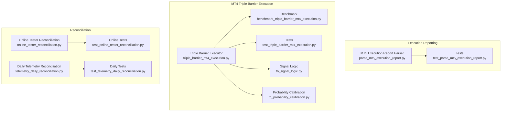
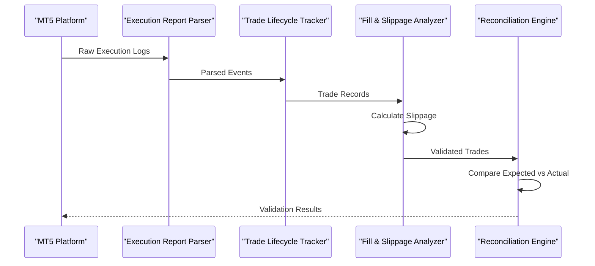
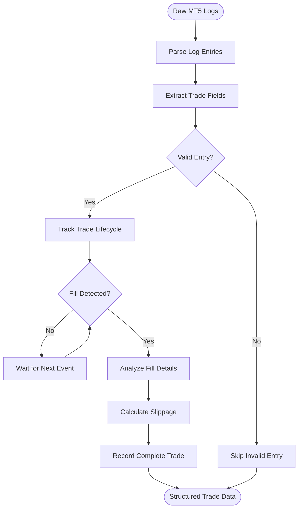
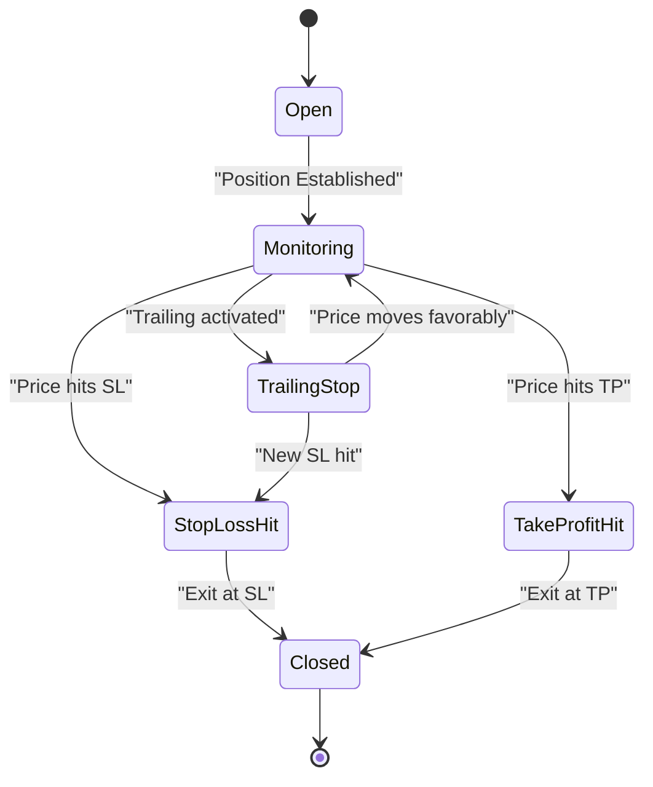
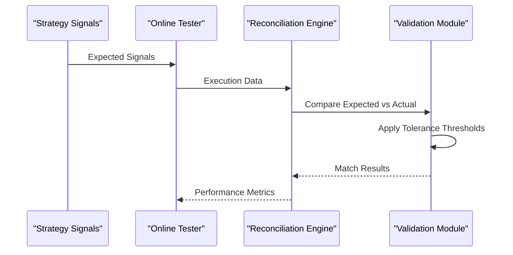
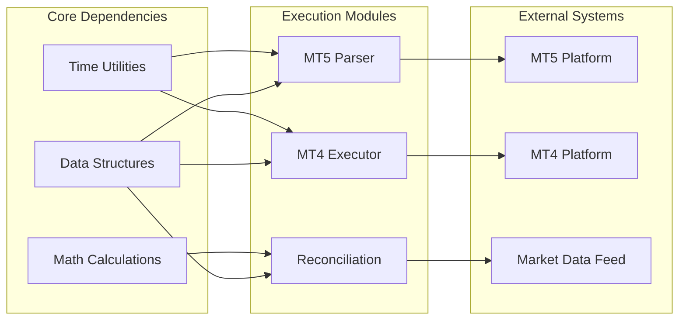

# Execution & Reconciliation

<cite>
**Referenced Files in This Document**
- [parse_mt5_execution_report.py](file://ML/baseline/parse_mt5_execution_report.py)
- [test_parse_mt5_execution_report.py](file://tests/test_parse_mt5_execution_report.py)
- [triple_barrier_mt4_execution.py](file://ML/triple_barrier_mt4_execution.py)
- [benchmark_triple_barrier_mt4_execution.py](file://ML/benchmark_triple_barrier_mt4_execution.py)
- [test_triple_barrier_mt4_execution.py](file://tests/test_triple_barrier_mt4_execution.py)
- [online_tester_reconciliation.py](file://ML/online_tester_reconciliation.py)
- [telemetry_daily_reconciliation.py](file://ML/telemetry_daily_reconciliation.py)
- [test_online_tester_reconciliation.py](file://tests/test_online_tester_reconciliation.py)
- [test_telemetry_daily_reconciliation.py](file://tests/test_telemetry_daily_reconciliation.py)
- [tb_signal_logic.py](file://ML/tb_signal_logic.py)
- [tb_probability_calibration.py](file://ML/tb_probability_calibration.py)
</cite>

## Table of Contents
1. [Introduction](#introduction)
2. [Project Structure](#project-structure)
3. [Core Components](#core-components)
4. [Architecture Overview](#architecture-overview)
5. [Detailed Component Analysis](#detailed-component-analysis)
6. [Dependency Analysis](#dependency-analysis)
7. [Performance Considerations](#performance-considerations)
8. [Troubleshooting Guide](#troubleshooting-guide)
9. [Conclusion](#conclusion)
10. [Appendices](#appendices)

## Introduction
This document explains the execution reporting and reconciliation processes in SoSimple, focusing on:
- MT5 execution report parsing for trade lifecycle tracking, fill analysis, and slippage measurement
- Triple barrier execution logic for MT4 including stop-loss, take-profit, and trailing stop mechanisms
- Reconciliation algorithms that compare expected vs actual executions for performance validation
- Data structures for trade records, position states, and execution timestamps
- Troubleshooting guidance for discrepancies, latency issues, and platform-specific behaviors
- Audit trail requirements and compliance considerations for live trading environments

## Project Structure
The execution and reconciliation features are implemented across ML baseline utilities, dedicated execution modules, and tests:
- MT5 execution report parsing resides under ML/baseline with supporting tests
- MT4 triple barrier execution is implemented as a standalone module with benchmarking and tests
- Reconciliation logic spans online tester reconciliation and daily telemetry reconciliation modules
- Supporting signal logic and probability calibration provide context for triple barrier behavior

**Diagram sources**
- [parse_mt5_execution_report.py](file://ML/baseline/parse_mt5_execution_report.py)
- [test_parse_mt5_execution_report.py](file://tests/test_parse_mt5_execution_report.py)
- [triple_barrier_mt4_execution.py](file://ML/triple_barrier_mt4_execution.py)
- [benchmark_triple_barrier_mt4_execution.py](file://ML/benchmark_triple_barrier_mt4_execution.py)
- [test_triple_barrier_mt4_execution.py](file://tests/test_triple_barrier_mt4_execution.py)
- [tb_signal_logic.py](file://ML/tb_signal_logic.py)
- [tb_probability_calibration.py](file://ML/tb_probability_calibration.py)
- [online_tester_reconciliation.py](file://ML/online_tester_reconciliation.py)
- [telemetry_daily_reconciliation.py](file://ML/telemetry_daily_reconciliation.py)
- [test_online_tester_reconciliation.py](file://tests/test_online_tester_reconciliation.py)
- [test_telemetry_daily_reconciliation.py](file://tests/test_telemetry_daily_reconciliation.py)

**Section sources**
- [parse_mt5_execution_report.py](file://ML/baseline/parse_mt5_execution_report.py)
- [triple_barrier_mt4_execution.py](file://ML/triple_barrier_mt4_execution.py)
- [online_tester_reconciliation.py](file://ML/online_tester_reconciliation.py)
- [telemetry_daily_reconciliation.py](file://ML/telemetry_daily_reconciliation.py)

## Core Components
- MT5 Execution Report Parser: Parses raw MT5 execution logs to reconstruct trade lifecycles, identify fills, and compute slippage metrics
- MT4 Triple Barrier Executor: Implements stop-loss, take-profit, and trailing stop logic with configurable parameters
- Online Tester Reconciliation: Compares expected signals against actual executions in real-time testing scenarios
- Daily Telemetry Reconciliation: Aggregates and validates daily execution data against planned strategies

Key responsibilities:
- Trade lifecycle state management (open, partial fills, full fill, exit triggers)
- Fill analysis with price, volume, and timestamp tracking
- Slippage calculation relative to expected entry/exit prices
- Expected vs actual execution comparison with tolerance thresholds
- Audit trail generation for compliance and debugging

**Section sources**
- [parse_mt5_execution_report.py](file://ML/baseline/parse_mt5_execution_report.py)
- [triple_barrier_mt4_execution.py](file://ML/triple_barrier_mt4_execution.py)
- [online_tester_reconciliation.py](file://ML/online_tester_reconciliation.py)
- [telemetry_daily_reconciliation.py](file://ML/telemetry_daily_reconciliation.py)

## Architecture Overview
The execution and reconciliation system follows a modular architecture with clear separation between parsing, execution logic, and validation:

**Diagram sources**
- [parse_mt5_execution_report.py](file://ML/baseline/parse_mt5_execution_report.py)
- [online_tester_reconciliation.py](file://ML/online_tester_reconciliation.py)

## Detailed Component Analysis

### MT5 Execution Report Parser
The parser transforms raw MT5 execution logs into structured trade records with comprehensive lifecycle tracking.

#### Data Flow and Processing

**Diagram sources**
- [parse_mt5_execution_report.py](file://ML/baseline/parse_mt5_execution_report.py)

#### Key Features
- **Trade Lifecycle Tracking**: Monitors order states from submission through execution to closure
- **Fill Analysis**: Identifies partial and full fills with precise price and volume data
- **Slippage Measurement**: Calculates difference between expected and actual execution prices
- **Timestamp Precision**: Maintains millisecond-level timing for latency analysis

**Section sources**
- [parse_mt5_execution_report.py](file://ML/baseline/parse_mt5_execution_report.py)
- [test_parse_mt5_execution_report.py](file://tests/test_parse_mt5_execution_report.py)

### MT4 Triple Barrier Execution
Implements sophisticated exit mechanisms using stop-loss, take-profit, and trailing stop barriers.

#### Triple Barrier Logic Flow

**Diagram sources**
- [triple_barrier_mt4_execution.py](file://ML/triple_barrier_mt4_execution.py)
- [tb_signal_logic.py](file://ML/tb_signal_logic.py)

#### Configuration Parameters
- **Stop-Loss Distance**: Fixed or dynamic based on volatility
- **Take-Profit Target**: Risk-reward ratio based or fixed points
- **Trailing Stop Settings**: Activation threshold and step size
- **Barrier Monitoring Frequency**: Tick-based or bar-based evaluation

**Section sources**
- [triple_barrier_mt4_execution.py](file://ML/triple_barrier_mt4_execution.py)
- [benchmark_triple_barrier_mt4_execution.py](file://ML/benchmark_triple_barrier_mt4_execution.py)
- [test_triple_barrier_mt4_execution.py](file://tests/test_triple_barrier_mt4_execution.py)
- [tb_signal_logic.py](file://ML/tb_signal_logic.py)
- [tb_probability_calibration.py](file://ML/tb_probability_calibration.py)

### Reconciliation Algorithms
Compares expected strategy signals against actual market executions to validate performance.

#### Online Tester Reconciliation Process

**Diagram sources**
- [online_tester_reconciliation.py](file://ML/online_tester_reconciliation.py)

#### Daily Telemetry Reconciliation
Aggregates execution data over daily periods for trend analysis and anomaly detection.

**Section sources**
- [online_tester_reconciliation.py](file://ML/online_tester_reconciliation.py)
- [telemetry_daily_reconciliation.py](file://ML/telemetry_daily_reconciliation.py)
- [test_online_tester_reconciliation.py](file://tests/test_online_tester_reconciliation.py)
- [test_telemetry_daily_reconciliation.py](file://tests/test_telemetry_daily_reconciliation.py)

## Dependency Analysis
The execution and reconciliation components have well-defined dependencies:

**Diagram sources**
- [parse_mt5_execution_report.py](file://ML/baseline/parse_mt5_execution_report.py)
- [triple_barrier_mt4_execution.py](file://ML/triple_barrier_mt4_execution.py)
- [online_tester_reconciliation.py](file://ML/online_tester_reconciliation.py)

**Section sources**
- [parse_mt5_execution_report.py](file://ML/baseline/parse_mt5_execution_report.py)
- [triple_barrier_mt4_execution.py](file://ML/triple_barrier_mt4_execution.py)
- [online_tester_reconciliation.py](file://ML/online_tester_reconciliation.py)

## Performance Considerations
- **Parsing Efficiency**: Batch processing of MT5 logs to minimize memory usage
- **Real-time Processing**: Optimized event handling for MT4 triple barrier monitoring
- **Memory Management**: Efficient trade record storage with garbage collection
- **Network Latency**: Minimized API calls during high-frequency execution
- **Scalability**: Horizontal scaling support for multiple instrument monitoring

## Troubleshooting Guide

### Common Execution Discrepancies
- **Missing Fills**: Verify log parsing completeness and network connectivity
- **Incorrect Slippage**: Check price feed accuracy and timestamp synchronization
- **Late Exits**: Investigate trailing stop activation delays and monitoring frequency
- **Partial Fills**: Confirm order routing and liquidity conditions

### Latency Issues
- **Network Delays**: Monitor API response times and implement retry logic
- **Processing Bottlenecks**: Profile parsing and reconciliation algorithms
- **Platform Limits**: Respect MT4/MT5 rate limits and connection constraints

### Platform-Specific Behaviors
- **MT5 Order Types**: Handle different order types and execution models
- **MT4 Position Management**: Account for single-position per symbol limitations
- **Time Zone Handling**: Ensure consistent timestamp formatting across platforms

**Section sources**
- [parse_mt5_execution_report.py](file://ML/baseline/parse_mt5_execution_report.py)
- [triple_barrier_mt4_execution.py](file://ML/triple_barrier_mt4_execution.py)
- [online_tester_reconciliation.py](file://ML/online_tester_reconciliation.py)

## Conclusion
The SoSimple execution and reconciliation system provides robust infrastructure for trade lifecycle management, fill analysis, and performance validation. The modular design enables easy maintenance and extension while maintaining strict audit trails for compliance requirements.

## Appendices

### Data Structures Reference
- **Trade Record**: Contains entry/exit prices, timestamps, volumes, and slippage metrics
- **Position State**: Tracks current position status, unrealized P&L, and barrier levels
- **Execution Timestamp**: Millisecond precision with timezone normalization
- **Audit Trail**: Immutable log of all execution events with verification hashes

### Compliance Requirements
- **Audit Logging**: Complete execution history with tamper-evident storage
- **Regulatory Reporting**: Automated generation of required regulatory documents
- **Risk Controls**: Real-time position limits and exposure monitoring
- **Data Retention**: Configurable retention policies for different data types