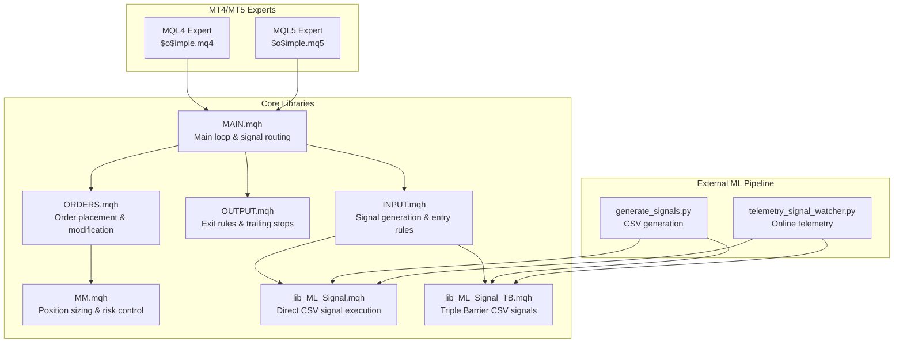
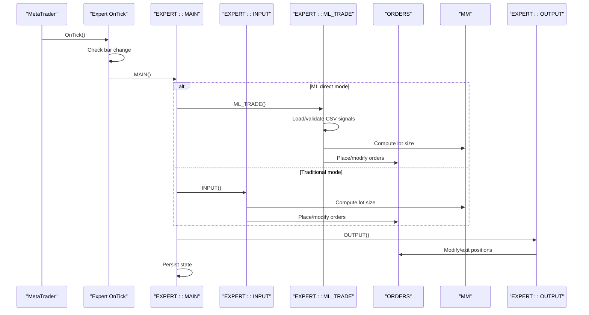
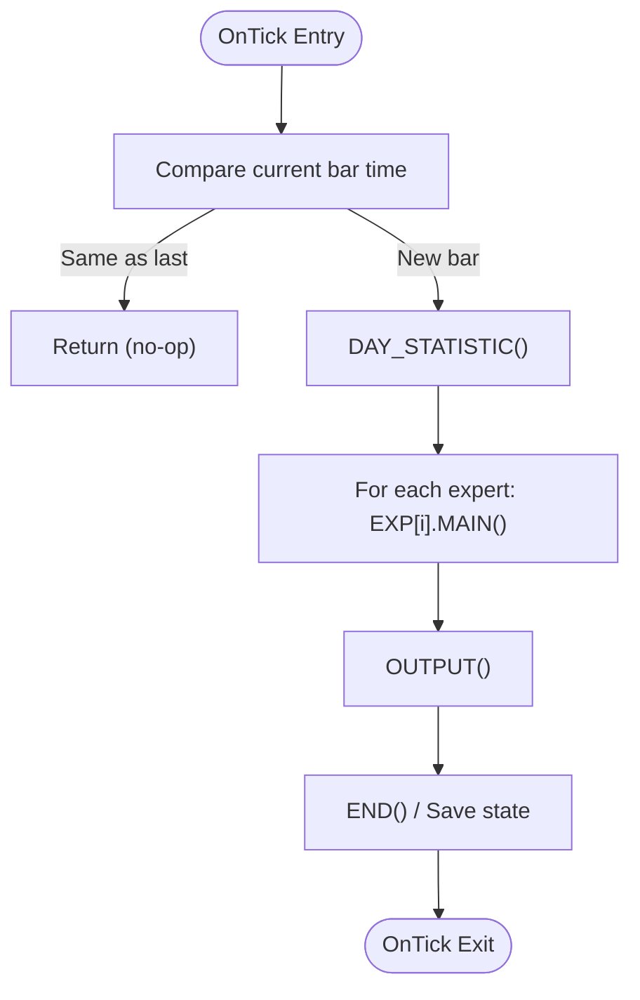
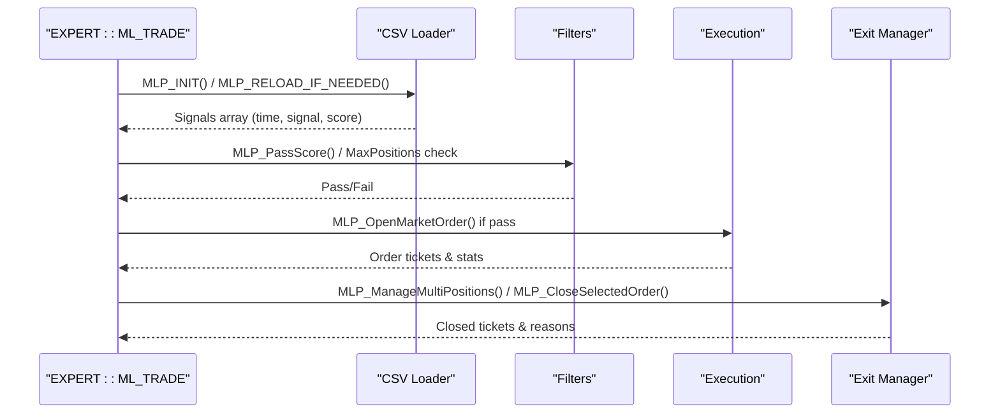
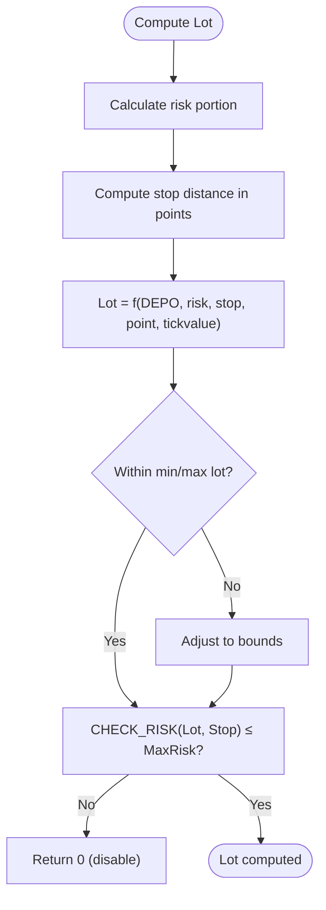
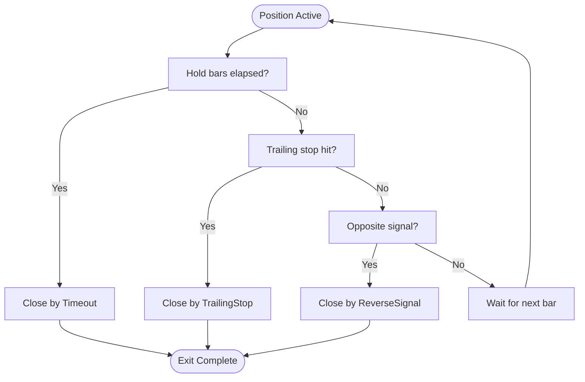
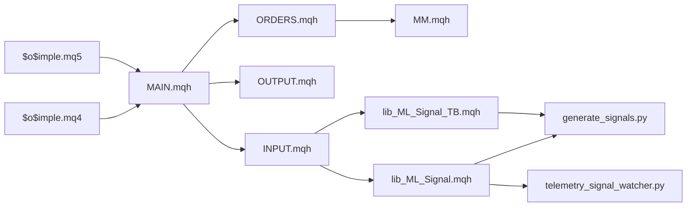

# Core Trading Logic

<cite>
**Referenced Files in This Document**
- [$o$imple.mq4](file://MT/MQL4/Experts/$o$imple.mq4)
- [$o$imple.mq5](file://MT/MQL5/Experts/$o$imple.mq5)
- [MAIN.mqh](file://MT/MQL4/Include/MAIN.mqh)
- [INPUT.mqh](file://MT/MQL4/Include/INPUT.mqh)
- [OUTPUT.mqh](file://MT/MQL4/Include/OUTPUT.mqh)
- [ORDERS.mqh](file://MT/MQL4/Include/ORDERS.mqh)
- [MM.mqh](file://MT/MQL4/Include/MM.mqh)
- [lib_ML_Signal.mqh](file://MT/MQL4/Include/lib_ML_Signal.mqh)
- [lib_ML_Signal_TB.mqh](file://MT/MQL4/Include/lib_ML_Signal_TB.mqh)
- [generate_signals.py](file://API/generate_signals.py)
- [telemetry_signal_watcher.py](file://API/telemetry_signal_watcher.py)
</cite>

## Table of Contents
1. [Introduction](#introduction)
2. [Project Structure](#project-structure)
3. [Core Components](#core-components)
4. [Architecture Overview](#architecture-overview)
5. [Detailed Component Analysis](#detailed-component-analysis)
6. [Dependency Analysis](#dependency-analysis)
7. [Performance Considerations](#performance-considerations)
8. [Troubleshooting Guide](#troubleshooting-guide)
9. [Conclusion](#conclusion)

## Introduction
This document explains the core trading logic of the SoSimple expert advisor, focusing on the main trading algorithm, CSV-based signal processing, position sizing, and exit strategies. It details the OnTick() execution flow, market data processing, and decision-making logic. It also covers the integration with external ML services via CSV parsing, signal validation, and trade execution, with practical examples, filtering mechanisms, and optimization techniques.

## Project Structure
The SoSimple expert advisor consists of:
- Expert advisors for MQL4 and MQL5 that orchestrate trading logic
- Core include libraries implementing signal processing, order management, and risk controls
- API modules that generate ML signals and watch telemetry streams for real-time updates



**Diagram sources**
- [$o$imple.mq4:123-132](file://MT/MQL4/Experts/$o$imple.mq4#L123-L132)
- [$o$imple.mq5:137-147](file://MT/MQL5/Experts/$o$imple.mq5#L137-L147)
- [MAIN.mqh:117-143](file://MT/MQL4/Include/MAIN.mqh#L117-L143)
- [INPUT.mqh:3-26](file://MT/MQL4/Include/INPUT.mqh#L3-L26)
- [OUTPUT.mqh:6-62](file://MT/MQL4/Include/OUTPUT.mqh#L6-L62)
- [ORDERS.mqh:5-61](file://MT/MQL4/Include/ORDERS.mqh#L5-L61)
- [MM.mqh:1-30](file://MT/MQL4/Include/MM.mqh#L1-L30)
- [lib_ML_Signal.mqh:457-551](file://MT/MQL4/Include/lib_ML_Signal.mqh#L457-L551)
- [lib_ML_Signal_TB.mqh:46-99](file://MT/MQL4/Include/lib_ML_Signal_TB.mqh#L46-L99)
- [generate_signals.py:652-668](file://API/generate_signals.py#L652-L668)
- [telemetry_signal_watcher.py:203-257](file://API/telemetry_signal_watcher.py#L203-L257)

**Section sources**
- [$o$imple.mq4:123-132](file://MT/MQL4/Experts/$o$imple.mq4#L123-L132)
- [$o$imple.mq5:137-147](file://MT/MQL5/Experts/$o$imple.mq5#L137-L147)

## Core Components
- OnTick orchestration: Initializes per-bar processing, updates day statistics, executes expert logic, and persists state
- Signal routing: Chooses between traditional input logic and direct ML signal execution based on configuration
- CSV signal processing: Loads and validates ML signals from CSV, applies filters, and executes trades
- Position sizing: Computes lot sizes using account risk and instrument constraints
- Exit strategies: Implements trailing stops, time-based exits, and reversal-based exits

Key implementation references:
- OnTick flow and expert invocation: [OnTick:123-132](file://MT/MQL4/Experts/$o$imple.mq4#L123-L132), [OnTick:137-147](file://MT/MQL5/Experts/$o$imple.mq5#L137-L147)
- Main loop and signal routing: [MAIN:117-143](file://MT/MQL4/Include/MAIN.mqh#L117-L143)
- CSV loading and execution: [MLP_INIT:457-551](file://MT/MQL4/Include/lib_ML_Signal.mqh#L457-L551), [MLP_RELOAD_IF_CHANGED:553-601](file://MT/MQL4/Include/lib_ML_Signal.mqh#L553-L601)
- Order placement and risk control: [SET_BUY/SET_SEL:14-61](file://MT/MQL4/Include/ORDERS.mqh#L14-L61), [MM:1-30](file://MT/MQL4/Include/MM.mqh#L1-L30)

**Section sources**
- [MAIN.mqh:117-143](file://MT/MQL4/Include/MAIN.mqh#L117-L143)
- [lib_ML_Signal.mqh:457-551](file://MT/MQL4/Include/lib_ML_Signal.mqh#L457-L551)
- [ORDERS.mqh:14-61](file://MT/MQL4/Include/ORDERS.mqh#L14-L61)
- [MM.mqh:1-30](file://MT/MQL4/Include/MM.mqh#L1-L30)

## Architecture Overview
The trading engine follows a deterministic per-bar flow:
1. OnTick detects new bar arrival and initializes per-bar state
2. Expert selects either traditional input logic or direct ML signal execution
3. CSV signals are loaded and validated; filters are applied
4. Entry decisions are computed and orders placed or modified
5. Exit logic runs on existing positions (time-based, trailing, reversal)
6. State is persisted and statistics updated



**Diagram sources**
- [$o$imple.mq4:123-132](file://MT/MQL4/Experts/$o$imple.mq4#L123-L132)
- [MAIN.mqh:117-143](file://MT/MQL4/Include/MAIN.mqh#L117-L143)
- [INPUT.mqh:3-26](file://MT/MQL4/Include/INPUT.mqh#L3-L26)
- [lib_ML_Signal.mqh:603-667](file://MT/MQL4/Include/lib_ML_Signal.mqh#L603-L667)
- [ORDERS.mqh:14-61](file://MT/MQL4/Include/ORDERS.mqh#L14-L61)
- [MM.mqh:1-30](file://MT/MQL4/Include/MM.mqh#L1-L30)
- [OUTPUT.mqh:6-62](file://MT/MQL4/Include/OUTPUT.mqh#L6-L62)

## Detailed Component Analysis

### OnTick Execution Flow and Decision Logic
- Bar detection: Compares current bar time to previous to avoid duplicate processing
- Per-bar initialization: Updates day statistics and prepares state
- Expert selection: Executes either ML direct mode or traditional input logic
- Output and trailing: Applies exit rules and trailing stops
- Persistence: Saves state and prints daily summaries



**Diagram sources**
- [$o$imple.mq4:123-132](file://MT/MQL4/Experts/$o$imple.mq4#L123-L132)
- [$o$imple.mq5:137-147](file://MT/MQL5/Experts/$o$imple.mq5#L137-L147)
- [MAIN.mqh:117-143](file://MT/MQL4/Include/MAIN.mqh#L117-L143)
- [OUTPUT.mqh:6-62](file://MT/MQL4/Include/OUTPUT.mqh#L6-L62)

**Section sources**
- [$o$imple.mq4:123-132](file://MT/MQL4/Experts/$o$imple.mq4#L123-L132)
- [$o$imple.mq5:137-147](file://MT/MQL5/Experts/$o$imple.mq5#L137-L147)
- [MAIN.mqh:117-143](file://MT/MQL4/Include/MAIN.mqh#L117-L143)

### CSV-Based Signal Processing and Trade Execution
- CSV format: Supports two modes:
  - Direct execution mode: time;signal;pred_ret_24_dir_atr;...
  - Triple Barrier mode: time;signal;sl_atr;tp_atr;prob;ev
- Loading and validation:
  - Header validation ensures expected columns
  - Binary search locates signals by bar time
  - Optional score filter uses pred_ret_24_dir_atr threshold
- Execution logic:
  - Direct mode: opens positions with adaptive SL/TP derived from ATR and model scores
  - Multi-position mode: manages multiple concurrent positions with configurable limits
  - Exit strategies: time-based holds, trailing stops, and reversal-based exits



**Diagram sources**
- [lib_ML_Signal.mqh:457-551](file://MT/MQL4/Include/lib_ML_Signal.mqh#L457-L551)
- [lib_ML_Signal.mqh:603-667](file://MT/MQL4/Include/lib_ML_Signal.mqh#L603-L667)
- [lib_ML_Signal.mqh:269-304](file://MT/MQL4/Include/lib_ML_Signal.mqh#L269-L304)
- [lib_ML_Signal.mqh:306-387](file://MT/MQL4/Include/lib_ML_Signal.mqh#L306-L387)

**Section sources**
- [lib_ML_Signal.mqh:457-551](file://MT/MQL4/Include/lib_ML_Signal.mqh#L457-L551)
- [lib_ML_Signal.mqh:603-667](file://MT/MQL4/Include/lib_ML_Signal.mqh#L603-L667)
- [lib_ML_Signal.mqh:269-304](file://MT/MQL4/Include/lib_ML_Signal.mqh#L269-L304)
- [lib_ML_Signal.mqh:306-387](file://MT/MQL4/Include/lib_ML_Signal.mqh#L306-L387)

### Position Sizing and Risk Control
- Lot calculation: Uses account risk percentage, stop distance, and instrument tick value
- Risk checks: Ensures computed lot does not exceed maximum risk or margin thresholds
- Dynamic adjustments: Adapts to realized drawdown and individual expert risk profiles



**Diagram sources**
- [MM.mqh:1-30](file://MT/MQL4/Include/MM.mqh#L1-L30)
- [MM.mqh:33-37](file://MT/MQL4/Include/MM.mqh#L33-L37)

**Section sources**
- [MM.mqh:1-30](file://MT/MQL4/Include/MM.mqh#L1-L30)
- [MM.mqh:33-37](file://MT/MQL4/Include/MM.mqh#L33-L37)

### Exit Strategies and Order Management
- Time-based exits: Positions closed after configured hold bars
- Trailing stops: Adaptive stops trail price movement in ATR multiples
- Reversal exits: Close existing positions upon opposite signals
- Order modification: Adjusts stops/profits or cancels pending orders as needed



**Diagram sources**
- [lib_ML_Signal.mqh:269-304](file://MT/MQL4/Include/lib_ML_Signal.mqh#L269-L304)
- [lib_ML_Signal.mqh:669-753](file://MT/MQL4/Include/lib_ML_Signal.mqh#L669-L753)
- [lib_ML_Signal.mqh:755-804](file://MT/MQL4/Include/lib_ML_Signal.mqh#L755-L804)
- [OUTPUT.mqh:6-62](file://MT/MQL4/Include/OUTPUT.mqh#L6-L62)

**Section sources**
- [lib_ML_Signal.mqh:269-304](file://MT/MQL4/Include/lib_ML_Signal.mqh#L269-L304)
- [lib_ML_Signal.mqh:669-753](file://MT/MQL4/Include/lib_ML_Signal.mqh#L669-L753)
- [lib_ML_Signal.mqh:755-804](file://MT/MQL4/Include/lib_ML_Signal.mqh#L755-L804)
- [OUTPUT.mqh:6-62](file://MT/MQL4/Include/OUTPUT.mqh#L6-L62)

### Integration with External ML Services
- CSV generation: Python scripts produce ml_signals.csv and ml_signals_tb.csv from trained models
- Telemetry watcher: Watches live input, preprocesses, infers, and writes updated CSV for real-time trading
- Signal interpretation:
  - Direct mode: Uses signal + optional score filter; opens positions with ATR-based SL/TP
  - Triple Barrier mode: Uses fixed SL/TP in ATR units with probability and expected value

```mermaid
sequenceDiagram
participant ML as "ML Model"
participant GEN as "generate_signals.py"
participant WATCH as "telemetry_signal_watcher.py"
participant CSV as "ml_signals.csv"
participant EXP as "EXPERT : : ML_TRADE"
ML-->>GEN : Predictions (train/validation/test)
GEN->>CSV : Write CSV (time;signal;up_3;dn_3;...)
WATCH->>CSV : Copy/overwrite for live trading
EXP->>CSV : Load/parse signals
EXP->>EXP : Apply filters & compute exits
```

**Diagram sources**
- [generate_signals.py:652-668](file://API/generate_signals.py#L652-L668)
- [generate_signals.py:201-335](file://API/generate_signals.py#L201-L335)
- [telemetry_signal_watcher.py:203-257](file://API/telemetry_signal_watcher.py#L203-L257)
- [lib_ML_Signal.mqh:457-551](file://MT/MQL4/Include/lib_ML_Signal.mqh#L457-L551)

**Section sources**
- [generate_signals.py:652-668](file://API/generate_signals.py#L652-L668)
- [generate_signals.py:201-335](file://API/generate_signals.py#L201-L335)
- [telemetry_signal_watcher.py:203-257](file://API/telemetry_signal_watcher.py#L203-L257)
- [lib_ML_Signal.mqh:457-551](file://MT/MQL4/Include/lib_ML_Signal.mqh#L457-L551)

## Dependency Analysis
The trading logic exhibits clear separation of concerns:
- Expert orchestrators depend on core libraries for signal routing, order management, and risk control
- Signal libraries depend on CSV parsing and configuration parameters
- External ML pipeline depends on trained models and preprocessing utilities



**Diagram sources**
- [$o$imple.mq4:123-132](file://MT/MQL4/Experts/$o$imple.mq4#L123-L132)
- [$o$imple.mq5:137-147](file://MT/MQL5/Experts/$o$imple.mq5#L137-L147)
- [MAIN.mqh:117-143](file://MT/MQL4/Include/MAIN.mqh#L117-L143)
- [INPUT.mqh:3-26](file://MT/MQL4/Include/INPUT.mqh#L3-L26)
- [OUTPUT.mqh:6-62](file://MT/MQL4/Include/OUTPUT.mqh#L6-L62)
- [ORDERS.mqh:5-61](file://MT/MQL4/Include/ORDERS.mqh#L5-L61)
- [MM.mqh:1-30](file://MT/MQL4/Include/MM.mqh#L1-L30)
- [lib_ML_Signal.mqh:457-551](file://MT/MQL4/Include/lib_ML_Signal.mqh#L457-L551)
- [lib_ML_Signal_TB.mqh:46-99](file://MT/MQL4/Include/lib_ML_Signal_TB.mqh#L46-L99)
- [generate_signals.py:652-668](file://API/generate_signals.py#L652-L668)
- [telemetry_signal_watcher.py:203-257](file://API/telemetry_signal_watcher.py#L203-L257)

**Section sources**
- [MAIN.mqh:117-143](file://MT/MQL4/Include/MAIN.mqh#L117-L143)
- [INPUT.mqh:3-26](file://MT/MQL4/Include/INPUT.mqh#L3-L26)
- [OUTPUT.mqh:6-62](file://MT/MQL4/Include/OUTPUT.mqh#L6-L62)
- [ORDERS.mqh:5-61](file://MT/MQL4/Include/ORDERS.mqh#L5-L61)
- [MM.mqh:1-30](file://MT/MQL4/Include/MM.mqh#L1-L30)
- [lib_ML_Signal.mqh:457-551](file://MT/MQL4/Include/lib_ML_Signal.mqh#L457-L551)
- [lib_ML_Signal_TB.mqh:46-99](file://MT/MQL4/Include/lib_ML_Signal_TB.mqh#L46-L99)
- [generate_signals.py:652-668](file://API/generate_signals.py#L652-L668)
- [telemetry_signal_watcher.py:203-257](file://API/telemetry_signal_watcher.py#L203-L257)

## Performance Considerations
- CSV I/O: Use binary search for O(log n) signal lookup; reload only when file modification time changes
- Risk checks: Precompute risk and lot to minimize repeated calculations
- Order operations: Batch modifications and avoid unnecessary OrderModify calls
- Memory: Resize arrays to actual size after CSV load to reduce overhead
- Real-time updates: Use watcher to atomically update CSV and reload signals

[No sources needed since this section provides general guidance]

## Troubleshooting Guide
Common issues and resolutions:
- CSV not loading: Verify file exists, header matches expected format, and timestamps are sorted
- No signals for current bar: Confirm CSV contains entries at or before current bar time; use watcher for live updates
- Risk too high: Reduce ML_BackStopATR or ML_MaxPositions; verify MaxRisk and account balance
- Orders not placed: Check StopLevel proximity, spread, and minimum lot constraints; review ERROR_CHECK logs
- Excessive rejections: Ensure filters (score, trend, ratio) are configured appropriately; adjust ML_MinRatio and ML_MaxRatio

**Section sources**
- [lib_ML_Signal.mqh:457-551](file://MT/MQL4/Include/lib_ML_Signal.mqh#L457-L551)
- [lib_ML_Signal.mqh:553-601](file://MT/MQL4/Include/lib_ML_Signal.mqh#L553-L601)
- [MM.mqh:33-37](file://MT/MQL4/Include/MM.mqh#L33-L37)
- [ORDERS.mqh:14-61](file://MT/MQL4/Include/ORDERS.mqh#L14-L61)

## Conclusion
SoSimple’s core trading logic combines robust CSV-driven ML signal execution with traditional order management and risk controls. The modular design enables flexible signal sources, strong position sizing discipline, and comprehensive exit strategies. By leveraging the telemetry pipeline and careful configuration of filters and risk parameters, traders can achieve reliable, optimized performance across diverse market conditions.