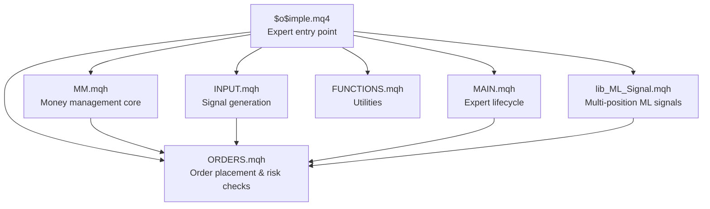
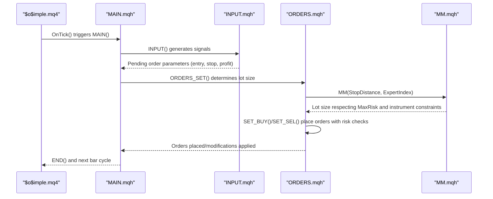
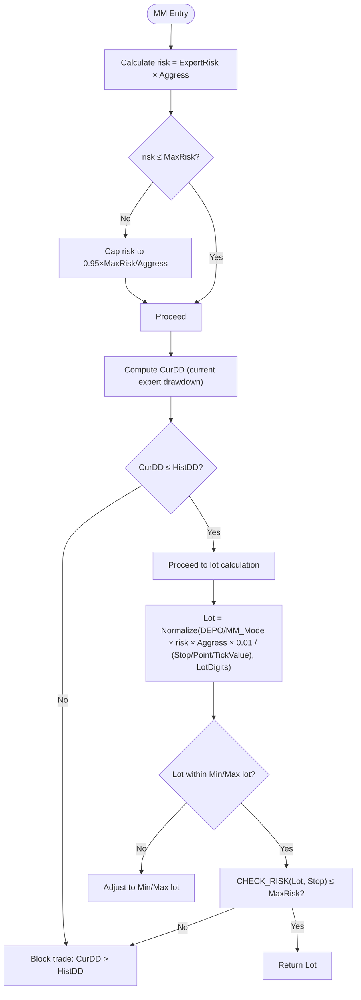
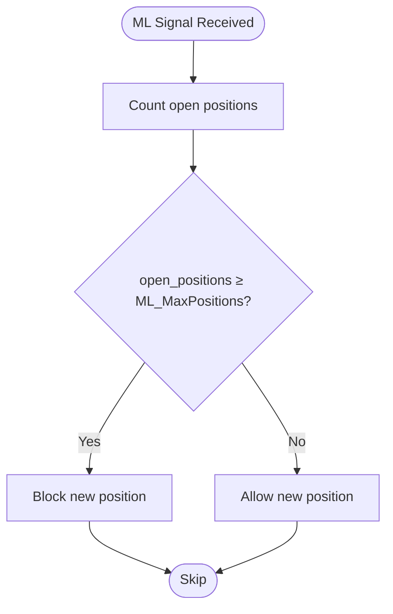
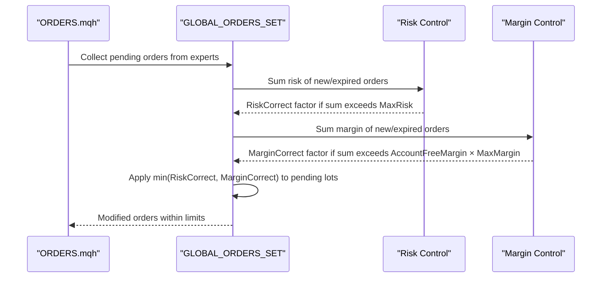
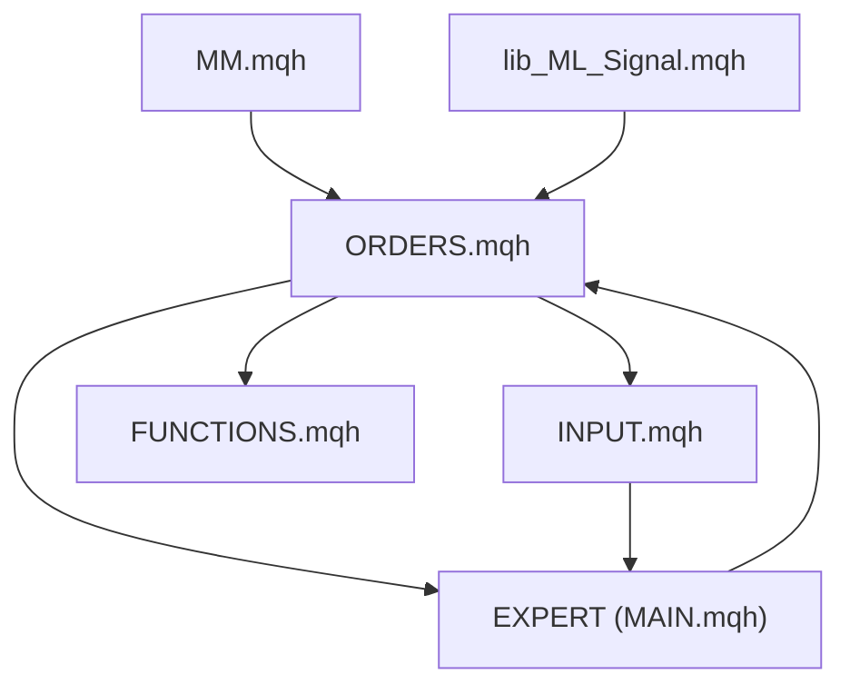

# Position Sizing and Risk Management

<cite>
**Referenced Files in This Document**
- [$o$imple.mq4](file://MT/MQL4/Experts/$o$imple.mq4)
- [MM.mqh](file://MT/MQL4/Include/MM.mqh)
- [ORDERS.mqh](file://MT/MQL4/Include/ORDERS.mqh)
- [INPUT.mqh](file://MT/MQL4/Include/INPUT.mqh)
- [MAIN.mqh](file://MT/MQL4/Include/MAIN.mqh)
- [FUNCTIONS.mqh](file://MT/MQL4/Include/FUNCTIONS.mqh)
- [lib_ML_Signal.mqh](file://MT/MQL4/Include/lib_ML_Signal.mqh)
</cite>

## Table of Contents
1. [Introduction](#introduction)
2. [Project Structure](#project-structure)
3. [Core Components](#core-components)
4. [Architecture Overview](#architecture-overview)
5. [Detailed Component Analysis](#detailed-component-analysis)
6. [Dependency Analysis](#dependency-analysis)
7. [Performance Considerations](#performance-considerations)
8. [Troubleshooting Guide](#troubleshooting-guide)
9. [Conclusion](#conclusion)

## Introduction
This document provides comprehensive coverage of the position sizing and risk management implementation in the SoSimple expert advisor. It explains the money management strategies, parameter configuration, risk controls, and dynamic position adjustments. The focus areas include:
- Money management modes (fixed lot, fixed margin, and optimized risk-based sizing)
- MAX_RISK parameter and risk percentage calculations
- Maximum position limits via ML_MaxPositions
- Risk controls: MaxSpred monitoring, drawdown calculations (CurDD, MaxEquity), and margin utilization tracking
- Practical examples and tuning guidelines
- Best practices and troubleshooting

## Project Structure
The position sizing and risk management logic is distributed across several key files:
- Expert entry point and global parameters: [$o$imple.mq4](file://MT/MQL4/Experts/$o$imple.mq4)
- Money management core: [MM.mqh](file://MT/MQL4/Include/MM.mqh)
- Order placement and risk enforcement: [ORDERS.mqh](file://MT/MQL4/Include/ORDERS.mqh)
- Signal generation and order setup: [INPUT.mqh](file://MT/MQL4/Include/INPUT.mqh)
- Expert lifecycle and ML integration: [MAIN.mqh](file://MT/MQL4/Include/MAIN.mqh)
- Utility functions and shared types: [FUNCTIONS.mqh](file://MT/MQL4/Include/FUNCTIONS.mqh)
- Multi-position ML signal execution: [lib_ML_Signal.mqh](file://MT/MQL4/Include/lib_ML_Signal.mqh)

**Diagram sources**
- [$o$imple.mq4:120-132](file://MT/MQL4/Experts/$o$imple.mq4#L120-L132)
- [MM.mqh:1-82](file://MT/MQL4/Include/MM.mqh#L1-L82)
- [ORDERS.mqh:5-13](file://MT/MQL4/Include/ORDERS.mqh#L5-L13)
- [INPUT.mqh:3-54](file://MT/MQL4/Include/INPUT.mqh#L3-L54)
- [MAIN.mqh:117-143](file://MT/MQL4/Include/MAIN.mqh#L117-L143)
- [FUNCTIONS.mqh:114-202](file://MT/MQL4/Include/FUNCTIONS.mqh#L114-L202)
- [lib_ML_Signal.mqh:1-200](file://MT/MQL4/Include/lib_ML_Signal.mqh#L1-L200)

**Section sources**
- [$o$imple.mq4:1-149](file://MT/MQL4/Experts/$o$imple.mq4#L1-L149)
- [MM.mqh:1-82](file://MT/MQL4/Include/MM.mqh#L1-L82)
- [ORDERS.mqh:1-401](file://MT/MQL4/Include/ORDERS.mqh#L1-L401)
- [INPUT.mqh:1-251](file://MT/MQL4/Include/INPUT.mqh#L1-L251)
- [MAIN.mqh:1-213](file://MT/MQL4/Include/MAIN.mqh#L1-L213)
- [FUNCTIONS.mqh:114-320](file://MT/MQL4/Include/FUNCTIONS.mqh#L114-L320)
- [lib_ML_Signal.mqh:1-200](file://MT/MQL4/Include/lib_ML_Signal.mqh#L1-L200)

## Core Components
This section outlines the primary components involved in position sizing and risk management:

- Money Management Functions
  - MM: Calculates lot size based on risk, account metrics, and instrument specifics
  - CHECK_RISK: Computes realized risk percentage for a given lot and stop distance
  - CUR_DD: Measures current expert drawdown since last reset
  - DEPO: Selects the portion of account balance used for risk calculation (money management mode)

- Order Placement and Risk Enforcement
  - ORDERS_SET: Determines lot size and places orders, enforcing risk caps
  - SET_BUY/SET_SEL: Executes buy/sell order placement with risk validation
  - MODIFY: Adjusts existing orders and cancels pending orders when conditions change
  - GLOBAL_ORDERS_SET: Centralized risk coordination across multiple experts and pending orders
  - CHECK_OUT: Periodically re-evaluates risk exposure and adjusts pending orders

- Signal Generation and Order Setup
  - INPUT: Generates trade signals and sets pending orders with validated stops/profits
  - OPEN_BUY/OPEN_SELL: Computes entry, stop, and take-profit levels based on ATR and parameters

- Multi-position Support
  - ML_MaxPositions: Allows multiple concurrent positions for ML direct mode
  - lib_ML_Signal.mqh: Manages multi-position logic and position blocking

**Section sources**
- [MM.mqh:1-82](file://MT/MQL4/Include/MM.mqh#L1-L82)
- [ORDERS.mqh:5-13](file://MT/MQL4/Include/ORDERS.mqh#L5-L13)
- [INPUT.mqh:3-54](file://MT/MQL4/Include/INPUT.mqh#L3-L54)
- [lib_ML_Signal.mqh:1-200](file://MT/MQL4/Include/lib_ML_Signal.mqh#L1-L200)

## Architecture Overview
The position sizing and risk management architecture integrates expert lifecycle, signal generation, and centralized order management with risk controls.

**Diagram sources**
- [$o$imple.mq4:123-132](file://MT/MQL4/Experts/$o$imple.mq4#L123-L132)
- [MAIN.mqh:117-143](file://MT/MQL4/Include/MAIN.mqh#L117-L143)
- [INPUT.mqh:3-54](file://MT/MQL4/Include/INPUT.mqh#L3-L54)
- [ORDERS.mqh:5-13](file://MT/MQL4/Include/ORDERS.mqh#L5-L13)
- [MM.mqh:1-30](file://MT/MQL4/Include/MM.mqh#L1-L30)

## Detailed Component Analysis

### Money Management Modes and Risk Calculation
The money management system supports multiple strategies controlled by the MM parameter and internal DEPO selection:

- Fixed Lot Mode
  - Triggered when Risk=0 in testing mode; Lot is set to a fixed minimum lot
  - Used for backtesting stability and parameter isolation

- Risk-Based Sizing (Optimized)
  - Lot calculated using account metrics and instrument tick value
  - Formula considers risk percentage, stop distance, point value, and tick value
  - Normalized to instrument lot step and digits

- Money Management Modes (DEPO)
  - Mode 1: Use total account balance
  - Mode 2: Reduce risk proportional to current drawdown vs historical drawdown
  - Mode 3: Use individual expert peak balance up to current balance
  - Mode 4: Use global maximum balance recorded, capped by current balance

**Diagram sources**
- [MM.mqh:1-30](file://MT/MQL4/Include/MM.mqh#L1-L30)
- [MM.mqh:33-37](file://MT/MQL4/Include/MM.mqh#L33-L37)
- [MM.mqh:40-50](file://MT/MQL4/Include/MM.mqh#L40-L50)
- [MM.mqh:53-79](file://MT/MQL4/Include/MM.mqh#L53-L79)

**Section sources**
- [MM.mqh:1-82](file://MT/MQL4/Include/MM.mqh#L1-L82)
- [ORDERS.mqh:9-10](file://MT/MQL4/Include/ORDERS.mqh#L9-L10)

### Risk Percentage Calculations and MAX_RISK
- MAX_RISK Parameter
  - Defined globally as 10 (percent), representing the maximum allowable risk per trade
  - Aggress factor scales risk when Risk > 0 is configured externally

- Risk Percentage Computation
  - CHECK_RISK computes realized risk as (Lot × (Stop/Point/TickValue) / AccountBalance) × 100
  - Enforced against MaxRisk during order placement and globally coordinated order setting

- Aggression Scaling
  - When Risk > 0, Aggress multiplies the base risk, and MaxRisk becomes MAX_RISK × Aggress
  - Used to increase or decrease risk exposure dynamically

**Section sources**
- [$o$imple.mq4:1-2](file://MT/MQL4/Experts/$o$imple.mq4#L1-L2)
- [MM.mqh:2-7](file://MT/MQL4/Include/MM.mqh#L2-L7)
- [MM.mqh:33-37](file://MT/MQL4/Include/MM.mqh#L33-L37)
- [ORDERS.mqh:24-26](file://MT/MQL4/Include/ORDERS.mqh#L24-L26)

### Maximum Position Limits (ML_MaxPositions)
- ML_MaxPositions enables multiple concurrent positions for ML direct mode
- lib_ML_Signal.mqh enforces position blocking when open positions reach ML_MaxPositions
- Prevents over-concentration and ensures diversification within ML-based strategies

**Diagram sources**
- [lib_ML_Signal.mqh:630-660](file://MT/MQL4/Include/lib_ML_Signal.mqh#L630-L660)

**Section sources**
- [lib_ML_Signal.mqh:1-200](file://MT/MQL4/Include/lib_ML_Signal.mqh#L1-L200)
- [lib_ML_Signal.mqh:630-660](file://MT/MQL4/Include/lib_ML_Signal.mqh#L630-L660)

### Risk Controls: MaxSpred Monitoring, Drawdown, and Margin Utilization
- MaxSpred Monitoring
  - Tracks maximum observed spread during real trading sessions
  - Used for performance reporting and strategy diagnostics

- Drawdown Calculations
  - CurDD: Current expert drawdown computed from recent trade history
  - Used to enforce MM constraints and prevent further risking during drawdown periods

- Margin Utilization Tracking
  - GLOBAL_ORDERS_SET evaluates cumulative risk and margin across all pending/expired orders
  - Applies corrective scaling (RiskCorrect, MarginCorrect) to ensure AccountFreeMargin and MaxRisk limits are respected

**Diagram sources**
- [ORDERS.mqh:184-322](file://MT/MQL4/Include/ORDERS.mqh#L184-L322)

**Section sources**
- [$o$imple.mq4:124-124](file://MT/MQL4/Experts/$o$imple.mq4#L124-L124)
- [MM.mqh:40-50](file://MT/MQL4/Include/MM.mqh#L40-L50)
- [ORDERS.mqh:184-322](file://MT/MQL4/Include/ORDERS.mqh#L184-L322)

### Practical Examples and Tuning Guidelines
- Example: Risk-Based Sizing Calculation
  - Inputs: ExpertRisk=2.0%, Aggress=1.5, StopDistance=20 ATR, Point=0.00001, TickValue=10
  - DEPO/MM_Mode=AccountBalance (Mode 1)
  - Lot = Normalize((AccountBalance × 2.0% × 1.5 × 0.01) / (20 × 0.00001), LotDigits)
  - Validate Lot against Min/Max lot and CHECK_RISK ≤ MaxRisk

- Tuning Risk Parameters
  - MAX_RISK: Start with 1–3% for conservative strategies; increase to 5–10% for higher volatility instruments
  - Aggress: Use 1.0 for baseline; increase to 1.5–2.0 to intensify risk during favorable conditions
  - MM Mode: Choose Mode 2 or 3 for drawdown-sensitive environments; Mode 1 for straightforward risk-on strategies

- Dynamic Position Adjustment
  - Monitor CurDD; if rising, consider reducing Aggress or switching to a lower MM mode
  - Use ML_MaxPositions to manage exposure across multiple ML signals while respecting MaxRisk and MaxMargin

[No sources needed since this subsection provides practical guidance derived from referenced implementations]

### Best Practices and Optimization Tips
- Prefer risk-based sizing over fixed lot to adapt to changing market conditions
- Use drawdown-aware money management modes (Mode 2/3) to reduce risk during adverse periods
- Monitor MaxSpred and adjust spreads accordingly; avoid trading during wide spread regimes
- Limit concurrent positions via ML_MaxPositions to prevent overexposure
- Regularly review CHECK_RISK outputs to ensure actual risk aligns with targets
- Use Aggress judiciously; excessive scaling can lead to breaches of MaxRisk and AccountFreeMargin constraints

[No sources needed since this subsection provides general best practices grounded in the referenced implementations]

## Dependency Analysis
The position sizing and risk management subsystems depend on each other and on external market data:

**Diagram sources**
- [MM.mqh:1-82](file://MT/MQL4/Include/MM.mqh#L1-L82)
- [ORDERS.mqh:5-13](file://MT/MQL4/Include/ORDERS.mqh#L5-L13)
- [INPUT.mqh:3-54](file://MT/MQL4/Include/INPUT.mqh#L3-L54)
- [MAIN.mqh:117-143](file://MT/MQL4/Include/MAIN.mqh#L117-L143)
- [FUNCTIONS.mqh:114-202](file://MT/MQL4/Include/FUNCTIONS.mqh#L114-L202)
- [lib_ML_Signal.mqh:1-200](file://MT/MQL4/Include/lib_ML_Signal.mqh#L1-L200)

**Section sources**
- [MM.mqh:1-82](file://MT/MQL4/Include/MM.mqh#L1-L82)
- [ORDERS.mqh:5-13](file://MT/MQL4/Include/ORDERS.mqh#L5-L13)
- [INPUT.mqh:3-54](file://MT/MQL4/Include/INPUT.mqh#L3-L54)
- [MAIN.mqh:117-143](file://MT/MQL4/Include/MAIN.mqh#L117-L143)
- [FUNCTIONS.mqh:114-202](file://MT/MQL4/Include/FUNCTIONS.mqh#L114-L202)
- [lib_ML_Signal.mqh:1-200](file://MT/MQL4/Include/lib_ML_Signal.mqh#L1-L200)

## Performance Considerations
- Lot normalization and market info queries occur frequently; minimize redundant calls by caching instrument-specific data when possible
- Global order coordination introduces overhead; tune ML_MaxPositions and risk correction thresholds to reduce frequent modifications
- Spread monitoring adds minimal cost but improves accuracy for real trading scenarios

[No sources needed since this section provides general guidance]

## Troubleshooting Guide
Common issues and resolutions:

- Trade Disabled Due to Risk Checks
  - Cause: CHECK_RISK exceeds MaxRisk or CurDD > HistDD
  - Resolution: Reduce Aggress, switch to a less risky MM mode, or wait for drawdown recovery

- Lot Below Minimum or Above Maximum
  - Cause: Instrument lot constraints exceeded
  - Resolution: Verify MinLot/MaxLot and adjust risk parameters or instrument selection

- Pending Orders Not Placed
  - Cause: Risk correction reduces lot to zero or below minimum
  - Resolution: Increase AccountFreeMargin, reduce MaxRisk, or adjust ML_MaxPositions

- Excessive Spread Impact
  - Cause: MaxSpred growth degrades performance
  - Resolution: Avoid trading during wide spread periods or adjust spreads in parameters

**Section sources**
- [MM.mqh:18-27](file://MT/MQL4/Include/MM.mqh#L18-L27)
- [MM.mqh:40-50](file://MT/MQL4/Include/MM.mqh#L40-L50)
- [ORDERS.mqh:24-31](file://MT/MQL4/Include/ORDERS.mqh#L24-L31)
- [ORDERS.mqh:48-56](file://MT/MQL4/Include/ORDERS.mqh#L48-L56)
- [ORDERS.mqh:260-276](file://MT/MQL4/Include/ORDERS.mqh#L260-L276)

## Conclusion
SoSimple’s position sizing and risk management system combines flexible money management modes, robust risk controls, and multi-position support for ML-driven strategies. By leveraging MAX_RISK, Aggress scaling, CurDD monitoring, and margin utilization checks, the system adapts to market conditions while enforcing disciplined risk limits. Proper tuning of parameters and adherence to best practices ensure sustainable performance across diverse market environments.