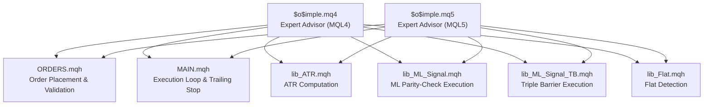
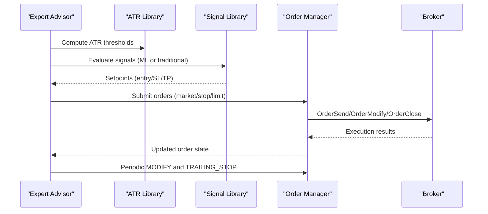
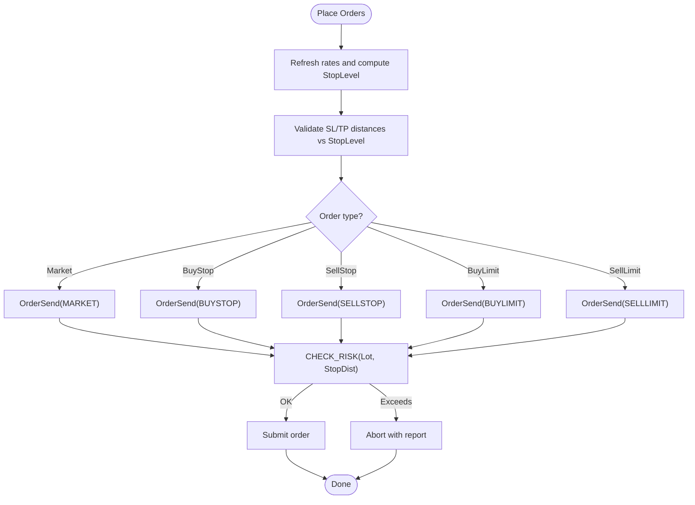
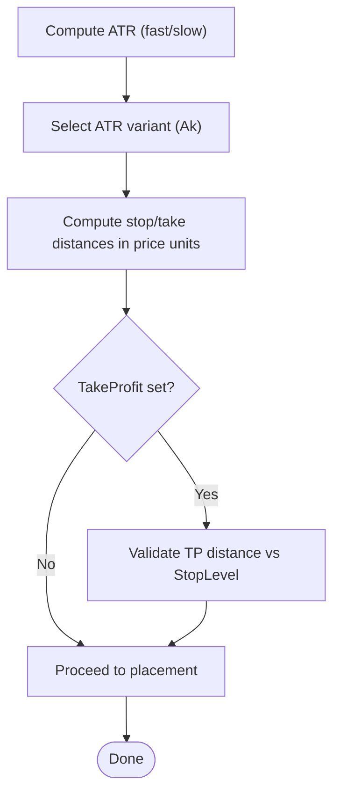
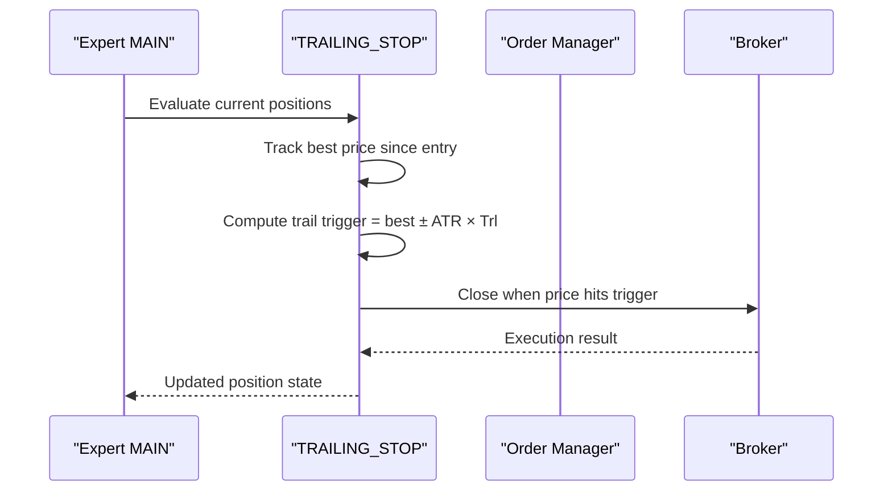
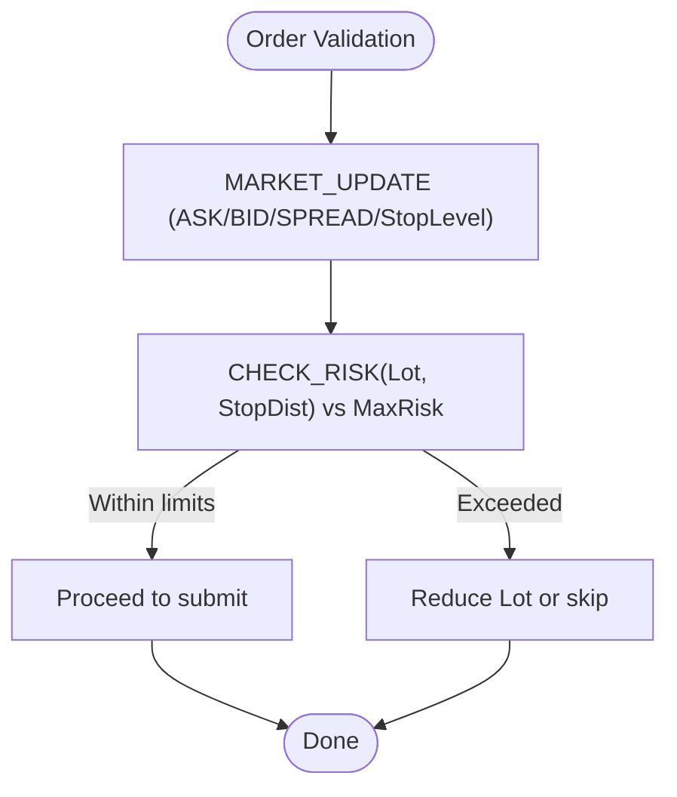
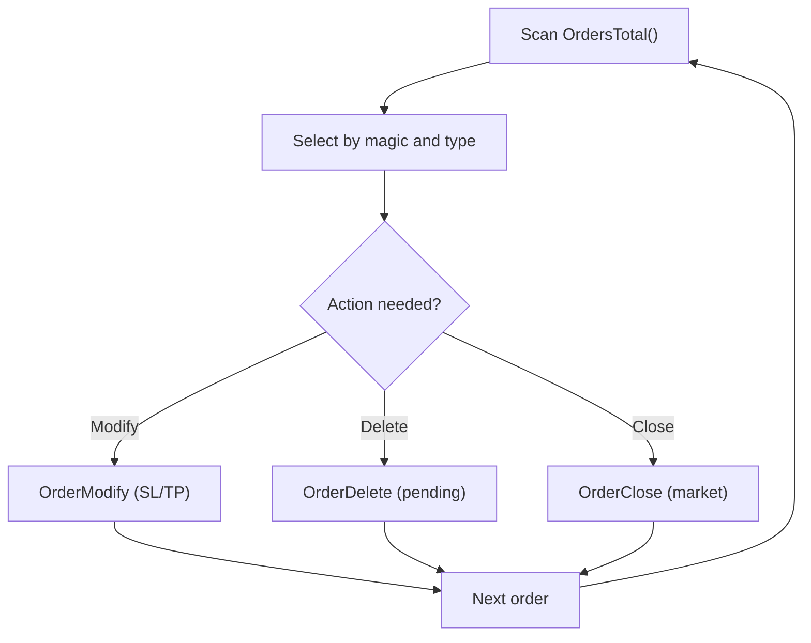
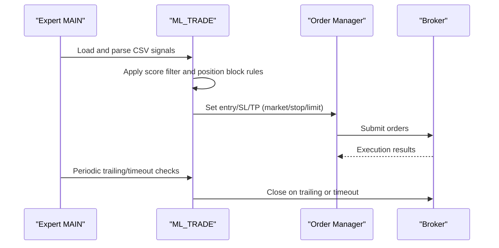
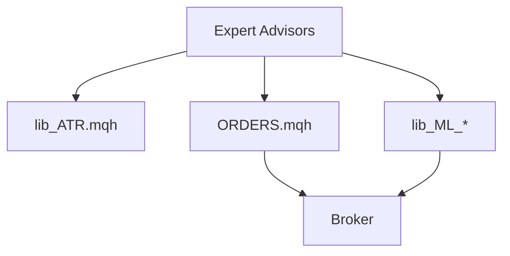

# Trade Execution and Order Management

<cite>
**Referenced Files in This Document**
- [$o$imple.mq4](file://MT/MQL4/Experts/$o$imple.mq4)
- [$o$imple.mq5](file://MT/MQL5/Experts/$o$imple.mq5)
- [ORDERS.mqh](file://MT/MQL4/Include/ORDERS.mqh)
- [MAIN.mqh](file://MT/MQL4/Include/MAIN.mqh)
- [lib_ATR.mqh](file://MT/MQL4/Include/lib_ATR.mqh)
- [lib_ML_Signal.mqh](file://MT/MQL4/Include/lib_ML_Signal.mqh)
- [lib_ML_Signal_TB.mqh](file://MT/MQL4/Include/lib_ML_Signal_TB.mqh)
- [lib_Flat.mqh](file://MT/MQL4/Include/lib_Flat.mqh)
</cite>

## Table of Contents
1. [Introduction](#introduction)
2. [Project Structure](#project-structure)
3. [Core Components](#core-components)
4. [Architecture Overview](#architecture-overview)
5. [Detailed Component Analysis](#detailed-component-analysis)
6. [Dependency Analysis](#dependency-analysis)
7. [Performance Considerations](#performance-considerations)
8. [Troubleshooting Guide](#troubleshooting-guide)
9. [Conclusion](#conclusion)

## Introduction
This document explains the trade execution and order management system in the SoSimple expert advisor. It covers order placement logic, stop loss and take profit calculations using ATR-based methods, trailing stop implementations, order validation, spread impact handling, and order modification/deletion mechanisms. Practical scenarios, configuration examples, and debugging approaches are included to help operators tune and troubleshoot the system effectively.

## Project Structure
The execution pipeline centers on the expert advisors ($o$imple.mq4 and $o$imple.mq5) and a shared library of order management routines (ORDERS.mqh). Signal-driven execution is handled by dedicated libraries:
- ML parity-check execution via lib_ML_Signal.mqh
- Triple Barrier fixed SL/TP execution via lib_ML_Signal_TB.mqh
- ATR computation via lib_ATR.mqh
- Additional support logic via lib_Flat.mqh

**Diagram sources**
- [$o$imple.mq4:123-132](file://MT/MQL4/Experts/$o$imple.mq4#L123-L132)
- [$o$imple.mq5:137-147](file://MT/MQL5/Experts/$o$imple.mq5#L137-L147)
- [ORDERS.mqh:5-13](file://MT/MQL4/Include/ORDERS.mqh#L5-L13)
- [MAIN.mqh:117-143](file://MT/MQL4/Include/MAIN.mqh#L117-L143)
- [lib_ATR.mqh:2-47](file://MT/MQL4/Include/lib_ATR.mqh#L2-L47)
- [lib_ML_Signal.mqh:603-923](file://MT/MQL4/Include/lib_ML_Signal.mqh#L603-L923)
- [lib_ML_Signal_TB.mqh:118-200](file://MT/MQL4/Include/lib_ML_Signal_TB.mqh#L118-L200)
- [lib_Flat.mqh:2-43](file://MT/MQL4/Include/lib_Flat.mqh#L2-L43)

**Section sources**
- [$o$imple.mq4:1-149](file://MT/MQL4/Experts/$o$imple.mq4#L1-L149)
- [$o$imple.mq5:1-157](file://MT/MQL5/Experts/$o$imple.mq5#L1-L157)

## Core Components
- Expert Advisors: Initialize parameters, orchestrate per-bar execution, and delegate to order management and signal libraries.
- Order Management Library: Handles market/stop/limit orders, validation, risk checks, and global order coordination across experts.
- Signal Libraries: Execute trades based on ML signals (parity-check or triple barrier).
- ATR Library: Computes fast/slow ATR and derived thresholds used for SL/TP and trailing logic.
- Trailing Stop Logic: Implements trailing logic for both traditional and ML modes.

Key execution entry points:
- OnTick triggers daily statistics, expert loop, and reporting.
- MAIN orchestrates signal processing, trailing stop, and order lifecycle.
- ML_TRADE and ML_TRADE_TB implement ML-driven execution.
- TRAILING_STOP applies trailing logic to existing positions.

**Section sources**
- [MAIN.mqh:117-143](file://MT/MQL4/Include/MAIN.mqh#L117-L143)
- [lib_ML_Signal.mqh:603-923](file://MT/MQL4/Include/lib_ML_Signal.mqh#L603-L923)
- [lib_ML_Signal_TB.mqh:118-200](file://MT/MQL4/Include/lib_ML_Signal_TB.mqh#L118-L200)
- [lib_ATR.mqh:2-47](file://MT/MQL4/Include/lib_ATR.mqh#L2-L47)

## Architecture Overview
The execution architecture separates concerns:
- Parameter-driven signal generation (ML or traditional)
- ATR-based risk and distance computations
- Centralized order placement/validation/modification
- Global order coordination for multiple experts
- Trailing stop enforcement during market monitoring

**Diagram sources**
- [lib_ATR.mqh:2-47](file://MT/MQL4/Include/lib_ATR.mqh#L2-L47)
- [lib_ML_Signal.mqh:603-923](file://MT/MQL4/Include/lib_ML_Signal.mqh#L603-L923)
- [lib_ML_Signal_TB.mqh:118-200](file://MT/MQL4/Include/lib_ML_Signal_TB.mqh#L118-L200)
- [ORDERS.mqh:14-61](file://MT/MQL4/Include/ORDERS.mqh#L14-L61)

## Detailed Component Analysis

### Order Placement Logic (Market, Stop, Limit)
- Market orders: Submitted at Ask/Bid depending on direction.
- Stop orders: BUYSTOP at ask plus offset; SELLSTOP at bid minus offset.
- Limit orders: BUYLIMIT at ask minus offset; SELLIMIT at bid plus offset.
- Risk-aware sizing: Lot computed via MM() using stop distance in ATR units.
- Validation: Checks proximity to StopLevel and validates risk exposure before submission.

**Diagram sources**
- [ORDERS.mqh:14-61](file://MT/MQL4/Include/ORDERS.mqh#L14-L61)
- [ORDERS.mqh:133-140](file://MT/MQL4/Include/ORDERS.mqh#L133-L140)

**Section sources**
- [ORDERS.mqh:14-61](file://MT/MQL4/Include/ORDERS.mqh#L14-L61)
- [ORDERS.mqh:133-140](file://MT/MQL4/Include/ORDERS.mqh#L133-L140)

### Stop Loss and Take Profit Calculations (ATR-based)
- ATR computed as fast/slow averages and combined per Ak selection.
- Stop distance and thresholds derived from ATR × multiplier.
- Take profit can be set in ATR multiples; validated against minimum distance requirements.
- Back-stop protection uses ATR × ML_BackStopATR to ensure realistic SL placement.

**Diagram sources**
- [lib_ATR.mqh:2-47](file://MT/MQL4/Include/lib_ATR.mqh#L2-L47)
- [lib_ML_Signal.mqh:306-387](file://MT/MQL4/Include/lib_ML_Signal.mqh#L306-L387)

**Section sources**
- [lib_ATR.mqh:2-47](file://MT/MQL4/Include/lib_ATR.mqh#L2-L47)
- [lib_ML_Signal.mqh:306-387](file://MT/MQL4/Include/lib_ML_Signal.mqh#L306-L387)

### Trailing Stop Implementations
Two trailing stop modes are supported:

1) Traditional trailing stop (non-ML):
- TRAILING_STOP periodically evaluates best price seen since entry.
- For longs: trail stop at best_high - ATR × Trl.
- For shorts: trail stop at best_low + ATR × Trl.
- Close when price touches trailing trigger.

2) ML parity-check trailing stop:
- Managed per position with MLP_ManageMultiPositions.
- Mode 0: close after holding bars threshold (timeout).
- Mode 1: trailing stop at best ± ATR × ML_TrailATR.
- Optional reversal close when opposite signal appears.

**Diagram sources**
- [MAIN.mqh:117-143](file://MT/MQL4/Include/MAIN.mqh#L117-L143)
- [lib_ML_Signal.mqh:269-304](file://MT/MQL4/Include/lib_ML_Signal.mqh#L269-L304)

**Section sources**
- [MAIN.mqh:62-62](file://MT/MQL4/Include/MAIN.mqh#L62-L62)
- [lib_ML_Signal.mqh:269-304](file://MT/MQL4/Include/lib_ML_Signal.mqh#L269-L304)
- [lib_ML_Signal.mqh:669-841](file://MT/MQL4/Include/lib_ML_Signal.mqh#L669-L841)

### Order Validation, Spread Impact, and Risk Checks
- Spread and StopLevel: MARKET_UPDATE computes StopLevel incorporating spread and point value to prevent invalid orders.
- Risk validation: CHECK_RISK(Lot, StopDist) ensures total risk remains within configured MaxRisk.
- Global order coordination: GLOBAL_ORDERS_SET aggregates orders from multiple experts, adjusts lot sizes to fit risk and margin caps, and applies modifications safely.

**Diagram sources**
- [ORDERS.mqh:133-140](file://MT/MQL4/Include/ORDERS.mqh#L133-L140)
- [ORDERS.mqh:25-27](file://MT/MQL4/Include/ORDERS.mqh#L25-L27)
- [ORDERS.mqh:184-322](file://MT/MQL4/Include/ORDERS.mqh#L184-L322)

**Section sources**
- [ORDERS.mqh:133-140](file://MT/MQL4/Include/ORDERS.mqh#L133-L140)
- [ORDERS.mqh:184-322](file://MT/MQL4/Include/ORDERS.mqh#L184-L322)

### Order Modification and Deletion Mechanisms
- MODIFY scans open/pending orders and:
  - Adjust stop/take prices if outside tolerance bands.
  - Delete pending orders when targets are removed.
  - Close market positions when requested.
- GLOBAL_ORDERS_SET coordinates multiple experts’ orders, recalculating lot sizes considering existing positions and free margin constraints.

**Diagram sources**
- [ORDERS.mqh:66-130](file://MT/MQL4/Include/ORDERS.mqh#L66-L130)
- [ORDERS.mqh:184-322](file://MT/MQL4/Include/ORDERS.mqh#L184-L322)

**Section sources**
- [ORDERS.mqh:66-130](file://MT/MQL4/Include/ORDERS.mqh#L66-L130)
- [ORDERS.mqh:184-322](file://MT/MQL4/Include/ORDERS.mqh#L184-L322)

### ML Execution Strategies and Configuration
- ML parity-check (direct CSV signals):
  - ML_ExitMode: 0 (timeout parity-check), 1 (trailing-stop by X*ATR).
  - ML_TrailATR: Trailing stop distance in ATR multiples.
  - ML_TakeProfitATR: Optional fixed take-profit in ATR.
  - ML_MaxPositions: Allow multiple simultaneous positions.
  - ML_HoldBars: Timeout window for parity-check mode.
  - ML_AllowReversal: Close current position upon opposite signal.
  - ML_UseScoreFilter / ML_ScoreThreshold: Filter by prediction score.
  - ML_BackStopATR: Minimum back-stop distance in ATR for SL placement.
- Triple Barrier (fixed SL/TP):
  - SL/TP distances provided in ATR units via CSV; converted to absolute values using current ATR.

**Diagram sources**
- [lib_ML_Signal.mqh:603-923](file://MT/MQL4/Include/lib_ML_Signal.mqh#L603-L923)
- [lib_ML_Signal_TB.mqh:118-200](file://MT/MQL4/Include/lib_ML_Signal_TB.mqh#L118-L200)

**Section sources**
- [lib_ML_Signal.mqh:603-923](file://MT/MQL4/Include/lib_ML_Signal.mqh#L603-L923)
- [lib_ML_Signal_TB.mqh:118-200](file://MT/MQL4/Include/lib_ML_Signal_TB.mqh#L118-L200)
- [$o$imple.mq4:71-81](file://MT/MQL4/Experts/$o$imple.mq4#L71-L81)

### Practical Execution Scenarios
- Scenario A: ML parity-check with trailing stop
  - Configure ML_ExitMode=1, ML_TrailATR=8.0, ML_TakeProfitATR=0.
  - On signal, enter market with back-stop SL at ATR×ML_BackStopATR.
  - Trail stop at best ± ATR×8.0; close when hit.
- Scenario B: ML parity-check with timeout
  - Configure ML_ExitMode=0, ML_HoldBars=12.
  - Enter market; close after 12 bars regardless of price action.
- Scenario C: Triple Barrier fixed SL/TP
  - Provide CSV with sl_atr and tp_atr; system converts to absolute SL/TP using current ATR.
- Scenario D: Traditional trailing stop
  - Keep Trl positive/negative to trail from entry/stop respectively.
  - Best price tracked per side; close when price touches trail trigger.

**Section sources**
- [lib_ML_Signal.mqh:269-304](file://MT/MQL4/Include/lib_ML_Signal.mqh#L269-L304)
- [lib_ML_Signal.mqh:669-841](file://MT/MQL4/Include/lib_ML_Signal.mqh#L669-L841)
- [lib_ML_Signal_TB.mqh:147-192](file://MT/MQL4/Include/lib_ML_Signal_TB.mqh#L147-L192)
- [MAIN.mqh:62-62](file://MT/MQL4/Include/MAIN.mqh#L62-L62)

## Dependency Analysis
- Expert advisors depend on:
  - ATR library for volatility measures.
  - Signal libraries for entry/exit decisions.
  - Order manager for lifecycle operations.
- Order manager depends on:
  - Market data refresh and spread-aware StopLevel.
  - Risk and margin constraints.
  - Global variable coordination for multi-expert setups.

**Diagram sources**
- [lib_ATR.mqh:2-47](file://MT/MQL4/Include/lib_ATR.mqh#L2-L47)
- [lib_ML_Signal.mqh:603-923](file://MT/MQL4/Include/lib_ML_Signal.mqh#L603-L923)
- [lib_ML_Signal_TB.mqh:118-200](file://MT/MQL4/Include/lib_ML_Signal_TB.mqh#L118-L200)
- [ORDERS.mqh:184-322](file://MT/MQL4/Include/ORDERS.mqh#L184-L322)

**Section sources**
- [lib_ATR.mqh:2-47](file://MT/MQL4/Include/lib_ATR.mqh#L2-L47)
- [lib_ML_Signal.mqh:603-923](file://MT/MQL4/Include/lib_ML_Signal.mqh#L603-L923)
- [lib_ML_Signal_TB.mqh:118-200](file://MT/MQL4/Include/lib_ML_Signal_TB.mqh#L118-L200)
- [ORDERS.mqh:184-322](file://MT/MQL4/Include/ORDERS.mqh#L184-L322)

## Performance Considerations
- Prefer ATR-based sizing to adapt to volatility and reduce slippage risk.
- Use ML_BackStopATR to ensure realistic SL placement and avoid rejections.
- Limit concurrent positions via ML_MaxPositions to control correlation and drawdown.
- Tune ML_HoldBars and ML_TrailATR to balance expectancy and turnover.
- Monitor spread impact via StopLevel adjustments and avoid placing orders too close to the edge.

## Troubleshooting Guide
Common issues and resolutions:
- Orders rejected due to proximity to StopLevel:
  - Verify StopLevel calculation and ensure SL/TP distances exceed StopLevel.
  - Adjust ATR multipliers or use higher StopLevel.
- Risk exceeds MaxRisk:
  - Reduce Lot via MM() or lower ATR-based stop distances.
  - Review existing positions and free margin constraints.
- Pending order deletion failures near market:
  - Ensure pending order price is sufficiently away from market; otherwise deletion is prevented.
- Trailing stop not activating:
  - Confirm Trl sign and magnitude; verify best price tracking and trigger threshold.
  - For ML mode, check ML_TrailATR and exit mode configuration.
- Multi-expert conflicts:
  - Use GLOBAL_ORDERS_SET diagnostics and ensure magic numbers are unique per expert.
  - Review risk correction and margin correction logic.

**Section sources**
- [ORDERS.mqh:18-20](file://MT/MQL4/Include/ORDERS.mqh#L18-L20)
- [ORDERS.mqh:25-27](file://MT/MQL4/Include/ORDERS.mqh#L25-L27)
- [ORDERS.mqh:90-99](file://MT/MQL4/Include/ORDERS.mqh#L90-L99)
- [lib_ML_Signal.mqh:287-298](file://MT/MQL4/Include/lib_ML_Signal.mqh#L287-L298)
- [lib_ML_Signal.mqh:326-332](file://MT/MQL4/Include/lib_ML_Signal.mqh#L326-L332)

## Conclusion
SoSimple’s execution system combines robust order lifecycle management with ATR-based risk controls and flexible trailing stop strategies. Whether using ML parity-check or triple barrier signals, or traditional trailing logic, the system emphasizes safety (spread-aware pricing, risk checks) and configurability (multi-mode exits, position sizing). Proper tuning of ATR multipliers, trailing parameters, and position limits yields reliable performance across market regimes.