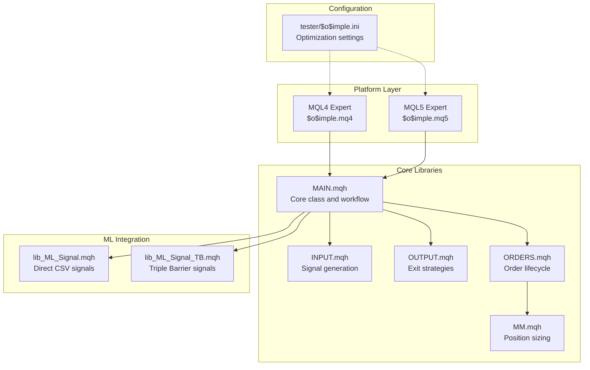
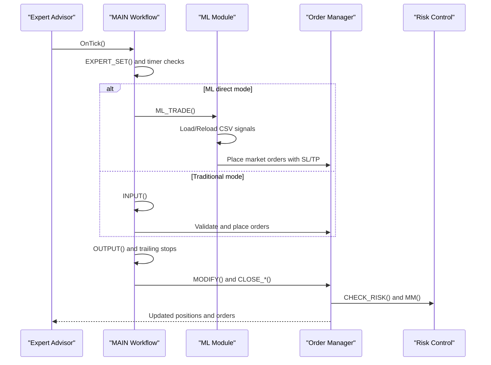
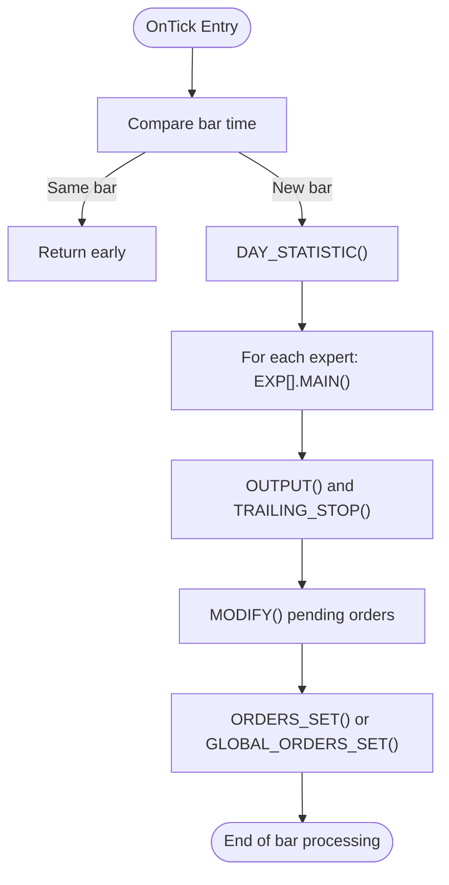
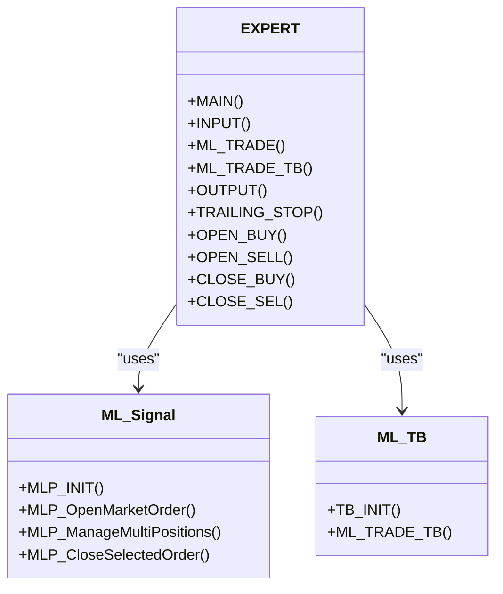
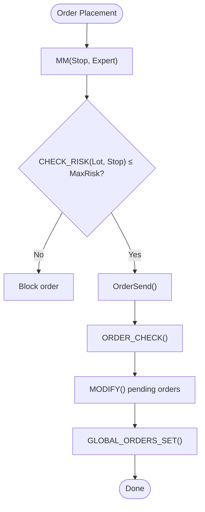
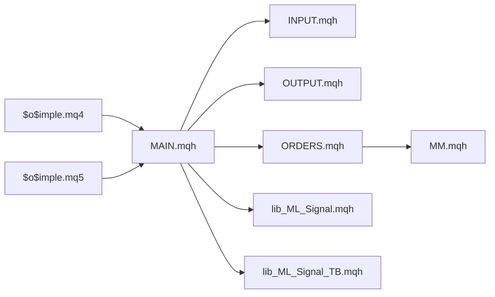

# Expert Advisor Implementation

<cite>
**Referenced Files in This Document**
- [$o$imple.mq4](file://MT/MQL4/Experts/$o$imple.mq4)
- [$o$imple.mq5](file://MT/MQL5/Experts/$o$imple.mq5)
- [MAIN.mqh](file://MT/MQL4/Include/MAIN.mqh)
- [INPUT.mqh](file://MT/MQL4/Include/INPUT.mqh)
- [OUTPUT.mqh](file://MT/MQL4/Include/OUTPUT.mqh)
- [ORDERS.mqh](file://MT/MQL4/Include/ORDERS.mqh)
- [MM.mqh](file://MT/MQL4/Include/MM.mqh)
- [lib_ML_Signal.mqh](file://MT/MQL4/Include/lib_ML_Signal.mqh)
- [lib_ML_Signal_TB.mqh](file://MT/MQL4/Include/lib_ML_Signal_TB.mqh)
- [$o$imple.ini](file://MT/tester/$o$imple.ini)
</cite>

## Table of Contents
1. [Introduction](#introduction)
2. [Project Structure](#project-structure)
3. [Core Components](#core-components)
4. [Architecture Overview](#architecture-overview)
5. [Detailed Component Analysis](#detailed-component-analysis)
6. [Dependency Analysis](#dependency-analysis)
7. [Performance Considerations](#performance-considerations)
8. [Troubleshooting Guide](#troubleshooting-guide)
9. [Conclusion](#conclusion)

## Introduction
This document provides comprehensive expert advisor documentation for the SoSimple trading system. It focuses on the main expert advisor implementation in `$o$imple.mq4`, covering parameter configuration, trading logic, order management, risk controls, and integration with machine learning signals. The documentation explains the MQL4/MQL5 codebase structure, input parameters, optimization settings, performance metrics, and practical guidance for deployment, tuning, and troubleshooting.

## Project Structure
The SoSimple system consists of:
- Expert Advisors for MQL4 and MQL5 platforms
- Modular include libraries for core functionality (signal processing, order management, risk control)
- ML integration modules for CSV-based signal execution
- Tester configuration for optimization and backtesting

**Diagram sources**
- [$o$imple.mq4:123-149](file://MT/MQL4/Experts/$o$imple.mq4#L123-L149)
- [$o$imple.mq5:137-147](file://MT/MQL5/Experts/$o$imple.mq5#L137-L147)
- [MAIN.mqh:117-143](file://MT/MQL4/Include/MAIN.mqh#L117-L143)
- [INPUT.mqh:3-54](file://MT/MQL4/Include/INPUT.mqh#L3-L54)
- [OUTPUT.mqh:6-62](file://MT/MQL4/Include/OUTPUT.mqh#L6-L62)
- [ORDERS.mqh:5-13](file://MT/MQL4/Include/ORDERS.mqh#L5-L13)
- [MM.mqh:1-30](file://MT/MQL4/Include/MM.mqh#L1-L30)
- [lib_ML_Signal.mqh:603-667](file://MT/MQL4/Include/lib_ML_Signal.mqh#L603-L667)
- [lib_ML_Signal_TB.mqh:118-200](file://MT/MQL4/Include/lib_ML_Signal_TB.mqh#L118-L200)
- [$o$imple.ini:1-353](file://MT/tester/$o$imple.ini#L1-L353)

**Section sources**
- [$o$imple.mq4:1-149](file://MT/MQL4/Experts/$o$imple.mq4#L1-L149)
- [$o$imple.mq5:1-157](file://MT/MQL5/Experts/$o$imple.mq5#L1-L157)
- [MAIN.mqh:1-213](file://MT/MQL4/Include/MAIN.mqh#L1-L213)
- [INPUT.mqh:1-251](file://MT/MQL4/Include/INPUT.mqh#L1-L251)
- [OUTPUT.mqh:1-328](file://MT/MQL4/Include/OUTPUT.mqh#L1-L328)
- [ORDERS.mqh:1-401](file://MT/MQL4/Include/ORDERS.mqh#L1-L401)
- [MM.mqh:1-82](file://MT/MQL4/Include/MM.mqh#L1-L82)
- [lib_ML_Signal.mqh:1-951](file://MT/MQL4/Include/lib_ML_Signal.mqh#L1-L951)
- [lib_ML_Signal_TB.mqh:1-215](file://MT/MQL4/Include/lib_ML_Signal_TB.mqh#L1-L215)
- [$o$imple.ini:1-353](file://MT/tester/$o$imple.ini#L1-L353)

## Core Components
This section outlines the primary building blocks of the SoSimple expert advisor and their roles in the trading system.

- Expert entry points and lifecycle
  - MQL4: OnTick handler orchestrates daily statistics, expert execution, and reporting
  - MQL5: OnTick handler mirrors MQL4 with compatibility layer and price refresh
- Core class hierarchy and workflow
  - EXPERT class encapsulates signal detection, order placement, and exits
  - MAIN method coordinates ML signal processing, time filtering, order checks, and trailing stops
- Signal processing
  - INPUT module generates traditional signals or delegates to ML modules
  - ML modules consume CSV feeds for direct execution or triple barrier targets
- Order management
  - Centralized order creation, modification, deletion, and global coordination across experts
  - Risk-aware lot sizing via MM function and margin/risk checks
- Exit strategies
  - Dynamic trailing stops, impulse-based closures, trend reversals, and time-based exits
- ML integration
  - Direct CSV signal execution with parity checking and optional score filtering
  - Triple barrier signals with fixed SL/TP in ATR units

**Section sources**
- [$o$imple.mq4:123-149](file://MT/MQL4/Experts/$o$imple.mq4#L123-L149)
- [$o$imple.mq5:137-147](file://MT/MQL5/Experts/$o$imple.mq5#L137-L147)
- [MAIN.mqh:117-143](file://MT/MQL4/Include/MAIN.mqh#L117-L143)
- [INPUT.mqh:3-54](file://MT/MQL4/Include/INPUT.mqh#L3-L54)
- [OUTPUT.mqh:6-62](file://MT/MQL4/Include/OUTPUT.mqh#L6-L62)
- [ORDERS.mqh:5-13](file://MT/MQL4/Include/ORDERS.mqh#L5-L13)
- [MM.mqh:1-30](file://MT/MQL4/Include/MM.mqh#L1-L30)
- [lib_ML_Signal.mqh:603-667](file://MT/MQL4/Include/lib_ML_Signal.mqh#L603-L667)
- [lib_ML_Signal_TB.mqh:118-200](file://MT/MQL4/Include/lib_ML_Signal_TB.mqh#L118-L200)

## Architecture Overview
The SoSimple expert advisor follows a modular, event-driven architecture:
- Event loop per bar tick triggers expert evaluation
- Expert evaluates time filters, ML signals, and traditional inputs
- Orders are placed or modified based on validated signals and risk constraints
- Continuous monitoring of trailing stops and exit conditions

**Diagram sources**
- [MAIN.mqh:117-143](file://MT/MQL4/Include/MAIN.mqh#L117-L143)
- [INPUT.mqh:3-54](file://MT/MQL4/Include/INPUT.mqh#L3-L54)
- [OUTPUT.mqh:6-62](file://MT/MQL4/Include/OUTPUT.mqh#L6-L62)
- [ORDERS.mqh:5-13](file://MT/MQL4/Include/ORDERS.mqh#L5-L13)
- [MM.mqh:33-37](file://MT/MQL4/Include/MM.mqh#L33-L37)
- [lib_ML_Signal.mqh:603-667](file://MT/MQL4/Include/lib_ML_Signal.mqh#L603-L667)

## Detailed Component Analysis

### Expert Lifecycle and Execution Flow
- Initialization and per-bar processing
  - OnTick compares bar times, updates day statistics, executes experts, and finalizes reporting
  - MQL5 additionally refreshes price arrays before processing
- Expert selection and execution
  - MAIN selects expert parameters from CSV, performs order checks, applies time filters, and coordinates ML or traditional modes
  - Multi-position mode allows multiple concurrent ML positions when enabled

**Diagram sources**
- [$o$imple.mq4:123-132](file://MT/MQL4/Experts/$o$imple.mq4#L123-L132)
- [$o$imple.mq5:137-147](file://MT/MQL5/Experts/$o$imple.mq5#L137-L147)
- [MAIN.mqh:117-143](file://MT/MQL4/Include/MAIN.mqh#L117-L143)
- [ORDERS.mqh:184-322](file://MT/MQL4/Include/ORDERS.mqh#L184-L322)

**Section sources**
- [$o$imple.mq4:123-149](file://MT/MQL4/Experts/$o$imple.mq4#L123-L149)
- [$o$imple.mq5:137-147](file://MT/MQL5/Experts/$o$imple.mq5#L137-L147)
- [MAIN.mqh:117-143](file://MT/MQL4/Include/MAIN.mqh#L117-L143)
- [ORDERS.mqh:184-322](file://MT/MQL4/Include/ORDERS.mqh#L184-L322)

### Parameter Configuration and Inputs
- Core parameters (MQL4 extern/sinput; MQL5 input)
  - Optimization controls: Opt_Trades, RF_, PF_, MO_
  - Risk management: Risk, MM (money management mode), MaxRisk, MaxMargin
  - Time filters: tk, T0, T1, tp, Wknd
  - ML optimization: ML_MinRatio, ML_MaxRatio, ML_MaxRR, ML_RR_Mode, ML_RR_Cap, ML_ScaleK, ML_Min_SL_ATR, ML_BypassTrend, ML_ExitEnabled, ML_ExitThreshold, ML_Filter3, ML_Filter6, ML_Trl_Start_ATR, ML_Trl_Step_ATR, ML_ExitMode, ML_TrailATR, ML_TakeProfitATR, ML_MaxPositions, ML_HoldBars, ML_AllowReversal, ML_UseScoreFilter, ML_ScoreThreshold, ML_BackStopATR
- Platform differences
  - MQL5 includes explicit input declarations and a SyncInputs() bridge to legacy extern variables
  - MQL4 uses extern/sinput declarations directly

**Section sources**
- [$o$imple.mq4:8-81](file://MT/MQL4/Experts/$o$imple.mq4#L8-L81)
- [$o$imple.mq5:7-111](file://MT/MQL5/Experts/$o$imple.mq5#L7-L111)
- [$o$imple.ini:9-333](file://MT/tester/$o$imple.ini#L9-L333)

### Trading Logic and Signal Processing
- Traditional signal generation
  - INPUT module builds BUY/SELL orders from detected patterns and trend signals
  - Supports multiple signal types (first levels, false break, turtle, ML trade, ML triple barrier)
- ML signal execution
  - Direct CSV signals: loads ml_signals.csv, validates scores, manages multiple positions, trailing stops, and timeouts
  - Triple barrier signals: reads ml_signals_tb.csv with fixed SL/TP in ATR units, supports trend bypass

**Diagram sources**
- [INPUT.mqh:3-54](file://MT/MQL4/Include/INPUT.mqh#L3-L54)
- [lib_ML_Signal.mqh:603-667](file://MT/MQL4/Include/lib_ML_Signal.mqh#L603-L667)
- [lib_ML_Signal_TB.mqh:118-200](file://MT/MQL4/Include/lib_ML_Signal_TB.mqh#L118-L200)

**Section sources**
- [INPUT.mqh:3-54](file://MT/MQL4/Include/INPUT.mqh#L3-L54)
- [lib_ML_Signal.mqh:603-667](file://MT/MQL4/Include/lib_ML_Signal.mqh#L603-L667)
- [lib_ML_Signal_TB.mqh:118-200](file://MT/MQL4/Include/lib_ML_Signal_TB.mqh#L118-L200)

### Order Management and Risk Controls
- Order lifecycle
  - ORDERS_SET: creates or modifies orders depending on platform mode
  - MODIFY: deletes expired pending orders and adjusts stops/profits for existing positions
  - GLOBAL_ORDERS_SET: centralized allocation across multiple experts with risk and margin checks
- Risk controls
  - MM: calculates lot sizes based on account balance, stop distance, and risk percentage
  - CHECK_RISK: computes realized risk percentage for proposed trades
  - CUR_DD: measures current expert drawdown for adaptive money management
- Price and spread handling
  - MARKET_UPDATE: refreshes prices, digits, spreads, and stop level thresholds

**Diagram sources**
- [ORDERS.mqh:5-13](file://MT/MQL4/Include/ORDERS.mqh#L5-L13)
- [MM.mqh:1-30](file://MT/MQL4/Include/MM.mqh#L1-L30)
- [MM.mqh:33-37](file://MT/MQL4/Include/MM.mqh#L33-L37)
- [ORDERS.mqh:184-322](file://MT/MQL4/Include/ORDERS.mqh#L184-L322)

**Section sources**
- [ORDERS.mqh:5-13](file://MT/MQL4/Include/ORDERS.mqh#L5-L13)
- [MM.mqh:1-30](file://MT/MQL4/Include/MM.mqh#L1-L30)
- [MM.mqh:33-37](file://MT/MQL4/Include/MM.mqh#L33-L37)
- [ORDERS.mqh:184-322](file://MT/MQL4/Include/ORDERS.mqh#L184-L322)

### Position Sizing Calculations
- Money management modes
  - Classic anti-Martingale based on total account balance
  - Adaptive based on current drawdown
  - Individual balance tracking with maximum balance reference
  - Percentage of maximum recorded balance
- Lot sizing formula
  - Lot = Normalize(Debit × Risk × Aggress × 0.01 / (Stop/Point × TickValue))
  - Enforced against minimum/maximum lot limits
  - Risk capped by MaxRisk and margin constraints

**Section sources**
- [MM.mqh:53-82](file://MT/MQL4/Include/MM.mqh#L53-L82)

### Exit Strategies
- Impulse-based closures
  - IMPULSE_UP/IMPULSE_DN: require post-entry price movement relative to noise
- Trend reversal exits
  - Global/local trend changes trigger exits based on configured sensitivity
- Target-based exits
  - Fixed targets or moving targets derived from recent price action
- POC-based exits
  - Near peak/consolidation levels prompt exits or stop adjustments
- Trailing stops
  - Dynamic stops trail price by ATR multiples after breakeven threshold
- Time-based exits
  - Fixed holding periods or session-based restrictions

**Section sources**
- [OUTPUT.mqh:6-62](file://MT/MQL4/Include/OUTPUT.mqh#L6-L62)
- [OUTPUT.mqh:65-88](file://MT/MQL4/Include/OUTPUT.mqh#L65-L88)
- [OUTPUT.mqh:91-128](file://MT/MQL4/Include/OUTPUT.mqh#L91-L128)
- [OUTPUT.mqh:258-278](file://MT/MQL4/Include/OUTPUT.mqh#L258-L278)

### ML Integration Details
- Direct CSV signals
  - Loads ml_signals.csv with time and signal columns, optional prediction score
  - Supports score filtering and multiple position management
  - Implements parity-check with timeout-based or trailing-stop exits
- Triple barrier signals
  - Reads ml_signals_tb.csv with SL/TP in ATR units and optional probability/EV
  - Applies trend filter with optional bypass
  - Converts ATR-based targets to absolute prices

**Section sources**
- [lib_ML_Signal.mqh:457-551](file://MT/MQL4/Include/lib_ML_Signal.mqh#L457-L551)
- [lib_ML_Signal.mqh:603-667](file://MT/MQL4/Include/lib_ML_Signal.mqh#L603-L667)
- [lib_ML_Signal_TB.mqh:46-99](file://MT/MQL4/Include/lib_ML_Signal_TB.mqh#L46-L99)
- [lib_ML_Signal_TB.mqh:118-200](file://MT/MQL4/Include/lib_ML_Signal_TB.mqh#L118-L200)

## Dependency Analysis
The expert advisor exhibits strong modularity with clear separation of concerns:
- MAIN.mqh depends on INPUT.mqh, OUTPUT.mqh, ORDERS.mqh, and ML modules
- ORDERS.mqh depends on MM.mqh for risk-aware lot sizing
- ML modules operate independently but integrate via MAIN.mqh
- Platform-specific differences (MQL4 vs MQL5) are abstracted through include files and SyncInputs()

**Diagram sources**
- [MAIN.mqh:117-143](file://MT/MQL4/Include/MAIN.mqh#L117-L143)
- [INPUT.mqh:3-54](file://MT/MQL4/Include/INPUT.mqh#L3-L54)
- [OUTPUT.mqh:6-62](file://MT/MQL4/Include/OUTPUT.mqh#L6-L62)
- [ORDERS.mqh:5-13](file://MT/MQL4/Include/ORDERS.mqh#L5-L13)
- [MM.mqh:1-30](file://MT/MQL4/Include/MM.mqh#L1-L30)
- [lib_ML_Signal.mqh:603-667](file://MT/MQL4/Include/lib_ML_Signal.mqh#L603-L667)
- [lib_ML_Signal_TB.mqh:118-200](file://MT/MQL4/Include/lib_ML_Signal_TB.mqh#L118-L200)
- [$o$imple.mq4:123-149](file://MT/MQL4/Experts/$o$imple.mq4#L123-L149)
- [$o$imple.mq5:137-147](file://MT/MQL5/Experts/$o$imple.mq5#L137-L147)

**Section sources**
- [MAIN.mqh:117-143](file://MT/MQL4/Include/MAIN.mqh#L117-L143)
- [ORDERS.mqh:184-322](file://MT/MQL4/Include/ORDERS.mqh#L184-L322)
- [MM.mqh:1-30](file://MT/MQL4/Include/MM.mqh#L1-L30)
- [lib_ML_Signal.mqh:603-667](file://MT/MQL4/Include/lib_ML_Signal.mqh#L603-L667)
- [lib_ML_Signal_TB.mqh:118-200](file://MT/MQL4/Include/lib_ML_Signal_TB.mqh#L118-L200)
- [$o$imple.mq4:123-149](file://MT/MQL4/Experts/$o$imple.mq4#L123-L149)
- [$o$imple.mq5:137-147](file://MT/MQL5/Experts/$o$imple.mq5#L137-L147)

## Performance Considerations
- CSV loading and parsing
  - Lazy initialization for ML modules to avoid unnecessary I/O
  - Binary file modification time checks for real-time updates
- Order coordination
  - Centralized order placement reduces conflicts and optimizes resource usage
  - Risk and margin checks prevent overcommitment across experts
- Platform-specific optimizations
  - MQL5 includes RefreshPriceArrays() to minimize rate updates
  - Strict property and compiler warnings enable safer builds

[No sources needed since this section provides general guidance]

## Troubleshooting Guide
Common issues and resolutions:
- Order placement failures
  - Verify StopLevel proximity and spread thresholds; adjust D/Stp/Prf parameters
  - Use ERROR_CHECK logging to identify repeated failures and retry mechanisms
- Risk exceeded errors
  - Reduce Risk parameter or increase MaxRisk proportionally
  - Review MM mode selection and CurDD values
- ML signal delays
  - Ensure ml_signals.csv is updated and accessible; check file modification timestamps
  - Confirm ML_MaxPositions and ML_HoldBars align with expected concurrency
- Time filter conflicts
  - Adjust tk/T0/T1 parameters to match trading sessions and avoid premature exits
- Global order coordination
  - Monitor ORDERS_STATE changes and CHECK_OUT intervals for proper re-evaluation

**Section sources**
- [ORDERS.mqh:143-157](file://MT/MQL4/Include/ORDERS.mqh#L143-L157)
- [MM.mqh:33-37](file://MT/MQL4/Include/MM.mqh#L33-L37)
- [lib_ML_Signal.mqh:553-601](file://MT/MQL4/Include/lib_ML_Signal.mqh#L553-L601)
- [OUTPUT.mqh:6-62](file://MT/MQL4/Include/OUTPUT.mqh#L6-L62)

## Conclusion
The SoSimple expert advisor provides a robust, modular framework for both traditional and ML-driven trading. Its architecture separates concerns across signal processing, order management, and risk control, enabling flexible parameterization and platform support. Proper configuration of ML inputs, risk controls, and time filters ensures reliable operation across backtesting and live environments.