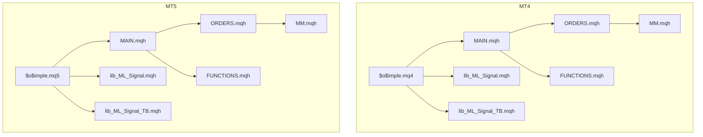
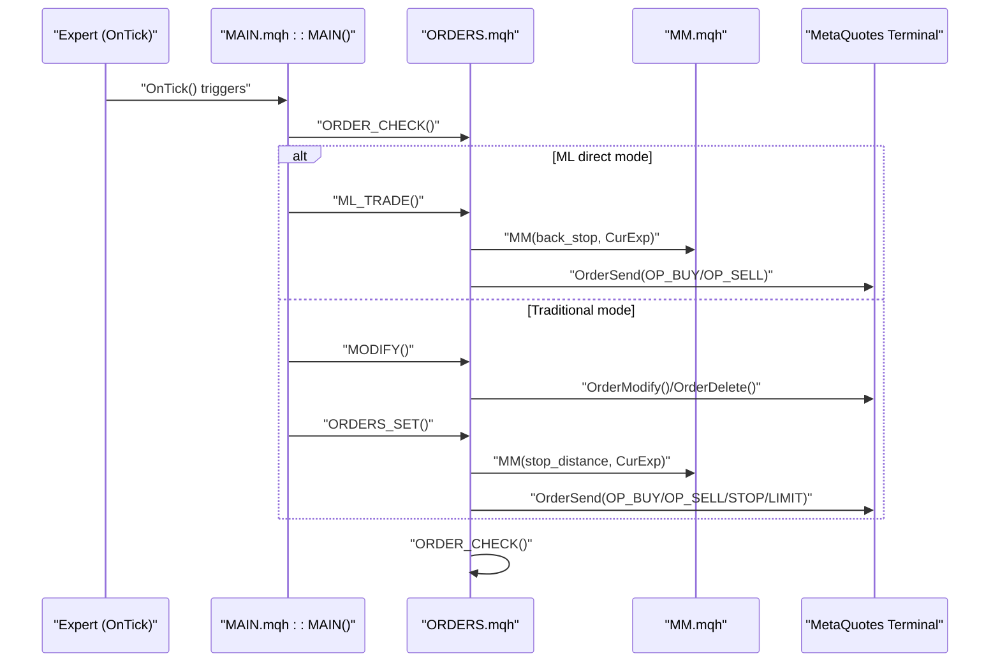
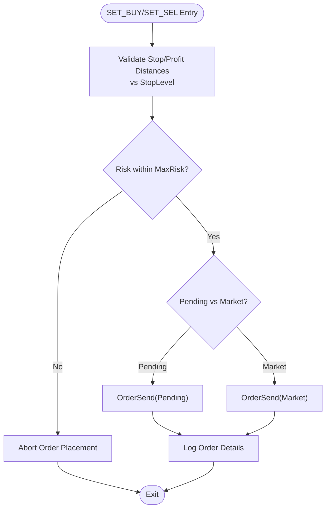
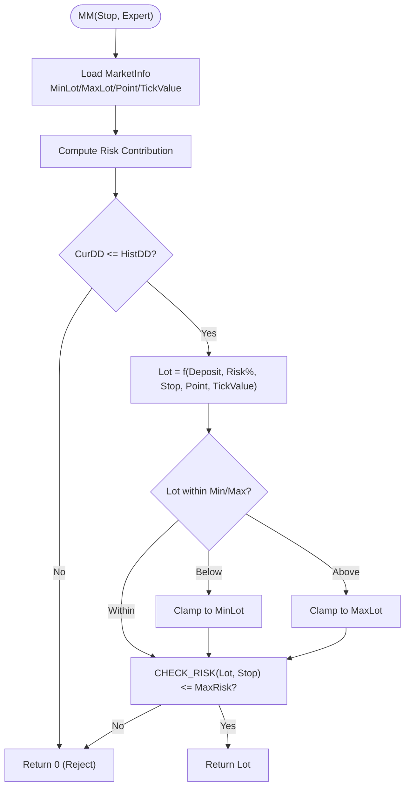
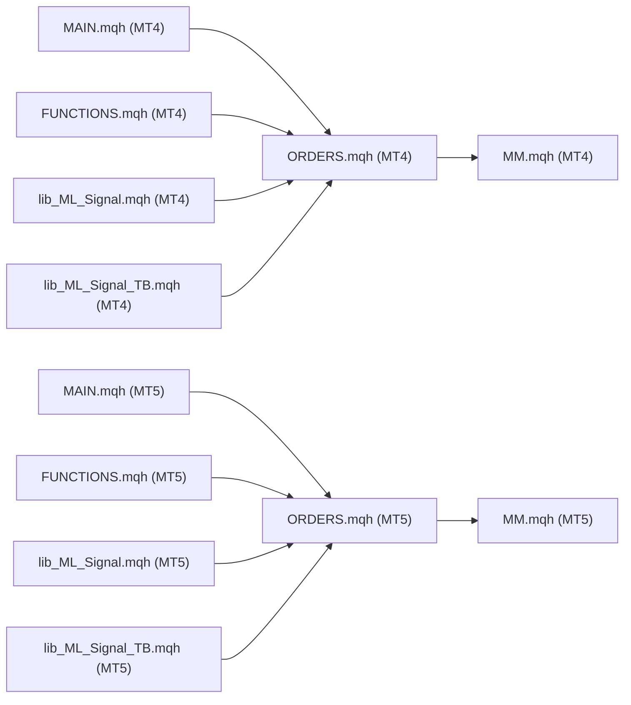

# Order Management

<cite>
**Referenced Files in This Document**
- [$o$imple.mq4](file://MT/MQL4/Experts/$o$imple.mq4)
- [$o$imple.mq5](file://MT/MQL5/Experts/$o$imple.mq5)
- [ORDERS.mqh](file://MT/MQL4/Include/ORDERS.mqh)
- [ORDERS.mqh](file://MT/MQL5/Include/ORDERS.mqh)
- [MM.mqh](file://MT/MQL4/Include/MM.mqh)
- [MM.mqh](file://MT/MQL5/Include/MM.mqh)
- [MAIN.mqh](file://MT/MQL4/Include/MAIN.mqh)
- [MAIN.mqh](file://MT/MQL5/Include/MAIN.mqh)
- [FUNCTIONS.mqh](file://MT/MQL4/Include/FUNCTIONS.mqh)
- [FUNCTIONS.mqh](file://MT/MQL5/Include/FUNCTIONS.mqh)
- [lib_ML_Signal.mqh](file://MT/MQL4/Include/lib_ML_Signal.mqh)
- [lib_ML_Signal_TB.mqh](file://MT/MQL4/Include/lib_ML_Signal_TB.mqh)
</cite>

## Table of Contents
1. [Introduction](#introduction)
2. [Project Structure](#project-structure)
3. [Core Components](#core-components)
4. [Architecture Overview](#architecture-overview)
5. [Detailed Component Analysis](#detailed-component-analysis)
6. [Dependency Analysis](#dependency-analysis)
7. [Performance Considerations](#performance-considerations)
8. [Troubleshooting Guide](#troubleshooting-guide)
9. [Conclusion](#conclusion)

## Introduction
This document explains the order management functionality of the SoSimple expert advisor across MetaQuotes platforms (MT4 and MT5). It covers order placement logic, position sizing via risk management, stop loss and take profit configuration, order modification procedures, integration with MetaQuotes trading functions, validation and error handling, and risk controls including maximum positions, drawdown protection, and position correlation management. Practical execution scenarios and troubleshooting guidance are included, along with platform-specific differences between MT4 and MT5.

## Project Structure
The order management system is implemented as part of the SoSimple expert advisor with shared logic across MT4 and MT5. Key components:
- Expert entry points: MT4 ($o$imple.mq4) and MT5 ($o$imple.mq5)
- Core order orchestration: ORDERS.mqh (shared across platforms)
- Position sizing and risk control: MM.mqh (shared across platforms)
- Expert lifecycle and order flow: MAIN.mqh (platform-specific)
- Platform abstraction and trading primitives: FUNCTIONS.mqh (platform-specific)
- Machine learning-driven order execution: lib_ML_Signal.mqh and lib_ML_Signal_TB.mqh

**Diagram sources**
- [$o$imple.mq4:123-132](file://MT/MQL4/Experts/$o$imple.mq4#L123-L132)
- [$o$imple.mq5:137-147](file://MT/MQL5/Experts/$o$imple.mq5#L137-L147)
- [MAIN.mqh:117-143](file://MT/MQL4/Include/MAIN.mqh#L117-L143)
- [MAIN.mqh:131-143](file://MT/MQL5/Include/MAIN.mqh#L131-L143)
- [ORDERS.mqh:5-13](file://MT/MQL4/Include/ORDERS.mqh#L5-L13)
- [MM.mqh:1-30](file://MT/MQL4/Include/MM.mqh#L1-L30)
- [FUNCTIONS.mqh:114-202](file://MT/MQL4/Include/FUNCTIONS.mqh#L114-L202)
- [lib_ML_Signal.mqh:603-667](file://MT/MQL4/Include/lib_ML_Signal.mqh#L603-L667)
- [lib_ML_Signal_TB.mqh:118-200](file://MT/MQL4/Include/lib_ML_Signal_TB.mqh#L118-L200)

**Section sources**
- [$o$imple.mq4:123-132](file://MT/MQL4/Experts/$o$imple.mq4#L123-L132)
- [$o$imple.mq5:137-147](file://MT/MQL5/Experts/$o$imple.mq5#L137-L147)

## Core Components
- Order orchestration and execution: Centralized in ORDERS.mqh with platform-specific expert entry points.
- Position sizing and risk control: Implemented in MM.mqh with risk percentage, account balance, and instrument-specific constraints.
- Expert lifecycle and order flow: Managed in MAIN.mqh with platform-specific differences in OnTick and order collection.
- Platform abstraction: Trading primitives and class hierarchy defined in FUNCTIONS.mqh.
- ML-driven order execution: Optional modes via lib_ML_Signal.mqh and lib_ML_Signal_TB.mqh.

**Section sources**
- [ORDERS.mqh:5-13](file://MT/MQL4/Include/ORDERS.mqh#L5-L13)
- [MM.mqh:1-30](file://MT/MQL4/Include/MM.mqh#L1-L30)
- [MAIN.mqh:117-143](file://MT/MQL4/Include/MAIN.mqh#L117-L143)
- [FUNCTIONS.mqh:114-202](file://MT/MQL4/Include/FUNCTIONS.mqh#L114-L202)
- [lib_ML_Signal.mqh:603-667](file://MT/MQL4/Include/lib_ML_Signal.mqh#L603-L667)
- [lib_ML_Signal_TB.mqh:118-200](file://MT/MQL4/Include/lib_ML_Signal_TB.mqh#L118-L200)

## Architecture Overview
The order management architecture follows a layered pattern:
- Expert entry points trigger order processing on each tick.
- The expert checks existing orders, validates timing and signals, and prepares new orders.
- Orders are placed or modified according to configured stop loss, take profit, and position limits.
- Risk controls enforce maximum risk percentage and margin utilization.
- ML modules can override traditional order logic for direct execution or fixed barrier signals.

**Diagram sources**
- [MAIN.mqh:117-143](file://MT/MQL4/Include/MAIN.mqh#L117-L143)
- [MAIN.mqh:131-143](file://MT/MQL5/Include/MAIN.mqh#L131-L143)
- [ORDERS.mqh:5-13](file://MT/MQL4/Include/ORDERS.mqh#L5-L13)
- [MM.mqh:1-30](file://MT/MQL4/Include/MM.mqh#L1-L30)

## Detailed Component Analysis

### Order Placement Logic
- Entry conditions: The expert determines whether to place buy/sell orders based on internal signals and time filters.
- Order types: Market orders (OP_BUY/OP_SELL) and pending orders (OP_BUYLIMIT/OP_SELLLIMIT, OP_BUYSTOP/OP_SELLSTOP) are supported.
- Price alignment: Pending orders align with Ask/Bid and respect StopLevel constraints; market orders use current prices.
- Execution flow:
  - SET_BUY(): Validates stop/profit distances, checks risk, sends appropriate order type, logs execution.
  - SET_SEL(): Mirrors buy logic for sell-side placements.
  - Risk check: Uses CHECK_RISK() to compute risk percentage against account balance.

**Diagram sources**
- [ORDERS.mqh:14-61](file://MT/MQL4/Include/ORDERS.mqh#L14-L61)
- [MM.mqh:33-37](file://MT/MQL4/Include/MM.mqh#L33-L37)

**Section sources**
- [ORDERS.mqh:14-61](file://MT/MQL4/Include/ORDERS.mqh#L14-L61)
- [ORDERS.mqh:14-61](file://MT/MQL5/Include/ORDERS.mqh#L14-L61)

### Position Sizing and Risk Control
- Position sizing formula: Lot is computed using account balance, stop distance, point value, and point size, normalized to instrument lot steps.
- Risk enforcement: CHECK_RISK() ensures the proposed Lot does not exceed MaxRisk% of account balance.
- Drawdown protection: CUR_DD() tracks the latest open drawdown per expert; MM() rejects sizing when current drawdown exceeds historical thresholds.
- Margin utilization: GLOBAL_ORDERS_SET() enforces AccountFreeMargin*MaxMargin constraint across pending and new orders.

**Diagram sources**
- [MM.mqh:1-30](file://MT/MQL4/Include/MM.mqh#L1-L30)
- [MM.mqh:33-50](file://MT/MQL4/Include/MM.mqh#L33-L50)

**Section sources**
- [MM.mqh:1-30](file://MT/MQL4/Include/MM.mqh#L1-L30)
- [MM.mqh:33-50](file://MT/MQL4/Include/MM.mqh#L33-L50)
- [MM.mqh:1-30](file://MT/MQL5/Include/MM.mqh#L1-L30)
- [MM.mqh:33-50](file://MT/MQL5/Include/MM.mqh#L33-L50)

### Stop Loss and Take Profit Management
- Distance calculation: Stop and profit targets are derived from ATR-based parameters (e.g., D, Stp, Prf) and instrument-specific StopLevel constraints.
- Pending orders: Stop and limit levels are set explicitly; modifications adjust stop/limit levels or delete pending orders when signals change.
- Market orders: Stop loss and take profit are optional; when omitted, orders remain open until manually closed or hit by broker-triggered stops/takes.

**Section sources**
- [ORDERS.mqh:66-130](file://MT/MQL4/Include/ORDERS.mqh#L66-L130)
- [ORDERS.mqh:66-130](file://MT/MQL5/Include/ORDERS.mqh#L66-L130)

### Order Modification Procedures
- MODIFY(): Iterates through existing orders, closes unwanted positions, modifies stop/limit levels, and deletes pending orders when no longer applicable.
- Safety checks: Ensures modifications respect StopLevel and prevents invalid re-pricing near market.
- Concurrency: Handles dynamic order counts by re-selecting after deletions/modifications.

**Section sources**
- [ORDERS.mqh:66-130](file://MT/MQL4/Include/ORDERS.mqh#L66-L130)
- [ORDERS.mqh:66-130](file://MT/MQL5/Include/ORDERS.mqh#L66-L130)

### Integration with MetaQuotes Trading Functions
- Order primitives: OrderSend(), OrderModify(), OrderDelete(), OrderClose(), OrderSelect(), OrdersTotal().
- Market data: MarketInfo(), RefreshRates(), Ask/Bid retrieval, StopLevel computation.
- Global coordination: GlobalVariableSet/Get/Check/Delete for inter-expert order scheduling and risk aggregation.

**Section sources**
- [ORDERS.mqh:133-140](file://MT/MQL4/Include/ORDERS.mqh#L133-L140)
- [ORDERS.mqh:133-140](file://MT/MQL5/Include/ORDERS.mqh#L133-L140)

### Order Validation and Error Handling
- Validation pipeline: Price alignment, distance checks, risk checks, and margin checks before sending orders.
- Retry mechanism: Up to three attempts per operation with ERROR_CHECK() deciding retry eligibility.
- Logging: Comprehensive reporting of order actions, reasons for rejection, and risk/margin adjustments.

**Section sources**
- [ORDERS.mqh:17-36](file://MT/MQL4/Include/ORDERS.mqh#L17-L36)
- [ORDERS.mqh:17-36](file://MT/MQL5/Include/ORDERS.mqh#L17-L36)

### Risk Management Controls
- Maximum position limits: ML_MaxPositions enables multiple concurrent positions for ML direct mode; otherwise MODIFY() and GLOBAL_ORDERS_SET() manage single-position discipline.
- Drawdown protection: CUR_DD() monitors current open drawdown; MM() rejects sizing when exceeded.
- Margin protection: GLOBAL_ORDERS_SET() computes total required margin and reduces lot sizes to stay within AccountFreeMargin*MaxMargin.

**Section sources**
- [lib_ML_Signal.mqh:631-667](file://MT/MQL4/Include/lib_ML_Signal.mqh#L631-L667)
- [MM.mqh:40-50](file://MT/MQL4/Include/MM.mqh#L40-L50)
- [ORDERS.mqh:259-285](file://MT/MQL4/Include/ORDERS.mqh#L259-L285)

### Practical Execution Scenarios
- Scenario A: Pending order placement
  - Conditions: Signal detected, time filter allows, no conflicting orders.
  - Actions: SET_BUY/SET_SEL choose pending or market based on price alignment; OrderSend executed; ORDER_CHECK updates state.
- Scenario B: Modify existing orders
  - Conditions: Signal changed or time expired.
  - Actions: MODIFY adjusts stop/limit or deletes pending; if new orders are scheduled, GLOBAL_ORDERS_SET() recalculates lot sizes and executes.
- Scenario C: ML direct mode
  - Conditions: ML_ExitMode configured (timeout or trailing stop) and ML_MaxPositions > 1.
  - Actions: MLP_ManageMultiPositions closes positions per exit rules; MLP_OpenMarketOrder opens new positions respecting risk and position caps.

**Section sources**
- [MAIN.mqh:117-143](file://MT/MQL4/Include/MAIN.mqh#L117-L143)
- [MAIN.mqh:131-143](file://MT/MQL5/Include/MAIN.mqh#L131-L143)
- [lib_ML_Signal.mqh:269-304](file://MT/MQL4/Include/lib_ML_Signal.mqh#L269-L304)
- [lib_ML_Signal.mqh:306-387](file://MT/MQL4/Include/lib_ML_Signal.mqh#L306-L387)

### Platform-Specific Differences (MT4 vs MT5)
- OnTick invocation:
  - MT4: OnTick() calls RefreshRates() implicitly via global arrays.
  - MT5: OnTick() requires explicit RefreshRates() call.
- Magic number typing:
  - MT4: Magic number stored as int.
  - MT5: Magic number stored as int (consistent with MT4 usage in code).
- Global variable synchronization:
  - Both platforms use GlobalVariableSet/Get/Check/Delete for inter-expert coordination during GLOBAL_ORDERS_SET().

**Section sources**
- [$o$imple.mq4:123-132](file://MT/MQL4/Experts/$o$imple.mq4#L123-L132)
- [$o$imple.mq5:137-147](file://MT/MQL5/Experts/$o$imple.mq5#L137-L147)
- [ORDERS.mqh:184-227](file://MT/MQL5/Include/ORDERS.mqh#L184-L227)

## Dependency Analysis
The order management system exhibits clear separation of concerns:
- MAIN.mqh orchestrates the expert lifecycle and delegates to ORDERS.mqh for execution.
- ORDERS.mqh depends on MM.mqh for sizing and risk checks.
- FUNCTIONS.mqh provides the EXPERT_PARENT_CLASS and platform abstractions.
- ML modules (lib_ML_Signal.mqh, lib_ML_Signal_TB.mqh) integrate as optional execution engines.

**Diagram sources**
- [MAIN.mqh:117-143](file://MT/MQL4/Include/MAIN.mqh#L117-L143)
- [MAIN.mqh:131-143](file://MT/MQL5/Include/MAIN.mqh#L131-L143)
- [ORDERS.mqh:5-13](file://MT/MQL4/Include/ORDERS.mqh#L5-L13)
- [MM.mqh:1-30](file://MT/MQL4/Include/MM.mqh#L1-L30)
- [FUNCTIONS.mqh:114-202](file://MT/MQL4/Include/FUNCTIONS.mqh#L114-L202)
- [lib_ML_Signal.mqh:603-667](file://MT/MQL4/Include/lib_ML_Signal.mqh#L603-L667)
- [lib_ML_Signal_TB.mqh:118-200](file://MT/MQL4/Include/lib_ML_Signal_TB.mqh#L118-L200)

**Section sources**
- [MAIN.mqh:117-143](file://MT/MQL4/Include/MAIN.mqh#L117-L143)
- [MAIN.mqh:131-143](file://MT/MQL5/Include/MAIN.mqh#L131-L143)
- [ORDERS.mqh:5-13](file://MT/MQL4/Include/ORDERS.mqh#L5-L13)
- [MM.mqh:1-30](file://MT/MQL4/Include/MM.mqh#L1-L30)
- [FUNCTIONS.mqh:114-202](file://MT/MQL4/Include/FUNCTIONS.mqh#L114-L202)
- [lib_ML_Signal.mqh:603-667](file://MT/MQL4/Include/lib_ML_Signal.mqh#L603-L667)
- [lib_ML_Signal_TB.mqh:118-200](file://MT/MQL4/Include/lib_ML_Signal_TB.mqh#L118-L200)

## Performance Considerations
- Reduce unnecessary OrderSend/OrderModify calls by consolidating pending orders and avoiding repeated modifications when levels are unchanged.
- Use ORDER_CHECK() minimally and cache market data via MARKET_UPDATE() to avoid redundant RefreshRates() calls.
- Cap retries to three per operation to prevent excessive broker load during transient errors.
- For ML direct mode, batch position management (MLP_ManageMultiPositions) to minimize repeated OrderClose calls.

## Troubleshooting Guide
Common issues and resolutions:
- Orders not placed:
  - Verify MaxRisk and CHECK_RISK() thresholds; ensure Risk parameter is set appropriately.
  - Confirm StopLevel proximity; pending orders too close to market may be rejected.
  - Check MinLot/MaxLot constraints; clamp to nearest step if Lot falls outside bounds.
- Frequent modifications fail:
  - Ensure StopLevel and price alignment constraints are met; avoid micro-adjustments within StopLevel.
  - Monitor OrderExpiration timing; orders expiring soon cannot be modified.
- Excessive drawdown protection:
  - Review CUR_DD() and HistDD thresholds; adjust risk aggressiveness or historical drawdown parameters.
- Margin overload:
  - Reduce ML_MaxPositions or increase MaxRisk/MaxMargin buffers; monitor AccountFreeMargin utilization.
- ML direct mode anomalies:
  - Validate ml_signals.csv format and timestamps; ensure MLP_INIT() loads signals correctly.
  - For TB mode, confirm SL/TP ATR values translate to valid distances and are not too tight.

**Section sources**
- [MM.mqh:18-27](file://MT/MQL4/Include/MM.mqh#L18-L27)
- [MM.mqh:24-27](file://MT/MQL4/Include/MM.mqh#L24-L27)
- [ORDERS.mqh:259-285](file://MT/MQL4/Include/ORDERS.mqh#L259-L285)
- [lib_ML_Signal.mqh:457-551](file://MT/MQL4/Include/lib_ML_Signal.mqh#L457-L551)

## Conclusion
SoSimple’s order management combines robust risk controls, flexible order placement, and optional ML-driven execution. The modular design separates concerns across expert lifecycle, order orchestration, and risk sizing, enabling reliable operation under varying market conditions. By adhering to the documented procedures and troubleshooting guidelines, users can effectively deploy and maintain the system across MT4 and MT5 environments.