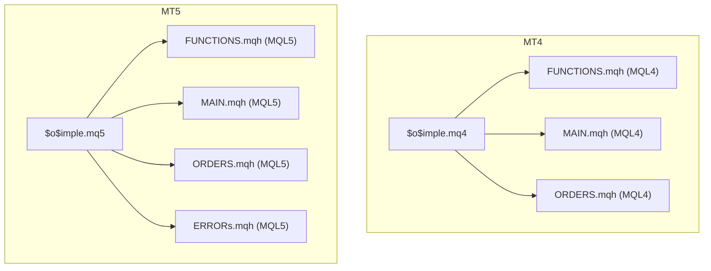
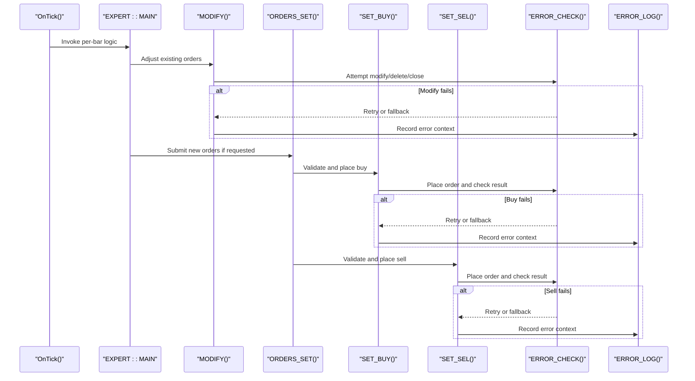
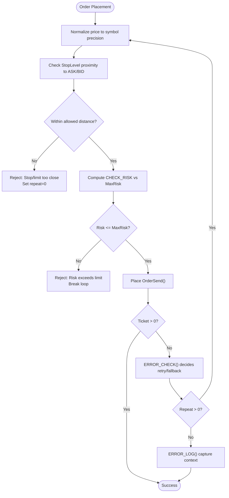
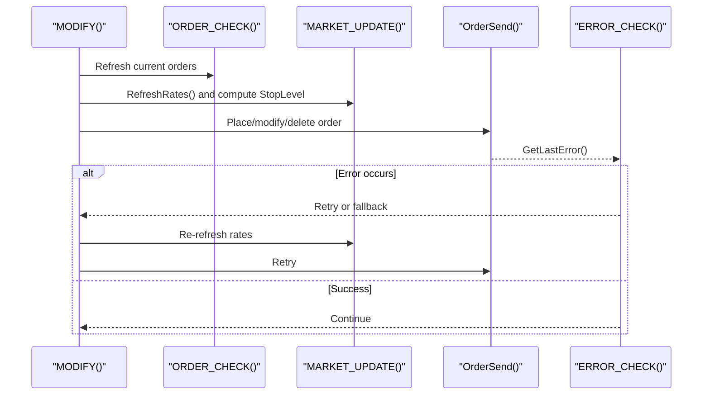
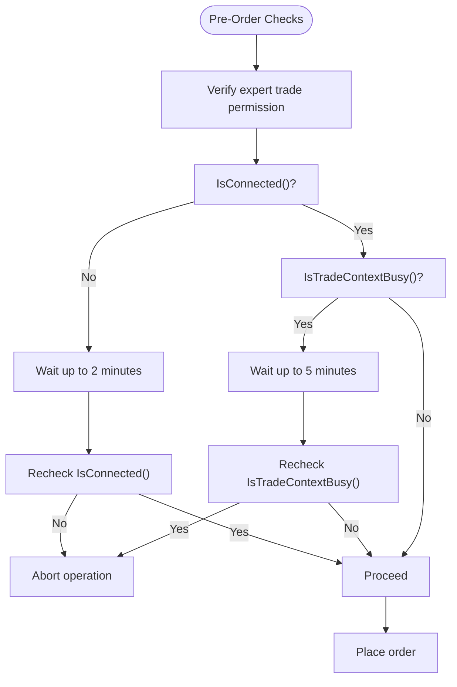
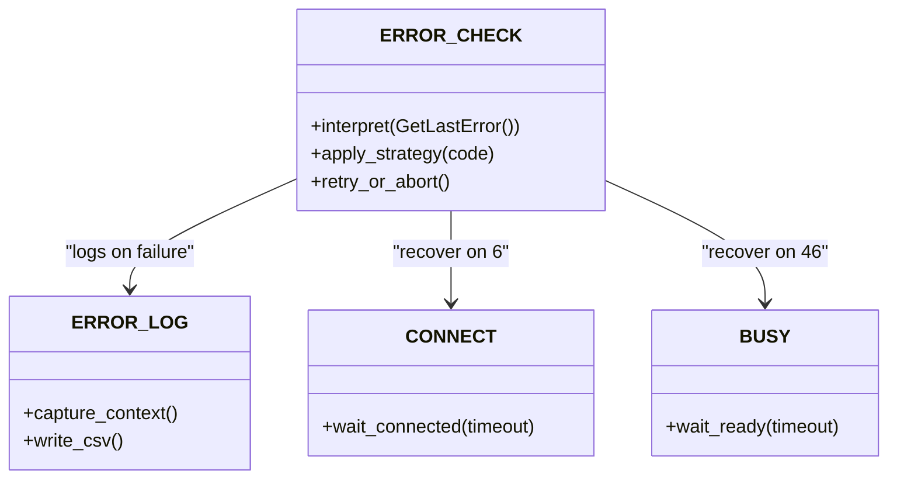
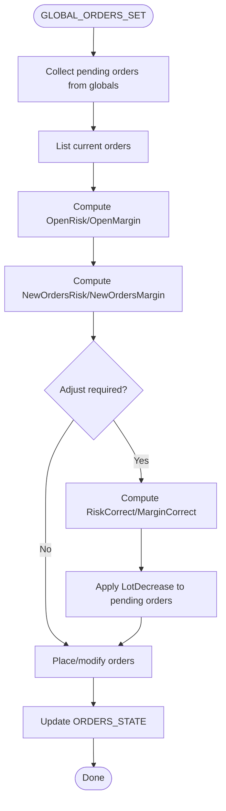
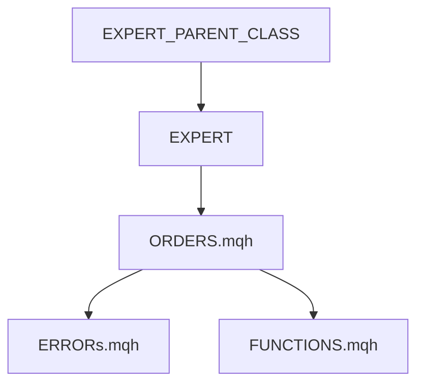

# Order Validation and Error Handling

<cite>
**Referenced Files in This Document**
- [$o$imple.mq4](file://MT/MQL4/Experts/$o$imple.mq4)
- [$o$imple.mq5](file://MT/MQL5/Experts/$o$imple.mq5)
- [ORDERS.mqh (MQL4)](file://MT/MQL4/Include/ORDERS.mqh)
- [ORDERS.mqh (MQL5)](file://MT/MQL5/Include/ORDERS.mqh)
- [ERRORs.mqh (MQL5)](file://MT/MQL5/Include/ERRORs.mqh)
- [FUNCTIONS.mqh (MQL4)](file://MT/MQL4/Include/FUNCTIONS.mqh)
- [FUNCTIONS.mqh (MQL5)](file://MT/MQL5/Include/FUNCTIONS.mqh)
- [MAIN.mqh (MQL4)](file://MT/MQL4/Include/MAIN.mqh)
- [MAIN.mqh (MQL5)](file://MT/MQL5/Include/MAIN.mqh)
</cite>

## Table of Contents
1. [Introduction](#introduction)
2. [Project Structure](#project-structure)
3. [Core Components](#core-components)
4. [Architecture Overview](#architecture-overview)
5. [Detailed Component Analysis](#detailed-component-analysis)
6. [Dependency Analysis](#dependency-analysis)
7. [Performance Considerations](#performance-considerations)
8. [Troubleshooting Guide](#troubleshooting-guide)
9. [Conclusion](#conclusion)

## Introduction
This document provides a comprehensive analysis of order validation and error handling mechanisms in the SoSimple expert advisor across MetaQuotes MT4 and MT5 platforms. It focuses on:
- Order validation procedures and market condition checks
- Trade permission verification and risk controls
- Error handling framework including MetaQuotes error codes, retry mechanisms, and fallback strategies
- Platform-specific differences between MT4 and MT5 environments
- Practical examples of common order validation failures, resolution procedures, and debugging techniques

## Project Structure
The SoSimple expert advisor is implemented as separate experts for MT4 and MT5, each delegating order lifecycle management to shared include libraries. The key modules involved in order validation and error handling are:
- Expert entry points: MT4 ($o$imple.mq4) and MT5 ($o$imple.mq5)
- Order lifecycle and validation: ORDERS.mqh (shared across platforms)
- Error handling and logging: ERRORs.mqh (MT5 include; MT4 uses a similar pattern via included headers)
- Core classes and trading logic: FUNCTIONS.mqh and MAIN.mqh (platform-specific includes)

**Diagram sources**
- [$o$imple.mq4:123-132](file://MT/MQL4/Experts/$o$imple.mq4#L123-L132)
- [$o$imple.mq5:137-147](file://MT/MQL5/Experts/$o$imple.mq5#L137-L147)
- [ORDERS.mqh (MQL4):5-13](file://MT/MQL4/Include/ORDERS.mqh#L5-L13)
- [ORDERS.mqh (MQL5):5-13](file://MT/MQL5/Include/ORDERS.mqh#L5-L13)
- [ERRORs.mqh (MQL5):1-152](file://MT/MQL5/Include/ERRORs.mqh#L1-L152)

**Section sources**
- [$o$imple.mq4:123-132](file://MT/MQL4/Experts/$o$imple.mq4#L123-L132)
- [$o$imple.mq5:137-147](file://MT/MQL5/Experts/$o$imple.mq5#L137-L147)

## Core Components
This section outlines the primary components responsible for order validation and error handling.

- Order lifecycle and validation:
  - SET_BUY/SET_SEL: Validates stop/limit proximity to market, normalizes prices, computes risk, and attempts order placement with retry logic.
  - MODIFY: Adjusts existing orders (modify/delete/close) with safety checks around expiration and market proximity.
  - ORDER_CHECK: Reads current open/pending orders into internal structures.
  - MARKET_UPDATE: Refreshes rates and computes StopLevel accounting for spread and stop level constraints.
  - GLOBAL_ORDERS_SET/CHECK_OUT: Centralized risk-aware order distribution across multiple experts with global variable coordination.

- Error handling and logging:
  - ERROR_CHECK: Interprets GetLastError() codes, applies platform-specific retry/fallback strategies, and logs errors.
  - ERROR_LOG: Writes detailed error context to CSV for post-mortem analysis.
  - CONNECT/BUSY: Handles connectivity and trade context busy scenarios with timeouts.

- Core classes and trading logic:
  - EXPERT_PARENT_CLASS: Provides shared infrastructure for experts, including backup/restore, external parameter handling, and order orchestration hooks.
  - EXPERT::MAIN: Orchestrates signal generation, time filtering, order modification, and new order submission.

**Section sources**
- [ORDERS.mqh (MQL4):14-61](file://MT/MQL4/Include/ORDERS.mqh#L14-L61)
- [ORDERS.mqh (MQL4):66-130](file://MT/MQL4/Include/ORDERS.mqh#L66-L130)
- [ORDERS.mqh (MQL4):143-156](file://MT/MQL4/Include/ORDERS.mqh#L143-L156)
- [ORDERS.mqh (MQL4):133-140](file://MT/MQL4/Include/ORDERS.mqh#L133-L140)
- [ORDERS.mqh (MQL4):184-322](file://MT/MQL4/Include/ORDERS.mqh#L184-L322)
- [ORDERS.mqh (MQL4):325-362](file://MT/MQL4/Include/ORDERS.mqh#L325-L362)
- [ERRORs.mqh (MQL5):11-63](file://MT/MQL5/Include/ERRORs.mqh#L11-L63)
- [ERRORs.mqh (MQL5):86-103](file://MT/MQL5/Include/ERRORs.mqh#L86-L103)
- [ERRORs.mqh (MQL5):66-84](file://MT/MQL5/Include/ERRORs.mqh#L66-L84)
- [FUNCTIONS.mqh (MQL4):115-202](file://MT/MQL4/Include/FUNCTIONS.mqh#L115-L202)
- [FUNCTIONS.mqh (MQL5):115-199](file://MT/MQL5/Include/FUNCTIONS.mqh#L115-L199)
- [MAIN.mqh (MQL4):117-143](file://MT/MQL4/Include/MAIN.mqh#L117-L143)
- [MAIN.mqh (MQL5):131-143](file://MT/MQL5/Include/MAIN.mqh#L131-L143)

## Architecture Overview
The order validation and error handling architecture follows a layered design:
- Expert entry points trigger per-bar processing.
- Signal generation and time filtering occur in MAIN.
- Order modification and new order submission are coordinated centrally.
- Risk-aware distribution ensures no single expert exceeds configured limits.
- Error handling intercepts platform errors and applies deterministic retries or fallbacks.

**Diagram sources**
- [MAIN.mqh (MQL4):117-143](file://MT/MQL4/Include/MAIN.mqh#L117-L143)
- [MAIN.mqh (MQL5):131-143](file://MT/MQL5/Include/MAIN.mqh#L131-L143)
- [ORDERS.mqh (MQL4):66-130](file://MT/MQL4/Include/ORDERS.mqh#L66-L130)
- [ORDERS.mqh (MQL4):14-61](file://MT/MQL4/Include/ORDERS.mqh#L14-L61)
- [ERRORs.mqh (MQL5):11-63](file://MT/MQL5/Include/ERRORs.mqh#L11-L63)
- [ERRORs.mqh (MQL5):86-103](file://MT/MQL5/Include/ERRORs.mqh#L86-L103)

## Detailed Component Analysis

### Order Validation Procedures
Order validation encompasses several checks to ensure safe and compliant order placement:
- Price proximity validation:
  - Stops/limits must respect StopLevel constraints relative to current ASK/BID.
  - Near-market orders are normalized to avoid rejection due to proximity thresholds.
- Risk assessment:
  - CHECK_RISK is invoked to compute potential risk percentage against account balance.
  - Orders are rejected if risk exceeds configured MaxRisk.
- Lot sizing and margin:
  - MM() determines appropriate lot sizes considering stop distances.
  - Free margin constraints are enforced to prevent over-leveraging.

**Diagram sources**
- [ORDERS.mqh (MQL4):18-35](file://MT/MQL4/Include/ORDERS.mqh#L18-L35)
- [ORDERS.mqh (MQL4):42-59](file://MT/MQL4/Include/ORDERS.mqh#L42-L59)
- [ORDERS.mqh (MQL4):22-34](file://MT/MQL4/Include/ORDERS.mqh#L22-L34)
- [ORDERS.mqh (MQL4):46-58](file://MT/MQL4/Include/ORDERS.mqh#L46-L58)
- [ORDERS.mqh (MQL4):25-26](file://MT/MQL4/Include/ORDERS.mqh#L25-L26)
- [ORDERS.mqh (MQL4):49-50](file://MT/MQL4/Include/ORDERS.mqh#L49-L50)
- [ERRORs.mqh (MQL5):11-63](file://MT/MQL5/Include/ERRORs.mqh#L11-L63)
- [ERRORs.mqh (MQL5):86-103](file://MT/MQL5/Include/ERRORs.mqh#L86-L103)

**Section sources**
- [ORDERS.mqh (MQL4):14-61](file://MT/MQL4/Include/ORDERS.mqh#L14-L61)
- [ORDERS.mqh (MQL4):38-61](file://MT/MQL4/Include/ORDERS.mqh#L38-L61)
- [ORDERS.mqh (MQL4):18-35](file://MT/MQL4/Include/ORDERS.mqh#L18-L35)
- [ORDERS.mqh (MQL4):42-59](file://MT/MQL4/Include/ORDERS.mqh#L42-L59)
- [ORDERS.mqh (MQL4):22-34](file://MT/MQL4/Include/ORDERS.mqh#L22-L34)
- [ORDERS.mqh (MQL4):46-58](file://MT/MQL4/Include/ORDERS.mqh#L46-L58)

### Market Condition Checks
Market conditions are continuously monitored to prevent invalid orders:
- RefreshRates() updates ASK/BID and related market info prior to order placement.
- StopLevel incorporates MODE_STOPLEVEL and MODE_SPREAD to reflect realistic execution constraints.
- Spread and point values are considered when validating stop/limit distances.

**Diagram sources**
- [ORDERS.mqh (MQL4):143-156](file://MT/MQL4/Include/ORDERS.mqh#L143-L156)
- [ORDERS.mqh (MQL4):133-140](file://MT/MQL4/Include/ORDERS.mqh#L133-L140)
- [ORDERS.mqh (MQL4):66-130](file://MT/MQL4/Include/ORDERS.mqh#L66-L130)
- [ERRORs.mqh (MQL5):11-63](file://MT/MQL5/Include/ERRORs.mqh#L11-L63)

**Section sources**
- [ORDERS.mqh (MQL4):133-140](file://MT/MQL4/Include/ORDERS.mqh#L133-L140)
- [ORDERS.mqh (MQL4):143-156](file://MT/MQL4/Include/ORDERS.mqh#L143-L156)
- [ORDERS.mqh (MQL4):66-130](file://MT/MQL4/Include/ORDERS.mqh#L66-L130)

### Trade Permission Verification
Trade permissions and environment readiness are verified before order operations:
- Expert permission: Certain error codes indicate trade permission issues and require enabling expert allowance.
- Trade context busy: IsTradeContextBusy() is polled with timeout to avoid contention.
- Connectivity: IsConnected() is checked with a bounded wait period to recover from disconnections.

**Diagram sources**
- [ERRORs.mqh (MQL5):66-84](file://MT/MQL5/Include/ERRORs.mqh#L66-L84)
- [ERRORs.mqh (MQL5):11-63](file://MT/MQL5/Include/ERRORs.mqh#L11-L63)

**Section sources**
- [ERRORs.mqh (MQL5):66-84](file://MT/MQL5/Include/ERRORs.mqh#L66-L84)
- [ERRORs.mqh (MQL5):11-63](file://MT/MQL5/Include/ERRORs.mqh#L11-L63)

### Error Handling Framework
The error handling framework interprets MetaQuotes error codes and applies deterministic strategies:
- Immediate pass-through for benign/no-op errors.
- Retry with delays for transient conditions (too frequent requests, server busy).
- Recovery actions for connectivity and context busy states.
- Logging of detailed context for persistent issues.

Key behaviors:
- ERR_NOT_ENOUGH_MONEY during optimization is ignored to avoid false positives.
- Errors 128, 142, 143, 144 are treated as temporary and retried after ORDER_CHECK().
- Errors 134 (insufficient funds) prompt lot reduction rather than immediate retry.
- Errors 130 and 129 trigger rate refresh and revalidation.

**Diagram sources**
- [ERRORs.mqh (MQL5):11-63](file://MT/MQL5/Include/ERRORs.mqh#L11-L63)
- [ERRORs.mqh (MQL5):66-84](file://MT/MQL5/Include/ERRORs.mqh#L66-L84)
- [ERRORs.mqh (MQL5):86-103](file://MT/MQL5/Include/ERRORs.mqh#L86-L103)

**Section sources**
- [ERRORs.mqh (MQL5):11-63](file://MT/MQL5/Include/ERRORs.mqh#L11-L63)
- [ERRORs.mqh (MQL5):66-84](file://MT/MQL5/Include/ERRORs.mqh#L66-L84)
- [ERRORs.mqh (MQL5):86-103](file://MT/MQL5/Include/ERRORs.mqh#L86-L103)

### Risk-Aware Order Distribution
GLOBAL_ORDERS_SET coordinates order placement across multiple experts:
- Collects pending orders from all experts via global variables.
- Computes total risk/margin exposure and applies corrective factors.
- Reduces lots when either risk or margin thresholds are exceeded.
- Skips modifications when orders expire soon to avoid rejection.

**Diagram sources**
- [ORDERS.mqh (MQL4):184-322](file://MT/MQL4/Include/ORDERS.mqh#L184-L322)
- [ORDERS.mqh (MQL5):184-322](file://MT/MQL5/Include/ORDERS.mqh#L184-L322)

**Section sources**
- [ORDERS.mqh (MQL4):184-322](file://MT/MQL4/Include/ORDERS.mqh#L184-L322)
- [ORDERS.mqh (MQL5):184-322](file://MT/MQL5/Include/ORDERS.mqh#L184-L322)

### Platform-Specific Differences (MT4 vs MT5)
- Error handling include:
  - MT5: Dedicated ERRORs.mqh provides centralized error interpretation and logging.
  - MT4: Error handling is integrated via included headers and similar logic patterns.
- Trade context:
  - MT5: Enhanced trade context busy detection and explicit trade permission checks.
- Order types and constants:
  - Both platforms share core order type constants and validation logic.
- Global variable synchronization:
  - Both platforms use global variables for inter-expert coordination during order distribution.

**Section sources**
- [ERRORs.mqh (MQL5):1-152](file://MT/MQL5/Include/ERRORs.mqh#L1-L152)
- [MAIN.mqh (MQL4):117-143](file://MT/MQL4/Include/MAIN.mqh#L117-L143)
- [MAIN.mqh (MQL5):131-143](file://MT/MQL5/Include/MAIN.mqh#L131-L143)

## Dependency Analysis
The order validation and error handling subsystems depend on:
- Core classes: EXPERT_PARENT_CLASS provides shared infrastructure for parameter handling, backup/restore, and order orchestration.
- Order lifecycle: ORDERS.mqh encapsulates all order operations and integrates with error handling.
- Error handling: ERRORs.mqh centralizes error interpretation and recovery strategies.
- Market data: MARKET_UPDATE depends on platform market info APIs to enforce StopLevel and spread constraints.

**Diagram sources**
- [FUNCTIONS.mqh (MQL4):115-202](file://MT/MQL4/Include/FUNCTIONS.mqh#L115-L202)
- [FUNCTIONS.mqh (MQL5):115-199](file://MT/MQL5/Include/FUNCTIONS.mqh#L115-L199)
- [ORDERS.mqh (MQL4):5-13](file://MT/MQL4/Include/ORDERS.mqh#L5-L13)
- [ORDERS.mqh (MQL5):5-13](file://MT/MQL5/Include/ORDERS.mqh#L5-L13)
- [ERRORs.mqh (MQL5):1-152](file://MT/MQL5/Include/ERRORs.mqh#L1-L152)

**Section sources**
- [FUNCTIONS.mqh (MQL4):115-202](file://MT/MQL4/Include/FUNCTIONS.mqh#L115-L202)
- [FUNCTIONS.mqh (MQL5):115-199](file://MT/MQL5/Include/FUNCTIONS.mqh#L115-L199)
- [ORDERS.mqh (MQL4):5-13](file://MT/MQL4/Include/ORDERS.mqh#L5-L13)
- [ORDERS.mqh (MQL5):5-13](file://MT/MQL5/Include/ORDERS.mqh#L5-L13)
- [ERRORs.mqh (MQL5):1-152](file://MT/MQL5/Include/ERRORs.mqh#L1-L152)

## Performance Considerations
- Retry loops: Limited retry counts (e.g., 3) prevent excessive CPU usage while allowing transient failures to resolve.
- Rate refresh: RefreshRates() is called strategically to minimize unnecessary calls and improve accuracy.
- Global coordination: Global variable-based order distribution reduces redundant submissions but requires careful locking to avoid contention.
- Risk computation: CHECK_RISK and margin calculations are performed before placement to avoid repeated failures.

## Troubleshooting Guide
Common order validation failures and resolutions:
- Stop/limit too close to market:
  - Symptom: Immediate rejection with proximity violations.
  - Resolution: Normalize price to ASK/BID and ensure StopLevel distance is respected.
  - Reference: [ORDERS.mqh (MQL4):18-35](file://MT/MQL4/Include/ORDERS.mqh#L18-L35), [ORDERS.mqh (MQL4):42-59](file://MT/MQL4/Include/ORDERS.mqh#L42-L59)

- Insufficient funds:
  - Symptom: Error 134 indicating insufficient money.
  - Resolution: Reduce lot size using MM() and CHECK_RISK feedback; avoid retrying with same parameters.
  - Reference: [ERRORs.mqh (MQL5):34-40](file://MT/MQL5/Include/ERRORs.mqh#L34-L40)

- Too frequent requests:
  - Symptom: Error 8 indicating too frequent requests.
  - Resolution: Add delay and retry; reduce polling frequency.
  - Reference: [ERRORs.mqh (MQL5):27-27](file://MT/MQL5/Include/ERRORs.mqh#L27-L27)

- Market closed or trade disabled:
  - Symptom: Errors 132, 133 indicating market closed or trade disabled.
  - Resolution: Retry later; ensure expert permissions are enabled.
  - Reference: [ERRORs.mqh (MQL5):32-33](file://MT/MQL5/Include/ERRORs.mqh#L32-L33), [ERRORs.mqh (MQL5):38-39](file://MT/MQL5/Include/ERRORs.mqh#L38-L39)

- Connectivity issues:
  - Symptom: Error 6 indicating no connection.
  - Resolution: Use CONNECT() with bounded wait; ensure network stability.
  - Reference: [ERRORs.mqh (MQL5):25-25](file://MT/MQL5/Include/ERRORs.mqh#L25-L25), [ERRORs.mqh (MQL5):66-74](file://MT/MQL5/Include/ERRORs.mqh#L66-L74)

- Trade context busy:
  - Symptom: Error 46 indicating trade context busy.
  - Resolution: Use BUSY() with timeout; avoid concurrent order operations.
  - Reference: [ERRORs.mqh (MQL5):46-46](file://MT/MQL5/Include/ERRORs.mqh#L46-L46), [ERRORs.mqh (MQL5):76-84](file://MT/MQL5/Include/ERRORs.mqh#L76-L84)

Debugging techniques:
- Enable detailed logging via ERROR_LOG to capture Ask/Bid/StopLevel, spread, lot/ticket, and order parameters.
- Monitor ORDERS_STATE changes to detect unexpected order modifications or expirations.
- Validate StopLevel calculations incorporating MODE_STOPLEVEL and MODE_SPREAD.
- Use ORDER_CHECK() after retries to reconcile actual order state.

**Section sources**
- [ORDERS.mqh (MQL4):18-35](file://MT/MQL4/Include/ORDERS.mqh#L18-L35)
- [ORDERS.mqh (MQL4):42-59](file://MT/MQL4/Include/ORDERS.mqh#L42-L59)
- [ERRORs.mqh (MQL5):34-40](file://MT/MQL5/Include/ERRORs.mqh#L34-L40)
- [ERRORs.mqh (MQL5):27-27](file://MT/MQL5/Include/ERRORs.mqh#L27-L27)
- [ERRORs.mqh (MQL5):32-33](file://MT/MQL5/Include/ERRORs.mqh#L32-L33)
- [ERRORs.mqh (MQL5):38-39](file://MT/MQL5/Include/ERRORs.mqh#L38-L39)
- [ERRORs.mqh (MQL5):25-25](file://MT/MQL5/Include/ERRORs.mqh#L25-L25)
- [ERRORs.mqh (MQL5):66-74](file://MT/MQL5/Include/ERRORs.mqh#L66-L74)
- [ERRORs.mqh (MQL5):46-46](file://MT/MQL5/Include/ERRORs.mqh#L46-L46)
- [ERRORs.mqh (MQL5):76-84](file://MT/MQL5/Include/ERRORs.mqh#L76-L84)
- [ORDERS.mqh (MQL4):143-156](file://MT/MQL4/Include/ORDERS.mqh#L143-L156)
- [ORDERS.mqh (MQL4):133-140](file://MT/MQL4/Include/ORDERS.mqh#L133-L140)
- [ORDERS.mqh (MQL4):325-362](file://MT/MQL4/Include/ORDERS.mqh#L325-L362)

## Conclusion
The SoSimple expert advisor implements robust order validation and error handling across MT4 and MT5 platforms. Key strengths include:
- Comprehensive pre-placement validation of stops/limits and risk exposure
- Centralized error interpretation with deterministic retry and fallback strategies
- Risk-aware order distribution across multiple experts
- Platform-specific enhancements in MT5 for connectivity and trade context handling

By following the documented validation procedures, leveraging the error handling framework, and applying the troubleshooting techniques, operators can achieve reliable order execution and maintain system stability under varying market conditions.