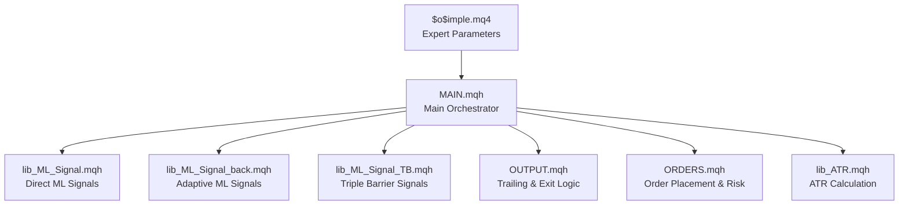
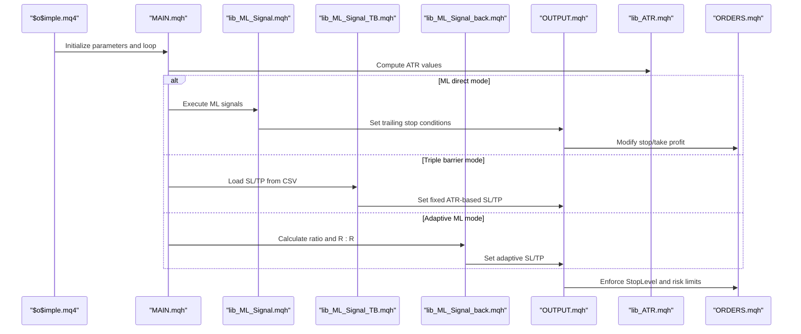
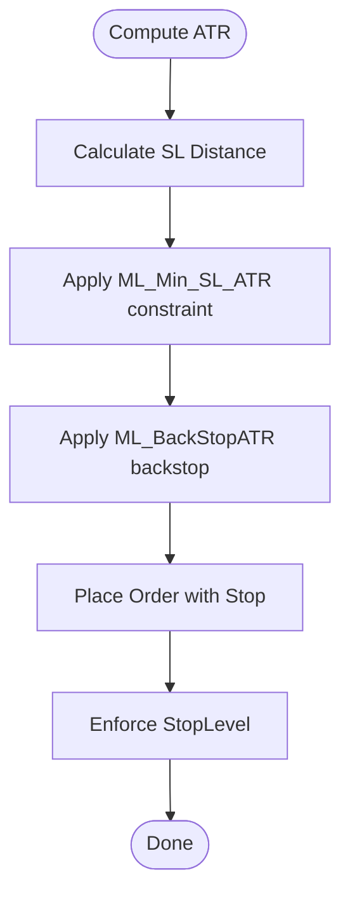
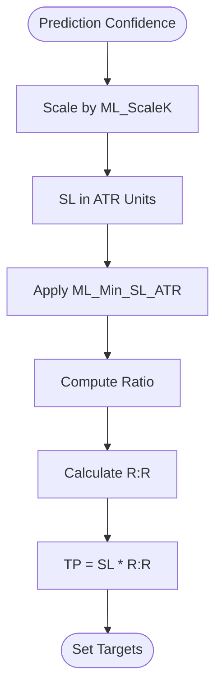
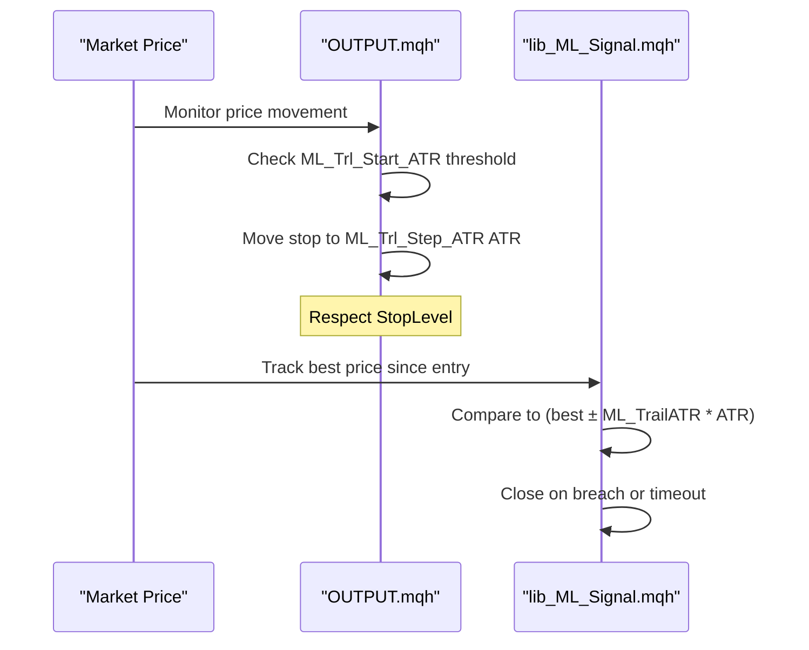
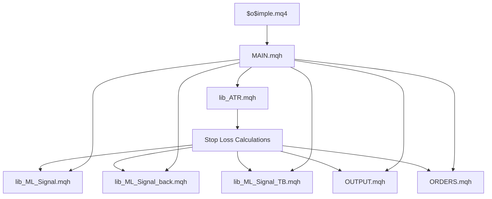

# Stop Loss and Take Profit Management

<cite>
**Referenced Files in This Document**
- [$o$imple.mq4](file://MT/MQL4/Experts/$o$imple.mq4)
- [lib_ML_Signal.mqh](file://MT/MQL4/Include/lib_ML_Signal.mqh)
- [lib_ML_Signal_back.mqh](file://MT/MQL4/Include/lib_ML_Signal_back.mqh)
- [lib_ML_Signal_TB.mqh](file://MT/MQL4/Include/lib_ML_Signal_TB.mqh)
- [OUTPUT.mqh](file://MT/MQL4/Include/OUTPUT.mqh)
- [lib_ATR.mqh](file://MT/MQL4/Include/lib_ATR.mqh)
- [MAIN.mqh](file://MT/MQL4/Include/MAIN.mqh)
- [ORDERS.mqh](file://MT/MQL4/Include/ORDERS.mqh)
</cite>

## Table of Contents
1. [Introduction](#introduction)
2. [Project Structure](#project-structure)
3. [Core Components](#core-components)
4. [Architecture Overview](#architecture-overview)
5. [Detailed Component Analysis](#detailed-component-analysis)
6. [Dependency Analysis](#dependency-analysis)
7. [Performance Considerations](#performance-considerations)
8. [Troubleshooting Guide](#troubleshooting-guide)
9. [Conclusion](#conclusion)

## Introduction
This document provides comprehensive coverage of the stop loss and take profit management functionality in the SoSimple expert advisor. It focuses on ATR-based stop loss calculation methods, fixed pip distance stops, dynamic profit target setting, machine learning prediction integration for intelligent stop placement, trailing stop implementation, and partial profit taking strategies. It also details the ML_ScaleK parameter usage for converting prediction confidence to ATR-based stops, minimum stop loss requirements, maximum profit target limitations, practical stop loss scenarios, trailing stop activation logic, troubleshooting guidance, and platform-specific configuration differences.

## Project Structure
The stop loss and take profit logic spans several key files:
- Expert definition and parameters: [$o$imple.mq4](file://MT/MQL4/Experts/$o$imple.mq4)
- Machine learning signal execution and stop management: [lib_ML_Signal.mqh](file://MT/MQL4/Include/lib_ML_Signal.mqh), [lib_ML_Signal_back.mqh](file://MT/MQL4/Include/lib_ML_Signal_back.mqh), [lib_ML_Signal_TB.mqh](file://MT/MQL4/Include/lib_ML_Signal_TB.mqh)
- Output and trailing stop logic: [OUTPUT.mqh](file://MT/MQL4/Include/OUTPUT.mqh)
- ATR calculation: [lib_ATR.mqh](file://MT/MQL4/Include/lib_ATR.mqh)
- Main expert orchestration: [MAIN.mqh](file://MT/MQL4/Include/MAIN.mqh)
- Order placement and risk checks: [ORDERS.mqh](file://MT/MQL4/Include/ORDERS.mqh)

**Diagram sources**
- [$o$imple.mq4:1-149](file://MT/MQL4/Experts/$o$imple.mq4#L1-L149)
- [MAIN.mqh:117-143](file://MT/MQL4/Include/MAIN.mqh#L117-L143)
- [lib_ML_Signal.mqh:603-923](file://MT/MQL4/Include/lib_ML_Signal.mqh#L603-L923)
- [lib_ML_Signal_back.mqh:161-299](file://MT/MQL4/Include/lib_ML_Signal_back.mqh#L161-L299)
- [lib_ML_Signal_TB.mqh:118-200](file://MT/MQL4/Include/lib_ML_Signal_TB.mqh#L118-L200)
- [OUTPUT.mqh:6-62](file://MT/MQL4/Include/OUTPUT.mqh#L6-L62)
- [ORDERS.mqh:5-61](file://MT/MQL4/Include/ORDERS.mqh#L5-L61)
- [lib_ATR.mqh:2-47](file://MT/MQL4/Include/lib_ATR.mqh#L2-L47)

**Section sources**
- [$o$imple.mq4:1-149](file://MT/MQL4/Experts/$o$imple.mq4#L1-L149)
- [MAIN.mqh:117-143](file://MT/MQL4/Include/MAIN.mqh#L117-L143)

## Core Components
This section outlines the primary stop loss and take profit mechanisms implemented in the SoSimple expert advisor.

- ATR-based stop loss calculation
  - Uses ATR values computed via [lib_ATR.mqh:2-47](file://MT/MQL4/Include/lib_ATR.mqh#L2-L47) to derive stop distances.
  - Minimum stop loss enforced as ATR multiplied by ML_Min_SL_ATR parameter.
  - Backstop protection uses ML_BackStopATR to ensure reasonable initial stop placement.

- Dynamic profit targets
  - Adaptive profit targets derived from prediction confidence ratios in ML modes.
  - Triple barrier mode uses fixed SL/TP in ATR units from CSV predictions.
  - Direct ML mode supports optional take profit in ATR units via ML_TakeProfitATR.

- Machine learning integration
  - ML_ScaleK converts prediction confidence to ATR-based stops.
  - Ratio-based R:R scaling adapts profit targets dynamically.
  - Score filtering can exclude weak predictions for stop placement.

- Trailing stops
  - Two modes: traditional trailing stop and parity-check trailing stop.
  - Activation thresholds and step sizes configurable in ATR units.

- Fixed pip distance stops
  - Traditional stop placement using Atr.Lim and configured parameters.
  - Platform-specific StopLevel enforcement prevents overly tight stops.

**Section sources**
- [lib_ML_Signal.mqh:306-387](file://MT/MQL4/Include/lib_ML_Signal.mqh#L306-L387)
- [lib_ML_Signal_back.mqh:245-299](file://MT/MQL4/Include/lib_ML_Signal_back.mqh#L245-L299)
- [lib_ML_Signal_TB.mqh:147-192](file://MT/MQL4/Include/lib_ML_Signal_TB.mqh#L147-L192)
- [OUTPUT.mqh:24-58](file://MT/MQL4/Include/OUTPUT.mqh#L24-L58)
- [lib_ATR.mqh:39-46](file://MT/MQL4/Include/lib_ATR.mqh#L39-L46)
- [ORDERS.mqh:18-20](file://MT/MQL4/Include/ORDERS.mqh#L18-L20)

## Architecture Overview
The stop loss and take profit architecture integrates ML signals, ATR computation, and trailing stop logic across multiple modules.

**Diagram sources**
- [MAIN.mqh:117-143](file://MT/MQL4/Include/MAIN.mqh#L117-L143)
- [lib_ML_Signal.mqh:603-923](file://MT/MQL4/Include/lib_ML_Signal.mqh#L603-L923)
- [lib_ML_Signal_TB.mqh:118-200](file://MT/MQL4/Include/lib_ML_Signal_TB.mqh#L118-L200)
- [lib_ML_Signal_back.mqh:161-299](file://MT/MQL4/Include/lib_ML_Signal_back.mqh#L161-L299)
- [OUTPUT.mqh:6-62](file://MT/MQL4/Include/OUTPUT.mqh#L6-L62)
- [lib_ATR.mqh:2-47](file://MT/MQL4/Include/lib_ATR.mqh#L2-L47)
- [ORDERS.mqh:18-20](file://MT/MQL4/Include/ORDERS.mqh#L18-L20)

## Detailed Component Analysis

### ATR-Based Stop Loss Calculation Methods
The expert computes ATR using [lib_ATR.mqh:2-47](file://MT/MQL4/Include/lib_ATR.mqh#L2-L47) and derives stop distances in two primary ways:

- Minimum stop enforcement
  - Ensures stops are at least ATR * ML_Min_SL_ATR to avoid overly tight placements.
  - Implemented in both direct ML mode ([lib_ML_Signal.mqh:310-311](file://MT/MQL4/Include/lib_ML_Signal.mqh#L310-L311)) and adaptive ML mode ([lib_ML_Signal_back.mqh:252-252](file://MT/MQL4/Include/lib_ML_Signal_back.mqh#L252-L252)).

- Backstop protection
  - Initial stops use max(ML_BackStopATR * ATR, 2 * StopLevel) to prevent unrealistic stop distances.
  - Applied during order placement in direct ML mode ([lib_ML_Signal.mqh:311-323](file://MT/MQL4/Include/lib_ML_Signal.mqh#L311-L323)).

- Traditional ATR-based stops
  - Stops can be set using Atr.Lim (ATR percentage) for fixed pip distance logic.
  - StopLevel enforcement ensures minimum distance from entry price ([ORDERS.mqh:18-20](file://MT/MQL4/Include/ORDERS.mqh#L18-L20)).

**Diagram sources**
- [lib_ATR.mqh:2-47](file://MT/MQL4/Include/lib_ATR.mqh#L2-L47)
- [lib_ML_Signal.mqh:310-323](file://MT/MQL4/Include/lib_ML_Signal.mqh#L310-L323)
- [lib_ML_Signal_back.mqh:252-252](file://MT/MQL4/Include/lib_ML_Signal_back.mqh#L252-L252)
- [ORDERS.mqh:18-20](file://MT/MQL4/Include/ORDERS.mqh#L18-L20)

**Section sources**
- [lib_ATR.mqh:2-47](file://MT/MQL4/Include/lib_ATR.mqh#L2-L47)
- [lib_ML_Signal.mqh:310-323](file://MT/MQL4/Include/lib_ML_Signal.mqh#L310-L323)
- [lib_ML_Signal_back.mqh:252-252](file://MT/MQL4/Include/lib_ML_Signal_back.mqh#L252-L252)
- [ORDERS.mqh:18-20](file://MT/MQL4/Include/ORDERS.mqh#L18-L20)

### Fixed Pip Distance Stops
Fixed pip distance stops rely on Atr.Lim and StopLevel constraints:

- Atr.Lim derived from ATR and configured percentage (PicVal).
- StopLevel enforces minimum distance from entry price to prevent rejections.
- Traditional stops use Atr.Lim for fixed pip distance logic in output routines ([OUTPUT.mqh:16-17](file://MT/MQL4/Include/OUTPUT.mqh#L16-L17)).

Practical considerations:
- Ensure StopLevel is respected to avoid order rejections.
- Use Atr.Lim for consistent pip-based stop distances across instruments.

**Section sources**
- [lib_ATR.mqh:45-46](file://MT/MQL4/Include/lib_ATR.mqh#L45-L46)
- [OUTPUT.mqh:16-17](file://MT/MQL4/Include/OUTPUT.mqh#L16-L17)
- [ORDERS.mqh:18-20](file://MT/MQL4/Include/ORDERS.mqh#L18-L20)

### Dynamic Profit Target Setting
Dynamic profit targets adapt to prediction confidence and market volatility:

- Adaptive ML mode (lib_ML_Signal_back.mqh)
  - SL calculated as max(prediction_confidence * ML_ScaleK * ATR, ATR * ML_Min_SL_ATR).
  - TP derived as SL * R:R, where R:R is computed from ratio using ML_CalcRR with configurable modes.
  - Example path: [lib_ML_Signal_back.mqh:252-253](file://MT/MQL4/Include/lib_ML_Signal_back.mqh#L252-L253), [lib_ML_Signal_back.mqh:256-258](file://MT/MQL4/Include/lib_ML_Signal_back.mqh#L256-L258).

- Triple barrier mode (lib_ML_Signal_TB.mqh)
  - SL and TP provided in ATR units from CSV; converted to absolute prices using ATR.
  - Example path: [lib_ML_Signal_TB.mqh:148-149](file://MT/MQL4/Include/lib_ML_Signal_TB.mqh#L148-L149), [lib_ML_Signal_TB.mqh:159-160](file://MT/MQL4/Include/lib_ML_Signal_TB.mqh#L159-L160).

- Direct ML mode (lib_ML_Signal.mqh)
  - Optional take profit in ATR units via ML_TakeProfitATR.
  - Example path: [lib_ML_Signal.mqh:888-889](file://MT/MQL4/Include/lib_ML_Signal.mqh#L888-L889), [lib_ML_Signal.mqh:913-914](file://MT/MQL4/Include/lib_ML_Signal.mqh#L913-L914).

**Diagram sources**
- [lib_ML_Signal_back.mqh:252-253](file://MT/MQL4/Include/lib_ML_Signal_back.mqh#L252-L253)
- [lib_ML_Signal_back.mqh:256-258](file://MT/MQL4/Include/lib_ML_Signal_back.mqh#L256-L258)
- [lib_ML_Signal_TB.mqh:148-160](file://MT/MQL4/Include/lib_ML_Signal_TB.mqh#L148-L160)
- [lib_ML_Signal.mqh:888-889](file://MT/MQL4/Include/lib_ML_Signal.mqh#L888-L889)

**Section sources**
- [lib_ML_Signal_back.mqh:245-299](file://MT/MQL4/Include/lib_ML_Signal_back.mqh#L245-L299)
- [lib_ML_Signal_TB.mqh:147-192](file://MT/MQL4/Include/lib_ML_Signal_TB.mqh#L147-L192)
- [lib_ML_Signal.mqh:888-922](file://MT/MQL4/Include/lib_ML_Signal.mqh#L888-L922)

### Machine Learning Prediction Integration for Intelligent Stop Placement
ML_ScaleK bridges prediction confidence and stop placement:

- ML_ScaleK parameter converts normalized prediction confidence to ATR-based stop distances.
- Minimum stop enforcement ensures stops meet ML_Min_SL_ATR threshold.
- Score filtering can exclude weak predictions for safer stop placement.

Key implementation points:
- Adaptive mode: [lib_ML_Signal_back.mqh:252-252](file://MT/MQL4/Include/lib_ML_Signal_back.mqh#L252-L252)
- Direct mode: [lib_ML_Signal.mqh:874-875](file://MT/MQL4/Include/lib_ML_Signal.mqh#L874-L875), [lib_ML_Signal.mqh:900-901](file://MT/MQL4/Include/lib_ML_Signal.mqh#L900-L901)
- Score filtering: [lib_ML_Signal.mqh:76-79](file://MT/MQL4/Include/lib_ML_Signal.mqh#L76-L79)

**Section sources**
- [lib_ML_Signal_back.mqh:252-252](file://MT/MQL4/Include/lib_ML_Signal_back.mqh#L252-L252)
- [lib_ML_Signal.mqh:76-79](file://MT/MQL4/Include/lib_ML_Signal.mqh#L76-L79)
- [lib_ML_Signal.mqh:874-901](file://MT/MQL4/Include/lib_ML_Signal.mqh#L874-L901)

### Trailing Stop Implementation
Two trailing stop modes are supported:

- Traditional trailing stop (OUTPUT.mqh)
  - Activates when price moves ML_Trl_Start_ATR ATRs away from entry.
  - Moves stop to BID - ML_Trl_Step_ATR * ATR for buys, ASK + ML_Trl_Step_ATR * ATR for sells.
  - Respects StopLevel to prevent rejections.

- Parity-check trailing stop (lib_ML_Signal.mqh)
  - Tracks best price since entry and exits when price crosses best - ML_TrailATR * ATR (buys) or best + ML_TrailATR * ATR (sells).
  - Supports timeout-based exits when holding bars exceed ML_HoldBars.

**Diagram sources**
- [OUTPUT.mqh:24-58](file://MT/MQL4/Include/OUTPUT.mqh#L24-L58)
- [lib_ML_Signal.mqh:287-298](file://MT/MQL4/Include/lib_ML_Signal.mqh#L287-L298)
- [lib_ML_Signal.mqh:283-286](file://MT/MQL4/Include/lib_ML_Signal.mqh#L283-L286)

**Section sources**
- [OUTPUT.mqh:24-58](file://MT/MQL4/Include/OUTPUT.mqh#L24-L58)
- [lib_ML_Signal.mqh:276-303](file://MT/MQL4/Include/lib_ML_Signal.mqh#L276-L303)

### Partial Profit Taking Strategies
Partial profit taking is integrated into the trailing stop logic:

- Traditional trailing stop adjusts stops as price moves favorably, effectively locking in profits incrementally.
- Parity-check mode can be combined with take profit targets for hybrid approaches.
- Risk management ensures StopLevel constraints remain satisfied during modifications.

**Section sources**
- [OUTPUT.mqh:24-58](file://MT/MQL4/Include/OUTPUT.mqh#L24-L58)
- [lib_ML_Signal.mqh:287-298](file://MT/MQL4/Include/lib_ML_Signal.mqh#L287-L298)

### Practical Stop Loss Scenarios
Below are practical scenarios with concrete parameter references:

- Scenario A: Adaptive ML mode with strong confidence
  - SL = max(dn_12 * ML_ScaleK * ATR, ATR * ML_Min_SL_ATR)
  - TP = SL * R:R(ratio_up)
  - References: [lib_ML_Signal_back.mqh:252-253](file://MT/MQL4/Include/lib_ML_Signal_back.mqh#L252-L253), [lib_ML_Signal_back.mqh:256-258](file://MT/MQL4/Include/lib_ML_Signal_back.mqh#L256-L258)

- Scenario B: Triple barrier mode with fixed SL/TP
  - SL = SL_ATR * ATR, TP = TP_ATR * ATR
  - References: [lib_ML_Signal_TB.mqh:148-149](file://MT/MQL4/Include/lib_ML_Signal_TB.mqh#L148-L149), [lib_ML_Signal_TB.mqh:159-160](file://MT/MQL4/Include/lib_ML_Signal_TB.mqh#L159-L160)

- Scenario C: Direct ML mode with backstop and optional TP
  - Initial stop = max(ML_BackStopATR * ATR, 2 * StopLevel)
  - Optional TP = entry ± ML_TakeProfitATR * ATR
  - References: [lib_ML_Signal.mqh:311-323](file://MT/MQL4/Include/lib_ML_Signal.mqh#L311-L323), [lib_ML_Signal.mqh:888-889](file://MT/MQL4/Include/lib_ML_Signal.mqh#L888-L889)

- Scenario D: Traditional fixed pip stop
  - Stop = entry ± Atr.Lim (with StopLevel enforcement)
  - References: [lib_ATR.mqh:45-46](file://MT/MQL4/Include/lib_ATR.mqh#L45-L46), [ORDERS.mqh:18-20](file://MT/MQL4/Include/ORDERS.mqh#L18-L20)

**Section sources**
- [lib_ML_Signal_back.mqh:252-258](file://MT/MQL4/Include/lib_ML_Signal_back.mqh#L252-L258)
- [lib_ML_Signal_TB.mqh:148-160](file://MT/MQL4/Include/lib_ML_Signal_TB.mqh#L148-L160)
- [lib_ML_Signal.mqh:311-323](file://MT/MQL4/Include/lib_ML_Signal.mqh#L311-L323)
- [lib_ML_Signal.mqh:888-889](file://MT/MQL4/Include/lib_ML_Signal.mqh#L888-L889)
- [lib_ATR.mqh:45-46](file://MT/MQL4/Include/lib_ATR.mqh#L45-L46)
- [ORDERS.mqh:18-20](file://MT/MQL4/Include/ORDERS.mqh#L18-L20)

### Trailing Stop Activation Logic
Activation thresholds and step sizes are configurable in ATR units:

- Traditional trailing stop
  - Activation: price moves ML_Trl_Start_ATR ATRs from entry
  - Step: move stop ML_Trl_Step_ATR ATRs from current price
  - References: [OUTPUT.mqh:24-58](file://MT/MQL4/Include/OUTPUT.mqh#L24-L58)

- Parity-check trailing stop
  - Activation: best price tracked since entry breaches (entry ± ML_TrailATR * ATR)
  - References: [lib_ML_Signal.mqh:287-298](file://MT/MQL4/Include/lib_ML_Signal.mqh#L287-L298)

**Section sources**
- [OUTPUT.mqh:24-58](file://MT/MQL4/Include/OUTPUT.mqh#L24-L58)
- [lib_ML_Signal.mqh:287-298](file://MT/MQL4/Include/lib_ML_Signal.mqh#L287-L298)

### Troubleshooting Stop Loss Related Issues
Common issues and resolutions:

- Stop too close to entry (StopLevel violation)
  - Cause: Atr.Lim or configured stops violate StopLevel.
  - Resolution: Increase stop distance or adjust ATR parameters; ensure StopLevel enforcement is applied.
  - Reference: [ORDERS.mqh:18-20](file://MT/MQL4/Include/ORDERS.mqh#L18-L20)

- Orders rejected due to tight stops
  - Cause: Stop distance below broker minimum.
  - Resolution: Use ML_BackStopATR backstop and ML_Min_SL_ATR constraints.
  - References: [lib_ML_Signal.mqh:311-311](file://MT/MQL4/Include/lib_ML_Signal.mqh#L311-L311), [lib_ML_Signal_back.mqh:252-252](file://MT/MQL4/Include/lib_ML_Signal_back.mqh#L252-L252)

- Trailing stop not activating
  - Cause: Insufficient price movement relative to ML_Trl_Start_ATR.
  - Resolution: Reduce ML_Trl_Start_ATR or increase ML_Trl_Step_ATR.
  - Reference: [OUTPUT.mqh:24-58](file://MT/MQL4/Include/OUTPUT.mqh#L24-L58)

- Parity-check trailing stop closing prematurely
  - Cause: Best price tracking too aggressively.
  - Resolution: Adjust ML_TrailATR or enable timeout-based exits via ML_HoldBars.
  - Reference: [lib_ML_Signal.mqh:287-298](file://MT/MQL4/Include/lib_ML_Signal.mqh#L287-L298)

**Section sources**
- [ORDERS.mqh:18-20](file://MT/MQL4/Include/ORDERS.mqh#L18-L20)
- [lib_ML_Signal.mqh:311-311](file://MT/MQL4/Include/lib_ML_Signal.mqh#L311-L311)
- [lib_ML_Signal_back.mqh:252-252](file://MT/MQL4/Include/lib_ML_Signal_back.mqh#L252-L252)
- [OUTPUT.mqh:24-58](file://MT/MQL4/Include/OUTPUT.mqh#L24-L58)
- [lib_ML_Signal.mqh:287-298](file://MT/MQL4/Include/lib_ML_Signal.mqh#L287-L298)

### Platform-Specific Stop Loss Configuration Differences
- StopLevel enforcement
  - Both buy and sell stops must respect StopLevel; otherwise orders are rejected.
  - Reference: [ORDERS.mqh:18-20](file://MT/MQL4/Include/ORDERS.mqh#L18-L20)

- Backstop protection
  - ML_BackStopATR ensures initial stops are reasonable regardless of broker constraints.
  - Reference: [lib_ML_Signal.mqh:311-311](file://MT/MQL4/Include/lib_ML_Signal.mqh#L311-L311)

- Minimum stop loss requirements
  - ML_Min_SL_ATR guarantees a minimum stop distance in ATR units.
  - References: [lib_ML_Signal_back.mqh:252-252](file://MT/MQL4/Include/lib_ML_Signal_back.mqh#L252-L252), [lib_ML_Signal.mqh:874-875](file://MT/MQL4/Include/lib_ML_Signal.mqh#L874-L875)

**Section sources**
- [ORDERS.mqh:18-20](file://MT/MQL4/Include/ORDERS.mqh#L18-L20)
- [lib_ML_Signal.mqh:311-311](file://MT/MQL4/Include/lib_ML_Signal.mqh#L311-L311)
- [lib_ML_Signal_back.mqh:252-252](file://MT/MQL4/Include/lib_ML_Signal_back.mqh#L252-L252)
- [lib_ML_Signal.mqh:874-875](file://MT/MQL4/Include/lib_ML_Signal.mqh#L874-L875)

## Dependency Analysis
The stop loss and take profit logic depends on several modules working together:

**Diagram sources**
- [lib_ATR.mqh:2-47](file://MT/MQL4/Include/lib_ATR.mqh#L2-L47)
- [lib_ML_Signal.mqh:306-387](file://MT/MQL4/Include/lib_ML_Signal.mqh#L306-L387)
- [lib_ML_Signal_back.mqh:245-299](file://MT/MQL4/Include/lib_ML_Signal_back.mqh#L245-L299)
- [lib_ML_Signal_TB.mqh:147-192](file://MT/MQL4/Include/lib_ML_Signal_TB.mqh#L147-L192)
- [OUTPUT.mqh:6-62](file://MT/MQL4/Include/OUTPUT.mqh#L6-L62)
- [ORDERS.mqh:5-61](file://MT/MQL4/Include/ORDERS.mqh#L5-L61)
- [MAIN.mqh:117-143](file://MT/MQL4/Include/MAIN.mqh#L117-L143)
- [$o$imple.mq4:1-149](file://MT/MQL4/Experts/$o$imple.mq4#L1-L149)

**Section sources**
- [MAIN.mqh:117-143](file://MT/MQL4/Include/MAIN.mqh#L117-L143)
- [lib_ML_Signal.mqh:306-387](file://MT/MQL4/Include/lib_ML_Signal.mqh#L306-L387)
- [lib_ML_Signal_back.mqh:245-299](file://MT/MQL4/Include/lib_ML_Signal_back.mqh#L245-L299)
- [lib_ML_Signal_TB.mqh:147-192](file://MT/MQL4/Include/lib_ML_Signal_TB.mqh#L147-L192)
- [OUTPUT.mqh:6-62](file://MT/MQL4/Include/OUTPUT.mqh#L6-L62)
- [ORDERS.mqh:5-61](file://MT/MQL4/Include/ORDERS.mqh#L5-L61)
- [lib_ATR.mqh:2-47](file://MT/MQL4/Include/lib_ATR.mqh#L2-L47)

## Performance Considerations
- ATR computation frequency: ATR recalculated daily for slow ATR to reduce computational overhead.
- Parameter tuning: ML_ScaleK, ML_Min_SL_ATR, ML_Trl_Start_ATR, and ML_Trl_Step_ATR significantly impact performance and drawdown characteristics.
- Risk checks: Global order risk and margin checks prevent over-leveraging and reduce slippage impact.

## Troubleshooting Guide
- Verify StopLevel constraints are met before placing orders.
- Adjust ML_Min_SL_ATR and ML_BackStopATR to ensure reasonable initial stops.
- Tune ML_Trl_Start_ATR and ML_Trl_Step_ATR for responsive trailing stops.
- Use parity-check trailing stop with timeout (ML_HoldBars) for disciplined exits.

**Section sources**
- [ORDERS.mqh:18-20](file://MT/MQL4/Include/ORDERS.mqh#L18-L20)
- [lib_ML_Signal.mqh:311-311](file://MT/MQL4/Include/lib_ML_Signal.mqh#L311-L311)
- [OUTPUT.mqh:24-58](file://MT/MQL4/Include/OUTPUT.mqh#L24-L58)
- [lib_ML_Signal.mqh:283-286](file://MT/MQL4/Include/lib_ML_Signal.mqh#L283-L286)

## Conclusion
The SoSimple expert advisor implements robust stop loss and take profit management through ATR-based calculations, ML-driven stop placement, and flexible trailing stop logic. By leveraging ML_ScaleK, minimum stop enforcement, and configurable trailing stop parameters, the system adapts to market conditions while maintaining disciplined risk controls. Proper parameter tuning and adherence to StopLevel constraints ensure reliable order execution and sustainable performance across platforms.