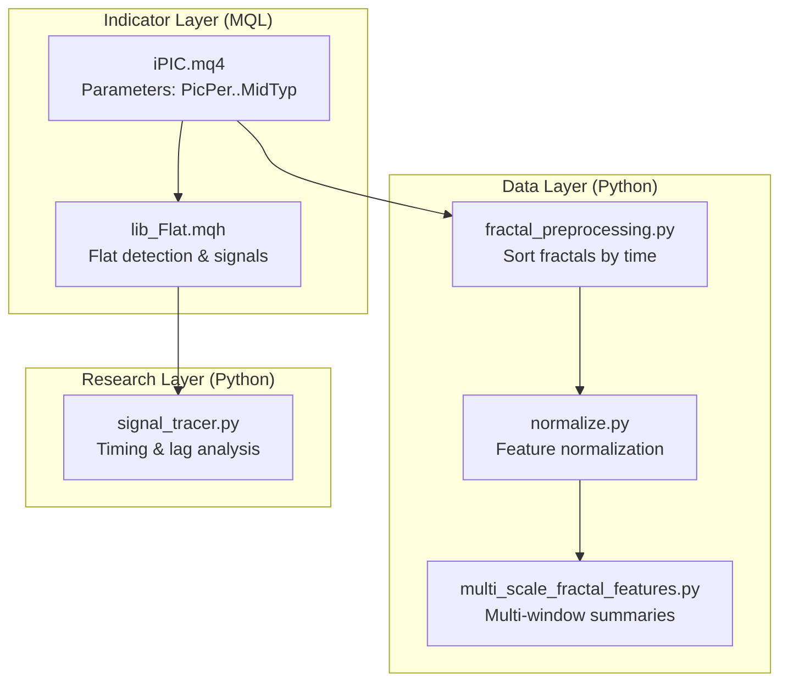
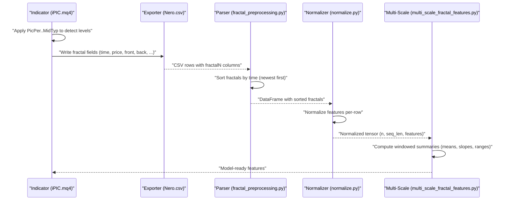
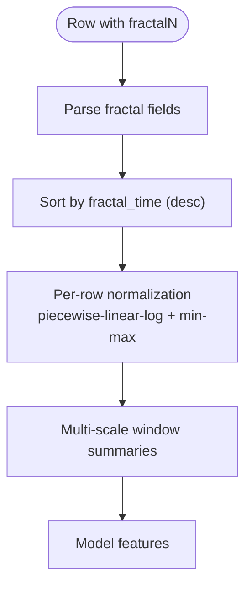
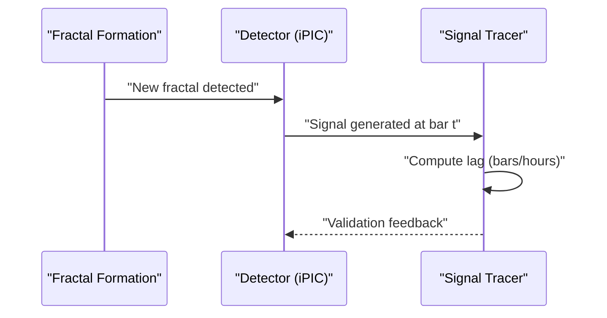
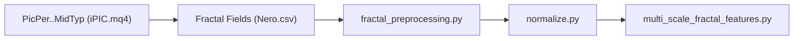

# Fractal Analysis Settings

<cite>
**Referenced Files in This Document**
- [iPIC.mq4](file://MT/MQL4/Indicators/iPIC.mq4)
- [lib_Flat.mqh](file://MT/MQL5/Include/lib_Flat.mqh)
- [SoSimple_163856257.set](file://MT/tester/files/SoSimple_163856257.set)
- [SoSimple_329531263.set](file://MT/tester/files/SoSimple_329531263.set)
- [SoSimple_163856259.set](file://MT/tester/files/SoSimple_163856259.set)
- [SoSimple_163856255.set](file://MT/tester/files/SoSimple_163856255.set)
- [SoSimple_329531267.set](file://MT/tester/files/SoSimple_329531267.set)
- [2026-04-19-lib-pic-feature-source-audit.md](file://docs/reports/2026-04-19-lib-pic-feature-source-audit.md)
- [fractal_preprocessing.py](file://processing/fractal_preprocessing.py)
- [normalize.py](file://processing/normalize.py)
- [multi_scale_fractal_features.py](file://ML/multi_scale_fractal_features.py)
- [signal_tracer.py](file://statistics/signal_tracer.py)
</cite>

## Table of Contents
1. [Introduction](#introduction)
2. [Project Structure](#project-structure)
3. [Core Components](#core-components)
4. [Architecture Overview](#architecture-overview)
5. [Detailed Component Analysis](#detailed-component-analysis)
6. [Dependency Analysis](#dependency-analysis)
7. [Performance Considerations](#performance-considerations)
8. [Troubleshooting Guide](#troubleshooting-guide)
9. [Conclusion](#conclusion)

## Introduction
This document explains the fractal analysis parameter configuration used by SoSimple’s fractal detection engine. It focuses on the nine key parameters: PicPer (1–3), FltLen (5–15), PicCnt (0–7), PicPwr (3–12), PicImp (0–7), Rev (0–2), Days (±6), and MidTyp (0–4). It describes how these parameters influence sensitivity and reliability of fractal detection, their mathematical relationships, and provides practical guidance for trending versus ranging markets. The goal is to help users tune these settings to improve signal quality across varying market conditions.

## Project Structure
The fractal analysis spans three layers:
- Indicator layer (MQL): Detects fractals and levels, applies parameters to define sensitivity and validation.
- Data layer (Python): Parses, normalizes, and aggregates fractal features for machine learning.
- Research layer (Python): Analyzes feature distributions, multi-scale behavior, and signal timing.

**Diagram sources**
- [iPIC.mq4:14-21](file://MT/MQL4/Indicators/iPIC.mq4#L14-L21)
- [lib_Flat.mqh:1-156](file://MT/MQL5/Include/lib_Flat.mqh#L1-L156)
- [fractal_preprocessing.py:1-86](file://processing/fractal_preprocessing.py#L1-L86)
- [normalize.py:319-435](file://processing/normalize.py#L319-L435)
- [multi_scale_fractal_features.py:1-38](file://ML/multi_scale_fractal_features.py#L1-L38)
- [signal_tracer.py:556-574](file://statistics/signal_tracer.py#L556-L574)

**Section sources**
- [iPIC.mq4:14-21](file://MT/MQL4/Indicators/iPIC.mq4#L14-L21)
- [lib_Flat.mqh:1-156](file://MT/MQL5/Include/lib_Flat.mqh#L1-L156)
- [fractal_preprocessing.py:1-86](file://processing/fractal_preprocessing.py#L1-L86)
- [normalize.py:319-435](file://processing/normalize.py#L319-L435)
- [multi_scale_fractal_features.py:1-38](file://ML/multi_scale_fractal_features.py#L1-L38)
- [signal_tracer.py:556-574](file://statistics/signal_tracer.py#L556-L574)

## Core Components
- Parameter declarations and ranges are defined in the indicator source. These parameters drive fractal formation, flat detection, and signal generation.
- The data pipeline parses, sorts, normalizes, and summarizes fractal features for downstream modeling.
- Research utilities analyze timing and multi-scale behavior to inform tuning decisions.

Key parameter roles:
- PicPer: Confirmation delay after fractal formation; higher values smooth out noise but increase lag.
- FltLen: Minimum flat length; controls flat width threshold.
- PicCnt: Required number of level matches; increases robustness.
- PicPwr: Front amplitude threshold relative to ATR; scales sensitivity to strength.
- PicImp: Maximum impulse level; filters strong moves.
- Rev: Breakout validation mode; adds confirmation logic.
- Days: Period search window around fractal time.
- MidTyp: Middle-type selection method for level construction.

**Section sources**
- [iPIC.mq4:14-21](file://MT/MQL4/Indicators/iPIC.mq4#L14-L21)
- [2026-04-19-lib-pic-feature-source-audit.md:14-47](file://docs/reports/2026-04-19-lib-pic-feature-source-audit.md#L14-L47)

## Architecture Overview
The parameter configuration influences detection at the indicator stage, which exports structured fractal features. These features are parsed and normalized, then summarized across multiple time windows for modeling.

**Diagram sources**
- [iPIC.mq4:14-21](file://MT/MQL4/Indicators/iPIC.mq4#L14-L21)
- [2026-04-19-lib-pic-feature-source-audit.md:14-47](file://docs/reports/2026-04-19-lib-pic-feature-source-audit.md#L14-L47)
- [fractal_preprocessing.py:65-85](file://processing/fractal_preprocessing.py#L65-L85)
- [normalize.py:333-435](file://processing/normalize.py#L333-L435)
- [multi_scale_fractal_features.py:18-38](file://ML/multi_scale_fractal_features.py#L18-L38)

## Detailed Component Analysis

### Parameter Effects and Mathematical Relationships
- PicPer (1–3): Adds confirmation bars after fractal formation. Higher values reduce false positives by smoothing short-lived spikes but increase time-to-signal lag.
- FltLen (5–15): Minimum width of a flat segment. Larger values require wider consolidation, reducing false breakouts but missing tighter ranges.
- PicCnt (0–7): Minimum number of matching touches. Increasing PicCnt improves robustness against random bounces.
- PicPwr (3–12): Front amplitude threshold scaled by ATR. Higher values emphasize stronger moves; lower values include weaker consolidations.
- PicImp (0–7): Maximum impulse level filter. Zero disables filtering; higher values select stronger impulsive setups.
- Rev (0–2): Breakout validation mode. Modes add extra confirmation steps to reduce false breakouts.
- Days (±6): Search window around fractal time for nearby levels. Wider windows increase recall but risk including stale levels.
- MidTyp (0–4): Method for computing middle-type level. Different methods weight recent vs. historical strength differently.

These parameters interact:
- Stronger fronts (PicPwr) combined with higher PicCnt increase specificity.
- Longer FltLen reduces false breakouts but may miss quick moves.
- PicPer and Days jointly control timeliness and recency of detected levels.
- MidTyp affects whether recent or accumulated strength dominates level placement.

**Section sources**
- [iPIC.mq4:14-21](file://MT/MQL4/Indicators/iPIC.mq4#L14-L21)
- [lib_Flat.mqh:10-28](file://MT/MQL5/Include/lib_Flat.mqh#L10-L28)
- [2026-04-19-lib-pic-feature-source-audit.md:14-47](file://docs/reports/2026-04-19-lib-pic-feature-source-audit.md#L14-L47)

### Practical Tuning Guidelines by Market Regime
- Trending markets (strong directional bias):
  - Prefer higher specificity to avoid whipsaws.
  - Settings: higher PicCnt, moderate to high PicPwr, moderate FltLen, Rev mode with confirmation, Days near zero, MidTyp emphasizing recent strength.
  - Example combination: PicPer=2, FltLen=10, PicCnt=2, PicPwr=9, PicImp=1, Rev=1, Days=0, MidTyp=1.
- Ranging markets (sideways consolidation):
  - Prefer higher recall to capture more opportunities within bands.
  - Settings: moderate PicCnt, lower PicPwr, wider FltLen, Rev mode relaxed, broader Days window, MidTyp balancing recent and accumulated strength.
  - Example combination: PicPer=1, FltLen=12, PicCnt=1, PicPwr=6, PicImp=0, Rev=0, Days=±2, MidTyp=2.

Note: These are illustrative examples derived from parameter ranges and typical trade-offs. Actual deployment requires backtesting and validation.

**Section sources**
- [iPIC.mq4:14-21](file://MT/MQL4/Indicators/iPIC.mq4#L14-L21)
- [lib_Flat.mqh:10-28](file://MT/MQL5/Include/lib_Flat.mqh#L10-L28)

### Data Pipeline and Normalization Impact
- Sorting: Fractals are sorted by time within each row so newer ones appear first, ensuring the model sees the most recent context.
- Normalization: Features are normalized per-row using piecewise linear-log transforms and min-max scaling to stabilize training and reduce outlier impact.
- Multi-scale summarization: Windowed summaries (means, slopes, ranges) across fixed windows (5, 10, 20, 50, 100) capture short-, medium-, and long-term dynamics.

**Diagram sources**
- [fractal_preprocessing.py:65-85](file://processing/fractal_preprocessing.py#L65-L85)
- [normalize.py:333-435](file://processing/normalize.py#L333-L435)
- [multi_scale_fractal_features.py:9-38](file://ML/multi_scale_fractal_features.py#L9-L38)

**Section sources**
- [fractal_preprocessing.py:65-85](file://processing/fractal_preprocessing.py#L65-L85)
- [normalize.py:333-435](file://processing/normalize.py#L333-L435)
- [multi_scale_fractal_features.py:9-38](file://ML/multi_scale_fractal_features.py#L9-L38)

### Signal Timing and Sensitivity Validation
- Lag analysis: Signal tracer evaluates time between fractal formation and signal appearance, helping assess whether PicPer aligns with desired confirmation delay.
- Multi-scale features: Capturing dynamics across multiple windows helps distinguish genuine reversals from transitory moves.

**Diagram sources**
- [signal_tracer.py:556-574](file://statistics/signal_tracer.py#L556-L574)

**Section sources**
- [signal_tracer.py:556-574](file://statistics/signal_tracer.py#L556-L574)

### Parameter Sets from Backtester Presets
Backtester preset files demonstrate typical configurations used during optimization and testing. They show how the nine parameters are set across runs.

Examples:
- [SoSimple_163856257.set:2-9](file://MT/tester/files/SoSimple_163856257.set#L2-L9)
- [SoSimple_329531263.set:2-9](file://MT/tester/files/SoSimple_329531263.set#L2-L9)
- [SoSimple_163856259.set:2-9](file://MT/tester/files/SoSimple_163856259.set#L2-L9)
- [SoSimple_163856255.set:2-9](file://MT/tester/files/SoSimple_163856255.set#L2-L9)
- [SoSimple_329531267.set:2-9](file://MT/tester/files/SoSimple_329531267.set#L2-L9)

These presets illustrate:
- Typical ranges: PicPer=1, FltLen=10, PicCnt=2, PicPwr=9, PicImp=1, Rev=0, Days=0, MidTyp=1.
- Variations for exploration: adjusting FltLen, PicCnt, PicPwr, Rev, and MidTyp while keeping others constant.

**Section sources**
- [SoSimple_163856257.set:2-9](file://MT/tester/files/SoSimple_163856257.set#L2-L9)
- [SoSimple_329531263.set:2-9](file://MT/tester/files/SoSimple_329531263.set#L2-L9)
- [SoSimple_163856259.set:2-9](file://MT/tester/files/SoSimple_163856259.set#L2-L9)
- [SoSimple_163856255.set:2-9](file://MT/tester/files/SoSimple_163856255.set#L2-L9)
- [SoSimple_329531267.set:2-9](file://MT/tester/files/SoSimple_329531267.set#L2-L9)

## Dependency Analysis
- Indicator parameters feed directly into the fractal feature fields exported to CSV.
- The parser depends on the CSV field order and counts.
- Normalization depends on the presence and validity of each feature column.
- Multi-scale summarization depends on the tensor shape and window sizes.

**Diagram sources**
- [iPIC.mq4:14-21](file://MT/MQL4/Indicators/iPIC.mq4#L14-L21)
- [2026-04-19-lib-pic-feature-source-audit.md:14-47](file://docs/reports/2026-04-19-lib-pic-feature-source-audit.md#L14-L47)
- [fractal_preprocessing.py:65-85](file://processing/fractal_preprocessing.py#L65-L85)
- [normalize.py:333-435](file://processing/normalize.py#L333-L435)
- [multi_scale_fractal_features.py:18-38](file://ML/multi_scale_fractal_features.py#L18-L38)

**Section sources**
- [iPIC.mq4:14-21](file://MT/MQL4/Indicators/iPIC.mq4#L14-L21)
- [2026-04-19-lib-pic-feature-source-audit.md:14-47](file://docs/reports/2026-04-19-lib-pic-feature-source-audit.md#L14-L47)
- [fractal_preprocessing.py:65-85](file://processing/fractal_preprocessing.py#L65-L85)
- [normalize.py:333-435](file://processing/normalize.py#L333-L435)
- [multi_scale_fractal_features.py:18-38](file://ML/multi_scale_fractal_features.py#L18-L38)

## Performance Considerations
- Computational cost: Multi-scale summaries scale with the number of windows and sequence length. Reducing window count or sequence length can speed up processing.
- Memory footprint: Normalization and tensor operations should be performed with appropriate dtypes to minimize memory usage.
- Stability: Piecewise-linear-log normalization helps stabilize extreme values, improving model convergence and generalization.

[No sources needed since this section provides general guidance]

## Troubleshooting Guide
- Missing or misordered fractal fields: Verify the CSV field order and counts match expectations.
- Unexpected normalization artifacts: Confirm that feature arrays contain finite values and that percentiles are computed over valid samples.
- Multi-scale errors: Ensure the input tensor has the expected shape (n, seq_len, feature_dim) and that window sizes are positive.

**Section sources**
- [2026-04-19-lib-pic-feature-source-audit.md:14-47](file://docs/reports/2026-04-19-lib-pic-feature-source-audit.md#L14-L47)
- [normalize.py:333-435](file://processing/normalize.py#L333-L435)
- [multi_scale_fractal_features.py:22-38](file://ML/multi_scale_fractal_features.py#L22-L38)

## Conclusion
The nine parameters—PicPer, FltLen, PicCnt, PicPwr, PicImp, Rev, Days, and MidTyp—control the sensitivity and reliability of SoSimple’s fractal detection. By tuning these parameters to market regime characteristics and validating with timing and multi-scale analyses, users can improve signal quality. The provided presets offer a starting point for experimentation, while the data pipeline ensures robust feature extraction and normalization for modeling.