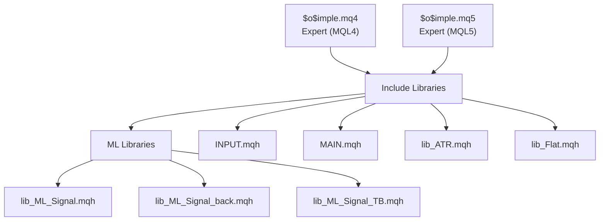
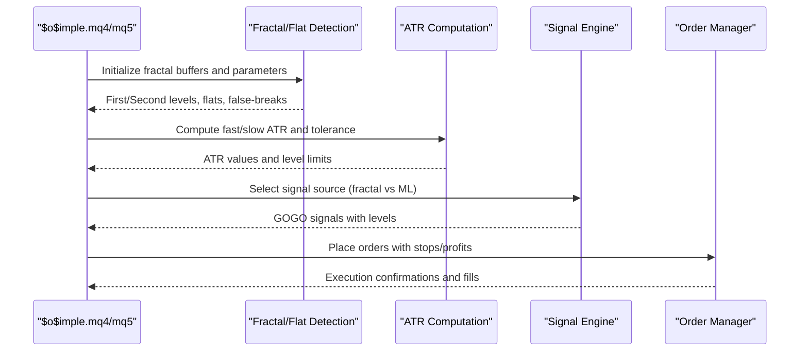
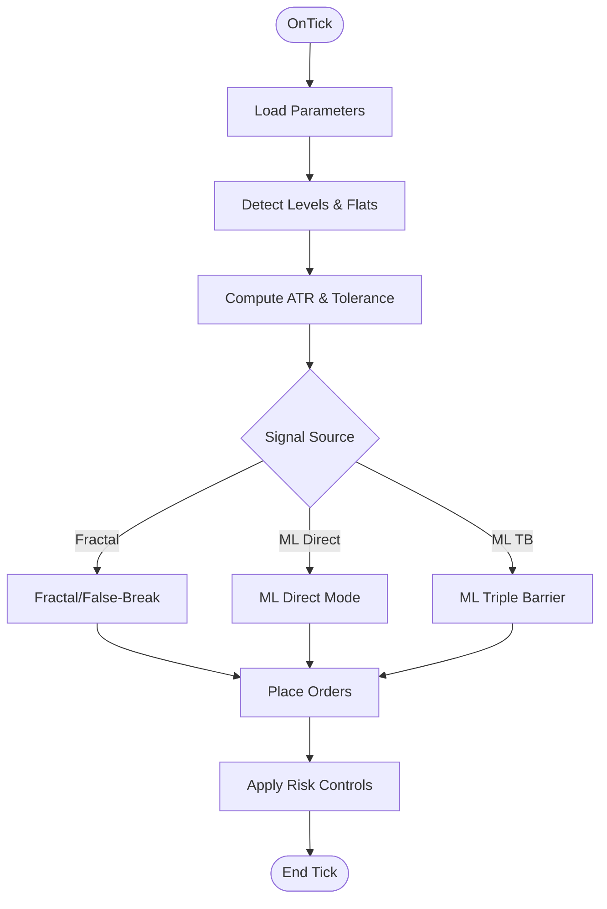
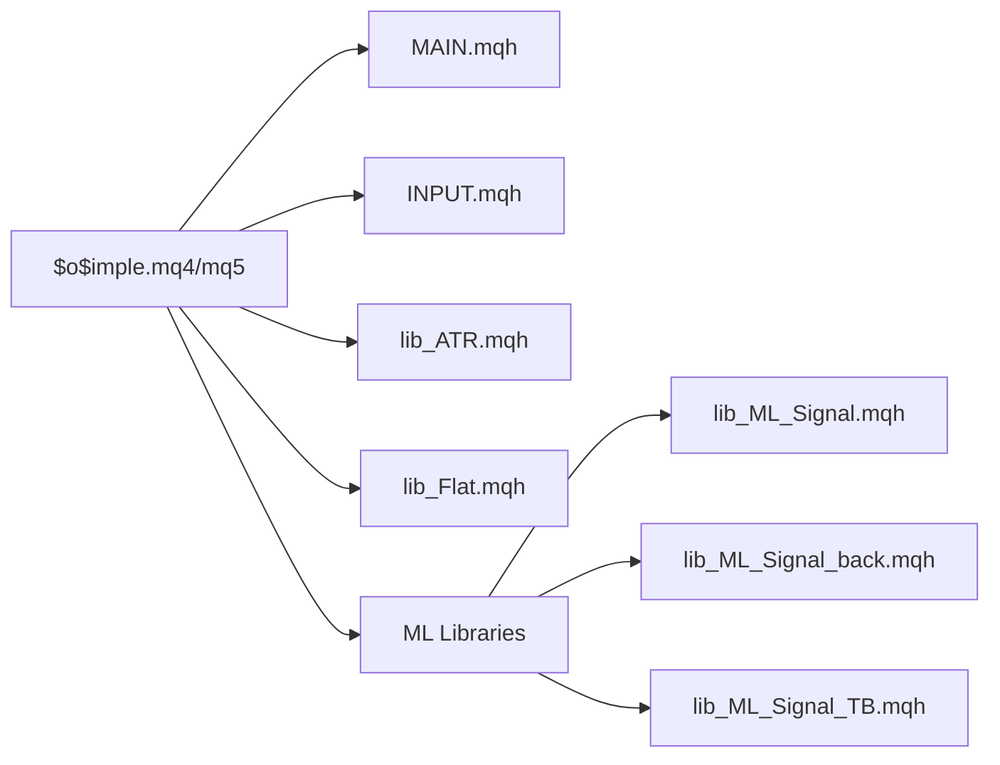

# Parameter Configuration

<cite>
**Referenced Files in This Document**
- [$o$imple.mq4](file://MT/MQL4/Experts/$o$imple.mq4)
- [$o$imple.mq5](file://MT/MQL5/Experts/$o$imple.mq5)
- [INPUT.mqh](file://MT/MQL4/Include/INPUT.mqh)
- [MAIN.mqh](file://MT/MQL4/Include/MAIN.mqh)
- [lib_ML_Signal.mqh](file://MT/MQL4/Include/lib_ML_Signal.mqh)
- [lib_ML_Signal_TB.mqh](file://MT/MQL4/Include/lib_ML_Signal_TB.mqh)
- [lib_ML_Signal_back.mqh](file://MT/MQL4/Include/lib_ML_Signal_back.mqh)
- [lib_ATR.mqh](file://MT/MQL4/Include/lib_ATR.mqh)
- [lib_Flat.mqh](file://MT/MQL4/Include/lib_Flat.mqh)
</cite>

## Table of Contents
1. [Introduction](#introduction)
2. [Project Structure](#project-structure)
3. [Core Components](#core-components)
4. [Architecture Overview](#architecture-overview)
5. [Detailed Component Analysis](#detailed-component-analysis)
6. [Dependency Analysis](#dependency-analysis)
7. [Performance Considerations](#performance-considerations)
8. [Troubleshooting Guide](#troubleshooting-guide)
9. [Conclusion](#conclusion)

## Introduction
This document provides comprehensive guidance for configuring expert advisor parameters in SoSimple across MQL4 and MQL5 platforms. It covers:
- External and internal parameters
- Trading filters (Opt_Trades, RF_, PF_)
- Fractal analysis settings (PicPer, FltLen, PicCnt, PicPwr, PicImp, Rev, Days, MidTyp)
- Trend signal parameters (iGlb, iFlt, iLoc)
- ATR settings (A, a, Ak, PicVal)
- Output parameters (Target, iSignal, iParam, D, Stp, Prf)
- ML optimization parameters (ML_* series)
- Platform-specific handling differences between MQL4 and MQL5
- Practical tuning strategies, backtesting considerations, and optimization approaches

## Project Structure
SoSimple’s expert advisor is implemented in two dialects:
- MQL4 expert ($o$imple.mq4) with include libraries for fractal detection, ATR computation, orders, and ML signal execution
- MQL5 expert ($o$imple.mq5) mirroring MQL4 with input synchronization and compatibility layer

Key include modules:
- INPUT.mqh: Input logic, order generation, stop/profit calculation, and ML signal integration
- MAIN.mqh: Expert class hierarchy, parameter printing, and control flow
- lib_ATR.mqh: ATR computation and level tolerance
- lib_Flat.mqh: Fractal/flattish pattern detection and false-break logic
- lib_ML_Signal*.mqh: ML-driven trading modes (direct parity-check, triple barrier, adaptive)



**Diagram sources**
- [$o$imple.mq4:1-149](file://MT/MQL4/Experts/$o$imple.mq4#L1-L149)
- [$o$imple.mq5:1-157](file://MT/MQL5/Experts/$o$imple.mq5#L1-L157)
- [INPUT.mqh:1-251](file://MT/MQL4/Include/INPUT.mqh#L1-L251)
- [MAIN.mqh:1-213](file://MT/MQL4/Include/MAIN.mqh#L1-L213)
- [lib_ATR.mqh:1-56](file://MT/MQL4/Include/lib_ATR.mqh#L1-L56)
- [lib_Flat.mqh:1-155](file://MT/MQL4/Include/lib_Flat.mqh#L1-L155)
- [lib_ML_Signal.mqh:1-951](file://MT/MQL4/Include/lib_ML_Signal.mqh#L1-L951)
- [lib_ML_Signal_back.mqh:1-325](file://MT/MQL4/Include/lib_ML_Signal_back.mqh#L1-L325)
- [lib_ML_Signal_TB.mqh:1-215](file://MT/MQL4/Include/lib_ML_Signal_TB.mqh#L1-L215)

**Section sources**
- [$o$imple.mq4:1-149](file://MT/MQL4/Experts/$o$imple.mq4#L1-L149)
- [$o$imple.mq5:1-157](file://MT/MQL5/Experts/$o$imple.mq5#L1-L157)

## Core Components
This section enumerates all configurable parameters grouped by functional area, their ranges, defaults, and impact on trading performance.

- Trading Filters
  - Opt_Trades: Controls optimization scope; default 10; range depends on optimizer; impacts optimization granularity
  - RF_: Drop threshold for weak results during optimization; default 0.5; higher values increase robustness filtering
  - PF_: Percentile filter for optimization; default 1.5; increases selection pressure on top performers
  - MO_: Spread multiplier factor; default 0; affects slippage modeling
  - Risk: Percentage of account used per trade (real trading overrides via CSV); default 0
  - MM: Money management mode selector; default 1; influences position sizing
  - Real: Enable real trading mode; default false
  - CustMax: Optimization objective maximizer; default 0
  - SkipPer: Period exclusion string for optimization/backtest; default empty

- Fractal Analysis Settings
  - PicPer: Fractal period window; default 1; range 1..3; narrower windows increase sensitivity
  - FltLen: Minimum flat length; default 10; range 5..15; affects flat detection robustness
  - PicCnt: Required matches for support/resistance; default 2; range 0..7; higher values reduce whipsaws
  - PicPwr: Fractal strength threshold; default 9; range 3..12; higher values require stronger signals
  - PicImp: Impulse level selection; default 1; range 0..7; balances responsiveness vs. noise
  - Rev: Reversal confirmation logic; default 0; range 0..2; enables breakout confirmation
  - Days: Offset for level search; default 0; range -6..6; allows historical level reuse
  - MidTyp: Midpoint calculation method; default 1; range 0..4; affects level stability

- Trend Signal Parameters
  - iGlb: Global trend filter; default 0; range 0..2; 0 disables, 1 uses first levels, 2 uses midpoint levels
  - iFlt: Flat exit logic; default 0; range 0..1; toggles exit-on-flat behavior
  - iLoc: Local trend sensitivity; default 0; range 0..3; controls pivot-based trend changes

- ATR Settings
  - A: Slow ATR period; default 15; range 10..30; longer periods smooth volatility
  - a: Fast ATR period; default 5; range 2..6; shorter periods increase responsiveness
  - Ak: ATR mode selector; default 1; range 0..3; 0=slow, 1=fast, 2=min, 3=max
  - PicVal: Level tolerance in percent of ATR; default 20; range 10..50; tighter tolerances reduce overlap

- Inputs and Order Placement
  - Target: Target level modifier; default 0; range -2..2; affects take-profit placement
  - iSignal: Signal source; default 3; range 0..5; 3=ML direct, 5=ML triple barrier
  - iParam: Signal parameterization; default 1; range 1..4; adjusts ML scoring and thresholds
  - D: Entry offset parameter; default 0; range -7..5; shifts entry distance from levels
  - Stp: Stop distance parameter; default 3; range 0..4; controls stop loss distance
  - Prf: Profit parameter; default 3; range -5..5; sets take-profit scaling

- Output and Risk Management
  - oImp: Post-entry bounce filter; default 0; range -5..5; reduces retests
  - oFlt: Pending order cleanup trigger; default 0; range 0..4; removes stale orders near levels
  - oGlb/oLoc: Global/local trend exits; default 0; range -4..5; enable trend-based exits
  - Trl: Trailing stop logic; default 0; range -4..4; activates trailing stops
  - Wknd: Weekend/Events exit policy; default 0; range 0..2; manages session exits

- Time Filters
  - tk: Session filter mode; default 0; range 0..3; enables intraday trading windows
  - T0: Session start boundary; default 7; range 1..8; combined with tk defines entry window
  - T1: Session duration; default 6; range 1..8; combined with tk defines exit window
  - tp: Time-based exit method; default 1; range 1..5; selects exit reference

- ML Optimization Parameters (MQL4/5)
  - ML_MinRatio: Minimum ratio threshold for ML entries; default 3.5
  - ML_MaxRatio: Upper ratio cap; default 0 (no cap)
  - ML_MaxRR: Maximum risk-reward cap; default 4.0
  - ML_RR_Mode: Risk-reward calculation mode; default 0; 0=min(ratio,MaxRR), 1=log+cap, 2=sqrt+cap
  - ML_RR_Cap: Cap value for modes 1,2; default 2.5
  - ML_ScaleK: ML prediction-to-ATR scale; default 20.0
  - ML_Min_SL_ATR: Minimum stop distance in ATR; default 2.0
  - ML_BypassTrend: Allow ML signals against trend; default true
  - ML_ExitEnabled: Close on reverse signal; default true
  - ML_ExitThreshold: Reverse exit threshold; default 2.0
  - ML_Filter3/ML_Filter6: Directional filters for up_3/dn_3 and up_6/dn_6; default 0.0 (disabled)
  - ML_Trl_Start_ATR: Trailing start distance in ATR; default 1.0
  - ML_Trl_Step_ATR: Trailing step in ATR; default 1.5
  - ML_ExitMode: 0=timeout parity-check, 1=trailing-stop by X*ATR
  - ML_TrailATR: Trailing stop multiplier; default 8.0
  - ML_TakeProfitATR: Fixed take-profit in ATR; default 0.0 (disabled)
  - ML_MaxPositions: Parallel positions for ML direct mode; default 1
  - ML_HoldBars: Timeout bars for ML direct mode; default 12
  - ML_AllowReversal: Close on reverse signal for ML direct mode; default false
  - ML_UseScoreFilter/ML_ScoreThreshold: Score-based filtering for telemetry signals; default true/false with threshold

Impact on performance:
- Tighter filters (higher FltLen, PicCnt, PicPwr) reduce trades but improve precision
- Larger ATR periods (A, a) smooth volatility but may delay entries
- Higher Ak values increase sensitivity to recent volatility
- ML parameters tune entry quality, risk control, and exit discipline

**Section sources**
- [$o$imple.mq4:8-82](file://MT/MQL4/Experts/$o$imple.mq4#L8-L82)
- [$o$imple.mq5:7-111](file://MT/MQL5/Experts/$o$imple.mq5#L7-L111)
- [INPUT.mqh:3-54](file://MT/MQL4/Include/INPUT.mqh#L3-L54)
- [lib_ATR.mqh:39-46](file://MT/MQL4/Include/lib_ATR.mqh#L39-L46)
- [lib_Flat.mqh:1-155](file://MT/MQL4/Include/lib_Flat.mqh#L1-L155)
- [lib_ML_Signal.mqh:59-79](file://MT/MQL4/Include/lib_ML_Signal.mqh#L59-L79)
- [lib_ML_Signal_back.mqh:150-157](file://MT/MQL4/Include/lib_ML_Signal_back.mqh#L150-L157)
- [lib_ML_Signal_TB.mqh:118-199](file://MT/MQL4/Include/lib_ML_Signal_TB.mqh#L118-L199)

## Architecture Overview
The expert advisor orchestrates parameter-driven trading through a layered pipeline:
- Parameter ingestion (MQL4: extern/input; MQL5: input + sync)
- Fractal and trend detection (fractal library, flat detection)
- ATR computation and level tolerance
- Signal generation (fractal/false-break or ML signals)
- Order placement and risk control (stop/profit logic)
- Optional ML-driven execution modes



**Diagram sources**
- [MAIN.mqh:117-143](file://MT/MQL4/Include/MAIN.mqh#L117-L143)
- [INPUT.mqh:3-54](file://MT/MQL4/Include/INPUT.mqh#L3-L54)
- [lib_ATR.mqh:2-47](file://MT/MQL4/Include/lib_ATR.mqh#L2-L47)
- [lib_Flat.mqh:2-43](file://MT/MQL4/Include/lib_Flat.mqh#L2-L43)
- [lib_ML_Signal.mqh:603-753](file://MT/MQL4/Include/lib_ML_Signal.mqh#L603-L753)
- [lib_ML_Signal_back.mqh:161-299](file://MT/MQL4/Include/lib_ML_Signal_back.mqh#L161-L299)
- [lib_ML_Signal_TB.mqh:118-200](file://MT/MQL4/Include/lib_ML_Signal_TB.mqh#L118-L200)

## Detailed Component Analysis

### Parameter Groups and Defaults
- Trading Filters (MQL4/MQL5): Opt_Trades, RF_, PF_, MO_, Risk, MM, Real, CustMax, SkipPer
- Fractal Analysis: PicPer, FltLen, PicCnt, PicPwr, PicImp, Rev, Days, MidTyp
- Trend Signals: iGlb, iFlt, iLoc
- ATR: A, a, Ak, PicVal
- Inputs/Orders: Target, iSignal, iParam, D, Stp, Prf
- Outputs/Risk: oImp, oFlt, oGlb, oLoc, Trl, Wknd
- Time Filters: tk, T0, T1, tp
- ML Optimization: ML_MinRatio, ML_MaxRatio, ML_MaxRR, ML_RR_Mode, ML_RR_Cap, ML_ScaleK, ML_Min_SL_ATR, ML_BypassTrend, ML_ExitEnabled, ML_ExitThreshold, ML_Filter3, ML_Filter6, ML_Trl_Start_ATR, ML_Trl_Step_ATR, ML_ExitMode, ML_TrailATR, ML_TakeProfitATR, ML_MaxPositions, ML_HoldBars, ML_AllowReversal, ML_UseScoreFilter, ML_ScoreThreshold, ML_BackStopATR

Defaults and ranges are defined in the experts and include libraries. MQL5 additionally synchronizes inputs to internal variables.

**Section sources**
- [$o$imple.mq4:8-82](file://MT/MQL4/Experts/$o$imple.mq4#L8-L82)
- [$o$imple.mq5:85-111](file://MT/MQL5/Experts/$o$imple.mq5#L85-L111)
- [MAIN.mqh:151-199](file://MT/MQL4/Include/MAIN.mqh#L151-L199)

### Parameter Interactions and Control Flow
- ATR drives stop/profit distances and level tolerances
- Fractal detection feeds levels and false-break confirmations
- ML modes override traditional inputs when enabled
- Time filters gate sessions and enforce exits



**Diagram sources**
- [MAIN.mqh:117-143](file://MT/MQL4/Include/MAIN.mqh#L117-L143)
- [INPUT.mqh:3-54](file://MT/MQL4/Include/INPUT.mqh#L3-L54)
- [lib_ML_Signal.mqh:603-753](file://MT/MQL4/Include/lib_ML_Signal.mqh#L603-L753)
- [lib_ML_Signal_back.mqh:161-299](file://MT/MQL4/Include/lib_ML_Signal_back.mqh#L161-L299)
- [lib_ML_Signal_TB.mqh:118-200](file://MT/MQL4/Include/lib_ML_Signal_TB.mqh#L118-L200)

### ML Optimization Modes
- Direct Parity-Check (ML mode 3):
  - Loads ml_signals.csv, applies score filter if enabled, respects MaxPositions and HoldBars
  - Supports trailing-stop or timeout-based exits
- Triple Barrier (ML mode 5):
  - Reads fixed SL/TP from ml_signals_tb.csv
  - Applies trend filter with optional bypass
- Adaptive Ratio-Based (legacy ML back):
  - Computes ratio from predictions, applies filters (Filter3/Filter6), dynamic SL/TP scaling

```mermaid
sequenceDiagram
participant EA as "Expert"
participant CSV as "CSV Loader"
participant ORD as "Order Manager"
EA->>CSV : Load signals (time;signal;...)
CSV-->>EA : Signals array
EA->>EA : Apply filters (trend, ratio, scores)
EA->>ORD : Send market orders with SL/TP
ORD-->>EA : Execution results
```

**Diagram sources**
- [lib_ML_Signal.mqh:457-551](file://MT/MQL4/Include/lib_ML_Signal.mqh#L457-L551)
- [lib_ML_Signal_back.mqh:55-131](file://MT/MQL4/Include/lib_ML_Signal_back.mqh#L55-L131)
- [lib_ML_Signal_TB.mqh:46-99](file://MT/MQL4/Include/lib_ML_Signal_TB.mqh#L46-L99)

**Section sources**
- [lib_ML_Signal.mqh:603-800](file://MT/MQL4/Include/lib_ML_Signal.mqh#L603-L800)
- [lib_ML_Signal_back.mqh:161-299](file://MT/MQL4/Include/lib_ML_Signal_back.mqh#L161-L299)
- [lib_ML_Signal_TB.mqh:118-200](file://MT/MQL4/Include/lib_ML_Signal_TB.mqh#L118-L200)

### Platform-Specific Handling
- MQL4: Uses extern/input declarations for parameters; includes service routines for parameter printing and persistence
- MQL5: Uses input declarations with explicit synchronization to internal variables; compatibility layer included

Key differences:
- Parameter declaration syntax and persistence
- Synchronization routine in MQL5 (SyncInputs)
- Compatibility includes for MQL5

**Section sources**
- [$o$imple.mq4:1-149](file://MT/MQL4/Experts/$o$imple.mq4#L1-L149)
- [$o$imple.mq5:101-111](file://MT/MQL5/Experts/$o$imple.mq5#L101-L111)
- [MAIN.mqh:151-199](file://MT/MQL4/Include/MAIN.mqh#L151-L199)

## Dependency Analysis
The expert advisor depends on:
- Parameter libraries for printing and persistence
- Fractal and flat detection for level identification
- ATR computation for volatility-sensitive risk controls
- ML libraries for alternative signal engines



**Diagram sources**
- [MAIN.mqh:1-213](file://MT/MQL4/Include/MAIN.mqh#L1-L213)
- [INPUT.mqh:1-251](file://MT/MQL4/Include/INPUT.mqh#L1-L251)
- [lib_ATR.mqh:1-56](file://MT/MQL4/Include/lib_ATR.mqh#L1-L56)
- [lib_Flat.mqh:1-155](file://MT/MQL4/Include/lib_Flat.mqh#L1-L155)
- [lib_ML_Signal.mqh:1-951](file://MT/MQL4/Include/lib_ML_Signal.mqh#L1-L951)
- [lib_ML_Signal_back.mqh:1-325](file://MT/MQL4/Include/lib_ML_Signal_back.mqh#L1-L325)
- [lib_ML_Signal_TB.mqh:1-215](file://MT/MQL4/Include/lib_ML_Signal_TB.mqh#L1-L215)

**Section sources**
- [MAIN.mqh:111-143](file://MT/MQL4/Include/MAIN.mqh#L111-L143)
- [INPUT.mqh:3-54](file://MT/MQL4/Include/INPUT.mqh#L3-L54)

## Performance Considerations
- Parameter granularity: Reduce PicCnt and FltLen for smoother signals; increase for higher conviction
- ATR responsiveness: Lower a and higher Ak increase sensitivity; higher A smoothens volatility
- ML filters: Use Filter3/Filter6 to reduce noise; adjust MinRatio/MaxRatio to balance entry frequency
- Position sizing: MM and Risk influence drawdown; combine with ML_MaxPositions cautiously
- Time gating: tk/T0/T1 reduce whipsaws by limiting sessions

[No sources needed since this section provides general guidance]

## Troubleshooting Guide
Common issues and remedies:
- No orders despite signals:
  - Verify trend filters (iGlb/iFlt/iLoc) and ML bypass settings
  - Check ML filters (MinRatio, Filter3/6) and score thresholds
- Excessive whipsaws:
  - Increase FltLen, PicCnt, PicPwr; tighten PicVal
- Poor stop distances:
  - Adjust Stp and Prf; review A/a/Ak settings
- ML mode anomalies:
  - Confirm CSV availability and timestamps
  - Validate ML_ExitMode and ML_HoldBars for parity-check mode

**Section sources**
- [INPUT.mqh:3-54](file://MT/MQL4/Include/INPUT.mqh#L3-L54)
- [lib_ML_Signal.mqh:603-753](file://MT/MQL4/Include/lib_ML_Signal.mqh#L603-L753)
- [lib_ML_Signal_back.mqh:161-299](file://MT/MQL4/Include/lib_ML_Signal_back.mqh#L161-L299)
- [lib_ML_Signal_TB.mqh:118-200](file://MT/MQL4/Include/lib_ML_Signal_TB.mqh#L118-L200)

## Conclusion
SoSimple’s parameter configuration offers granular control over fractal detection, trend filtering, ATR-based risk management, and ML-driven execution. Proper tuning requires balancing sensitivity (fractal filters) with robustness (ATR and ML filters), aligning with market regimes and risk capacity. Use MQL5’s synchronized inputs for consistent backtesting and real trading, and apply ML filters thoughtfully to avoid overfitting while preserving edge.