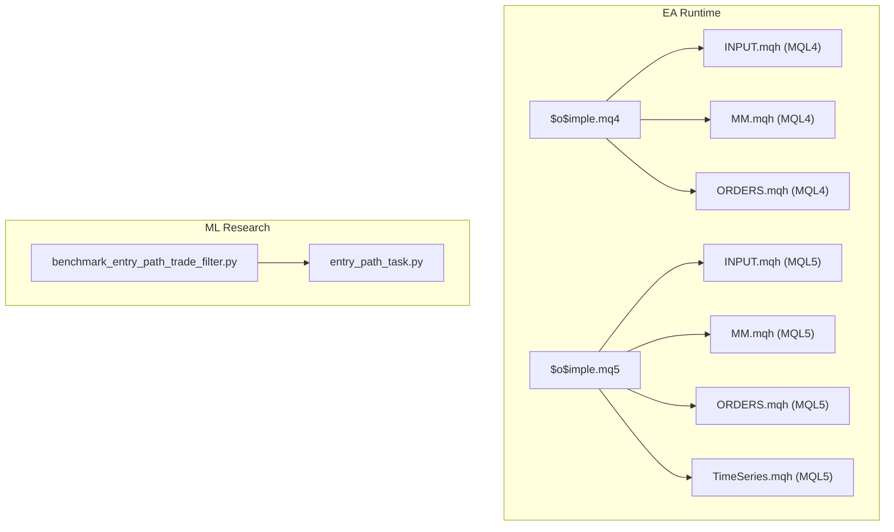
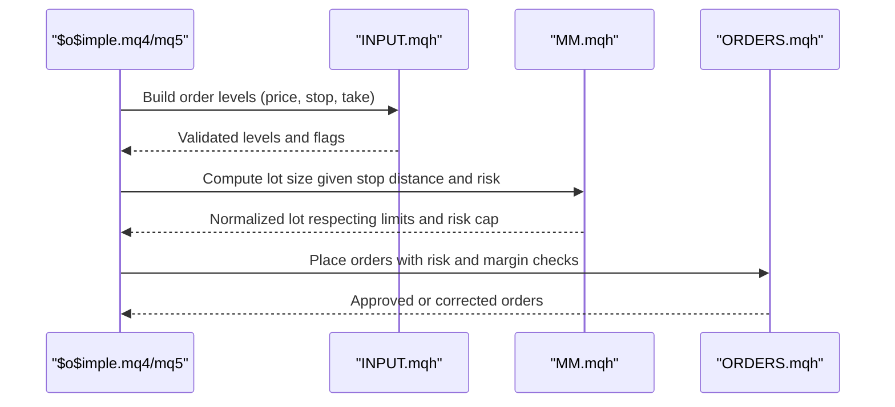
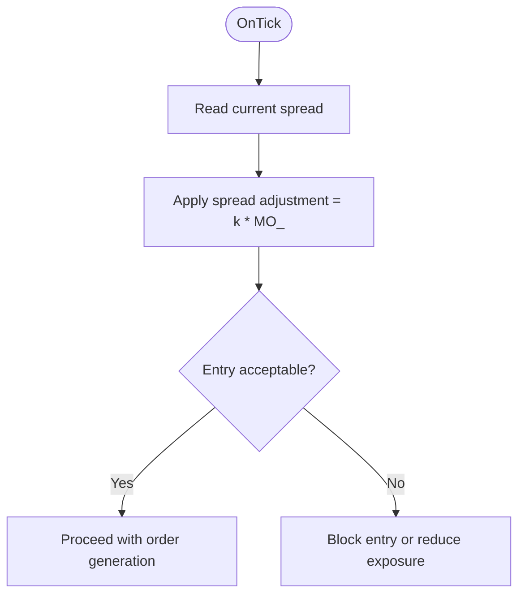
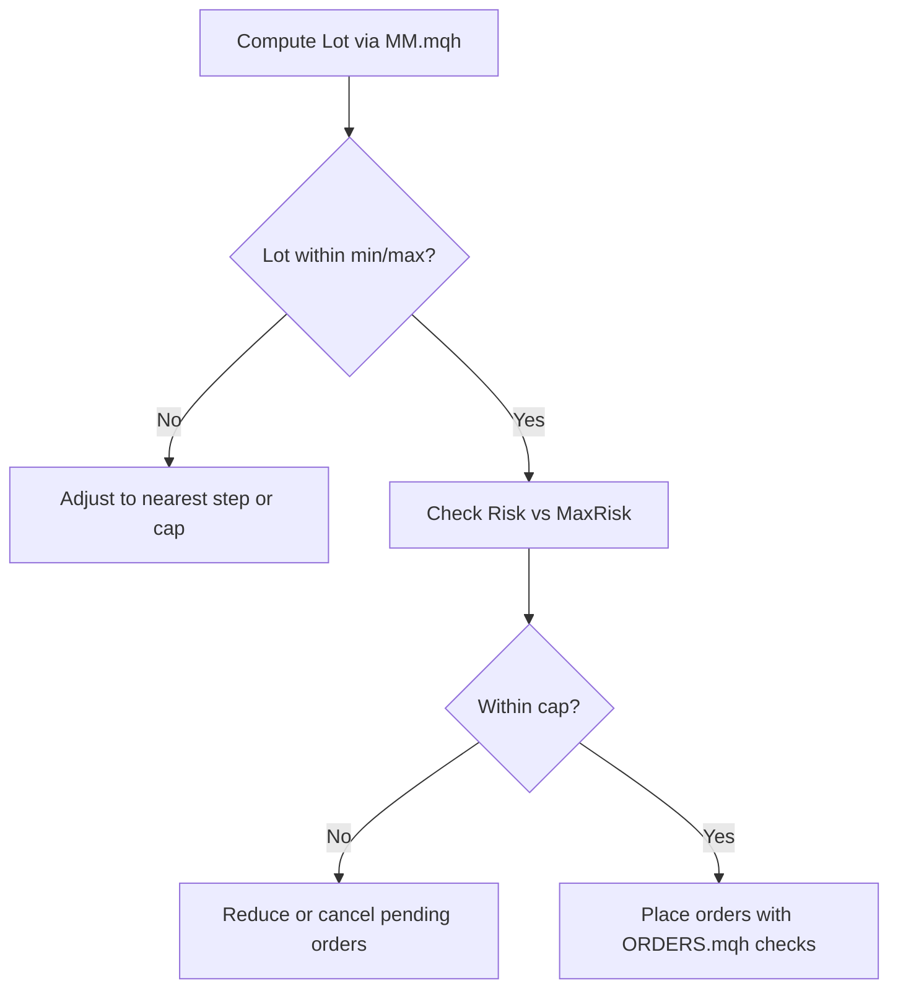
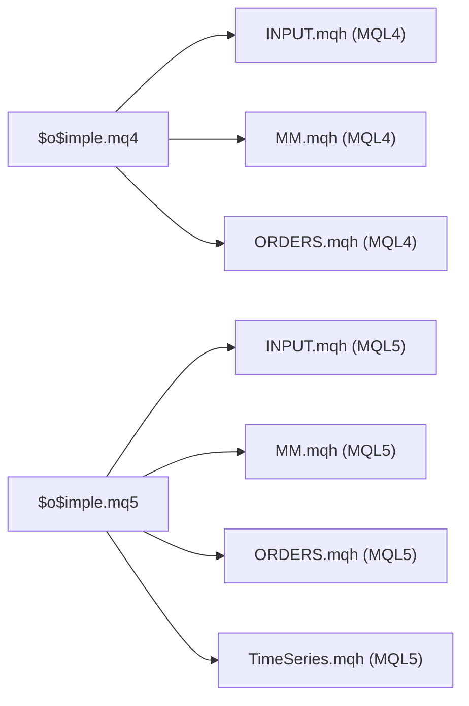

# Trading Filters and Risk Parameters

<cite>
**Referenced Files in This Document**
- [$o$imple.mq4](file://MT/MQL4/Experts/$o$imple.mq4)
- [$o$imple.mq5](file://MT/MQL5/Experts/$o$imple.mq5)
- [MM.mqh (MQL4)](file://MT/MQL4/Include/MM.mqh)
- [MM.mqh (MQL5)](file://MT/MQL5/Include/MM.mqh)
- [INPUT.mqh (MQL4)](file://MT/MQL4/Include/INPUT.mqh)
- [INPUT.mqh (MQL5)](file://MT/MQL5/Include/INPUT.mqh)
- [ORDERS.mqh (MQL4)](file://MT/MQL4/Include/ORDERS.mqh)
- [ORDERS.mqh (MQL5)](file://MT/MQL5/Include/ORDERS.mqh)
- [2026-03-27-pf-improvement-design.md](file://docs/superpowers/specs/2026-03-27-pf-improvement-design.md)
- [2026-04-13-quantile-forward-validation.md](file://docs/superpowers/plans/2026-04-13-quantile-forward-validation.md)
- [benchmark_entry_path_trade_filter.py](file://ML/benchmark_entry_path_trade_filter.py)
- [entry_path_task.py](file://ML/entry_path_task.py)
- [TimeSeries.mqh (MQL5)](file://MT/MQL5/Include/Indicators/TimeSeries.mqh)
</cite>

## Table of Contents
1. [Introduction](#introduction)
2. [Project Structure](#project-structure)
3. [Core Components](#core-components)
4. [Architecture Overview](#architecture-overview)
5. [Detailed Component Analysis](#detailed-component-analysis)
6. [Dependency Analysis](#dependency-analysis)
7. [Performance Considerations](#performance-considerations)
8. [Troubleshooting Guide](#troubleshooting-guide)
9. [Conclusion](#conclusion)
10. [Appendices](#appendices)

## Introduction
This document explains the trading filters and risk parameters used by the SoSimple expert advisor to control trade selection and position sizing. It focuses on:
- Opt_Trades: trade filtering parameter for optimization scope
- RF_ and PF_: risk management and performance thresholds used during optimization
- MO_: spread multiplier factor applied to spreads
- CustMax: optimization target selector among balance, risk factor, inverse risk factor, and spread-divided Sharpe-like metric

It also covers parameter ranges, default values, and practical guidance for tuning across market regimes, risk profiles, and account sizes. Finally, it outlines optimization strategies using backtesting and walk-forward validation.

## Project Structure
The EA is implemented in both MQL4 and MQL5 with shared include libraries for money management, order checks, input generation, and indicator support. Key files:
- Expert advisors: MQL4 and MQL5 entry points define inputs and runtime behavior
- Money management: MM.mqh computes position sizes based on risk and account metrics
- Input generation: INPUT.mqh builds order levels and validates setups
- Order checks: ORDERS.mqh enforces risk and margin caps
- Spread handling: TimeSeries.mqh provides spread series for MO_ usage
- ML-backed research: benchmark scripts and tasks analyze trade filters and performance metrics

**Diagram sources**
- [$o$imple.mq4:1-149](file://MT/MQL4/Experts/$o$imple.mq4#L1-L149)
- [$o$imple.mq5:1-157](file://MT/MQL5/Experts/$o$imple.mq5#L1-L157)
- [MM.mqh (MQL4):1-82](file://MT/MQL4/Include/MM.mqh#L1-L82)
- [MM.mqh (MQL5):1-82](file://MT/MQL5/Include/MM.mqh#L1-L82)
- [INPUT.mqh (MQL4):1-251](file://MT/MQL4/Include/INPUT.mqh#L1-L251)
- [INPUT.mqh (MQL5):1-252](file://MT/MQL5/Include/INPUT.mqh#L1-L252)
- [ORDERS.mqh (MQL4):258-269](file://MT/MQL4/Include/ORDERS.mqh#L258-L269)
- [ORDERS.mqh (MQL5):258-269](file://MT/MQL5/Include/ORDERS.mqh#L258-L269)
- [TimeSeries.mqh (MQL5):735-861](file://MT/MQL5/Include/Indicators/TimeSeries.mqh#L735-L861)
- [benchmark_entry_path_trade_filter.py:65-100](file://ML/benchmark_entry_path_trade_filter.py#L65-L100)
- [entry_path_task.py:227-245](file://ML/entry_path_task.py#L227-L245)

**Section sources**
- [$o$imple.mq4:1-149](file://MT/MQL4/Experts/$o$imple.mq4#L1-L149)
- [$o$imple.mq5:1-157](file://MT/MQL5/Experts/$o$imple.mq5#L1-L157)

## Core Components
This section documents the four parameters under focus and their roles:

- Opt_Trades (char): Trade filtering parameter used during optimization to limit the number or selection of trades considered for evaluation. Default value is 10.
- RF_ (float): Risk factor threshold used during optimization to discard poor outcomes. Default value is 0.5.
- PF_ (float): Performance factor threshold used during optimization to filter out weak results. Default value is 1.5.
- MO_ (char): Spread multiplier factor. The EA applies spread adjustments proportional to MO_. Default value is 0.
- CustMax (char): Optimization target selector among:
  - 0: Balance
  - 1: Risk Factor
  - 2: Inverse Risk Factor
  - 3: Spread-divided Sharpe-like metric (MO/SD)
  Default value is 0.

Parameter ranges and defaults:
- Opt_Trades: char type, default 10
- RF_: float type, default 0.5
- PF_: float type, default 1.5
- MO_: char type, default 0
- CustMax: char type, default 0

Impact on trading performance:
- Opt_Trades narrows the optimization landscape to improve convergence and reduce overfitting.
- RF_ and PF_ act as hard thresholds to avoid optimizing noisy or low-quality samples.
- MO_ adjusts sensitivity to spread costs; higher MO_ increases cost sensitivity.
- CustMax steers optimization toward targets aligned with the evaluator’s goals (balance, risk-adjusted returns, or spread efficiency).

**Section sources**
- [$o$imple.mq4:8-16](file://MT/MQL4/Experts/$o$imple.mq4#L8-L16)
- [$o$imple.mq5:7-16](file://MT/MQL5/Experts/$o$imple.mq5#L7-L16)
- [2026-03-27-pf-improvement-design.md:1-288](file://docs/superpowers/specs/2026-03-27-pf-improvement-design.md#L1-L288)

## Architecture Overview
The EA orchestrates trade filtering and risk management through a pipeline:
- Inputs are generated from pattern recognition and ML signals.
- Position sizing is computed via money management using account risk and instrument specifics.
- Orders are validated against risk and margin caps before placement.

**Diagram sources**
- [INPUT.mqh (MQL4):3-54](file://MT/MQL4/Include/INPUT.mqh#L3-L54)
- [INPUT.mqh (MQL5):3-54](file://MT/MQL5/Include/INPUT.mqh#L3-L54)
- [MM.mqh (MQL4):1-30](file://MT/MQL4/Include/MM.mqh#L1-L30)
- [MM.mqh (MQL5):1-30](file://MT/MQL5/Include/MM.mqh#L1-L30)
- [ORDERS.mqh (MQL4):258-269](file://MT/MQL4/Include/ORDERS.mqh#L258-L269)
- [ORDERS.mqh (MQL5):258-269](file://MT/MQL5/Include/ORDERS.mqh#L258-L269)

## Detailed Component Analysis

### Opt_Trades: Trade Filtering Parameter
Purpose:
- Limit the number or selection of trades considered during optimization to improve robustness and speed.

Behavior:
- Default value is 10.
- Used to constrain optimization scope so that only the most promising trades are evaluated.

Guidance:
- Increase Opt_Trades when seeking broader exploration; decrease to focus on top trades.
- Combine with RF_ and PF_ to prune weak combinations early.

**Section sources**
- [$o$imple.mq4:9-9](file://MT/MQL4/Experts/$o$imple.mq4#L9-L9)
- [$o$imple.mq5:7-7](file://MT/MQL5/Experts/$o$imple.mq5#L7-L7)

### RF_ and PF_: Risk and Performance Thresholds
Purpose:
- RF_ (Risk Factor threshold): Discard poor-risk outcomes during optimization.
- PF_ (Performance Factor threshold): Filter out weak-performing configurations.

Behavior:
- Defaults: RF_=0.5, PF_=1.5.
- These parameters gate optimization iterations to avoid training on subpar setups.

Guidance:
- Raise thresholds to enforce stricter quality gates.
- Lower thresholds to explore more candidates (with higher risk of overfitting).

**Section sources**
- [$o$imple.mq4:10-11](file://MT/MQL4/Experts/$o$imple.mq4#L10-L11)
- [$o$imple.mq5:8-9](file://MT/MQL5/Experts/$o$imple.mq5#L8-L9)
- [2026-03-27-pf-improvement-design.md:28-288](file://docs/superpowers/specs/2026-03-27-pf-improvement-design.md#L28-L288)

### MO_: Spread Multiplier Setting
Purpose:
- Adjust sensitivity to spread costs by multiplying the spread with MO_.

Behavior:
- Default MO_=0.
- Spread series are available via TimeSeries.mqh for MQL5; MQL4 uses broker-provided spread APIs.

Guidance:
- Increase MO_ in low-liquidity or high-spread environments to penalize costly entries.
- Decrease MO_ in tight-spread markets to allow more entries.

**Diagram sources**
- [TimeSeries.mqh (MQL5):735-861](file://MT/MQL5/Include/Indicators/TimeSeries.mqh#L735-L861)
- [$o$imple.mq4:12-12](file://MT/MQL4/Experts/$o$imple.mq4#L12-L12)
- [$o$imple.mq5:10-10](file://MT/MQL5/Experts/$o$imple.mq5#L10-L10)

**Section sources**
- [$o$imple.mq4:12-12](file://MT/MQL4/Experts/$o$imple.mq4#L12-L12)
- [$o$imple.mq5:10-10](file://MT/MQL5/Experts/$o$imple.mq5#L10-L10)
- [TimeSeries.mqh (MQL5):735-861](file://MT/MQL5/Include/Indicators/TimeSeries.mqh#L735-L861)

### CustMax: Optimization Target Selector
Purpose:
- Choose which metric to maximize during optimization.

Options:
- 0: Balance
- 1: Risk Factor
- 2: Inverse Risk Factor
- 3: Spread-divided Sharpe-like (MO/SD)

Default: 0 (Balance).

Guidance:
- Use 1 or 2 when risk-adjusted performance matters more than absolute PnL.
- Use 3 when minimizing transaction cost impact is a priority.

**Section sources**
- [$o$imple.mq4:16-16](file://MT/MQL4/Experts/$o$imple.mq4#L16-L16)
- [$o$imple.mq5:14-14](file://MT/MQL5/Experts/$o$imple.mq5#L14-L14)

### Position Sizing and Risk Control
Position sizing is computed by MM.mqh using account risk and instrument tick mechanics. Risk and margin caps are enforced by ORDERS.mqh.

Key points:
- Lot calculation depends on risk percentage, stop distance, point value, and tick value.
- Risk is checked against MaxRisk; if exceeded, new orders may be reduced or canceled.
- Margin checks prevent over-leveraging across open positions.

**Diagram sources**
- [MM.mqh (MQL4):1-30](file://MT/MQL4/Include/MM.mqh#L1-L30)
- [MM.mqh (MQL5):1-30](file://MT/MQL5/Include/MM.mqh#L1-L30)
- [ORDERS.mqh (MQL4):258-269](file://MT/MQL4/Include/ORDERS.mqh#L258-L269)
- [ORDERS.mqh (MQL5):258-269](file://MT/MQL5/Include/ORDERS.mqh#L258-L269)

**Section sources**
- [MM.mqh (MQL4):1-82](file://MT/MQL4/Include/MM.mqh#L1-L82)
- [MM.mqh (MQL5):1-82](file://MT/MQL5/Include/MM.mqh#L1-L82)
- [ORDERS.mqh (MQL4):258-269](file://MT/MQL4/Include/ORDERS.mqh#L258-L269)
- [ORDERS.mqh (MQL5):258-269](file://MT/MQL5/Include/ORDERS.mqh#L258-L269)

### Trade Filtering and Performance Metrics (ML-backed)
ML research supports trade filtering and performance evaluation:
- Benchmark scripts evaluate trade filters across validation and test sets.
- Tasks compute performance metrics such as profit factor (PF), number of trades per year, and concentration of profits.

These insights guide tuning of Opt_Trades and related thresholds to achieve desired PF and trade frequency.

**Section sources**
- [benchmark_entry_path_trade_filter.py:65-100](file://ML/benchmark_entry_path_trade_filter.py#L65-L100)
- [entry_path_task.py:227-245](file://ML/entry_path_task.py#L227-L245)

## Dependency Analysis
The EA depends on several modules for input generation, money management, and order validation. The following diagram highlights key dependencies:

**Diagram sources**
- [$o$imple.mq4:100-122](file://MT/MQL4/Experts/$o$imple.mq4#L100-L122)
- [$o$imple.mq5:113-136](file://MT/MQL5/Experts/$o$imple.mq5#L113-L136)
- [INPUT.mqh (MQL4):1-251](file://MT/MQL4/Include/INPUT.mqh#L1-L251)
- [INPUT.mqh (MQL5):1-252](file://MT/MQL5/Include/INPUT.mqh#L1-L252)
- [MM.mqh (MQL4):1-82](file://MT/MQL4/Include/MM.mqh#L1-L82)
- [MM.mqh (MQL5):1-82](file://MT/MQL5/Include/MM.mqh#L1-L82)
- [ORDERS.mqh (MQL4):258-269](file://MT/MQL4/Include/ORDERS.mqh#L258-L269)
- [ORDERS.mqh (MQL5):258-269](file://MT/MQL5/Include/ORDERS.mqh#L258-L269)
- [TimeSeries.mqh (MQL5):735-861](file://MT/MQL5/Include/Indicators/TimeSeries.mqh#L735-L861)

**Section sources**
- [$o$imple.mq4:100-122](file://MT/MQL4/Experts/$o$imple.mq4#L100-L122)
- [$o$imple.mq5:113-136](file://MT/MQL5/Experts/$o$imple.mq5#L113-L136)

## Performance Considerations
- Optimize PF and trade frequency by combining Opt_Trades, RF_, and PF_ with walk-forward validation.
- Adjust MO_ to reflect market liquidity and widen stops to mitigate slippage and spread drag.
- Monitor risk and margin caps to avoid overexposure; use CustMax to align optimization with risk-adjusted targets.

[No sources needed since this section provides general guidance]

## Troubleshooting Guide
Common issues and remedies:
- Orders rejected due to risk or margin caps: review MaxRisk and MaxMargin; reduce Lot via MM.mqh or tighten stops.
- Spread-sensitive entries failing: increase MO_ or widen stops; verify spread series availability.
- Low PF despite high trade frequency: raise RF_ and PF_ thresholds; refine Opt_Trades to focus on top trades.

**Section sources**
- [MM.mqh (MQL4):24-29](file://MT/MQL4/Include/MM.mqh#L24-L29)
- [MM.mqh (MQL5):24-29](file://MT/MQL5/Include/MM.mqh#L24-L29)
- [ORDERS.mqh (MQL4):258-269](file://MT/MQL4/Include/ORDERS.mqh#L258-L269)
- [ORDERS.mqh (MQL5):258-269](file://MT/MQL5/Include/ORDERS.mqh#L258-L269)
- [TimeSeries.mqh (MQL5):735-861](file://MT/MQL5/Include/Indicators/TimeSeries.mqh#L735-L861)

## Conclusion
Optimizing SoSimple’s trading filters and risk parameters requires balancing trade selection (Opt_Trades), quality gates (RF_, PF_), spread sensitivity (MO_), and optimization targets (CustMax). Use backtesting to establish baselines and apply walk-forward validation to guard against overfitting. Align position sizing with risk and margin constraints to preserve capital across varying market conditions.

[No sources needed since this section summarizes without analyzing specific files]

## Appendices

### Practical Tuning Examples
- Low-volatility, tight-spread markets:
  - MO_=0 or slightly positive
  - RF_=0.5, PF_=1.5
  - Opt_Trades≈10
  - CustMax=0 or 1
- High-volatility, wide-spread regimes:
  - MO_≈+1..+3
  - RF_=0.6..0.8, PF_=1.8..2.2
  - Opt_Trades≈5..10
  - CustMax=3 (spread efficiency) or 2 (inverse risk)
- Conservative accounts:
  - RF_=0.7+, PF_=2.0+
  - MO_≈0..+1
  - Opt_Trades≈5
  - CustMax=1 or 2
- Aggressive accounts:
  - RF_=0.4..0.6, PF_=1.4..1.8
  - MO_≈+1..+2
  - Opt_Trades≈10..15
  - CustMax=0 or 1

[No sources needed since this section provides general guidance]