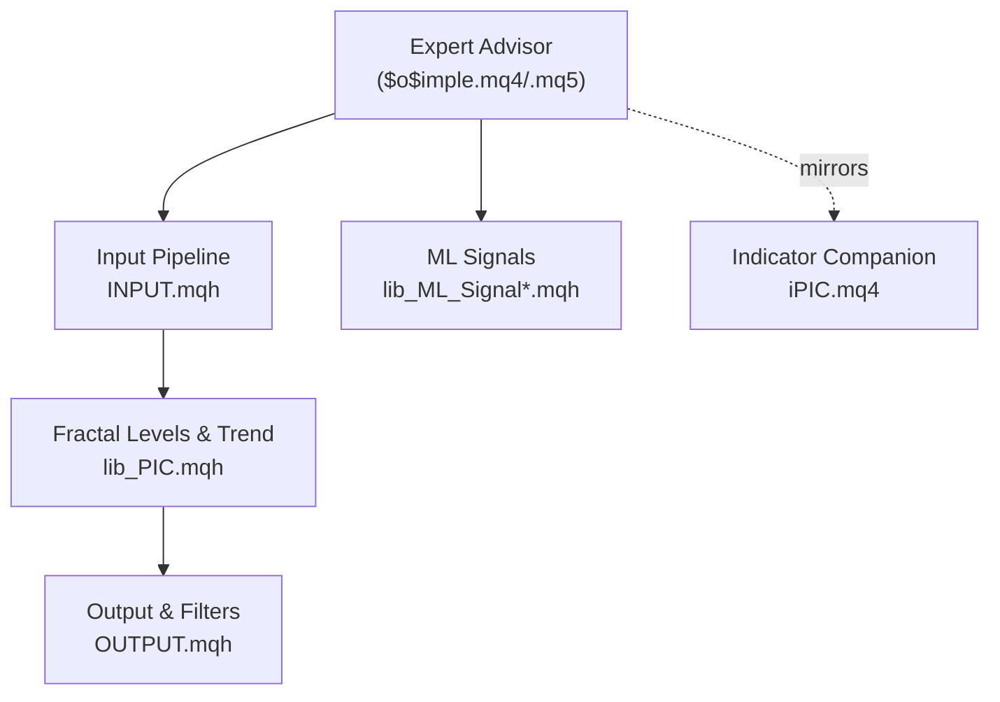
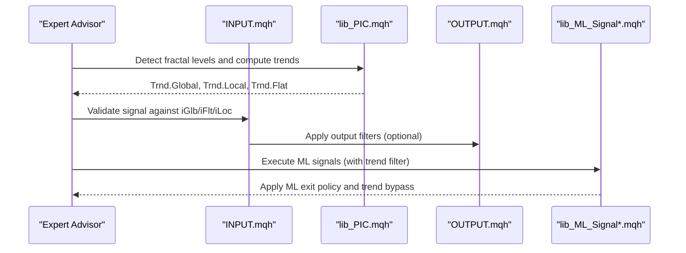
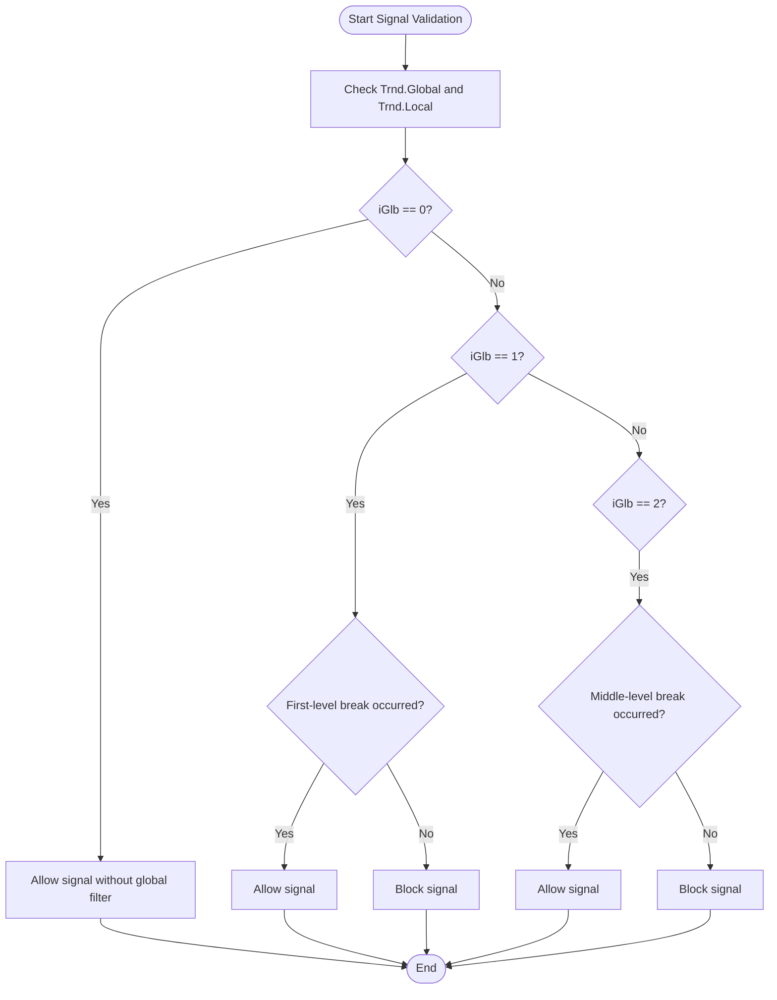
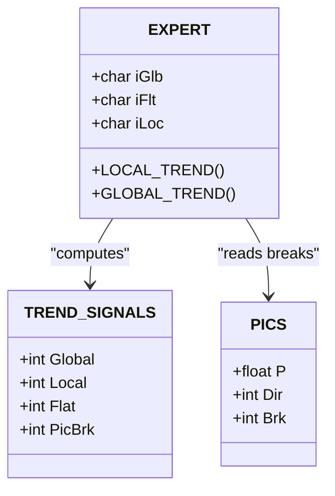
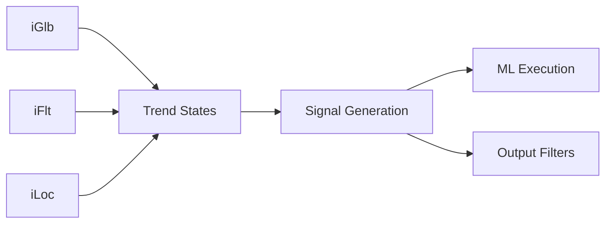

# Trend Signal Parameters

<cite>
**Referenced Files in This Document**
- [$o$imple.mq4](file://MT/MQL4/Experts/$o$imple.mq4)
- [$o$imple.mq5](file://MT/MQL5/Experts/$o$imple.mq5)
- [INPUT.mqh](file://MT/MQL4/Include/INPUT.mqh)
- [INPUT.mqh](file://MT/MQL5/Include/INPUT.mqh)
- [MAIN.mqh](file://MT/MQL4/Include/MAIN.mqh)
- [MAIN.mqh](file://MT/MQL5/Include/MAIN.mqh)
- [lib_PIC.mqh](file://MT/MQL4/Include/lib_PIC.mqh)
- [OUTPUT.mqh](file://MT/MQL4/Include/OUTPUT.mqh)
- [lib_ML_Signal.mqh](file://MT/MQL4/Include/lib_ML_Signal.mqh)
- [lib_ML_Signal.mqh](file://MT/MQL5/Include/lib_ML_Signal.mqh)
- [lib_ML_Signal_TB.mqh](file://MT/MQL4/Include/lib_ML_Signal_TB.mqh)
- [lib_ML_Signal_TB.mqh](file://MT/MQL5/Include/lib_ML_Signal_TB.mqh)
- [iPIC.mq4](file://MT/MQL4/Indicators/iPIC.mq4)
- [$o$imple.ini](file://MT/tester/$o$imple.ini)
</cite>

## Table of Contents
1. [Introduction](#introduction)
2. [Project Structure](#project-structure)
3. [Core Components](#core-components)
4. [Architecture Overview](#architecture-overview)
5. [Detailed Component Analysis](#detailed-component-analysis)
6. [Dependency Analysis](#dependency-analysis)
7. [Performance Considerations](#performance-considerations)
8. [Troubleshooting Guide](#troubleshooting-guide)
9. [Conclusion](#conclusion)

## Introduction
This document explains the trend signal parameter configuration for the SoSimple expert advisor, focusing on three critical parameters that govern trend validation and reversal detection:
- iGlb (0–2): Global trend validation mode using fractal levels
- iFlt (0–1): Flat exit validation mechanism
- iLoc (0–3): Local trend change requirements based on broken fractal counts

These parameters integrate tightly with the fractal-based level detection system to validate trend reversals, influence false signal rates, and guide optimal settings across different timeframes and market regimes. We also provide practical examples of parameter combinations for trend-following versus counter-trend strategies and guidance for optimizing these parameters via historical testing.

## Project Structure
The SoSimple expert advisor consists of:
- Expert advisors (MQL4 and MQL5) that expose the trend signal parameters
- Input pipeline that validates signals against global/local trend states
- Fractal-based level detection and trend computation
- Optional ML-driven signal execution with trend filtering
- Indicator companion (iPIC) that mirrors expert parameterization

**Diagram sources**
- [$o$imple.mq4:27-30](file://MT/MQL4/Experts/$o$imple.mq4#L27-L30)
- [$o$imple.mq5:26-30](file://MT/MQL5/Experts/$o$imple.mq5#L26-L30)
- [INPUT.mqh:3-11](file://MT/MQL4/Include/INPUT.mqh#L3-L11)
- [lib_PIC.mqh:564-576](file://MT/MQL4/Include/lib_PIC.mqh#L564-L576)
- [OUTPUT.mqh:13-15](file://MT/MQL4/Include/OUTPUT.mqh#L13-L15)
- [lib_ML_Signal.mqh:195-211](file://MT/MQL4/Include/lib_ML_Signal.mqh#L195-L211)
- [iPIC.mq4:22-25](file://MT/MQL4/Indicators/iPIC.mq4#L22-L25)

**Section sources**
- [$o$imple.mq4:19-30](file://MT/MQL4/Experts/$o$imple.mq4#L19-L30)
- [$o$imple.mq5:18-30](file://MT/MQL5/Experts/$o$imple.mq5#L18-L30)
- [INPUT.mqh:3-11](file://MT/MQL4/Include/INPUT.mqh#L3-L11)
- [lib_PIC.mqh:564-576](file://MT/MQL4/Include/lib_PIC.mqh#L564-L576)
- [OUTPUT.mqh:13-15](file://MT/MQL4/Include/OUTPUT.mqh#L13-L15)
- [lib_ML_Signal.mqh:195-211](file://MT/MQL4/Include/lib_ML_Signal.mqh#L195-L211)
- [iPIC.mq4:22-25](file://MT/MQL4/Indicators/iPIC.mq4#L22-L25)

## Core Components
- iGlb (Global trend validation):
  - 0: No global filter
  - 1: Global trend validated by breaking first-level fractals
  - 2: Global trend validated by breaking middle-level fractals
- iFlt (Flat exit validation):
  - 0: Standard trend validation
  - 1: Exit validated against flat phase (opposite-direction entry filter)
- iLoc (Local trend change requirements):
  - 0: Immediate trend change on any break
  - 1–3: Requires N consecutive broken fractals to flip local trend

These parameters are exposed in both MQL4 and MQL5 experts and mirrored in the indicator companion.

**Section sources**
- [$o$imple.mq4:27-30](file://MT/MQL4/Experts/$o$imple.mq4#L27-L30)
- [$o$imple.mq5:26-30](file://MT/MQL5/Experts/$o$imple.mq5#L26-L30)
- [iPIC.mq4:22-25](file://MT/MQL4/Indicators/iPIC.mq4#L22-L25)

## Architecture Overview
The trend signal validation pipeline integrates fractal detection with global/local trend states and optional ML execution:

**Diagram sources**
- [INPUT.mqh:3-11](file://MT/MQL4/Include/INPUT.mqh#L3-L11)
- [lib_PIC.mqh:564-576](file://MT/MQL4/Include/lib_PIC.mqh#L564-L576)
- [OUTPUT.mqh:13-15](file://MT/MQL4/Include/OUTPUT.mqh#L13-L15)
- [lib_ML_Signal.mqh:195-211](file://MT/MQL4/Include/lib_ML_Signal.mqh#L195-L211)

## Detailed Component Analysis

### iGlb: Global Trend Validation Modes
- Mode 0: No global filter; signals proceed regardless of global trend state
- Mode 1: Global trend requires a break of first-level fractals (HI/LO) to flip
- Mode 2: Global trend requires a break of middle-level fractals (HI2/LO2) to flip

The expert checks global/local trend states before generating signals:
- Signal allowed only when the current order type aligns with global and local trend states

**Diagram sources**
- [INPUT.mqh:9-10](file://MT/MQL4/Include/INPUT.mqh#L9-L10)
- [lib_PIC.mqh:544-549](file://MT/MQL4/Include/lib_PIC.mqh#L544-L549)

**Section sources**
- [INPUT.mqh:9-10](file://MT/MQL4/Include/INPUT.mqh#L9-L10)
- [lib_PIC.mqh:544-549](file://MT/MQL4/Include/lib_PIC.mqh#L544-L549)

### iFlt: Flat Exit Validation
- Mode 0: Standard validation
- Mode 1: Exit validated against flat phase; opposite-direction entries are filtered out during flat periods

This reduces false signals during consolidation by incorporating flat phase awareness into local trend flips.

**Section sources**
- [lib_PIC.mqh:574-576](file://MT/MQL4/Include/lib_PIC.mqh#L574-L576)

### iLoc: Local Trend Change Requirements
- 0: Any single break flips local trend immediately
- 1–3: Requires N consecutive broken fractals to flip local trend

Higher values increase robustness against noise but may delay trend entry.

**Section sources**
- [lib_PIC.mqh:571-573](file://MT/MQL4/Include/lib_PIC.mqh#L571-L573)

### Interaction with Fractal Analysis
The expert computes global/local trend states from fractal breaks:
- Global trend flips when first/middle levels are broken (depending on iGlb)
- Local trend flips when the number of broken levels meets iLoc threshold
- Flat exit validation (iFlt) further refines when trend flips occur during flat phases

**Diagram sources**
- [lib_PIC.mqh:564-576](file://MT/MQL4/Include/lib_PIC.mqh#L564-L576)
- [MAIN.mqh:32-35](file://MT/MQL4/Include/MAIN.mqh#L32-L35)

**Section sources**
- [lib_PIC.mqh:564-576](file://MT/MQL4/Include/lib_PIC.mqh#L564-L576)
- [MAIN.mqh:32-35](file://MT/MQL4/Include/MAIN.mqh#L32-L35)

### Impact on False Signal Rates
- Higher iLoc thresholds reduce false signals by requiring multiple confirmatory breaks
- iFlt mode 1 suppresses entries during flat phases, lowering whipsaw risk
- iGlb modes 1/2 increase robustness by anchoring trend flips to stronger fractal breaks

**Section sources**
- [lib_PIC.mqh:571-576](file://MT/MQL4/Include/lib_PIC.mqh#L571-L576)

### Parameter Combinations: Trend Following vs Counter-Trend
- Trend-following emphasis:
  - iGlb = 1 or 2 (require strong break confirmation)
  - iFlt = 0 (standard validation)
  - iLoc = 2 or 3 (delayed trend flip for robustness)
- Counter-trend emphasis:
  - iGlb = 0 (no global filter)
  - iFlt = 1 (exit filter during flat phases)
  - iLoc = 0 or 1 (quick trend flip sensitivity)

These combinations balance responsiveness and reliability depending on strategy preference.

**Section sources**
- [$o$imple.mq4:27-30](file://MT/MQL4/Experts/$o$imple.mq4#L27-L30)
- [$o$imple.mq5:26-30](file://MT/MQL5/Experts/$o$imple.mq5#L26-L30)
- [lib_PIC.mqh:571-576](file://MT/MQL4/Include/lib_PIC.mqh#L571-L576)

### Optimal Settings Across Timeframes and Market Conditions
- Higher timeframe (H1+):
  - Prefer iGlb = 1 or 2 for stronger break validation
  - iLoc = 2–3 to reduce noise
  - iFlt = 0 or 1 depending on volatility
- Lower timeframe (M15–M30):
  - iGlb = 1 with iLoc = 1–2 for quicker reactions
  - iFlt = 1 to avoid false breakouts during consolidation
- Sideways markets:
  - iFlt = 1 strongly recommended
  - iLoc ≥ 2 to avoid premature flips
- Strong trending markets:
  - iGlb = 1 or 2
  - iLoc = 1–2 to stay responsive

**Section sources**
- [iPIC.mq4:22-25](file://MT/MQL4/Indicators/iPIC.mq4#L22-L25)
- [lib_PIC.mqh:571-576](file://MT/MQL4/Include/lib_PIC.mqh#L571-L576)

### Historical Testing Guidance
- Use the tester configuration to sweep parameter ranges:
  - iGlb ∈ {0,1,2}, iFlt ∈ {0,1}, iLoc ∈ {0,1,2,3}
- Track:
  - Win rate, expectancy, drawdown, and number of trades
- Validate on multiple instruments/timeframes to ensure robustness
- The tester configuration file demonstrates parameter grid structure and defaults

**Section sources**
- [$o$imple.ini:97-112](file://MT/tester/$o$imple.ini#L97-L112)

## Dependency Analysis
The trend signal parameters depend on:
- Fractal detection and level breaks (lib_PIC.mqh)
- Global/local trend computation
- Output filters and ML execution policies

**Diagram sources**
- [lib_PIC.mqh:564-576](file://MT/MQL4/Include/lib_PIC.mqh#L564-L576)
- [INPUT.mqh:3-11](file://MT/MQL4/Include/INPUT.mqh#L3-L11)
- [lib_ML_Signal.mqh:195-211](file://MT/MQL4/Include/lib_ML_Signal.mqh#L195-L211)
- [OUTPUT.mqh:13-15](file://MT/MQL4/Include/OUTPUT.mqh#L13-L15)

**Section sources**
- [lib_PIC.mqh:564-576](file://MT/MQL4/Include/lib_PIC.mqh#L564-L576)
- [INPUT.mqh:3-11](file://MT/MQL4/Include/INPUT.mqh#L3-L11)
- [lib_ML_Signal.mqh:195-211](file://MT/MQL4/Include/lib_ML_Signal.mqh#L195-L211)
- [OUTPUT.mqh:13-15](file://MT/MQL4/Include/OUTPUT.mqh#L13-L15)

## Performance Considerations
- iLoc increases computational overhead slightly due to counting consecutive breaks
- iGlb modes 1/2 require additional checks against middle-level breaks
- iFlt adds flat-phase detection logic, minimal cost but improves signal quality

[No sources needed since this section provides general guidance]

## Troubleshooting Guide
- Signals not triggering:
  - Verify iGlb alignment with current global trend state
  - Confirm iLoc threshold is not too high for the current volatility
- Excessive whipsaws:
  - Enable iFlt = 1 during consolidation
  - Reduce iLoc to 0 or 1 for lower timeframes
- Overly conservative signals:
  - Switch iGlb to 0 or reduce iLoc
  - Ensure global trend is not blocking valid entries

**Section sources**
- [INPUT.mqh:9-10](file://MT/MQL4/Include/INPUT.mqh#L9-L10)
- [lib_PIC.mqh:571-576](file://MT/MQL4/Include/lib_PIC.mqh#L571-L576)

## Conclusion
The iGlb, iFlt, and iLoc parameters form a powerful trio for controlling trend signal validation in SoSimple. By tuning these parameters—especially in combination with fractal-based trend computation—you can tailor the system for robust trend-following or responsive counter-trend strategies. Historical testing across instruments and timeframes is essential to find optimal settings for specific market conditions.