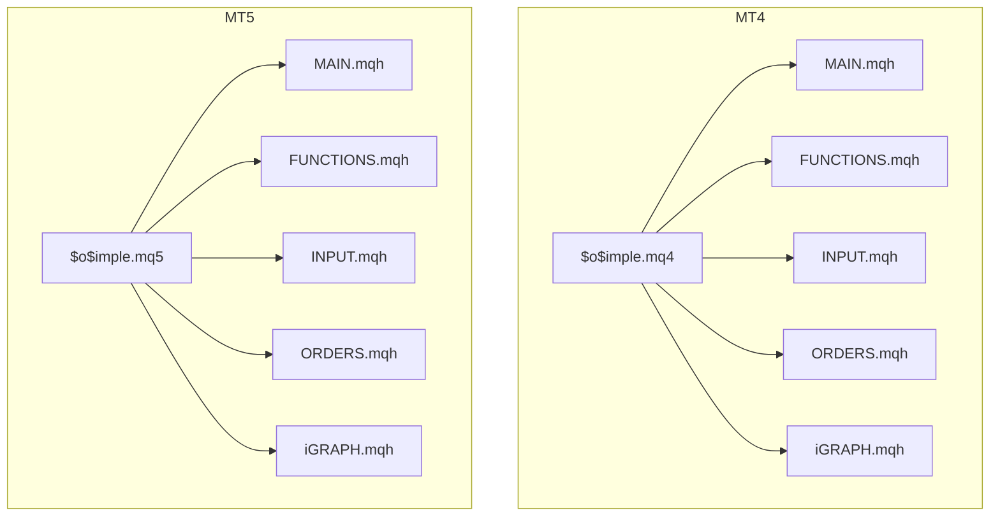
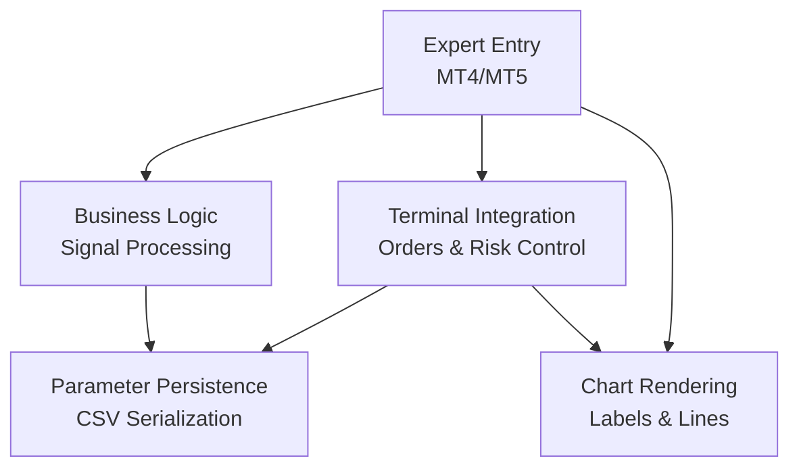
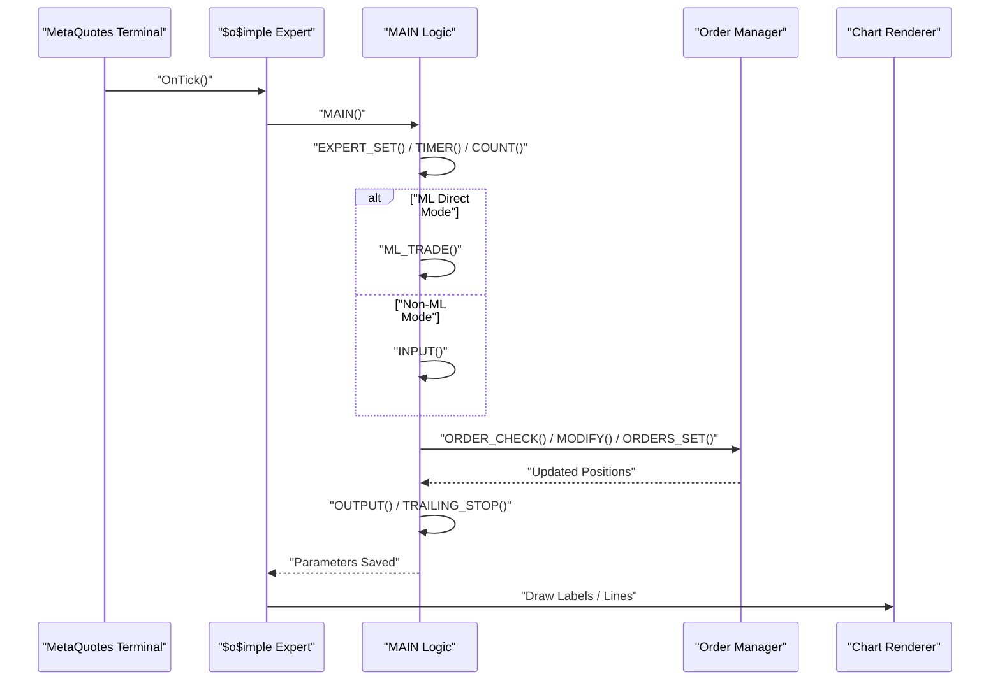
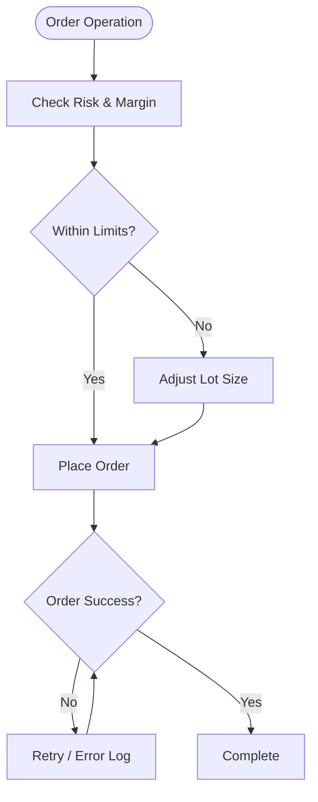
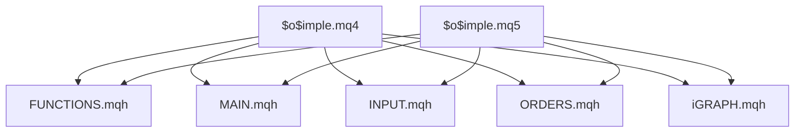

# Platform Integration

<cite>
**Referenced Files in This Document**
- [$o$imple.mq4](file://MT/MQL4/Experts/$o$imple.mq4)
- [$o$imple.mq5](file://MT/MQL5/Experts/$o$imple.mq5)
- [FUNCTIONS.mqh](file://MT/MQL4/Include/FUNCTIONS.mqh)
- [FUNCTIONS.mqh](file://MT/MQL5/Include/FUNCTIONS.mqh)
- [INPUT.mqh](file://MT/MQL4/Include/INPUT.mqh)
- [INPUT.mqh](file://MT/MQL5/Include/INPUT.mqh)
- [MAIN.mqh](file://MT/MQL4/Include/MAIN.mqh)
- [MAIN.mqh](file://MT/MQL5/Include/MAIN.mqh)
- [ORDERS.mqh](file://MT/MQL4/Include/ORDERS.mqh)
- [ORDERS.mqh](file://MT/MQL5/Include/ORDERS.mqh)
- [iGRAPH.mqh](file://MT/MQL4/Include/iGRAPH.mqh)
- [iGRAPH.mqh](file://MT/MQL5/Include/iGRAPH.mqh)
</cite>

## Table of Contents
1. [Introduction](#introduction)
2. [Project Structure](#project-structure)
3. [Core Components](#core-components)
4. [Architecture Overview](#architecture-overview)
5. [Detailed Component Analysis](#detailed-component-analysis)
6. [Dependency Analysis](#dependency-analysis)
7. [Performance Considerations](#performance-considerations)
8. [Troubleshooting Guide](#troubleshooting-guide)
9. [Conclusion](#conclusion)

## Introduction
This document provides comprehensive technical documentation for the MetaTrader platform integration in the SoSimple expert advisor. It covers the compilation process, property declarations, platform-specific optimizations, integration with MetaQuotes terminal features, file system operations for CSV data exchange, and real-time data processing capabilities. It also details platform-specific features such as chart integration, indicator display, and performance monitoring, along with practical guidance for expert advisor deployment, parameter persistence, and troubleshooting platform integration issues. Differences between MT4 and MT5 implementations and migration considerations are addressed.

## Project Structure
The SoSimple expert advisor is implemented for both MetaQuotes MT4 and MT5 platforms, with shared logic encapsulated in reusable header files. The structure separates concerns into:
- Expert entry points for MT4 and MT5
- Shared function libraries for platform-independent logic
- Order management and risk control modules
- Chart and indicator rendering utilities
- Parameter persistence and CSV-based configuration

**Diagram sources**
- [$o$imple.mq4:123-149](file://MT/MQL4/Experts/$o$imple.mq4#L123-L149)
- [$o$imple.mq5:137-147](file://MT/MQL5/Experts/$o$imple.mq5#L137-L147)
- [MAIN.mqh:112-145](file://MT/MQL4/Include/MAIN.mqh#L112-L145)
- [FUNCTIONS.mqh:115-202](file://MT/MQL4/Include/FUNCTIONS.mqh#L115-L202)
- [INPUT.mqh:3-54](file://MT/MQL4/Include/INPUT.mqh#L3-L54)
- [ORDERS.mqh:5-13](file://MT/MQL4/Include/ORDERS.mqh#L5-L13)
- [iGRAPH.mqh:119-124](file://MT/MQL4/Include/iGRAPH.mqh#L119-L124)

**Section sources**
- [$o$imple.mq4:1-149](file://MT/MQL4/Experts/$o$imple.mq4#L1-L149)
- [$o$imple.mq5:1-157](file://MT/MQL5/Experts/$o$imple.mq5#L1-L157)

## Core Components
This section outlines the primary building blocks of the SoSimple expert advisor and their roles in platform integration.

- Expert Entry Points
  - MT4: Defines properties, external inputs, global variables, and the OnTick event loop.
  - MT5: Mirrors MT4 structure with input definitions and OnTick event loop, plus a synchronization function for input mapping.

- Shared Function Library
  - Provides template utilities, time helpers, order type constants, and a base class hierarchy for expert logic, including parameter persistence and CSV-based configuration.

- Input Processing
  - Handles signal generation, trade sizing, stop/limit placement, and profit targets based on configurable parameters.

- Order Management
  - Implements risk control, lot sizing via money management, order creation/modification/deletion, and global order coordination across multiple experts.

- Chart and Indicator Rendering
  - Offers drawing primitives for labels, arrows, trend lines, rectangles, and chart customization for real-time visualization.

- Parameter Persistence
  - Serializes expert parameters to CSV for persistence and retrieval, enabling deployment across sessions and environments.

**Section sources**
- [FUNCTIONS.mqh:99-202](file://MT/MQL4/Include/FUNCTIONS.mqh#L99-L202)
- [INPUT.mqh:3-54](file://MT/MQL4/Include/INPUT.mqh#L3-L54)
- [ORDERS.mqh:5-13](file://MT/MQL4/Include/ORDERS.mqh#L5-L13)
- [iGRAPH.mqh:119-124](file://MT/MQL4/Include/iGRAPH.mqh#L119-L124)
- [MAIN.mqh:112-145](file://MT/MQL4/Include/MAIN.mqh#L112-L145)

## Architecture Overview
The SoSimple expert advisor follows a layered architecture:
- Presentation Layer: Chart rendering and user feedback
- Business Logic Layer: Signal processing, trade decisions, and parameter persistence
- Data Access Layer: CSV-based configuration and terminal data feeds
- Integration Layer: Terminal order management and risk controls

**Diagram sources**
- [$o$imple.mq4:123-149](file://MT/MQL4/Experts/$o$imple.mq4#L123-L149)
- [$o$imple.mq5:137-147](file://MT/MQL5/Experts/$o$imple.mq5#L137-L147)
- [MAIN.mqh:112-145](file://MT/MQL4/Include/MAIN.mqh#L112-L145)
- [ORDERS.mqh:5-13](file://MT/MQL4/Include/ORDERS.mqh#L5-L13)
- [iGRAPH.mqh:119-124](file://MT/MQL4/Include/iGRAPH.mqh#L119-L124)

## Detailed Component Analysis

### Expert Entry Points and Compilation
- MT4 Expert
  - Declares properties for copyright, link, and version.
  - Defines external inputs and global variables for runtime configuration.
  - Implements OnTick to process each bar, update statistics, execute trading logic, and persist parameters.
  - Includes a recalculation routine for historical bars.

- MT5 Expert
  - Mirrors MT4 structure with input definitions and OnTick event loop.
  - Adds a synchronization function to map MT5 inputs to internal parameters.
  - Uses RefreshRates for price arrays and includes compatibility headers.

**Diagram sources**
- [$o$imple.mq4:123-149](file://MT/MQL4/Experts/$o$imple.mq4#L123-L149)
- [$o$imple.mq5:137-147](file://MT/MQL5/Experts/$o$imple.mq5#L137-L147)
- [MAIN.mqh:117-143](file://MT/MQL4/Include/MAIN.mqh#L117-L143)
- [ORDERS.mqh:5-13](file://MT/MQL4/Include/ORDERS.mqh#L5-L13)
- [iGRAPH.mqh:119-124](file://MT/MQL4/Include/iGRAPH.mqh#L119-L124)

**Section sources**
- [$o$imple.mq4:1-149](file://MT/MQL4/Experts/$o$imple.mq4#L1-L149)
- [$o$imple.mq5:1-157](file://MT/MQL5/Experts/$o$imple.mq5#L1-L157)

### Property Declarations and Platform-Specific Optimizations
- Properties
  - Versioning and metadata are declared via compiler directives.
  - Strict mode enables enhanced error checking during compilation.

- Platform Differences
  - MT5 introduces RefreshRates for price arrays and a synchronization function to map inputs to internal parameters.
  - MT5 includes compatibility headers for MQL4 constructs.

- Optimizations
  - Template utilities and helper functions minimize repeated code.
  - Risk control and margin checks prevent overexposure.
  - Parameter persistence reduces reconfiguration overhead.

**Section sources**
- [$o$imple.mq4:1-8](file://MT/MQL4/Experts/$o$imple.mq4#L1-L8)
- [$o$imple.mq5:1-11](file://MT/MQL5/Experts/$o$imple.mq5#L1-L11)
- [MAIN.mqh:112-145](file://MT/MQL4/Include/MAIN.mqh#L112-L145)

### Integration with MetaQuotes Terminal Features
- Order Management
  - Centralized order creation, modification, and deletion with retry logic and error handling.
  - Risk-aware lot sizing and margin checks to prevent excessive exposure.
  - Global order coordination across multiple experts using shared variables.

- Terminal Data Feeds
  - Price updates via RefreshRates (MT5) and MarketInfo queries.
  - Stop level and spread calculations for precise order placement.

- Error Handling and Retries
  - Robust error detection and retry mechanisms for order operations.
  - Graceful degradation when terminal resources are unavailable.

**Diagram sources**
- [ORDERS.mqh:5-13](file://MT/MQL4/Include/ORDERS.mqh#L5-L13)
- [ORDERS.mqh:184-322](file://MT/MQL4/Include/ORDERS.mqh#L184-L322)

**Section sources**
- [ORDERS.mqh:5-13](file://MT/MQL4/Include/ORDERS.mqh#L5-L13)
- [ORDERS.mqh:184-322](file://MT/MQL4/Include/ORDERS.mqh#L184-L322)

### File System Operations for CSV Data Exchange
- Parameter Persistence
  - Expert parameters are serialized to CSV for persistence across sessions.
  - CSV-based configuration supports deployment flexibility and environment portability.

- Real-Time Logging
  - Optional CSV logging for real-time events and trades during live operation.

- CSV Loading
  - Expert selection and parameter loading from CSV rows enable dynamic configuration per symbol or timeframe.

**Section sources**
- [MAIN.mqh:151-199](file://MT/MQL4/Include/MAIN.mqh#L151-L199)
- [iGRAPH.mqh:85-95](file://MT/MQL4/Include/iGRAPH.mqh#L85-L95)

### Real-Time Data Processing Capabilities
- Tick Processing
  - OnTick triggers per-bar processing, ensuring timely execution of trading logic.
  - Time-based filters and session controls prevent trading outside configured windows.

- Signal Generation
  - Configurable signal types and thresholds drive trade decisions.
  - Dynamic stop/limit/target calculation based on volatility and market conditions.

- Performance Monitoring
  - Built-in reporting and logging for operational visibility.
  - Chart overlays provide immediate feedback on signals and positions.

**Section sources**
- [INPUT.mqh:3-54](file://MT/MQL4/Include/INPUT.mqh#L3-L54)
- [MAIN.mqh:117-143](file://MT/MQL4/Include/MAIN.mqh#L117-L143)
- [iGRAPH.mqh:252-273](file://MT/MQL4/Include/iGRAPH.mqh#L252-L273)

### Platform-Specific Features: Chart Integration, Indicator Display, and Performance Monitoring
- Chart Integration
  - Drawing primitives for labels, arrows, trend lines, and rectangles.
  - Chart customization options for appearance and overlay behavior.

- Indicator Display
  - Visual indicators for support/resistance levels, trend signals, and trade zones.
  - Dynamic updates synchronized with price action.

- Performance Monitoring
  - Real-time parameter labeling on charts.
  - Logging and reporting for operational transparency.

**Section sources**
- [iGRAPH.mqh:119-124](file://MT/MQL4/Include/iGRAPH.mqh#L119-L124)
- [iGRAPH.mqh:252-273](file://MT/MQL4/Include/iGRAPH.mqh#L252-L273)
- [iGRAPH.mqh:289-328](file://MT/MQL4/Include/iGRAPH.mqh#L289-L328)

### Practical Guidance: Deployment, Parameter Persistence, and Troubleshooting
- Deployment
  - Compile for MT4 or MT5 depending on target platform.
  - Place compiled expert in the appropriate Experts folder within the MetaQuotes installation directory.
  - Configure inputs and CSV parameters according to strategy requirements.

- Parameter Persistence
  - Use CSV serialization to persist expert parameters across sessions.
  - Validate parameter ranges and defaults before deployment.

- Troubleshooting
  - Review error logs and retry mechanisms for failed order operations.
  - Verify risk limits and margin availability to prevent order rejections.
  - Confirm CSV file accessibility and correct formatting for parameter loading.

**Section sources**
- [MAIN.mqh:151-199](file://MT/MQL4/Include/MAIN.mqh#L151-L199)
- [ORDERS.mqh:184-322](file://MT/MQL4/Include/ORDERS.mqh#L184-L322)

### Differences Between MT4 and MT5 Implementations and Migration Considerations
- MT5 Enhancements
  - RefreshRates for price arrays and improved market data access.
  - Synchronization function to map MT5 inputs to internal parameters.
  - Compatibility headers for MQL4 constructs.

- Migration Considerations
  - Replace MarketInfo calls with RefreshRates where applicable.
  - Ensure proper input mapping using the synchronization function.
  - Validate chart rendering APIs and drawing primitives compatibility.

**Section sources**
- [$o$imple.mq5:101-111](file://MT/MQL5/Experts/$o$imple.mq5#L101-L111)
- [$o$imple.mq5:137-147](file://MT/MQL5/Experts/$o$imple.mq5#L137-L147)
- [iGRAPH.mqh:119-137](file://MT/MQL5/Include/iGRAPH.mqh#L119-L137)

## Dependency Analysis
The expert advisor relies on a modular dependency structure that promotes reuse and maintainability.

**Diagram sources**
- [$o$imple.mq4:100-122](file://MT/MQL4/Experts/$o$imple.mq4#L100-L122)
- [$o$imple.mq5:117-135](file://MT/MQL5/Experts/$o$imple.mq5#L117-L135)
- [FUNCTIONS.mqh:115-202](file://MT/MQL4/Include/FUNCTIONS.mqh#L115-L202)
- [MAIN.mqh:112-145](file://MT/MQL4/Include/MAIN.mqh#L112-L145)
- [INPUT.mqh:3-54](file://MT/MQL4/Include/INPUT.mqh#L3-L54)
- [ORDERS.mqh:5-13](file://MT/MQL4/Include/ORDERS.mqh#L5-L13)
- [iGRAPH.mqh:119-124](file://MT/MQL4/Include/iGRAPH.mqh#L119-L124)

**Section sources**
- [$o$imple.mq4:100-122](file://MT/MQL4/Experts/$o$imple.mq4#L100-L122)
- [$o$imple.mq5:117-135](file://MT/MQL5/Experts/$o$imple.mq5#L117-L135)

## Performance Considerations
- Efficient Tick Processing
  - Minimize redundant calculations within OnTick by caching frequently accessed data.
  - Use template utilities to avoid repeated type conversions.

- Risk Control
  - Implement conservative risk limits to prevent margin exhaustion.
  - Monitor account balance changes and adjust position sizes accordingly.

- Chart Rendering
  - Limit the number of drawn objects to maintain chart responsiveness.
  - Use selective printing based on optimization mode and real-time flags.

[No sources needed since this section provides general guidance]

## Troubleshooting Guide
Common issues and resolutions:
- Order Rejection
  - Verify risk limits and margin availability before placing orders.
  - Check stop level proximity and spread-adjusted pricing.

- Parameter Loading Failures
  - Validate CSV file formatting and accessibility.
  - Ensure parameter ranges match expected types and bounds.

- Chart Rendering Issues
  - Confirm drawing permissions and object limits.
  - Use selective printing to avoid overwhelming the chart.

**Section sources**
- [ORDERS.mqh:184-322](file://MT/MQL4/Include/ORDERS.mqh#L184-L322)
- [MAIN.mqh:151-199](file://MT/MQL4/Include/MAIN.mqh#L151-L199)
- [iGRAPH.mqh:75-82](file://MT/MQL4/Include/iGRAPH.mqh#L75-L82)

## Conclusion
The SoSimple expert advisor demonstrates robust MetaTrader platform integration through a modular architecture, comprehensive order management, and rich chart visualization. Its dual-platform support for MT4 and MT5, combined with CSV-based parameter persistence and real-time data processing, provides a flexible foundation for deploying and maintaining automated trading strategies across diverse market conditions.